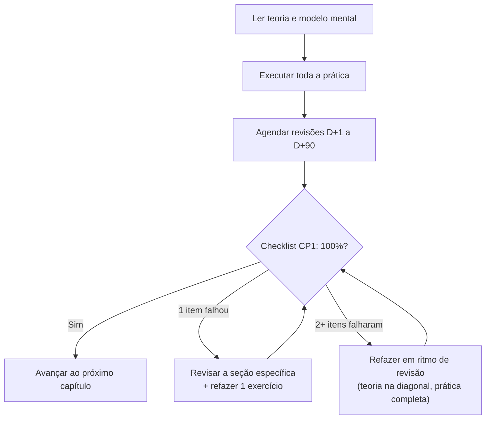

# 00.01 — Como usar o Manual Mestre

> **Módulo 00 — Introdução** · Nível: N1 · Tempo estimado: 1h15 · Código: — (primeiro código em 00.03; ver `DECISOES.md` D-002)

## 1. Objetivo

- **Explicar** a trilha do manual: fases, módulos, capítulos e por que a ordem é inegociável.
- **Descrever** o template de 21 seções e o papel de cada bloco no seu aprendizado.
- **Identificar** os três checkpoints (CP1, CP2, CP3) e o critério objetivo de cada um.
- **Aplicar** as regras de ritmo: no máximo 2 capítulos novos por dia, revisão antes de conteúdo novo, um capítulo aberto por vez.

Ao final, você conseguirá abrir qualquer capítulo do manual sabendo exatamente o que esperar dele, o que ele espera de você e como decidir — com critério, não com sensação — se está pronto para avançar.

---

## 2. Pré-requisitos

Nenhum capítulo anterior: este é o primeiro da trilha. Você só precisa de duas coisas:

- O repositório do Manual Mestre aberto no seu computador (se está lendo isto, provavelmente já tem).
- Disposição para seguir um método que, em alguns momentos, vai pedir que você **desacelere** — e confiança de que isso é deliberado.

**Autoteste:** responda mentalmente antes de seguir. (1) Você sabe onde este arquivo está dentro do repositório? (2) Sabe qual arquivo é a "fonte de verdade" do projeto? (3) Sabe qual é o próximo capítulo depois deste? Se travou em alguma, releia o `README.md` na raiz — ele responde as três em uma tela.

---

## 3. Motivação

Imagine alguém — talvez uma versão passada de você — que estudou programação por oito meses. Assistiu a três cursos em vídeo, leu dezenas de artigos, acompanhou tutoriais que terminavam com um projeto funcionando na tela. Oito meses depois, numa entrevista, ouve: "abre aí um editor e escreve uma função que agrupe estes pedidos por cidade". E a mão trava. O conteúdo passou pelos olhos, mas não ficou nas mãos.

Esse fenômeno tem nome: **ilusão de fluência** (*illusion of fluency*) — a sensação confortável de que você domina algo porque o reconhece quando vê, quando na verdade não consegue reproduzi-lo do zero. Assistir a alguém programar é como assistir a alguém nadar: informativo, mas não te faz nadador.

O problema não era o esforço, era o sistema. Sem ordem que garanta que cada conceito chegue antes de ser necessário, sem prática obrigatória com correção, sem revisão que interrompa o esquecimento e sem um critério objetivo de "estou pronto", qualquer material — por melhor que seja — vira o nono mês daquela história.

Este capítulo resolve isso assim: apresenta o sistema completo do Manual Mestre — trilha, template, prática, revisão e checkpoints — para que, do capítulo 01.01 em diante, você gaste energia aprendendo Python, e não descobrindo como estudar.

---

## 4. Modelo mental

> 🧠 **Modelo mental**
> O Manual Mestre não é um livro que você **lê** — é um sistema que você **opera**. Cada capítulo é uma estação de trabalho com entrada (pré-requisitos), processo (teoria + prática) e inspeção de saída (checklist). Você só envia adiante o que passou na inspeção. Quem opera o sistema honestamente sai do outro lado sabendo; quem só lê, sai do outro lado tendo lido.

**Exercício de previsão.** Sem consultar nada, decida: você termina um capítulo e, no checklist final, marca "não" em dois itens. Segundo o sistema que este manual promete, o que acontece?

- (a) Você anota os itens e segue para o próximo capítulo, para não perder ritmo.
- (b) Você refaz o capítulo inteiro, do zero, porque reprovou.
- (c) Você refaz o capítulo em ritmo de revisão — teoria na diagonal, prática completa — e volta ao checklist.

*Resposta comentada:* (c). O fluxo do CP1 (você o verá na seção 8) nunca pune com "volte à estaca zero" nem perdoa com "siga assim mesmo": ele **redireciona o esforço** para o que falhou e exige nova inspeção. Errar a previsão aqui é um bom sinal — significa que este capítulo tem algo a te ensinar.

---

## 5. Analogia

O Manual Mestre funciona como um **plano de treino de academia montado por um bom treinador**. Existe uma ordem (ninguém agacha com barra carregada na primeira semana), existe progressão de carga (os níveis N1 → N2 → N3), existem séries e repetições (os quatro níveis de prática), existe o descanso programado que faz o músculo crescer (a revisão espaçada) e existe a reavaliação periódica que decide se a carga sobe (os checkpoints). Pular etapas não te faz chegar antes — te machuca e te faz voltar.

**Onde a analogia quebra:** na academia, o treinador observa você e corrige em tempo real. Aqui, quem inspeciona a execução é você mesmo, com os instrumentos que o manual fornece (gabaritos, rubricas, checklists). Isso exige uma honestidade que a analogia não cobra — e é por isso que tantas seções deste manual insistem nela.

---

## 6. Teoria

### A trilha

A **trilha** (*learning path*) é a ordem oficial de estudo: 14 módulos, numerados de `00` a `13`, percorridos em sequência estrita. Os módulos se agrupam em 5 **fases** — Fundamentos, Núcleo Backend, Operação, Dados e Qualidade, Integração. Cada capítulo tem um identificador global `MM.CC`: `06.13` é o capítulo 13 do módulo 06. É assim que os capítulos se citam entre si.

A ordem não é estética: ela é uma ordenação do **grafo de dependências** do conteúdo. O capítulo de FastAPI usa Pydantic, que usa classes, que usam funções, que usam variáveis. Seguir a numeração garante que nenhum conceito chegue antes dos seus pré-requisitos. Por isso a regra: referências ao futuro só aparecem no formato controlado **caixa-preta** (*black box*) — um bloco que diz "por enquanto, trate isto assim; o capítulo X abre a caixa".

### O template de 21 seções

Todo capítulo — este incluído — tem exatamente as mesmas 21 seções, na mesma ordem. Isso não é burocracia: cada seção responde a uma pergunta que o domínio real exige:

| Bloco de seções | Pergunta que responde |
|---|---|
| 1–2 (Objetivo, Pré-requisitos) | O que vou conseguir fazer? Estou pronto para começar? |
| 3–5 (Motivação, Modelo mental, Analogia) | Que problema isso resolve? Como prever o comportamento? |
| 6–8 (Teoria, Funcionamento interno, Visualização) | O que é, por que existe, como funciona? |
| 9–10 (Aplicação prática, Código comentado) | Como faço, passo a passo, com código completo? |
| 11–13 (Erros, Boas práticas, Performance) | Onde todo mundo tropeça? O que fazer e evitar? Quando isso pesa? |
| 14–15 (Mercado, Entrevistas) | Como empresas usam? Como isso cai em entrevista? |
| 16–18 (Exercícios, Desafios, Mini projeto) | Consigo fazer sozinho? |
| 19–21 (Revisão, Checklist, Próximo capítulo) | O que fixar? Posso avançar? Para onde vou? |

### Prática em quatro níveis

Todo assunto passa por **Aquecimento** (executar um conceito recém-visto, 5–10 min), **Aplicação** (combinar conceitos num problema pequeno, 15–30 min), **Desafio** (transferir para situação nova, sem roteiro, 30–90 min) e **Mini projeto** (criar algo completo). As soluções nunca ficam ao lado do enunciado: vivem em arquivos de **gabarito** (*answer key*) separados, e antes delas existem **dicas progressivas** em três níveis. A regra dos 15 minutos: tente por pelo menos 15 minutos antes de abrir a primeira dica.

### Revisão espaçada

Cada capítulo concluído agenda automaticamente quatro revisões: **D+1** (flashcards, ~10 min), **D+7** (questões + reexplicar o modelo mental, ~20 min), **D+30** (exercício transversal, ~30 min) e **D+90** (mexer em código antigo, 45–90 min). A **revisão espaçada** (*spaced repetition*) é o mecanismo que transforma "vi semana passada" em "sei até hoje". Itens vencidos na agenda bloqueiam conteúdo novo — essa é a regra mais contraintuitiva e mais importante do sistema.

### Checkpoints

Três níveis de inspeção, todos com critério objetivo: **CP1** ao fim de cada capítulo (o checklist da seção 20), **CP2** ao fim de cada módulo (simulado com nota de corte) e **CP3** ao fim de cada fase (projeto avaliado por rubrica + simulado acumulativo). A pergunta "posso avançar?" nunca é respondida por sensação.

### O Projeto Atlas

Do módulo 01 até o fim, você constrói um único sistema — o **Atlas**, plataforma da fictícia Aurora Comércio — que cresce a cada módulo e nunca é reescrito do zero. Ele é apresentado em detalhe no capítulo 00.05.

---

## 7. Funcionamento interno

Por dentro, o método é ciência da aprendizagem aplicada — e vale saber, em uma camada honesta de profundidade, por que cada engrenagem existe. A prática obrigatória e os flashcards exploram a **prática de recuperação** (*testing effect*): puxar algo da memória fortalece a memória mais do que reler. O ciclo D+1/D+7/D+30/D+90 explora o **espaçamento**: repetições distribuídas vencem repetições em bloco. O limite de 2 capítulos novos por dia protege contra a ilusão de fluência que a maratona produz. E as dicas progressivas exploram o **efeito de geração**: tentar produzir a resposta, mesmo errando, fixa mais do que receber a resposta pronta. O quadro completo dessas bases está no §4.2 da especificação (`manualMestre_v3.0.md`) — leitura opcional, mas esclarecedora.

---

## 8. Visualização do fluxo

O diagrama abaixo mostra o ciclo de vida de **um capítulo** sob a ótica do CP1 — é o circuito que você repetirá ~200 vezes na trilha:



**Como ler:** o fluxo só tem uma saída — pela direita, com o checklist fechado. As duas rotas de falha não são punição: são redirecionamento de esforço, e ambas retornam ao mesmo portão de inspeção. Note que agendar as revisões acontece **antes** do checklist: revisar não é opcional nem depende de "ter ido bem".

---

## 9. Aplicação prática

Vamos operar o sistema agora, com o repositório aberto. Abra a pasta do manual no VS Code (`Arquivo → Abrir Pasta`). Para ler qualquer arquivo `.md` renderizado, use o atalho de pré-visualização:

```text
Ctrl+Shift+V  (Windows/Linux)   ·   Cmd+Shift+V  (macOS)
```

Agora o tour guiado — abra cada arquivo na ordem e gaste ~1 minuto em cada:

1. `README.md` (raiz) — a visão de 1 tela: o que é o projeto e o estado atual dos módulos.
2. `manualMestre_v3.0.md` — a especificação. Não leia inteira agora; localize o §13 (índice dos 202 capítulos) e o §14 (cronograma). Esses dois são o seu mapa e o seu calendário.
3. `PROGRESSO.md` — seu diário de bordo. É aqui que cada sessão de estudo termina.
4. `Revisoes/agenda.md` — a fila de revisões. Hoje está vazia; a partir do capítulo 01.01 ela nunca mais estará.
5. `00-Introducao/00-visao-do-modulo.md` — a visão do módulo em que você está agora.

> 💡 **Dica**
> Deixe `PROGRESSO.md` e `Revisoes/agenda.md` fixados como abas no VS Code (clique com o botão direito na aba → *Pin*). Eles são o painel de instrumentos da trilha: você os tocará todos os dias.

Por fim, o gesto que inaugura sua trilha: registre esta sessão. Adicione a linha abaixo à tabela "Diário" do `PROGRESSO.md` (ajuste a data):

```text
| 2026-07-30 | 00.01 | novo | em andamento | primeira sessão da trilha |
```

Quando fechar o checklist da seção 20, você voltará lá para trocar "em andamento" por "CP1 ok" — e sentirá a diferença entre *ler sobre* o sistema e *operá-lo*.

---

## 10. Código comentado

Este capítulo não produz código executável — deliberadamente: o ambiente Python só é montado e validado no capítulo 00.03, e este manual não pede que você execute nada antes de ter onde executar com segurança. O primeiro arquivo que você rodará é o script-teste de validação do ambiente, em `00.03 — Preparando o ambiente`. A partir do módulo 01, **todo** capítulo traz nesta seção arquivos completos, espelhados na pasta `codigo/capNN/` do módulo, prontos para rodar sem edição. (Registro formal desta exceção: `DECISOES.md`, entrada D-002.)

---

## 11. Erros comuns

Os erros deste capítulo não são de código — são de **método**. São os três que mais destroem trilhas de estudo autodidata, catalogados no mesmo formato que você verá nos capítulos com código.

### Erro 1 — Maratonar nos dias bons

**Sintoma:** num sábado inspirado, você avança 5 capítulos; na quarta-feira seguinte, não lembra o conteúdo de nenhum e a agenda de revisões virou uma avalanche.
**Causa:** a fluência do momento (acabei de ler, está fresco) mascara que nada foi consolidado; o cérebro precisa de espaçamento e sono para fixar.
**Correção:** respeite o teto de **2 capítulos novos por dia**, mesmo sobrando tempo e vontade. O excedente de energia vai para prática extra e projeto — nunca para conteúdo novo.

> ⚠️ **Atenção**
> Este é o erro mais sedutor da lista, porque no dia ele **parece produtividade**. A conta chega na revisão D+7, quando você descobre que "estudou" 5 capítulos e reteve meio.

### Erro 2 — Ler a solução antes de tentar de verdade

**Sintoma:** você lê o enunciado, pensa "sei mais ou menos como faria", abre o gabarito para "confirmar" — e ao conferir, tudo faz sentido. Semanas depois, num problema parecido, a mão trava de novo.
**Causa:** entender uma solução pronta e produzir uma solução são habilidades diferentes; conferir só exercita a primeira.
**Correção:** a regra dos 15 minutos, sem negociação: 15 minutos de tentativa real (escrevendo, errando) antes da Dica 1. As dicas existem exatamente para que você nunca "precise" pular direto ao gabarito.

### Erro 3 — Tratar o checklist como formalidade

**Sintoma:** ao fim do capítulo, você marca todos os itens em 30 segundos, no embalo, sem verificar nenhum — e o CP2 do módulo reprova em conceitos que o CP1 tinha "aprovado".
**Causa:** o checklist só funciona como instrumento de medição se cada "sim" for testado ("consigo explicar isso agora, em voz alta, sem olhar?"); marcado no automático, ele mede apenas seu otimismo.
**Correção:** para cada pergunta de domínio, faça o teste do sim: explique em voz alta ou execute de fato. Um "não" honesto custa 20 minutos de revisão dirigida; um "sim" falso custa um módulo refeito.

---

## 12. Boas práticas

✅ **Estude com o repositório aberto no VS Code, não com arquivos avulsos** — o manual foi desenhado para navegação por links relativos e pastas; fora dele, você perde exercícios, gabaritos e agenda.

✅ **Termine toda sessão atualizando `PROGRESSO.md`** — 2 minutos de registro criam o histórico que reconstrói sua confiança e alimentam a agenda de revisões.

✅ **Trate as revisões vencidas como credor impaciente: pague primeiro** — cada dia de atraso enfraquece exatamente a memória que a revisão iria fortalecer.

✅ **Leia as mensagens de erro (e, por ora, os checklists) devagar e por inteiro** — o hábito de ler com calma o que o sistema te diz é a habilidade de depuração em embrião.

❌ **Evite avançar "só para ver como é" além de 1 capítulo à frente de um checkpoint pendente** — curiosidade é bem-vinda, mas base podre compromete tudo que se constrói sobre ela.

❌ **Evite estudar capítulos novos aos domingos** — o descanso está no cronograma porque a consolidação de memória também acontece dormindo; domingo produtivo é domingo descansado.

❌ **Evite reordenar a trilha por interesse ("vou logo para FastAPI")** — a ordem é um grafo de dependências, não uma sugestão; o capítulo 06.01 pressupõe ~80 capítulos de fundação.

---

## 13. Performance

Nesta escala — um capítulo introdutório sem código — performance computacional é irrelevante, e você saberá quando ela importar (o manual dedica uma seção a isso em todo capítulo, com medições reais a partir dos níveis N2/N3). A única performance que importa aqui é a do estudo: a trilha completa soma ~756 horas e, a 32 h/semana, cabe em ~30 semanas. O número parece grande; dividido pelo sistema — 5 dias de blocos de 5 h + sábado de projeto — ele vira rotina.

---

## 14. Mercado

> 🏢 **Mercado**
> Empresas não contratam "horas de curso assistidas" — contratam capacidade demonstrável. Em processos seletivos de backend e dados, os filtros reais são: código próprio versionado (portfólio com histórico Git), capacidade de explicar decisões técnicas em voz alta e desempenho em desafios práticos cronometrados. O sistema deste manual produz exatamente esses três artefatos: o Atlas com seu histórico de commits, o hábito de reexplicar modelos mentais (revisões D+7) e a prática cronometrada (desafios e simulados). Metodologia de estudo, aqui, não é tema motivacional — é estratégia de empregabilidade.
>
> **Mini-cenário:** na Aurora — a empresa fictícia que você conhecerá no 00.05 —, a gestora de engenharia conta que a última contratação júnior foi decidida entre dois finalistas: um com 6 certificados de cursos, outro com 1 repositório que mostrava 5 meses de commits, um README decente e testes. O segundo assinou o contrato. O seu Atlas está sendo construído para ser esse repositório.

---

## 15. Entrevistas

Perguntas sobre *como você aprende* são padrão em entrevistas de nível júnior — o entrevistador sabe que contratará alguém que precisará aprender rápido no cargo.

**P1. "Como você estrutura seus estudos de uma tecnologia nova?"**
*Resposta esperada:* uma boa resposta cobre: (1) fonte principal única e sequencial (não 5 tutoriais em paralelo); (2) prática obrigatória além da leitura; (3) algum mecanismo de retenção (revisão, flashcards, projeto); (4) um projeto real onde o conhecimento se acumula. Citar este manual e o Atlas, descrevendo o ciclo, é uma resposta forte e verificável.

**P2. "Como você sabe que aprendeu algo de verdade, e não só assistiu?"**
*Resposta esperada:* critérios observáveis: consigo implementar do zero sem consultar; consigo explicar para outra pessoa; consigo depurar quando quebra; consigo adaptar para um caso diferente. (São as perguntas de domínio do CP1 — você as usará ~200 vezes; em entrevista, elas soam como maturidade rara.)

**P3. "Conte sobre algo que você estudou e esqueceu. O que faria diferente?"**
*Resposta esperada:* honestidade + diagnóstico técnico: esqueci porque não revisei/não pratiquei/estudei em maratona; hoje uso revisão espaçada e prática de recuperação. Nomear os mecanismos (sem pedantismo) mostra que a lição virou sistema, não frase.

**Pegadinha clássica: "Você tem quantas horas/certificados de curso?"**
Ela derruba candidatos porque convida a competir na métrica errada: quem responde com orgulho "400 horas!" sinaliza que mede aprendizado por consumo, e o entrevistador experiente desconta isso na hora. A saída forte é redirecionar para evidência: "algumas horas formais, mas o que mostro melhor é meu repositório — cada módulo que estudei virou código com commits e testes".

---

## 16. Exercícios guiados

Enunciados completos (com contexto e dicas, quando houver) em [`exercicios/cap01.md`](exercicios/cap01.md). Tente antes de abrir qualquer gabarito — os gabaritos estão em [`exercicios/gabaritos/cap01.md`](exercicios/gabaritos/cap01.md).

### Aquecimento

- **A1** `[~5 min · identificador MM.CC]` — Decodifique 4 identificadores de capítulo e localize-os no índice §13 da spec.
- **A2** `[~5 min · trilha e fases]` — Associe cada módulo da trilha à sua fase, de memória, e confira.
- **A3** `[~10 min · checkpoints]` — Para 3 situações descritas, diga qual checkpoint (CP1/CP2/CP3) está em jogo e qual a decisão correta.
- **A4** `[~5 min · regras de ritmo]` — Julgue 4 planos de dia de estudo como válidos ou inválidos segundo as regras de ritmo.

### Aplicação

- **AP1** `[~15 min · navegação no repositório]` — Caça ao tesouro: responda 5 perguntas cuja resposta exige abrir os arquivos certos do repositório.
- **AP2** `[~20 min · ciclo de revisão]` — Dado um capítulo concluído em uma data, calcule e escreva as 4 linhas de agenda (D+1/D+7/D+30/D+90) no formato oficial.
- **AP3** `[~15 min · fluxo do CP1]` — Para 3 resultados de checklist diferentes, descreva o caminho exato que o fluxo da seção 8 determina.

---

## 17. Desafios

- **D1** `[~30 min · o sistema como um todo]` — **Explique o método a um colega cético.** Escreva (em `.md` ou papel) um texto de até 20 linhas convencendo um amigo programador — que "estuda vendo vídeo em 2× e nunca revisa" — de por que este sistema retém mais. Regra: cite pelo menos 3 mecanismos do capítulo pelo nome e o que cada um combate. Pesquisa dirigida permitida: §4.2 da spec (`manualMestre_v3.0.md`).

<details><summary>💡 Dica 1 (conceito)</summary>
Quais são os três hábitos do seu amigo que as seções 6 e 11 deste capítulo atacam diretamente?
</details>
<details><summary>💡 Dica 2 (estratégia)</summary>
Estruture como: hábito dele → por que falha (mecanismo da mente) → o que o sistema faz no lugar. Três vezes.
</details>
<details><summary>💡 Dica 3 (esqueleto)</summary>
Parágrafo 1: assistir ≠ saber (ilusão de fluência). Parágrafo 2: reler ≠ reter (prática de recuperação + espaçamento). Parágrafo 3: sensação ≠ critério (checkpoints). Feche com o Atlas como prova concreta.
</details>

---

## 18. Mini projeto

**Painel de voo da sua trilha** `[~45 min]` — antes de decolar, você monta seu instrumento de navegação.

Requisitos numerados:

1. No `PROGRESSO.md`, preencha a seção "Estado atual" e registre a sessão de hoje na tabela Diário (se ainda não fez na seção 9).
2. Crie um arquivo pessoal `meu-plano.md` na raiz do repositório com: (a) sua meta de horas semanais realista; (b) seus blocos de estudo por dia da semana (modelo no §14.3 da spec); (c) a data-alvo do fim da Fase 1, calculada a partir da sua meta.
3. No mesmo arquivo, escreva **com suas palavras** (2–3 linhas cada): o que é o CP1, o que bloqueia conteúdo novo, e qual o teto de capítulos novos por dia — sem consultar o capítulo enquanto escreve; confira depois e corrija por cima, riscando (~~assim~~), não apagando.
4. Agende no seu calendário pessoal (papel ou app) o bloco C diário de revisão (~1 h) da próxima semana.

**Critério de "está bom":** os 4 itens existem e o item 3 sobreviveu à conferência com no máximo 1 correção grave. Este arquivo é seu — o manual não o versiona nem o avalia de novo; mas você o relerá na semana 15 e vai gostar do que isso conta sobre você.

---

## 19. Revisão

**Resumo do capítulo:**

- A trilha é linear porque é um grafo de dependências: cada conceito chega antes de ser necessário; a ordem 00→13 é inegociável.
- Todo capítulo tem as mesmas 21 seções, cada uma respondendo a uma pergunta do domínio real (o que é / como funciona / onde tropeça / como cai em entrevista / consigo fazer?).
- A prática tem 4 níveis (Aquecimento → Aplicação → Desafio → Mini projeto), com gabaritos separados, dicas progressivas e a regra dos 15 minutos.
- A revisão espaçada (D+1/D+7/D+30/D+90) é agendada ao concluir cada capítulo; itens vencidos **bloqueiam** conteúdo novo.
- Avanço é critério, não sensação: CP1 (checklist do capítulo), CP2 (simulado do módulo), CP3 (projeto + simulado da fase).
- Regras de ritmo: máximo 2 capítulos novos/dia, um capítulo aberto por vez, domingo é descanso.
- O Atlas é o projeto único que cresce do módulo 01 ao 13 e vira seu portfólio.

**Flashcards novos** (adicionados a [`revisao/flashcards.md`](revisao/flashcards.md)):

| ID | Frente | Verso |
|---|---|---|
| 00.01-F1 | Sem olhar: quais são os 4 momentos do ciclo de revisão espaçada e o instrumento de cada um? | D+1 flashcards · D+7 questões + reexplicar modelo mental · D+30 exercício transversal · D+90 mexer em código antigo. |
| 00.01-F2 | Explique com suas palavras: por que "assistir e entender" não é "saber"? | (Elaboração) Reconhecer ≠ produzir; a ilusão de fluência confunde familiaridade com domínio — só a prática de recuperação testa produção. |
| 00.01-F3 | Você terminou o dia com tempo sobrando e já fez 2 capítulos novos. O que o sistema manda fazer? | Nada de capítulo novo: o excedente vai para prática extra e projeto (proteção contra ilusão de fluência). |
| 00.01-F4 | Quando usar CP1, CP2 e CP3 — e qual o instrumento de cada um? | (Decisão) CP1 fim de capítulo/checklist · CP2 fim de módulo/simulado com nota de corte · CP3 fim de fase/projeto na rubrica + simulado acumulativo. |
| 00.01-F5 | Preveja: sua agenda de revisões tem 3 itens vencidos e você quer abrir um capítulo novo. O que acontece primeiro? | (Previsão) Os 3 itens vencidos — revisão pendente bloqueia conteúdo novo, sempre. |

**Agendamento:** registre a conclusão no `PROGRESSO.md` e marque as quatro datas (D+1, D+7, D+30, D+90) deste capítulo na [`Revisoes/agenda.md`](../Revisoes/agenda.md).

---

## 20. Checklist

Perguntas de domínio — aplique o teste do sim (conseguiria agora, sem olhar?):

- [ ] Sei explicar *por que a trilha é linear e o que é o grafo de dependências*?
- [ ] Sei explicar *o papel dos 4 níveis de prática e a regra dos 15 minutos*?
- [ ] Sei explicar *o ciclo D+1/D+7/D+30/D+90 e por que revisão vencida bloqueia conteúdo novo*?
- [ ] Sei diferenciar *CP1, CP2 e CP3, com o instrumento e o critério de cada um*?
- [ ] Sei responder *à pergunta de entrevista "como você sabe que aprendeu de verdade?"*?

Itens práticos:

- [ ] Fiz o tour guiado da seção 9 e sei localizar README, spec, `PROGRESSO.md` e `Revisoes/agenda.md`.
- [ ] Registrei a sessão no `PROGRESSO.md`.
- [ ] Fiz os exercícios de Aquecimento e Aplicação (e tentei o Desafio por 15+ min antes das dicas).
- [ ] Completei o mini projeto "Painel de voo" (4 requisitos).
- [ ] Acertei — ou entendi por que errei — o exercício de previsão da seção 4.
- [ ] Agendei as revisões D+1/D+7/D+30/D+90 deste capítulo na agenda.

---

## 21. Próximo capítulo

Você agora sabe **como** vai estudar — mas ainda não olhou o mapa do **o quê**. Ficou deliberadamente em aberto: o que exatamente fazem um backend, um engenheiro de dados e um DevOps? Onde Python, SQL, FastAPI, Docker e as demais tecnologias da trilha se encaixam nesse território — e por que este manual insiste em cobrir os dois lados da fronteira? O próximo capítulo abre o mapa antes de você dar o primeiro passo nele.

→ [00.02 — O mapa do território: dados e backend](02-o-mapa-do-territorio-dados-e-backend.md)

---

*Gerado sob spec 3.0.0*
