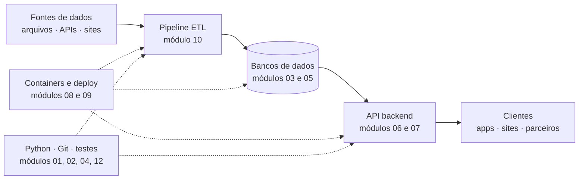

# 00.02 — O mapa do território: dados e backend

> **Módulo 00 — Introdução** · Nível: N1 · Tempo estimado: 1h15 · Código: — (primeiro código em 00.03; ver `DECISOES.md` D-002)

## 1. Objetivo

- **Descrever** os três papéis centrais do território — backend, engenharia de dados e DevOps — e o que cada um entrega.
- **Localizar** cada tecnologia da trilha (Python, SQL, FastAPI, Docker, Pandas, etc.) no lugar do ecossistema em que ela vive.
- **Explicar** por que esta trilha cobre os dois lados da fronteira (backend + dados) e quais vagas isso destrava.
- **Diferenciar** o que a trilha cobre do que ela deliberadamente deixa de fora (frontend, mobile, ciência de dados).

Ao final, você conseguirá olhar qualquer vaga de emprego da área, reconhecer o papel por trás do título e apontar quais módulos da trilha cobrem cada requisito listado.

---

## 2. Pré-requisitos

- [00.01 — Como usar o Manual Mestre](01-como-usar-o-manual-mestre.md)

**Autoteste:** (1) Qual é o teto de capítulos novos por dia? (2) O que acontece quando a agenda de revisões tem itens vencidos? (3) Qual checkpoint fecha um capítulo? Se travou em alguma, revisite as seções 6 e 8 do 00.01 antes de seguir.

---

## 3. Motivação

Abra hoje um site de vagas e procure "desenvolvedor Python". Você vai encontrar anúncios pedindo, no mesmo parágrafo: FastAPI, PostgreSQL, Docker, Airflow, Kafka, AWS, Pandas, Kubernetes, "conhecimento em ETL" e "vivência com microsserviços". Para quem está começando, isso produz uma sensação específica de afogamento: *por onde se começa um oceano?*

O problema não é a quantidade de nomes — é a **falta de mapa**. Sem saber que FastAPI e Pandas vivem em territórios diferentes, que Docker é uma esteira que atravessa todos eles e que ninguém usa tudo ao mesmo tempo, cada vaga parece exigir um super-humano. Com o mapa, a mesma vaga se lê de outro jeito: "ah, isso é backend com um pé em dados; os requisitos 1–4 são o dia a dia, os outros são desejáveis".

Há um segundo custo, mais sutil: sem o mapa, você não consegue avaliar o próprio progresso. "Já sei Python" não significa nada até você saber *para quê* — servir uma API? transformar dados? automatizar infraestrutura? São ofícios diferentes com a mesma linguagem.

Este capítulo resolve isso assim: desenha o território uma única vez — papéis, fronteiras e tecnologias — e mostra onde cada um dos 14 módulos da trilha se encaixa nele. Todos os capítulos seguintes pressupõem este mapa.

---

## 4. Modelo mental

> 🧠 **Modelo mental**
> Todo sistema de software que importa para esta trilha responde a cinco perguntas: onde os dados **nascem**, onde são **guardados**, quem os **transforma**, quem os **serve** e quem mantém a esteira **rodando**. Backend domina o *servir*, engenharia de dados domina o *transformar*, DevOps domina o *rodar* — e os três disputam e compartilham o *guardar*.

**Exercício de previsão.** Um gerente abre o aplicativo da empresa e vê o painel "vendas de ontem por cidade". Sem consultar nada, decida: quais dos três papéis participaram para essa tela existir — e o que cada um fez?

*Resposta comentada:* os três. A engenharia de dados coletou as vendas dos sistemas de origem, transformou e agregou por cidade (o número que aparece foi calculado por ela, provavelmente de madrugada). O backend expôs esse resultado numa API que o aplicativo consulta. O DevOps mantém os servidores, o banco e a esteira de madrugada funcionando — se o painel carregou, é porque nada disso caiu. Se você atribuiu tudo ao backend, este capítulo vai reorganizar seu mapa.

---

## 5. Analogia

O ecossistema funciona como um **restaurante**. O salão e o cardápio são o *frontend* — a parte que o cliente vê. A cozinha é o *backend*: recebe pedidos, executa receitas, devolve pratos. A cadeia de suprimentos é a *engenharia de dados*: seleciona fornecedores, recebe ingredientes brutos, limpa, porciona e deixa tudo pronto na câmara fria para a cozinha usar. E a manutenção predial é o *DevOps*: gás, energia, exaustão — ninguém pensa nela até o fogão apagar no meio do serviço.

**Onde a analogia quebra:** num restaurante, os papéis são pessoas separadas com fronteiras nítidas. Em software — especialmente em empresas menores — a mesma pessoa cozinha, recebe ingredientes e troca o botijão. É exatamente por isso que esta trilha cobre backend **e** dados **e** o essencial de operação: o mercado brasileiro adora o profissional que transita.

---

## 6. Teoria

### Os três papéis

O **backend** (*backend developer*) constrói a parte do sistema que o usuário não vê: recebe requisições de aplicativos e sites, aplica as regras de negócio ("cliente sem crédito não fecha pedido"), lê e grava no banco de dados e devolve respostas. Sua entrega típica é uma **API** (*Application Programming Interface*) — um contrato pelo qual outros sistemas conversam com o seu. Na trilha: módulos 01, 04, 05, 06, 07 e 12 são o coração desse ofício.

A **engenharia de dados** (*data engineering*) constrói as esteiras que movem e preparam dados: extrai de fontes espalhadas (arquivos, APIs, sistemas legados, páginas web), transforma (limpa, valida, cruza, agrega) e carrega em destinos organizados onde análise e negócio conseguem consumir. Essa esteira tem nome: **ETL** (*Extract, Transform, Load*), ou **pipeline de dados** (*data pipeline*). Na trilha: módulos 03, 05 e, principalmente, o 10.

O **DevOps** (*development + operations*) cuida de tudo que leva código do repositório à produção e o mantém vivo: empacotamento, servidores, automação de publicação, monitoramento. Esta trilha não forma um especialista DevOps — forma alguém que domina a fatia que backend e dados usam todo dia: containers (módulo 08) e deploy com CI/CD (módulo 09).

### O quarto elemento: o banco de dados

Repare que os três papéis orbitam o mesmo centro de gravidade: o **banco de dados** (*database*). O backend grava pedidos nele; a engenharia de dados o alimenta e o consome; o DevOps o mantém no ar e com backup. Por isso SQL aparece cedo na trilha (módulo 03) e volta com força no 05: é a língua franca do território — a habilidade que nenhum dos três papéis dispensa.

### Onde cada tecnologia da trilha vive

| Tecnologia | Território | Módulo | O que faz no mapa |
|---|---|---|---|
| Python | Todos | 01, 04 | A linguagem comum dos três papéis nesta trilha |
| Terminal e Git | Todos | 02 | Ferramentas de sobrevivência diária, qualquer papel |
| SQL / PostgreSQL | Centro (banco) | 03, 05 | Consultar e modelar dados relacionais |
| MongoDB | Centro (banco) | 05 | Guardar documentos flexíveis, sem esquema rígido |
| FastAPI | Backend | 06, 07 | Construir e servir APIs |
| Redis | Backend / dados | 07, 10 | Memória rápida: cache e filas leves |
| Docker | Operação | 08 | Empacotar sistemas para rodar igual em qualquer máquina |
| Nginx, GitHub Actions | Operação | 09 | Porta de entrada do servidor; automação de publicação |
| Pandas / Polars | Dados | 10 | Transformar tabelas em memória |
| Parquet | Dados | 10 | Formato de arquivo otimizado para análise |
| Celery, RabbitMQ, Kafka | Backend / dados | 10 | Trabalho assíncrono e mensageria entre sistemas |
| Airflow | Dados | 10 | Orquestrar pipelines: o despertador e o maestro do ETL |
| pytest | Todos | 12 | Provar que o sistema faz o que promete |

### O que a trilha deliberadamente não cobre

**Frontend** (interfaces web), **mobile**, **ciência de dados** (estatística, machine learning) e **infraestrutura avançada** (Kubernetes, nuvem em profundidade) ficam fora — não por serem menores, mas porque a trilha aposta em profundidade nos dois papéis que se reforçam mutuamente. Um bom backend que entende pipelines (e vice-versa) vale mais no mercado do que um generalista raso em cinco territórios.

> 🔍 **Curiosidade**
> Node.js — que você verá citado em comparações pontuais ao longo da trilha — ocupa no backend JavaScript o lugar que o FastAPI ocupa aqui. A escolha por Python nesta formação não é torcida: é o único território onde a **mesma linguagem** domina backend *e* engenharia de dados, o que corta pela metade o custo de transitar entre os dois.

---

## 7. Funcionamento interno

Por dentro, esses papéis não são cargos "naturais" — são camadas de especialização que a indústria criou conforme os sistemas cresceram. Nos anos 2000, "o programador" fazia tudo; a explosão do volume de dados criou a engenharia de dados como ofício próprio (por volta de 2010, com a cultura de *big data*), e a complexidade de publicar software com frequência criou o DevOps. A fronteira entre eles continua se movendo: hoje há títulos híbridos como *analytics engineer* e *platform engineer*. A consequência prática para você: **títulos variam, fundamentos não**. Quem domina Python + SQL + APIs + pipelines transita entre os títulos que o mercado inventar.

---

## 8. Visualização do fluxo

O diagrama abaixo é o mapa do território com os módulos da trilha posicionados — a versão de uma tela do que este capítulo descreveu:

**Como ler:** a linha de cima é o caminho do dado — nasce à esquerda, é transformado pelo ETL, repousa no banco e é servido pela API aos clientes à direita. As setas pontilhadas de baixo são as camadas transversais: operação (Docker/deploy) sustenta tudo que roda, e as habilidades de base (Python, Git, testes) permeiam os dois ofícios. Localize os módulos: a trilha percorre este desenho da base para as pontas.

---

## 9. Aplicação prática

Vamos usar o mapa em situação real: **ler vagas**. Abra um site de vagas (LinkedIn, Gupy, etc.) e encontre um anúncio de "Desenvolvedor(a) Backend Python Júnior" ou "Engenheiro(a) de Dados Júnior". Com o anúncio ao lado, faça o exercício de tradução:

1. Liste cada tecnologia/requisito citado no anúncio.
2. Para cada um, anote: em qual território vive (backend / dados / operação / banco / base) e qual módulo da trilha o cobre — use a tabela da seção 6.
3. Marque o que **não** está na trilha (ex.: AWS, Kubernetes) e classifique: é o coração da vaga ou um "desejável"?

O resultado típico surpreende: numa vaga júnior honesta, 70–90% dos requisitos são cobertos pelos módulos 01–09, e os itens fora da trilha quase sempre estão no bloco "será um diferencial". Guarde essa tradução — você vai refazê-la na semana 15 e medir a distância percorrida.

> 🎯 **Checkpoint rápido**
> Sem olhar a tabela: em qual módulo vive o Airflow — e qual papel o usa no dia a dia? (Se hesitou: seção 6, tabela.)

---

## 10. Código comentado

Este capítulo é o segundo e último da trilha sem código executável — ele existe para instalar o mapa, não ferramentas (registro: `DECISOES.md`, D-002). A partir do próximo capítulo, você monta o ambiente e executa seu primeiro script. De lá até o fim da trilha, esta seção sempre trará arquivos completos e executáveis.

---

## 11. Erros comuns

Erros de **leitura do território** — os três que mais distorcem decisões de estudo e de carreira no início (formato mantido; ver D-003).

### Erro 1 — Tratar a lista de tecnologias da vaga como lista de pré-requisitos

**Sintoma:** você lê uma vaga com 12 tecnologias, conclui que "não está pronto para nenhuma vaga" e adia se candidatar indefinidamente.
**Causa:** anúncios descrevem o ecossistema completo do time, não o que se exige de um júnior no primeiro dia; parte é desejável, parte se aprende no cargo.
**Correção:** aplique a tradução da seção 9: separe coração de desejável. Cobrindo o coração (tipicamente Python + SQL + API + Git), a candidatura é legítima.

### Erro 2 — Confundir engenharia de dados com ciência de dados

**Sintoma:** você anuncia que estuda "dados", e esperam de você estatística, gráficos e modelos preditivos — que a trilha não cobre.
**Causa:** os nomes são parecidos e o mercado os mistura; mas o engenheiro **constrói a esteira** que entrega dados confiáveis, e o cientista **analisa** o que a esteira entrega.
**Correção:** use os nomes com precisão: você estuda *engenharia* de dados — pipelines, qualidade, armazenamento. É o alicerce sem o qual o trabalho do cientista desmorona (e uma vaga com fila menor).

> ⚠️ **Atenção**
> Essa confusão aparece em entrevista. Dizer "faço análises e dashboards" numa vaga de engenharia — ou o inverso — sugere que o candidato não conhece o próprio território. A pergunta P2 da seção 15 treina exatamente essa resposta.

### Erro 3 — Estudar ferramenta antes de território

**Sintoma:** você vê que "Kafka está em alta", estuda Kafka por duas semanas, e nada conecta — sobra vocabulário solto que evapora.
**Causa:** ferramenta sem território é resposta sem pergunta: Kafka resolve um problema (mensageria em escala) que você ainda não sentiu.
**Correção:** confie na ordem da trilha — cada ferramenta chega depois da dor que a justifica (princípio nº 1 da filosofia do manual). A ansiedade de "estar por fora" se trata com o mapa, não com atalhos.

---

## 12. Boas práticas

✅ **Leia 2–3 vagas reais por mês durante a trilha** — mantém o mapa calibrado com o mercado da sua região e transforma requisito em motivação concreta.

✅ **Ao ouvir uma tecnologia nova, localize-a no mapa antes de julgar se precisa dela** — "onde vive? que dor resolve? quem a usa?" filtra 90% do hype.

✅ **Apresente-se pelo território, não pela ferramenta** — "estudo backend e engenharia de dados com Python" comunica mais que uma lista de nomes.

❌ **Evite comparar seu capítulo 00 com o LinkedIn alheio** — você está vendo o mapa completo de propósito; sentir que "falta muito" é ler o mapa como dívida em vez de rota.

❌ **Evite decorar a tabela da seção 6** — ela é consulta, não conteúdo de prova; o entendimento que importa é saber **por que** cada peça vive onde vive.

---

## 13. Performance

Nesta escala, performance computacional segue irrelevante — este capítulo não executa nada. Vale registrar, porém, a primeira noção de performance do território: cada camada do mapa tem sua escala de tempo típica. Uma API responde em milissegundos; um pipeline ETL roda em minutos ou horas (geralmente de madrugada); um deploy leva segundos a minutos. Quando esses tempos se misturam — uma API esperando minutos por um cálculo que era trabalho de pipeline — há um erro de arquitetura. Você aprenderá a medir e a separar essas escalas nos módulos 06, 10 e 11.

---

## 14. Mercado

> 🏢 **Mercado**
> Quem contrata esses papéis no Brasil: e-commerces e varejo (esteiras de pedidos e estoque), fintechs e bancos (transações e conciliação), healthtechs, logística e as consultorias que atendem todas as anteriores. Os títulos que você verá: *Desenvolvedor(a) Backend Python* (júnior/pleno), *Engenheiro(a) de Dados* (júnior), e híbridos como *Analytics Engineer*. As competências finais desta trilha foram desenhadas contra os requisitos típicos dessas três vagas — o mapeamento completo está no §2 da spec.
>
> **Mini-cenário:** na Aurora, o time técnico inteiro são cinco pessoas. A vaga que você (ficcionalmente) ocupará pedia "backend Python com disposição para cuidar dos dados" — exatamente o perfil híbrido desta trilha. Nas empresas desse porte, que são a maioria das contratantes de júnior no país, a fronteira entre os papéis é uma linha pontilhada: quem transita, resolve; quem resolve, cresce.

---

## 15. Entrevistas

**P1. "Explique o que acontece 'por trás' quando você toca em 'finalizar pedido' num aplicativo."**
*Resposta esperada:* o esqueleto: o app envia uma requisição à API (backend) → a API valida regras de negócio → grava no banco de dados → devolve resposta de sucesso → (mais tarde) pipelines leem esses pedidos para relatórios e métricas. Citar as camadas na ordem, sem detalhe técnico profundo, já é resposta forte para júnior — mostra o mapa na cabeça.

**P2. "Qual a diferença entre engenharia de dados e ciência de dados?"**
*Resposta esperada:* engenharia constrói e opera a esteira (extração, transformação, carga, qualidade, disponibilidade); ciência consome a esteira para analisar e prever (estatística, modelos). Fecho forte: "sem a esteira confiável, a análise nasce errada — por isso os papéis são complementares, não concorrentes".

**P3. "Por que Python para backend, e não outra linguagem?"**
*Resposta esperada:* ecossistema maduro nos dois territórios (FastAPI/Django de um lado, Pandas/Airflow do outro), produtividade de escrita e leitura, e o argumento-chave: a mesma linguagem cobre backend e dados, barateando times pequenos e perfis híbridos. Reconhecer que outras linguagens vencem em outros critérios (desempenho bruto, por exemplo) demonstra maturidade, não fraqueza.

**Pegadinha clássica: "Você é backend ou engenheiro de dados? Escolha um."**
Ela derruba candidatos que respondem "os dois!" com entusiasmo genérico — soa como quem não é nenhum. A saída forte tem estrutura: declarar a base ("minha formação central é backend Python") + a extensão com evidência ("e construí pipelines de dados no meu projeto — posso mostrar o ETL do Atlas") + a leitura da vaga ("para esta posição, qual dos dois pesa mais no dia a dia?"). Firmeza na base, prova na extensão, pergunta de volta.

---

## 16. Exercícios guiados

Enunciados completos em [`exercicios/cap02.md`](exercicios/cap02.md); gabaritos em [`exercicios/gabaritos/cap02.md`](exercicios/gabaritos/cap02.md).

### Aquecimento

- **A1** `[~5 min · papéis]` — Para 6 tarefas do dia a dia de uma empresa, diga qual papel (backend, dados, DevOps) é o dono natural de cada uma.
- **A2** `[~5 min · tecnologias no mapa]` — Posicione 8 tecnologias da trilha no território correto, de memória.
- **A3** `[~5 min · fronteiras da trilha]` — Classifique 5 temas como "coberto pela trilha" ou "deliberadamente fora" — e diga por quê.

### Aplicação

- **AP1** `[~25 min · tradução de vaga]` — Traduza uma vaga real (a da seção 9) no formato requisito → território → módulo, e classifique coração × desejável.
- **AP2** `[~15 min · o caminho do dado]` — Dado um cenário narrado (venda no e-commerce até o painel do gerente), desenhe/descreva o caminho completo do dado pelas camadas do mapa.
- **AP3** `[~15 min · papéis em conflito]` — Para 3 incidentes descritos ("o painel está desatualizado", "o app está fora do ar", "o deploy quebrou"), identifique qual papel investiga primeiro e por quê.

---

## 17. Desafios

- **D1** `[~40 min · síntese do mapa]` — **O mapa falado.** Grave um áudio (ou escreva ~15 linhas) explicando o território para alguém de fora da área: os três papéis, o banco no centro, e onde a trilha te leva. Regra: zero jargão sem tradução imediata. Pesquisa dirigida permitida: seções 6 e 8 deste capítulo; §2 da spec para as vagas-alvo.

💡 Dica 1 (conceito)

Qual analogia deste capítulo já faz metade desse trabalho? Você pode usá-la — dizendo onde ela quebra.

💡 Dica 2 (estratégia)

Estruture: o problema (dado nasce longe de quem decide) → os três ofícios que o resolvem → o que você saberá fazer ao fim da trilha.

💡 Dica 3 (esqueleto)

¶1 restaurante (salão/cozinha/suprimentos/manutenção) · ¶2 tradução para software, banco no centro · ¶3 "ao final, eu construo a cozinha e a cadeia de suprimentos — e sei manter a luz acesa".

---

## 18. Mini projeto

**Dossiê de vagas v0** `[~45 min]` — o primeiro artefato de carreira da trilha.

Requisitos numerados:

1. Crie `minhas-vagas.md` na raiz do repositório (junto ao `meu-plano.md` do capítulo anterior).
2. Cole nele **3 vagas reais** (título, empresa, região, link): uma de backend júnior, uma de engenharia de dados júnior e uma híbrida que te atraia.
3. Para cada vaga, monte a tabela de tradução: requisito → território → módulo da trilha (ou "fora da trilha").
4. Feche com 3 linhas de conclusão pessoal: qual das três vagas é seu alvo primário hoje, e quais módulos são o caminho crítico até ela.

**Critério de "está bom":** as 3 tabelas completas; nenhum requisito deixado sem classificação; a conclusão nomeia módulos específicos, não sensações. Este arquivo será revisitado nos fechamentos de fase — as vagas mudam, e a sua leitura delas também.

---

## 19. Revisão

**Resumo do capítulo:**

- O território tem três papéis: backend **serve** dados via APIs, engenharia de dados **transforma** e move dados em pipelines (ETL), DevOps mantém tudo **rodando**.
- O banco de dados é o centro de gravidade comum — por isso SQL é inegociável para qualquer um dos papéis.
- Cada tecnologia da trilha tem endereço no mapa (tabela da seção 6); ferramenta sem território é vocabulário solto.
- A trilha cobre backend + dados + operação essencial, e deixa fora frontend, mobile e ciência de dados — profundidade em papéis que se reforçam.
- Python é a única linguagem que domina os dois territórios ao mesmo tempo — essa é a aposta da formação.
- Vagas se leem com o mapa: separar coração de desejável evita tanto a paralisia quanto a candidatura cega.

**Flashcards novos** (adicionados a [`revisao/flashcards.md`](revisao/flashcards.md)):

| ID | Frente | Verso |
|---|---|---|
| 00.02-F1 | Quais são os três papéis do território e o verbo-chave de cada um? | Backend **serve** (APIs) · Engenharia de dados **transforma** (pipelines/ETL) · DevOps mantém **rodando** (containers, deploy, monitoramento). |
| 00.02-F2 | Explique com suas palavras: por que SQL é obrigatório para os três papéis? | (Elaboração) O banco é o centro comum: backend grava/lê, dados alimenta/consome, operação mantém — todos falam com ele em SQL. |
| 00.02-F3 | O que significa ETL e qual papel é dono dele? | Extract, Transform, Load — extração, transformação e carga de dados. Ofício central da engenharia de dados (módulo 10). |
| 00.02-F4 | Engenharia de dados vs. ciência de dados: quando cada nome se aplica? | (Decisão) Engenharia constrói/opera a esteira de dados confiáveis; ciência consome a esteira para análise e previsão. |
| 00.02-F5 | Preveja: uma vaga júnior lista 12 tecnologias e você domina 5. O que o método deste capítulo manda fazer antes de desistir? | (Previsão) Traduzir: separar coração de desejável; se o coração (Python+SQL+API+Git) está coberto, a candidatura é legítima. |

**Agendamento:** registre no `PROGRESSO.md` e marque D+1, D+7, D+30, D+90 na [`Revisoes/agenda.md`](../Revisoes/agenda.md).

---

## 20. Checklist

Perguntas de domínio — teste do sim:

- [x] Sei explicar *o que cada um dos três papéis entrega e onde eles se encontram*?
- [x] Sei explicar *por que o banco de dados é o centro do território*?
- [ ] Sei localizar *as tecnologias da trilha no mapa (sem decorar — entendendo o porquê)*?
- [x] Sei diferenciar *engenharia de dados de ciência de dados em duas frases*?
- [x] Sei responder *à pegadinha "você é backend ou engenheiro de dados?"*?

Itens práticos:

- [x] Acertei — ou entendi por que errei — a previsão do painel de vendas (seção 4).
- [ ] Fiz a tradução de uma vaga real (seção 9).
- [x] Fiz os exercícios de Aquecimento e Aplicação.
- [ ] Completei o mini projeto "Dossiê de vagas v0" (4 requisitos).
- [x] Registrei a sessão no `PROGRESSO.md` e agendei as 4 revisões deste capítulo.

---

## 21. Próximo capítulo

Você tem o método (00.01) e o mapa (00.02) — mas ainda não tem oficina. Ficou deliberadamente em aberto a pergunta mais concreta de todas: *onde, na sua máquina, tudo isso vai acontecer?* O próximo capítulo monta e valida seu ambiente de trabalho — Python, VS Code e terminal — e termina com você executando o primeiro código da trilha: um script que inspeciona a própria instalação e declara, por escrito, que a oficina está pronta.

→ [00.03 — Preparando o ambiente](03-preparando-o-ambiente.md)

---

*Gerado sob spec 3.0.0*
