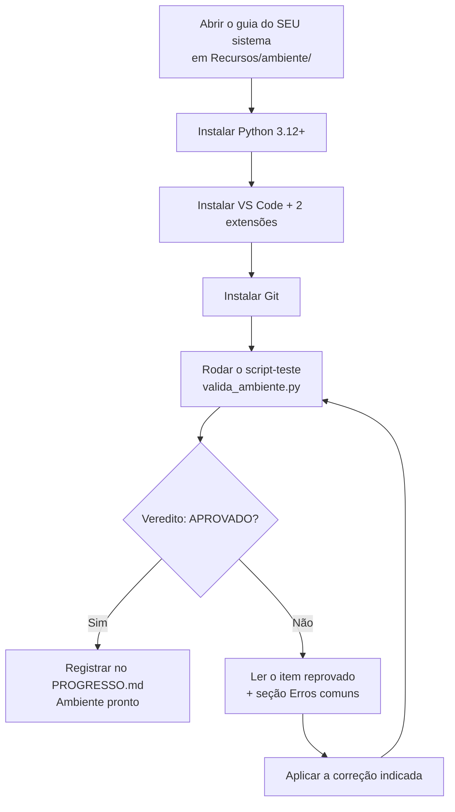

# 00.03 — Preparando o ambiente

> **Módulo 00 — Introdução** · Nível: N1 · Tempo estimado: 2h · Código: `codigo/cap03/`

## 1. Objetivo

- **Instalar** Python (≥ 3.12), VS Code e Git no seu sistema operacional, pelo guia específico dele.
- **Configurar** o VS Code com as extensões oficiais da trilha e o terminal integrado.
- **Executar** o primeiro código da trilha: o script-teste que valida a instalação inteira.
- **Interpretar** a saída do script e **corrigir** os problemas que ele apontar.

Ao final, você terá uma oficina montada e **provada por um programa** — não por sensação — e o primeiro "funcionou!" registrado no seu diário de bordo.

---

## 2. Pré-requisitos

- [00.01 — Como usar o Manual Mestre](01-como-usar-o-manual-mestre.md)
- [00.02 — O mapa do território](02-o-mapa-do-territorio-dados-e-backend.md)

**Autoteste:** (1) Em qual pasta do módulo vivem os arquivos executáveis de cada capítulo? (2) O que é o VS Code no contexto da trilha — e por que ele, e não outro editor? (3) Qual papel do território "vive no terminal"? Se travou na 1, releia o §8 da spec; na 2 e na 3, o capítulo anterior.

---

## 3. Motivação

Existe um momento que quebra mais iniciantes do que qualquer conceito difícil: a primeira hora de instalação. O tutorial diz "digite `python` no terminal", o seu computador responde `'python' não é reconhecido como um comando interno ou externo` — e pronto: antes da primeira linha de código, a mensagem que fica é "isso não é para mim".

A verdade é menos dramática: ambientes de desenvolvimento têm peças (interpretador, editor, terminal, PATH) que precisam se enxergar, e cada sistema operacional tem suas manhas para conectá-las. Quem instala "no improviso" — um download daqui, um clique ali — monta uma oficina onde as ferramentas não se falam, e paga o preço em cada capítulo seguinte: erros que não são do código, são do ambiente. Pior: sem um teste objetivo, você nunca sabe se o problema é seu programa ou sua instalação.

Há também o custo invisível do excesso: instalar agora "tudo que a trilha vai usar" (Docker, Postgres, MongoDB...) significa manter máquinas pesadas rodando meses antes da primeira aula que as usa — e depurar problemas de ferramentas que você ainda nem conhece.

Este capítulo resolve isso assim: instala **somente** as três peças desta fase (Python, VS Code, Git), pelo guia do seu sistema, e encerra com um script que inspeciona a instalação e emite um veredito por escrito. Se ele aprovar, toda dor futura de "não roda" já não será do ambiente.

---

## 4. Modelo mental

> 🧠 **Modelo mental**
> Seu ambiente é uma bancada com três ferramentas que precisam se enxergar: o **interpretador** Python (quem executa), o **editor** VS Code (onde você escreve) e o **terminal** (por onde você comanda). O elo entre elas é o *PATH* — a lista de endereços onde o sistema procura programas pelo nome. Quando algo "não é reconhecido", quase nunca está desinstalado: está fora da lista de endereços.

**Exercício de previsão.** Você instalou o Python com sucesso (o instalador terminou sem erros), abre o terminal, digita `python --version` e recebe "comando não encontrado". Sem consultar nada, decida qual hipótese é a mais provável:

- (a) A instalação falhou silenciosamente e é preciso reinstalar.
- (b) O Python está instalado, mas seu endereço não está no PATH — o terminal não sabe onde procurá-lo.
- (c) O terminal precisa de permissões de administrador para rodar Python.

*Resposta comentada:* (b), na esmagadora maioria dos casos — e é por isso que os guias de instalação insistem numa caixinha chamada "Add to PATH". A hipótese (a) leva iniciantes a reinstalar três vezes o que já estava instalado. Guarde o reflexo: **"não reconhecido" = problema de endereço, não de existência.** O funcionamento completo do PATH é destrinchado no capítulo 02.06.

---

## 5. Analogia

Montar o ambiente é como equipar uma **cozinha nova**. O fogão (interpretador Python) cozinha de verdade; a bancada iluminada (VS Code) é onde você corta, tempera e organiza; o interfone com a despensa (terminal) é como você pede as coisas pelo nome. E o PATH é a **agenda de fornecedores**: se o telefone do açougue não está na agenda, não adianta o açougue existir — seu pedido não chega.

**Onde a analogia quebra:** numa cozinha, dá para cozinhar mesmo com a bancada bagunçada. No ambiente de desenvolvimento, uma peça fora do lugar não degrada — **bloqueia**: sem interpretador no PATH, nada executa. Por isso este capítulo termina em teste com veredito, não em "parece que está tudo aí".

---

## 6. Teoria

### As três peças (e por que estas)

O **interpretador Python** (*interpreter*) é o programa que lê seus arquivos `.py` e os executa, linha após linha. É a única peça realmente obrigatória — sem ela, Python é só texto. A trilha exige a versão **3.12 ou superior**: versões antigas não têm recursos que os módulos à frente usam, e o script-teste verifica isso por você.

O **VS Code** (*Visual Studio Code*) é o editor oficial da trilha — gratuito, multiplataforma e dono de três superpoderes que o manual explora o tempo todo: pré-visualização de Markdown (você lê o manual nele), **terminal integrado** (comanda sem trocar de janela) e o depurador visual que o capítulo 01.24 transforma em arma. Outros editores funcionam? Sim. Mas cada captura de tela, atalho e passo a passo daqui pressupõe o VS Code — padronizar o ambiente é padronizar o suporte que o manual consegue te dar.

O **Git** é o sistema de controle de versões que o módulo 02 ensina a fundo. Ele entra na instalação de hoje por pragmatismo: instalar agora evita interromper o módulo 02 com setup — e no Windows, o Git traz de brinde o *Git Bash*, um terminal que fala a mesma língua dos terminais Linux/macOS usados no restante da trilha.

### O terminal: sua primeira dose

O **terminal** (*terminal*, ou linha de comando) é a interface onde você digita comandos por texto. O capítulo 02.01 explica por que profissionais vivem nele; hoje você só precisa de três gestos: abrir o terminal integrado do VS Code (`Ctrl+'` — a crase, ao lado do 1), digitar um comando e ler a resposta. Os comandos deste capítulo cabem numa linha cada — e estão todos com saída esperada logo abaixo.

### Instalação: um guia por sistema

Cada sistema tem seu passo a passo detalhado em `Recursos/ambiente/` — siga **apenas** o seu:

| Sistema | Guia | Resumo do caminho |
|---|---|---|
| Windows 10/11 | [`Recursos/ambiente/windows.md`](../Recursos/ambiente/windows.md) | Instalador oficial do python.org (marcar "Add to PATH"!) + VS Code + Git for Windows |
| Linux (Ubuntu/Debian) | [`Recursos/ambiente/linux.md`](../Recursos/ambiente/linux.md) | Python via `apt` + VS Code (.deb) + Git via `apt` |
| macOS | [`Recursos/ambiente/macos.md`](../Recursos/ambiente/macos.md) | Python via instalador oficial ou Homebrew + VS Code + Git via Xcode CLT |

### Extensões do VS Code

Somente duas, por ora (o excesso de extensões é uma forma de bagunça): **Python** (da Microsoft — execução, análise e depuração) e **Markdown Preview Mermaid Support** (renderiza os diagramas do manual na pré-visualização). Instalação: ícone de blocos na barra lateral (`Ctrl+Shift+X`), buscar pelo nome, *Install*.

---

## 7. Funcionamento interno

O que acontece, por dentro, quando você digita `python valida_ambiente.py` e aperta Enter? Em camada honesta de superfície: o terminal consulta o PATH, endereço por endereço, até encontrar um executável chamado `python`; o sistema operacional carrega esse programa (o interpretador) na memória; o interpretador abre seu arquivo `.py`, traduz o texto para uma forma interna executável e a executa instrução por instrução, imprimindo no terminal o que o código mandar imprimir. Cada etapa dessa frase vira capítulo: o PATH em 02.06, o interpretador e sua tradução interna em 01.02. Por hoje, o mapa de superfície é suficiente — e já explica os dois erros clássicos da seção 11.

---

## 8. Visualização do fluxo

O processo completo do capítulo, com seus pontos de decisão:



**Como ler:** o caminho feliz desce reto pela esquerda. O losango é o portão: o veredito vem do script, não da sua impressão. A rota da direita é um ciclo deliberado — corrigir e **rodar o teste de novo**, quantas vezes for preciso; sair do ciclo por cansaço ("depois eu vejo isso") é levar o problema de ambiente para dentro do módulo 01.

---

## 9. Aplicação prática

Com as instalações do seu guia concluídas, hora de validar tudo de ponta a ponta.

**Passo 1 — Abra o repositório no VS Code** (`Arquivo → Abrir Pasta` → a pasta do Manual Mestre).

**Passo 2 — Abra o terminal integrado** com `Ctrl+'`. No Windows, se o terminal aberto for o PowerShell, está tudo bem para este capítulo.

**Passo 3 — Confira as três peças, uma a uma.** Digite cada comando e compare com a saída esperada (números de versão podem variar — o que importa é responder):

```bash
python --version
```

```text
Python 3.12.4
```

No Linux/macOS, se `python` não responder, tente `python3 --version` — alguns sistemas instalam com esse nome (o guia do seu sistema explica).

```bash
git --version
```

```text
git version 2.45.1
```

```bash
code --version
```

```text
1.90.2
(mais duas linhas técnicas)
```

**Passo 4 — Rode o script-teste.** Ele está em `00-Introducao/codigo/cap03/valida_ambiente.py`. No terminal:

```bash
python 00-Introducao/codigo/cap03/valida_ambiente.py
```

Saída esperada (numa máquina saudável):

```text
============================================
 Manual Mestre — Validação de ambiente
============================================
[OK]    Python 3.12.4 (>= 3.12 exigido)
[OK]    Interpretador encontrado no PATH
[OK]    Git encontrado: git version 2.45.1
[OK]    Sistema: Windows 11 (64 bits)
--------------------------------------------
Veredito: AMBIENTE APROVADO — 4/4 checagens.
Bem-vindo(a) à trilha. Registre no PROGRESSO.md!
============================================
```

**Passo 5 — Se reprovou em algo:** a própria linha `[FALHOU]` diz o que verificar, e a seção 11 abaixo cobre os três casos clássicos. Corrija e rode de novo até o veredito aprovar.

**Passo 6 — Registre a vitória.** Linha no `PROGRESSO.md`, e a saída do script copiada para o seu `meu-plano.md` como certidão de nascimento da oficina.

---

## 10. Código comentado

O arquivo completo vive em [`codigo/cap03/valida_ambiente.py`](codigo/cap03/valida_ambiente.py) — execute a partir de lá.

> 📦 **Caixa-preta: o conteúdo deste script**
> Este é o primeiro código da trilha — e você ainda não estudou Python. Por enquanto, trate o *conteúdo* do arquivo como caixa-preta: você precisa saber **executá-lo e ler a saída**, não entendê-lo por dentro. Cada peça dele será aberta no módulo 01 (imports em 01.20, funções em 01.18, f-strings em 01.06, condicionais em 01.09). Ao chegar lá, volte e releia: este script inteiro terá virado leitura leve.

```python
# ------------------------------------------------------------
# valida_ambiente.py
# Capítulo 00.03 — Preparando o ambiente
# O que este arquivo demonstra: checagem automatizada da instalação
#   (versão do Python, PATH, Git e sistema operacional)
# Como executar: python valida_ambiente.py
# ------------------------------------------------------------

# Módulos da biblioteca padrão — vêm junto com o Python (01.20 explica imports)
import sys
import platform
import shutil
import subprocess

MINIMO = (3, 12)  # versão mínima exigida pela trilha (spec §18.1)


def checar_versao_python():
    # sys.version_info traz a versão do interpretador que está executando este arquivo
    atual = sys.version_info[:2]
    versao = platform.python_version()
    if atual >= MINIMO:
        return True, f"Python {versao} (>= {MINIMO[0]}.{MINIMO[1]} exigido)"
    return False, f"Python {versao} — a trilha exige {MINIMO[0]}.{MINIMO[1]}+ (reinstale pelo guia)"


def checar_python_no_path():
    # shutil.which faz a mesma busca que o terminal faz: procura o nome no PATH
    caminho = shutil.which("python") or shutil.which("python3")
    if caminho:
        return True, "Interpretador encontrado no PATH"
    return False, "Interpretador fora do PATH — veja Erros comuns, Erro 1"


def checar_git():
    if shutil.which("git") is None:
        return False, "Git não encontrado — instale pelo guia do seu sistema"
    # Pergunta a versão ao próprio Git, como você fez manualmente no Passo 3
    resultado = subprocess.run(["git", "--version"], capture_output=True, text=True)
    return True, f"Git encontrado: {resultado.stdout.strip()}"


def checar_sistema():
    # Apenas informativo: registra onde a trilha está sendo cursada
    bits = "64 bits" if sys.maxsize > 2**32 else "32 bits"
    return True, f"Sistema: {platform.system()} {platform.release()} ({bits})"


def main():
    print("=" * 44)
    print(" Manual Mestre — Validação de ambiente")
    print("=" * 44)

    checagens = [
        checar_versao_python(),
        checar_python_no_path(),
        checar_git(),
        checar_sistema(),
    ]

    aprovadas = 0
    for passou, mensagem in checagens:
        etiqueta = "[OK]   " if passou else "[FALHOU]"
        print(f"{etiqueta} {mensagem}")
        if passou:
            aprovadas = aprovadas + 1

    print("-" * 44)
    total = len(checagens)
    if aprovadas == total:
        print(f"Veredito: AMBIENTE APROVADO — {aprovadas}/{total} checagens.")
        print("Bem-vindo(a) à trilha. Registre no PROGRESSO.md!")
    else:
        print(f"Veredito: PENDENTE — {aprovadas}/{total} checagens.")
        print("Corrija os itens [FALHOU] (seção 11 do capítulo) e rode de novo.")
    print("=" * 44)


main()
# Saída: (o relatório completo mostrado na seção 9)
```

---

## 11. Erros comuns

Agora com mensagens reais — bem-vindo(a) ao clube.

### Erro 1 — "python não é reconhecido" (Windows) / "command not found" (Linux/macOS)

**Sintoma:**

```text
'python' não é reconhecido como um comando interno ou externo,
um programa operável ou um arquivo em lotes.
```

**Causa:** o interpretador está instalado, mas fora do PATH — no Windows, quase sempre porque a caixa **"Add python.exe to PATH"** não foi marcada no instalador.
**Correção:** Windows: rode o instalador de novo → *Modify* → marque a opção de PATH (ou siga a seção de PATH do guia `windows.md`). Linux/macOS: teste `python3` no lugar de `python`; se também falhar, refaça a instalação pelo guia. Depois, **feche e reabra o terminal** — ele lê o PATH ao abrir.

### Erro 2 — O terminal abre o Python errado (ou a loja da Microsoft)

**Sintoma:** `python --version` responde uma versão antiga (ex.: `Python 3.9.7`) diferente da que você instalou — ou, no Windows, abre a Microsoft Store.

**Causa:** há mais de um Python na máquina (ou o "atalho fantasma" da Store), e o PATH encontra o errado primeiro: a busca para no **primeiro** endereço que responde.
**Correção:** Windows: Configurações → Aplicativos → *Aliases de execução de aplicativo* → desligue os dois itens `python`. Se persistir, o guia `windows.md` mostra como reordenar o PATH. Linux/macOS: use `python3.12` explicitamente ou ajuste conforme o guia.

> ⚠️ **Atenção**
> Resistir ao impulso de "resolver" reinstalando mais uma cópia — cada reinstalação às cegas adiciona um Python a mais na disputa do PATH e **piora** o quadro. Diagnóstico primeiro (qual responde? de onde?), ação depois.

### Erro 3 — `can't open file ... No such file or directory`

**Sintoma:**

```text
python: can't open file '/home/voce/valida_ambiente.py': [Errno 2] No such file or directory
```

**Causa:** o terminal procura o arquivo a partir da **pasta em que ele está aberto** — e você está numa pasta diferente da do arquivo. Não é erro de Python: é erro de endereço relativo.
**Correção:** rode a partir da raiz do repositório com o caminho completo do Passo 4 (`python 00-Introducao/codigo/cap03/valida_ambiente.py`). O comando `cd` — mudar de pasta — é oficialmente ensinado em 02.02; até lá, os capítulos sempre indicam o caminho a partir da raiz.

---

## 12. Boas práticas

✅ **Siga apenas o guia do seu sistema, do início ao fim** — misturar tutoriais de fontes diferentes é a receita clássica do ambiente meio-instalado.

✅ **Feche e reabra o terminal após qualquer mudança de instalação ou PATH** — o terminal fotografa o PATH ao abrir; mudanças não valem para janelas antigas.

✅ **Leia a mensagem de erro inteira, em voz baixa, antes de agir** — as mensagens deste capítulo dizem literalmente qual é o problema; o hábito de lê-las é a habilidade profissional em embrião.

✅ **Guarde a saída aprovada do script** — é seu ponto de restauração mental: se algo quebrar no futuro, você sabe que um dia esteve certo e o que mudou desde então.

❌ **Evite instalar agora ferramentas de módulos futuros (Docker, Postgres, Mongo...)** — cada uma chega no módulo que a justifica, com guia próprio; antecipar é carregar peso sem mapa.

❌ **Evite "resolver" erro de instalação com comandos copiados de fóruns sem entender** — comandos de força bruta (com `sudo`, deleções de PATH) criam problemas que custam mais caro que o original.

---

## 13. Performance

Nesta escala, irrelevante — o script roda em menos de um segundo, e você saberá quando performance importar (a partir dos módulos N2/N3, com medições reais). A única espera legítima deste capítulo são os downloads. Se o script demorar segundos a mais no primeiro uso, é o sistema carregando o interpretador pela primeira vez — normal e sem importância.

---

## 14. Mercado

> 🏢 **Mercado**
> "Montar ambiente" parece assunto de iniciante, mas é dor cara em empresa: o tempo até o primeiro commit de uma pessoa recém-contratada (*onboarding*) é métrica acompanhada por gestores, e times maduros investem pesado em encurtá-lo — guias como os de `Recursos/ambiente/`, scripts de verificação como o `valida_ambiente.py` e, no estado da arte, ambientes inteiros empacotados que sobem com um comando (exatamente o que o Docker fará pelo Atlas no módulo 08, quando "configurar a máquina de um dev novo" cair de 2 dias para minutos). O reflexo que você treinou hoje — diagnóstico por checagem objetiva, não por tentativa — é o mesmo que se espera de um profissional diante de qualquer "na minha máquina não roda".
>
> **Mini-cenário:** na Aurora, a última pessoa contratada perdeu um dia e meio até rodar o projeto — cada peça instalada na base do improviso, três Pythons disputando o PATH. O primeiro script que você escreverá *conceitualmente* de novo no módulo 08 é o mesmo desta aula: "verifique se a bancada está pronta antes de culpar o código".

---

## 15. Entrevistas

Ambiente raramente é tema central de entrevista júnior — mas aparece disfarçado em perguntas de diagnóstico, onde revela quem já sofreu de verdade.

**P1. "Você digita `python arquivo.py` e recebe 'comando não encontrado'. O que verifica, em ordem?"**
*Resposta esperada:* (1) o Python responde por outro nome? (`python3`); (2) está no PATH? (`which`/`where`); (3) o terminal foi reaberto após a instalação?; (4) só então considerar reinstalar. A ordem importa: da hipótese barata para a cara. Responder "reinstalaria" de cara é a resposta fraca clássica.

**P2. "O que é o PATH e por que ele importa?"**
*Resposta esperada:* a lista de pastas onde o sistema procura executáveis quando você digita um nome no terminal; importa porque instalação fora do PATH = programa invisível ao terminal; e a busca para no primeiro encontrado — o que explica versões "erradas" respondendo.

**P3. "Sua máquina roda o projeto, a do colega não. Como você aborda?"**
*Resposta esperada:* comparar as diferenças objetivamente (versões, sistema, variáveis) em vez de tentar mudanças no escuro; idealmente ter/criar um script de verificação; mencionar que a solução definitiva para essa classe de problema é containerizar (Docker) — sinaliza visão além do próprio quintal.

**Pegadinha clássica: "Qual editor/IDE você usa — e por que ele é melhor?"**
Ela derruba quem morde a isca da guerra santa (defender ferramenta com fervor e desdém pelas outras — vermelho comportamental). A saída forte: "uso VS Code por X e Y; colegas produtivos usam outros; o que importa ao time é padronizar o essencial para o suporte mútuo funcionar" — preferência com critério, sem religião.

---

## 16. Exercícios guiados

Enunciados completos em [`exercicios/cap03.md`](exercicios/cap03.md); gabaritos em [`exercicios/gabaritos/cap03.md`](exercicios/gabaritos/cap03.md).

### Aquecimento

- **A1** `[~5 min · as três peças]` — Associe cada situação à peça do ambiente envolvida (interpretador, editor, terminal, PATH).
- **A2** `[~10 min · leitura de erro]` — Para 3 mensagens de erro reais, diga a causa provável e a primeira ação — sem executar nada.
- **A3** `[~5 min · comandos de verificação]` — Escreva de memória os comandos que verificam a versão das três peças.

### Aplicação

- **AP1** `[~15 min · o script como ferramenta]` — Rode o `valida_ambiente.py`, guarde a saída, e responda 4 perguntas sobre o que cada checagem provou.
- **AP2** `[~20 min · diagnóstico simulado]` — Para 3 cenários de máquina quebrada (descritos no enunciado), monte o plano de diagnóstico em ordem de hipótese mais barata.
- **AP3** `[~15 min · pré-visualização e extensões]` — Verifique as duas extensões instaladas e confirme que o diagrama Mermaid da seção 8 renderiza na pré-visualização (`Ctrl+Shift+V`).

---

## 17. Desafios

- **D1** `[~30 min · leitura de código como caixa de vidro]` — **Abra a caixa-preta (só de olhar).** Sem estudar Python, abra o `valida_ambiente.py` e, apenas lendo nomes e comentários, escreva em português: (a) o que cada uma das 4 funções `checar_*` verifica; (b) onde o veredito "APROVADO/PENDENTE" é decidido; (c) uma 5ª checagem que você acha que faria sentido. Pesquisa dirigida permitida: nenhuma — o exercício é de leitura, e errar palpites aqui é lucro.

<details><summary>💡 Dica 1 (conceito)</summary>
Os nomes foram escritos para serem lidos: `checar_versao_python` faz o quê? Confie no português dos identificadores.
</details>
<details><summary>💡 Dica 2 (estratégia)</summary>
Para o item (b), procure onde o programa compara `aprovadas` com `total` — a decisão mora perto dessa comparação.
</details>
<details><summary>💡 Dica 3 (esqueleto)</summary>
Formato da resposta: 4 linhas (uma por função) + 1 linha localizando o veredito + 1 ideia de checagem (ex.: versão do VS Code? espaço em disco? conexão?).
</details>

---

## 18. Mini projeto

**Certidão da oficina** `[~45 min]` — provar, documentar e deixar reprodutível.

Requisitos numerados:

1. Ambiente aprovado: saída do `valida_ambiente.py` com veredito **APROVADO** (4/4).
2. No seu `meu-plano.md`, crie a seção "Minha oficina" com: a saída completa do script, o sistema operacional e as versões das três peças.
3. Ainda nela, escreva um mini-guia "se quebrar, eu…" com **3 sintomas → primeira ação** (use a seção 11 como base, mas com suas palavras).
4. Teste de fogo da pré-visualização: abra este capítulo no VS Code e confirme que o diagrama da seção 8 aparece desenhado (não como texto). Registre "preview ok" na certidão.

**Critério de "está bom":** veredito 4/4 colado; mini-guia escrito sem copiar literalmente o capítulo; preview confirmado. Sua oficina agora tem alvará — emitido por um programa, do jeito que a trilha gosta.

---

## 19. Revisão

**Resumo do capítulo:**

- O ambiente da fase 1 tem três peças: interpretador Python 3.12+ (executa), VS Code (edita e pré-visualiza), Git (versiona — a fundo no módulo 02).
- O PATH é a agenda de endereços do terminal: "comando não reconhecido" quase sempre é endereço, não ausência.
- Cada sistema tem seu guia em `Recursos/ambiente/` — seguir um guia único, do início ao fim, evita o ambiente meio-instalado.
- O veredito de "ambiente pronto" vem de um teste objetivo (`valida_ambiente.py`), não de sensação — e o ciclo é corrigir → rodar de novo.
- Mensagens de erro deste capítulo se leem literalmente: elas dizem o problema; a habilidade é ler antes de agir, da hipótese barata para a cara.
- Ferramentas de módulos futuros não se instalam agora: cada uma chega com a dor que a justifica.

**Flashcards novos** (adicionados a [`revisao/flashcards.md`](revisao/flashcards.md)):

| ID | Frente | Verso |
|---|---|---|
| 00.03-F1 | "python não é reconhecido" logo após instalar. Qual a causa mais provável e o reflexo correto? | Interpretador fora do PATH (ou terminal aberto antes da instalação). Reflexo: problema de endereço, não de existência — nada de reinstalar às cegas. |
| 00.03-F2 | Explique com suas palavras: o que é o PATH? | (Elaboração) A lista de pastas onde o sistema procura executáveis pelo nome; a busca para no primeiro que responder. |
| 00.03-F3 | Preveja: `python --version` responde 3.9, mas você instalou 3.12. O que aconteceu? | (Previsão) Dois Pythons na máquina; o PATH encontra o antigo primeiro. Diagnóstico antes de reinstalar. |
| 00.03-F4 | Quando instalar Docker, Postgres e Mongo — e por quê não agora? | (Decisão) Cada um no módulo que o usa (08 e 05): ferramenta antes da dor é peso sem mapa e depuração sem contexto. |
| 00.03-F5 | Qual é o teste objetivo de "ambiente pronto" da trilha e o que ele checa? | `valida_ambiente.py`: versão do Python (≥3.12), interpretador no PATH, Git instalado, sistema — veredito 4/4. |

**Agendamento:** registre no `PROGRESSO.md` e marque D+1, D+7, D+30, D+90 na [`Revisoes/agenda.md`](../Revisoes/agenda.md).

---

## 20. Checklist

Perguntas de domínio — teste do sim:

- [x] Sei explicar *o papel de cada uma das três peças do ambiente*?
- [x] Sei explicar *o que é o PATH e por que "não reconhecido" raramente significa "não instalado"*?
- [x] Sei executar *um script Python pelo terminal, a partir da raiz do repositório*?
- [x] Sei depurar *os três erros clássicos da seção 11 (diagnóstico em ordem de hipótese barata)*?
- [x] Sei responder *à pergunta de entrevista sobre "comando não encontrado"*?

Itens práticos:

- [x] Segui o guia do meu sistema em `Recursos/ambiente/` do início ao fim.
- [x] `python --version`, `git --version` e `code --version` respondem no meu terminal.
- [x] Rodei `valida_ambiente.py` e obtive veredito APROVADO 4/4.
- [x] As 2 extensões estão instaladas e o Mermaid da seção 8 renderiza na pré-visualização.
- [x] Completei o mini projeto "Certidão da oficina" e registrei tudo no `PROGRESSO.md`, com as 4 revisões agendadas.

---

## 21. Próximo capítulo

A oficina está pronta e provada — mas ferramentas não estudam por você. Ficou deliberadamente em aberto o *como operar o sistema de estudo no dia a dia*: o que exatamente fazer num D+1, como transformar o `PROGRESSO.md` em hábito de 2 minutos, o que fazer quando a agenda atrasa (vai atrasar — está previsto) e por que o método insiste que você tente lembrar antes de reler. O próximo capítulo pega o sistema que o 00.01 apresentou e o transforma em rotina concreta — com a sua primeira revisão D+1 de verdade.

→ [00.04 — Como estudar: o sistema de retenção](04-como-estudar-o-sistema-de-retencao.md)

---

*Gerado sob spec 3.0.0*
