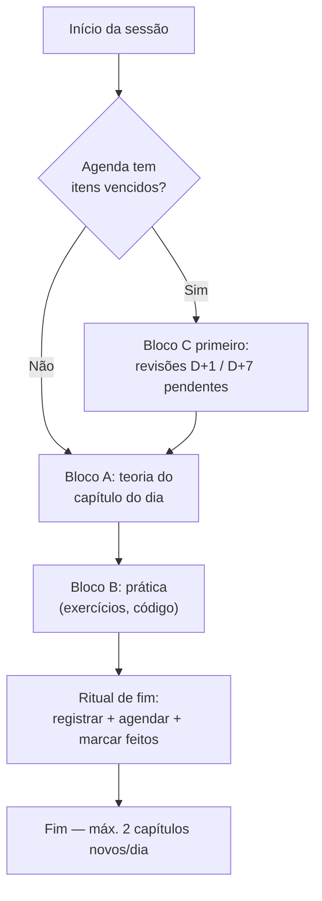

# 00.04 — Como estudar: o sistema de retenção

> **Módulo 00 — Introdução** · Nível: N1 · Tempo estimado: 1h30 · Código: — (ver `DECISOES.md` D-002)

## 1. Objetivo

- **Aplicar** o ciclo de revisão espaçada na prática: executar hoje sua primeira revisão D+1 real (do capítulo 00.01).
- **Executar** o ritual de fim de sessão: registrar no `PROGRESSO.md` e agendar na `Revisoes/agenda.md` em menos de 5 minutos.
- **Explicar** por que tentar lembrar fixa mais que reler — e usar isso a favor em cada revisão.
- **Aplicar** o protocolo de atraso: o que fazer quando a agenda acumula (vai acontecer, e está previsto).

Ao final, você terá operado um ciclo completo do sistema com material real — não terá lido sobre o método: terá dado a primeira volta na engrenagem.

---

## 2. Pré-requisitos

- [00.01 — Como usar o Manual Mestre](01-como-usar-o-manual-mestre.md) — em especial as seções 6 e 19.
- [00.03 — Preparando o ambiente](03-preparando-o-ambiente.md) — o VS Code pronto, com `PROGRESSO.md` e `Revisoes/agenda.md` fixados.

**Autoteste:** (1) Quais são os 4 momentos do ciclo de revisão e o instrumento de cada um? (2) Onde vivem os flashcards do módulo? (3) O que revisões vencidas fazem com conteúdo novo? Se travou, releia a seção 6 do 00.01 — e repare: acabou de fazer uma mini-revisão por recuperação.

---

## 3. Motivação

Faça um teste agora, sem culpa: o que você lembra, de verdade, da seção "Teoria" do capítulo 00.02 — os três papéis, tudo bem, mas... quais eram as cinco perguntas do modelo mental? Se precisou espiar, você acabou de sentir na pele o fenômeno mais bem documentado da ciência da memória: a **curva do esquecimento** (*forgetting curve*). Sem reforço, a memória de algo recém-aprendido despenca nos primeiros dias — não por falta de talento, por design do cérebro: ele descarta o que não é reutilizado.

O estudo autodidata quebra exatamente aqui. Não na compreensão — você entendeu o 00.02 — mas na **retenção**: entender é evento, lembrar é processo. E o processo padrão da maioria ("quando esquecer, releio") é o mais caro possível: reler produz uma familiaridade agradável ("ah, isso eu sei") que não reconstrói a memória — só a reconhece. É estudar duas vezes para reter meia.

A boa notícia: o antídoto é barato, conhecido e já está agendado na sua `Revisoes/agenda.md` desde o capítulo 00.01. Faltava só a parte que nenhum arquivo faz por você: a rotina concreta — o que exatamente fazer num D+1, quanto tempo dar a um card, o que fazer quando errar, como não deixar a agenda virar bola de neve.

Este capítulo resolve isso assim: transforma o sistema apresentado no 00.01 em gestos operacionais — e encerra com você executando sua primeira revisão D+1 de verdade, com os flashcards reais do 00.01.

---

## 4. Modelo mental

> 🧠 **Modelo mental**
> Memória funciona como trilha na mata: **usar é abrir caminho**. Cada vez que você *puxa* uma lembrança (sem olhar a resposta), pisa na trilha e ela fica mais firme — e o mato leva mais tempo para fechá-la. Reler não pisa na trilha: sobrevoa. O ciclo D+1/D+7/D+30/D+90 é só isto: voltar a pisar na trilha em intervalos calculados, cada vez com o mato um pouco mais alto — porque o esforço de reabrir é justamente o que consolida.

**Exercício de previsão.** Dois estudantes leem o mesmo capítulo na segunda-feira. Ana relê o capítulo inteiro na terça e na quarta (2 releituras, ~1h). Bia responde 5 flashcards na terça (~10 min, errando 2) e mais 5 na segunda seguinte. Na prova, um mês depois, quem tende a lembrar mais — e por quê? Decida antes de ler a resposta.

*Resposta comentada:* Bia, com folga — e gastando um sexto do tempo. As releituras de Ana produzem fluência de reconhecimento (o texto "parece sabido" enquanto está na frente dos olhos); os erros de Bia na terça não são fracasso: são o esforço de recuperação que firma a trilha, e o espaçamento até a semana seguinte multiplica o efeito. Se você apostou em Ana pelo volume de horas, este capítulo existe para você.

---

## 5. Analogia

O sistema de retenção é um **regador programado para plantas**. Regar demais de uma vez (maratonar) alaga e escorre — a terra não absorve; regar só quando a planta murcha (reler quando esqueceu) é resgate, não cultivo. O regador certo dá pouca água em intervalos certos, espaçando conforme a planta enraíza — D+1, D+7, D+30, D+90 — até ela não depender mais de você.

**Onde a analogia quebra:** plantas absorvem passivamente; memória não. Se na "rega" você olhar a resposta antes de tentar lembrar, o efeito evapora — a água só chega à raiz quando há **esforço de recuperação**. O regador entrega a água; puxar da memória é você quem faz.

---

## 6. Teoria

### O ciclo por dentro de cada momento

O 00.01 apresentou o ciclo; aqui está o **gesto exato** de cada revisão:

| Momento | Gesto exato | Regra de ouro |
|---|---|---|
| **D+1** (~10 min) | Abra `revisao/flashcards.md` do módulo, filtre os 5 cards do capítulo. Para cada um: leia a frente, **responda em voz alta ou por escrito**, só então olhe o verso. Marque os que errou. | Nada de "ah, essa eu sei" pulando a resposta — falar/escrever é o que pisa na trilha. |
| **D+7** (~20 min) | 3 questões do capítulo em `revisao/questoes.md` + **reexplicar o modelo mental em voz alta**, sem olhar, como se ensinasse alguém. | Se a explicação sair truncada, releia **só** o callout 🧠 — e explique de novo. |
| **D+30** (~30 min) | 1 exercício transversal de `Exercicios/banco-geral.md` que misture este capítulo com outros. | Resolver de verdade, no editor — não "de cabeça". |
| **D+90** (45–90 min) | Voltar a um código antigo (em geral do Atlas) e **modificar** algo que usa o conceito. | Manutenção é a prova final: lembrar dentro de contexto real. |

### O ritual de fim de sessão (2–5 minutos, inegociável)

Toda sessão de estudo termina com o mesmo fecho, sempre na mesma ordem:

1. **Registrar** a linha no `PROGRESSO.md` (data, item, tipo, resultado, 1 observação sincera).
2. **Agendar**: se concluiu capítulo novo, as 4 linhas na `Revisoes/agenda.md` (você já treinou as datas no exercício AP2 do 00.01).
3. **Marcar como feito**: preencher a coluna "Feito em" das revisões executadas hoje.

O ritual é curto de propósito: ritual longo morre na segunda semana. Estes 3 passos são o custo total de manutenção do sistema inteiro.

### Errar num flashcard: o protocolo

Errou um card no D+1? Normal — anote e siga; os outros momentos do ciclo o recapturam. Agora, **falhou feio numa revisão** — não lembrou o modelo mental, errou as 3 questões do D+7? O item **reinicia o ciclo a partir de D+1** e o capítulo entra na revisão dirigida do próximo sábado. Sem julgamento: o sistema foi desenhado contando com falhas; o que ele não perdoa é falha **ignorada**.

### O protocolo de atraso

A agenda vai acumular em algum momento — semana difícil, imprevisto, vida. O protocolo:

1. **Itens vencidos primeiro, sempre** — eles bloqueiam conteúdo novo (regra que você já conhece; agora sabe o porquê: cada dia de atraso é mato fechando trilha).
2. **Fila acima de ~15 itens** = sinal de ritmo, não de preguiça: reduza capítulos novos por alguns dias até a fila drenar.
3. **Voltou de um hiato longo** (1+ semana)? Não tente "pagar tudo" num dia: ordene por data, resolva em blocos de 30 min, e aceite que alguns itens vão reiniciar o ciclo — é o custo honesto do hiato, e ele é recuperável.

### Flashcards: consumo hoje, produção amanhã

Nos módulos, os 5 cards de cada capítulo já vêm prontos (seção 19). Seu trabalho é **consumi-los bem** (voz alta, esforço real) — e, opcionalmente, **acrescentar** cards seus quando um erro pessoal merecer virar pergunta ("errei X no exercício → card: por que X?"). Card pessoal de erro próprio vale ouro: ninguém esquece a pergunta que já o derrubou. O formato canônico está no §26 da spec; a regra de qualidade que importa: se a resposta se acha em 5 segundos na documentação, não vira card.

---

## 7. Funcionamento interno

Por que **espaçar** vence repetir em bloco, por dentro? Versão honesta de superfície: cada recuperação bem-sucedida de uma memória *quase esquecida* dispara reconsolidação mais forte do que recuperar algo fresco — o cérebro interpreta "precisei disso de novo, depois de um tempo" como sinal de importância duradoura, e investe estrutura nisso (o nome técnico do fenômeno: *efeito de espaçamento*, documentado desde Ebbinghaus, 1885). Repetir em bloco no mesmo dia não gera esse sinal: a memória ainda está fresca, o esforço é zero, o cérebro arquiva como redundância. Os intervalos D+1/7/30/90 são uma aproximação prática da curva: cada revisão chega perto do ponto em que a memória começaria a falhar — esforço máximo recuperável, consolidação máxima.

---

## 8. Visualização do fluxo

Sua sessão-padrão de estudo (os blocos A/B/C da semana-modelo do §14.3 da spec), com o sistema de retenção embutido:



**Como ler:** o losango logo na entrada é a regra de precedência em forma de desenho — revisão vencida passa na frente até da teoria do dia. O ritual de fim é um nó do fluxo, não uma boa intenção: a sessão só "existe" para o sistema quando registrada. E o teto de 2 capítulos novos segue valendo mesmo num dia em que tudo flui.

---

## 9. Aplicação prática

Chegou a hora de dar a primeira volta real na engrenagem — com material de verdade.

**Passo 1 — Confira a agenda.** Abra `Revisoes/agenda.md`. Se você agendou as revisões dos capítulos 00.01–00.03 conforme foi instruído, deve haver itens D+1 já vencidos ou vencendo hoje. (Se a agenda está vazia, o mini projeto do 00.01 ficou pela metade — volte lá, agende, e o sistema começa a existir.)

**Passo 2 — Execute o D+1 do 00.01, pelo gesto exato.** Abra [`revisao/flashcards.md`](revisao/flashcards.md), localize os cards `00.01-F1` a `00.01-F5` e, um a um: leia a frente, **responda em voz alta**, confira o verso, anote acertos e erros. Sem pressa: ~2 min por card.

**Passo 3 — Sinta a diferença.** Compare a sensação de *puxar* a resposta do F1 (os 4 momentos do ciclo) com a de *reler* a tabela na seção 6 deste capítulo. A primeira custa esforço — esse esforço é o produto.

**Passo 4 — Feche com o ritual.** No `PROGRESSO.md`:

```text
| 2026-07-31 | 00.01 D+1 | revisão | 4/5 cards | errei F4 (checkpoints) — normal |
```

E na `agenda.md`, preencha "Feito em" do item executado. Pronto: um ciclo completo, de verdade, em menos de 15 minutos.

> 💡 **Dica**
> Faça as revisões em voz alta mesmo — parece bobo, funciona: verbalizar recruta mais circuitos que responder "de cabeça", e denuncia na hora a resposta que você *achava* que sabia mas não sai inteira.

---

## 10. Código comentado

Capítulo sem código executável (registro: `DECISOES.md`, D-002) — o sistema de retenção opera sobre arquivos Markdown e sobre você. Vale registrar a ponte: a partir do módulo 01, **todo capítulo com código alimenta este sistema** — os exercícios de previsão viram cards, os erros que você cometer virarão questões, e os D+90 serão manutenção de código seu no Atlas. O sistema que você calibrou hoje é o mesmo que vai carregar 197 capítulos.

---

## 11. Erros comuns

Erros de **operação do sistema** — os que mais matam a retenção na prática (formato mantido; ver D-003).

### Erro 1 — Revisar olhando a resposta ("revisão de reconhecimento")

**Sintoma:** você "passa" os flashcards em 3 minutos, tudo parece sabido, nenhum erro — e no D+30 o exercício transversal te derruba.
**Causa:** olhar frente e verso juntos transforma recuperação em releitura: o cérebro reconhece a resposta em vez de produzi-la — e reconhecimento não firma trilha.
**Correção:** disciplina física: cubra o verso (mão, papel, dobrar a rolagem), responda **em voz alta ou por escrito**, só então confira. Errar 2 de 5 é revisão saudável; 5/5 em 3 minutos é revisão de mentira.

### Erro 2 — "Pagar" a agenda atrasada numa maratona de domingo

**Sintoma:** 20 itens vencidos resolvidos em 3 horas de domingo; na semana seguinte, os mesmos conteúdos falham de novo — e o domingo de descanso se foi.
**Causa:** revisão em bloco perde o efeito do espaçamento (tudo revisado no mesmo estado mental, sem intervalo) e o domingo era peça do sistema, não folga opcional.
**Correção:** protocolo de atraso da seção 6: blocos de 30 min distribuídos nos dias, itens mais antigos primeiro, ritmo de capítulos novos reduzido até drenar. Lento e espaçado vence rápido e amontoado — de novo.

> ⚠️ **Atenção**
> O sinal de alerta objetivo é a fila passar de ~15 itens. Acima disso, o problema já não é disciplina — é ritmo: você está produzindo revisões futuras mais rápido do que consegue pagá-las.

### Erro 3 — Pular o ritual de registro "só hoje"

**Sintoma:** três sessões sem registrar; na quarta, você não sabe o que venceu, o que foi feito, nem onde parou — e a agenda perde a autoridade ("ela nem está certa mesmo...").
**Causa:** o sistema inteiro depende de um único elo: os arquivos refletirem a realidade. Cada sessão não registrada corrói a confiança que faz você obedecer à agenda.
**Correção:** o ritual custa 2 minutos e é parte da sessão, não um extra — a sessão termina no registro, como o pouso termina o voo. Perdeu sessões? Reconstrua a agenda **hoje** com o que lembrar, aceite as imprecisões e volte a registrar em dia.

---

## 12. Boas práticas

✅ **Responda flashcards em voz alta ou por escrito, sempre** — é a diferença física entre pisar na trilha e sobrevoá-la.

✅ **Comemore erros em revisão como informação** — cada erro é o sistema funcionando: ele achou uma trilha fechando *antes* da prova, do projeto ou da entrevista.

✅ **Agende as revisões no momento em que conclui o capítulo, não "depois"** — o agendamento é parte da conclusão; capítulo sem revisões agendadas está aberto.

✅ **Crie cards pessoais dos seus próprios erros** — a pergunta que já te derrubou uma vez é a mais rentável do seu baralho.

❌ **Evite estender revisão D+1 além de ~15 minutos** — se está demorando, o problema é do capítulo (volte a ele via revisão dirigida), não da revisão; D+1 longo vira desculpa para não fazer.

❌ **Evite "adiantar" revisões futuras num dia livre** — revisar antes da hora desperdiça o efeito do espaçamento: o esforço de recuperação é o produto, e cedo demais não há esforço.

---

## 13. Performance

Nesta escala, a única performance relevante é a do próprio sistema — e ela tem números: ~6 h/semana de revisões (a "regra dos 20%" do cronograma) sustentam as outras ~26 h de conteúdo novo. A leitura certa desses números: revisão não compete com progresso — ela é o que impede as 26 h de evaporarem. O erro de performance clássico aqui é o da seção 11 (maratona de domingo): mais horas concentradas rendendo menos retenção que menos horas espaçadas. Você medirá isso em si nas próximas semanas — os placares de acerto do D+7 no `PROGRESSO.md` são o seu benchmark.

---

## 14. Mercado

> 🏢 **Mercado**
> A habilidade treinada neste capítulo tem nome em vaga de emprego: *aprendizado contínuo* — presente, com essas palavras, numa fração enorme dos anúncios da área, porque a stack de qualquer empresa muda a cada poucos anos e contratam-se pessoas que se atualizam sozinhas. Times maduros praticam versões corporativas do mesmo sistema: documentação de decisões para não "esquecer" o porquê das coisas, *post-mortems* de incidentes (o erro virando conteúdo, como aqui), sessões de compartilhamento interno (explicar aos colegas = a reexplicação do D+7). Quem chega com um sistema pessoal de retenção já opera como esses times.
>
> **Mini-cenário:** na Aurora, o desenvolvedor que te antecedeu (ficcionalmente) aprendeu Docker três vezes — uma por projeto, esquecendo no intervalo. O custo não foi só o tempo dele: foi o time bloqueado esperando. No seu terceiro mês, quando alguém perguntar "como era mesmo aquele comando?", sua resposta virá do sistema — do cheatsheet do módulo, referenciado por `MM.CC` — em segundos.

---

## 15. Entrevistas

**P1. "Como você se mantém atualizado(a) tecnicamente?"**
*Resposta esperada:* fontes concretas (documentação oficial, 1–2 referências da área) + **sistema** (não "quando dá tempo": rotina com revisão e prática) + destino (onde o aprendizado vira código: projeto, trabalho). A palavra-chave que diferencia a resposta é *rotina* — entrevistadores ouvem "leio artigos" o dia inteiro; ouvem "tenho um ciclo semanal com revisão espaçada" quase nunca.

**P2. "Conte de uma vez em que você esqueceu/perdeu domínio de algo importante. O que mudou depois?"**
*Resposta esperada:* história real e específica (formato que o banco STAR do §31 vai treinar) + a mudança sistêmica: "hoje registro/reviso/pratico de tal forma". O que se avalia não é o esquecimento — é se ele produziu método ou só remorso.

**P3. "Você aprende melhor como: curso, livro, projeto?"**
*Resposta esperada:* fugir do rótulo único: "aprendo com [fonte], mas só considero aprendido depois de [prática + teste de recuperação]". Demonstrar que distingue *exposição* de *domínio* — a distinção central deste capítulo — coloca a resposta no top 5%.

**Pegadinha clássica: "Se te colocarmos numa stack que você nunca viu, o que você faz na primeira semana?"**
Ela derruba dois perfis: o herói ("aprendo tudo em um fim de semana!" — não aprende, e o entrevistador sabe) e o passivo ("faria um curso" — a empresa não vai esperar o curso). A saída forte tem estrutura de sistema: mapear o território primeiro (o gesto do 00.02), pegar uma tarefa pequena real cedo (aprender no contexto), perguntar com critério, e registrar o que aprende para não pagar duas vezes — "meu método de estudo pessoal já funciona assim".

---

## 16. Exercícios guiados

Enunciados completos em [`exercicios/cap04.md`](exercicios/cap04.md); gabaritos em [`exercicios/gabaritos/cap04.md`](exercicios/gabaritos/cap04.md).

### Aquecimento

- **A1** `[~5 min · gestos do ciclo]` — Associe cada gesto concreto ao momento certo do ciclo (D+1/D+7/D+30/D+90).
- **A2** `[~5 min · protocolo de falha]` — Para 3 resultados de revisão, diga o que o sistema manda fazer.
- **A3** `[~10 min · ritual de fim]` — Escreva de memória os 3 passos do ritual e execute-os para a sessão de hoje.

### Aplicação

- **AP1** `[~15 min · D+1 real]` — Execute o D+1 completo do capítulo 00.01 (passo a passo da seção 9) e registre o placar.
- **AP2** `[~20 min · triagem de agenda]` — Dada uma agenda fictícia bagunçada (no enunciado), aplique o protocolo de atraso: ordene, bloqueie, decida o que reinicia ciclo.
- **AP3** `[~15 min · card pessoal]` — Transforme 2 erros que você já cometeu nos capítulos 00.01–00.03 em flashcards pessoais no formato canônico do §26.

---

## 17. Desafios

- **D1** `[~40 min · o sistema explicado por dentro]` — **Manual de bolso do futuro eu.** Escreva (1 página) o guia que o "você de daqui a 3 meses, atrasado e desanimado" vai ler: o que fazer com a agenda acumulada, por que não maratonar, como voltar ao ritmo — nas suas palavras, com os números do sistema (teto de itens, blocos, tempos). Pesquisa dirigida: seções 6 e 11 deste capítulo; §25 da spec.

<details><summary>💡 Dica 1 (conceito)</summary>
O leitor desse guia estará emocionalmente tentado a fazer exatamente o quê? (Erro 2.) Escreva contra essa tentação.
</details>
<details><summary>💡 Dica 2 (estratégia)</summary>
Estrutura de socorro: (1) respire, o atraso estava previsto; (2) triagem em 10 min; (3) plano de drenagem em blocos; (4) o que NÃO fazer.
</details>
<details><summary>💡 Dica 3 (esqueleto)</summary>
Abra com uma frase sua de agora para o você de depois. Feche com a regra de ouro: lento e espaçado vence rápido e amontoado.
</details>

---

## 18. Mini projeto

**Primeira volta completa na engrenagem** `[~60 min]` — operar o sistema de ponta a ponta com material real.

Requisitos numerados:

1. **D+1 executado:** flashcards do 00.01 respondidos em voz alta, placar anotado (AP1 conta, se já feito).
2. **Agenda em dia:** todos os capítulos concluídos até aqui (00.01–00.04) com suas 4 revisões agendadas; coluna "Feito em" preenchida para o que foi executado.
3. **`PROGRESSO.md` reconstruído:** uma linha por sessão de estudo desde o início (reconstitua de memória se faltou registro — imprecisão aceita, lacuna não).
4. **2 cards pessoais** criados a partir de erros seus (AP3 conta) e acrescentados ao final de `revisao/flashcards.md`, com IDs `00.0X-P1`/`P2`.
5. **Manual de bolso** (Desafio D1) salvo como `meu-protocolo-de-atraso.md` na raiz, ao lado dos seus outros arquivos pessoais.

**Critério de "está bom":** agenda e diário refletem a realidade (teste: outra pessoa saberia dizer onde você está na trilha só pelos arquivos?); cards pessoais no formato canônico; manual de bolso escrito para ser lido em dia ruim — curto e sem sermão.

---

## 19. Revisão

**Resumo do capítulo:**

- Entender é evento, lembrar é processo: sem reforço, a curva do esquecimento leva quase tudo em dias — por design do cérebro, não por falha sua.
- Recuperar (puxar da memória, com esforço) fixa; reler (reconhecer com a resposta na frente) só conforta. Voz alta ou por escrito, sempre.
- Cada momento do ciclo tem gesto exato: D+1 cards, D+7 questões + reexplicar o 🧠, D+30 exercício transversal, D+90 manutenção de código real.
- O ritual de fim de sessão (registrar → agendar → marcar feitos) custa 2–5 min e é o elo que mantém o sistema verdadeiro.
- Falha feia em revisão reinicia o ciclo do item (D+1) — previsto, sem julgamento; falha ignorada é a única que o sistema não absorve.
- Protocolo de atraso: vencidos primeiro, fila >15 = reduzir ritmo, hiato se paga em blocos espaçados — nunca em maratona de domingo.

**Flashcards novos** (adicionados a [`revisao/flashcards.md`](revisao/flashcards.md)):

| ID | Frente | Verso |
|---|---|---|
| 00.04-F1 | Qual é o gesto exato de um D+1 bem feito? | Cards do capítulo, um a um: ler a frente, responder **em voz alta/por escrito**, só então conferir o verso; anotar erros (~10 min). |
| 00.04-F2 | Explique com suas palavras: por que reler "parece" funcionar mas não funciona? | (Elaboração) Releitura gera fluência de reconhecimento — o texto parece sabido na frente dos olhos — sem o esforço de recuperação que de fato consolida. |
| 00.04-F3 | Preveja: você errou feio o D+7 de um capítulo (modelo mental truncado, 3 questões erradas). O que acontece com o item? | (Previsão) Reinicia o ciclo a partir de D+1 e entra na revisão dirigida do próximo sábado — as revisões já agendadas dos outros capítulos não mudam. |
| 00.04-F4 | Quando reduzir o ritmo de capítulos novos — qual é o sinal objetivo? | (Decisão) Fila de revisões acima de ~15 itens: você produz revisões futuras mais rápido do que paga as presentes. |
| 00.04-F5 | Quais são os 3 passos do ritual de fim de sessão, na ordem? | Registrar no `PROGRESSO.md` → agendar as 4 revisões de capítulo concluído → marcar "Feito em" das revisões executadas. |

**Agendamento:** registre no `PROGRESSO.md` e marque D+1, D+7, D+30, D+90 na [`Revisoes/agenda.md`](../Revisoes/agenda.md).

---

## 20. Checklist

Perguntas de domínio — teste do sim:

- [ ] Sei explicar *a diferença entre recuperação e releitura, e por que só a primeira consolida*?
- [ ] Sei executar *o gesto exato de cada momento do ciclo (D+1/D+7/D+30/D+90)*?
- [ ] Sei aplicar *o protocolo de falha (quando um item reinicia o ciclo) e o de atraso (fila >15, hiato)*?
- [ ] Sei executar *o ritual de fim de sessão em menos de 5 minutos*?
- [ ] Sei responder *à pergunta de entrevista "como você se mantém atualizado?" com sistema, não com boa intenção*?

Itens práticos:

- [ ] Executei o D+1 real do 00.01 (em voz alta) e registrei o placar.
- [ ] Minha `Revisoes/agenda.md` está completa e verdadeira até este capítulo.
- [ ] Criei ≥2 cards pessoais a partir de erros meus.
- [ ] Escrevi o `meu-protocolo-de-atraso.md` (manual de bolso).
- [ ] Fechei esta sessão com o ritual completo — inclusive agendando as revisões deste capítulo.

---

## 21. Próximo capítulo

O método está rodando, a oficina está provada, o regador está programado. Falta o personagem principal: **o que**, afinal, você vai construir com tudo isso? Ficou deliberadamente em aberto, desde o 00.01, uma promessa — um projeto único que cresce do primeiro script ao sistema completo e vira seu portfólio. O próximo capítulo apresenta a Aurora Comércio, suas dores muito reais, e o Atlas: a plataforma que você começa a construir no módulo 01 e não para mais. É o último capítulo antes do código — e o que dá sentido a todos os outros.

→ [00.05 — Conhecendo o Projeto Atlas](05-conhecendo-o-projeto-atlas.md)

---

*Gerado sob spec 3.0.0*
