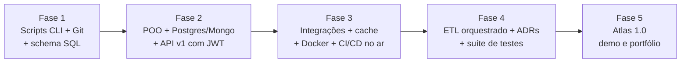

# 00.05 — Conhecendo o Projeto Atlas

> **Módulo 00 — Introdução** · Nível: N1 · Tempo estimado: 1h · Código: — (o Atlas nasce em código no módulo 01; ver `DECISOES.md` D-002)

## 1. Objetivo

- **Descrever** a Aurora Comércio: quem ela é, como opera e por que precisa de você.
- **Explicar** o caminho incremental do Atlas: de meia dúzia de scripts a uma plataforma completa, módulo a módulo, sem nunca recomeçar do zero.
- **Identificar** as regras do fio condutor (o que o Atlas exige e o que ele promete).
- **Criar** a casa do Atlas: a pasta do projeto com seu primeiro README — a entrega que fecha o módulo 00.

Ao final, você saberá exatamente o que está construindo nos próximos meses, para quem, e qual dor de negócio cada módulo da trilha resolve — e o repositório do projeto existirá.

---

## 2. Pré-requisitos

- [00.02 — O mapa do território](02-o-mapa-do-territorio-dados-e-backend.md) — os papéis e o caminho do dado.
- [00.03 — Preparando o ambiente](03-preparando-o-ambiente.md) — VS Code e terminal operacionais.
- [00.04 — Como estudar](04-como-estudar-o-sistema-de-retencao.md) — o sistema de retenção rodando.

**Autoteste:** (1) Qual papel do território constrói a esteira que alimenta um painel de vendas? (2) Como você executa um script pelo terminal a partir da raiz? (3) O que acontece ao concluir este capítulo, segundo o ritual de fim de sessão? Se travou, os capítulos indicados acima são a revisão dirigida.

---

## 3. Motivação

Existe um abismo entre dois tipos de portfólio. O primeiro é o cemitério de tutoriais: dez repositórios, cada um com um projeto pequeno copiado de um curso, nenhum com mais de 5 commits, todos abandonados no dia em que o vídeo acabou. Entrevistadores reconhecem esse padrão em segundos — e ele diz o contrário do que deveria: começa e não sustenta.

O segundo tipo é raro: **um** sistema que cresceu por meses. O histórico conta uma história — scripts viram classes, classes ganham banco, banco ganha API, API ganha testes, tudo ganha deploy. Quem lê os commits vê uma pessoa aprendendo a construir *e mantendo o que construiu*: refatorando sem destruir, documentando decisões, convivendo com o próprio código antigo — que é, precisamente, o trabalho real de quem é contratado.

O problema: projetos assim não acontecem por acaso. Sem um roteiro que conecte cada assunto novo a um sistema existente, todo capítulo tenderia a criar seu projetinho descartável — e você terminaria a trilha com 202 cemitérios pequenos em vez de uma catedral.

Este capítulo resolve isso assim: apresenta o roteiro completo do projeto único da trilha — a empresa, as dores, as entregas — e termina com você fundando o repositório onde tudo vai acontecer.

---

## 4. Modelo mental

> 🧠 **Modelo mental**
> O Atlas é um **personagem que envelhece com a história** — não uma sequência de cenários descartáveis. Cada módulo é uma "sprint" que resolve uma dor real da Aurora *no estado atual do sistema*: o código que você escreve no módulo 01 é o mesmo que você refatora no 04, conecta ao banco no 05 e expõe via API no 06. Regra de ferro: **o Atlas nunca recomeça — ele evolui.**

**Exercício de previsão.** No módulo 04, você aprenderá POO e verá que os scripts do módulo 01 "fazem tudo errado" à luz do novo conhecimento. Sem consultar nada, decida o que o método manda fazer:

- (a) Apagar os scripts antigos e reescrever o Atlas do zero, agora "do jeito certo".
- (b) Manter os scripts antigos intactos e criar um projeto novo em paralelo, mais organizado.
- (c) Refatorar os scripts existentes — transformá-los por dentro, em commits explicativos, preservando o histórico.

*Resposta comentada:* (c). Reescrever do zero (a) destruiria o artefato mais valioso do projeto — o histórico da evolução — e é um luxo que empresas quase nunca podem pagar (você precisa treinar o que o mercado pratica: evoluir código vivo). Projetos paralelos (b) criam o cemitério que a Motivação descreveu. A refatoração com histórico é a resposta do método — e "sentir vergonha do código de dois módulos atrás" não é problema: é a métrica visível do seu progresso.

---

## 5. Analogia

O Atlas cresce como uma **casa que a família amplia morando nela**. Primeiro um cômodo com o essencial (os scripts do módulo 01); depois encanamento e fiação decentes (banco de dados), uma porta de entrada com campainha e chave (API com autenticação), medidores e disjuntores (testes e monitoramento). Em nenhum momento a família demole tudo para "recomeçar direito" — cada reforma acontece com a casa habitada, e as marcas das reformas contam a história dela.

**Onde a analogia quebra:** reformar uma casa habitada é tormento; refatorar código com testes e versionamento é rotina segura — o Git guarda cada parede antiga (você pode voltar a qualquer estado), e os testes avisam na hora se uma "reforma" quebrou o encanamento. Em software, a reforma contínua não é o preço do projeto: é a habilidade que ele ensina.

---

## 6. Teoria

### A Aurora Comércio

A **Aurora Comércio** é um e-commerce brasileiro fictício de médio porte em crescimento acelerado: vende eletrônicos e acessórios, opera de Campinas-SP, atende o país inteiro. Como toda empresa que cresceu rápido, ela é um caos funcional: pedidos em planilhas, relatórios feitos à mão, cada área com seus números — e ninguém confiando nos números de ninguém. Você é (ficcionalmente) a **primeira pessoa de engenharia de dados/backend da casa**. Não há legado para manter nem sênior para aprovar: há dores para resolver, uma por vez.

O nome da plataforma que você vai construir para ela: **Atlas** — o sistema que carrega os dados da Aurora nas costas.

### O roteiro: uma dor por módulo

Cada módulo da trilha abre com uma dor concreta da Aurora e fecha com uma entrega do Atlas que a resolve. O roteiro completo (guarde o padrão, não as linhas):

| Módulo | A dor da Aurora | O que o Atlas ganha |
|---|---|---|
| 01 | "Ninguém sabe quanto vendemos por cidade" | Scripts CLI de relatórios sobre CSV |
| 02 | "Perdemos uma versão do script ontem" | Versionamento Git + automações shell |
| 03 | "Os dados estão em 14 planilhas diferentes" | Schema relacional modelado e populado |
| 04 | "O script virou um monstro de 800 linhas" | Refatoração POO + CLI robusta + logging |
| 05 | "SQLite não aguenta; o catálogo muda toda semana" | PostgreSQL (ORM + migrações) + MongoDB |
| 06 | "O time do app precisa acessar os dados" | **API Atlas v1** (CRUD, JWT, OpenAPI) |
| 07 | "Precisamos falar com transportadora e gateway" | Integrações resilientes + cache + webhooks |
| 08 | "Configurar a máquina de um dev leva 2 dias" | Tudo sobe com `docker compose up` |
| 09 | "Subir versão nova é um ritual de risco" | Publicação com CI/CD |
| 10 | "Decidimos com dados de 3 semanas atrás" | Plataforma de dados: ETL diário orquestrado |
| 11 | "Ninguém sabe por que o sistema é assim" | Arquitetura documentada (ADRs) + camadas |
| 12 | "Temos medo de mexer no código" | Suíte de testes oficial no CI |
| 13 | — | Consolidação final: Atlas 1.0, demo e apresentação |

Repare no desenho: as dores não são pretexto didático — são a **ordem natural** em que empresas reais sentem essas dores, e portanto a ordem em que as tecnologias foram inventadas para resolvê-las. Você não estuda Docker "porque está no currículo"; estuda no módulo em que a Aurora sangra sem ele.

### As regras do fio condutor

1. **Todo capítulo que toca o Atlas diz exatamente quais arquivos cria ou modifica** — nunca "melhore seu projeto", sempre instrução precisa.
2. **Refatorações destroem código antigo apenas via commits explicativos** — o histórico é artefato de portfólio; você aprenderá a lê-lo como biografia.
3. **O Atlas nunca exige conteúdo futuro** — se uma entrega pede algo, esse algo já foi ensinado. A promessa de progressão linear vale dobrada aqui.
4. **Ao fim de cada fase, o README do Atlas é atualizado** com o estado atual — treino de documentação disfarçado de rotina.

### Onde ele mora

O código vive em `13-Projetos/atlas/` desde já — a pasta que você funda hoje. O endereço parece estranho ("por que na pasta do módulo 13?"): é proposital. O Atlas não pertence a nenhum módulo — ele atravessa todos e culmina no 13, onde vira o projeto integrador **Atlas 1.0**, avaliado com rubrica completa e roteiro de demo.

---

## 7. Funcionamento interno

Por dentro, o fio condutor aplica dois princípios da ciência da aprendizagem que você já conhece — agora em escala de meses. Primeiro, a **transferência**: conhecimento aplicado num contexto rico e contínuo (o mesmo sistema, com histórico e consequências) transfere para situações novas muito melhor do que exercícios isolados — cada conceito novo se ancora em algo que você construiu, não num exemplo descartável. Segundo, a **reconstrução de confiança por evidência acumulada** (princípio nº 9 da filosofia): em semanas de platô, quando a sensação de progresso some, `git log` no Atlas mostra a distância objetiva entre o dia 1 e hoje — e sensação perde para evidência. O projeto é, ao mesmo tempo, instrumento pedagógico e antidepressivo técnico.

---

## 8. Visualização do fluxo

A linha do tempo do Atlas — o mesmo sistema, fotografado ao fim de cada fase:



**Como ler:** cada caixa é o **estado acumulado** do mesmo repositório — nada se perde entre as fases; tudo à esquerda continua existindo (evoluído) dentro das caixas à direita. Compare com o mapa do território do 00.02: a Fase 2 constrói o lado "servir", a Fase 4 o lado "transformar", a Fase 3 a esteira que sustenta ambos. O Atlas é o mapa do território construído por você, em código.

---

## 9. Aplicação prática

Hoje o Atlas ganha endereço. Três passos, todos no VS Code com o repositório do manual aberto.

**Passo 1 — Confirme a casa.** No explorador de arquivos do VS Code, navegue até `13-Projetos/atlas/` — a pasta já existe na estrutura do repositório, vazia. É ela.

**Passo 2 — Funde o repositório do projeto.** O Atlas terá vida própria no Git (histórico separado do manual). Abra o terminal integrado (`Ctrl+'`) e execute:

```bash
cd 13-Projetos/atlas
git init
```

```text
Initialized empty Git repository in .../13-Projetos/atlas/.git/
```

> 📦 **Caixa-preta: `git init`**
> Por enquanto, trate este comando como a fundação do cartório do projeto: ele cria (na pasta oculta `.git/`) o mecanismo que registrará cada versão futura do Atlas. Você ainda não sabe usá-lo — e não precisa: o módulo 02 (capítulos 02.08 e 02.09) abre esta caixa por completo, e o primeiro commit do Atlas acontece lá, com você entendendo cada palavra do que está fazendo. (O comando `cd` — mudar de pasta — também é formalizado em 02.02.)

**Passo 3 — Escreva a certidão de fundação.** Crie o arquivo `13-Projetos/atlas/README.md` (botão direito na pasta → *New File*) com o estado zero do projeto:

```markdown
# Atlas — Plataforma de Dados e Serviços da Aurora Comércio

Projeto fio condutor do Manual Mestre: começa como scripts de
relatório e evolui, módulo a módulo, até uma plataforma completa
(API autenticada, bancos, ETL orquestrado, filas, CI/CD e testes).

## Estado atual

- **Fase:** 0 — fundação
- **Módulo:** 00 concluído — repositório criado, primeira entrega no módulo 01
- **Como rodar:** ainda não há o que rodar. Em breve.

## Histórico de fases

| Fase | Entrega | Estado |
|---|---|---|
| 1 | Scripts CLI + Git + schema SQL | aguardando |
| 2 | POO + Postgres/Mongo + API v1 | aguardando |
| 3 | Integrações + Docker + CI/CD | aguardando |
| 4 | ETL orquestrado + ADRs + testes | aguardando |
| 5 | Atlas 1.0 — consolidação e demo | aguardando |
```

Um README que diz "ainda não há o que rodar" é honesto e profissional — infinitamente melhor que um README vazio ou inflado. Você o atualizará ao fim de cada fase (regra 4 do fio condutor).

---

## 10. Código comentado

O Atlas ainda não tem código — por desenho: sua primeira entrega executável nasce no módulo 01, quando a Aurora apresentar a primeira dor ("ninguém sabe quanto vendemos por cidade") e você tiver as ferramentas para resolvê-la (registro da exceção: `DECISOES.md`, D-002). O que este capítulo entrega é a fundação não executável — pasta, repositório Git e README — que os capítulos do módulo 01 pressupõem existir. A partir de 01.25 (o mini projeto do módulo), esta seção volta a ter arquivos completos para rodar — e eles serão **do Atlas**.

---

## 11. Erros comuns

Erros de **relação com o projeto** — os três que transformam fio condutor em cemitério (formato mantido; ver D-003).

### Erro 1 — Recomeçar do zero a cada surto de conhecimento novo

**Sintoma:** ao fim do módulo 04, envergonhado dos scripts do 01, você apaga tudo e reescreve "limpo" — e repete a cada módulo; no fim, o histórico tem 4 "inícios do projeto" e nenhuma evolução.
**Causa:** confundir vergonha do código antigo (sinal de progresso) com defeito do projeto (que não existe — o código do 01 era o melhor possível com as ferramentas do 01).
**Correção:** regra de ferro do modelo mental: o Atlas **evolui**, nunca recomeça. A resposta certa à vergonha é a refatoração com commits explicativos — que o módulo 04 ensina e agenda explicitamente.

### Erro 2 — Enfeitar o Atlas com tecnologia de módulos futuros

**Sintoma:** empolgado com um vídeo sobre Docker, você tenta containerizar o Atlas no módulo 03; duas noites depois, nada funciona, você não sabe por quê, e o cronograma da semana afundou.
**Causa:** o Atlas parece o lugar natural para "testar coisas novas" — mas ele exige apenas conteúdo já ensinado (regra 3) exatamente para ser terreno firme, não laboratório de riscos.
**Correção:** anseios de futuro vão para uma nota em `meu-plano.md` ("quero entender X — chega no módulo Y"). O Atlas recebe cada tecnologia no módulo dela, quando você puder sustentá-la — inclusive quando ela quebrar.

> ⚠️ **Atenção**
> Este erro é o gêmeo do "estudar ferramenta antes de território" (00.02, Erro 3) — mas aqui ele custa mais, porque quebra o artefato que sustenta o resto da trilha. O Atlas quebrado desmotiva como nenhum exercício errado desmotiva.

### Erro 3 — Tratar as entregas do Atlas como opcionais ("depois eu faço")

**Sintoma:** você faz os exercícios dos capítulos mas empurra as entregas do Atlas ("é só juntar o que já sei"); no módulo 05, a entrega pressupõe o schema do 03 e a refatoração do 04 — que não existem, e agora são 3 entregas acumuladas bloqueando a trilha.
**Causa:** a entrega do Atlas parece redundante com os exercícios — mas ela é o único nível de prática que **integra** os capítulos (Bloom 6: criar) e o único que os módulos seguintes **pressupõem fisicamente**.
**Correção:** a entrega Atlas é requisito do CP3 da fase, com rubrica — status de prova, não de lição extra. Atrasou uma? Ela entra como bloqueio na agenda, antes de qualquer capítulo novo, como revisão vencida.

---

## 12. Boas práticas

✅ **Releia o `git log` do Atlas (a partir do módulo 02) nas semanas de platô** — evidência acumulada vence sensação de estagnação; é o antidepressivo técnico da seção 7.

✅ **Mantenha o README do Atlas honesto sobre o estado atual** — "ainda não roda" documentado vale mais que promessa inflada; recrutadores leem READMEs, e leem ceticismo.

✅ **Anote em `meu-plano.md` cada vontade de antecipar tecnologia** — a vontade é ótima (é curiosidade com endereço); a nota preserva a curiosidade e protege o cronograma.

✅ **Trate cada entrega Atlas como demo para um gestor fictício** — "funciona e eu sei explicar" é o padrão; apresentar (nem que seja para o espelho) é ensaio direto do módulo 13.

❌ **Evite embelezamentos fora de escopo nas entregas** — a entrega do módulo 01 com "só mais uma featurezinha" é como dívidas pequenas: individualmente inofensivas, acumuladas fatais.

❌ **Evite comparar seu Atlas com projetos prontos do GitHub** — você está vendo o resultado deles sem o histórico; o valor do seu está precisamente no histórico.

---

## 13. Performance

Nesta escala, irrelevante — hoje o Atlas é uma pasta com um README, e você saberá quando performance importar: o próprio Atlas será o laboratório disso (medições de consulta no 05.11, cache no 07.09, otimização de imagem no 08.08, benchmark de pipeline no 10.12 — tudo medido **nele**, com números seus). É a última vez que esta seção diz "irrelevante" com o Atlas envolvido.

---

## 14. Mercado

> 🏢 **Mercado**
> O que o Atlas simula tem nome no mercado: ser o **primeiro engenheiro** de uma empresa pequena — cenário comum no Brasil (PMEs digitalizando, startups early-stage) e um dos melhores aceleradores de carreira que existem, porque obriga a decidir, errar e sustentar as consequências sem rede. Entrevistadores de vagas júnior/pleno dão peso desproporcional a candidatos que demonstram essa vivência — e um projeto pessoal com 6 meses de histórico, decisões documentadas e evolução visível é a simulação mais crível dela que um autodidata consegue apresentar. O roteiro de dores da Aurora foi desenhado para que, ao final, você tenha uma história real para cada pergunta comportamental clássica ("um refactor difícil", "uma decisão técnica que você defendeu", "um erro que virou aprendizado").
>
> **Mini-cenário:** dentro da ficção da trilha, a gestora da Aurora não pediu "uma plataforma de dados" — pediu que alguém fizesse os números de vendas baterem. A plataforma é o que emerge de resolver bem, em sequência, treze pedidos concretos. Guarde essa inversão: no mercado, arquitetura boa quase nunca começa como projeto de arquitetura — começa como dor resolvida com disciplina.

---

## 15. Entrevistas

**P1. "Me conta desse projeto Atlas no seu GitHub — o que é?"**
*Resposta esperada:* o *pitch* de 60 segundos, treinável desde já: contexto (plataforma de dados/backend de um e-commerce fictício, construída ao longo de uma formação), escopo técnico (API FastAPI autenticada, Postgres/Mongo, ETL orquestrado, Docker, CI/CD, testes), e o diferencial (histórico completo de evolução: dá para ver o sistema crescendo de scripts a plataforma, com decisões documentadas). Fechar oferecendo a demo.

**P2. "Por que um projeto fictício e não contribuições a projetos reais?"**
*Resposta esperada:* sem defensividade: o projeto cobre o ciclo completo (modelagem → API → dados → deploy → testes) que contribuições pontuais raramente cobrem; as decisões são todas suas e você as defende todas; e nada impede as duas coisas — o projeto é a base, contribuições são o próximo passo. Honestidade + plano.

**P3. "O que você faria diferente se recomeçasse o projeto hoje?"**
*Resposta esperada:* a pergunta testa maturidade, não perfeição. Resposta forte cita 1–2 decisões reais com trade-off ("modelaria X assim, porque Y me custou Z") e **recusa a premissa implícita**: "mas não recomeçaria — evoluiria, como fiz nas refatorações dos módulos 4 e 11; o histórico delas está no repositório". Transformar a pergunta em prova da sua tese.

**Pegadinha clássica: "Esse projeto foi você que fez mesmo? Seguiu um curso?"**
Ela derruba quem gagueja ou quem mente ("100% autoral!") — o entrevistador testará com uma pergunta de profundidade em seguida. A saída forte: transparência com prova de posse: "segui uma trilha estruturada, sim — as decisões de implementação e os erros do caminho são meus, e posso te mostrar qualquer trecho e explicar por que está daquele jeito; pode escolher o arquivo". Quem construiu de verdade *convida* a auditoria.

---

## 16. Exercícios guiados

Enunciados completos em [`exercicios/cap05.md`](exercicios/cap05.md); gabaritos em [`exercicios/gabaritos/cap05.md`](exercicios/gabaritos/cap05.md).

### Aquecimento

- **A1** `[~5 min · roteiro de dores]` — Associe 6 dores da Aurora ao módulo que as resolve, de memória.
- **A2** `[~5 min · regras do fio condutor]` — Julgue 4 atitudes como compatíveis ou incompatíveis com as regras do Atlas.
- **A3** `[~5 min · linha do tempo]` — Ordene 8 marcos do Atlas na sequência correta das fases.

### Aplicação

- **AP1** `[~20 min · fundação completa]` — Execute os 3 passos da seção 9 (pasta, `git init`, README) e valide cada um.
- **AP2** `[~15 min · dor → entrega → tecnologia]` — Para 3 dores da Aurora, escreva a cadeia completa: por que a dor existe, o que a entrega resolve, e qual tecnologia estreia.
- **AP3** `[~15 min · o pitch]` — Escreva e cronometre seu pitch de 60 segundos do Atlas (P1 da seção 15) — versão de hoje, sabendo que ele será reescrito por fase.

---

## 17. Desafios

- **D1** `[~30 min · leitura de futuro]` — **A 14ª dor.** O roteiro para no módulo 13 — mas a Aurora continuaria crescendo. Invente a dor seguinte dela (realista, coerente com o crescimento) e esboce: que entrega a resolveria, que tecnologias envolveria, e o que da trilha te prepararia (ou não) para ela. Pesquisa dirigida: a tabela de dores da seção 6; o §24 da spec (o estado final do Atlas).

<details><summary>💡 Dica 1 (conceito)</summary>
Siga o padrão do roteiro: dores nascem de crescimento (volume, gente nova, clientes maiores) — o que dói numa empresa cujo sistema do §24 já funciona?
</details>
<details><summary>💡 Dica 2 (estratégia)</summary>
Candidatas clássicas: escala (o ETL diário deixou de dar conta — e aí?), pessoas (10 devs no mesmo código), clientes (o parceiro grande exige SLA e relatórios próprios). Escolha uma e desça ao concreto.
</details>
<details><summary>💡 Dica 3 (esqueleto)</summary>
Formato-espelho da tabela: | 14 | "dor em uma frase dita por alguém da Aurora" | entrega | tecnologias |. + 5 linhas de justificativa.
</details>

---

## 18. Mini projeto

**Fundação do Atlas — mini projeto do módulo 00** `[~1h30]` — a entrega que fecha o módulo (escala reduzida registrada em D-006: o módulo 00 é calibração).

Requisitos numerados:

1. **Ambiente provado:** veredito APROVADO 4/4 do `valida_ambiente.py` registrado (herdado do 00.03 — conferir, não refazer).
2. **Atlas fundado:** pasta `13-Projetos/atlas/` com `git init` executado e `README.md` no padrão da seção 9 (estado honesto, tabela de fases).
3. **Sistema de estudo operante:** `PROGRESSO.md` e `Revisoes/agenda.md` verdadeiros e completos até aqui; ≥1 revisão D+1 executada e registrada (herdado do 00.04 — conferir).
4. **Arquivos pessoais no lugar:** `meu-plano.md` (00.01), `minhas-vagas.md` (00.02) e `meu-protocolo-de-atraso.md` (00.04) existem na raiz.
5. **O pitch v0:** o texto do AP3 salvo no fim do seu `meu-plano.md`, datado — será sua régua de progresso nas fases.

**Rubrica (autoavaliação, escala 0–4 por critério — §22 da spec):** Funcionalidade (os 5 requisitos existem e conferem) · Robustez (os arquivos refletem a realidade — teste do estranho: outra pessoa entenderia seu estado atual só pelos arquivos?) · Organização (tudo no lugar certo da árvore) · Documentação (README do Atlas honesto e no padrão). **Aprovação: soma ≥ 12/16, nenhum critério < 2.** Avalie 1 dia depois de terminar — distância melhora julgamento.

---

## 19. Revisão

**Resumo do capítulo:**

- A Aurora é o cliente fictício de toda a trilha: e-commerce em crescimento caótico onde você é a primeira pessoa de engenharia — cada módulo resolve uma dor real dela.
- O Atlas é o projeto único que **evolui e nunca recomeça**: scripts → classes → bancos → API → operação → plataforma; o histórico Git é o artefato de portfólio.
- As 4 regras do fio condutor: instruções precisas de arquivos, refatoração só com commits explicativos, nunca exigir conteúdo futuro, README atualizado por fase.
- Ele mora em `13-Projetos/atlas/` — fundado hoje com `git init` (caixa-preta até o módulo 02) e um README honesto.
- Os 3 erros fatais de relação com o projeto: recomeçar do zero, antecipar tecnologia futura, tratar entregas como opcionais.
- Vergonha do código antigo é métrica de progresso, não defeito — a resposta a ela é refatoração com histórico, nunca demolição.

**Flashcards novos** (adicionados a [`revisao/flashcards.md`](revisao/flashcards.md)):

| ID | Frente | Verso |
|---|---|---|
| 00.05-F1 | Qual é a regra de ferro do Atlas e por que ela existe? | O Atlas **evolui, nunca recomeça**: o histórico de evolução é o artefato de portfólio — e evoluir código vivo é o trabalho real que o mercado pratica. |
| 00.05-F2 | Explique com suas palavras: por que sentir vergonha do código de 2 módulos atrás é bom sinal? | (Elaboração) A vergonha mede a distância entre quem escreveu e quem relê — é o progresso visível; a resposta é refatorar com histórico, não demolir. |
| 00.05-F3 | Preveja: no módulo 03 você quer containerizar o Atlas "para praticar Docker". O que o método diz? | (Previsão) Não: o Atlas só recebe conteúdo já ensinado (regra 3). A vontade vira nota em `meu-plano.md`; o Docker chega no módulo 08, com a dor que o justifica. |
| 00.05-F4 | Quando a entrega Atlas de um módulo pode ser pulada ou adiada livremente? | (Decisão) Nunca livremente: ela é requisito do CP3 com rubrica, e os módulos seguintes a pressupõem fisicamente. Atraso vira bloqueio na agenda, como revisão vencida. |
| 00.05-F5 | O que o `git init` fundou hoje — e quando a caixa-preta abre? | O mecanismo de registro de versões do Atlas (pasta `.git/`); aberta por completo em 02.08–02.09, onde acontece o primeiro commit consciente. |

**Agendamento:** registre no `PROGRESSO.md` e marque D+1, D+7, D+30, D+90 na [`Revisoes/agenda.md`](../Revisoes/agenda.md).

---

## 20. Checklist

Perguntas de domínio — teste do sim:

- [x] Sei explicar *quem é a Aurora, o que é o Atlas e a relação dor → entrega por módulo (o padrão, com 3+ exemplos)*?
- [x] Sei explicar *as 4 regras do fio condutor e o que cada uma protege*?
- [x] Sei explicar *por que o Atlas nunca recomeça — e o que fazer com a vergonha do código antigo*?
- [x] Sei identificar *os 3 erros fatais de relação com o projeto (e qual deles me tentaria mais)*?
- [x] Sei responder *ao pitch de 60 segundos e à pegadinha "foi você mesmo que fez?"*?

Itens práticos:

- [x] Fundei o Atlas: pasta + `git init` + README no padrão.
- [x] Fiz os exercícios de Aquecimento e Aplicação (pitch cronometrado incluso).
- [x] Completei o mini projeto do módulo (5 requisitos) e me autoavaliei pela rubrica — 1 dia depois.
- [x] Registrei tudo no `PROGRESSO.md` e agendei as 4 revisões deste capítulo.

---

## 21. Próximo capítulo

O módulo 00 termina aqui — método, mapa, oficina, sistema de retenção e projeto fundado. Antes do módulo 01, feche o ciclo do módulo: faça o pacote de revisão em [`revisao/`](revisao/resumo.md) (resumo, mapa mental e questões) e depois o **simulado CP2** em [`Simulados/modulo-00.md`](../Simulados/modulo-00.md) — sua primeira nota de corte de verdade (≥ 8/10 objetivas + prático ≥ 3). Aprovado? O capítulo [01.01 — O que é Python e por que ele domina](../01-Python/01-o-que-e-python-e-por-que-ele-domina.md) abre o módulo em que a Aurora apresenta a primeira dor — e você escreve as primeiras linhas do Atlas.

---

*Gerado sob spec 3.0.0*
