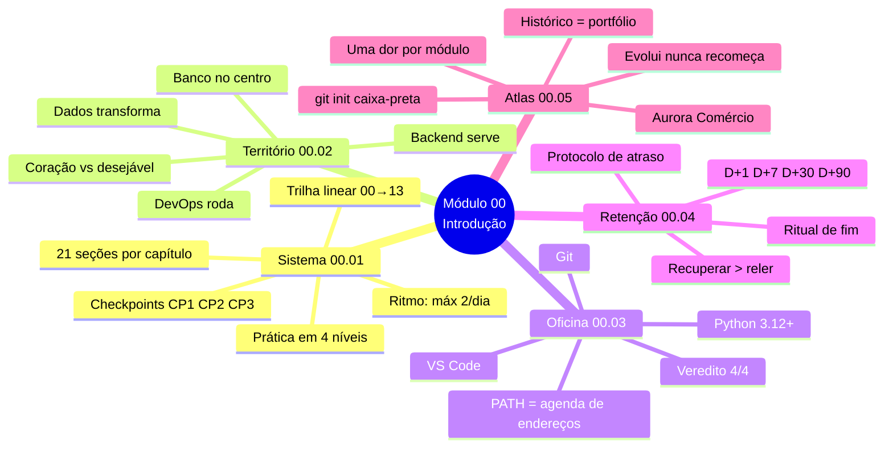

# Mapa mental — Módulo 00

Abra a pré-visualização (`Ctrl+Shift+V`) para ver o mapa renderizado. Use nas revisões D+7/D+30: cubra um ramo, reconstrua-o em voz alta, confira.

```mermaid
mindmap
  root((Módulo 00<br/>Introdução))
    Sistema 00.01
      Trilha linear 00→13
      21 seções por capítulo
      Prática em 4 níveis
      Checkpoints CP1 CP2 CP3
      Ritmo: máx 2/dia
    Território 00.02
      Backend serve
      Dados transforma
      DevOps roda
      Banco no centro
      Coração vs desejável
    Oficina 00.03
      Python 3.12+
      VS Code
      Git
      PATH = agenda de endereços
      Veredito 4/4
    Retenção 00.04
      Recuperar > reler
      D+1 D+7 D+30 D+90
      Ritual de fim
      Protocolo de atraso
    Atlas 00.05
      Aurora Comércio
      Uma dor por módulo
      Evolui nunca recomeça
      Histórico = portfólio
      git init caixa-preta
```
