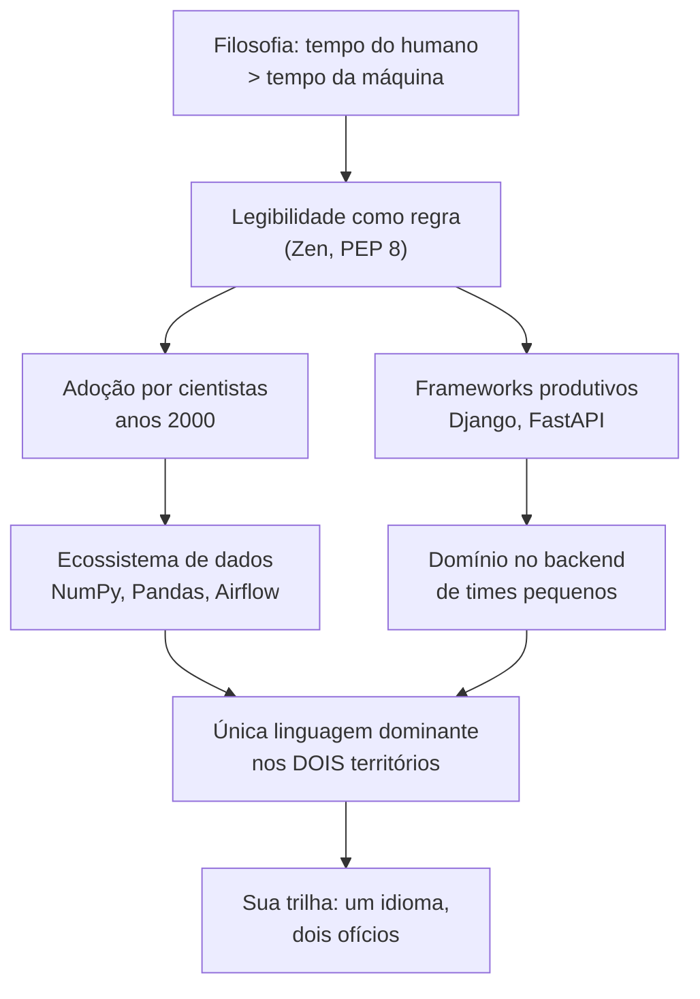

# 01.01 — O que é Python e por que ele domina

> **Módulo 01 — Python Fundamental** · Nível: N1 · Tempo estimado: 2h · Código: `codigo/cap01/`

## 1. Objetivo

- **Explicar** a filosofia do Python — legibilidade primeiro — e o que "otimizar para o tempo do humano" significa na prática.
- **Descrever** por que Python venceu em dados e backend, e em quais territórios ele perde (com honestidade).
- **Identificar** o que é o CPython e o que a versão 3.12 representa.
- **Reconhecer** código "com cara de Python" — antes mesmo de saber escrevê-lo.

Ao final, você terá executado seus primeiros arquivos Python de verdade e saberá defender, com argumentos técnicos, a escolha de linguagem que sustenta sua formação inteira.

---

## 2. Pré-requisitos

- [Módulo 00 completo](../00-Introducao/00-visao-do-modulo.md), com CP2 aprovado — em especial [00.03](../00-Introducao/03-preparando-o-ambiente.md) (ambiente validado).

**Autoteste:** (1) Seu `valida_ambiente.py` deu veredito 4/4? (2) Você sabe abrir o terminal integrado e rodar um script a partir da raiz? (3) Em qual território do mapa (00.02) o Python é a aposta única da trilha? Se travou na 1 ou na 2, volte ao 00.03 antes de seguir — este módulo executa código em todo capítulo.

---

## 3. Motivação

Primeira semana na Aurora (ficcionalmente). A gestora te entrega a dor do módulo: *"Ninguém aqui sabe quanto vendemos por cidade. O sistema exporta um CSV com os pedidos, o estagiário monta a planilha à mão toda segunda, e cada versão dá um número diferente."* Você vai resolver isso com meia dúzia de scripts — mas antes de escrever a primeira linha, uma pergunta merece resposta honesta: **por que em Python?**

Não é pergunta retórica. A resposta errada — "porque é a linguagem que estou aprendendo" — te desarma na primeira conversa técnica. E a pergunta volta a vida inteira: em entrevista ("por que Python e não Go?"), em reunião ("não era melhor fazer isso em Java?"), na sua própria cabeça ao ver benchmarks onde Python perde feio.

Há também um motivo mais imediato: você vai passar ~70 horas neste módulo. Entender *o que a linguagem valoriza* muda como você a estuda — quem sabe que Python otimiza legibilidade lê código como texto e cobra clareza de si mesmo; quem não sabe, decora sintaxe.

Este capítulo resolve isso assim: apresenta a filosofia, o histórico e os números que explicam o domínio do Python em dados e backend — e as fraquezas reais que ele tem — para que sua escolha de ferramenta seja uma decisão que você sabe defender.

---

## 4. Modelo mental

> 🧠 **Modelo mental**
> Python foi desenhado com uma prioridade explícita: **o tempo do humano vale mais que o tempo da máquina.** Quase toda decisão da linguagem — sintaxe enxuta, indentação obrigatória, nomes por extenso — troca um pouco de desempenho do computador por muita clareza para quem lê. Consequência prática: código Python se lê quase como inglês técnico, e "feio de ler" é considerado defeito, não estilo.

**Exercício de previsão.** Você ainda não estudou sintaxe nenhuma. Mesmo assim, leia o trecho abaixo e decida: o que ele imprime?

```python
cidades = ["Campinas", "Santos", "Campinas", "São Paulo", "Campinas"]
contagem = cidades.count("Campinas")
print(contagem)
```

*Resposta comentada:* imprime `3`. Se você acertou — e a maioria acerta — repare no que acabou de acontecer: você **leu** um programa numa linguagem que não conhece, porque os nomes dizem o que fazem (`count` conta, `print` imprime) e a estrutura não esconde nada. Isso não é acaso: é a filosofia do modelo mental funcionando a seu favor. É por isso que a trilha exige ler código em voz alta desde já.

---

## 5. Analogia

Linguagens de programação são como **veículos**. Existem carros de Fórmula 1 (C, Rust): velocidade máxima, mas cada ajuste exige uma equipe de engenheiros e qualquer erro bate forte. Existem caminhões pesados (Java, C#): robustos, cheios de protocolo para operar, ótimos em frota grande. Python é a **picape confiável**: não vence corrida nenhuma, mas carrega quase qualquer coisa, qualquer pessoa habilitada dirige em minutos, e peças e mecânicos existem em toda esquina — o ecossistema gigante de bibliotecas.

**Onde a analogia quebra:** um veículo você troca conforme a viagem; num projeto de software, trocar de linguagem no meio custa caríssimo. Por isso a escolha pesa tanto — e por isso empresas escolhem a "picape" para a maioria das viagens: o custo dominante de software não é a execução, é o time entendendo e mantendo o código por anos.

---

## 6. Teoria

### O que é Python, formalmente

Python é uma linguagem de programação **interpretada** (*interpreted*) — seu código é executado por um programa chamado **interpretador** (*interpreter*), linha após linha, sem uma etapa separada de compilação visível para você (o 01.02 abre esse funcionamento). É também de **tipagem dinâmica** (*dynamic typing*) — você não declara tipos ao criar variáveis (o 01.03 mostra o que isso significa de verdade) — e de **propósito geral**: serve para scripts de 10 linhas e sistemas de milhões.

O interpretador que você instalou no 00.03 chama-se **CPython** — a implementação oficial e de referência, escrita em C. Quando alguém diz "Python 3.12", está falando de uma versão dessa implementação. A trilha usa ≥ 3.12 e ignora o Python 2, aposentado oficialmente em 2020.

### A filosofia escrita: o Zen do Python

A filosofia da linguagem está documentada num texto curto chamado **Zen do Python** (*The Zen of Python*, PEP 20) — 19 aforismos escondidos como easter egg no próprio interpretador (você vai executá-lo na seção 9). Os quatro que mais importam para a trilha:

| Aforismo | Tradução prática |
|---|---|
| *Beautiful is better than ugly* | Legibilidade é requisito, não luxo |
| *Explicit is better than implicit* | Código que esconde o que faz é código ruim |
| *Simple is better than complex* | A solução direta vence a esperta |
| *Readability counts* | Alguém (você em 6 meses) vai ler isso |

> 📌 **Observação**
> "PEP" significa *Python Enhancement Proposal* — o mecanismo público pelo qual a linguagem evolui. Você já conhece o mais famoso de todos sem saber: o guia de estilo **PEP 8**, que fecha este módulo no capítulo 01.25.

### Por que Python venceu em dados e backend

**Nos dados**, a vitória foi por ecossistema: nos anos 2000, cientistas criaram em Python as bibliotecas numéricas que viraram fundação de tudo (NumPy, depois Pandas) — e cada nova ferramenta de dados passou a nascer onde os dados já estavam. Hoje, a esteira inteira do módulo 10 (Pandas, Polars, Airflow) fala Python nativamente.

**No backend**, a vitória foi por produtividade: frameworks como Django e FastAPI permitem que um time pequeno coloque uma API robusta no ar em dias — e, como você viu no 00.02, a maioria das empresas contratantes são times pequenos. O FastAPI (módulo 06) é hoje um dos frameworks mais adotados do mundo justamente por somar produtividade com validação e documentação automáticas.

**E a soma é o argumento decisivo** (o do 00.02): é a única linguagem *dominante nos dois territórios ao mesmo tempo*. O mesmo profissional — você — transita da API para o pipeline sem trocar de língua.

### Onde Python perde — e por que tudo bem

Honestidade técnica: Python é **lento** em execução bruta comparado a linguagens compiladas — frequentemente dezenas de vezes mais lento em cálculo puro. Também consome mais memória e tem limitações de paralelismo (o GIL, que o 04.21 destrincha). Por que isso raramente decide? Porque nos territórios da trilha o gargalo quase nunca é a CPU executando Python: APIs passam o tempo esperando banco e rede; pipelines pesados delegam o trabalho bruto a bibliotecas internamente escritas em C/Rust (Pandas, Polars) — Python é o maestro, não a orquestra. Quando o gargalo é mesmo execução pura (jogos, sistemas embarcados, motores de banco), usa-se outra ferramenta — e dizer isso numa entrevista soma pontos, não perde.

---

## 7. Funcionamento interno

Por dentro, "Python" são três coisas que iniciantes misturam: a **linguagem** (as regras de escrita, definidas em documentos públicos), a **implementação** (o CPython — o programa que de fato executa, instalado na sua máquina) e a **biblioteca padrão** (*standard library* — centenas de módulos prontos que vêm juntos: o `csv` que você usará no 01.22, o `json` do 01.23, o `platform` que o `valida_ambiente.py` já usou). Existem outras implementações da mesma linguagem (PyPy, MicroPython), o que prova que "Python" é o contrato, não o executável. Nesta profundidade N1, guarde o mapa em uma frase: *a linguagem define, o CPython executa, a biblioteca padrão acompanha* — o caminho interno da execução é o assunto inteiro do próximo capítulo.

---

## 8. Visualização do fluxo

De onde vem e para onde vai o domínio do Python — o capítulo em um diagrama:



**Como ler:** tudo desce da decisão filosófica do topo. A legibilidade atraiu quem não era programador profissional (cientistas — ramo esquerdo) e acelerou quem era (frameworks — ramo direito); os dois ramos convergem no argumento que fecha o capítulo e justifica a trilha: um idioma, dois ofícios.

---

## 9. Aplicação prática

Hora de executar Python de verdade — três momentos, todos no terminal integrado (`Ctrl+'`), a partir da raiz do repositório.

**Momento 1 — O interpretador responde.** Digite:

```bash
python --version
```

```text
Python 3.12.4
```

É o CPython da seção 6, se apresentando. (Linux/macOS: `python3`, como sempre.)

**Momento 2 — O Zen, direto da fonte.** O easter egg da filosofia:

```bash
python -m this
```

```text
The Zen of Python, by Tim Peters

Beautiful is better than ugly.
Explicit is better than implicit.
Simple is better than complex.
(...e mais 16 linhas)
```

A opção `-m` pede ao interpretador para executar um módulo da biblioteca padrão pelo nome — neste caso, o módulo `this`, que existe só para imprimir o Zen. Releia os 4 aforismos da tabela da seção 6 no original.

**Momento 3 — Seus dois primeiros arquivos.** Execute os dois scripts do capítulo:

```bash
python 01-Python/codigo/cap01/ola_aurora.py
python 01-Python/codigo/cap01/leitura_em_voz_alta.py
```

O primeiro é o "alô" da trilha; o segundo é o exercício de previsão da seção 4, agora executável — rode e confira sua resposta. Os dois arquivos estão anotados na seção 10; leia cada linha **em voz alta** antes de rodar. Essa prática — ler código como texto — é treino deliberado a partir de agora.

---

## 10. Código comentado

Dois arquivos, ambos em [`codigo/cap01/`](codigo/cap01/).

> 📦 **Caixa-preta: `print(...)`**
> `print` exibe valores na tela — é tudo que você precisa saber por ora, e é o que a trilha usará em quase todo exemplo até aqui. O tratamento completo de entrada e saída (incluindo os ajustes finos do `print`) é o capítulo 01.07.

```python
# ------------------------------------------------------------
# ola_aurora.py
# Capítulo 01.01 — O que é Python e por que ele domina
# O que este arquivo demonstra: a menor unidade de programa Python
#   que faz algo útil — e já legível
# Como executar: python ola_aurora.py
# ------------------------------------------------------------

# Cada linha abaixo é uma instrução; o interpretador executa de cima para baixo.
print("Aurora Comércio — sistema Atlas")
print("Primeiro dia de trabalho: ambiente ok, linguagem escolhida.")
print("Próxima missão: descobrir quanto vendemos por cidade.")

# Saída:
# Aurora Comércio — sistema Atlas
# Primeiro dia de trabalho: ambiente ok, linguagem escolhida.
# Próxima missão: descobrir quanto vendemos por cidade.
```

```python
# ------------------------------------------------------------
# leitura_em_voz_alta.py
# Capítulo 01.01 — O que é Python e por que ele domina
# O que este arquivo demonstra: código Python se lê como texto —
#   este é o exercício de previsão da seção 4, executável
# Como executar: python leitura_em_voz_alta.py
# ------------------------------------------------------------

# Uma lista de cidades com repetições (a sintaxe de listas é o capítulo 01.12 —
# por ora, leia como o que parece ser: uma coleção entre colchetes).
cidades = ["Campinas", "Santos", "Campinas", "São Paulo", "Campinas"]

# .count(...) conta quantas vezes o valor aparece na lista.
contagem = cidades.count("Campinas")

print(contagem)
# Saída: 3
```

---

## 11. Erros comuns

Os primeiros tropeços de quem começa a executar — com as mensagens reais.

### Erro 1 — Digitar código no terminal errado

**Sintoma:** você digita `print("oi")` direto no terminal do sistema e recebe:

```text
'print' não é reconhecido como um comando interno ou externo,
um programa operável ou um arquivo em lotes.
```

**Causa:** o terminal do sistema (PowerShell, bash) fala a língua do **sistema operacional**, não Python. Código Python vive em arquivos `.py` executados via `python arquivo.py` — ou dentro do interpretador interativo.
**Correção:** escreva o código num arquivo e execute com `python caminho/arquivo.py`. (O modo interativo — digitar `python` sozinho e conversar com o interpretador — existe e aparece na trilha adiante; se entrar nele sem querer, o prompt vira `>>>`; saia com `exit()`.)

### Erro 2 — `SyntaxError` por aspas desequilibradas

**Sintoma:**

```text
  File "ola.py", line 2
    print("Aurora Comércio)
          ^
SyntaxError: unterminated string literal (detected at line 2)
```

**Causa:** o texto entre aspas (*string*) abriu com `"` e não fechou — o interpretador leu até o fim da linha procurando o par e desistiu.
**Correção:** feche as aspas. E registre o padrão de leitura: o traceback aponta **arquivo, linha e posição** (o `^`), e a última linha diz a categoria do problema. Ler de baixo para cima, sempre — o 01.02 formaliza essa habilidade.

> ⚠️ **Atenção**
> `SyntaxError` significa que o programa **nem começou a executar** — o interpretador recusou o texto. É diferente dos erros em execução que você verá adiante. A boa notícia: são os erros mais baratos, porque aparecem imediatamente e com endereço.

### Erro 3 — `IndentationError` por espaço acidental

**Sintoma:**

```text
  File "ola.py", line 3
    print("linha três")
    ^
IndentationError: unexpected indent
```

**Causa:** a linha 3 começa com espaços sem motivo. Em Python, espaços no início da linha (**indentação**) são *estrutura*, não estética — eles dirão "este bloco pertence àquele `if`" a partir do 01.09. Fora de um bloco, indentação inesperada é erro.
**Correção:** remova os espaços iniciais. E guarde o lado bom: essa rigidez é a filosofia em ação — se indentação é significado, ninguém escreve código visualmente mentiroso.

---

## 12. Boas práticas

✅ **Leia todo código em voz alta antes de rodar, desde já** — Python foi feito para ser lido; treinar leitura agora paga em cada um dos 24 capítulos seguintes.

✅ **Rode todos os exemplos a partir de `codigo/capNN/`, sempre** — o contrato do manual é código que executa sem edição; copiar trechos à mão do texto introduz erros de digitação que viram frustração falsa.

✅ **Ao errar, copie a última linha do traceback e releia-a como frase** — "unterminated string literal" é uma frase em inglês dizendo exatamente o que houve; o hábito de traduzi-la vale mais que qualquer tutorial.

✅ **Defenda escolhas de linguagem com critérios, não com torcida** — "Python porque o ecossistema cobre meus dois territórios" convence; "Python porque é melhor" encerra conversas.

❌ **Evite discutir "linguagem mais rápida" sem perguntar "gargalo de quê?"** — velocidade de execução só decide quando é o gargalo real, o que nos territórios da trilha é exceção.

❌ **Evite instalar bibliotecas externas neste módulo** — tudo até o 01.25 usa apenas a linguagem e a biblioteca padrão, de propósito: fundamento primeiro, ecossistema depois (e instalação de pacotes tem capítulo próprio, 04.16).

---

## 13. Performance

Nesta escala, irrelevante — scripts de três `print` executam em milissegundos. Mas o capítulo tocou no tema e o registro honesto fica: Python **é** mais lento que linguagens compiladas em execução bruta, tipicamente da ordem de dezenas de vezes em cálculo puro. Você medirá isso de verdade (com código de benchmark seu) no módulo 10, ao comparar Pandas e Polars — e verá também o outro lado: como as bibliotecas certas devolvem esse fator com sobras, e por que "lento onde não importa" é uma troca racional. Até lá, a regra N1: você saberá quando importar.

---

## 14. Mercado

> 🏢 **Mercado**
> Python está consistentemente no topo dos índices de popularidade de linguagens (TIOBE, Stack Overflow Developer Survey) há anos, e no Brasil domina dois nichos de contratação: engenharia de dados (onde é praticamente pré-requisito universal) e backend de produto em startups e PMEs (onde divide espaço com Node.js e Java, mas lidera em times que também tocam dados — exatamente o perfil híbrido da trilha). Nas vagas que você catalogou no `minhas-vagas.md` (00.02), releia os requisitos: a dupla "Python + SQL" provavelmente aparece em todas.
>
> **Mini-cenário:** na Aurora, a escolha de Python nem foi discutida — o CSV de vendas precisa virar relatório (script), depois banco (módulo 03), depois API (módulo 06), depois pipeline (módulo 10). Qualquer outra escolha exigiria duas linguagens no caminho. Um time de cinco pessoas não paga esse pedágio.

---

## 15. Entrevistas

**P1. "Por que você escolheu Python?"**
*Resposta esperada:* critérios, não torcida: (1) domínio simultâneo em backend e dados — único idioma para os dois ofícios; (2) ecossistema maduro (FastAPI, Pandas, Airflow); (3) legibilidade que barateia manutenção e trabalho em time. Fecho de maturidade: reconhecer os limites ("não é a escolha para cálculo bruto ou sistemas embarcados — para o que faço, o gargalo raramente é esse").

**P2. "Python é interpretado ou compilado? O que isso significa?"**
*Resposta esperada:* nível N1 honesto: o CPython executa seu código sem etapa de compilação visível ao usuário; internamente há uma tradução para uma forma intermediária (bytecode) antes de executar — "posso detalhar o caminho se quiser" (e o 01.02 te dará esse detalhe). O que se avalia aqui é não repetir o mito "interpretado = lê o texto cru linha a linha".

**P3. "O que é o Zen do Python? Cite um princípio e um exemplo dele na prática."**
*Resposta esperada:* PEP 20, a filosofia em aforismos (`python -m this`); exemplo forte: *explicit is better than implicit* → preferir nomes e passos claros a truques compactos que escondem intenção. Citar de cor 1–2 aforismos com exemplo real sinaliza cultura da linguagem, não decoreba.

**Pegadinha clássica: "Python é lento — isso não te preocupa?"**
Ela derruba quem nega ("não é lento!" — é, em execução bruta) e quem concorda em pânico ("é, infelizmente..."). A saída forte tem três tempos: conceder o fato com precisão ("em CPU pura, sim, ordens de magnitude atrás de C"), relocar o gargalo ("APIs esperam rede e banco; dados pesados rodam em bibliotecas nativas — Python orquestra"), e fechar com o critério ("quando o gargalo for execução pura, a ferramenta certa é outra — escolha de linguagem é decisão de engenharia, não de fé").

---

## 16. Exercícios guiados

Enunciados completos em [`exercicios/cap01.md`](exercicios/cap01.md); gabaritos em [`exercicios/gabaritos/cap01.md`](exercicios/gabaritos/cap01.md).

### Aquecimento

- **A1** `[~5 min · executar scripts]` — Rode os dois arquivos do capítulo e o `python -m this`; cole as três saídas.
- **A2** `[~10 min · leitura de código]` — Para 3 trechos curtos nunca vistos, preveja em voz alta o que fazem — antes de rodar.
- **A3** `[~5 min · vocabulário]` — Complete 5 frases com os termos certos (interpretador, CPython, biblioteca padrão, PEP, Zen).
- **A4** `[~10 min · leitura de traceback]` — Para 3 mensagens de erro reais, identifique arquivo, linha e categoria do problema.

### Aplicação

- **AP1** `[~15 min · seu primeiro arquivo autoral]` — Escreva do zero um script de apresentação da sua trilha (só `print`), rode e corrija até sair limpo.
- **AP2** `[~20 min · quebrar de propósito]` — Provoque deliberadamente os 3 erros da seção 11, colecione as mensagens e escreva a "tradução" de cada uma.
- **AP3** `[~20 min · o argumento da linguagem]` — Monte em 10 linhas sua resposta à P1 de entrevista, com os 3 critérios e o fecho de limites.

---

## 17. Desafios

- **D1** `[~30 min · pesquisa dirigida]` — **O Zen comentado.** Rode `python -m this`, escolha 5 aforismos e escreva, para cada um, o que você *acha* que ele significa na prática — com a honestidade de marcar os que ainda não consegue ancorar em nada. Guarde o arquivo: você o revisitará no 01.25 (PEP 8) e no fim do módulo 04, medindo o quanto os aforismos "abriram". Pesquisa dirigida: apenas o texto do Zen e este capítulo — interpretações alheias da internet estragam o exercício.

<details><summary>💡 Dica 1 (conceito)</summary>
Quatro aforismos já foram traduzidos na tabela da seção 6 — comece por outros, para forçar leitura própria.
</details>
<details><summary>💡 Dica 2 (estratégia)</summary>
Para cada aforismo: (a) tradução literal; (b) "acho que na prática isso vira..."; (c) confiança de 0 a 10. A coluna (c) é o que torna o arquivo interessante daqui a 3 módulos.
</details>
<details><summary>💡 Dica 3 (esqueleto)</summary>
Formato: `## Aforismo N — texto original` seguido de 3 linhas (tradução / prática / confiança). Salve como `zen-comentado.md` na sua pasta pessoal de anotações.
</details>

---

## 18. Mini projeto

**Cartão de visita executável** `[~45 min]` — o primeiro programa autoral da trilha, com padrão de gente grande desde o dia 1.

Requisitos numerados:

1. Crie `cartao_de_visita.py` em `codigo/cap01/` com o cabeçalho padrão do manual (nome, capítulo, o que demonstra, como executar).
2. O programa imprime, formatado com capricho (linhas separadoras, alinhamento visual): seu nome, sua meta na trilha (a do `meu-plano.md`), a data-alvo da Fase 1 e as três vagas do seu `minhas-vagas.md` (título + empresa).
3. Todo o conteúdo em `print` simples — nada além do que este capítulo apresentou (o desafio está no capricho, não na sintaxe).
4. O arquivo passa no teste de leitura: outra pessoa lendo o código em voz alta entende o que cada linha faz.

**Critério de "está bom":** roda sem erro na primeira execução limpa; cabeçalho completo; saída legível e organizada; zero sintaxe além do capítulo. Guarde-o — no 01.25 você vai reescrevê-lo com tudo que aprendeu e comparar.

---

## 19. Revisão

**Resumo do capítulo:**

- Python otimiza o tempo do humano: legibilidade é regra da linguagem (Zen/PEP 20), não preferência pessoal — e por isso a trilha treina leitura em voz alta.
- A linguagem define, o **CPython** executa, a **biblioteca padrão** acompanha; a trilha usa CPython ≥ 3.12.
- Domínio em dados veio pelo ecossistema (NumPy → Pandas → tudo); no backend, pela produtividade (Django, FastAPI); o argumento decisivo é a soma: um idioma, dois territórios.
- Python perde em execução bruta (dezenas de vezes em CPU pura) — e raramente importa nos territórios da trilha, onde o gargalo é rede/banco e o trabalho pesado roda em bibliotecas nativas.
- `SyntaxError` e `IndentationError` acontecem antes de o programa executar; tracebacks se leem de baixo para cima, com endereço de arquivo e linha.
- Escolha de linguagem se defende com critérios e limites reconhecidos — em entrevista e em reunião.

**Flashcards novos** (adicionados a [`revisao/flashcards.md`](revisao/flashcards.md)):

| ID | Frente | Verso |
|---|---|---|
| 01.01-F1 | Qual é a prioridade de projeto do Python e que consequências práticas ela tem? | Tempo do humano > tempo da máquina: sintaxe legível, indentação significativa, nomes por extenso — "feio de ler" é defeito. |
| 01.01-F2 | Explique com suas palavras: qual a diferença entre "Python" (linguagem), CPython e biblioteca padrão? | (Elaboração) A linguagem é o contrato de regras; CPython é o programa que executa (a implementação de referência); a biblioteca padrão são os módulos que vêm juntos. |
| 01.01-F3 | Preveja: `print("Aurora Comércio)` — o que acontece ao executar? | (Previsão) `SyntaxError: unterminated string literal` — aspas sem par; o programa nem começa a executar. |
| 01.01-F4 | Quando Python NÃO é a escolha certa — e por que admitir isso fortalece sua resposta? | (Decisão) Gargalo real de CPU pura (jogos, embarcados, motores): execução bruta dezenas de vezes mais lenta. Admitir limites = critério, não torcida. |
| 01.01-F5 | Por que Python domina *ao mesmo tempo* dados e backend — e por que isso importa para a sua carreira? | Ecossistema científico (Pandas etc.) + frameworks produtivos (FastAPI); único idioma dominante nos dois territórios → perfil híbrido sem trocar de língua. |

**Agendamento:** registre no `PROGRESSO.md` e marque D+1, D+7, D+30, D+90 na [`Revisoes/agenda.md`](../Revisoes/agenda.md).

---

## 20. Checklist

Perguntas de domínio — teste do sim:

- [ ] Sei explicar *a filosofia do Python e citar 2 aforismos do Zen com exemplo prático*?
- [ ] Sei explicar *a diferença entre linguagem, CPython e biblioteca padrão*?
- [ ] Sei explicar *por que Python domina dados e backend — e onde ele perde*?
- [ ] Sei depurar *os 3 erros deste capítulo lendo o traceback de baixo para cima*?
- [ ] Sei responder *à pegadinha "Python é lento" em três tempos*?

Itens práticos:

- [ ] Rodei os 2 arquivos de `codigo/cap01/` e o `python -m this`.
- [ ] Acertei (ou entendi por que errei) o exercício de previsão da seção 4.
- [ ] Fiz Aquecimento e Aplicação; tentei o Desafio 15+ min antes das dicas.
- [ ] Construí o `cartao_de_visita.py` (4 requisitos).
- [ ] Registrei a sessão e agendei as 4 revisões deste capítulo.

---

## 21. Próximo capítulo

Você executou `python arquivo.py` várias vezes hoje — e tratou o que acontece entre o Enter e a saída como mágica aceitável. Ficou deliberadamente em aberto: o que o interpretador *faz* com seu texto? Por que às vezes surge uma pasta `__pycache__` misteriosa? E como dominar o ciclo editar → executar → ler que você repetirá dezenas de milhares de vezes na carreira? O próximo capítulo abre o capô — na medida certa para N1 — e transforma o traceback de inimigo em mapa.

→ [01.02 — Como o Python executa seu código](02-como-o-python-executa-seu-codigo.md)

---

*Gerado sob spec 3.0.0*
