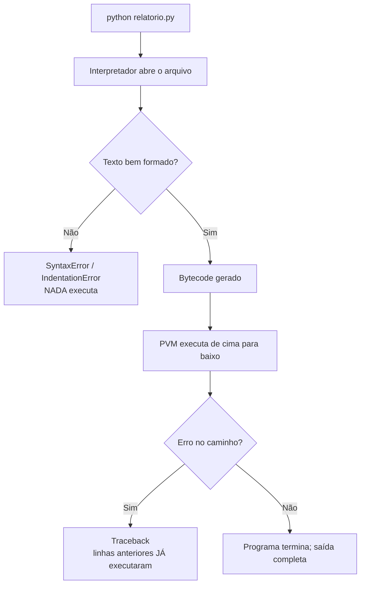

# 01.02 — Como o Python executa seu código

> **Módulo 01 — Python Fundamental** · Nível: N1 · Tempo estimado: 2h · Código: `codigo/cap02/`

## 1. Objetivo

- **Descrever** o caminho que seu texto percorre do Enter à saída: fonte → bytecode → execução.
- **Executar** o ciclo editar → rodar → ler com fluência no VS Code (o gesto que você repetirá dezenas de milhares de vezes).
- **Ler** tracebacks de baixo para cima, extraindo arquivo, linha e categoria — transformando o erro de susto em mapa.
- **Explicar** o que é a pasta `__pycache__` e por que ela aparece sozinha.

Ao final, você terá dominado o ritmo de trabalho do resto da trilha e nunca mais verá uma tela vermelha de erro como acusação — verá como endereço.

---

## 2. Pré-requisitos

- [01.01 — O que é Python e por que ele domina](01-o-que-e-python-e-por-que-ele-domina.md)

**Autoteste:** (1) Qual programa da sua máquina executa arquivos `.py`? (2) `SyntaxError` acontece antes ou durante a execução? (3) Em que direção se lê um traceback? Se travou, a seção 11 do 01.01 é a revisão dirigida.

---

## 3. Motivação

Todo iniciante vive esta cena: o script estava funcionando, você muda uma linha, roda de novo — e a saída vem idêntica à anterior. Muda mais, roda, idêntica. Frustração crescente... até descobrir que estava salvando um arquivo e executando **outro** (ou nem salvando). Meia hora perdida sem nenhum erro de programação: só de *processo*.

A cena tem variações: rodar o script de uma pasta errada e receber `can't open file`; ver surgir uma pasta `__pycache__` misteriosa e apagá-la "por segurança" (ela volta); receber 15 linhas vermelhas de erro e ler só a primeira — justamente a menos informativa. Nada disso é sobre lógica ou sintaxe. É sobre não ter o **modelo do que acontece quando você aperta Enter**.

E há um custo composto: o ciclo editar → executar → ler é a unidade básica do trabalho de programar. Você o repetirá centenas de vezes por semana, pelos próximos anos. Cada fricção nele — segundos procurando o terminal, releituras confusas de erro, dúvida sobre qual arquivo rodou — multiplica por milhares.

Este capítulo resolve isso assim: abre o capô do interpretador na medida N1 (o suficiente para nada parecer mágica), instala o ciclo de trabalho fluente no VS Code e treina, com erros reais, a leitura sistemática de tracebacks.

---

## 4. Modelo mental

> 🧠 **Modelo mental**
> Executar um `.py` é uma **linha de produção com duas estações**. Estação 1 — o interpretador lê seu texto **inteiro** e o traduz para uma forma interna compacta (o *bytecode*); qualquer defeito de escrita para tudo **aqui** (é o `SyntaxError` — nenhuma linha sua executou). Estação 2 — a máquina virtual do Python executa esse bytecode instrução por instrução, de cima para baixo; os erros **daqui** (os que você verá o módulo inteiro) acontecem no meio do trabalho, com as linhas anteriores já executadas.

**Exercício de previsão.** O arquivo abaixo tem um defeito na linha 3. Decida antes de rodar: a linha 1 chega a imprimir?

```python
print("linha um")
print("linha dois")
print("linha três!
```

*Resposta comentada:* **não imprime nada.** O defeito (aspas sem fechar) é de escrita — a Estação 1 rejeita o arquivo inteiro antes de qualquer execução. Se você previu "imprime duas linhas e depois quebra", acabou de calibrar a distinção mais importante do capítulo: erro de sintaxe (antes de tudo) ≠ erro de execução (no meio do caminho). Guarde: quando **nada** roda, o problema é de escrita; quando roda **até certo ponto**, é de execução.

---

## 5. Analogia

O interpretador trabalha como um **tradutor simultâneo de conferência com um revisor na porta**. Antes de a palestra começar, o revisor lê o roteiro inteiro: se encontrar uma frase incompreensível, devolve o papel na hora — a palestra nem começa (`SyntaxError`). Aprovado o roteiro, o tradutor traduz e transmite frase a frase, na ordem — e se no meio da palestra surge uma frase que referencia algo que não existe ("como eu disse ontem" — não disse), a transmissão para **ali**, com tudo anterior já transmitido (erro de execução).

**Onde a analogia quebra:** o revisor humano entende contexto e intenção; o da Estação 1 só verifica **forma**. `print(totall)` com nome errado passa pela revisão (a forma está válida) e só quebra na execução — o interpretador não adivinha que você quis dizer `total`. Forma e sentido são inspecionados em estações diferentes.

---

## 6. Teoria

### O caminho completo

Quando você executa `python relatorio.py`, acontece nesta ordem:

1. **Localização** — o sistema encontra o executável `python` via PATH (00.03) e o interpretador abre seu arquivo.
2. **Compilação para bytecode** — o texto inteiro é analisado e traduzido para **bytecode** (*bytecode*): uma sequência de instruções compactas, de baixo nível, que a máquina virtual do Python entende. É rápido e invisível — mas é uma compilação de verdade, e é aqui que erros de forma (`SyntaxError`, `IndentationError`) interrompem tudo.
3. **Execução** — a **máquina virtual do Python** (*Python Virtual Machine*, PVM) percorre o bytecode instrução por instrução, de cima para baixo. Cada `print` seu vira algumas instruções dela.

A frase do 01.01 agora tem conteúdo: "interpretado" não significa "lê o texto cru linha a linha" — significa que compilação e execução acontecem juntas, no mesmo programa, sem passo separado visível para você.

### O `__pycache__`: cache, não bagunça

Quando um arquivo seu é **importado por outro** (assunto do 01.20), o interpretador salva o bytecode compilado em disco — na pasta `__pycache__`, em arquivos `.pyc` — para não retraduzir da próxima vez se nada mudou. É só **cache** (*cache*): apagar não quebra nada (ele recria), commitar não se deve (o módulo 02 ensinará a ignorá-lo no Git). Scripts executados diretamente não geram cache de si mesmos — por isso você ainda não viu a pasta; ela aparecerá naturalmente no 01.20.

### A anatomia do traceback

**Traceback** é o relatório que a Estação 2 emite quando algo quebra na execução. Anatomia do exemplo mais comum deste início:

```text
Traceback (most recent call last):
  File "relatorio.py", line 4, in <module>
    print(totall)
          ^^^^^^
NameError: name 'totall' is not defined. Did you mean: 'total'?
```

Leitura profissional, **de baixo para cima**:

| Linha | O que diz |
|---|---|
| `NameError: name 'totall' is not defined...` | **A categoria e a causa** — e, frequentemente no Python moderno, uma sugestão de conserto |
| `print(totall)` + `^^^^^^` | O trecho exato e o ponto do problema |
| `File "relatorio.py", line 4, in <module>` | **O endereço**: arquivo e linha |
| `Traceback (most recent call last):` | Cabeçalho fixo: "o que segue é a trilha até o erro" |

Por que de baixo para cima? Porque a última linha responde "o quê?" e a de cima dela responde "onde?" — as duas perguntas que resolvem a maioria dos casos. O cabeçalho e a trilha completa só ficam interessantes quando houver funções chamando funções (01.21).

### O ciclo no VS Code, sem fricção

O ciclo-padrão da trilha: editar → **salvar** (`Ctrl+S`) → executar no terminal integrado (seta ↑ recupera o último comando; Enter roda) → ler a saída. Dois hábitos que eliminam 90% da fricção: **olhar a bolinha da aba** (● = não salvo — a causa nº 1 de "minha mudança não fez efeito") e **rodar sempre da raiz do repositório** com o caminho completo (a causa nº 2, `can't open file`, morta no 00.03).

---

## 7. Funcionamento interno

Um degrau a mais, na medida N1 — o bytecode existe mesmo e dá para vê-lo. A instrução `contagem = cidades.count("Campinas")` vira, por dentro, uma sequência na linha de: *carregue o objeto `cidades`; carregue o método `count`; carregue a string `"Campinas"`; chame; guarde o resultado sob o nome `contagem`*. A biblioteca padrão tem um módulo (`dis`, de *disassembler*) que exibe essas instruções — curiosidade legítima para espiar por conta própria, sem compromisso. O que importa reter em N1: bytecode é **mais simples e mais rígido** que seu código-fonte — cada linha sua vira várias instruções miúdas — e é a PVM executando essas instruções que gasta o tempo de execução do qual o 01.01 falou. O quadro completo (frames, pilha de execução) chega com funções, no 01.21 e no módulo 04.

---

## 8. Visualização do fluxo

O caminho do Enter à saída, com os dois tipos de parada:



**Como ler:** os dois losangos são as duas estações do modelo mental. A parada de cima (escrita) acontece antes de qualquer efeito; a de baixo (execução) deixa rastro — tudo acima da linha do erro rodou. Diante de qualquer tela vermelha, sua primeira pergunta agora é: *em qual losango parei?* — e a resposta está na presença ou ausência da palavra `Traceback`.

---

## 9. Aplicação prática

Três experimentos, cada um cravando uma peça do capítulo. Arquivos prontos em `codigo/cap02/`.

**Experimento 1 — As duas estações, ao vivo.** Rode:

```bash
python 01-Python/codigo/cap02/duas_estacoes.py
```

```text
Etapa 1: pedido recebido
Etapa 2: pedido validado
Traceback (most recent call last):
  File "...duas_estacoes.py", line 16, in <module>
    print(totaal)
          ^^^^^^
NameError: name 'totaal' is not defined. Did you mean: 'total'?
```

Duas etapas imprimiram **antes** do erro — prova viva da Estação 2. Agora abra o arquivo, quebre as aspas da linha 12 de propósito (apague o `"` final) e rode de novo: nenhuma etapa imprime — Estação 1. Conserte as aspas.

**Experimento 2 — Conserte pelo traceback.** Ainda no mesmo arquivo: o `NameError` te deu endereço (linha) e até sugestão (`Did you mean: 'total'?`). Conserte **só** o que ele aponta, rode, e veja o programa completo:

```text
Etapa 1: pedido recebido
Etapa 2: pedido validado
Etapa 3: total calculado
Fim do programa.
```

**Experimento 3 — O ciclo cronometrado.** Abra `ciclo_de_trabalho.py`, e repita 5 vezes: mude o texto de um `print` → `Ctrl+S` → `↑` + Enter no terminal → leia. Meta: cada volta em menos de 10 segundos, **sem** esquecer o salvar (olhe a bolinha da aba). Este é o ritmo-alvo do resto da trilha.

> 🎯 **Checkpoint rápido**
> Sem olhar: seu programa imprimiu 3 linhas e então mostrou uma tela vermelha começando com `Traceback`. As 3 linhas executaram de verdade — sim ou não? E se a tela vermelha dissesse `SyntaxError` na linha 50?

---

## 10. Código comentado

Arquivos completos em [`codigo/cap02/`](codigo/cap02/).

```python
# ------------------------------------------------------------
# duas_estacoes.py
# Capítulo 01.02 — Como o Python executa seu código
# O que este arquivo demonstra: erros de execução acontecem NO MEIO
#   do programa (linhas anteriores já rodaram) — e tracebacks dão endereço
# Como executar: python duas_estacoes.py
#   (o erro na última linha é PROPOSITAL — o capítulo manda consertá-lo)
# ------------------------------------------------------------

print("Etapa 1: pedido recebido")
print("Etapa 2: pedido validado")

total = 250

# A linha abaixo tem um nome digitado errado DE PROPÓSITO ("totaal").
# Missão do Experimento 2: ler o traceback e consertar só o necessário.
print(totaal)

print("Etapa 3: total calculado")
print("Fim do programa.")

# Saída (com o erro proposital):
# Etapa 1: pedido recebido
# Etapa 2: pedido validado
# Traceback (most recent call last):
#   ...line 16... NameError: name 'totaal' is not defined. Did you mean: 'total'?
```

```python
# ------------------------------------------------------------
# ciclo_de_trabalho.py
# Capítulo 01.02 — Como o Python executa seu código
# O que este arquivo demonstra: a bancada do Experimento 3 —
#   editar, salvar, executar, ler, 5 voltas cronometradas
# Como executar: python ciclo_de_trabalho.py
# ------------------------------------------------------------

# Mude o texto abaixo a cada volta do ciclo (e não esqueça o Ctrl+S —
# a bolinha na aba do VS Code denuncia arquivo não salvo).
print("Volta 1 do ciclo: edite, salve, execute, leia.")

# Saída: (o texto que estiver acima no momento da execução)
```

---

## 11. Erros comuns

### Erro 1 — Editar sem salvar (e desconfiar do computador)

**Sintoma:** você muda o código, roda, e a saída vem igual à anterior — duas, três vezes. Nenhuma mensagem de erro em lugar nenhum.
**Causa:** o interpretador lê o arquivo **do disco**; sua mudança estava só no editor, não salva. A bolinha ● na aba do VS Code estava lá o tempo todo, avisando.
**Correção:** `Ctrl+S` antes de todo run — até virar reflexo. (Alternativa de quem se conhece: ativar *File → Auto Save* e deixar o problema extinto.)

### Erro 2 — Ler o traceback de cima para baixo (e se afogar)

**Sintoma:** a tela vermelha tem 8 linhas; você lê as duas primeiras (`Traceback (most recent call last):` e um caminho de arquivo), conclui "não entendo nada" e parte para mudar código no chute.
**Causa:** as linhas de cima são o **contexto** (a trilha de chamadas); a informação decisiva — categoria, causa, sugestão — está na **última** linha, e o endereço na penúltima.
**Correção:** disciplina de leitura: última linha ("o quê?") → linha do `File`/`line` ("onde?") → só então o resto, se necessário. Duas linhas resolvem a maioria dos casos deste módulo.

> ⚠️ **Atenção**
> "Mudar código no chute até o erro sumir" às vezes funciona — e é péssimo quando funciona: o erro some sem você saber por quê, e volta maior adiante. O contrato da trilha: **nenhum conserto sem hipótese** ("acho que é X, porque o traceback diz Y").

### Erro 3 — Apagar `__pycache__` achando que é lixo (ou commitá-la achando que é código)

**Sintoma:** a pasta `__pycache__` aparece "do nada"; você a apaga e ela volta; ou pior — mais adiante, ela vai parar no seu repositório Git.
**Causa:** é o cache de bytecode da seção 6 — gerado automaticamente quando arquivos são importados; recriado sob demanda; irrelevante para o funcionamento e para o versionamento.
**Correção:** ignorar a existência (apagar não quebra, manter não pesa) e, quando o Git entrar na sua vida (módulo 02), listá-la no `.gitignore` — o capítulo 02.09 faz isso com você.

---

## 12. Boas práticas

✅ **`Ctrl+S` antes de todo run, até virar reflexo** — a mudança não salva é a causa nº 1 de meia hora perdida sem nenhum erro real.

✅ **Formule a hipótese em voz alta antes de consertar** — "traceback diz NameError em linha 16, nome `totaal`; aposto que é o typo" — conserto com hipótese ensina; chute que funciona, não.

✅ **Use a seta ↑ do terminal para repetir o comando** — digitar o caminho de novo a cada volta é fricção pura no ciclo que você mais repete na vida.

✅ **Quando nada executar, procure defeito de escrita; quando executar até certo ponto, siga o rastro** — o diagnóstico começa por classificar a parada (os dois losangos da seção 8).

❌ **Evite "consertar" adicionando e removendo coisas até o erro sumir** — sem hipótese, o desaparecimento do erro é adiamento, não conserto.

❌ **Evite rodar o script pelo botão ▶ do VS Code por enquanto** — ele funciona, mas esconde o comando executado e a pasta de trabalho; na fase de formar modelo mental, o terminal explícito ensina mais (o botão volta a ser bem-vindo quando nada nele for mistério).

---

## 13. Performance

Nesta escala, irrelevante — a compilação para bytecode de um script deste tamanho custa milissegundos, e o cache `__pycache__` existe justamente para que nem isso se repita à toa em projetos com muitos arquivos. Uma miudeza honesta para calibrar expectativa: a *partida* do interpretador (carregar o CPython inteiro) custa algumas dezenas de milissegundos fixos por execução — imperceptível aqui, e a razão pela qual, lá no módulo 06, servidores web carregam o Python **uma vez** e ficam no ar, em vez de pagar a partida a cada requisição. Você reencontrará essa ideia lá, com nome próprio.

---

## 14. Mercado

> 🏢 **Mercado**
> A habilidade central deste capítulo — ler o erro, formar hipótese, consertar com endereço — tem nome de mercado: **depuração** (*debugging*), e é avaliada em processo seletivo com mais peso que sintaxe decorada: entrevistas técnicas frequentemente entregam código quebrado e observam o *método* do candidato (lê o traceback? formula hipótese? ou muda coisas no chute?). No dia a dia, a proporção é conhecida de qualquer time: lê-se e depura-se muito mais do que se escreve do zero. O ciclo fluente que você cronometrou hoje é, literalmente, a unidade de produtividade da profissão — e ferramentas de IA que geram código só aumentaram o valor de quem sabe **ler, executar e diagnosticar** o que foi gerado.
>
> **Mini-cenário:** na Aurora, o estagiário da planilha herdará seus scripts um dia. A diferença entre ele conseguir rodá-los ("segui o README, li o erro, era o arquivo no lugar errado, resolvi") ou te interromper três vezes por dia está sendo construída agora — nos hábitos deste capítulo e nos cabeçalhos "Como executar" que todo arquivo seu já carrega.

---

## 15. Entrevistas

**P1. "O Python compila? Explique o caminho do código-fonte à execução."**
*Resposta esperada:* sim, para **bytecode** — o CPython compila o arquivo inteiro para uma forma intermediária e a **máquina virtual do Python** a executa instrução por instrução; erros de sintaxe param na compilação (nada executa), erros de execução param no meio (rastro parcial). O mito a evitar: "interpretado = lê linha a linha do texto cru". Mencionar `__pycache__`/`.pyc` como cache dessa compilação fecha com chave de ouro.

**P2. "Um script imprime 3 linhas e então quebra com NameError. O que você conclui e faz?"**
*Resposta esperada:* conclusões: forma válida (passou da compilação), as 3 linhas executaram de fato, o erro tem endereço exato no traceback. Ação: última linha (categoria/causa — NameError sugere nome não definido: typo ou uso antes da atribuição), penúltima (arquivo/linha), hipótese, conserto mínimo, re-executar. O que se avalia: **método**, não velocidade.

**P3. "O que é a pasta `__pycache__`? Deve ir para o repositório?"**
*Resposta esperada:* cache do bytecode compilado de módulos importados (`.pyc`), gerado e recriado automaticamente; **não** se versiona (é derivado, específico da máquina/versão) — entra no `.gitignore`. Resposta curta e certeira aqui sinaliza vivência real.

**Pegadinha clássica: "Se Python compila para bytecode, por que ainda o chamam de interpretado?"**
Ela derruba quem decorou "interpretado vs. compilado" como oposição binária. A saída forte dissolve a dicotomia: os termos descrevem *pontas de um espectro*; no CPython, compilação (para bytecode) e execução (pela PVM) acontecem juntas, no mesmo programa, sem artefato binário distribuído ao usuário — "interpretado" descreve a **experiência de uso**, não a ausência de compilação. Bônus de pleno: Java também compila para bytecode; a diferença relevante está no quê acontece com esse bytecode depois (JIT etc.), não no rótulo.

---

## 16. Exercícios guiados

Enunciados completos em [`exercicios/cap02.md`](exercicios/cap02.md); gabaritos em [`exercicios/gabaritos/cap02.md`](exercicios/gabaritos/cap02.md).

### Aquecimento

- **A1** `[~5 min · duas estações]` — Para 4 defeitos descritos, diga em qual estação o programa para — e o que chega a executar.
- **A2** `[~10 min · anatomia do traceback]` — Disseque 2 tracebacks: categoria, causa, endereço, sugestão (se houver).
- **A3** `[~5 min · previsão de rastro]` — Para 2 scripts com erro plantado, preveja exatamente quais linhas imprimem antes da quebra.
- **A4** `[~5 min · __pycache__]` — Responda 3 perguntas rápidas sobre o cache (o que é, pode apagar, vai para o Git?).

### Aplicação

- **AP1** `[~15 min · experimentos do capítulo]` — Execute os 3 experimentos da seção 9, registrando o antes/depois de cada um.
- **AP2** `[~20 min · plantão de conserto]` — `hospital_de_scripts.py` traz 4 defeitos (um por vez, comentados); para cada um: rode, hipótese em voz alta, conserto mínimo, re-execução.
- **AP3** `[~15 min · ciclo cronometrado]` — 10 voltas do ciclo em `ciclo_de_trabalho.py`, cronometradas; meta < 10s por volta, zero esquecimentos de salvar.

---

## 17. Desafios

- **D1** `[~30 min · espiando o bytecode]` — **Abra a Estação 1.** Pesquisa dirigida: documentação oficial do módulo `dis` (seção "Python Bytecode Instructions" é opcional). Use `python -m dis arquivo.py` sobre um script de 3 linhas seu e responda: (a) quantas instruções de bytecode suas 3 linhas viraram? (b) identifique — pelo nome, chutando com critério — 2 instruções que pareçam corresponder a "carregar algo" e "chamar algo"; (c) escreva em 3 linhas por que "cada linha sua vira várias instruções miúdas" explica parte do custo de execução do Python. Palpites errados documentados valem mais que certezas copiadas.

<details><summary>💡 Dica 1 (conceito)</summary>
Você não precisa entender a saída toda — o exercício é contar e reconhecer padrões de nome (LOAD_..., CALL...).
</details>
<details><summary>💡 Dica 2 (estratégia)</summary>
Rode sobre `ola_aurora.py` do capítulo anterior: 3 prints viram um padrão que se repete 3 vezes — conte um bloco e multiplique.
</details>
<details><summary>💡 Dica 3 (esqueleto)</summary>
Resposta em 3 blocos: (a) número; (b) duas instruções + o que acha que fazem; (c) 3 linhas ligando "muitas instruções miúdas interpretadas" ao custo relativo do 01.01.
</details>

---

## 18. Mini projeto

**Guia de primeiros socorros de execução** `[~50 min]` — o documento que o "você de ontem" precisava.

Requisitos numerados:

1. Crie `socorro-execucao.md` na sua pasta de anotações pessoais, com 5 fichas no formato: **Sintoma** (a mensagem/comportamento real) → **Diagnóstico** (qual estação, o que significa) → **Conserto** (ação mínima).
2. As 5 fichas obrigatórias: mudança sem efeito (arquivo não salvo) · `SyntaxError` · `IndentationError` · `NameError` · `can't open file`. Cada uma com a mensagem real colada (dos seus próprios experimentos — não copie do capítulo).
3. Uma seção final "Método em 4 passos" com o seu resumo do protocolo (classificar a parada → última linha → endereço → hipótese antes do conserto).
4. Teste de usabilidade: provoque um dos 5 problemas de novo, "sem lembrar de nada", e resolva usando **apenas** o seu guia. Ajuste o que não funcionou.

**Critério de "está bom":** as 5 mensagens são colecionadas de execuções suas; o guia resolve o teste do requisito 4 sem consulta ao capítulo; cabe em ~1 tela por ficha. Este arquivo cresce com você — novas fichas a cada categoria nova de erro nos próximos capítulos.

---

## 19. Revisão

**Resumo do capítulo:**

- Duas estações: compilação (texto inteiro → bytecode; `SyntaxError` para **tudo** aqui) e execução (PVM roda de cima para baixo; erros aqui deixam rastro parcial).
- "Interpretado" = compilação e execução juntas no mesmo programa, invisíveis para você — não "leitura do texto cru".
- Traceback lê-se de baixo para cima: última linha (o quê) → `File`/`line` (onde) → contexto acima, se precisar. O Python moderno frequentemente sugere o conserto.
- `__pycache__` é cache de bytecode de módulos importados: apagável, recriável, fora do Git (o 02.09 formaliza).
- O ciclo editar → **salvar** → executar (↑ + Enter) → ler é a unidade de trabalho da profissão; a bolinha ● da aba é o sensor anti-meia-hora-perdida.
- Contrato de conserto: nenhuma mudança sem hipótese formulada a partir do traceback.

**Flashcards novos** (adicionados a [`revisao/flashcards.md`](revisao/flashcards.md)):

| ID | Frente | Verso |
|---|---|---|
| 01.02-F1 | Quais são as duas estações da execução e que tipo de erro para em cada uma? | 1) Compilação p/ bytecode: `SyntaxError`/`IndentationError` — nada executa; 2) PVM executando: erros de execução — rastro parcial fica. |
| 01.02-F2 | Explique com suas palavras: por que "interpretado" não significa "sem compilação"? | (Elaboração) O CPython compila para bytecode e o executa na PVM, tudo junto e invisível; "interpretado" descreve a experiência (sem etapa/binário visível), não ausência de compilação. |
| 01.02-F3 | Preveja: script com aspas sem fechar na linha 30, prints nas linhas 1–29. O que imprime? | (Previsão) Nada — defeito de escrita para na compilação; o arquivo inteiro é rejeitado antes de executar. |
| 01.02-F4 | Em que ordem se lê um traceback e o que cada parte responde? | De baixo para cima: última linha = categoria/causa (às vezes com sugestão); `File`/`line` = endereço; trilha acima = contexto de chamadas. |
| 01.02-F5 | `__pycache__`: o que é, pode apagar, vai para o Git? | (Decisão) Cache de bytecode de módulos importados; apagar pode (recria sozinho); Git não — é derivado (entra no `.gitignore`, 02.09). |

**Agendamento:** registre no `PROGRESSO.md` e marque D+1, D+7, D+30, D+90 na [`Revisoes/agenda.md`](../Revisoes/agenda.md).

---

## 20. Checklist

Perguntas de domínio — teste do sim:

- [ ] Sei explicar *o caminho fonte → bytecode → PVM, e o que cada estação rejeita*?
- [ ] Sei explicar *por que "interpretado ≠ sem compilação" (a pegadinha da seção 15)*?
- [ ] Sei ler *um traceback de baixo para cima extraindo o quê/onde em segundos*?
- [ ] Sei prever *o que executa (e o que não) num script com erro de escrita vs. erro de execução*?
- [ ] Sei explicar *o que é `__pycache__` e o destino dela no versionamento*?

Itens práticos:

- [ ] Fiz os 3 experimentos da seção 9 (incluindo quebrar e consertar `duas_estacoes.py`).
- [ ] Acertei o exercício de previsão da seção 4 e o checkpoint rápido da seção 9.
- [ ] Fiz Aquecimento e Aplicação; 10 voltas de ciclo abaixo de 10s.
- [ ] Construí o `socorro-execucao.md` e ele passou no teste de usabilidade.
- [ ] Registrei a sessão e agendei as 4 revisões.

---

## 21. Próximo capítulo

Duas vezes hoje você usou `total = 250` e leu "guarde o resultado sob o nome tal" — como se fosse evidente o que "guardar sob um nome" significa. Não é. Ficou deliberadamente em aberto a pergunta que separa quem prevê Python de quem decora Python: quando você escreve `a = b`, o que exatamente é copiado — o valor? o nome? nada? O próximo capítulo instala o modelo mental de **etiquetas e objetos** — a peça que explica metade das pegadinhas de entrevista da linguagem e que você usará em literalmente todo programa daqui em diante.

→ [01.03 — Variáveis, objetos e referências](03-variaveis-objetos-e-referencias.md)

---

*Gerado sob spec 3.0.0*
