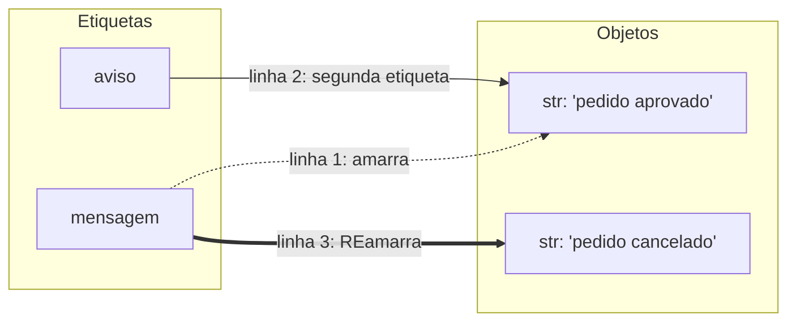

# 01.03 — Variáveis, objetos e referências

> **Módulo 01 — Python Fundamental** · Nível: N1 · Tempo estimado: 2h30 · Código: `codigo/cap03/`

## 1. Objetivo

- **Prever** o efeito de atribuições e reatribuições usando o modelo mental de **etiquetas e objetos**.
- **Diferenciar** nome, objeto e valor — e explicar por que "a variável não tem tipo; o objeto tem".
- **Aplicar** `type()` e `id()` como instrumentos de inspeção do modelo.
- **Explicar** o que `is` verifica (identidade) — a fundação da pegadinha clássica `is` vs. `==`.

Ao final, você conseguirá responder "o que este código faz com a memória?" antes de rodar — a habilidade que separa prever de decorar, e que sustenta metade das pegadinhas de entrevista da linguagem.

---

## 2. Pré-requisitos

- [01.02 — Como o Python executa seu código](02-como-o-python-executa-seu-codigo.md)

**Autoteste:** (1) Um `NameError` para o programa em qual estação? (2) O que significa "a PVM executa de cima para baixo" para a ordem das atribuições? (3) `total = 250` — você leu essa linha em voz alta como o quê? Se a resposta da 3 foi "coloque 250 dentro de total", perfeito: este capítulo existe para trocar essa frase por uma melhor.

---

## 3. Motivação

Em alguma semana das próximas, você escreverá algo assim (com listas, capítulo 01.12) e viverá o bug mais desconcertante do início de Python: duas variáveis que mudam **juntas**, como se fossem telepáticas. Você altera `pedidos_processados` e, misteriosamente, `pedidos_originais` muda também. Nenhum erro, nenhum traceback — só dados corrompidos em silêncio.

O bug tem nome (*aliasing*, capítulo 01.13), mas a raiz dele está num modelo mental errado plantado hoje: a imagem da variável como **caixinha que contém um valor**. É a imagem que quase todo curso ensina, funciona nos primeiros dias — e cobra juros compostos depois, porque o Python **não funciona assim**. Quem pensa em caixinhas precisa decorar caso a caso quando "copiou" e quando "não copiou"; quem tem o modelo certo **prevê**, sem decorar nada.

Há um segundo custo do modelo errado: entrevistas. `is` vs. `==`, parâmetro padrão mutável, mutação de argumento — as pegadinhas favoritas do mercado em Python são todas testes disfarçados da mesma pergunta: *você sabe o que uma atribuição realmente faz?*

Este capítulo resolve isso assim: instala o modelo **etiqueta → objeto** com instrumentos de verificação (`type`, `id`, `is`), treina previsão com casos crescentes, e deixa marcado o terreno onde as pegadinhas futuras vão pisar — para que, quando chegarem (01.13, 01.19), sejam consequência natural e não surpresa.

---

## 4. Modelo mental

> 🧠 **Modelo mental**
> Uma atribuição `total = 250` faz duas coisas, nesta ordem: cria (ou localiza) o **objeto** `250` em algum lugar da memória, e cola nele a **etiqueta** `total`. A variável não é uma caixa que contém o valor — é uma **etiqueta amarrada num objeto**. Consequências que valem por todo o Python: reatribuir é **desamarrar e amarrar em outro objeto** (o objeto antigo fica intacto); duas variáveis podem ser **duas etiquetas no mesmo objeto**; e a etiqueta não tem tipo — **o objeto tem**.

**Exercício de previsão.** Sem rodar, decida o que imprime:

```python
mensagem = "pedido aprovado"
aviso = mensagem
mensagem = "pedido cancelado"
print(aviso)
```

*Resposta comentada:* imprime `pedido aprovado`. Linha 2: `aviso` vira uma segunda etiqueta **no mesmo objeto** `"pedido aprovado"`. Linha 3: `mensagem` é desamarrada dali e amarrada num objeto **novo** (`"pedido cancelado"`) — a etiqueta `aviso` não se move: continua no objeto original. Se você previu `pedido cancelado`, estava usando o modelo da caixinha ("aviso recebeu uma cópia? então..."); repare que o modelo de etiquetas responde sem hesitação — e sem cópia nenhuma envolvida.

---

## 5. Analogia

Objetos são **encomendas num depósito**; variáveis são **etiquetas de rastreio**. A encomenda existe no depósito independentemente de quantas etiquetas apontam para ela — uma, duas, dez. Reetiquetar (`mensagem = outra_coisa`) não move nem altera a encomenda antiga: só muda para onde **aquela** etiqueta aponta. E uma encomenda sem nenhuma etiqueta apontando para ela vira, cedo ou tarde, descarte — o depósito recolhe (é o *garbage collector*, o coletor de lixo do Python, fazendo faxina automática).

**Onde a analogia quebra:** etiquetas de rastreio reais identificam a encomenda para sempre; em Python, a mesma etiqueta pode ser reamarrada em objetos diferentes a cada linha. E depósitos reais cobram por espaço — em Python, criar e abandonar objetos pequenos é rotina barata, não desperdício a evitar.

---

## 6. Teoria

### Nome, objeto, valor — três coisas, não uma

A linha `total = 250` envolve três entidades distintas:

| Entidade | O que é | Neste exemplo |
|---|---|---|
| **Nome** (*name*) | A etiqueta: uma entrada na tabela de nomes do programa | `total` |
| **Objeto** (*object*) | A entidade na memória, com tipo e identidade próprios | o inteiro que vive em algum endereço |
| **Valor** (*value*) | O conteúdo que o objeto representa | `250` |

Em Python, **tudo do lado direito de um `=` vira objeto**: números, textos, e adiante listas, funções, tudo. "Tudo é objeto" deixa de ser slogan e vira ferramenta no módulo 04 — por ora, a consequência prática é uma só: todo objeto carrega seu **tipo** e sua **identidade**, e há instrumentos para inspecionar ambos.

### Os três instrumentos de inspeção

**`type(x)`** revela o tipo **do objeto** que a etiqueta `x` aponta agora:

```python
quantidade = 42
print(type(quantidade))   # Saída: <class 'int'>
quantidade = "quarenta e dois"
print(type(quantidade))   # Saída: <class 'str'>
```

É isto que **tipagem dinâmica** (01.01) significa de verdade: a *etiqueta* `quantidade` aceitou apontar para um `int` e depois para uma `str` — porque etiquetas não têm tipo. Cada **objeto** teve o seu, fixo, o tempo todo. Os tipos deste início: `int` (inteiros), `float` (decimais — capítulo 01.04), `str` (*string*, texto — 01.05), `bool` (verdadeiro/falso — 01.08).

**`id(x)`** revela a **identidade** (*identity*) do objeto: um número que o distingue de qualquer outro objeto vivo (na prática, seu endereço na memória). Duas etiquetas no mesmo objeto → mesmo `id`.

**`x is y`** pergunta: **as duas etiquetas estão no mesmo objeto?** (equivale a `id(x) == id(y)`). É a pergunta de *identidade* — diferente da pergunta de *valor*:

> 📦 **Caixa-preta: `==`**
> `x == y` pergunta se os **valores** são iguais — dois objetos diferentes podem valer o mesmo (duas notas de 50 são valores iguais, objetos distintos). Use `==` para comparar valores desde já; o tratamento completo de comparações é o capítulo 01.08. A regra prática que já fica: **para comparar valores, sempre `==`; `is` é só para a pergunta rara "é o mesmo objeto?"** (e para `None`, adiante na trilha).

### Reatribuição e as etiquetas múltiplas

Os dois movimentos que o exercício de previsão mostrou, agora nomeados:

```python
a = 100        # etiqueta a → objeto 100
b = a          # b é SEGUNDA etiqueta no MESMO objeto (nada foi copiado)
a = 200        # a desamarra e vai para o objeto 200; b continua no 100
print(b)       # Saída: 100
```

`b = a` **nunca copia o objeto** — copia a amarração. Com números e textos isso é indistinguível de uma cópia (porque esses objetos são imutáveis — próxima seção); com listas, será a diferença entre o programa certo e o bug telepático da Motivação. O terreno está marcado: 01.13 planta aqui.

### Imutável vs. mutável: o aviso prévio

Objetos `int`, `float`, `str` e `bool` são **imutáveis** (*immutable*): não existe operação que altere o objeto por dentro — toda "modificação" cria objeto novo. Por isso etiquetas múltiplas nesses tipos são inofensivas: ninguém consegue mexer no objeto compartilhado. A partir do 01.12 entram os objetos **mutáveis** (listas), e as mesmas regras de etiquetas — inalteradas! — produzirão efeitos novos. Se o modelo deste capítulo estiver firme, o 01.13 será consequência; se não, será decoreba.

### Nomes que se respeitam

As regras da linguagem: nomes começam com letra ou `_`, seguem com letras/dígitos/`_`, são sensíveis a maiúsculas (`Total` ≠ `total`) e não podem ser palavras reservadas (`if`, `for`, `print` pode mas não deve — seção 11). As convenções da trilha (§18 da spec): `snake_case`, português sem acentos, descritivos — `total_pedidos`, não `tp` nem `totalPedidos`.

---

## 7. Funcionamento interno

Uma camada abaixo, na medida N1. A "tabela de etiquetas" existe de verdade: os nomes do seu script vivem num dicionário interno (você pode espiá-lo com `globals()` — curiosidade, não ferramenta de trabalho). Quando a PVM executa `print(total)`, a instrução de bytecode correspondente (`LOAD_NAME`, do desafio do 01.02) procura `total` nessa tabela e empilha o objeto amarrado. E uma miudeza honesta que evita sustos no desafio deste capítulo: o CPython **reaproveita** objetos de inteiros pequenos (aproximadamente −5 a 256) e muitas strings — dois `x = 100` e `y = 100` separados podem acabar com etiquetas no *mesmo* objeto reciclado, e `x is y` dar `True` "sem motivo". É otimização interna, varia por situação, e é exatamente por isso que a regra da seção 6 existe: valores se comparam com `==`; `is` responde perguntas sobre identidade que você raramente precisa fazer.

---

## 8. Visualização do fluxo

O exercício de previsão da seção 4, desenhado — etiquetas à esquerda, objetos à direita:



**Como ler:** o tempo passa nos rótulos das setas. A seta pontilhada é a amarração original de `mensagem` (linha 1), desfeita na linha 3 quando a seta grossa a reamarra no objeto novo. A etiqueta `aviso` não participa da linha 3 — por isso `print(aviso)` encontra o objeto antigo, intacto. Nenhum objeto foi copiado ou alterado no processo: só amarrações mudaram.

---

## 9. Aplicação prática

Vamos ver as etiquetas com os próprios olhos, usando os instrumentos. Rode:

```bash
python 01-Python/codigo/cap03/etiquetas_e_objetos.py
```

O script executa, com prints comentados, a sequência completa: atribuição → segunda etiqueta (mesmo `id`!) → reatribuição (o `id` de uma muda, o da outra não) → tipagem dinâmica (`type` antes e depois). Saída esperada (os números de `id` variam por execução — o que importa são as **igualdades** entre eles):

```text
--- Ato 1: duas etiquetas, um objeto ---
id de a: 140245... | id de b: 140245...  (iguais!)
a is b: True

--- Ato 2: reatribuição desamarra só uma ---
a agora: 200 | b continua: 100
a is b: False

--- Ato 3: etiquetas não têm tipo, objetos têm ---
type antes: <class 'int'>
type depois: <class 'str'>
```

Agora o gesto que fixa: abra o arquivo, e **antes** de cada bloco, tampe a saída e preveja em voz alta o que os `id` e o `is` dirão. Depois confira. Previsão → verificação é o ciclo deste capítulo (e dos flashcards dele).

> 💡 **Dica**
> Nos números gigantes do `id`, ignore o valor — olhe só "igual ou diferente do outro?". É a única pergunta que o instrumento responde de útil.

---

## 10. Código comentado

Arquivo completo em [`codigo/cap03/etiquetas_e_objetos.py`](codigo/cap03/etiquetas_e_objetos.py).

```python
# ------------------------------------------------------------
# etiquetas_e_objetos.py
# Capítulo 01.03 — Variáveis, objetos e referências
# O que este arquivo demonstra: atribuição = amarrar etiqueta em objeto;
#   inspeção com type(), id() e is
# Como executar: python etiquetas_e_objetos.py
# ------------------------------------------------------------

print("--- Ato 1: duas etiquetas, um objeto ---")
a = 100        # cria/localiza o objeto 100 e amarra a etiqueta 'a'
b = a          # amarra a etiqueta 'b' NO MESMO objeto — nada é copiado

# id() revela a identidade; se as etiquetas estão no mesmo objeto, os ids coincidem
print("id de a:", id(a), "| id de b:", id(b), " (iguais!)")
print("a is b:", a is b)
# Saída: a is b: True

print()
print("--- Ato 2: reatribuição desamarra só uma ---")
a = 200        # 'a' desamarra do 100 e amarra no objeto novo 200
print("a agora:", a, "| b continua:", b)
# Saída: a agora: 200 | b continua: 100
print("a is b:", a is b)
# Saída: a is b: False

print()
print("--- Ato 3: etiquetas não têm tipo, objetos têm ---")
quantidade = 42
print("type antes:", type(quantidade))
# Saída: type antes: <class 'int'>
quantidade = "quarenta e dois"   # a MESMA etiqueta, amarrada num objeto str
print("type depois:", type(quantidade))
# Saída: type depois: <class 'str'>
```

---

## 11. Erros comuns

### Erro 1 — Usar um nome antes de amarrá-lo

**Sintoma:**

```text
Traceback (most recent call last):
  File "caixa.py", line 2, in <module>
    total = total + 50
            ^^^^^
NameError: name 'total' is not defined
```

**Causa:** a linha tenta **ler** a etiqueta `total` (lado direito) antes de qualquer linha tê-la amarrado em algo — e a PVM executa de cima para baixo (01.02): não existe "vai ser definida logo ali embaixo".
**Correção:** amarre antes de ler: `total = 0` numa linha anterior. O padrão `x = x + algo` sempre pressupõe um `x` já existente — é leitura *e* escrita.

### Erro 2 — Sombrear um nome embutido (o `print` que deixa de funcionar)

**Sintoma:**

```text
Traceback (most recent call last):
  File "relatorio.py", line 4, in <module>
    print("total calculado")
TypeError: 'int' object is not callable
```

**Causa:** alguma linha acima fez `print = 100` (ou `type = ...`, `id = ...`). A linguagem permite: `print` é só uma etiqueta como as outras — que estava amarrada na função de imprimir e você reamarrou num inteiro. Agora `print(...)` tenta "chamar" um número.
**Correção:** renomeie sua variável (`total_impresso`, o que for) e reinicie a execução. Prevenção: se o VS Code pintar seu nome de variável com a cor de função embutida, é o aviso.

> ⚠️ **Atenção**
> Este erro é ótimo professor: prova que **funções também são objetos com etiquetas** — inclusive as embutidas. O módulo 04 transformará essa curiosidade em ferramenta (decoradores); hoje ela é só um perigo com nome bonito: *sombreamento* (*shadowing*).

### Erro 3 — Comparar valores com `is`

**Sintoma:** nenhum traceback — pior: comportamento intermitente. `x is y` dá `True` no seu teste com números pequenos, você conclui que "is compara igual ao ==", e semanas depois uma comparação de strings/números maiores dá `False` com valores idênticos.

```python
a = 1000
b = 1000
print(a == b)   # Saída: True
print(a is b)   # Saída: False  (dois objetos distintos de mesmo valor)
```

**Causa:** `is` pergunta identidade (mesmo objeto), não igualdade (mesmo valor) — e o reaproveitamento de objetos pequenos (seção 7) faz o `is` *parecer* funcionar às vezes, que é o pior tipo de bug.
**Correção:** a regra sem exceção deste módulo: **valores se comparam com `==`**. O `is` tem seu único uso idiomático adiante (comparações com `None`, a partir do 01.08), e o capítulo avisará.

---

## 12. Boas práticas

✅ **Leia `x = y` como "amarre a etiqueta x no objeto que y aponta"** — a frase certa, dita em voz alta nas primeiras semanas, instala o modelo que evita os bugs dos capítulos 13 e 19.

✅ **Nomes descritivos em snake_case, sem acentos, em português** — `total_pedidos` conta a história; `tp` cobra pedágio de todo leitor futuro (inclusive você).

✅ **Use `type()` como lupa ao investigar comportamento estranho** — "que tipo é isso de verdade?" resolve muita confusão antes dela crescer (e vira reflexo essencial no 01.07, quando `input` entregar surpresas).

✅ **Prefira criar nome novo a reciclar etiqueta com significado diferente** — reusar `dados` para três coisas na mesma tela é legal para o interpretador e caro para o leitor.

❌ **Evite nomes de embutidos para suas variáveis (`print`, `type`, `id`, `sum`, `list`...)** — sombrear funciona até a linha em que quebra, e quebra confuso (Erro 2).

❌ **Evite `is` para comparar valores — sempre, sem "mas funcionou aqui"** — o funcionamento intermitente é a armadilha (Erro 3); `==` para valores, ponto.

---

## 13. Performance

Nesta escala, irrelevante — amarrar etiquetas é das operações mais baratas que a PVM faz, e o coletor de lixo recolhe objetos abandonados sem que você gerencie nada. A miudeza honesta do capítulo: viu-se (seção 7) que o CPython recicla inteiros pequenos e strings comuns justamente para não criar milhões de objetos idênticos — otimização que existe, funciona, e **não deve influenciar seu código** (ela é detalhe de implementação, não contrato). Você medirá custos reais de criação de objetos muito adiante (módulo 10, ao processar milhões de linhas); até lá: você saberá quando importar.

---

## 14. Mercado

> 🏢 **Mercado**
> O modelo de referências é o divisor de águas oculto das entrevistas de Python no mercado: as três pegadinhas mais aplicadas do país — `is` vs. `==`, aliasing de listas, parâmetro padrão mutável — são todas variações de "você entende o que uma atribuição faz?". Entrevistadores as usam porque separam, em dois minutos, quem *usou* Python de quem *entende* Python: a resposta decorada quebra na primeira variação do exemplo. No dia a dia profissional, o mesmo modelo é o que torna legível o código alheio cheio de estruturas compartilhadas — e o que evita a classe de bug mais cara: a corrupção silenciosa de dados compartilhados, que não gera traceback e chega à produção.
>
> **Mini-cenário:** na Aurora, o bug clássico desse tipo esperaria o módulo 10 para nascer: um pipeline que "copia" a lista de pedidos para processá-la, muta a "cópia" — e corrompe o original que outro relatório usa. Sem erro, sem log, só números errados na reunião de segunda. Você o verá de perto (e o matará) no 01.13; o antídoto foi instalado hoje.

---

## 15. Entrevistas

**P1. "Explique a diferença entre `is` e `==`."**
*Resposta esperada:* `==` compara **valores** (dois objetos distintos podem ser iguais); `is` compara **identidade** (mesma etiqueta... digo, mesmo objeto — `id(a) == id(b)`). Regra prática: `==` para valores, sempre; `is` quase só para `None`. Ponto extra: mencionar que o reaproveitamento de inteiros pequenos faz `is` "funcionar" enganosamente em testes ingênuos — mostra que você entende *por que* a regra existe.

**P2. "Python é fortemente ou fracamente tipado? E estático ou dinâmico?"**
*Resposta esperada:* **dinâmico** (etiquetas não declaram tipo; o tipo vive no objeto e `type()` o revela em runtime) e **forte** (objetos não se converte sozinhos silenciosamente — `"2" + 2` é erro, não `4` nem `"22"`). A confusão entre os dois eixos é comum; separá-los com um exemplo em cada é resposta de quem entende.

**P3. "O que acontece na memória quando executo `a = [dado]; b = a`?"** *(virá com listas, mas o esqueleto já é seu)*
*Resposta esperada:* nenhuma cópia: `b` é uma segunda etiqueta no mesmo objeto; mutações via qualquer etiqueta são vistas pela outra (com imutáveis o compartilhamento é indistinguível de cópia; com mutáveis, é a fonte do aliasing). Responder isso **antes** de estudar listas é o teste de que o modelo está instalado.

**Pegadinha clássica: "`a = 256; b = 256; a is b` dá True. `a = 257; b = 257; a is b` dá False. Python está quebrado?"**
Ela derruba quem só decorou "is compara identidade" sem o porquê do comportamento. A saída forte: não está quebrado — `is` está respondendo corretamente à pergunta "mesmo objeto?"; o que muda é que o CPython **recicla** inteiros pequenos (≈ −5 a 256), então os dois 256 são o mesmo objeto reaproveitado e os dois 257 não. Fecho que vale a vaga: "o comportamento é detalhe de implementação — e é exatamente por isso que comparar valores com `is` é bug: a resposta certa é `==`, que dá True nos dois casos".

---

## 16. Exercícios guiados

Enunciados completos em [`exercicios/cap03.md`](exercicios/cap03.md); gabaritos em [`exercicios/gabaritos/cap03.md`](exercicios/gabaritos/cap03.md).

### Aquecimento

- **A1** `[~10 min · previsão de etiquetas]` — 4 sequências de atribuições; preveja cada `print` antes de rodar.
- **A2** `[~5 min · type()]` — Preveja o `type` de 6 expressões; confira num script único.
- **A3** `[~5 min · nomes válidos e dignos]` — Classifique 8 nomes: inválido, válido-mas-indigno, ou bom.
- **A4** `[~10 min · is vs ==]` — Para 4 pares de comparações, preveja True/False e justifique com o modelo.

### Aplicação

- **AP1** `[~20 min · o depurador de etiquetas]` — Dado um script com 3 previsões erradas comentadas ("esperava X, deu Y"), explique cada uma com o modelo e corrija o comentário.
- **AP2** `[~15 min · desenhe a memória]` — Para uma sequência de 6 atribuições, desenhe (texto ou papel) o diagrama etiquetas→objetos após cada linha, no estilo da seção 8.
- **AP3** `[~20 min · caça ao sombreamento]` — `sombras.py` tem 2 sombreamentos de embutidos causando erros estranhos; encontre, explique e conserte.

---

## 17. Desafios

- **D1** `[~40 min · o experimento da reciclagem]` — **Mapeie a zona de reciclagem do seu CPython.** Escreva um script que, para alguns valores testemunha (ex.: -10, -5, 0, 100, 256, 257, 1000), crie dois objetos "iguais" por caminhos separados e registre `== ` e `is` de cada par. Responda: (a) onde passa a fronteira da reciclagem de inteiros no seu interpretador? (b) strings idênticas curtas: reciclam? (c) em 3 linhas: por que esse experimento *prova* que `is` não serve para comparar valores. Pesquisa dirigida: nenhuma — o experimento é a fonte; (a documentação chama o mecanismo de *interning*, se quiser o nome para o futuro).

<details><summary>💡 Dica 1 (conceito)</summary>
"Dois objetos por caminhos separados": duas atribuições literais em linhas distintas. O par que o capítulo já te deu: 1000 e 1000.
</details>
<details><summary>💡 Dica 2 (estratégia)</summary>
Formato de bancada: para cada valor, uma linha imprimindo o valor, o resultado de ==, o de is. A fronteira aparece sozinha na leitura.
</details>
<details><summary>💡 Dica 3 (esqueleto)</summary>
Blocos repetidos de: `a = VALOR` / `b = VALOR` / `print(VALOR, a == b, a is b)`. Depois os testes com strings. Fecho: 3 linhas de conclusão.
</details>

---

## 18. Mini projeto

**Ficha técnica da Aurora, versão etiquetada** `[~50 min]` — dados reais do projeto, modelo mental em uso.

Requisitos numerados:

1. Crie `ficha_aurora.py` em `codigo/cap03/`, com o cabeçalho padrão, definindo ~10 variáveis da empresa fictícia com nomes dignos: razão social, cidade-sede, ano de fundação, quantidade de funcionários, faturamento mensal aproximado, cidades atendidas (como texto por enquanto), etc.
2. Imprima a ficha formatada, e para 3 variáveis representativas imprima também o `type()` — escolhendo pelo menos um `int`, um `float` e uma `str`.
3. Demonstre, com prints comentados no próprio código, os dois movimentos do capítulo: uma segunda etiqueta (com `is` provando o compartilhamento) e uma reatribuição (com a segunda etiqueta provando que ficou para trás).
4. Zero violações das convenções de nome (§18 da spec) — revise antes de dar por pronto.

**Critério de "está bom":** roda limpo; nomes contam a história sozinhos; os movimentos do requisito 3 vêm com comentários que explicam **em linguagem de etiquetas**, não de caixinhas. Estes dados da Aurora voltarão nos próximos capítulos — capriche neles.

---

## 19. Revisão

**Resumo do capítulo:**

- Atribuição = amarrar etiqueta em objeto. Reatribuir desamarra e reamarra; o objeto antigo fica intacto (e vira lixo coletável se ficar sem etiquetas).
- Nome, objeto e valor são três entidades; a etiqueta não tem tipo — o objeto tem (`type()` revela; tipagem dinâmica = etiquetas livres, objetos tipados).
- `b = a` nunca copia objeto — copia amarração. Com imutáveis (`int`, `float`, `str`, `bool`) isso é inofensivo; com mutáveis (01.12+) será a origem do aliasing.
- `is` pergunta identidade (mesmo objeto, `id` igual); `==` pergunta valor. Valores se comparam com `==`, sem exceção neste módulo.
- O CPython recicla inteiros pequenos (≈ −5..256) e strings comuns — detalhe de implementação que torna `is` intermitente e prova a regra acima.
- Sombrear embutidos (`print = 100`) é legal e desastroso: funções também são objetos etiquetados.

**Flashcards novos** (adicionados a [`revisao/flashcards.md`](revisao/flashcards.md)):

| ID | Frente | Verso |
|---|---|---|
| 01.03-F1 | Leia `x = y` na frase canônica do modelo mental. | "Amarre a etiqueta x no objeto que y aponta" — nenhum objeto é copiado; amarrações mudam, objetos ficam. |
| 01.03-F2 | Explique com suas palavras: por que "a variável não tem tipo" em Python? | (Elaboração) O tipo vive no objeto; a etiqueta aceita reamarração em objetos de tipos diferentes — `type()` sempre revela o do objeto atual. |
| 01.03-F3 | Preveja: `m = "sim"` → `n = m` → `m = "não"` → `print(n)`. | (Previsão) `sim` — n é segunda etiqueta no objeto original; a reatribuição de m não a move. |
| 01.03-F4 | `is` vs. `==`: qual pergunta cada um responde, e qual usar para valores? | (Decisão) `is` = mesmo objeto (identidade); `==` = mesmo valor. Valores: sempre `==`; `is` quase só para `None` (adiante). |
| 01.03-F5 | Por que `a = 257; b = 257; a is b` pode dar False — e o que isso prova? | Sem reciclagem acima de ~256, são dois objetos de mesmo valor; prova que `is` não compara valores — e que o comportamento com números pequenos era otimização, não regra. |

**Agendamento:** registre no `PROGRESSO.md` e marque D+1, D+7, D+30, D+90 na [`Revisoes/agenda.md`](../Revisoes/agenda.md).

---

## 20. Checklist

Perguntas de domínio — teste do sim:

- [ ] Sei explicar *nome vs. objeto vs. valor, com a frase canônica da atribuição*?
- [ ] Sei prever *o resultado de sequências de atribuição/reatribuição sem rodar*?
- [ ] Sei explicar *`is` vs. `==` incluindo por que o `is` é intermitente com números*?
- [ ] Sei depurar *`NameError` de uso-antes-de-amarrar e o sombreamento de embutidos*?
- [ ] Sei responder *à pegadinha do 256/257 com o fecho que vale a vaga*?

Itens práticos:

- [ ] Rodei `etiquetas_e_objetos.py` prevendo cada bloco antes de conferir.
- [ ] Acertei (ou entendi por que errei) o exercício de previsão da seção 4.
- [ ] Fiz Aquecimento e Aplicação; tentei o Desafio 15+ min antes das dicas.
- [ ] Construí a `ficha_aurora.py` (4 requisitos, nomes revisados).
- [ ] Registrei a sessão e agendei as 4 revisões.

---

## 21. Próximo capítulo

Sua ficha da Aurora já guarda faturamento e contagens — e você resistiu à tentação de calcular qualquer coisa com eles, porque aritmética ainda não tinha sido apresentada. Ficou deliberadamente em aberto: como o Python soma, divide e — principalmente — **surpreende** com números? Por que `0.1 + 0.2` não dá o que todo mundo espera, qual a diferença entre `/` e `//`, e como calcular parcelas, troco e frete sem sustos de centavos? O próximo capítulo é o primeiro em que a Aurora ganha contas de verdade.

→ [01.04 — Números e operadores](04-numeros-e-operadores.md)

---

*Gerado sob spec 3.0.0*
