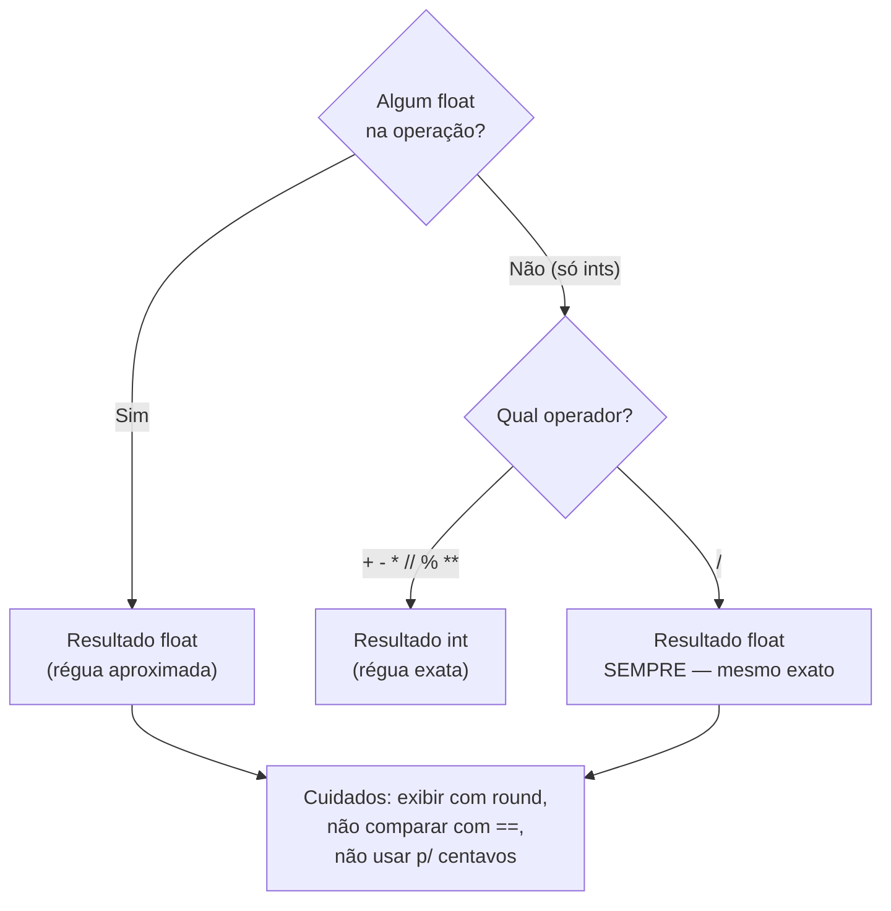

# 01.04 — Números e operadores

> **Módulo 01 — Python Fundamental** · Nível: N1 · Tempo estimado: 2h30 · Código: `codigo/cap04/`

## 1. Objetivo

- **Aplicar** os operadores aritméticos (`+ - * / // % **`) com a precedência correta e sem contar nos dedos.
- **Diferenciar** `int` de `float` e **prever** o tipo do resultado de cada operação (a divisão `/` que sempre entrega float incluída).
- **Explicar** o susto do `0.1 + 0.2` — por que acontece, quando importa e o que fazer (round na exibição, centavos como inteiros no dinheiro).
- **Implementar** os primeiros cálculos de negócio da Aurora: frete, parcelas e troco.

Ao final, a Aurora terá suas primeiras contas confiáveis — e você saberá exatamente quando um resultado numérico merece desconfiança.

---

## 2. Pré-requisitos

- [01.03 — Variáveis, objetos e referências](03-variaveis-objetos-e-referencias.md)

**Autoteste:** (1) `x = 7` — qual o `type` do objeto? (2) `x = x + 1` lê ou escreve a etiqueta `x`? (ambos — em que ordem?) (3) Valores se comparam com `is` ou `==`? Se travou, o 01.03 é a revisão dirigida — este capítulo cria objetos numéricos em toda linha.

---

## 3. Motivação

Segunda semana na Aurora. A gestora aparece com três contas que "a planilha faz, mas ninguém confia": o **frete** (R$ 12,50 por caixa, e cada caixa leva até 6 itens — quantas caixas para 20 itens?), o **parcelamento** (R$ 1.399,90 em 3× "sem juros" — quanto por parcela, e para onde vai o centavo que sobra?) e o **troco** do balcão (quantas notas de cada?). Contas de padaria — até você tentar programá-las.

Aí descobre-se que dividir 20 por 6 dá `3.3333...` e caixas não existem em fração; que R$ 1.399,90 dividido por 3 dá uma dízima que multiplicada de volta **não** devolve R$ 1.399,90; e — o clássico absoluto — que para o Python, `0.1 + 0.2` é `0.30000000000000004`. Quem não entende o porquê entra em pânico ("a linguagem está quebrada!") ou, pior, espalha `round()` a esmo até os números "parecerem certos" — e entrega um sistema financeiro que erra centavos em silêncio, o tipo de bug que corrói a confiança no Atlas inteiro.

Nada disso é defeito: é o comportamento documentado de dois tipos numéricos com propósitos diferentes, mais meia dúzia de operadores que resolvem exatamente os problemas acima — quando se sabe qual usar.

Este capítulo resolve isso assim: apresenta `int` e `float` como ferramentas distintas, os sete operadores com suas regras de tipo e precedência, a explicação honesta do susto decimal — e fecha com as três contas da Aurora funcionando, do jeito que dinheiro de verdade exige.

---

## 4. Modelo mental

> 🧠 **Modelo mental**
> Python tem **duas réguas de números**: a régua dos inteiros (`int`) — exata, ilimitada, feita para **contar** (itens, caixas, centavos) — e a régua dos decimais (`float`) — aproximada, veloz, feita para **medir** (pesos, médias, percentuais). A regra de ouro das operações: **misturou as réguas, o resultado cai na aproximada** — e a divisão `/` entrega float *sempre*, mesmo entre inteiros exatos. Escolher a régua certa para cada dado é metade da aritmética profissional.

**Exercício de previsão.** Sem rodar, decida o valor **e o tipo** de cada resultado:

```python
print(7 / 2)
print(7 // 2)
print(7 % 2)
print(6 / 3)
```

*Resposta comentada:* `3.5` (float), `3` (int), `1` (int) — e a pegadinha: `6 / 3` dá **`2.0`, float**, não `2`. A barra simples `/` é a divisão *de medir*: entrega sempre a régua aproximada, mesmo quando a conta fecha exata. A barra dupla `//` é a divisão *de contar* (quantas vezes cabe, descartando o resto) e o `%` entrega o resto. Se você previu `2` no último, acabou de aprender a regra mais traiçoeira do capítulo — de graça.

---

## 5. Analogia

`int` e `float` são a **balança de farmácia e a balança de caminhão**. A de farmácia (int) é exata no que se propõe: conta comprimidos um a um, sem "mais ou menos" — e não existe meio comprimido no frasco. A de caminhão (float) pesa toneladas com agilidade, mas ninguém espera dela o miligrama: ela **aproxima por construção**, e está tudo bem, porque medir carga é isso. O desastre é usar a balança de caminhão para aviar receita — ou seja: usar float para dinheiro e esperar centavo exato.

**Onde a analogia quebra:** balanças erram para qualquer lado, aleatoriamente; o float erra de forma **determinística e reprodutível** — `0.1 + 0.2` dá o mesmo `0.30000000000000004` em qualquer máquina, sempre. Não é imprecisão de instrumento gasto: é consequência matemática de representar decimais em binário — a seção 7 mostra o porquê.

---

## 6. Teoria

### Os dois tipos numéricos do dia a dia

**`int`** (*integer*, inteiro): exato e **ilimitado** — o Python aceita `10 ** 100` sem pestanejar, diferente de muitas linguagens (não há "estouro" de inteiro para se preocupar). Sublinhados ajudam a ler grandezas: `1_399_90` é válido e legível (centavos de R$ 1.399,90 — guarde essa ideia).

**`float`** (*floating point*, ponto flutuante): decimais aproximados em 64 bits, velozes, perfeitos para medidas, médias e percentuais — e **inadequados para dinheiro** quando centavo importa (a seção de erros crava a regra).

### Os sete operadores

| Operador | Nome | Exemplo | Resultado | Regra de tipo |
|---|---|---|---|---|
| `+` `-` `*` | soma, subtração, multiplicação | `3 * 4` | `12` | int com int → int; qualquer float na conta → float |
| `/` | divisão real | `7 / 2` | `3.5` | **sempre float**, mesmo exata (`6 / 3` → `2.0`) |
| `//` | divisão inteira (piso) | `7 // 2` | `3` | int com int → int; "quantas vezes cabe" |
| `%` | módulo (resto) | `7 % 2` | `1` | o que sobra da divisão inteira |
| `**` | potência | `2 ** 10` | `1024` | int com int → int (expoente negativo → float) |

A dupla `//` e `%` é sociedade inseparável: `total // tamanho` responde "quantos grupos completos" e `total % tamanho` responde "quantos sobram" — juntas resolvem caixas de frete, notas de troco, paginação (no módulo 06 elas voltam calculando páginas de API) e "isso é par?" (`n % 2 == 0`).

### Precedência: quem calcula primeiro

Da mais alta para a mais baixa: `**` → `* / // %` → `+ -`. Empates resolvem-se da esquerda para a direita (exceção: `**` resolve da direita). Exemplo completo:

```python
resultado = 2 + 3 * 4 ** 2      # 4**2=16 → 3*16=48 → 2+48
print(resultado)                 # Saída: 50
```

A regra profissional, porém, não é decorar a tabela — é **não depender dela**: parênteses de clareza são gratuitos e todo leitor agradece. `(preco * quantidade) + frete` diz a intenção; `preco * quantidade + frete` obriga o leitor a conferir a tabela.

### Conversões e arredondamento

- `int(x)` converte **truncando** em direção ao zero: `int(3.9)` → `3` (não arredonda!).
- `float(x)` converte para a régua decimal: `float(3)` → `3.0`.
- `round(x, n)` arredonda a `n` casas: `round(3.14159, 2)` → `3.14`. Miudeza honesta: em empates exatos o `round` usa a regra do "banqueiro" (`round(2.5)` → `2`, para o par mais próximo) — raramente importa, mas evita susto em teste.
- `abs(x)` valor absoluto; `divmod(a, b)` entrega `//` e `%` de uma vez (curiosidade útil).

### Atribuições com operação

O padrão `saldo = saldo + 100` do 01.03 tem forma abreviada: `saldo += 100` — e igualmente `-=`, `*=`, `/=`, `//=`, `%=`. Em linguagem de etiquetas: leia o objeto atual, calcule, amarre a etiqueta no objeto novo. Abreviação de escrita, não de comportamento.

---

## 7. Funcionamento interno

Por que `0.1 + 0.2` dá `0.30000000000000004`? Porque o float armazena números em **binário**, e 0.1 em binário é uma dízima periódica — assim como 1/3 em decimal é 0.3333... sem fim. O computador guarda os primeiros 53 bits e descarta o resto: o "0.1" guardado é, na verdade, 0.1000000000000000055511... Cada parcela chega com seu arredondamento microscópico, a soma os combina, e o resultado fica a um fio do 0.3 exato — fio que aparece quando o Python imprime com toda a precisão. Não é bug nem azar: é o contrato do padrão IEEE 754, o mesmo em toda linguagem (JavaScript, Java, C — todas dão o mesmo resultado). Consequências práticas em N1: (1) exibição se resolve com `round`/formatação; (2) comparação de floats com `==` é aposta (use tolerância, quando chegar a hora); (3) dinheiro que exige centavo exato não usa float — usa centavos inteiros (a seção 9 pratica) ou o tipo `Decimal` da biblioteca padrão (que a trilha apresenta quando o Atlas tiver banco — módulo 05 — onde ele é o padrão de coluna monetária).

---

## 8. Visualização do fluxo

Qual régua sai de cada operação — o mapa de decisão dos tipos:



**Como ler:** a pergunta de cima decide quase tudo — float contamina qualquer conta. O caminho da direita guarda a única exceção entre inteiros: a barra simples, que muda de régua por definição. Todo caminho que termina em float desemboca na mesma caixa de cuidados — é ela que separa o programa confiável do "parece certo".

---

## 9. Aplicação prática

As três contas da Aurora, construídas com os operadores certos. Rode e acompanhe:

```bash
python 01-Python/codigo/cap04/contas_da_aurora.py
```

**Conta 1 — Frete por caixas (a dupla `//` e `%`).** 20 itens, 6 por caixa: `20 // 6` → 3 caixas cheias, `20 % 6` → 2 itens sobrando — logo, se sobrou item (`resto` maior que zero), soma-se 1 caixa. O script mostra o padrão do "arredondar para cima" com aritmética de contar — sem float no caminho.

**Conta 2 — Parcelamento sem perder centavo (dinheiro como int).** R$ 1.399,90 vira `139_990` **centavos inteiros**. `139_990 // 3` → 46.663 centavos por parcela; `139_990 % 3` → 1 centavo de resto, que por convenção vai na primeira parcela. Prova dos nove no próprio script: as três parcelas somadas devolvem exatamente 139.990. Com float, essa prova falha — e o script demonstra a falha ao lado, para você ver as duas réguas em contraste:

```text
--- Parcelamento com centavos inteiros ---
Parcela 1: 46664 | Parcelas 2 e 3: 46663 cada
Prova: 46664 + 46663 + 46663 = 139990 centavos (exato!)

--- O mesmo, ingenuamente com float ---
1399.9 / 3 = 466.6333333333333
466.63 * 3 = 1398.8899999999999  (sumiu R$ 1,01!)
```

**Conta 3 — Troco em notas (o `%` em cascata).** Troco de R$ 87: `87 // 50` → 1 nota de 50, resta `87 % 50` = 37; `37 // 20` → 1 de 20, resta 17... O script desce a cascata até a moeda. É o mesmo padrão da Conta 1, repetido — repare como `//` e `%` são um só gesto mental.

> 🎯 **Checkpoint rápido**
> Sem rodar: `int(7.99)` dá quanto? E se a intenção era "7.99 reais viram quantos reais inteiros, arredondando direito"? (Se hesitou: seção 6, conversões — truncar ≠ arredondar.)

---

## 10. Código comentado

Arquivo completo em [`codigo/cap04/contas_da_aurora.py`](codigo/cap04/contas_da_aurora.py).

```python
# ------------------------------------------------------------
# contas_da_aurora.py
# Capítulo 01.04 — Números e operadores
# O que este arquivo demonstra: frete (// e %), parcelamento com
#   centavos inteiros (dinheiro exato) e troco em cascata
# Como executar: python contas_da_aurora.py
# ------------------------------------------------------------

print("--- Conta 1: frete por caixas ---")
itens = 20
itens_por_caixa = 6

caixas_cheias = itens // itens_por_caixa   # quantas caixas completas cabem
resto = itens % itens_por_caixa            # itens que sobram fora delas

# Se sobrou item, precisamos de uma caixa a mais (aritmética de contar,
# sem float no caminho). O int(...) converte o True/False da comparação
# em 1/0 — truque honesto que o capítulo 01.08 destrincha.
caixas_total = caixas_cheias + int(resto > 0)

print("Itens:", itens, "| caixas cheias:", caixas_cheias, "| sobram:", resto)
print("Caixas a cobrar:", caixas_total)
# Saída: Caixas a cobrar: 4

print()
print("--- Conta 2: parcelamento com centavos inteiros ---")
preco_centavos = 139_990        # R$ 1.399,90 guardado na régua EXATA
parcelas = 3

parcela_base = preco_centavos // parcelas   # 46663 centavos
sobra = preco_centavos % parcelas           # 1 centavo — vai na primeira

parcela_1 = parcela_base + sobra
print("Parcela 1:", parcela_1, "| Parcelas 2 e 3:", parcela_base, "cada")
prova = parcela_1 + parcela_base + parcela_base
print("Prova:", prova, "centavos (exato!)")
# Saída: Prova: 139990 centavos (exato!)

print()
print("--- O mesmo, ingenuamente com float ---")
preco_float = 1399.90
parcela_float = preco_float / 3
print("1399.9 / 3 =", parcela_float)
print("466.63 * 3 =", 466.63 * 3, " (sumiu dinheiro!)")
# Saída: 466.63 * 3 = 1398.8899999999999  (sumiu dinheiro!)

print()
print("--- Conta 3: troco em cascata ---")
troco = 87   # em reais inteiros, para o balcão

notas_50 = troco // 50
resta = troco % 50
notas_20 = resta // 20
resta = resta % 20
notas_10 = resta // 10
resta = resta % 10

print("Troco de R$", troco, "-> 50:", notas_50, "| 20:", notas_20,
      "| 10:", notas_10, "| resta R$", resta)
# Saída: Troco de R$ 87 -> 50: 1 | 20: 1 | 10: 1 | resta R$ 7
```

---

## 11. Erros comuns

### Erro 1 — Esperar int da divisão `/` (e quebrar onde float não entra)

**Sintoma:** você divide para achar uma contagem e o resultado carrega `.0` — ou pior, quebra mais adiante:

```text
Traceback (most recent call last):
  File "frete.py", line 5, in <module>
    print("caixas: " + str(caixas))
TypeError: 'float' object cannot be interpreted as an integer
```

(a mensagem exata varia com o uso — o `.0` intrometido é o sintoma comum)
**Causa:** `/` entrega float **sempre**; `20 / 6` nunca seria uma contagem de caixas.
**Correção:** contagens usam `//` (e `%` para o resto). Se um `.0` aparecer onde você esperava contagem, a divisão errada está a uma busca de distância.

### Erro 2 — "Consertar" float de dinheiro com round espalhado

**Sintoma:** nenhum traceback — a planilha da conferência é que denuncia: centavos que somem (`466.63 * 3` → `1398.88...`) ou aparecem, dependendo da ordem das contas.
**Causa:** float é régua de medir; cada operação arredonda em binário, e `round` na exibição não conserta o **acúmulo** — só maquia o número mostrado.
**Correção:** dinheiro com centavo exato = **centavos como `int`** (converta na entrada, calcule tudo em int, formate só na saída). A regra vale até o módulo 05, onde o tipo `Decimal`/coluna monetária do banco assume o posto formal.

> ⚠️ **Atenção**
> Este é o primeiro bug silencioso de verdade da trilha: o programa roda, imprime, *parece* certo — e está errado por 1 centavo que vira 1.000 na escala da Aurora. Bugs silenciosos não se detectam olhando a saída "no olho": se detectam com **prova dos nove no código** (como a do script) — hábito que o módulo 12 transformará em teste automatizado.

### Erro 3 — Truncar achando que arredondou

**Sintoma:** sem traceback: `int(7.99)` devolve `7`, a média de avaliações `4.6` vira `4`, e o relatório sistematicamente "puxa para baixo".
**Causa:** `int()` **trunca** em direção ao zero — corta a parte decimal, não arredonda.
**Correção:** arredondar é `round(7.99)` → `8`. Decida caso a caso qual semântica o negócio pede: truncar (idade a partir da data), arredondar (média de estrelas) ou arredondar para cima (caixas de frete — que você já sabe fazer com `//` e resto).

---

## 12. Boas práticas

✅ **Escolha a régua pelo dado, na entrada: contagem/dinheiro → int; medida/percentual → float** — a decisão certa no começo elimina a família inteira de sustos no meio.

✅ **Parênteses de clareza, mesmo quando a precedência dispensa** — `(preco * quantidade) + frete` custa dois caracteres e poupa uma conferência de tabela a cada leitor.

✅ **Sublinhados em números grandes: `139_990`, `1_000_000`** — legibilidade é a filosofia da linguagem (01.01), e vale para literais também.

✅ **Prova dos nove nas contas que importam** — some as parcelas de volta, feche o troco: uma linha de verificação no script hoje é o embrião dos testes do módulo 12.

❌ **Evite float para dinheiro "porque é só um relatoriozinho"** — relatório é exatamente onde o centavo errado encontra a diretoria; centavos inteiros custam o mesmo esforço.

❌ **Evite comparar floats com `==`** — `0.1 + 0.2 == 0.3` é `False`; se precisar comparar medidas, compare com tolerância (o padrão chega formalmente adiante; até lá, desconfie de todo `==` entre floats).

---

## 13. Performance

Nesta escala, irrelevante — qualquer conta deste capítulo executa em nanossegundos, e você saberá quando importar. A nota honesta de N1: as duas réguas têm custos diferentes por baixo (float opera direto no hardware; o int ilimitado do Python faz mágica de software quando os números crescem além do nativo), e é por isso que o módulo 10 — processando milhões de linhas — escolherá tipos numéricos com cuidado de engenheiro (lá, com medição real sua). O hábito que já vale hoje é o de lá: **saber qual régua está usando e por quê.**

---

## 14. Mercado

> 🏢 **Mercado**
> Aritmética de dinheiro é assunto sério a ponto de ter regulação: sistemas financeiros e de e-commerce brasileiros lidam com arredondamento de centavos em nota fiscal, parcelamento e juros sob regras estritas — e "float para dinheiro" é apontado em revisão de código (*code review*) como defeito, não estilo, em qualquer fintech. O padrão profissional é o que você praticou: valores monetários como inteiros na menor unidade (centavos) ou tipos decimais exatos (`Decimal` no Python, `NUMERIC`/`DECIMAL` no banco — módulos 03 e 05). A dupla `//`/`%`, por sua vez, é onipresente: paginação de APIs (módulo 06), particionamento de dados (módulo 10), distribuição de carga — todo "dividir em grupos e tratar a sobra" da engenharia é essa dupla.
>
> **Mini-cenário:** na Aurora, o parcelamento da Conta 2 é literalmente o cálculo que o gateway de pagamento exigirá no módulo 07 — centavo por centavo, com a primeira parcela absorvendo a sobra. O script de hoje é o rascunho de uma função que viverá no Atlas até a produção.

---

## 15. Entrevistas

**P1. "Qual a diferença entre `/`, `//` e `%`? Dê um uso real de cada."**
*Resposta esperada:* `/` divisão real, sempre float (médias, percentuais); `//` divisão inteira-piso (quantas caixas/páginas/grupos completos); `%` resto (o que sobra; paridade; ciclos). O "uso real" é o que separa a resposta: quem cita paginação ou distribuição de sobras mostra quilometragem.

**P2. "Por que `0.1 + 0.2 != 0.3` em Python? Isso é um bug?"**
*Resposta esperada:* não é bug nem é do Python: floats seguem IEEE 754 (binário), 0.1 é dízima em binário, cada valor carrega arredondamento microscópico e a soma o expõe — igual em qualquer linguagem. Fecho prático: exibição com formatação, comparação com tolerância, dinheiro fora do float. A resposta fraca clássica: "o Python tem problema de precisão".

**P3. "Como você representaria valores monetários num sistema? Justifique."**
*Resposta esperada:* menor unidade como inteiro (centavos) ou tipo decimal exato (`Decimal`; no banco, `NUMERIC`); nunca float binário quando centavo importa; conversão nas bordas (entrada/exibição), aritmética exata no miolo; e a prova dos nove/testes nas operações de divisão (parcelas somam o total?). Citar a regra de onde a sobra vai (primeira parcela) demonstra contato com requisito real.

**Pegadinha clássica: "Quanto é `-7 // 2` em Python?"**
Ela derruba quem responde `-3` (o instinto de "trunca"). A resposta é **`-4`**: `//` é divisão-**piso** — arredonda para baixo (em direção a −∞), não em direção ao zero. Coerência bonita para fechar: o `%` acompanha (`-7 % 2` → `1`, resto sempre com o sinal do divisor), de modo que `(a // b) * b + (a % b) == a` se mantém sempre. Quem sabe *por que* os dois combinam saiu da decoreba.

---

## 16. Exercícios guiados

Enunciados completos em [`exercicios/cap04.md`](exercicios/cap04.md); gabaritos em [`exercicios/gabaritos/cap04.md`](exercicios/gabaritos/cap04.md).

### Aquecimento

- **A1** `[~10 min · valor e tipo]` — Preveja valor **e tipo** de 8 expressões (as barras, o float contaminante, o `6/3`).
- **A2** `[~5 min · precedência]` — Resolva 4 expressões no papel; depois adicione os parênteses de clareza que explicitam a intenção.
- **A3** `[~5 min · conversões]` — Preveja `int()`, `float()` e `round()` sobre 6 valores (incluindo o truncar vs. arredondar).
- **A4** `[~10 min · // e % juntos]` — 4 problemas rápidos de "grupos e sobra" (ovos em dúzias, minutos em h:min, paridade, páginas).

### Aplicação

- **AP1** `[~20 min · calculadora de frete]` — Generalize a Conta 1: itens e capacidade em variáveis, caixas cobradas + custo total do frete.
- **AP2** `[~25 min · parcelador honesto]` — Generalize a Conta 2 para preço e número de parcelas quaisquer, com prova dos nove impressa.
- **AP3** `[~20 min · relógio de expedição]` — Converta um total de minutos de preparo (ex.: 517) em "X h Y min" com `//` e `%`; depois o inverso.

---

## 17. Desafios

- **D1** `[~40 min · o caixa completo]` — **Máquina de troco da Aurora.** Dado um valor de compra e um valor pago (em reais inteiros, por ora), calcule o troco e a decomposição completa em notas e moedas de R$ (50, 20, 10, 5, 2, 1) minimizando a quantidade de cédulas — a cascata da Conta 3, completa. Inclua a prova dos nove (soma da decomposição = troco) e o caso "pagamento insuficiente" tratado com uma mensagem (um `if` simples — que você viu de relance no script do capítulo; se preferir esperar o 01.09, trate só o caso feliz e anote a pendência: escolha documentada também é resposta).

<details><summary>💡 Dica 1 (conceito)</summary>
Cada degrau da cascata é o MESMO par de perguntas: quantas desta nota cabem? (`//`) o que resta? (`%`). Seis degraus.
</details>
<details><summary>💡 Dica 2 (estratégia)</summary>
Sem laços ainda (chegam no 01.10) — escreva os seis degraus explícitos. A repetição incômoda é proposital: você vai refatorar exatamente este código no 01.10 e sentir o alívio.
</details>
<details><summary>💡 Dica 3 (esqueleto)</summary>
troco = pago − compra → degrau 50 → degrau 20 → ... → degrau 1 → prova dos nove → prints formatados.
</details>

---

## 18. Mini projeto

**Simulador de pedido da Aurora v0** `[~1h]` — a primeira conta de ponta a ponta do Atlas.

Requisitos numerados:

1. Crie `simulador_pedido.py` em `codigo/cap04/` com o cabeçalho padrão. Defina em variáveis (nomes dignos): preço unitário do produto **em centavos**, quantidade, itens por caixa de frete, custo do frete por caixa **em centavos**, número de parcelas.
2. Calcule e imprima, tudo em aritmética inteira: subtotal, caixas necessárias (com a sobra tratada), frete total, total geral.
3. Parcele o total geral com a regra da sobra na primeira parcela; imprima as parcelas e a **prova dos nove**.
4. Imprima os valores em reais na saída (dividindo por 100 apenas na exibição — comente no código por que só ali o float é bem-vindo).
5. Rode com 3 cenários diferentes de valores (mude as variáveis, rode, cole as 3 saídas em comentário no fim do arquivo).

**Critério de "está bom":** zero float fora da exibição; prova dos nove fecha nos 3 cenários; nomes e comentários contam a história. Este simulador é ancestral direto do carrinho do Atlas — guarde com carinho.

---

## 19. Revisão

**Resumo do capítulo:**

- Duas réguas: `int` conta (exato, ilimitado), `float` mede (aproximado, veloz). Misturou → float; `/` → float **sempre** (`6/3` é `2.0`).
- `//` e `%` são a dupla "grupos completos + sobra": frete, troco, paginação, paridade — e `//` é piso (para −∞: `-7 // 2` é `-4`).
- Precedência: `**` → `* / // %` → `+ -`; a regra profissional é parênteses de clareza, não tabela decorada.
- `int()` trunca; `round()` arredonda (banqueiro nos empates); escolher qual é decisão de negócio, não de sintaxe.
- `0.1 + 0.2 != 0.3` é IEEE 754 em binário — igual em toda linguagem; exibição com round, comparação com tolerância.
- Dinheiro com centavo exato = centavos como int (ou `Decimal`, adiante); prova dos nove nas contas que importam — o primeiro antídoto contra bugs silenciosos.

**Flashcards novos** (adicionados a [`revisao/flashcards.md`](revisao/flashcards.md)):

| ID | Frente | Verso |
|---|---|---|
| 01.04-F1 | Preveja valor e tipo: `7 / 2`, `7 // 2`, `7 % 2`, `6 / 3`. | (Previsão) `3.5` float · `3` int · `1` int · `2.0` **float** — a barra simples entrega float sempre, mesmo exata. |
| 01.04-F2 | Explique com suas palavras: por que `0.1 + 0.2` dá `0.30000000000000004`? | (Elaboração) Floats vivem em binário; 0.1 é dízima em binário → cada valor guarda arredondamento microscópico e a soma o expõe. IEEE 754, igual em toda linguagem. |
| 01.04-F3 | Como representar dinheiro quando o centavo importa — e onde o float é tolerado? | (Decisão) Centavos como `int` (ou `Decimal`/coluna NUMERIC adiante); aritmética exata no miolo, float só na exibição formatada. |
| 01.04-F4 | Qual par de operadores resolve "grupos completos + sobra" e cite 2 usos reais. | `//` e `%` — caixas de frete/troco em notas; adiante: paginação de APIs e particionamento de dados. |
| 01.04-F5 | Pegadinha: `-7 // 2` = ? E por que `%` acompanha? | `-4` — `//` é piso (arredonda para −∞), não truncamento; `%` dá `1` (sinal do divisor) mantendo `(a//b)*b + a%b == a`. |

**Agendamento:** registre no `PROGRESSO.md` e marque D+1, D+7, D+30, D+90 na [`Revisoes/agenda.md`](../Revisoes/agenda.md).

---

## 20. Checklist

Perguntas de domínio — teste do sim:

- [ ] Sei prever *valor E tipo de qualquer expressão com os 7 operadores*?
- [ ] Sei explicar *o `0.1 + 0.2` para um colega em pânico — e o que fazer a respeito*?
- [ ] Sei implementar *dinheiro exato com centavos inteiros, com prova dos nove*?
- [ ] Sei aplicar *a dupla `//`/`%` em problemas de grupos-e-sobra sem hesitar*?
- [ ] Sei responder *à pegadinha do `-7 // 2` com o porquê do piso*?

Itens práticos:

- [ ] Rodei `contas_da_aurora.py` e entendi o contraste int × float do parcelamento.
- [ ] Acertei (ou entendi por que errei) a previsão da seção 4 e o checkpoint da seção 9.
- [ ] Fiz Aquecimento e Aplicação; tentei o Desafio 15+ min antes das dicas.
- [ ] Construí o `simulador_pedido.py` com os 3 cenários e provas fechando.
- [ ] Registrei a sessão e agendei as 4 revisões.

---

## 21. Próximo capítulo

O simulador imprime números certos — mas repare na saída: "Parcela 1: 46664" é centavo cru, sem R$, sem vírgula, sem alinhamento. Falta a outra metade de todo relatório: **texto**. Ficou deliberadamente em aberto como o Python guarda e manipula texto — o tipo `str` que você usa desde o 01.01 sem nunca ter aberto: como fatiar um código de pedido, por que `"42" + 1` explode, e o que "imutável" (palavra plantada no 01.03) muda na prática. O próximo capítulo abre as strings — e a Aurora começa a ganhar relatórios legíveis.

→ [01.05 — Strings — parte 1](05-strings-parte-1.md)

---

*Gerado sob spec 3.0.0*
