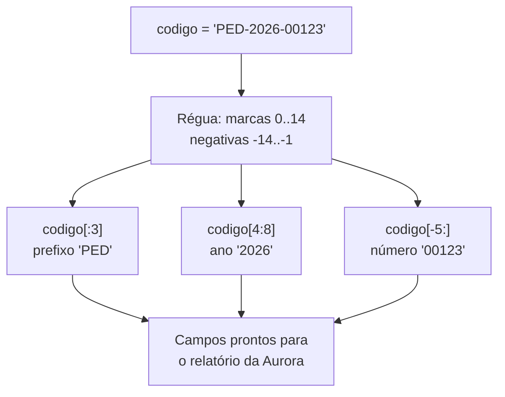

# 01.05 — Strings — parte 1

> **Módulo 01 — Python Fundamental** · Nível: N1 · Tempo estimado: 2h30 · Código: `codigo/cap05/`

## 1. Objetivo

- **Aplicar** a criação de strings com os três tipos de aspas — e saber quando cada um evita dor.
- **Aplicar** indexação (inclusive negativa) e fatiamento `[início:fim:passo]` para extrair pedaços de texto com precisão.
- **Explicar** a imutabilidade na prática e **prever** o erro de tentar "mudar uma letra".
- **Depurar** os erros de índice fora do intervalo — e usar `len()` como régua de segurança.

Ao final, você saberá dissecar qualquer código de pedido, CPF mascarado ou linha de arquivo da Aurora — a habilidade que o processamento de dados usa todos os dias.

---

## 2. Pré-requisitos

- [01.03 — Variáveis, objetos e referências](03-variaveis-objetos-e-referencias.md) — a palavra "imutável" foi plantada lá.
- [01.04 — Números e operadores](04-numeros-e-operadores.md) — índices são inteiros; `len()` devolve int.

**Autoteste:** (1) `"42"` e `42` têm o mesmo `type`? (2) Strings são mutáveis ou imutáveis (o 01.03 avisou)? (3) `7 // 2` dá quanto — e por que isso vai importar para "pegar a metade" de um texto? Se travou na 1 ou 2, revisite o 01.03.

---

## 3. Motivação

Terceira semana na Aurora, e o CSV de vendas revela sua natureza: **texto, texto por toda parte**. O código do pedido é `"PED-2026-00123"` — e o relatório precisa só do ano. O CPF vem `"123.456.789-01"` — e a tela pode mostrar apenas os três últimos dígitos. O nome do produto chegou como `"  Fone Bluetooth XZ-9  "` — com espaços fantasmas que fazem `"Fone Bluetooth XZ-9"` parecer *outro* produto na contagem.

Sem saber operar texto, cada uma dessas tarefas vira gambiarra ou tarefa manual — e o estagiário da planilha continua empregado no retrabalho. Com meia dúzia de operações (índice, fatia, `len`), todas viram uma linha cada.

Há também um motivo estrutural: praticamente **todo dado externo chega como texto**. O arquivo CSV (01.22) entrega texto; o `input()` do usuário (01.07) entrega texto; a resposta de API (módulo 07) chega como texto antes de virar estrutura. A régua de medir e a de contar do 01.04 só entram em ação *depois* que alguém extraiu o número de dentro do texto. Strings são a alfândega de todo dado que entra no sistema.

Este capítulo resolve isso assim: apresenta a mecânica fundamental do tipo `str` — criação, endereçamento e recorte — sobre os dados reais da Aurora, e deixa a limpeza e a formatação profissional (métodos e f-strings) engatilhadas para o capítulo seguinte.

---

## 4. Modelo mental

> 🧠 **Modelo mental**
> Uma string é uma **régua de caracteres com posições numeradas a partir do zero** — e as posições contam **as casas entre os caracteres**, não os caracteres. Em `"PED-2026"`, o `P` mora na casa 0 e o índice negativo conta do fim (`-1` é o último). O fatiamento `[início:fim]` corta **da marca `início` até a marca `fim`, sem incluir `fim`** — por isso `[0:3]` pega exatamente 3 caracteres, e `fim - início` é sempre o tamanho do pedaço.

**Exercício de previsão.** Sem rodar, decida a saída de cada linha:

```python
codigo = "PED-2026-00123"
print(codigo[0])
print(codigo[-1])
print(codigo[4:8])
print(len(codigo))
```

*Resposta comentada:* `P` (casa 0), `3` (último caractere — o dígito, não o número!), `2026` (das marcas 4 a 8: casas 4, 5, 6, 7 — o fim é exclusivo) e `14`. Se você previu `2026-` no fatiamento, contou o fim como inclusivo — o erro de contagem mais comum da linguagem, e o motivo de o modelo mental falar em *marcas entre casas*: da marca 4 à marca 8 há exatamente 4 caracteres.

---

## 5. Analogia

Uma string é um **trem de vagões lacrados**. Cada vagão (caractere) tem um número de plataforma começando em 0 — e você pode se referir ao último como "-1", contando do fim da composição. Você pode **olhar** qualquer vagão (`codigo[0]`), **fotografar um trecho** da composição (`codigo[4:8]` — a foto é um trem novo, menor) e **medir** o comprimento (`len`). O que você não pode é **trocar a carga de um vagão**: o trem é lacrado de fábrica. "Alterar" um trem é montar outro com os vagões que você quer.

**Onde a analogia quebra:** fotografar um trecho de trem real custa proporcional ao trecho; em Python, fatiar cria uma string nova de verdade (cópia dos caracteres), mas o custo só será assunto quando os "trens" tiverem milhões de vagões — módulo 10. E vagões reais têm carga variada; aqui cada vagão carrega exatamente um caractere — inclusive o espaço, que é carga legítima e invisível (a origem dos "produtos fantasmas" da Motivação).

---

## 6. Teoria

### Criação: as três aspas

**String** (*string*) é o tipo `str`: uma sequência imutável de caracteres. Três formas de criar, cada uma com seu caso de uso:

```python
simples = 'Fone Bluetooth'          # aspas simples
duplas = "Caixa d'água"             # duplas — quando o texto TEM apóstrofo
tripla = """Relatório de vendas
gerado pelo Atlas."""               # triplas — texto de múltiplas linhas
```

A regra da trilha: **aspas duplas por padrão** (consistência com o formato dos arquivos de dados), simples quando o texto contém `"`, triplas para blocos. Misturar por descuido é o `SyntaxError` que você já sabe ler (01.01).

Dois detalhes que evitam sustos: `"a" + "b"` **concatena** (`"ab"` — cria objeto novo, como toda operação de string) e `"-" * 40` **repete** (uma linha separadora de relatório em 6 caracteres de código). E a string vazia `""` existe, tem `len` 0, e é um valor legítimo — não um erro.

### Indexação: o endereço de cada caractere

`texto[i]` acessa o caractere da casa `i`. As duas numerações convivem:

```text
 P   E   D   -   2   0   2   6
 0   1   2   3   4   5   6   7     ← do início
-8  -7  -6  -5  -4  -3  -2  -1     ← do fim
```

`codigo[0]` → `"P"`; `codigo[-1]` → o último, **seja qual for o tamanho** — a utilidade real do índice negativo: pegar o fim sem medir antes. O resultado de indexar é sempre uma string de 1 caractere (não existe "tipo caractere" em Python).

### Fatiamento: o canivete do capítulo

`texto[início:fim:passo]` — os três parâmetros, todos opcionais:

| Forma | Significado | `"PED-2026-00123"` → |
|---|---|---|
| `[4:8]` | das marcas 4 a 8 (fim exclusivo) | `"2026"` |
| `[:3]` | do começo até a marca 3 | `"PED"` |
| `[9:]` | da marca 9 até o fim | `"00123"` |
| `[-5:]` | os últimos 5 | `"00123"` |
| `[:]` | cópia inteira | `"PED-2026-00123"` |
| `[::2]` | do começo ao fim, pulando de 2 em 2 | `"PD22-01"` |
| `[::-1]` | passo negativo: invertida | `"32100-6202-DEP"` |

Duas propriedades que tornam fatias mais seguras que índices: **fatia fora do intervalo não explode** (`codigo[10:99]` devolve o que houver — `"0123"`; `codigo[50:99]` devolve `""`), enquanto índice fora explode (`IndexError`, seção 11). E `len(fatia)` é sempre `min(fim, len) - início` — nunca mais que o pedido.

### Imutabilidade: a promessa paga

O 01.03 avisou: `str` é imutável. Agora a prática — tentar "consertar uma letra" no lugar:

```python
codigo = "PED-2026-00123"
codigo[0] = "X"
# TypeError: 'str' object does not support item assignment
```

Não existe operação que altere uma string por dentro. "Modificar" é **construir outra** com fatias e concatenação:

```python
codigo_novo = "X" + codigo[1:]     # "XED-2026-00123" — objeto novo
```

A etiqueta `codigo` continua no objeto antigo até você reamarrá-la — exatamente o Ato 2 do 01.03, agora com utilidade. E o ganho escondido da imutabilidade: qualquer número de etiquetas pode compartilhar a mesma string sem risco de alguém "mexer por baixo" — a tranquilidade que as listas mutáveis vão te tirar no 01.13.

---

## 7. Funcionamento interno

Por dentro, na medida N1: cada caractere é um código numérico — o padrão **Unicode** dá um número a cada símbolo humano (`"A"` é 65, `"ç"` é 231, `"🚚"` também tem o seu), e as funções `ord("A")` → `65` e `chr(65)` → `"A"` revelam o mapeamento. É por isso que o `encoding` aparecerá como parâmetro ao abrir arquivos (01.22): gravar texto em disco exige combinar *como* esses números viram bytes — e UTF-8, o acordo dominante, será o padrão da trilha. A consequência prática de hoje: para o Python, `"ç"` é um caractere como outro qualquer (`len("ação")` é 4) — mas nem todo programa do mundo trata assim, e a alfândega de dados da Aurora (01.22) vai revalidar isso na prática. O custo do fatiamento (copiar caracteres) fica para o módulo 10, quando houver milhões deles.

---

## 8. Visualização do fluxo

De um código de pedido aos campos do relatório — o fatiamento como linha de desmontagem:



**Como ler:** a mesma régua (o objeto original, intacto — imutabilidade) alimenta três recortes independentes, cada um virando uma string nova. Repare na escolha de cada forma: prefixo com `[:3]` (começo conhecido), ano com `[4:8]` (miolo de posição fixa), número com `[-5:]` (fim de tamanho conhecido — robusto mesmo se o prefixo mudar de tamanho). Escolher a forma certa da fatia é metade da robustez.

---

## 9. Aplicação prática

Dissecando os dados reais da Aurora. Rode:

```bash
python 01-Python/codigo/cap05/dissecando_codigos.py
```

O script desmonta, passo a passo com prints comentados: o **código de pedido** (prefixo, ano, número sequencial — as três fatias do diagrama), o **CPF mascarado** (`"123.456.789-01"` → exibir só `"***.***.789-01"` usando fatias e concatenação) e o **teste do espaço fantasma** (dois nomes de produto "iguais" com `len` diferentes — a prova de que `"XZ-9"` e `"XZ-9 "` são objetos diferentes, e o gancho para o `strip()` do próximo capítulo). Saída esperada:

```text
--- Desmontando o código de pedido ---
Código completo: PED-2026-00123 (len = 14)
Prefixo: PED | Ano: 2026 | Número: 00123

--- Mascarando o CPF ---
Original: 123.456.789-01
Mascarado: ***.***.789-01

--- O espaço fantasma ---
Produto A: 'Fone Bluetooth XZ-9' (len = 19)
Produto B: 'Fone Bluetooth XZ-9 ' (len = 20)
São o mesmo texto? False
```

Depois de rodar, o gesto de fixação: **tampe o script e refaça a máscara do CPF de cabeça** no seu próprio arquivo — qual fatia pega o `".789-01"` final? (Duas respostas certas existem; o gabarito do AP2 compara as duas.)

> 💡 **Dica**
> Ao fatiar posições do meio, escreva a régua em comentário na primeira vez (`# PED-2026-00123` com os índices embaixo) — 30 segundos que eliminam o erro de contagem. Profissional não conta de cabeça: anota.

---

## 10. Código comentado

Arquivo completo em [`codigo/cap05/dissecando_codigos.py`](codigo/cap05/dissecando_codigos.py).

```python
# ------------------------------------------------------------
# dissecando_codigos.py
# Capítulo 01.05 — Strings — parte 1
# O que este arquivo demonstra: indexação, fatiamento e imutabilidade
#   sobre dados reais da Aurora (pedido, CPF, espaço fantasma)
# Como executar: python dissecando_codigos.py
# ------------------------------------------------------------

print("--- Desmontando o código de pedido ---")
codigo = "PED-2026-00123"
#         0123456789...        (régua anotada: P=0, E=1, D=2, -=3, 2=4...)

print("Código completo:", codigo, "(len =", len(codigo), ")")

prefixo = codigo[:3]       # do começo até a marca 3 (exclusiva) -> "PED"
ano = codigo[4:8]          # marcas 4..8 -> "2026"
numero = codigo[-5:]       # os últimos 5 — robusto se o prefixo mudar
print("Prefixo:", prefixo, "| Ano:", ano, "| Número:", numero)
# Saída: Prefixo: PED | Ano: 2026 | Número: 00123

print()
print("--- Mascarando o CPF ---")
cpf = "123.456.789-01"
# Mostrar apenas o final: máscara fixa + os últimos 7 caracteres (".789-01")
mascarado = "***.***" + cpf[-7:]
print("Original:", cpf)
print("Mascarado:", mascarado)
# Saída: Mascarado: ***.***.789-01

# Imutabilidade: o cpf original segue intacto — mascarar CRIOU outra string
print("Original continua:", cpf)

print()
print("--- O espaço fantasma ---")
produto_a = "Fone Bluetooth XZ-9"
produto_b = "Fone Bluetooth XZ-9 "   # espaço no fim — carga invisível
print("Produto A:", repr(produto_a), "(len =", len(produto_a), ")")
print("Produto B:", repr(produto_b), "(len =", len(produto_b), ")")
# repr() mostra a string COM as aspas e espaços visíveis — a lupa do
# depurador de textos (tratamento completo no capítulo 01.24)
print("São o mesmo texto?", produto_a == produto_b)
# Saída: São o mesmo texto? False
```

---

## 11. Erros comuns

### Erro 1 — Índice fora do trem

**Sintoma:**

```text
Traceback (most recent call last):
  File "codigos.py", line 3, in <module>
    print(codigo[14])
IndexError: string index out of range
```

**Causa:** `"PED-2026-00123"` tem `len` 14, logo o último índice válido é **13** (`len - 1`) — as casas começam em 0. Pedir a casa 14 é pedir o 15º vagão de um trem de 14.
**Correção:** o último caractere é `codigo[-1]` (à prova de contagem) ou `codigo[len(codigo) - 1]` (a versão didática). E lembre a assimetria: **fatia** fora do intervalo não explode — se o seu acesso pode passar do fim, `codigo[14:15]` devolve `""` em paz.

### Erro 2 — Tentar mudar a string no lugar

**Sintoma:**

```text
Traceback (most recent call last):
  File "conserta.py", line 2, in <module>
    codigo[0] = "X"
TypeError: 'str' object does not support item assignment
```

**Causa:** imutabilidade — não existe atribuição em posição de string; o trem é lacrado.
**Correção:** construa outra: `codigo = "X" + codigo[1:]` (e a etiqueta reamarra no objeto novo — o original fica para trás, como no 01.03). Quando as trocas forem por *conteúdo* em vez de posição ("troque todo `-` por `/`"), o método `replace` do próximo capítulo será a ferramenta certa.

### Erro 3 — O fim inclusivo imaginário (o erro silencioso)

**Sintoma:** nenhum traceback — o relatório é que sai errado: você queria o ano e a fatia veio `"202"` ou `"2026-"`.

```python
ano = codigo[4:7]
print(ano)
# Saída: 202     (faltou um!)
```

**Causa:** contar o `fim` como inclusivo. `[4:7]` cobre as casas 4, 5, 6 — três caracteres, não quatro.
**Correção:** a aritmética de bolso do modelo mental: **`fim = início + tamanho_desejado`**. Ano tem 4 caracteres a partir da casa 4 → `[4:8]`. Confira com `len(fatia)` na dúvida — e anote a régua em comentário (Dica da seção 9).

> ⚠️ **Atenção**
> Este é o segundo bug silencioso da trilha (o primeiro foi o float do dinheiro, 01.04). O padrão se repete: sem traceback, só dado errado na saída — e a defesa é a mesma: **prova no código** (`len(ano) == 4` como conferência) em tudo que alimenta relatório.

---

## 12. Boas práticas

✅ **Aspas duplas por padrão, simples quando o texto contém `"`** — consistência elimina uma micro-decisão por linha (e o formato combina com o CSV/JSON que vem aí).

✅ **Fatias semânticas: prefixo com `[:n]`, sufixo com `[-n:]`, miolo com régua anotada** — a forma da fatia deve contar *por que* aqueles índices, não só quais.

✅ **`repr()` como lupa em qualquer mistério de texto** — espaços fantasmas, aspas dentro de aspas e "textos iguais que não são iguais" ficam visíveis na hora (o produto B da seção 10 nunca mais te engana).

✅ **Confira `len()` do resultado quando a fatia alimenta decisão ou relatório** — uma linha de prova mata o erro silencioso do fim exclusivo.

❌ **Evite índices mágicos espalhados (`codigo[9:14]` sem contexto)** — amarre em nomes (`numero = codigo[-5:]`) ou comente a régua; o leitor de daqui a 3 meses (você) agradece.

❌ **Evite montar strings longas com dezenas de `+`** — funciona, mas há ferramenta melhor a um capítulo de distância (f-strings, 01.06); se o `+` está virando escada, pare e espere.

---

## 13. Performance

Nesta escala, irrelevante — fatiar códigos de 14 caracteres custa nanossegundos, e você saberá quando importar. A nota honesta de N1, plantando o futuro: cada fatia e cada `+` **criam uma string nova** (imutabilidade obriga); concatenar milhares de pedaços em série tem custo que cresce mais que o esperado, e o módulo 10 mostrará o padrão profissional (`join`, apresentado já no 01.06) com medição real. Por ora, o hábito que fica de graça: perceber *quando* seu código cria objetos novos — você já sabe ver isso desde o 01.03.

---

## 14. Mercado

> 🏢 **Mercado**
> Manipulação de texto é a habilidade invisível mais usada da engenharia de dados: IDs compostos como `"PED-2026-00123"` (fatiar para extrair ano/sequência) são padrão em ERPs e e-commerces brasileiros; mascaramento de CPF/dados pessoais é **obrigação legal** (LGPD) em qualquer tela ou log que exiba dados de cliente — o gesto que você treinou no CPF é literalmente um requisito de conformidade; e o "espaço fantasma" é a causa nº 1 de *joins* que falham e contagens duplicadas em relatórios reais (o mesmo produto contado como dois). Em vagas de dados, testes práticos de entrevista quase sempre incluem "limpe e extraia campos deste texto" — o par deste capítulo com o próximo.
>
> **Mini-cenário:** na Aurora, o relatório por ano que a gestora pediu depende de exatamente uma fatia: `codigo[4:8]`. E o bug de contagem que assombrava a planilha do estagiário — "por que o Fone XZ-9 aparece duas vezes com números diferentes?" — você acabou de diagnosticar com `repr` e `len`. A correção definitiva (o `strip`) chega no próximo capítulo; o diagnóstico já é seu.

---

## 15. Entrevistas

**P1. "O que significa dizer que strings são imutáveis em Python? Quais as consequências?"**
*Resposta esperada:* não há operação que altere o objeto (atribuição em posição é `TypeError`); toda "modificação" cria string nova e reamarra a etiqueta. Consequências: compartilhar strings entre variáveis é seguro (ninguém muta por baixo); métodos de string **retornam** novas (gancho do 01.06); concatenação em massa tem custo (e `join` existe por isso). Ligar imutabilidade ao modelo de referências mostra profundidade.

**P2. "Explique o fatiamento `s[a:b:c]` — e por que `s[0:3]` pega 3 caracteres."**
*Resposta esperada:* início inclusivo, fim **exclusivo**, passo opcional; o fim exclusivo faz `b - a` ser o tamanho — o que torna composições como `s[:n] + s[n:] == s` verdadeiras sem ajustes de ±1. Citar os idiomas `[-n:]` (sufixo), `[::-1]` (inversa) e o comportamento tolerante de fatias fora do intervalo fecha bem.

**P3. "Como você exibiria um CPF mascarado num log, e por que isso importa?"**
*Resposta esperada:* fatia do sufixo + máscara fixa (`"***.***" + cpf[-7:]`), **nunca** o dado completo em log/tela sem necessidade — LGPD e princípio do mínimo necessário. Mencionar que a máscara deve ser feita na exibição (o dado íntegro continua no sistema, controlado) demonstra noção de camadas.

**Pegadinha clássica: "`s[len(s)]` dá erro, mas `s[len(s):]` não. Por quê?"**
Ela derruba quem decorou "fora do intervalo dá IndexError" como regra única. A saída forte: **índice** exige uma casa existente (a última é `len-1` — pedir `len` explode); **fatia** é definida sobre as *marcas entre casas*, e a marca `len` existe (é a parede final do trem) — `s[len(s):]` é a fatia vazia legítima `""`. Quem explica com o modelo de marcas mostra que entende por que as duas operações têm contratos diferentes — e de brinde explica por que `s[:99]` também não explode.

---

## 16. Exercícios guiados

Enunciados completos em [`exercicios/cap05.md`](exercicios/cap05.md); gabaritos em [`exercicios/gabaritos/cap05.md`](exercicios/gabaritos/cap05.md).

### Aquecimento

- **A1** `[~10 min · previsão de fatias]` — 8 fatias sobre `"AURORA-CAMPINAS-2026"`; preveja cada uma antes de rodar.
- **A2** `[~5 min · índices negativos]` — 4 acessos com negativos e a pergunta "qual índice pega o último de QUALQUER string?".
- **A3** `[~5 min · imutabilidade]` — 3 trechos: quais explodem, quais criam objeto novo, o que sobra em cada etiqueta.
- **A4** `[~10 min · len como régua]` — Calcule `len` de 5 expressões (com espaço, com acento, string vazia, fatia, repetição).

### Aplicação

- **AP1** `[~20 min · desmonte de placa]` — Dado `"ABC1D23"` (placa Mercosul), extraia letras, número do meio e sufixo; depois refaça para o formato antigo `"ABC-1234"`.
- **AP2** `[~20 min · máscaras da LGPD]` — Escreva as máscaras de CPF (`***.***.789-01`), e-mail (`f***@aurora.com`) e cartão (`**** **** **** 1234`), cada uma com fatias + concatenação.
- **AP3** `[~15 min · detector de fantasmas]` — Dados 4 pares de textos "iguais", use `len`, `repr` e `==` para provar quais são de fato iguais e onde mora a diferença.

---

## 17. Desafios

- **D1** `[~40 min · o validador de formato]` — **Inspetor de códigos da Aurora.** Um código válido tem o formato `PED-AAAA-NNNNN` (3 letras, hífen, 4 dígitos, hífen, 5 dígitos — `len` 14). Sem condicionais ainda (chegam no 01.09), monte um **painel de inspeção**: para um código dado, imprima uma linha por verificação com o resultado booleano da comparação — `len` correto? prefixo é `"PED"`? as casas 3 e 8 são hífens? o ano fatiado está entre `"2000"` e `"2100"` (comparação de strings funciona aqui — descubra por quê e comente)? Rode com 3 códigos: um válido e dois defeituosos diferentes.

<details><summary>💡 Dica 1 (conceito)</summary>
Cada verificação é uma expressão que resulta True/False impressa — `print("len ok:", len(codigo) == 14)`. O painel é a soma delas.
</details>
<details><summary>💡 Dica 2 (estratégia)</summary>
Para o ano: `"2000" <= codigo[4:8] <= "2100"` — strings se comparam caractere a caractere pelo código Unicode; para 4 dígitos, a ordem "alfabética" coincide com a numérica. O porquê completo chega no 01.08; seu comentário deve registrar a descoberta.
</details>
<details><summary>💡 Dica 3 (esqueleto)</summary>
codigo → 5 prints de verificação (len, prefixo, hífen 3, hífen 8, faixa do ano) → rode 3 vezes mudando o código → cole as 3 saídas em comentário.
</details>

---

## 18. Mini projeto

**Etiqueta de expedição v0** `[~1h]` — o primeiro documento impresso da Aurora, montado 100% com o capítulo.

Requisitos numerados:

1. Crie `etiqueta_expedicao.py` em `codigo/cap05/` com o cabeçalho padrão. Defina em variáveis: código do pedido (`"PED-2026-00123"`), nome do cliente, CPF completo, cidade, e o total em centavos (int, como manda o 01.04).
2. Extraia por fatiamento: ano e número do pedido; primeiro nome do cliente (pode assumir que o primeiro espaço está numa posição conhecida — anote a limitação em comentário: o `split` do 01.06 vai libertá-lo dela); CPF mascarado.
3. Monte a etiqueta com concatenação e repetição: moldura de `"="` e `"-"` (`"=" * 44`), campos alinhados à mão, total exibido em reais com os centavos fatiados do int convertido para string (ex.: `"46664"` → `"R$ 466,64"` — fatias!).
4. Imprima a etiqueta completa; o pedido original deve permanecer intacto ao final (prove com um print).
5. Rode com 2 pedidos diferentes (mude as variáveis) e cole as 2 saídas em comentário.

**Critério de "está bom":** etiqueta legível com moldura fechando; a conversão centavos→reais feita só com fatias e concatenação (sem float!); limitação do primeiro nome documentada. No 01.06, você refatora esta etiqueta com métodos e f-strings — e mede a diferença de esforço.

---

## 19. Revisão

**Resumo do capítulo:**

- Strings: sequências **imutáveis** de caracteres; aspas duplas por padrão, simples para textos com `"`, triplas para blocos; `+` concatena e `*` repete — sempre criando objetos novos.
- Indexação: casas de 0 a `len-1`; negativos contam do fim (`-1` = último, à prova de contagem); índice fora explode (`IndexError`).
- Fatiamento `[início:fim:passo]`: fim **exclusivo** (`fim = início + tamanho`); `[:n]` prefixo, `[-n:]` sufixo, `[::-1]` inversa; fatia fora do intervalo devolve o que houver, sem explodir.
- Imutabilidade na prática: atribuição em posição é `TypeError`; "modificar" = construir outra e reamarrar (01.03 em ação).
- `len()` é a régua; `repr()` é a lupa (espaços fantasmas visíveis); prova de `len` em fatias que alimentam relatório mata o bug silencioso do fim inclusivo imaginário.
- Todo dado externo chega como texto — strings são a alfândega do sistema (CSV, input, APIs).

**Flashcards novos** (adicionados a [`revisao/flashcards.md`](revisao/flashcards.md)):

| ID | Frente | Verso |
|---|---|---|
| 01.05-F1 | Preveja: `"PED-2026-00123"[4:8]` e por que não vem o hífen. | (Previsão) `"2026"` — fim exclusivo: casas 4,5,6,7; a regra de bolso é fim = início + tamanho. |
| 01.05-F2 | Explique com suas palavras: o que a imutabilidade das strings garante e o que ela proíbe? | (Elaboração) Proíbe alterar o objeto (atribuição em posição = TypeError); garante compartilhamento seguro entre etiquetas; "modificar" = criar outra e reamarrar. |
| 01.05-F3 | Qual expressão pega o último caractere de qualquer string — e por que ela vence `s[len(s)-1]`? | `s[-1]` — mesma semântica, sem aritmética manual (e sem risco do off-by-one). |
| 01.05-F4 | Índice fora do intervalo vs. fatia fora do intervalo: o que faz cada um? | (Decisão) Índice explode (`IndexError` — a casa precisa existir); fatia devolve o que houver, até `""` — marcas fora são toleradas. |
| 01.05-F5 | Dois "produtos iguais" contam como diferentes no relatório. Primeiro diagnóstico? | `len()` e `repr()` nos dois — o espaço fantasma (ou acento/caixa) fica visível; a correção definitiva vem com `strip` (01.06). |

**Agendamento:** registre no `PROGRESSO.md` e marque D+1, D+7, D+30, D+90 na [`Revisoes/agenda.md`](../Revisoes/agenda.md).

---

## 20. Checklist

Perguntas de domínio — teste do sim:

- [ ] Sei prever *qualquer fatia (incluindo negativos, passo e `[::-1]`) sem rodar*?
- [ ] Sei explicar *o fim exclusivo e a regra fim = início + tamanho*?
- [ ] Sei explicar *a imutabilidade e o padrão "construir outra + reamarrar"*?
- [ ] Sei depurar *IndexError, TypeError de atribuição e o fim inclusivo imaginário*?
- [ ] Sei responder *à pegadinha `s[len(s)]` vs. `s[len(s):]` com o modelo de marcas*?

Itens práticos:

- [ ] Rodei `dissecando_codigos.py` e refiz a máscara do CPF de cabeça.
- [ ] Acertei (ou entendi por que errei) a previsão da seção 4.
- [ ] Fiz Aquecimento e Aplicação; tentei o Desafio 15+ min antes das dicas.
- [ ] Construí a `etiqueta_expedicao.py` (5 requisitos, 2 saídas coladas).
- [ ] Registrei a sessão e agendei as 4 revisões.

---

## 21. Próximo capítulo

Sua etiqueta funciona — mas olhe o custo: alinhamento à mão, centavos fatiados manualmente, primeiro nome preso a uma posição fixa, e nenhuma defesa contra o espaço fantasma que você mesmo diagnosticou. Ficou deliberadamente em aberto o arsenal que resolve tudo isso em uma linha cada: os **métodos** de string (`strip`, `split`, `replace`, `lower`...) e as **f-strings** — a formatação que transforma `"R$ " + str(...)` artesanal em `f"R$ {total/100:.2f}"` profissional. O próximo capítulo é o mais imediatamente útil do módulo até aqui — e a etiqueta v0 vira v1 nele.

→ [01.06 — Strings — parte 2: métodos e f-strings](06-strings-parte-2-metodos-e-f-strings.md)

---

*Gerado sob spec 3.0.0*
