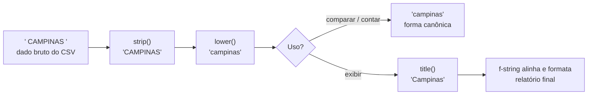

# 01.06 — Strings — parte 2: métodos e f-strings

> **Módulo 01 — Python Fundamental** · Nível: N1 · Tempo estimado: 2h30 · Código: `codigo/cap06/`

## 1. Objetivo

- **Aplicar** os métodos essenciais de string (`strip`, `lower`, `replace`, `split`, `join`, `startswith`, `find`) sabendo que todos **devolvem strings novas**.
- **Compor** a limpeza-padrão de dados sujos — o gesto que mata o espaço fantasma de uma vez.
- **Escrever** f-strings com formatação profissional: casas decimais, alinhamento e largura.
- **Avaliar** método certo vs. gambiarra de fatias — e refatorar a etiqueta do capítulo anterior medindo a diferença.

Ao final, a saída dos seus scripts deixa de parecer rascunho: relatórios alinhados, valores em reais formatados e dados limpos antes de qualquer contagem.

---

## 2. Pré-requisitos

- [01.05 — Strings — parte 1](05-strings-parte-1.md) — indexação, fatias e, principalmente, imutabilidade.

**Autoteste:** (1) `s[0] = "X"` — o que acontece? (2) `"2026" == "2026 "` — True ou False, e qual lupa revela a diferença? (3) A fatia `[4:8]` pega quantos caracteres? Se travou em qualquer uma, o 01.05 é pré-requisito duro deste capítulo.

---

## 3. Motivação

Sua etiqueta de expedição v0 funciona — e é um pequeno monumento ao esforço desnecessário. O primeiro nome do cliente está **preso a uma posição fixa** (cliente com nome mais longo quebra tudo); os centavos viraram reais por **cirurgia de fatias** (`str(total)[:3] + "," + str(total)[3:]` — que explode com totais de outra magnitude); o alinhamento foi feito **contando espaços no dedo**; e o espaço fantasma que você diagnosticou no 01.05 continua vivo, esperando a próxima contagem para duplicar produtos.

Agora multiplique pela realidade da Aurora: o CSV de vendas tem **milhares** de linhas onde cidade vem como `" campinas "`, `"CAMPINAS"` e `"Campinas"` — três grafias, um município, e qualquer relatório por cidade conta três vezes. Nome de produto com espaço duplo no meio. Valores como `"R$ 1.399,90"` que precisam virar centavos. Nada disso se resolve com elegância usando só índice e fatia — e é exatamente para isso que o tipo `str` vem de fábrica com dezenas de **métodos**: operações prontas, nomeadas e testadas por milhões de programadores.

Este capítulo resolve isso assim: apresenta os ~10 métodos que cobrem 90% do trabalho real com texto, o padrão de **limpeza de dados** que a engenharia usa como reflexo, e as **f-strings** — o formatador que transforma saída de rascunho em relatório. No fim, a etiqueta v0 vira v1, e você mede a diferença em linhas e em robustez.

---

## 4. Modelo mental

> 🧠 **Modelo mental**
> Métodos de string são **máquinas de uma fábrica que nunca altera o original**: você entrega sua string, a máquina **devolve uma nova** — limpa, cortada, trocada — e a matéria-prima volta intacta para a prateleira. Por isso o gesto profissional é sempre **guardar o resultado**: `cidade = cidade.strip()`. Chamar a máquina e ignorar o que ela devolve (`cidade.strip()` sozinho) é pagar o processamento e jogar o produto fora — o erro nº 1 do capítulo.

**Exercício de previsão.** Sem rodar, decida o que imprime:

```python
cidade = "  Campinas  "
cidade.strip()
print(cidade)
nome = cidade.strip().lower()
print(nome)
```

*Resposta comentado:* a primeira imprime `"  Campinas  "` **com espaços** — o `strip()` da linha 2 produziu uma string nova que ninguém guardou (a fábrica devolveu, você não pegou). A segunda imprime `campinas` — resultado guardado em `nome`, com duas máquinas em sequência (`strip` depois `lower`, o **encadeamento** que a seção 6 formaliza). Se você previu `Campinas` limpa na primeira, a imutabilidade do 01.05 ainda não virou reflexo — este capítulo é o treino.

---

## 5. Analogia

Os métodos são a **lavanderia industrial** da Aurora. Você entrega a peça (string) no balcão com uma ordem de serviço: só lavar (`strip`), tingir de minúsculo (`lower`), trocar botões (`replace`), desmontar nas costuras (`split`) ou costurar várias numa colcha (`join`). A lavanderia **nunca devolve a peça original modificada** — devolve uma nova, e a original continua no seu armário. Encadeamento é mandar a peça passar por várias máquinas em sequência, numa ordem que importa: lavar antes de tingir dá resultado diferente de tingir antes de lavar.

**Onde a analogia quebra:** lavanderia cobra por peça e demora; métodos custam nanossegundos e você os encadeia sem culpa. E há máquinas que a analogia não cobre: as de **medição** (`startswith`, `find`, `count`) não devolvem peça nenhuma — devolvem um laudo (True/False, um número), e guardar esse laudo importa tanto quanto guardar a peça.

---

## 6. Teoria

### As máquinas de transformação

Todas devolvem **string nova** (imutabilidade); nenhuma altera o original:

| Método | O que devolve | Exemplo → resultado |
|---|---|---|
| `strip()` | sem espaços/quebras nas pontas | `"  Campinas  ".strip()` → `"Campinas"` |
| `lower()` / `upper()` | tudo minúsculo / maiúsculo | `"CAMPINAS".lower()` → `"campinas"` |
| `title()` | Iniciais Maiúsculas | `"fone bluetooth".title()` → `"Fone Bluetooth"` |
| `replace(velho, novo)` | com **todas** as ocorrências trocadas | `"1.399,90".replace(".", "")` → `"1399,90"` |
| `zfill(n)` | preenchida com zeros à esquerda | `"123".zfill(5)` → `"00123"` |

`strip()` tira espaços das **duas pontas** (e só delas — espaços internos ficam); `lstrip`/`rstrip` existem para uma ponta só. `replace` troca **todas** as ocorrências — comportamento a lembrar quando só a primeira interessava.

### As máquinas de desmontar e montar

**`split(separador)`** desmonta a string numa **lista** de pedaços — sua primeira visão de uma lista de verdade:

```python
linha = "PED-2026-00123;Fone Bluetooth;46990;Campinas"
campos = linha.split(";")
print(campos)
# Saída: ['PED-2026-00123', 'Fone Bluetooth', '46990', 'Campinas']
print(campos[3])
# Saída: Campinas
```

> 📦 **Caixa-preta: a lista devolvida pelo `split`**
> O resultado entre colchetes é uma **lista** — a estrutura que o capítulo 01.12 abre por completo. Por enquanto, você só precisa de um gesto: acessar um pedaço por índice (`campos[3]`), exatamente como fazia com caracteres de string. `split` sem argumento (`"a  b c".split()`) divide por qualquer espaço em sequência — o desmancha-espaços-duplos de fábrica.

**`join`** é a operação inversa — costura pedaços com um separador: `";".join(campos)` remonta a linha. A sintaxe estranha (o separador vem primeiro) tem lógica: o método é **do separador**. E o motivo de ele existir — em vez de somar `+` num laço — é de performance real, medida no módulo 10; por ora, guarde o par: `split` desmonta, `join` remonta.

### As máquinas de medição (devolvem laudo, não peça)

| Método | Devolve | Exemplo |
|---|---|---|
| `startswith(x)` / `endswith(x)` | `True`/`False` | `codigo.startswith("PED")` → `True` |
| `find(x)` | índice da 1ª ocorrência, ou `-1` | `email.find("@")` → `8` |
| `count(x)` | quantas ocorrências | `"1.399,90".count(".")` → `1` |
| `isdigit()` | `True` se só há dígitos | `"46990".isdigit()` → `True` |

O `find` liberta suas máscaras do 01.05 da posição fixa: `email[:1] + "***" + email[email.find("@"):]` funciona para **qualquer** e-mail. E `in` — que tecnicamente é operador, não método — responde "contém?": `"@" in email` → `True` (o 01.08 o formaliza junto dos booleanos; use desde já para strings).

### O padrão de limpeza — o reflexo profissional

Dados externos passam pela alfândega **antes** de qualquer comparação ou contagem:

```python
cidade_limpa = cidade_suja.strip().lower()
```

Encadeamento: cada método roda sobre o resultado do anterior, da esquerda para a direita. `"  CAMPINAS  "` → strip → `"CAMPINAS"` → lower → `"campinas"`. Com isso, as três grafias da Motivação **colapsam numa só** — e a contagem por cidade volta a ser verdade. (Exibir bonito depois é outra etapa: `cidade_limpa.title()` na saída.)

### F-strings: a formatação que aposenta o artesanato

**F-string** (*formatted string literal*): um `f` antes das aspas liga o modo fórmula — chaves `{}` interpolam expressões, e um `:` dentro delas configura o formato:

```python
produto = "Fone Bluetooth"
total_centavos = 46_664
print(f"{produto}: R$ {total_centavos / 100:.2f}")
# Saída: Fone Bluetooth: R$ 466.64
```

Os especificadores que cobrem o dia a dia:

| Especificador | Efeito | Exemplo → saída |
|---|---|---|
| `:.2f` | float com 2 casas | `f"{466.6399:.2f}"` → `466.64` |
| `:>10` | alinha à direita em 10 colunas | `f"{'R$ 4,66':>10}"` → `"   R$ 4,66"` |
| `:<15` | alinha à esquerda em 15 | `f"{'Fone':<15}"` → `"Fone           "` |
| `:05d` | int com zeros à esquerda | `f"{123:05d}"` → `00123` |
| `:,.2f` | separador de milhar + 2 casas | `f"{1399.9:,.2f}"` → `1,399.90` |

Duas notas honestas: o separador de milhar da f-string é vírgula (padrão americano) — o formato brasileiro (`1.399,90`) se monta com um `replace` esperto por cima (o script da seção 9 mostra o truque) até a trilha apresentar a solução de localização madura. E repare no pacto com o 01.04: o dinheiro **vive** em centavos int; o `/100` com `:.2f` acontece **só na exibição** — a fronteira exata que aquele capítulo prometeu.

---

## 7. Funcionamento interno

Por dentro, na medida N1: quando você escreve `cidade.strip()`, o Python procura o método `strip` **no tipo do objeto** (`str`) e o executa passando o próprio objeto — é por isso que a sintaxe se lê "peça ao objeto que se descreva/transforme". Todos os métodos vivem no tipo, não na variável: qualquer string tem os mesmos ~45 métodos, e `dir("")` lista todos (espiada legítima). A f-string, por sua vez, não é mágica de impressão: ela é avaliada **na hora em que a linha executa** — as expressões dentro das chaves rodam como código normal e o resultado vira string ali mesmo (por isso `f"{total/100:.2f}"` pode fazer conta dentro). O mecanismo completo de "métodos pertencem a tipos" é a porta da orientação a objetos — módulo 04, onde você criará tipos com métodos seus.

---

## 8. Visualização do fluxo

A esteira de limpeza da Aurora — de célula suja a dado confiável e exibição digna:



**Como ler:** a esteira tem uma bifurcação deliberada — a **forma canônica** (minúscula, limpa) serve às comparações e contagens; a **forma de exibição** (title, alinhada) serve aos olhos. Misturá-las é o erro clássico: contar usando a bonita (e duplicar cidades por caixa) ou exibir a canônica (e entregar relatório em minúsculas). Duas formas, dois destinos, sempre.

---

## 9. Aplicação prática

A esteira completa sobre uma linha real do CSV da Aurora. Rode:

```bash
python 01-Python/codigo/cap06/esteira_de_limpeza.py
```

O script pega a linha suja `"  PED-2026-00123 ; fone bluetooth XZ-9  ;46990; CAMPINAS "` e mostra cada estação: `split(";")` desmonta nos 4 campos; cada campo passa por `strip()`; cidade e produto ganham forma canônica (`lower`) e de exibição (`title`); o valor `"46990"` é validado com `isdigit()` e convertido com `int()`; e a linha final sai formatada em f-string com alinhamento e o preço em reais — incluindo o truque do formato brasileiro:

```text
--- Desmontando e limpando ---
Campos crus: ['  PED-2026-00123 ', ' fone bluetooth XZ-9  ', '46990', ' CAMPINAS ']
Código: PED-2026-00123
Produto (canônico): fone bluetooth xz-9 | (exibição): Fone Bluetooth Xz-9
Valor validado: 46990 centavos
Cidade (canônica): campinas | (exibição): Campinas

--- Linha de relatório formatada ---
PED-2026-00123 | Fone Bluetooth Xz-9    | R$    469,90 | Campinas
```

Repare no detalhe honesto da saída: `title()` entregou `"Xz-9"` — iniciais maiúsculas *demais*. Formatação automática tem limites com códigos de modelo; o script comenta o dilema e a escolha (aceitar o Xz-9, documentando — decisão pequena, hábito grande).

> 🎯 **Checkpoint rápido**
> De cabeça: qual é a diferença entre o que `strip()` devolve e o que `startswith("PED")` devolve — e por que confundir os dois quebra um encadeamento?

---

## 10. Código comentado

Arquivo completo em [`codigo/cap06/esteira_de_limpeza.py`](codigo/cap06/esteira_de_limpeza.py).

```python
# ------------------------------------------------------------
# esteira_de_limpeza.py
# Capítulo 01.06 — Strings — parte 2: métodos e f-strings
# O que este arquivo demonstra: split + strip + formas canônica/exibição
#   + validação isdigit + f-strings com alinhamento e reais
# Como executar: python esteira_de_limpeza.py
# ------------------------------------------------------------

linha_suja = "  PED-2026-00123 ; fone bluetooth XZ-9  ;46990; CAMPINAS "

print("--- Desmontando e limpando ---")
campos = linha_suja.split(";")          # desmonta nos ; -> lista de 4 pedaços
print("Campos crus:", campos)

# Cada campo passa pela alfândega: strip nas pontas.
codigo = campos[0].strip()
produto_bruto = campos[1].strip()
valor_texto = campos[2].strip()
cidade_bruta = campos[3].strip()

print("Código:", codigo)

# Forma canônica (comparar/contar) e forma de exibição (olhos humanos):
produto_canonico = produto_bruto.lower()
produto_exibicao = produto_bruto.title()   # limite honesto: vira "Xz-9";
# aceitamos e documentamos — códigos de modelo não são nomes próprios.
print("Produto (canônico):", produto_canonico, "| (exibição):", produto_exibicao)

# Validação antes da conversão: só converte o que é 100% dígitos.
print("Valor validado:", int(valor_texto), "centavos")
# (se valor_texto tivesse lixo, isdigit() denunciaria: )
print("É só dígitos?", valor_texto.isdigit())

cidade_canonica = cidade_bruta.lower()
cidade_exibicao = cidade_bruta.title()
print("Cidade (canônica):", cidade_canonica, "| (exibição):", cidade_exibicao)

print()
print("--- Linha de relatório formatada ---")
valor_centavos = int(valor_texto)

# Reais no formato brasileiro: f-string gera "4,699.90" (padrão americano);
# o replace triplo troca . e , de lugar usando um marcador temporário.
reais_americano = f"{valor_centavos / 100:,.2f}"          # '469.90' ou '4,699.90'
reais_brasil = reais_americano.replace(",", "@").replace(".", ",").replace("@", ".")

print(f"{codigo} | {produto_exibicao:<22} | R$ {reais_brasil:>9} | {cidade_exibicao}")
# Saída: PED-2026-00123 | Fone Bluetooth Xz-9    | R$    469,90 | Campinas
```

---

## 11. Erros comuns

### Erro 1 — Chamar a máquina e jogar o produto fora

**Sintoma:** nenhum traceback — o espaço fantasma sobrevive: `cidade.strip()` numa linha própria, e três linhas depois a cidade continua suja na contagem.
**Causa:** métodos **devolvem** a string nova (imutabilidade); sem atribuição, o resultado se perde no ar.
**Correção:** guarde sempre: `cidade = cidade.strip()` (reamarra a etiqueta no objeto limpo). Releia código seu procurando métodos "soltos" em linha própria — é o cheiro deste bug.

### Erro 2 — Encadear um laudo como se fosse peça

**Sintoma:**

```text
Traceback (most recent call last):
  File "valida.py", line 3, in <module>
    ok = codigo.startswith("PED").strip()
AttributeError: 'bool' object has no attribute 'strip'
```

**Causa:** `startswith` devolve `True`/`False` (laudo, não peça) — e booleano não tem métodos de string. O encadeamento pressupõe que cada elo devolva string.
**Correção:** separe transformação de medição: primeiro limpe (`codigo = codigo.strip()`), depois meça (`ok = codigo.startswith("PED")`). A ordem certa quase sempre é: **limpar → medir → decidir**.

### Erro 3 — Converter sem validar (a alfândega furada)

**Sintoma:**

```text
Traceback (most recent call last):
  File "importa.py", line 4, in <module>
    valor = int(valor_texto)
ValueError: invalid literal for int() with base 10: 'R$ 46990'
```

**Causa:** o campo veio com lixo (`"R$ "`, espaço, vírgula) e o `int()` é rigoroso — converte dígitos puros ou explode.
**Correção:** alfândega completa antes da conversão: `valor_texto = valor_texto.strip().replace("R$", "").replace(".", "").strip()` e, na dúvida, o laudo `isdigit()` antes do `int()`. O tratamento do "e se ainda assim falhar" é o assunto de exceções (01.21) — por ora, limpar bem é a defesa.

> ⚠️ **Atenção**
> `isdigit()` responde False para `"46,90"` e para `"-5"` (vírgula e sinal não são dígitos) — o laudo é literal. Validar dinheiro de verdade exige limpar a vírgula antes, ou tratar a falha com exceções quando elas chegarem. Registre a limitação; não a "conserte" com gambiarra.

---

## 12. Boas práticas

✅ **Guarde todo resultado de método: `x = x.strip()`** — a linha que mais previne bug silencioso neste módulo.

✅ **Canônica para comparar, exibição para mostrar — e nunca as misture** — o relatório conta na minúscula-limpa e imprime no title; a bifurcação do diagrama é lei.

✅ **Limpe na entrada, uma vez, e confie dali em diante** — alfândega na borda do sistema (quando o dado chega) evita `strip()` defensivo espalhado por todo lugar.

✅ **F-strings para toda saída composta** — `f"{produto:<22} | R$ {valor:>9}"` é legível e alinhado; a era do `"texto " + str(x) + " texto"` terminou neste capítulo.

❌ **Evite `replace` para "apagar" sem conferir o alcance** — ele troca **todas** as ocorrências; `"2026".replace("0", "")` → `"226"`, e um replace afobado em código de pedido corrompe o dado.

❌ **Evite reimplementar método existente com fatias artesanais** — antes de cirurgia de índices, pergunte: "isso não tem máquina pronta?" (`dir("")` e a tabela deste capítulo respondem); fatia é para posição, método é para conteúdo.

---

## 13. Performance

Nesta escala, irrelevante — limpar e formatar uma linha custa microssegundos, e você saberá quando importar. Duas notas honestas plantando o módulo 10: **cada elo do encadeamento cria uma string intermediária** (`strip().lower()` = duas strings novas — tranquilo aos milhares, relevante aos milhões); e o **`join` existe** porque somar strings com `+` em série reconstrói o acumulado a cada soma (custo que cresce quadrático), enquanto `join` costura tudo de uma vez — a medição real, com cronômetro seu, está agendada para 10.10. Por ora: use `join` quando montar texto a partir de muitos pedaços, e siga em paz.

---

## 14. Mercado

> 🏢 **Mercado**
> O que este capítulo chama de esteira de limpeza, o mercado chama de **normalização de dados** — e ela é oficialmente a parte menos glamourosa e mais decisiva da engenharia de dados: pesquisas da área repetem há anos que a maior fatia do tempo de quem trabalha com dados vai para limpeza e preparação, não para análise. A forma canônica que você criou (strip + lower) é o embrião do que pipelines reais fazem em escala (módulo 10, com Pandas fazendo por coluna inteira o que você fez por valor); e a bifurcação canônica/exibição reaparece em todo sistema sério — do banco (que guarda canônico) à tela (que exibe formatado). F-strings, por sua vez, são o padrão de formatação do Python moderno em qualquer código de empresa — inclusive nos logs estruturados que o 04.19 apresentará.
>
> **Mini-cenário:** o relatório por cidade da Aurora — a dor original do módulo — morre exatamente aqui: `" CAMPINAS "`, `"campinas"` e `"Campinas"` colapsam na canônica `campinas`, a contagem bate com o estoque físico pela primeira vez, e a gestora pergunta "por que ninguém fez isso antes?". A resposta honesta — "porque limpar dados parece trabalho de menos e é trabalho de mais" — é uma lição de carreira.

---

## 15. Entrevistas

**P1. "Por que `minha_string.strip()` 'não funciona'? O júnior do time jura que chamou o método."**
*Resposta esperada:* strings são imutáveis — métodos devolvem nova, não alteram a original; sem `x = x.strip()`, o resultado se perde. Diagnóstico em segundos + a regra ("guarde o retorno") + o porquê (imutabilidade, 01.05) = resposta completa de mentor, que é o que a pergunta avalia.

**P2. "Como você normalizaria nomes de cidade vindos de fontes diferentes para um relatório?"**
*Resposta esperada:* forma canônica na entrada (`strip().lower()`, possivelmente colapsando espaços internos com `split()`+`join`), comparar/agrupar sempre na canônica, exibir com formatação própria (title) só na saída; mencionar acentos/variações (`"Sao Paulo"` vs. `"São Paulo"`) como o próximo nível do problema — reconhecer o limite vale ponto.

**P3. "O que são f-strings e por que substituíram `%` e `.format()`?"**
*Resposta esperada:* literais com interpolação avaliada em runtime (`f"{expr:formato}"`); vantagens: legibilidade (a expressão mora onde aparece), especificadores completos (`:.2f`, alinhamento, milhar) e menos erro de correspondência posicional. Saber que as formas antigas existem (e se leem em código legado) sem defendê-las = maturidade.

**Pegadinha clássica: "`'a,b,,c'.split(',')` e `'a b  c'.split()` — quantos pedaços cada um?"**
Ela derruba quem acha que os dois splits são o mesmo com separador diferente. A saída forte: **4 e 3**. Com separador explícito, `split` é literal — dois `,,` seguidos produzem o pedaço vazio `''` (`['a','b','','c']`); sem argumento, `split` opera em modo "qualquer espaço em sequência" e **descarta** vazios (`['a','b','c']`). Fechar com o uso: separador explícito para dados estruturados (CSV — onde o campo vazio é informação!), modo sem argumento para texto livre. Quem explica a diferença de contrato mostra que leu além do exemplo feliz.

---

## 16. Exercícios guiados

Enunciados completos em [`exercicios/cap06.md`](exercicios/cap06.md); gabaritos em [`exercicios/gabaritos/cap06.md`](exercicios/gabaritos/cap06.md).

### Aquecimento

- **A1** `[~10 min · previsão de métodos]` — 8 expressões com as máquinas do capítulo; preveja cada resultado.
- **A2** `[~5 min · peça ou laudo?]` — Classifique 8 métodos pelo que devolvem (string nova, bool, int, lista).
- **A3** `[~10 min · f-strings]` — Preveja a saída de 6 f-strings com especificadores; depois escreva 3 do zero para saídas dadas.
- **A4** `[~5 min · encadeamentos]` — 4 encadeamentos: quais funcionam, qual explode e por quê.

### Aplicação

- **AP1** `[~20 min · alfândega de valores]` — Converta `"R$ 1.399,90"`, `" 46990 "` e `"1399"` para centavos int, com validação e limpeza documentadas.
- **AP2** `[~20 min · normalizador de cidades]` — Dadas 8 grafias sujas de 3 cidades, produza formas canônicas, prove os colapsos com `==` e exiba a versão bonita.
- **AP3** `[~20 min · máscara universal de e-mail]` — Refaça a máscara do 01.05 usando `find("@")` — agora para qualquer e-mail; teste com 3 comprimentos diferentes.

---

## 17. Desafios

- **D1** `[~45 min · o formatador de tabela]` — **Relatório de 3 linhas.** Dadas 3 linhas sujas no formato da seção 9 (crie variações: espaços diferentes, caixa diferente, um valor com `"R$ "` grudado), produza um relatório tabular alinhado: cabeçalho, separador de `"-"`, e as 3 linhas com produto `:<22`, valor `:>10` em reais brasileiros e cidade `:<12`. Tudo com a esteira completa (limpar → validar → converter → formatar). Sem laços ainda — três blocos repetidos, e a promessa: o 01.11 refatora isto num `for` e você sente o alívio de novo.

<details><summary>💡 Dica 1 (conceito)</summary>
Monte a esteira para UMA linha primeiro, perfeita; as outras duas são cópia com dados diferentes.
</details>
<details><summary>💡 Dica 2 (estratégia)</summary>
O cabeçalho usa os MESMOS especificadores das linhas (`f"{'PRODUTO':<22} | {'VALOR':>10} | ..."`) — alinhamento de tabela é repetir o formato, não contar espaços.
</details>
<details><summary>💡 Dica 3 (esqueleto)</summary>
3 variáveis de linha suja → esteira ×3 → print cabeçalho → print separador ("-" * largura) → 3 prints de linha formatada.
</details>

---

## 18. Mini projeto

**Etiqueta de expedição v1 — a refatoração** `[~1h]` — a v0 reescrita com as ferramentas certas, e a medição da diferença.

Requisitos numerados:

1. Copie sua `etiqueta_expedicao.py` (01.05) para `codigo/cap06/etiqueta_expedicao_v1.py` e refatore: primeiro nome via `split()` (qualquer nome, qualquer tamanho — a limitação documentada morre); reais via f-string `:,.2f` + truque brasileiro (o artesanato de fatias morre); alinhamento via especificadores (a contagem de espaços morre).
2. Acrescente a alfândega: todos os campos de entrada passam por `strip()`; o nome do cliente colapsa espaços internos duplos (`split()` + `" ".join(...)`).
3. A moldura agora se adapta: largura da etiqueta numa variável única usada na repetição (`"=" * largura`) e nos alinhamentos.
4. No fim do arquivo, em comentário: a medição da refatoração — linhas da v0 vs. v1, e as 2 fragilidades da v0 que morreram (cite-as pelo nome).
5. Rode com os 2 pedidos do 01.05 **e** com um terceiro estressante (nome compridíssimo com espaços duplos, valor de outra magnitude) — cole as 3 saídas.

**Critério de "está bom":** v1 mais curta OU mais robusta que a v0 (idealmente ambas) com a medição honesta; o caso estressante sai alinhado; nenhum método com resultado jogado fora. Este é seu primeiro ciclo completo de **refatoração** — o gesto que o Atlas exigirá a cada módulo.

---

## 19. Revisão

**Resumo do capítulo:**

- Métodos devolvem **strings novas** (imutabilidade) — guarde sempre o retorno (`x = x.strip()`); resultado solto é a fonte nº 1 de "método que não funcionou".
- Transformadores do dia a dia: `strip`, `lower`/`upper`/`title`, `replace` (todas as ocorrências!), `zfill`; desmonte/montagem: `split` (→ lista) e `join` (separador primeiro).
- Medidores devolvem laudo (bool/int): `startswith`, `endswith`, `find` (−1 se ausente), `count`, `isdigit` — e `in` responde "contém?".
- O reflexo profissional: **limpar → medir → decidir**, com forma canônica (comparar/contar) separada da forma de exibição (mostrar).
- F-strings: `f"{expr:formato}"` — `:.2f`, `:>10`/`:<15`, `:05d`, `:,.2f`; dinheiro vive em centavos int e vira reais só na exibição (pacto com o 01.04).
- `split(sep)` é literal (preserva vazios — certo para CSV); `split()` sem argumento colapsa espaços (certo para texto livre).

**Flashcards novos** (adicionados a [`revisao/flashcards.md`](revisao/flashcards.md)):

| ID | Frente | Verso |
|---|---|---|
| 01.06-F1 | Preveja: `c = "  X  "` → `c.strip()` → `print(c)`. O que sai e por quê? | (Previsão) `"  X  "` sujo — o strip devolveu string nova que ninguém guardou. Regra: `c = c.strip()`. |
| 01.06-F2 | Explique com suas palavras: por que separar forma canônica de forma de exibição? | (Elaboração) Canônica (strip+lower) faz comparações/contagens baterem; exibição (title, alinhada) serve aos olhos. Misturar = cidades duplicadas ou relatório em minúsculas. |
| 01.06-F3 | Qual f-string exibe 466.64 a partir de `total = 46664` centavos — e por que a divisão mora só ali? | `f"R$ {total / 100:.2f}"` — o dinheiro vive em int (01.04); float aparece apenas na exibição formatada. |
| 01.06-F4 | `split(",")` vs. `split()`: qual preserva pedaços vazios e quando cada um é o certo? | (Decisão) Com separador: literal, preserva `''` (dados estruturados/CSV); sem argumento: colapsa espaços e descarta vazios (texto livre). |
| 01.06-F5 | `codigo.startswith("PED").strip()` explode com AttributeError. Diagnóstico? | `startswith` devolve bool (laudo, não peça); bool não tem métodos de string. Ordem certa: limpar → medir → decidir. |

**Agendamento:** registre no `PROGRESSO.md` e marque D+1, D+7, D+30, D+90 na [`Revisoes/agenda.md`](../Revisoes/agenda.md).

---

## 20. Checklist

Perguntas de domínio — teste do sim:

- [ ] Sei aplicar *os transformadores e medidores do capítulo sem consultar a tabela*?
- [ ] Sei explicar *por que todo método devolve string nova — e o bug do resultado jogado fora*?
- [ ] Sei compor *a esteira limpar → medir → decidir, com canônica separada de exibição*?
- [ ] Sei escrever *f-strings com `:.2f`, alinhamento e zeros — incluindo reais a partir de centavos*?
- [ ] Sei responder *à pegadinha dos dois splits com a diferença de contrato*?

Itens práticos:

- [ ] Rodei `esteira_de_limpeza.py` e entendi o dilema do `title()` no Xz-9.
- [ ] Acertei (ou entendi por que errei) a previsão da seção 4 e o checkpoint da seção 9.
- [ ] Fiz Aquecimento e Aplicação; tentei o Desafio 15+ min antes das dicas.
- [ ] Refatorei a etiqueta para v1 com a medição comentada (5 requisitos).
- [ ] Registrei a sessão e agendei as 4 revisões.

---

## 21. Próximo capítulo

Tudo que seus scripts processaram até aqui estava **escrito no próprio código** — pedidos, cidades e valores definidos em variáveis por você. Ficou deliberadamente em aberto a porta de entrada mais direta de todas: **perguntar ao usuário**. O próximo capítulo apresenta o `input()` — e com ele a armadilha que derruba todo iniciante na primeira semana (`input` entrega **texto**, sempre, e `"2" + 2` explode), o par de conversões que a resolve e o primeiro utilitário interativo da Aurora: o balcão de consulta que o time de vendas vai (ficcionalmente) usar. É também o capítulo em que a caixa-preta mais antiga da trilha — o `print` do 01.01 — finalmente é aberta por completo.

→ [01.07 — Entrada e saída](07-entrada-e-saida.md)

---

*Gerado sob spec 3.0.0*
