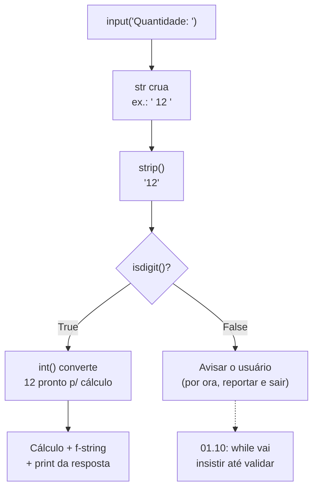

# 01.07 — Entrada e saída

> **Módulo 01 — Python Fundamental** · Nível: N1 · Tempo estimado: 2h · Código: `codigo/cap07/`

## 1. Objetivo

- **Implementar** programas interativos com `input()` — e internalizar que ele devolve **string, sempre**.
- **Aplicar** o par validar-converter (`isdigit` + `int`/`float`) em toda entrada numérica.
- **Padronizar** saídas com o `print` completo (`sep`, `end`) — pagando a caixa-preta aberta desde o 01.01.
- **Construir** o primeiro utilitário interativo da Aurora: o balcão de consulta de parcelamento.

Ao final, seus programas deixam de ser roteiros fixos e passam a **conversar** — com o time de vendas, com o estagiário, com você.

---

## 2. Pré-requisitos

- [01.04 — Números e operadores](04-numeros-e-operadores.md) — conversões e centavos.
- [01.06 — Strings — parte 2](06-strings-parte-2-metodos-e-f-strings.md) — a esteira de limpeza e f-strings.

**Autoteste:** (1) `int("R$ 50")` — o que acontece? (2) Qual método dá o laudo "só dígitos"? (3) `f"{139990 / 100:.2f}"` produz o quê? Se travou, 01.04 (conversões) e 01.06 (alfândega) são a revisão dirigida.

---

## 3. Motivação

Sua etiqueta v1 está digna — mas para gerar a de **outro** pedido, o processo é: abrir o VS Code, editar as variáveis, salvar, rodar. Funciona para você; é inviável para o time de vendas da Aurora, que precisa consultar "quanto fica 1.399,90 em 3×?" vinte vezes por dia — e não vai (nem deve) editar código-fonte para isso.

A peça que falta é a mais antiga da computação interativa: **perguntar**. E com ela chega, pontualíssima, a armadilha que derruba praticamente todo iniciante na primeira semana de `input`: o usuário digita `3`, o programa soma `3 + 2`... e explode com um `TypeError` que parece absurdo — *"não era um número?!"*. Não era. `input()` devolve **texto**, sempre, mesmo quando o texto se parece com número — e `"3"` é tão somável com `2` quanto `"banana"`.

Você está mais preparado para isso do que imagina: o 01.03 te ensinou que o tipo vive no objeto (`type()` é a lupa), o 01.04 te deu as conversões, e o 01.06 te deu a alfândega completa (strip, isdigit). O que este capítulo faz é conectar as peças na fronteira certa — a **borda** do programa, onde o mundo externo entra.

Este capítulo resolve isso assim: apresenta o `input` com sua regra de ferro, o padrão perguntar → limpar → validar → converter que você aplicará em toda borda do sistema (e que reaparecerá idêntico em formulários de API no módulo 06), o `print` completo — e fecha com o balcão de consulta da Aurora rodando de verdade.

---

## 4. Modelo mental

> 🧠 **Modelo mental**
> `input()` é a **recepcionista do programa**: ela anota **por escrito** tudo o que o visitante disser — um número, um nome, um xingamento — e entrega o papelzinho (uma string) para você. A recepcionista **não interpreta**: `"3"`, `" 3 "` e `"três"` são três papelzinhos diferentes, nenhum deles é o número 3. Interpretar o papelzinho — limpar, validar, converter — é trabalho seu, e acontece **na recepção**, antes de o dado entrar no prédio.

**Exercício de previsão.** O usuário digita `5` quando o programa roda. Sem executar, decida o que acontece:

```python
quantidade = input("Quantas caixas? ")
total = quantidade * 3
print(total)
```

*Resposta comentada:* imprime `555`. Nenhum erro! `quantidade` é a **string** `"5"`, e `*` entre string e int é a *repetição* do 01.05 (`"5" * 3` → `"555"`). Este é o pior cenário da armadilha: quando ela **não explode** — o programa roda, entrega um resultado absurdo com cara de resultado, e segue em frente. (Se fosse `quantidade + 3`, aí sim: `TypeError`.) A recepcionista entregou um papelzinho; você multiplicou o papelzinho.

---

## 5. Analogia

Entrada e saída são o **balcão de atendimento** da Aurora. O `print` é o atendente falando com o cliente: escolhe as palavras (f-strings), o tom e até a pontuação da fala (`sep`, `end`). O `input` é o atendente ouvindo — e anotando **literalmente** o que foi dito, num formulário que aceita qualquer rabisco. Entre o formulário rabiscado e o sistema de pedidos existe (ou deveria existir) a etapa que separa balcões amadores de profissionais: conferir o formulário — está legível? é um número onde devia ser número? — **antes** de lançar no sistema.

**Onde a analogia quebra:** um atendente humano interpreta contexto ("três" e "3" são o mesmo pedido) e pede esclarecimento sozinho. O `input` não interpreta nada e não repergunta nada — toda a inteligência da recepção é código seu. Por ora, sem laços, seu programa confere e **avisa**; a partir do 01.10 (`while`), ele vai insistir até receber algo válido, como um atendente de verdade.

---

## 6. Teoria

### `input(pergunta)` — o contrato completo

`input` exibe a pergunta, **pausa o programa** até o usuário teclar Enter, e devolve o que foi digitado como `str` — sem o Enter final, mas **com** qualquer espaço que o usuário tenha deixado. O contrato em três cláusulas:

1. **Devolve `str`, sempre.** `type(input(...))` é `str` para qualquer digitação — `"3"`, `""` (Enter direto), `"  sim  "`.
2. **A pergunta é argumento, não print.** `input("Cidade: ")` já exibe o texto — repare no espaço final da pergunta, o detalhe de acabamento que separa `Cidade:Campinas` de `Cidade: Campinas`.
3. **O programa fica refém do Enter.** Nada executa até o usuário responder — comportamento novo: seus scripts até aqui rodavam do início ao fim sem parar.

### O padrão da borda: perguntar → limpar → validar → converter

Toda entrada que alimenta cálculo passa pela esteira completa — as peças você já tem, a montagem é o capítulo:

```python
resposta = input("Quantidade de itens: ")     # 1. perguntar  -> str
resposta = resposta.strip()                    # 2. limpar     -> str limpa
print("Entrada válida?", resposta.isdigit())   # 3. validar    -> laudo
quantidade = int(resposta)                     # 4. converter  -> int, enfim
```

Sem o passo 3, o passo 4 explode com lixo (`ValueError`, seção 11). Sem laços ainda, o programa valida e **reporta** (imprime o laudo e segue no caminho feliz, ou avisa e termina); a versão que insiste até receber dado válido é a primeira aplicação do `while` no 01.10 — promessa registrada.

Para decimais, `float(resposta)` — lembrando do 01.04: se é dinheiro, o destino final são **centavos int** (`int(float(resposta) * 100)` ou, mais seguro com a alfândega do 01.06, tratar o texto direto). E o ponto/vírgula brasileiro: `float("1399,90")` explode — a vírgula vira ponto na limpeza (`replace(",", ".")`) antes da conversão.

### `print` — a caixa-preta finalmente aberta

Desde o 01.01 você usa `print` como caixa-preta; promessa paga agora. O contrato completo: `print(*valores, sep=" ", end="\n")` — imprime os valores separados por `sep` e fecha com `end`:

| Chamada | Saída | O que mudou |
|---|---|---|
| `print("a", "b", "c")` | `a b c` | `sep` padrão: um espaço |
| `print("a", "b", sep=" \| ")` | `a \| b` | separador customizado |
| `print("Processando", end="... ")` | `Processando... ` (sem quebrar linha) | `end` trocado — o próximo print continua na mesma linha |
| `print()` | (linha em branco) | zero valores, só o `end` |

O `\n` é o caractere de **quebra de linha** (*newline*) — a primeira sequência de escape oficial da trilha (você já viu o `\'` no 01.05). `sep` e `end` são **argumentos nomeados** (*keyword arguments*) — a sintaxe `nome=valor` na chamada, que o capítulo de funções (01.18) generaliza. E uma fronteira de responsabilidade que organiza tudo: com f-strings (01.06), **monte a linha na f-string e deixe o `print` só exibir** — `sep` e `end` brilham nos casos rápidos (listas de valores, progresso na mesma linha), não em relatórios.

### A dupla completa da conversa

Programas interativos são ciclos de `print` (falar) e `input` (ouvir) — e a experiência do usuário mora nos detalhes: perguntas com espaço final, confirmações que repetem o que foi entendido (`f"Entendi: {quantidade} itens."` — eco que evita surpresa), e saídas formatadas como no 01.06. O balcão da seção 9 monta a conversa inteira.

---

## 7. Funcionamento interno

Por dentro, na medida N1: `input` e `print` conversam com os **fluxos padrão** (*standard streams*) do processo — todo programa nasce com um canal de entrada (*stdin*, o teclado por padrão) e dois de saída (*stdout* para resultados, *stderr* para erros — é por stderr que os tracebacks chegam, por isso algumas telas os pintam de vermelho). O terminal conecta seu teclado ao stdin e sua tela aos dois outros. A consequência prática que você verá no módulo 02: esses canais são **redirecionáveis** — `python relatorio.py > saida.txt` manda o stdout para um arquivo sem mudar uma linha do código, e o `|` (pipe) liga o stdout de um programa ao stdin de outro. Seu `print` de hoje já está, sem saber, escrevendo numa esteira que o shell pode replugar — o 02.04 brinca de encanador com ela.

---

## 8. Visualização do fluxo

A esteira da borda — todo dado externo passa por aqui antes de virar cálculo:



**Como ler:** o losango é a alfândega — nada cruza para o lado do cálculo sem laudo. O caminho da direita hoje termina em aviso (sem laços, o programa não insiste); a seta pontilhada é a promessa concreta do 01.10. Compare com o diagrama do 01.06: é a mesma esteira de limpeza, agora com o `input` na cabeceira — a borda mudou, o reflexo é o mesmo.

---

## 9. Aplicação prática

O balcão de consulta da Aurora — o programa que o time de vendas usaria. Rode e **converse** com ele:

```bash
python 01-Python/codigo/cap07/balcao_parcelamento.py
```

```text
=== Balcão Aurora — consulta de parcelamento ===
Valor do produto (ex.: 1399,90): R$ 1.399,90
Número de parcelas (2 a 12): 3

Entendi: R$ 1.399,90 em 3x.
--------------------------------
Parcela 1:  R$ 466,64
Parcelas 2 a 3:  R$ 466,63
Total conferido: R$ 1.399,90
================================
```

Experimente quebrá-lo de propósito (é treino, não vandalismo): digite `abc` no valor, ou `1.399,90` sem o `R$`, ou deixe vazio. Observe **qual** defesa segurou cada caso — a limpeza (aceitou o formato), o laudo (barrou com aviso) — e qual caso ainda derruba o programa (há um; o capítulo 01.21 o resolve com exceções, e o script o documenta em comentário com honestidade).

Repare também nos detalhes de balcão: o **eco** ("Entendi: ...") antes de calcular — a confirmação que todo caixa eletrônico faz; e o parcelamento por trás é **literalmente o seu** `parcelador.py` do 01.04 (centavos, sobra na primeira, prova dos nove) — agora com porta para o mundo.

> 💡 **Dica**
> Ao testar programas interativos, tenha um roteiro de entradas anotado (feliz, sujo, vazio, absurdo) e rode-o **todo** a cada mudança — testar só o caminho feliz é a ilusão de fluência dos programas. O módulo 12 automatiza esse roteiro; o hábito começa manual, aqui.

---

## 10. Código comentado

Arquivo completo em [`codigo/cap07/balcao_parcelamento.py`](codigo/cap07/balcao_parcelamento.py).

```python
# ------------------------------------------------------------
# balcao_parcelamento.py
# Capítulo 01.07 — Entrada e saída
# O que este arquivo demonstra: input + esteira da borda (limpar,
#   validar, converter) + parcelamento em centavos + saída formatada
# Como executar: python balcao_parcelamento.py
# ------------------------------------------------------------

print("=== Balcão Aurora — consulta de parcelamento ===")

# --- Entrada 1: o valor (aceita "R$ 1.399,90", "1399,90", "1399") ---
valor_texto = input("Valor do produto (ex.: 1399,90): ")

# Alfândega do 01.06: tirar R$, espaços e o ponto de milhar; vírgula vira ponto.
valor_texto = valor_texto.strip().replace("R$", "").strip()
valor_texto = valor_texto.replace(".", "").replace(",", ".")

# Laudo antes da conversão: float aceita 1 ponto — validamos removendo-o.
# (Defesa honesta e limitada: "12.3.4" ainda derrubaria o float; o caso
#  está documentado e espera as exceções do 01.21.)
eh_numero = valor_texto.replace(".", "", 1).isdigit()
print("Valor reconhecido?", eh_numero)

valor_centavos = int(float(valor_texto) * 100)   # p/ a régua EXATA (01.04)

# --- Entrada 2: as parcelas (int puro, laudo direto) ---
parcelas_texto = input("Número de parcelas (2 a 12): ").strip()
print("Parcelas reconhecidas?", parcelas_texto.isdigit())
parcelas = int(parcelas_texto)

# --- Eco: confirmar o que foi entendido ANTES de responder ---
reais_eco = f"{valor_centavos / 100:,.2f}"
reais_eco = reais_eco.replace(",", "@").replace(".", ",").replace("@", ".")
print()
print(f"Entendi: R$ {reais_eco} em {parcelas}x.")
print("-" * 32)

# --- O parcelador do 01.04, intacto: centavos, sobra na primeira ---
parcela_base = valor_centavos // parcelas
sobra = valor_centavos % parcelas
parcela_1 = parcela_base + sobra

reais_parcela_1 = f"{parcela_1 / 100:,.2f}".replace(",", "@").replace(".", ",").replace("@", ".")
reais_parcela_n = f"{parcela_base / 100:,.2f}".replace(",", "@").replace(".", ",").replace("@", ".")

print(f"Parcela 1:  R$ {reais_parcela_1}")
print(f"Parcelas 2 a {parcelas}:  R$ {reais_parcela_n}")

# Prova dos nove exibida — o balcão confere na frente do cliente.
total_prova = parcela_1 + parcela_base * (parcelas - 1)
reais_prova = f"{total_prova / 100:,.2f}".replace(",", "@").replace(".", ",").replace("@", ".")
print(f"Total conferido: R$ {reais_prova}")
print("=" * 32)

# Saída: (a conversa completa mostrada na seção 9 do capítulo)
```

---

## 11. Erros comuns

### Erro 1 — Aritmética com o papelzinho (o TypeError da primeira semana)

**Sintoma:**

```text
Traceback (most recent call last):
  File "soma.py", line 2, in <module>
    total = quantidade + 2
TypeError: can only concatenate str (not "int") to str
```

— ou, mais traiçoeiro, **nenhum erro**: `"5" * 3` → `"555"` (a previsão da seção 4).
**Causa:** `input` devolve `str` sempre; `+` entre strings concatena e `*` repete — a linguagem fez exatamente o que os tipos pediram.
**Correção:** conversão na borda, imediatamente após validar: `quantidade = int(resposta)`. E a lupa do 01.03 continua valendo: na dúvida sobre qualquer variável, `print(type(x))` resolve a discussão em um segundo.

### Erro 2 — Converter sem alfândega

**Sintoma:**

```text
Traceback (most recent call last):
  File "balcao.py", line 3, in <module>
    valor = float(valor_texto)
ValueError: could not convert string to float: '1.399,90'
```

**Causa:** o usuário digitou no formato brasileiro (ponto de milhar, vírgula decimal) — legítimo do lado dele; o `float` só aceita o formato com ponto decimal.
**Correção:** a esteira do 01.06 antes de converter: remover milhar, trocar vírgula por ponto, `strip` nas pontas. Regra de balcão: **o programa se adapta ao usuário, não o contrário** — pedir "digite no formato americano" é atestado de preguiça.

### Erro 3 — A pergunta que engole a resposta

**Sintoma:** nenhum traceback — só uma experiência ruim: o terminal mostra `Cidade:Campinas` grudado, ou a pergunta aparece **depois** de o usuário já ter digitado às cegas porque o programador imprimiu a pergunta com `print` e chamou `input()` vazio em seguida... e o layout embaralha.
**Causa:** descuido com a divisão de trabalho — a pergunta é argumento do `input`, com espaço final; `print` separado para perguntar cria duas fontes de verdade para uma fala só.
**Correção:** `input("Cidade: ")` — pergunta e pausa no mesmo lugar, espaço final incluso. O `print` entra **antes** (contexto, cabeçalhos) e **depois** (eco, resposta), nunca como a própria pergunta.

> ⚠️ **Atenção**
> O eco ("Entendi: R$ 1.399,90 em 3x") não é enfeite: é a defesa contra o erro **do usuário** — que digitou 13999,0 querendo 1.399,90 e só percebe se o programa repetir o que entendeu. Programas de borda profissionais confirmam antes de agir; os do módulo 06 (APIs) devolverão o "eco" como resposta estruturada, pelo mesmíssimo motivo.

---

## 12. Boas práticas

✅ **Converta na borda, imediatamente — nunca carregue o papelzinho para dentro** — `quantidade = int(...)` na linha da recepção; o resto do programa só vê tipos certos.

✅ **Eco antes do cálculo: repita o que entendeu** — uma linha de f-string que evita a pior classe de erro, a do dado válido-porém-errado.

✅ **Perguntas com unidade e exemplo: `"Valor do produto (ex.: 1399,90): "`** — o formato esperado na própria pergunta reduz pela metade as entradas sujas.

✅ **Roteiro de teste anotado: feliz, sujo, vazio, absurdo** — e rode-o inteiro a cada mudança; o caminho feliz sozinho é autoengano.

❌ **Evite `int(input(...))` numa linha só** — a fusão pula a limpeza e a validação, e quando explodir, o traceback não dirá qual das duas etapas faltou; borda se escreve em passos.

❌ **Evite `print` para fazer a pergunta do `input`** — duas fontes de verdade para uma fala; a pergunta é argumento (Erro 3).

---

## 13. Performance

Nesta escala, irrelevante — e com um motivo novo, digno de nota: em programas interativos, o gargalo é **o humano**. O programa gasta microssegundos calculando e segundos (eternidades, na escala da máquina) parado no `input`, esperando dedos digitarem. É a primeira vez que a trilha encontra o padrão "programa que espera" — e ele volta transformado no módulo 04 (asyncio: o que fazer enquanto se espera) e no módulo 06 (APIs passam a vida esperando rede e banco). Por ora, a lição de calibragem: otimizar cálculo em programa interativo é polir a maçaneta de uma porta que fica aberta.

---

## 14. Mercado

> 🏢 **Mercado**
> O padrão deste capítulo — **validar na borda, converter cedo, ecoar o que entendeu** — é possivelmente o conhecimento mais transferível do módulo inteiro: é a mesma disciplina dos formulários web, dos comandos de terminal profissionais (CLIs — que o Atlas ganha no módulo 04, com a biblioteca `argparse` fazendo o papel da recepcionista) e, principalmente, das **APIs**: no módulo 06, o Pydantic será exatamente esta esteira — perguntar (receber o JSON), validar (tipos e formatos), converter (para objetos), ecoar (a resposta 422 com os erros ou o eco do recurso criado). Entrevistadores adoram o tema disfarçado: "o que seu endpoint faz com dados inválidos?" é a pergunta deste capítulo de terno.
>
> **Mini-cenário:** o balcão de parcelamento é o primeiro programa da trilha que outra pessoa da Aurora *usaria de verdade* — e é assim que ferramentas internas nascem nas empresas: um script de borda bem-feito que alguém do time comercial adota, depois pede "dava para puxar direto do catálogo?" (módulo 03, banco), depois "dava para ser uma tela?" (módulo 06, API). A carreira de muita ferramenta corporativa começou num `input` bem validado.

---

## 15. Entrevistas

**P1. "O que `input()` devolve — e quais as consequências disso?"**
*Resposta esperada:* `str`, sempre, mesmo para digitações numéricas; consequências: aritmética com o retorno cru é bug (às vezes silencioso — `"5" * 3`), toda entrada numérica exige conversão explícita, e a validação vem antes da conversão. Citar o caso silencioso da repetição separa quem viveu de quem leu.

**P2. "Como você trata entrada numérica do usuário de forma robusta?"**
*Resposta esperada:* a esteira nomeada: limpar (`strip`, formato local — vírgula/milhar), validar (laudo antes de converter), converter cedo (borda), ecoar o entendido; mencionar que sem estrutura de repetição valida-se e reporta-se, e com `while`/exceções o programa insiste — mostrar consciência das ferramentas por etapa da formação é ponto extra, não fraqueza.

**P3. "Para que servem `sep` e `end` no print? Exemplo real de cada."**
*Resposta esperada:* `sep` troca o separador entre os valores (`print(a, b, sep=" | ")` para saída tabular rápida); `end` troca a quebra final (`end=""`/`end="\r"` para progresso na mesma linha). E o critério de maturidade: com f-strings, a linha se monta na string e o print só exibe — `sep`/`end` são conveniência de casos curtos, não arquitetura de saída.

**Pegadinha clássica: "O usuário digitou `007` e seu `int()` devolveu 7. O gerente reclama que 'sumiu o código do agente'. Quem está certo?"**
Ela derruba quem responde só "int tira zeros à esquerda". A saída forte separa **número de código**: `int("007")` → `7` está correto — números não têm zeros à esquerda; mas se o dado era um *código* (CEP, matrícula, número de pedido `00123`), ele nunca deveria ter virado int: códigos são **strings que parecem números** — não se somam, têm zeros significativos, têm formato. O critério que fecha: "converte-se o que se calcula; o que se identifica, permanece string" (e o `zfill` do 01.06 restaura a dignidade dos que foram convertidos por engano).

---

## 16. Exercícios guiados

Enunciados completos em [`exercicios/cap07.md`](exercicios/cap07.md); gabaritos em [`exercicios/gabaritos/cap07.md`](exercicios/gabaritos/cap07.md).

### Aquecimento

- **A1** `[~10 min · o papelzinho]` — 5 trechos com `input` simulado: preveja saída, erro ou resultado silencioso-errado.
- **A2** `[~5 min · sep e end]` — Preveja a saída exata de 4 prints com `sep`/`end` encadeados.
- **A3** `[~5 min · número ou código?]` — Para 6 dados (CEP, quantidade, CPF, preço, nº do pedido, idade), decida: converte ou fica string?
- **A4** `[~10 min · a esteira em ordem]` — Ordene as etapas embaralhadas de 2 bordas (valor monetário, quantidade) e aponte o que quebra fora de ordem.

### Aplicação

- **AP1** `[~20 min · balcão de frete]` — Versão interativa da calculadora de frete (01.04): pergunta itens e capacidade, valida, ecoa, responde formatado.
- **AP2** `[~20 min · cadastro expresso]` — Pergunte nome, cidade e e-mail; aplique a alfândega do 01.06 em cada um (canônica + exibição), ecoe a ficha formatada com a máscara de e-mail do capítulo anterior.
- **AP3** `[~15 min · quebre o balcão]` — Roteiro de sabotagem sobre o `balcao_parcelamento.py`: 5 entradas hostis, o registro do que segurou cada uma, e a identificação do caso que ainda derruba (com o porquê).

---

## 17. Desafios

- **D1** `[~45 min · o balcão completo]` — **Balcão de pedido da Aurora v0.** Junte tudo: pergunte produto, valor unitário (formato brasileiro aceito), quantidade e número de parcelas; valide cada entrada com laudo impresso; ecoe o pedido entendido; calcule subtotal, frete (regra do 01.04: R$ 12,50 por caixa de 6) e total parcelado (sobra na primeira); imprima o **recibo formatado** com moldura, alinhamento e reais brasileiros — digno de impressora térmica. Tudo com as ferramentas dos capítulos 01.04–01.07, nada além.

<details><summary>💡 Dica 1 (conceito)</summary>
Você já construiu cada peça: alfândega (01.06/AP1), frete (01.04/AP1), parcelador (01.04/AP2), recibo (01.06/D1). O desafio é a MONTAGEM — começe listando as peças e a ordem.
</details>
<details><summary>💡 Dica 2 (estratégia)</summary>
Borda primeiro, completa (4 inputs validados + eco), depois cálculo, depois saída. Teste cada bloco antes de emendar o próximo.
</details>
<details><summary>💡 Dica 3 (esqueleto)</summary>
cabeçalho → 4 × (input → limpar → laudo → converter) → eco do pedido → subtotal/frete/parcelas em centavos → prova dos nove → recibo com moldura e alinhamentos.
</details>

---

## 18. Mini projeto

**Suíte de balcões da Aurora** `[~1h]` — três utilitários interativos, um roteiro de testes, um padrão.

Requisitos numerados:

1. Em `codigo/cap07/`, finalize os três balcões: `balcao_frete.py` (AP1), `balcao_cadastro.py` (AP2) e `balcao_pedido.py` (D1 — pode ser a própria entrega do desafio, promovida).
2. Os três seguem o mesmo padrão visual (cabeçalho `"=" * n`, eco, resposta formatada) — padronize as larguras e molduras entre eles (variável no topo de cada arquivo).
3. Crie `roteiro_de_testes.md` na pasta: para cada balcão, a tabela de entradas (feliz / sujo / vazio / absurdo) com o comportamento observado em cada uma — inclusive os casos que ainda derrubam (coluna "pendência", com o capítulo que a resolverá: 01.10 para insistência, 01.21 para exceções).
4. Rode o roteiro completo nos três balcões e registre a data da rodada no próprio arquivo.

**Critério de "está bom":** os três balcões conversam com o mesmo sotaque (moldura, eco, formato); o roteiro tem ≥ 4 entradas por balcão com observações honestas; as pendências estão nomeadas com endereço, não escondidas. Este roteiro é o ancestral manual da suíte de testes do módulo 12 — guarde-o.

---

## 19. Revisão

**Resumo do capítulo:**

- `input(pergunta)` pausa, exibe a pergunta (com espaço final!) e devolve **`str` sempre** — inclusive `""` no Enter direto; a pergunta é argumento, não print.
- A armadilha tem duas caras: `TypeError` na soma (barulhenta) e `"5" * 3 = "555"` (silenciosa — a pior).
- A esteira da borda: perguntar → limpar (strip, formato BR) → validar (laudo `isdigit`) → converter (`int`/`float`, cedo) → ecoar o entendido; sem laços, valida-se e reporta; o `while` (01.10) trará a insistência.
- Números se convertem; **códigos** (CEP, pedido, CPF) permanecem strings — zeros à esquerda são significativos.
- `print(*valores, sep=" ", end="\n")` — caixa-preta do 01.01 paga; com f-strings, a linha se monta na string e o print exibe.
- Por dentro: stdin/stdout/stderr — os canais que o shell redireciona (`>`, `|`) no módulo 02.

**Flashcards novos** (adicionados a [`revisao/flashcards.md`](revisao/flashcards.md)):

| ID | Frente | Verso |
|---|---|---|
| 01.07-F1 | Preveja: usuário digita 5 em `q = input(...)`; depois `print(q * 3)`. | (Previsão) `555` — sem erro: `q` é a string `"5"` e `*` repete. A cara silenciosa da armadilha do input. |
| 01.07-F2 | Explique com suas palavras: por que a conversão deve acontecer "na borda"? | (Elaboração) O papelzinho (str) não pode circular pelo programa: converte-se logo após validar, e o resto do código só vê tipos certos — um único ponto de defesa. |
| 01.07-F3 | Quais são as 5 etapas da esteira da borda, na ordem? | Perguntar → limpar (strip/formato) → validar (laudo) → converter (int/float) → ecoar o entendido. |
| 01.07-F4 | CEP "01310" e quantidade "12": qual converte para int e por quê? | (Decisão) Só a quantidade — se calcula. CEP é código: string que parece número, com zero à esquerda significativo. |
| 01.07-F5 | O que fazem `sep` e `end` no print — e qual o critério de maturidade para usá-los? | `sep` separa os valores; `end` troca o `\n` final. Com f-strings, a linha se monta na string; sep/end ficam para casos rápidos (progresso, listas). |

**Agendamento:** registre no `PROGRESSO.md` e marque D+1, D+7, D+30, D+90 na [`Revisoes/agenda.md`](../Revisoes/agenda.md).

---

## 20. Checklist

Perguntas de domínio — teste do sim:

- [ ] Sei explicar *o contrato do input (str sempre, pergunta como argumento, pausa)*?
- [ ] Sei prever *as duas caras da armadilha (TypeError × resultado silencioso)*?
- [ ] Sei implementar *a esteira da borda completa, com laudo antes da conversão e eco depois*?
- [ ] Sei decidir *número vs. código para qualquer dado de entrada*?
- [ ] Sei responder *à pegadinha do "007" com o critério converte-se-o-que-se-calcula*?

Itens práticos:

- [ ] Rodei o `balcao_parcelamento.py`, executei a sabotagem e identifiquei o caso pendente.
- [ ] Acertei (ou entendi por que errei) a previsão da seção 4.
- [ ] Fiz Aquecimento e Aplicação; tentei o Desafio 15+ min antes das dicas.
- [ ] Montei a suíte de balcões com o roteiro de testes datado (4 requisitos).
- [ ] Registrei a sessão e agendei as 4 revisões.

---

## 21. Próximo capítulo

Seu balcão valida com laudos — `print("Entrada válida?", eh_numero)` — mas ainda não **decide** nada com eles: imprime True/False e segue em frente, torcendo. Ficou deliberadamente em aberto o próprio material das decisões: o que exatamente são `True` e `False`, como as comparações os produzem, o que `and`/`or`/`not` fazem com eles — e as duas sutilezas que rendem pegadinha de entrevista: por que `0`, `""` e listas vazias são "falsos honorários" (*truthiness*), e por que `int(resto > 0)` funcionava lá no 01.04. O próximo capítulo fecha a fundação lógica; no seguinte (01.09), os laudos finalmente puxam gatilhos.

→ [01.08 — Booleanos, comparações e truthiness](08-booleanos-comparacoes-e-truthiness.md)

---

*Gerado sob spec 3.0.0*
