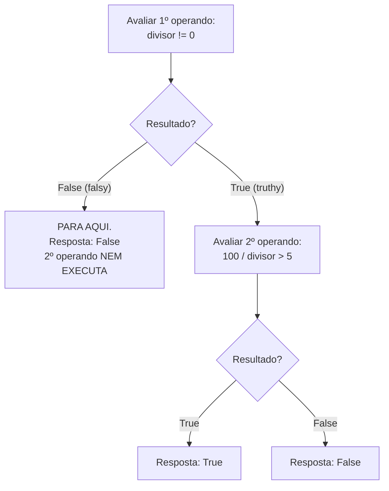

# 01.08 — Booleanos, comparações e truthiness

> **Módulo 01 — Python Fundamental** · Nível: N1 · Tempo estimado: 2h30 · Código: `codigo/cap08/`

## 1. Objetivo

- **Prever** o resultado de expressões com `== != < > <= >=`, `and`/`or`/`not` e comparações encadeadas.
- **Explicar** truthiness: a lista dos valores "falsy" e por que `if lista:` funcionará sem comparação nenhuma.
- **Diferenciar** `==` de `is` em definitivo — pagando a caixa-preta do 01.03 — e **aplicar** o único uso idiomático do `is`.
- **Prever** o comportamento de curto-circuito do `and`/`or` — a sutileza que vira código idiomático e pegadinha de entrevista.

Ao final, os laudos do seu balcão deixam de ser prints decorativos: você dominará a matéria-prima das decisões que o 01.09 vai armar.

---

## 2. Pré-requisitos

- [01.03 — Variáveis, objetos e referências](03-variaveis-objetos-e-referencias.md) — a caixa-preta do `==` foi aberta lá pela metade; fecha aqui.
- [01.07 — Entrada e saída](07-entrada-e-saida.md) — os laudos que você imprimiu são os booleanos deste capítulo.

**Autoteste:** (1) `is` compara o quê? E `==`? (2) `"46990".isdigit()` devolve que tipo? (3) Por que `int(resto > 0)` somava 0 ou 1 no frete do 01.04? Se a 3 te pegou, perfeito — a resposta oficial está na seção 6.

---

## 3. Motivação

Seu balcão de parcelamento tem uma cena constrangedora: ele imprime `Valor reconhecido? False` — e **converte assim mesmo**, explodindo na linha seguinte. O laudo existe, mas nada o consulta; é um fiscal que anota a infração e acena para o caminhão passar. A peça que falta é o `if` — mas o `if` é só o gatilho: a munição são as **expressões booleanas**, e munição mal fabricada estoura no cano.

O que "mal fabricada" significa na prática, você verá em código alheio (e seu) o resto da carreira: `if x == True:` (redundância que denuncia não-entendimento), `if valor != "" and valor != " " and valor != "  ":` (a lista infinita que o truthiness resolve em duas palavras), `if a == 1 or 2:` (que é **sempre verdadeiro**, silenciosamente, e derruba sistemas — a pegadinha da seção 15), e o clássico `if desconto == None:` onde o idioma manda `is None`.

Há também uma dívida a pagar: o 01.03 te deu o `==` como caixa-preta ("compare valores com isto; explico depois"), o 01.04 usou `int(resto > 0)` como "truque honesto", o 01.05 comparou strings com `<=` "porque funciona", e o 01.06/01.07 produziram laudos aos montes. Este capítulo é o acerto de contas: todas essas promessas se resolvem numa fundação só.

Este capítulo resolve isso assim: apresenta o tipo `bool` por inteiro — comparações, operadores lógicos com curto-circuito, truthiness e o contrato do `is` — deixando os gatilhos do 01.09 com a munição correta desde o primeiro disparo.

---

## 4. Modelo mental

> 🧠 **Modelo mental**
> Toda expressão booleana é uma **pergunta com resposta obrigatória**: o Python responde `True` ou `False`, sem "talvez". Comparações (`==`, `<`, `in`) fazem perguntas **diretas**; `and`/`or`/`not` **combinam** perguntas — e com preguiça inteligente: o `and` para na primeira resposta `False` e o `or` para na primeira `True`, *sem nem fazer* as perguntas restantes (curto-circuito). E quando você usa um valor comum onde se espera uma resposta (`if lista:`), o Python pergunta a ele: "você é **algo** ou é **vazio/zero/nada**?" — essa é a truthiness.

**Exercício de previsão.** Sem rodar, decida a saída das quatro linhas:

```python
print(3 > 2 and 2 > 5)
print(not "")
print(0 < 5 < 10)
print(bool("False"))
```

*Resposta comentada:* `False` (o `and` exige as duas), `True` (string vazia é falsy; `not` inverte), `True` (encadeamento: `0 < 5` **e** `5 < 10`) — e a pegadinha: `True`. A string `"False"` é uma string **não vazia**, e truthiness pergunta "é algo ou é nada?", não "o que está escrito em você?". Cinco caracteres é algo. Se essa última te pegou, você acabou de vacinar-se contra uma família inteira de bugs de configuração (a seção 11 mostra a versão em produção).

---

## 5. Analogia

Expressões booleanas são o **check-list de decolagem** de um avião. Cada item é uma pergunta binária — combustível ok? flaps ok? pista livre? — sem espaço para "mais ou menos". O `and` é o protocolo padrão: **todos** os itens precisam passar, e no primeiro "não" o comandante já aborta, sem conferir o resto (curto-circuito — para que checar os flaps se não há combustível?). O `or` é o protocolo dos sistemas redundantes: **um** gerador funcionando já mantém o avião no ar, e achado o primeiro, ninguém testa os demais.

**Onde a analogia quebra:** no avião, pular checagens do resto da lista é só eficiência; em Python, o curto-circuito tem um efeito colateral que a aviação não tem — **as perguntas não feitas não produzem seus efeitos** (nem seus erros). `x != 0 and total / x > 10` só é seguro *porque* a divisão nem executa quando `x` é zero — o curto-circuito não é atalho: é escudo. A seção 6 explora esse superpoder.

---

## 6. Teoria

### O tipo `bool` — e sua certidão de nascimento

`True` e `False` são os dois únicos valores do tipo `bool` — com maiúscula inicial, sem aspas (`"True"` é string, como a previsão provou). A certidão curiosa e útil: **`bool` é um subtipo de `int`** — `True` vale 1 e `False` vale 0 em contexto numérico. O "truque honesto" do 01.04 era isto: `int(resto > 0)` converte o laudo em 0-ou-1 e soma a caixa extra sem `if`. Idiomas como `sum` de laudos ("quantos passaram?") vêm daí — com moderação: legível primeiro.

### Comparações: as perguntas diretas

`==` (igual — a caixa-preta do 01.03, agora oficial), `!=` (diferente), `<`, `>`, `<=`, `>=`. Regras que evitam sustos:

1. **Tipos numéricos se comparam entre si**: `1 == 1.0` é `True` (valores iguais em réguas diferentes — mas você lembra do 01.04: floats de conta são aproximados; `0.1 + 0.2 == 0.3` é `False`).
2. **Strings comparam caractere a caractere** pelo código Unicode — a descoberta do seu inspetor (01.05/D1) formalizada: `"2000" <= ano <= "2100"` funciona porque dígitos ordenam como números *em larguras iguais*; e vem o alerta: `"9" > "10"` é `True` (compara `"9"` com `"1"` e decide ali). Ordenar "números em string" é bug clássico de relatório.
3. **Tipos incompatíveis não se ordenam**: `"2" < 3` explode (`TypeError`) — Python é forte (01.03): sem conversão silenciosa.
4. **Encadeamento é nativo**: `0 <= x < 10` lê-se como na matemática (`0 <= x and x < 10`) — mais legível e avalia `x` uma vez só.

E o operador de pertinência, prometido desde o 01.06: **`in`** / **`not in`** — `"@" in email`, `"PED" in codigo` — a pergunta "contém?" que vale para strings agora e para toda coleção a partir do 01.12.

### `and`, `or`, `not` — e a preguiça que protege

`not` inverte. `and` exige todos; `or` exige um. A tabela mínima que vale decorar de tão pequena: `and` só é `True` com ambos `True`; `or` só é `False` com ambos `False`. Precedência: `not` > `and` > `or` — e a regra profissional do 01.04 de novo: **parênteses de clareza** em qualquer expressão com `and` e `or` misturados; `(a and b) or c` não é `a and (b or c)`, e o leitor não deveria precisar da tabela para saber qual você quis.

O **curto-circuito** (*short-circuit*): `and` para no primeiro falsy; `or` para no primeiro truthy — e o que não foi avaliado **não executa**. O padrão-escudo:

```python
divisor = 0
seguro = divisor != 0 and 100 / divisor > 5    # a divisão NEM RODA
print(seguro)
# Saída: False
```

Invertido (`100 / divisor > 5 and divisor != 0`), explode — a ordem dos operandos é parte da lógica, não estilo. Guarde o idioma: **guarda primeiro, operação protegida depois.**

### Truthiness: a pergunta "é algo ou é nada?"

Todo valor tem resposta booleana implícita, revelável com `bool(x)`. A lista dos **falsy** é curta e fecha o assunto:

| Falsy (respondem False) | Por quê |
|---|---|
| `False`, `None` | os "nadas" oficiais |
| `0`, `0.0` | zero em qualquer régua |
| `""` | texto vazio |
| `[]`, `{}`, `()` e coleções vazias | nada dentro (a partir do 01.12) |

**Todo o resto é truthy** — incluindo `"False"`, `"0"`, `" "` (espaço é um caractere!) e qualquer número não-zero. O uso idiomático que o 01.09 vai armar: `if nome:` em vez de `if nome != "":` — pergunta-se "tem nome?", não "o nome é diferente de vazio?". E a nota honesta sobre `None` (*o* valor "ausência de valor", que aparecerá de verdade com funções em 01.18): a comparação idiomática é **`is None`** / **`is not None`** — o único uso rotineiro do `is`, pagando a promessa do 01.03: `None` é objeto único no interpretador, identidade é a pergunta exata.

### O detalhe que vira pegadinha: `and`/`or` devolvem o operando

Rigor de N1 com uma lanterna no futuro: `and`/`or` não devolvem `True`/`False` — devolvem **o operando que decidiu**: `"" or "sem nome"` → `"sem nome"`; `"Ana" and "ok"` → `"ok"`. Em contexto de decisão isso é invisível (truthiness resolve); fora dele, gera o idioma do valor-padrão (`nome = entrada or "visitante"`) e as confusões da seção 11. Por ora, reconheça o comportamento; o uso fino amadurece com a prática.

---

## 7. Funcionamento interno

Por dentro, na medida N1: quando o Python precisa da resposta booleana de um objeto, ele pergunta ao **tipo** — números respondem "sou zero?", coleções respondem "estou vazia?" (é o mesmo mecanismo de "métodos vivem no tipo" do 01.06; os nomes internos dessas perguntas, `__bool__` e `__len__`, você verá de frente no módulo 04, quando seus próprios tipos aprenderem a respondê-las). O curto-circuito, por sua vez, está gravado no bytecode: a PVM emite saltos condicionais que desviam da avaliação do segundo operando — não é otimização opcional, é a semântica da linguagem, e por isso o padrão-escudo é garantido por contrato, em qualquer implementação, sempre.

---

## 8. Visualização do fluxo

O curto-circuito do `and` como esteira de portões — a expressão `divisor != 0 and 100 / divisor > 5`:



**Como ler:** só existe um caminho até a divisão — o que passou pelo portão do primeiro operando. Quando `divisor` é zero, a rota da esquerda encerra a expressão **antes** de qualquer risco: o escudo não é o `and` "perdoar" o erro; é a divisão nunca acontecer. O `or` tem o diagrama espelhado (para no primeiro truthy) — desenhe-o de cabeça no exercício A4.

---

## 9. Aplicação prática

A fundação em ação sobre os dados da Aurora. Rode:

```bash
python 01-Python/codigo/cap08/laudos_da_aurora.py
```

O script monta três cenas com prints comentados. **Cena 1 — o inspetor de códigos v2:** as cinco verificações do seu 01.05/D1 agora combinadas num único laudo-mestre com `and` (todas precisam passar) — e a demonstração de que a ordem importa: o teste de `len` vem primeiro *de propósito*, como guarda das fatias. **Cena 2 — truthiness no balcão:** os laudos `bool(x)` dos valores reais da borda (`""` do Enter direto, `"0"`, `" "`, `"False"`) — o quarteto que separa quem entendeu de quem decorou. **Cena 3 — o escudo e o padrão:** o curto-circuito protegendo uma divisão por quantidade zero, e o idioma `entrada or "padrão"` preenchendo um campo opcional:

```text
--- Cena 1: laudo-mestre do código ---
len ok: True | prefixo ok: True | hífens ok: True | ano ok: True
CÓDIGO VÁLIDO? True

--- Cena 2: truthiness na borda ---
bool('') = False | bool('0') = True | bool(' ') = True | bool('False') = True

--- Cena 3: escudo e valor-padrão ---
Ticket médio seguro (qtd=0): False (divisão nem executou)
Cliente sem nome vira: 'visitante'
```

Depois, o gesto de fixação: no seu balcão do 01.07, **monte (sem ainda usar!)** o laudo-mestre da borda: `entrada_valida = eh_numero and parcelas_texto.isdigit() and ...` — imprima-o. No próximo capítulo, esse booleano único vira a condição do `if` que finalmente barra o caminhão.

> 🎯 **Checkpoint rápido**
> De cabeça: `bool("0")`, `bool(0)`, `bool("")`, `"" or "X"` — os quatro resultados. (Errou um? A tabela dos falsy é curta de propósito — releia e refaça.)

---

## 10. Código comentado

Arquivo completo em [`codigo/cap08/laudos_da_aurora.py`](codigo/cap08/laudos_da_aurora.py).

```python
# ------------------------------------------------------------
# laudos_da_aurora.py
# Capítulo 01.08 — Booleanos, comparações e truthiness
# O que este arquivo demonstra: laudo-mestre com and, truthiness
#   dos valores de borda, curto-circuito como escudo e valor-padrão
# Como executar: python laudos_da_aurora.py
# ------------------------------------------------------------

print("--- Cena 1: laudo-mestre do código ---")
codigo = "PED-2026-00123"

# As verificações do inspetor (01.05/D1), agora combináveis.
len_ok = len(codigo) == 14
prefixo_ok = codigo.startswith("PED-")
hifens_ok = codigo[3] == "-" and codigo[8] == "-"
ano_ok = "2000" <= codigo[4:8] <= "2100"     # encadeamento nativo

print("len ok:", len_ok, "| prefixo ok:", prefixo_ok,
      "| hífens ok:", hifens_ok, "| ano ok:", ano_ok)

# O laudo-mestre: TODAS precisam passar. len_ok vem primeiro de propósito:
# se o código for curto demais, o and para nele — e as fatias das
# verificações seguintes nem executam (curto-circuito como guarda).
codigo_valido = len_ok and prefixo_ok and hifens_ok and ano_ok
print("CÓDIGO VÁLIDO?", codigo_valido)
# Saída: CÓDIGO VÁLIDO? True

print()
print("--- Cena 2: truthiness na borda ---")
# Os quatro valores que a borda do 01.07 produz de verdade:
print("bool('') =", bool(""), "| bool('0') =", bool("0"),
      "| bool(' ') =", bool(" "), "| bool('False') =", bool("False"))
# Saída: bool('') = False | bool('0') = True | bool(' ') = True | bool('False') = True
# Truthiness pergunta "é algo ou é nada?" — nunca "o que está escrito?".

print()
print("--- Cena 3: escudo e valor-padrão ---")
total_centavos = 46_990
quantidade = 0

# ESCUDO: a guarda vem primeiro; com quantidade 0, a divisão nem roda.
ticket_alto = quantidade != 0 and (total_centavos / quantidade) > 10_000
print("Ticket médio seguro (qtd=0):", ticket_alto, "(divisão nem executou)")
# Saída: Ticket médio seguro (qtd=0): False (divisão nem executou)

# VALOR-PADRÃO: or devolve o primeiro operando truthy.
nome_digitado = ""                       # o Enter direto do 01.07
nome_final = nome_digitado or "visitante"
print("Cliente sem nome vira:", repr(nome_final))
# Saída: Cliente sem nome vira: 'visitante'
```

---

## 11. Erros comuns

### Erro 1 — `if x == True:` e a família das redundâncias

**Sintoma:** nenhum traceback — só código que denuncia o autor: `laudo == True`, `bool(x) == True`, `not x == False`.
**Causa:** não internalizar que a expressão **já é** a resposta: `laudo` sozinho vale exatamente o que `laudo == True` vale — a comparação é um espelho apontado para outro espelho.
**Correção:** use o valor direto (`codigo_valido`, `not codigo_valido`). A exceção honesta: quando a variável **não** é bool e você quer distinguir `True` de outros truthy — caso raro que merece comentário quando existir.

### Erro 2 — `a == 1 or 2` (a condição sempre verdadeira)

**Sintoma:** sem traceback — o desvio aceita tudo: a validação "parcelas é 1 ou 2" aprova 7, 99, qualquer coisa.

```python
parcelas = 7
print(parcelas == 1 or 2)
# Saída: 2      (truthy — o "válido" que aceita tudo)
```

**Causa:** a precedência agrupa como `(parcelas == 1) or (2)` — e `2` é truthy sempre. O erro vem de traduzir português palavra a palavra ("é 1 ou 2") para operadores.
**Correção:** cada comparação por extenso (`parcelas == 1 or parcelas == 2`) ou o idioma de pertinência que escala melhor: `parcelas in (1, 2)` — o `in` deste capítulo, elegante desde já. (E repare na saída `2`, não `True`: o `or` devolvendo o operando, seção 6, flagrado em campo.)

> ⚠️ **Atenção**
> Este é o bug silencioso mais perigoso do capítulo porque mora em **validações** — o lugar cuja falha libera dados ruins para todo o resto. Toda condição com `or` merece o teste do avesso: invente um valor que DEVERIA reprovar e confira se reprova.

### Erro 3 — Comparar números que viraram strings

**Sintoma:** sem traceback — o relatório ordena `"9" > "10"` e o balcão aceita `"120"` como menor que `"13"`. Máximos e mínimos saem absurdos.
**Causa:** comparação de strings é caractere a caractere (Unicode) — `"9" > "1"` decide no primeiro round; a régua alfabética só coincide com a numérica em larguras iguais (o porquê de `"2000" <= ano <= "2100"` funcionar e `"9" > "10"` trair).
**Correção:** converta **antes** de comparar quantidades (`int(a) > int(b)` — a borda do 01.07 já devia ter convertido); compare como string apenas códigos de largura fixa, e diga isso num comentário. O critério do 01.07 fecha o circuito: o que se calcula (e se compara como número) converte-se na entrada.

---

## 12. Boas práticas

✅ **Nomeie laudos intermediários: `len_ok`, `prefixo_ok`, `codigo_valido`** — quatro booleanos nomeados e um `and` final leem-se como check-list; uma expressão de 120 caracteres lê-se como castigo.

✅ **Guarda antes da operação protegida, sempre (`x != 0 and total / x ...`)** — a ordem dos operandos do `and`/`or` é semântica de segurança, não estilo.

✅ **`in` para pertencimento: `parcelas in (1, 2, 3)`, `"@" in email`** — mais legível que cadeias de `==` com `or`, e imune ao Erro 2.

✅ **`is None` / `is not None` para o vazio oficial** — o único `is` rotineiro (promessa do 01.03 paga); todo o resto compara com `==`.

❌ **Evite `== True`/`== False` — a expressão já é a resposta** — e evite também o avesso: `not x == y` no lugar de `x != y`.

❌ **Evite misturar `and` e `or` sem parênteses** — a precedência resolve por você, e resolve errado para o leitor; parênteses de clareza são a mesma lei do 01.04.

---

## 13. Performance

Nesta escala, irrelevante — comparações e operadores lógicos são das instruções mais baratas da PVM, e você saberá quando importar. A nota honesta com utilidade imediata: o curto-circuito **é** uma otimização garantida por contrato — em expressões com operandos de custo diferente, colocar o barato/mais-provável-de-decidir primeiro economiza trabalho de graça (`len_ok and verificacao_cara` em vez do contrário). É micro? É. Mas é o mesmo raciocínio que, no módulo 03, ordenará condições de consultas SQL, e no 10, filtros de pipeline — o hábito de pensar "quem decide mais cedo?" nasce aqui, custando nada.

---

## 14. Mercado

> 🏢 **Mercado**
> A fundação booleana é onde entrevistas técnicas de Python mais colhem candidatos — as pegadinhas `is` vs. `==` (01.03, fechada aqui), `a == 1 or 2` e `bool("False")` estão no repertório padrão de processos brasileiros de júnior justamente porque separam uso de entendimento em 30 segundos. No dia a dia, truthiness é dialeto obrigatório: código de produção em Python usa `if resultado:` / `if not erros:` em toda parte, e quem lê traduzindo para "!= vazio" mentalmente lê com sotaque. E o padrão-escudo do curto-circuito é onipresente em código defensivo real — de validações de API (módulo 06) a checagens de pipeline (módulo 10), onde a guarda barata na frente da operação cara é, além de segurança, economia.
>
> **Mini-cenário:** o bug do `or` sem parênteses tem um exemplar famoso em cada empresa; na Aurora (ficcionalmente), foi um `if status == "pago" or "aprovado":` que marcou como faturável **todo** pedido do relatório — inclusive os cancelados — por três semanas. O truque do teste do avesso (inventar o valor que deveria reprovar) teria pego no primeiro dia. Guarde o gesto: validação sem teste de reprovação é decoração.

---

## 15. Entrevistas

**P1. "O que é truthiness? Liste os falsy do Python."**
*Resposta esperada:* todo valor tem resposta booleana implícita ("é algo ou é nada?"); falsy: `False`, `None`, zeros (`0`, `0.0`), vazios (`""`, `[]`, `{}`, `()`); todo o resto é truthy — com os exemplos-vacina `"False"`, `"0"` e `" "` citados. Fechar com o idioma (`if lista:` em vez de `if len(lista) > 0:`) mostra dialeto nativo.

**P2. "Explique curto-circuito — e um caso em que ele evita um erro."**
*Resposta esperada:* `and` para no primeiro falsy, `or` no primeiro truthy, e o operando não avaliado **não executa**; o caso canônico: `x != 0 and total / x > n` (a divisão nem roda com x zero) — e a inversão como bug. Bônus de fluência: `and`/`or` devolvem o operando decisor, daí o idioma `valor = entrada or padrao`.

**P3. "Quando usar `is` e quando usar `==`? (agora a resposta completa)"**
*Resposta esperada:* `==` para valores, sempre; `is` para identidade — e o único uso rotineiro é `is None` (None é objeto único; identidade é a pergunta exata e imune a igualdades exóticas que objetos podem definir). Citar a jornada (comparações intermitentes com inteiros pequenos — 01.03) como o *porquê* da regra fecha o ciclo com elegância.

**Pegadinha clássica: "O que imprime `print(bool('False'), 1 == True, '10' > '9')`?"**
Ela derruba em três golpes calibrados. A saída forte desmonta um por um: `True` (string não vazia é truthy — truthiness lê tamanho, não conteúdo); `True` (bool é subtipo de int: `True` **é** 1 — a certidão de nascimento); `False` (strings comparam caractere a caractere: `"1" < "9"` decide no primeiro round — números em string ordenam alfabeticamente). Quem acerta os três *com os porquês* demonstrou o capítulo inteiro em uma linha.

---

## 16. Exercícios guiados

Enunciados completos em [`exercicios/cap08.md`](exercicios/cap08.md); gabaritos em [`exercicios/gabaritos/cap08.md`](exercicios/gabaritos/cap08.md).

### Aquecimento

- **A1** `[~10 min · previsão em lote]` — 10 expressões booleanas (comparações, lógicos, encadeamentos); preveja todas antes de rodar.
- **A2** `[~5 min · truthy ou falsy?]` — Classifique 10 valores; inclui o quarteto-vacina.
- **A3** `[~10 min · curto-circuito]` — Para 4 expressões, diga o resultado E o que executou (ou não); inclui um escudo invertido.
- **A4** `[~5 min · tradução de requisito]` — Converta 4 frases de negócio ("parcela entre 2 e 12", "cidade informada e válida"...) em expressões booleanas limpas.

### Aplicação

- **AP1** `[~20 min · laudo-mestre do balcão]` — Adicione ao seu balcão do 01.07 o booleano único `entrada_valida` (nomeando os laudos parciais) e imprima-o — a munição pronta para o 01.09.
- **AP2** `[~20 min · teste do avesso]` — Para 4 validações dadas (duas com bugs plantados, incluindo um `or` sem parênteses), monte a bateria de valores-que-deveriam-reprovar e flagre os bugs.
- **AP3** `[~15 min · detector de faixa]` — Expressões para: valor em [1000, 500000] centavos · parcelas em (1..12) · cidade atendida (`in` sobre 3 opções canônicas) · combinação das três num laudo final.

---

## 17. Desafios

- **D1** `[~40 min · a mesa de verdade viva]` — **Prove as leis com o interpretador.** Escreva `leis_booleanas.py` que demonstre, com prints lado a lado, três equivalências clássicas: `not (a and b)` ≡ `(not a) or (not b)`; `not (a or b)` ≡ `(not a) and (not b)` (as leis de De Morgan — o nome vem de brinde); e `0 <= x < 10` ≡ `0 <= x and x < 10`. Para cada lei: as 4 combinações de `a`/`b` (ou 3 valores de `x` — dentro, na borda, fora), os dois lados impressos, e um comentário-conclusão. Feche com o bônus: encontre em código SEU dos capítulos anteriores uma condição que uma das leis simplificaria — e simplifique-a.

<details><summary>💡 Dica 1 (conceito)</summary>
Sem laços, as 4 combinações são 4 blocos de prints com a/b redefinidos — a repetição incômoda de sempre, com o alívio agendado (01.10).
</details>
<details><summary>💡 Dica 2 (estratégia)</summary>
Formato de bancada: print(a, b, "|", not (a and b), "|", (not a) or (not b)) — as duas colunas finais devem coincidir nas 4 linhas.
</details>
<details><summary>💡 Dica 3 (esqueleto)</summary>
Lei 1 (4 blocos) → Lei 2 (4 blocos) → Lei 3 (x = 5, 0, 15) → conclusões em comentário → bônus da simplificação.
</details>

---

## 18. Mini projeto

**Central de validação da Aurora v0** `[~1h]` — todos os laudos do módulo, padronizados num arquivo só.

Requisitos numerados:

1. Crie `central_validacao.py` em `codigo/cap08/` com o cabeçalho padrão. Defina um "pedido de teste" em variáveis: código, cidade, valor em centavos, parcelas, e-mail do cliente.
2. Produza os laudos nomeados, cada um com sua expressão limpa: `codigo_ok` (as 4 verificações do inspetor combinadas), `cidade_ok` (canônica `in` cidades atendidas), `valor_ok` (faixa em centavos), `parcelas_ok` (`in range`... ainda não — faixa com encadeamento), `email_ok` (`"@" in email and "." in email[email.find("@"):]` — honesto e limitado, comente).
3. Combine no laudo-mestre `pedido_valido` com `and`, ordenado do laudo mais barato ao mais caro (justifique a ordem em comentário — seção 13).
4. Imprima o painel completo: cada laudo alinhado (f-strings) e o veredito final destacado.
5. Rode com 3 pedidos: um válido, um com 1 defeito, um com defeitos múltiplos — cole as 3 saídas e confira que o painel os denuncia corretamente.

**Critério de "está bom":** laudos nomeados e legíveis (nada de expressão-parágrafo); ordem do `and` justificada; teste do avesso aplicado (os defeituosos reprovam pelos motivos certos). No 01.09, esta central ganha gatilhos: cada laudo reprovado vai desviar o fluxo — o arquivo de hoje é a metade exata daquele.

---

## 19. Revisão

**Resumo do capítulo:**

- `bool`: `True`/`False`, subtipo de int (True é 1 — o truque do frete explicado); expressões booleanas são perguntas com resposta obrigatória.
- Comparações: `== != < > <= >=` + encadeamento nativo (`0 <= x < 10`); strings comparam por Unicode (larguras iguais ok; `"9" > "10"` trai); tipos incompatíveis não se ordenam (forte tipagem).
- `in`/`not in`: pertencimento em strings (e em toda coleção a partir do 01.12) — o antídoto elegante do `a == 1 or a == 2`.
- `and`/`or`/`not` com curto-circuito garantido: guarda primeiro, operação protegida depois; `and`/`or` devolvem o operando decisor (`entrada or "padrão"`).
- Truthiness: falsy são `False`, `None`, zeros e vazios — e nada mais; `"False"`, `"0"` e `" "` são truthy (tamanho, não conteúdo).
- `is None` é o único `is` rotineiro (identidade do objeto único); `== True` é redundância; `or` sem parênteses em validação é o bug silencioso clássico — teste do avesso sempre.

**Flashcards novos** (adicionados a [`revisao/flashcards.md`](revisao/flashcards.md)):

| ID | Frente | Verso |
|---|---|---|
| 01.08-F1 | Preveja: `bool("False")`, `bool("0")`, `bool("")`, `bool(" ")`. | (Previsão) True, True, False, True — truthiness pergunta "é algo ou é nada?", nunca "o que está escrito?". |
| 01.08-F2 | Explique com suas palavras: por que `x != 0 and total / x > 5` é seguro e a ordem invertida não? | (Elaboração) Curto-circuito: o and para no primeiro falsy e o 2º operando NEM EXECUTA — a guarda na frente impede a divisão por zero de acontecer. |
| 01.08-F3 | Qual o bug em `if parcelas == 1 or 2:` e as duas correções? | Agrupa como `(parcelas == 1) or (2)` — e 2 é truthy sempre: aceita tudo. Correções: comparações por extenso ou `parcelas in (1, 2)`. |
| 01.08-F4 | Quando usar `is` — resposta definitiva — e por quê? | (Decisão) `is None`/`is not None`, e praticamente só: None é objeto único, identidade é a pergunta exata. Valores: sempre `==` (jornada do 01.03 fechada). |
| 01.08-F5 | Por que `"9" > "10"` é True — e qual a regra prática? | Strings comparam caractere a caractere (Unicode): "9" vs "1" decide no 1º round. Regra: quantidades se comparam convertidas; só códigos de largura fixa comparam como string. |

**Agendamento:** registre no `PROGRESSO.md` e marque D+1, D+7, D+30, D+90 na [`Revisoes/agenda.md`](../Revisoes/agenda.md).

---

## 20. Checklist

Perguntas de domínio — teste do sim:

- [ ] Sei prever *qualquer expressão com comparações, lógicos, encadeamento e truthiness*?
- [ ] Sei explicar *o curto-circuito como escudo — e por que a ordem dos operandos é semântica*?
- [ ] Sei listar *os falsy completos e desarmar o quarteto-vacina ("False", "0", " ", "")*?
- [ ] Sei aplicar *`in` para pertencimento e `is None` como o único is rotineiro*?
- [ ] Sei responder *à pegadinha tripla da seção 15 com os três porquês*?

Itens práticos:

- [ ] Rodei `laudos_da_aurora.py` e acertei o checkpoint rápido da seção 9.
- [ ] Acertei (ou entendi por que errei) a previsão da seção 4 — especialmente o `bool("False")`.
- [ ] Fiz Aquecimento e Aplicação (laudo-mestre do balcão montado; teste do avesso aplicado).
- [ ] Construí a central de validação (5 requisitos, 3 pedidos testados).
- [ ] Registrei a sessão e agendei as 4 revisões.

---

## 21. Próximo capítulo

Sua central de validação produz o veredito perfeito — `pedido_valido: False` — e ainda assim não *faz* nada com ele: o programa imprime o painel e termina, sereno, como um fiscal que emite o laudo e vai almoçar. Ficou deliberadamente em aberto o gatilho que transforma laudo em comportamento: **executar este bloco se, senão aquele** — o `if`/`elif`/`else` que finalmente barra o caminhão na cancela, responde ao usuário o que corrigir e escolhe caminhos. O próximo capítulo arma suas expressões booleanas — e o balcão da Aurora, pela primeira vez, **recusa** um pedido inválido educadamente em vez de explodir com ele.

→ [01.09 — Condicionais](09-condicionais.md)

---

*Gerado sob spec 3.0.0*
