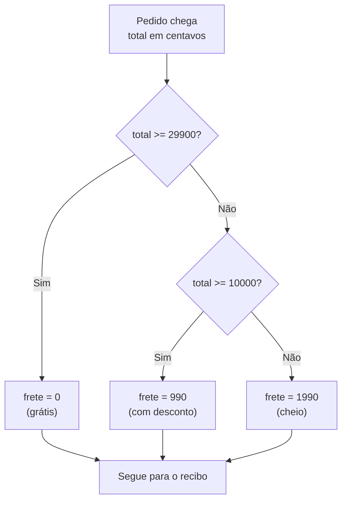

# 01.09 — Condicionais

> **Módulo 01 — Python Fundamental** · Nível: N1 · Tempo estimado: 2h30 · Código: `codigo/cap09/`

## 1. Objetivo

- **Implementar** decisões com `if`/`elif`/`else` e condições compostas legíveis.
- **Prever** qual ramo executa em cadeias com condições sobrepostas — e por que a ordem dos `elif` é lógica, não estilo.
- **Aplicar** o padrão validar-cedo (guardas) em entradas de usuário — o balcão finalmente recusa em vez de explodir.
- **Refatorar** condições aninhadas em guardas planas, aplicando o aforismo *flat is better than nested*.

Ao final, seus laudos booleanos deixam de ser decoração: eles puxam gatilhos — e a central de validação do 01.08 ganha as cancelas que faltavam.

---

## 2. Pré-requisitos

- [01.08 — Booleanos, comparações e truthiness](08-booleanos-comparacoes-e-truthiness.md) — a munição inteira deste capítulo.
- [01.07 — Entrada e saída](07-entrada-e-saida.md) — a borda que as guardas vão proteger.

**Autoteste:** (1) `bool("0")` é...? (2) Por que a guarda vem antes da operação protegida no `and`? (3) O que a indentação significava no `IndentationError` do 01.01? Se travou na 3, guarde a pergunta: este capítulo a responde por inteiro.

---

## 3. Motivação

Recapitule a cena constrangedora do balcão: `Valor reconhecido? False` — impresso com orgulho — seguido de uma explosão de `ValueError` na linha seguinte, porque nada **consultou** o laudo. Seu programa até aqui é uma estrada reta: toda linha executa, na ordem, sempre. Laudo bom ou ruim, o caminhão passa.

Programas reais são feitos de bifurcações. O frete da Aurora é grátis acima de R$ 299? *Depende do total.* O pedido parcela em 12×? *Depende do valor.* A entrada do usuário vira cálculo? *Depende do laudo.* Sem a capacidade de executar **este bloco e não aquele**, não existe validação que impeça, desconto que se aplique, nem menu que responda — existe só o caminho feliz, torcendo.

E há uma segunda dor, mais sutil, que você encontrará em todo código de iniciante (incluindo o seu, daqui a três semanas, se este capítulo falhar): a **escadaria de ifs aninhados** — seis níveis de indentação, cada `else` a quarenta linhas do seu `if`, ninguém mais sabendo qual condição cobre o quê. O problema não é o `if`; é usá-lo sem os dois padrões que o domam: guardas cedo e cadeias planas.

Este capítulo resolve isso assim: apresenta a sintaxe completa (`if`/`elif`/`else` — e a indentação finalmente como estrutura), o raciocínio de cadeia (uma escolha entre N caminhos, ordem importa), e os dois padrões profissionais — validar-cedo e achatar aninhamentos — aplicados no lugar que mais dói: a borda do balcão.

---

## 4. Modelo mental

> 🧠 **Modelo mental**
> Uma cadeia `if`/`elif`/`else` é uma **cancela de pedágio com fila de perguntas**: o fluxo chega, as condições são testadas **de cima para baixo**, e a primeira que responder `True` abre **a sua** cancela — o fluxo entra naquele bloco, executa, e **pula todo o resto da cadeia**. O `else` é a cancela sem pergunta: pega quem nenhuma outra pegou. Consequência que decide bugs: em condições sobrepostas, **quem pergunta primeiro, leva** — a ordem da cadeia é parte da lógica.

**Exercício de previsão.** O total é 350. Sem rodar, decida o que imprime:

```python
total = 350
if total > 100:
    print("frete com desconto")
elif total > 299:
    print("frete grátis")
else:
    print("frete cheio")
```

*Resposta comentada:* imprime `frete com desconto` — e o cliente que merecia frete grátis pagou desconto. As duas condições são verdadeiras para 350, mas `total > 100` pergunta primeiro e leva; o `elif` do frete grátis **nunca é testado**. Nenhum erro, nenhum aviso: a cadeia funcionou perfeitamente — a *ordem* é que estava errada (da condição mais frouxa para a mais exigente; o correto é o inverso). Se você previu "frete grátis", acabou de conhecer o bug silencioso mais comum das cadeias condicionais.

---

## 5. Analogia

Uma cadeia condicional é a **triagem de um pronto-socorro**. O paciente (o fluxo) passa pela enfermeira de triagem, que faz perguntas **em ordem de gravidade**: risco de vida? (vermelho, atendimento imediato) — senão, urgente? (amarelo) — senão, pode aguardar? (verde). A primeira classificação que se aplica **encerra a triagem**: ninguém é vermelho *e* verde. E a ordem das perguntas é o próprio protocolo: perguntar "pode aguardar?" primeiro mandaria infartados para a fila — exatamente o bug do frete de 350.

**Onde a analogia quebra:** a enfermeira usa julgamento e pode voltar atrás; a cadeia não — condições são avaliadas mecanicamente, na ordem escrita, e não existe "hmm, deixa eu reconsiderar". Todo o julgamento precisa estar **na ordem que você escreveu**. E o pronto-socorro tem uma triagem só; programas encadeiam dezenas de cancelas — por isso os padrões de organização (guardas, achatamento) importam tanto quanto a sintaxe.

---

## 6. Teoria

### A sintaxe — e a indentação vira lei

```python
if condicao:
    bloco_do_sim        # executa se condicao for truthy
elif outra_condicao:
    bloco_alternativo   # testada SÓ se a anterior falhou
else:
    bloco_do_senao      # pega quem nenhuma condição pegou
```

As regras mecânicas: dois-pontos **obrigatórios** ao fim de cada linha de condição; o bloco vem **indentado** (4 espaços, padrão da trilha — o VS Code faz por você); o bloco acaba quando a indentação volta. `elif` e `else` são opcionais; pode haver quantos `elif` precisar; `else` é no máximo um, sempre por último.

Aqui se paga uma promessa antiga: o `IndentationError` do 01.01 dizia que indentação é *estrutura*, não estética. Agora você vê o porquê: **a indentação é o bloco**. Não há chaves nem `end` — o recuo diz o que pertence ao `if`. O que outras linguagens marcam com `{ }`, o Python marca com o que seus olhos já usavam para ler.

### `if` em cadeia vs. `if`s independentes — a decisão estrutural

Duas estruturas parecidas, semânticas diferentes:

```python
# CADEIA: escolhe UM caminho entre vários (mutuamente exclusivos)
if total >= 29_900:
    frete = 0
elif total >= 10_000:
    frete = 990
else:
    frete = 1_990

# INDEPENDENTES: cada teste decide por si (podem passar vários)
if cliente_novo:
    print("cupom de boas-vindas")
if aniversario:
    print("brinde de aniversário")
```

O critério: os casos são **alternativas** (faixas de frete — um pedido tem exatamente um frete) → cadeia com `elif`. Os casos são **acúmulos independentes** (benefícios que coexistem) → `if`s separados. Usar `if`s separados onde era cadeia gera o bug do "dois fretes aplicados"; usar cadeia onde eram independentes engole benefícios. A pergunta antes de digitar: *"pode acontecer mais de um?"*

### Ordem em cadeias: da mais exigente para a mais frouxa

A previsão da seção 4 vira regra: quando as condições se sobrepõem (faixas numéricas, principalmente), ordene **da mais específica/exigente para a mais geral** — `>= 299` antes de `>= 100`. Alternativa que elimina a sobreposição pela raiz: faixas com encadeamento fechado (`100 <= total < 299`) — cada condição cobre território exclusivo e a ordem deixa de importar. As duas formas são profissionais; a segunda é mais à prova de manutenção.

### O padrão validar-cedo (guardas)

A escadaria nasce de embrulhar o caminho feliz em validações aninhadas. As **guardas** (*guard clauses*) invertem: trate os casos de erro **primeiro**, um a um, saindo cedo — e deixe o caminho feliz plano, no nível zero:

```python
# ESCADARIA (evite)                    # GUARDAS (prefira)
if valor_ok:                           if not valor_ok:
    if parcelas_ok:                        print("valor inválido")
        if faixa_ok:                   elif not parcelas_ok:
            processa()                     print("parcelas inválidas")
        else:                          elif not faixa_ok:
            print("faixa!")                print("fora da faixa 2-12")
    else:                              else:
        print("parcelas!")                 processa()
else:
    print("valor!")
```

Mesma lógica, três níveis a menos — e cada erro com sua mensagem **ao lado** da sua condição. É o aforismo do Zen que você comentou no 01.01 (*flat is better than nested*) virando gesto. Em capítulos futuros, as guardas ganharão superpoderes (`return` cedo em funções no 01.18, `continue` em laços no 01.10, exceções no 01.21); a forma com `elif` é a versão que suas ferramentas atuais permitem — e já resolve.

### Truthiness na condição: o dialeto completo

Tudo do 01.08 se encaixa aqui: `if nome:` ("tem nome?"), `if not erros:` ("sem erros?"), `if divisor != 0 and total / divisor > 5:` (escudo dentro da condição). A condição do `if` aceita qualquer expressão — a resposta booleana implícita decide.

---

## 7. Funcionamento interno

Por dentro, na medida N1: as condições viram os mesmos **saltos condicionais** de bytecode que o curto-circuito usa (01.08) — a PVM avalia a expressão e, conforme o resultado, **pula** para o endereço do próximo teste ou entra no bloco; o "pula todo o resto da cadeia" do modelo mental é literalmente um salto para depois do `else`. Duas consequências práticas: testar condições é barato (um salto é das instruções mais rápidas que existem — organize cadeias por *clareza*, não por medo de custo); e não existe "voltar atrás" — o salto é dado e pronto, exatamente como a cancela do modelo mental prometeu. O detalhe curioso para o futuro: o Python 3.10+ tem uma estrutura de escolha adicional (`match`/`case`, o *structural pattern matching*) — a trilha a apresenta como curiosidade no módulo 04, quando houver estruturas dignas dela; para decisões do dia a dia, `if`/`elif` cobre tudo.

---

## 8. Visualização do fluxo

A cancela de frete da Aurora — a cadeia corrigida da seção 4, em fluxo:



**Como ler:** cada losango é uma cancela testada **em ordem** — e repare que o segundo losango só existe para quem respondeu "não" ao primeiro: é o `elif` desenhado. Os três caminhos desembocam no mesmo ponto (o fluxo continua após a cadeia), e exatamente **um** deles executa por pedido. Compare com o diagrama errado mentalmente: com `>= 10000` perguntando primeiro, o ramo do frete grátis vira letra morta — código alcançável só no desenho.

---

## 9. Aplicação prática

A cancela que faltava no balcão. Rode e teste os dois caminhos:

```bash
python 01-Python/codigo/cap09/balcao_com_cancela.py
```

**Caminho feliz** (`1399,90` e `3`): o programa valida, ecoa e calcula como sempre. **Caminho barrado** (digite `abc` no valor): pela primeira vez, em vez do `ValueError` na sua cara —

```text
=== Balcão Aurora v2 — agora com cancela ===
Valor do produto (ex.: 1399,90): abc

[X] Valor não reconhecido: 'abc'
    Formato esperado: 1399,90 (ou R$ 1.399,90)
    Atendimento encerrado — rode de novo e tente outra vez.
```

Recusa educada, mensagem com o **eco do que foi recebido** (`repr` — a lupa do 01.05) e a instrução do que corrigir. Repare na arquitetura de guardas do arquivo: os casos de erro saem cedo, um a um, cada um com sua mensagem; o caminho feliz fica plano no fim. E repare no que **ainda** falta: o programa encerra em vez de perguntar de novo — a insistência exige repetição, e repetição é o próximo capítulo (a pendência anotada no seu roteiro de testes do 01.07 está pagando-se em parcelas, como tudo na Aurora).

O script também traz a **cancela de frete** por faixas (o diagrama da seção 8 executável) e a decisão cadeia × ifs independentes com os benefícios coexistentes — os três padrões do capítulo, rodando.

> 🎯 **Checkpoint rápido**
> Sem olhar: numa cadeia de faixas de desconto, a condição `total >= 100` deve vir antes ou depois de `total >= 500` — e qual é a alternativa que torna a ordem irrelevante?

---

## 10. Código comentado

Arquivo completo em [`codigo/cap09/balcao_com_cancela.py`](codigo/cap09/balcao_com_cancela.py).

```python
# ------------------------------------------------------------
# balcao_com_cancela.py
# Capítulo 01.09 — Condicionais
# O que este arquivo demonstra: guardas na borda (validar-cedo),
#   cadeia de faixas de frete e ifs independentes para benefícios
# Como executar: python balcao_com_cancela.py
# ------------------------------------------------------------

print("=== Balcão Aurora v2 — agora com cancela ===")

# --- Borda com esteira (01.07) ---
valor_texto = input("Valor do produto (ex.: 1399,90): ")
valor_limpo = valor_texto.strip().replace("R$", "").strip()
valor_limpo = valor_limpo.replace(".", "").replace(",", ".")
valor_ok = valor_limpo.replace(".", "", 1).isdigit()

# --- GUARDA 1: valor. Caso de erro sai cedo, com eco e instrução. ---
if not valor_ok:
    print()
    print(f"[X] Valor não reconhecido: {valor_texto!r}")
    print("    Formato esperado: 1399,90 (ou R$ 1.399,90)")
    print("    Atendimento encerrado — rode de novo e tente outra vez.")
    # Sem 'while' (01.10) nem 'return' (01.18), encerrar educadamente
    # é a saída disponível — e já é infinitamente melhor que o traceback.
else:
    valor_centavos = int(float(valor_limpo) * 100)

    parcelas_texto = input("Número de parcelas (1 a 12): ").strip()

    # --- GUARDA 2: parcelas (formato) --- GUARDA 3: parcelas (faixa) ---
    if not parcelas_texto.isdigit():
        print(f"[X] Parcelas não reconhecidas: {parcelas_texto!r} (digite um número)")
    elif not (1 <= int(parcelas_texto) <= 12):
        print(f"[X] Fora da faixa: {parcelas_texto}x (aceitamos de 1 a 12)")
    else:
        # --- CAMINHO FELIZ, plano: as cancelas ficaram para trás ---
        parcelas = int(parcelas_texto)

        # CADEIA de faixas: da mais exigente para a mais frouxa.
        if valor_centavos >= 29_900:
            frete_centavos = 0
            faixa_frete = "grátis"
        elif valor_centavos >= 10_000:
            frete_centavos = 990
            faixa_frete = "com desconto"
        else:
            frete_centavos = 1_990
            faixa_frete = "cheio"

        # IFS INDEPENDENTES: benefícios que coexistem (não é escolha).
        brindes = ""
        if parcelas == 1:
            brindes = brindes + " [5% à vista]"
        if valor_centavos >= 50_000:
            brindes = brindes + " [embalagem presente]"

        total = valor_centavos + frete_centavos
        parcela_base = total // parcelas
        parcela_1 = parcela_base + total % parcelas

        reais_total = f"{total / 100:,.2f}".replace(",", "@").replace(".", ",").replace("@", ".")
        reais_p1 = f"{parcela_1 / 100:,.2f}".replace(",", "@").replace(".", ",").replace("@", ".")

        print()
        print(f"Frete: {faixa_frete}  |  Benefícios:{brindes or ' nenhum'}")
        print(f"Total: R$ {reais_total}  |  1ª parcela: R$ {reais_p1} de {parcelas}x")
        print("=" * 44)

# Saída: (os dois caminhos demonstrados na seção 9 do capítulo)
```

---

## 11. Erros comuns

### Erro 1 — O bloco que não veio (dois-pontos e indentação)

**Sintoma:**

```text
  File "cancela.py", line 2
    print("aprovado")
    ^
IndentationError: expected an indented block after 'if' statement on line 1
```

(e o primo dele: `SyntaxError: expected ':'` quando os dois-pontos faltam)
**Causa:** o `if` promete um bloco — a linha seguinte precisa vir indentada; sem recuo (ou sem os `:`), a promessa quebra na compilação.
**Correção:** dois-pontos ao fim da condição, bloco com 4 espaços. E o reencontro: este é o `IndentationError` do 01.01 — só que agora você sabe que a indentação **é** a estrutura, não um capricho do interpretador.

### Erro 2 — A cadeia com ramo morto (o frete de 350)

**Sintoma:** nenhum traceback — clientes de frete grátis pagando desconto, silenciosamente, até alguém conferir a fatura.
**Causa:** condições sobrepostas na ordem errada: a frouxa (`> 100`) pergunta antes da exigente (`> 299`) e leva todos os casos; o ramo de baixo vira **código inalcançável** — existe, compila, e nunca executa.
**Correção:** ordene da mais exigente para a mais frouxa — ou feche as faixas com encadeamento (`100 <= total < 299`), que elimina a sobreposição. E o teste do avesso (01.08) ganha um irmão: **teste de cada ramo** — um valor que deveria cair em cada cancela, conferido um a um.

> ⚠️ **Atenção**
> Ramo morto é o bug silencioso na sua forma mais cruel: o código *parece* tratar o caso — está lá, escrito, revisado — e nunca roda. Nenhuma ferramenta simples denuncia; só o teste de cada ramo pega. Guarde o reflexo: escreveu cadeia, testou ramo por ramo.

### Erro 3 — `=` onde era `==`

**Sintoma:**

```text
  File "cancela.py", line 1
    if status = "pago":
       ^^^^^^^^^^^^^^^
SyntaxError: invalid syntax. Maybe you meant '==' or ':=' instead of '='?
```

**Causa:** atribuição (`=`) no lugar da comparação (`==`) — o deslize universal de quem digita rápido.
**Correção:** a mensagem já entrega (`Maybe you meant '=='`) — leia até o fim e agradeça: em várias linguagens clássicas, `if (status = "pago")` **compila e atribui**, criando um dos bugs mais infames da história da programação; o Python o barra na Estação 1. Um ponto para a filosofia do explícito.

---

## 12. Boas práticas

✅ **Guardas primeiro, caminho feliz plano no fim** — cada erro sai cedo com sua mensagem; o leitor desce o arquivo sem carregar contexto de três níveis.

✅ **Mensagem de recusa com eco (`repr`) e instrução** — "não reconhecido: 'abc'; formato esperado: 1399,90" transforma frustração em correção; recusa muda é quase tão hostil quanto traceback.

✅ **Cadeia para alternativas, ifs separados para acúmulos — pergunte "pode acontecer mais de um?"** — a pergunta de 5 segundos que evita o duplo-frete e o benefício engolido.

✅ **Teste de cada ramo: um valor para cada cancela** — cadeia sem teste de ramo é loteria; o hábito manual de hoje vira o `parametrize` do módulo 12.

❌ **Evite aninhar além de 2 níveis** — o terceiro nível é o sinal de refatorar para guardas (ou, em breve, funções); *flat is better than nested* é lei da casa.

❌ **Evite `if x == True:` e `if len(s) > 0:`** — o dialeto do 01.08 vale dentro da condição: `if x:` e `if s:`; redundância na cancela é ruído no lugar mais lido do código.

---

## 13. Performance

Nesta escala, irrelevante — saltos condicionais custam nanossegundos, e você saberá quando importar. A nota honesta que já orienta: em cadeias longas, a ordem tem um efeito duplo — **lógico** (sobreposição, seção 6) e **econômico** (a condição que decide mais cedo poupa os testes abaixo; o raciocínio "quem decide primeiro?" do 01.08, agora em cadeia). Quando os dois critérios conflitarem, vence o lógico, sempre — cadeia correta e um nanossegundo mais lenta ganha de cadeia rápida e errada por goleada. A versão madura desse dilema (ordenar condições por seletividade) reaparece no módulo 03, otimizando consultas SQL — com medição.

---

## 14. Mercado

> 🏢 **Mercado**
> O que este capítulo chama de cadeia de faixas, o mercado chama de **regras de negócio** (*business rules*) — frete por faixa, desconto por perfil, limite por score: a maior parte do código backend de um e-commerce é exatamente isto, `if`s encadeados codificando decisões comerciais. Dois padrões deste capítulo são critérios reais de revisão de código: **guardas com retorno cedo** (a forma canônica de validação em APIs — o módulo 06 as escreverá com `HTTPException`, mesma arquitetura, ferramenta nova) e **ramos testados um a um** (a cobertura de ramos, *branch coverage*, que o módulo 12 medirá por ferramenta). E a mensagem de recusa com eco e instrução é literalmente o contrato das boas APIs: o erro 422 do FastAPI devolve o campo, o valor recebido e o esperado — seu balcão v2 em JSON.
>
> **Mini-cenário:** a tabela de frete que você codificou é a política comercial da Aurora — e políticas mudam ("a partir de segunda, grátis acima de R$ 249"). No módulo atual, mudar = editar a cadeia; nos módulos 03/05, as faixas irão para o banco de dados; no 11, você discutirá onde regras de negócio devem morar. A pergunta "quem muda isso, e com que frequência?" — plantada aqui — é das mais importantes da arquitetura.

---

## 15. Entrevistas

**P1. "Qual a diferença entre uma cadeia `if`/`elif` e uma sequência de `if`s independentes?"**
*Resposta esperada:* a cadeia escolhe **um** caminho (a primeira condição verdadeira executa e o resto é pulado — alternativas mutuamente exclusivas); `if`s separados testam **todos** (acúmulos independentes). O critério de escolha: "pode acontecer mais de um?". Citar um bug de cada lado (duplo-frete / benefício engolido) mostra vivência.

**P2. "O que são guard clauses e por que preferi-las a ifs aninhados?"**
*Resposta esperada:* validar os casos de erro primeiro, saindo cedo, deixando o caminho feliz plano; ganhos: legibilidade (erro ao lado da condição), menos indentação, manutenção segura. Amarrar ao *flat is better than nested* e mencionar a forma com `return` (em funções) sinaliza o padrão completo.

**P3. "Como você garantiria que uma cadeia de faixas de desconto está correta?"**
*Resposta esperada:* três camadas: construção (faixas fechadas com encadeamento `a <= x < b`, sem sobreposição), inspeção (ordem da mais exigente para a mais frouxa, se houver sobreposição) e **teste de cada ramo** — um valor por faixa, mais os valores de borda (299 vs. 300: o clássico "inclusive ou exclusive?"). Quem menciona as bordas ganha o ponto do entrevistador.

**Pegadinha clássica: "O que acontece em Python com `if x = 5:` — e por que isso é uma decisão de design famosa?"**
Ela derruba quem responde "atribui e testa" (verdade em C e família — e fonte do bug histórico `if (x = 5)` que aceita tudo). A saída forte: em Python é **`SyntaxError` na compilação** — atribuição não é expressão utilizável em condição, por decisão deliberada de design (*explicit is better than implicit*); a mensagem moderna até sugere `==`. Bônus de pleno: desde o 3.8 existe o operador morsa (`:=`) para os raros casos legítimos de atribuir-e-testar — **opt-in explícito**, o que reforça (e não contradiz) a decisão original.

---

## 16. Exercícios guiados

Enunciados completos em [`exercicios/cap09.md`](exercicios/cap09.md); gabaritos em [`exercicios/gabaritos/cap09.md`](exercicios/gabaritos/cap09.md).

### Aquecimento

- **A1** `[~10 min · previsão de ramos]` — 4 cadeias dadas, 3 valores cada: diga qual ramo executa em cada caso.
- **A2** `[~5 min · cadeia ou ifs?]` — Para 5 requisitos de negócio, decida: cadeia `elif` ou `if`s independentes — e por quê.
- **A3** `[~10 min · caça ao ramo morto]` — 3 cadeias com sobreposição: aponte os ramos inalcançáveis e reordene (ou feche as faixas).
- **A4** `[~5 min · sintaxe]` — 4 trechos com erros de `:` /indentação/`=`: diagnostique pela mensagem, sem rodar.

### Aplicação

- **AP1** `[~20 min · a central ganha cancelas]` — Pegue sua `central_validacao.py` (01.08) e converta os laudos em guardas: cada laudo reprovado imprime sua mensagem com eco e encerra o ramo; o veredito só sai no caminho feliz.
- **AP2** `[~25 min · classificador de pedidos]` — Implemente a triagem da Aurora: cadeia de 4 faixas de total (com faixas fechadas) + 2 benefícios independentes; teste com 1 valor por ramo + as 2 bordas.
- **AP3** `[~20 min · achatador]` — Receba uma escadaria de 4 níveis (dada no enunciado) e refatore para guardas planas, provando a equivalência com os mesmos 5 casos de teste.

---

## 17. Desafios

- **D1** `[~45 min · o simulador de política comercial]` — **Frete da Aurora, edição de segunda-feira.** A gestora anuncia: "grátis acima de R$ 249; entre R$ 120 e R$ 249, meio frete; abaixo, cheio — mas pedidos de Campinas têm frete grátis sempre, e pedidos acima de R$ 800 parcelados em 1x ganham 5% de desconto no total". Implemente com a arquitetura certa (o que é cadeia? o que é independente? o que vem primeiro?), documente as 2 decisões estruturais em comentário, e entregue a bateria de testes de ramo: 1 caso por caminho possível (conte-os primeiro — são mais do que parecem), com o resultado esperado de cada um calculado à mão antes de rodar.

<details><summary>💡 Dica 1 (conceito)</summary>
Comece separando os requisitos em alternativas (faixas de frete) e modificadores independentes (Campinas, desconto à vista). A frase "têm frete grátis SEMPRE" diz algo sobre a ordem.
</details>
<details><summary>💡 Dica 2 (estratégia)</summary>
Campinas como guarda ANTES da cadeia de faixas (decide e pula a cadeia) ou como condição dentro dela? As duas funcionam — uma é mais legível. Escolha e defenda no comentário.
</details>
<details><summary>💡 Dica 3 (esqueleto)</summary>
entrada (total, cidade canônica, parcelas) → guarda/cadeia do frete → if independente do desconto → recibo → bateria: Campinas barato, Campinas caro, outra cidade nas 3 faixas, o caso do desconto, as bordas 120/249.
</details>

---

## 18. Mini projeto

**Balcão Aurora v2 — o atendimento completo** `[~1h15]` — o balcão do 01.07, agora com todas as cancelas.

Requisitos numerados:

1. Evolua seu `balcao_pedido.py` (01.07/D1) para `codigo/cap09/balcao_pedido_v2.py`: **toda** entrada agora tem guarda com mensagem de recusa educada (eco `repr` + formato esperado) — nenhum traceback alcançável por digitação.
2. Incorpore a política de frete por faixas (a do capítulo ou a do D1) no lugar do frete fixo, e ao menos 1 benefício independente.
3. Arquitetura obrigatória: guardas primeiro, caminho feliz plano, cadeia × ifs justificados em comentário onde houver escolha.
4. Atualize seu `roteiro_de_testes.md` (01.07): as entradas hostis que antes derrubavam agora devem constar como "recusadas educadamente" — e a coluna de pendências deve encolher (a insistência continua pendente para o 01.10; exceções para o 01.21).
5. Rode o roteiro completo + 1 caso por ramo da política de frete; cole as saídas no roteiro, datadas.

**Critério de "está bom":** zero tracebacks por digitação; cada recusa ensina o formato certo; ramos todos testados; o roteiro mostra a evolução v1 → v2 (pendências pagas e restantes, nomeadas). O balcão está a um capítulo de não desistir do cliente — o `while` o fará insistir.

---

## 19. Revisão

**Resumo do capítulo:**

- `if`/`elif`/`else`: condições testadas de cima para baixo; a primeira verdadeira executa e **pula o resto**; `else` pega os demais; dois-pontos + indentação de 4 (a indentação É o bloco — promessa do 01.01 paga).
- Cadeia = alternativas mutuamente exclusivas; `if`s separados = acúmulos independentes; a pergunta-critério: "pode acontecer mais de um?".
- Sobreposição de faixas: ordene da mais exigente para a mais frouxa — ou feche as faixas (`100 <= x < 299`) e a ordem deixa de importar; ramo morto é bug silencioso — teste cada ramo.
- Guardas (validar-cedo): erros saem primeiro, cada um com mensagem (eco + instrução); caminho feliz plano — *flat is better than nested* em gesto.
- Truthiness na condição: `if nome:`, `if not erros:` — o dialeto do 01.08 mora aqui.
- `if x = 5` é SyntaxError por design (e a mensagem sugere `==`) — o Python barra o bug histórico do `=` em condição.

**Flashcards novos** (adicionados a [`revisao/flashcards.md`](revisao/flashcards.md)):

| ID | Frente | Verso |
|---|---|---|
| 01.09-F1 | Preveja: total=350; cadeia `if total > 100: "desconto"` / `elif total > 299: "grátis"`. O que sai? | (Previsão) "desconto" — a condição frouxa pergunta primeiro e leva; o ramo do grátis vira código morto. Ordem: exigente antes de frouxa. |
| 01.09-F2 | Explique com suas palavras: guardas (validar-cedo) e o que elas substituem. | (Elaboração) Casos de erro saem primeiro, um a um, com mensagem ao lado da condição; o caminho feliz fica plano — substituem a escadaria de ifs aninhados. |
| 01.09-F3 | Cadeia elif ou ifs independentes: qual pergunta decide, e um bug de cada lado? | (Decisão) "Pode acontecer mais de um?" Sim → ifs (senão: benefício engolido); não → cadeia (senão: duplo-frete). |
| 01.09-F4 | Como tornar a ordem de uma cadeia de faixas irrelevante? | Faixas fechadas com encadeamento: `100 <= total < 299` — territórios exclusivos, sem sobreposição para a ordem decidir. |
| 01.09-F5 | O que acontece com `if x = 5:` em Python — e por que é decisão de design? | SyntaxError na compilação (mensagem sugere ==): atribuição não vale como condição — o bug histórico do C barrado por explicitude; o `:=` existe como opt-in raro. |

**Agendamento:** registre no `PROGRESSO.md` e marque D+1, D+7, D+30, D+90 na [`Revisoes/agenda.md`](../Revisoes/agenda.md).

---

## 20. Checklist

Perguntas de domínio — teste do sim:

- [ ] Sei prever *qual ramo executa em qualquer cadeia, incluindo as com sobreposição*?
- [ ] Sei decidir *cadeia × ifs independentes pela pergunta-critério*?
- [ ] Sei implementar *guardas com mensagens de recusa dignas (eco + instrução)*?
- [ ] Sei depurar *ramo morto (teste de cada ramo) e os erros de sintaxe do capítulo*?
- [ ] Sei responder *à pegadinha do `if x = 5` com a história de design*?

Itens práticos:

- [ ] Rodei `balcao_com_cancela.py` nos dois caminhos (feliz e barrado).
- [ ] Acertei (ou entendi por que errei) a previsão da seção 4 e o checkpoint da seção 9.
- [ ] Fiz Aquecimento e Aplicação (central com cancelas; escadaria achatada).
- [ ] Construí o balcão v2 com roteiro atualizado (5 requisitos).
- [ ] Registrei a sessão e agendei as 4 revisões.

---

## 21. Próximo capítulo

Seu balcão v2 recusa com educação — e desiste na primeira tentativa: digitou errado, atendimento encerrado, rode de novo. Nenhum atendente de verdade trabalha assim. Ficou deliberadamente em aberto a estrutura que falta para o programa **insistir**: repetir a pergunta até a resposta ser válida, atender clientes em sequência sem reiniciar, acumular totais até o caixa fechar. O próximo capítulo apresenta o `while` — a repetição por condição — junto com seus dois demônios domésticos: o loop que nunca termina (e o Ctrl+C que o exorciza) e o que nunca começa. A pendência mais antiga do seu roteiro de testes está prestes a ser paga.

→ [01.10 — Laço `while`](10-laco-while.md)

---

*Gerado sob spec 3.0.0*
