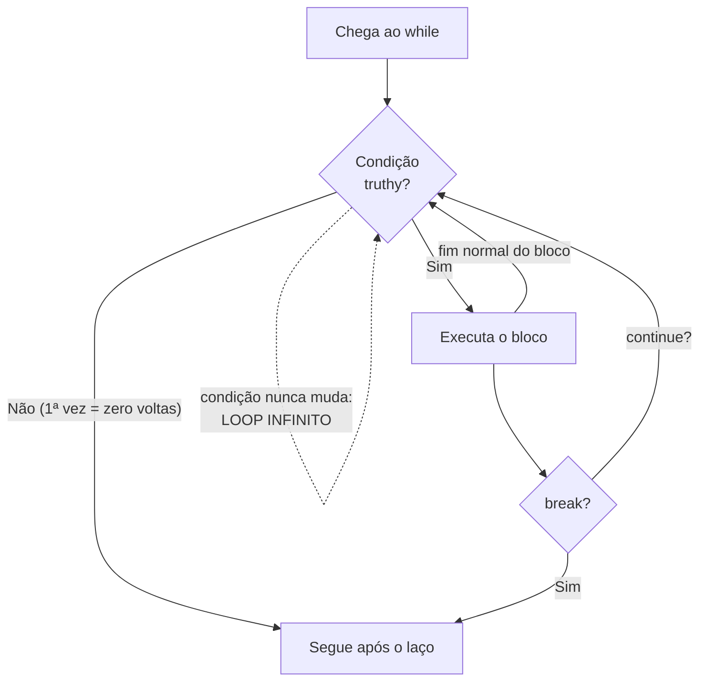

# 01.10 — Laço `while`

> **Módulo 01 — Python Fundamental** · Nível: N1 · Tempo estimado: 2h30 · Código: `codigo/cap10/`

## 1. Objetivo

- **Implementar** repetição por condição com `while`, sentinelas e acumuladores.
- **Depurar** os dois demônios domésticos: o loop infinito (e o `Ctrl+C` que o exorciza) e o loop que nunca roda.
- **Aplicar** `break` e `continue` com moderação justificada — incluindo o idioma `while True` + `break`.
- **Construir** entradas que insistem até serem válidas — pagando a pendência mais antiga do seu roteiro de testes.

Ao final, seu balcão para de desistir do cliente: pergunta de novo, atende o próximo, acumula o caixa — e só fecha quando você mandar.

---

## 2. Pré-requisitos

- [01.09 — Condicionais](09-condicionais.md) — condições e guardas: o `while` é um `if` que volta.
- [01.07 — Entrada e saída](07-entrada-e-saida.md) — a borda que finalmente vai insistir.

**Autoteste:** (1) Numa cadeia, o que acontece após um ramo executar? (2) `bool("")` é...? (3) O que faz `contador = contador + 1` em linguagem de etiquetas? Se travou na 3, releia o 01.03/01.04 — o `while` vive dessa linha.

---

## 3. Motivação

O balcão v2 recusa com educação — e desiste: `"Atendimento encerrado — rode de novo"`. Imagine a cena real na Aurora: o vendedor digita `1.399,90` com um espaço a mais, o programa encerra, ele abre o terminal, roda de novo, redigita tudo. Na terceira vez, ele volta para a planilha — e tem razão. Ferramenta que desiste no primeiro tropeço não é ferramenta: é protótipo.

O que falta não é validação (você tem), nem mensagem (você tem) — é **voltar**. Perguntar de novo. E "voltar" é a fronteira mais importante deste módulo: até aqui, todo programa seu foi uma estrada de mão única, de cima para baixo, cada linha executando no máximo uma vez. Programas reais passam a vida em círculos: o servidor que atende requisição após requisição (módulo 06 inteiro é um grande laço), o pipeline que processa linha após linha do CSV (módulo 10), o menu que oferece opções até alguém escolher sair.

Com o poder de voltar vem o risco novo — o primeiro da trilha em que o programa não quebra com barulho nem entrega resultado errado: ele **não termina**. A tela congela, o cursor pisca, nada acontece — para sempre. Todo programador tem seu primeiro loop infinito; a diferença entre pânico e rotina é conhecer o mecanismo (e o `Ctrl+C`).

Este capítulo resolve isso assim: apresenta o `while` como "o `if` que volta", os três padrões que cobrem quase tudo (insistência, sentinela, acumulador), os dois demônios com seus exorcismos — e fecha com o balcão que atende a fila inteira da Aurora sem reiniciar.

---

## 4. Modelo mental

> 🧠 **Modelo mental**
> O `while` é uma **catraca com porteiro**: antes de **cada** volta, o porteiro testa a condição — `True`, o fluxo entra e percorre o bloco; ao fim do bloco, volta à catraca e o porteiro testa **de novo**. `False`, a catraca trava e o fluxo segue adiante. Três consequências que decidem todos os bugs do capítulo: o teste é **antes** (condição falsa de cara = zero voltas); o teste é **só na catraca** (mudou a condição no meio do bloco? a volta atual termina inteira); e alguém **dentro do bloco** precisa mexer no que a condição testa — senão o porteiro repete `True` para sempre.

**Exercício de previsão.** Sem rodar, decida: quantas linhas este código imprime — e qual é a última?

```python
contador = 1
while contador <= 3:
    print("volta", contador)
    contador = contador + 1
print("fim, contador =", contador)
```

*Resposta comentada:* imprime 4 linhas — `volta 1`, `volta 2`, `volta 3` e `fim, contador = 4`. O detalhe que derruba: na última passagem pela catraca, `contador` já vale 4 — o porteiro testa `4 <= 3`, trava, e o `print` final revela o **4**, não o 3. A variável de controle sempre termina com o primeiro valor que **reprovou** no teste. Se você respondeu "contador = 3", acabou de conhecer o *off-by-one* dos laços — o primo do fim-exclusivo das fatias (01.05).

---

## 5. Analogia

O `while` é o **caixa de supermercado com a esteira ligada**: enquanto houver item na esteira (condição), ele passa **um** item pelo leitor (o bloco), e olha a esteira de novo. Esteira vazia, fecha a compra e chama o próximo. Os padrões do capítulo moram aí: a **sentinela** é a barra divisória que o cliente coloca — "os itens acabam aqui" (o valor especial que encerra: `"sair"`, `0`); o **acumulador** é o subtotal no visor, que começa em zero e cresce a cada item; e a **insistência** é o item que não bipa — o caixa não joga a compra fora nem manda o cliente embora: passa o item de novo até bipar.

**Onde a analogia quebra:** a esteira do mercado anda sozinha — sempre chega um momento em que acaba. No `while`, quem "anda a esteira" é o **seu código dentro do bloco**: esqueça de avançar (`contador = contador + 1`, ou o próximo `input` da sentinela) e a esteira congela com o mesmo item diante do leitor, para sempre — o loop infinito não é esteira rápida demais; é esteira **parada** com o motor ligado.

---

## 6. Teoria

### A sintaxe — e a semelhança proposital com o `if`

```python
while condicao:
    bloco          # executa, volta ao teste; repete enquanto truthy
```

Mesma anatomia do `if` (condição, dois-pontos, bloco indentado) — a diferença é o que acontece ao fim do bloco: o `if` segue adiante; o `while` **volta ao teste**. Tudo que você sabe de condições (truthiness, `and`/`or`, guardas) vale aqui, sem adaptação.

### Padrão 1 — Contagem (a variável de controle)

O trio inseparável: **inicializar antes**, **testar na condição**, **avançar dentro**:

```python
volta = 1                  # 1. inicializa
while volta <= 5:          # 2. testa
    print("processando volta", volta)
    volta += 1             # 3. avança (o += do 01.04, em seu habitat natural)
```

Esquecer o passo 3 = demônio nº 1 (infinito). Errar o passo 2 (`>=` no lugar de `<=`) = demônio nº 2 (zero voltas). O passo 1 fora do laço é o que impede o contador de renascer a cada volta.

### Padrão 2 — Sentinela (repetir até o valor especial)

Quando não se sabe quantas voltas haverá — o usuário decide quando parar:

```python
total_centavos = 0
entrada = input("Valor do item (ou 'fim'): ").strip().lower()
while entrada != "fim":
    total_centavos += int(entrada)            # (validação omitida p/ foco)
    entrada = input("Valor do item (ou 'fim'): ").strip().lower()
```

A **sentinela** (*sentinel*) é o valor que encerra (`"fim"`, `"sair"`, `0`). Repare na coreografia clássica: um `input` **antes** do laço (a primeira leitura) e outro **no fim do bloco** (a próxima) — é o que garante que a sentinela seja testada antes de processada. A duplicação incomoda? Incomoda. O idioma seguinte a elimina.

### Padrão 3 — Insistência (o `while True` + `break` legítimo)

O laço que só sai por dentro — a forma canônica da entrada que insiste:

```python
while True:                                   # porteiro sempre aprova...
    resposta = input("Parcelas (1 a 12): ").strip()
    if resposta.isdigit() and 1 <= int(resposta) <= 12:
        parcelas = int(resposta)
        break                                 # ...a saída é explícita, aqui
    print(f"[X] Inválido: {resposta!r} — digite um número de 1 a 12.")
```

**`break`** abandona o laço na hora (a catraca nem é consultada); **`continue`** pula direto para a catraca (abandona só a volta atual). `while True` assusta à primeira vista ("infinito de propósito?!") — e é o idioma padrão da comunidade para "repita até dar certo", **desde que** o `break` seja visível e alcançável. A moderação prometida no objetivo: um `break` claro por laço é idioma; três `break`s espalhados são labirinto — nessa hora, reescreva a condição da catraca.

### Acumuladores — o padrão transversal

Presente nos três padrões acima: uma variável que **começa neutra** (`0` para somas, `""` para textos — os elementos neutros que você conhece) e **cresce a cada volta** (`+=`). Contador é acumulador de 1 em 1; o caixa da Aurora é acumulador de centavos; o relatório do módulo será acumulador de linhas. Errar a inicialização (dentro do laço em vez de antes) zera o acumulado a cada volta — bug silencioso clássico, catalogado na seção 11.

### `while` × `for` — o aviso de fronteira

O `while` repete **enquanto uma condição durar** — número de voltas desconhecido (insistir até validar, atender até fechar). Quando o número de voltas é **conhecido de antemão** ("para cada um dos 5", "para cada caractere"), existe ferramenta mais expressiva: o `for` do próximo capítulo. A regra de bolso que já fica: *contando até N conhecido? provavelmente `for`. Esperando algo acontecer? `while`.* O 01.11 formaliza a decisão.

---

## 7. Funcionamento interno

Por dentro, na medida N1: o `while` compila para os mesmos saltos condicionais do `if` (01.09) — mais **um salto incondicional de volta**: fim do bloco → pula para o teste. O loop infinito, visto do bytecode, é só isso: teste-aprova → bloco → salto de volta → teste-aprova... um circuito fechado perfeitamente saudável para a PVM, que executa milhões de voltas por segundo sem reclamar — ela não tem como saber que você queria parar. O `Ctrl+C` funciona porque o interpretador confere, entre instruções, se o sistema sinalizou interrupção — e a converte no `KeyboardInterrupt` que estampa o traceback (você o verá na seção 9, de propósito). E o teste-antes explica o zero-voltas: o salto para fora acontece na **primeira** consulta, antes de qualquer execução do bloco — o `while` é um `if` com passagem de volta, e um `if` falso não executa nada.

---

## 8. Visualização do fluxo

A catraca completa, com as três saídas possíveis de uma volta:



**Como ler:** o circuito saudável é o triângulo `condição → bloco → condição`. As duas saídas: pela catraca (condição falsa — a saída natural) ou pelo `break` (a saída explícita). O `continue` é o atalho de volta à catraca. E a seta pontilhada que morde o próprio rabo é o demônio nº 1 desenhado: se nada no bloco muda o que a condição testa, o fluxo nunca encontra a seta de saída — a esteira parada com motor ligado.

---

## 9. Aplicação prática

Três experimentos — incluindo o batismo de fogo. Rode:

```bash
python 01-Python/codigo/cap10/catraca_da_aurora.py
```

**Experimento 1 — os três padrões, rodando.** O script executa em sequência: contagem (etiquetas de 1 a 5), insistência (`while True` pedindo parcelas até validar — digite lixo de propósito e veja a recusa **voltar a perguntar**, a pendência do 01.07 morrendo na sua frente) e sentinela com acumulador (o caixa somando itens até `"fim"`).

**Experimento 2 — o batismo do loop infinito.** Abra o arquivo, localize o bloco comentado `BATISMO`, descomente as 3 linhas e rode. A tela vai imprimir sem parar. Respire, olhe o cursor piscando — e pressione **`Ctrl+C`**:

```text
volta infinita 48291
volta infinita 48292
^C
Traceback (most recent call last):
  File "...catraca_da_aurora.py", line 44, in <module>
KeyboardInterrupt
```

Pronto: você matou seu primeiro loop infinito, viu o `KeyboardInterrupt` (é um traceback como os outros — endereço incluso) e nunca mais vai congelar diante de uma tela parada. Recomente as linhas.

**Experimento 3 — o zero-voltas.** Ainda no arquivo, o bloco `ZERO_VOLTAS` tem um `while` com a condição invertida (`>=` onde era `<=`). Rode e repare: nenhum erro, nenhuma saída daquele bloco — o silêncio é o sintoma. Conserte a condição e rode de novo.

> 💡 **Dica**
> Suspeitou de loop infinito num programa seu? Antes do Ctrl+C, adicione um `print` da variável de controle dentro do bloco e rode de novo: se ela imprime sempre o mesmo valor, você achou a esteira parada — e o conserto é a linha de avanço que falta.

---

## 10. Código comentado

Arquivo completo em [`codigo/cap10/catraca_da_aurora.py`](codigo/cap10/catraca_da_aurora.py).

```python
# ------------------------------------------------------------
# catraca_da_aurora.py
# Capítulo 01.10 — Laço while
# O que este arquivo demonstra: contagem, insistência (while True +
#   break), sentinela com acumulador — e os dois demônios, domados
# Como executar: python catraca_da_aurora.py
# ------------------------------------------------------------

print("--- Padrão 1: contagem ---")
volta = 1                        # inicializa ANTES
while volta <= 5:                # testa na catraca
    print(f"Imprimindo etiqueta {volta} de 5")
    volta += 1                   # avança DENTRO — sem esta linha: infinito
# Saída: 5 linhas, e 'volta' termina valendo 6 (o 1º valor reprovado)

print()
print("--- Padrão 3: insistência (a pendência do 01.07 morre aqui) ---")
while True:                      # o porteiro sempre aprova...
    resposta = input("Parcelas (1 a 12): ").strip()
    if resposta.isdigit() and 1 <= int(resposta) <= 12:
        parcelas = int(resposta)
        break                    # ...e a saída é explícita e visível
    print(f"[X] Inválido: {resposta!r} — digite um número de 1 a 12.")
print(f"Fechado: {parcelas}x. (Reparou? Ele INSISTIU em vez de desistir.)")

print()
print("--- Padrão 2: sentinela + acumulador ---")
total_centavos = 0               # acumulador nasce neutro, FORA do laço
entrada = input("Valor do item em centavos (ou 'fim'): ").strip().lower()
while entrada != "fim":          # a sentinela é testada antes de processar
    if entrada.isdigit():
        total_centavos += int(entrada)
        print(f"  subtotal: {total_centavos} centavos")
    else:
        print(f"  [X] ignorado: {entrada!r}")
    entrada = input("Valor do item em centavos (ou 'fim'): ").strip().lower()

reais = f"{total_centavos / 100:,.2f}".replace(",", "@").replace(".", ",").replace("@", ".")
print(f"Caixa fechado: R$ {reais}")

# --- BATISMO (Experimento 2): descomente as 3 linhas, rode, Ctrl+C ---
# n = 0
# while n >= 0:                  # n só cresce: a condição nunca vira False
#     n += 1; print("volta infinita", n)

# --- ZERO_VOLTAS (Experimento 3): condição invertida — conserte-a ---
contagem = 1
while contagem >= 5:             # deveria ser <= : falsa de cara, 0 voltas
    print("você nunca verá esta linha")
    contagem += 1
print("(o bloco acima rodou zero vezes — silêncio é o sintoma)")

# Saída: (as conversas completas mostradas na seção 9 do capítulo)
```

---

## 11. Erros comuns

### Erro 1 — A esteira parada (loop infinito)

**Sintoma:** a tela imprime a mesma coisa sem parar — ou congela muda, cursor piscando, para sempre. Ao interromper:

```text
^C
Traceback (most recent call last):
  File "caixa.py", line 12, in <module>
KeyboardInterrupt
```

**Causa:** nada dentro do bloco altera o que a condição testa — o avanço esquecido (`contador += 1` ausente), a sentinela sem novo `input` no fim do bloco, ou a condição testando a variável errada.
**Correção:** `Ctrl+C` primeiro (recupere o terminal); depois o diagnóstico da Dica da seção 9: imprima a variável de controle dentro do bloco — valor congelado = linha de avanço faltando. E note o lado bom do traceback: o `KeyboardInterrupt` traz a **linha em que o laço girava** — o endereço do suspeito.

### Erro 2 — O laço que nunca começa (zero voltas)

**Sintoma:** nenhum erro, nenhuma saída do bloco — o programa "funciona" e o relatório vem vazio, o total vem zero, a pergunta não aparece.
**Causa:** condição falsa já na primeira consulta à catraca — comparação invertida (`>=` por `<=`), variável inicializada com o valor errado, ou o teste da sentinela contra o valor que ela já tem.
**Correção:** o teste-antes é contrato (seção 4): confira **na mão** o primeiro teste com os valores iniciais reais ("volta=1, condição volta>=5 → False → zero voltas — achei"). Silêncio de bloco é sintoma, não sorte.

> ⚠️ **Atenção**
> Dos dois demônios, o zero-voltas é o mais perigoso: o infinito se anuncia (a tela grita); o zero-voltas passa em silêncio e entrega acumulador zerado como se fosse resultado. Todo `while` novo merece o teste dos dois extremos: ele roda quando deveria? ele **para** quando deveria?

### Erro 3 — O acumulador que renasce a cada volta

**Sintoma:** sem traceback — o caixa fecha sempre com o valor do **último** item, não com a soma; a contagem termina em 1.

```python
while entrada != "fim":
    total = 0                 # <- o bug: renasce a cada volta
    total += int(entrada)
    ...
```

**Causa:** a inicialização do acumulador migrou para dentro do bloco — a cada volta ele volta ao neutro e "acumula" só a volta atual.
**Correção:** o trio do padrão 1 vale para acumuladores: **nasce antes**, cresce dentro, colhe-se depois. Se o resultado final parece "só a última volta", procure a inicialização no lugar errado — é ela.

---

## 12. Boas práticas

✅ **O trio completo em todo laço de contagem: inicializa antes, testa na catraca, avança dentro** — recite mentalmente ao escrever; a ausência de qualquer perna é um dos dois demônios.

✅ **`while True` + um `break` visível para insistência** — é o idioma da comunidade; a condição de saída fica onde a decisão acontece, ao lado da validação.

✅ **Teste os dois extremos de todo laço novo: roda quando deve? para quando deve?** — trinta segundos que cobrem os dois demônios de uma vez.

✅ **Mensagem de recusa dentro da insistência ensina o formato — e a sentinela aparece na pergunta** — `"Valor (ou 'fim'): "` evita o usuário preso no seu laço sem saber a senha de saída.

❌ **Evite mais de um `break` por laço** — dois já pedem atenção; três são labirinto: reescreva a condição da catraca para dizer a verdade completa.

❌ **Evite `continue` como primeiro recurso** — quase sempre um `if` normal diz o mesmo com o fluxo à vista; o `continue` brilha ao descartar cedo um item inválido em laços longos (você o verá no seu habitat no módulo 10).

---

## 13. Performance

Nesta escala, irrelevante — e com a inversão já conhecida do 01.07: nos laços interativos deste capítulo, o gargalo é o humano parado no `input`, e a PVM executa milhões de voltas vazias por segundo sem esforço. A nota honesta que planta o futuro: o custo de um laço é `voltas × custo_do_bloco` — dobrar o trabalho **dentro** do bloco dói o dobro em cada volta; é a semente do raciocínio de complexidade que o módulo 10 formaliza (e mede) quando as voltas forem milhões de linhas de CSV, e que decide arquiteturas no módulo 11. Por ora, o hábito gratuito: pergunte-se "o que este bloco faz *por volta* — e precisava fazer aqui dentro?".

---

## 14. Mercado

> 🏢 **Mercado**
> O `while` que insiste até validar é o esqueleto de toda interface robusta — mas o exemplar mais importante do padrão no mercado é invisível: o **laço de eventos** (*event loop*). Um servidor web é, na essência, `while True: espere requisição; atenda; volte` — o FastAPI do módulo 06 roda sobre exatamente isso (e o asyncio do 04.22 é a versão sofisticada do mesmo círculo). Workers de fila (Celery, módulo 10) são `while True: pegue tarefa; execute`. Até o terminal onde você digita é um laço lendo comandos. Entrevistas cobram o tema por dois flancos: o prático ("escreva uma leitura com retry/validação") e o conceitual ("por que `while True` num worker não é bug?") — os dois respondidos neste capítulo.
>
> **Mini-cenário:** na Aurora, o caixa-sentinela que você construiu é o protótipo funcional do fechamento diário de vendas — e o `while True` do balcão insistente é o mesmo desenho do endpoint que, no módulo 06, receberá pedidos "para sempre". A diferença entre o script de hoje e o servidor de lá é sofisticação em volta do círculo; o círculo é o mesmo.

---

## 15. Entrevistas

**P1. "Quando usar `while` em vez de `for`?"**
*Resposta esperada:* `while` para repetição por **condição** (número de voltas desconhecido: insistir até validar, esperar evento, processar até sentinela); `for` para percorrer o que já se conhece (sequências, faixas — o capítulo seguinte). A regra de bolso ("contando até N? for; esperando acontecer? while") + um exemplo de cada lado fecha a resposta.

**P2. "`while True` é má prática?"**
*Resposta esperada:* não por si — é o idioma padrão para "repita até dar certo" e para laços de serviço (event loops, workers), **desde que** a saída (`break`/condição de encerramento) seja visível e alcançável. A má prática é o `while True` sem estratégia de saída clara ou com `break`s espalhados. Citar o event loop de servidores mostra visão além do exercício.

**P3. "Como você depuraria um programa que 'travou'?"**
*Resposta esperada:* método, não pânico: (1) `Ctrl+C` e **ler o KeyboardInterrupt** — a linha onde girava; (2) hipótese: que condição deveria virar False e não vira?; (3) instrumentar: print da variável de controle por volta; (4) conferir o trio (inicializa/testa/avança). Bônus: distinguir "travou girando" (CPU alta, prints repetindo) de "travou esperando" (parado num input/rede) — diagnósticos diferentes.

**Pegadinha clássica: "O que imprime `while contador <= 3` (contador começando em 1) — e quanto vale `contador` depois do laço?"**
Ela derruba quem responde "3" no reflexo. A saída forte: o laço imprime as voltas 1, 2 e 3 — e `contador` termina valendo **4**: a variável de controle sempre sai do laço com o primeiro valor que **reprovou** na condição (foi o teste `4 <= 3` que travou a catraca). Fechar conectando ao padrão: é o mesmo off-by-one do fim-exclusivo das fatias (01.05) e do `range` (01.11) — o Python é consistente até nos sustos.

---

## 16. Exercícios guiados

Enunciados completos em [`exercicios/cap10.md`](exercicios/cap10.md); gabaritos em [`exercicios/gabaritos/cap10.md`](exercicios/gabaritos/cap10.md).

### Aquecimento

- **A1** `[~10 min · previsão de voltas]` — 4 laços: quantas voltas, o que imprime, valor final da variável de controle.
- **A2** `[~10 min · diagnóstico dos demônios]` — 4 laços doentes: infinito, zero-voltas, acumulador renascendo ou saudável? Conserte os doentes.
- **A3** `[~5 min · break e continue]` — 3 trechos com `break`/`continue`: preveja o fluxo exato.
- **A4** `[~5 min · while ou for?]` — 6 situações: qual laço é o natural, pela regra de bolso.

### Aplicação

- **AP1** `[~20 min · a borda que insiste]` — Refatore as guardas do seu balcão v2 (01.09): cada entrada agora insiste até validar (`while True` + break), com a mensagem de recusa ensinando o formato.
- **AP2** `[~20 min · caixa com sentinela]` — Complete o caixa da seção 9: sentinela `"fim"`, acumulador de centavos, contagem de itens, e o fechamento com total + ticket médio (cuidado: divisão por zero se fechar sem itens — escudo do 01.08!).
- **AP3** `[~20 min · jogo da adivinhação]` — O clássico: número secreto fixo no código, o usuário chuta até acertar, com dicas "maior"/"menor" e contagem de tentativas ao final.

---

## 17. Desafios

- **D1** `[~45 min · o validador de força bruta]` — **Simulador de senha da Aurora.** O sistema interno exige senhas com: 8+ caracteres, ao menos 1 dígito e ao menos 1 letra maiúscula. Construa o cadastro que insiste até receber uma senha válida, mostrando **quais** critérios faltaram a cada recusa (todos os que faltaram, não só o primeiro — repare: isso pede `if`s independentes, não cadeia). Ao validar, peça a confirmação (digitar de novo) — e se a confirmação não bater, recomece do zero (laço dentro de laço? ou um laço com estado? as duas soluções valem; documente a sua). Sem métodos novos: `isdigit` por caractere exige percorrer a senha — e percorrer string sem `for` é... um `while` com índice. Sinta o desconforto: ele é o anúncio do próximo capítulo.

<details><summary>💡 Dica 1 (conceito)</summary>
Percorrer com while: `i = 0` / `while i < len(senha):` / olhe `senha[i]` / `i += 1`. Os laudos "tem dígito?"/"tem maiúscula?" são acumuladores booleanos (começam False, viram True se achar).
</details>
<details><summary>💡 Dica 2 (estratégia)</summary>
"Maiúscula" sem método novo: `"A" <= caractere <= "Z"` — a comparação de strings do 01.08 trabalhando. (O método pronto existe — isupper — e chega com as ferramentas de coleção; hoje é artesanato honesto.)
</details>
<details><summary>💡 Dica 3 (esqueleto)</summary>
while True (cadastro) → input senha → while de varredura (índice) coletando laudos → ifs independentes das recusas → se ok: input confirmação → bate? break : mensagem e continua.
</details>

---

## 18. Mini projeto

**Balcão Aurora v3 — a fila inteira** `[~1h15]` — o balcão que não desiste do cliente nem fecha entre clientes.

Requisitos numerados:

1. Evolua o balcão v2 para `codigo/cap10/balcao_pedido_v3.py`: **toda** entrada insiste até validar (as guardas de recusa-e-fim viram `while True` + break, mantendo as mensagens educadas).
2. Envolva o atendimento num laço de fila: ao fim de cada pedido, pergunte `"Atender próximo cliente? (s/n)"` — com validação da própria resposta, claro — e só encerre no `"n"`.
3. Acumule o caixa do dia: total vendido, número de pedidos e ticket médio no fechamento (com o escudo da divisão por zero — dia sem vendas existe).
4. O fechamento imprime o resumo formatado (f-strings, reais brasileiros): pedidos atendidos, total, ticket médio.
5. Atualize o `roteiro_de_testes.md`: a pendência "insistência" (aberta desde o 01.07) é oficialmente **paga** — registre; a coluna de pendências deve conter agora apenas as exceções (01.21).
6. Rode uma sessão completa com 3 pedidos (um deles com erros de digitação no meio) e cole a transcrição no roteiro.

**Critério de "está bom":** nenhuma digitação derruba nem encerra o programa (só o "n" encerra); o caixa fecha com números certos (prova manual na transcrição); o roteiro conta a história das pendências — duas pagas, uma restante, com endereço. O balcão está funcionalmente completo; o que os próximos capítulos fazem é **organizá-lo** (listas, funções) — não salvá-lo.

---

## 19. Revisão

**Resumo do capítulo:**

- `while` = o `if` que volta: testa **antes** de cada volta (falso de cara = zero voltas), só na catraca (a volta atual termina inteira), e exige que o bloco mova o que a condição testa (senão: infinito).
- O trio da contagem: inicializa antes, testa na catraca, avança dentro — cada perna ausente é um demônio.
- Padrões: contagem (voltas conhecidas — mas espere o `for`), sentinela (valor especial encerra; input antes + input no fim), insistência (`while True` + break visível — o idioma da entrada robusta).
- Acumulador nasce neutro **fora** do laço, cresce dentro, colhe-se depois; renascer dentro = "soma" que vale só a última volta.
- Demônios e exorcismos: infinito → `Ctrl+C` + print da variável de controle; zero-voltas → conferir o primeiro teste na mão (silêncio é sintoma).
- A variável de controle sai do laço com o primeiro valor **reprovado** (contador <= 3 termina em 4) — o off-by-one consistente com fatias e range.

**Flashcards novos** (adicionados a [`revisao/flashcards.md`](revisao/flashcards.md)):

| ID | Frente | Verso |
|---|---|---|
| 01.10-F1 | Preveja: `contador = 1; while contador <= 3: print(...); contador += 1` — voltas e valor final? | (Previsão) 3 voltas; contador termina em **4** — a variável de controle sai com o primeiro valor reprovado no teste. |
| 01.10-F2 | Explique com suas palavras: por que o loop infinito acontece — e o exorcismo em 3 passos? | (Elaboração) Nada no bloco muda o que a condição testa. Exorcismo: Ctrl+C (ler a linha do KeyboardInterrupt) → print da variável de controle → achar a linha de avanço faltante. |
| 01.10-F3 | Qual é o trio de todo laço de contagem — e que demônio cada perna ausente invoca? | Inicializa antes (senão renasce) · testa na catraca (invertido = zero-voltas) · avança dentro (ausente = infinito). |
| 01.10-F4 | `while True` é má prática? | (Decisão) Não — é o idioma de "repita até dar certo" e dos laços de serviço (event loops, workers), desde que o break seja visível e alcançável; sem estratégia de saída, aí sim é bug. |
| 01.10-F5 | O caixa fecha sempre com o valor do último item em vez da soma. Diagnóstico direto? | Acumulador inicializado DENTRO do laço — renasce neutro a cada volta. Correção: nasce antes, cresce dentro, colhe depois. |

**Agendamento:** registre no `PROGRESSO.md` e marque D+1, D+7, D+30, D+90 na [`Revisoes/agenda.md`](../Revisoes/agenda.md).

---

## 20. Checklist

Perguntas de domínio — teste do sim:

- [ ] Sei prever *voltas, saídas e valor final da variável de controle de qualquer while*?
- [ ] Sei implementar *os três padrões (contagem, sentinela, insistência) sem consultar*?
- [ ] Sei depurar *os dois demônios (infinito com Ctrl+C e método; zero-voltas pelo silêncio)*?
- [ ] Sei explicar *quando while True + break é idioma e quando é bug*?
- [ ] Sei responder *à pegadinha do valor final (o off-by-one consistente do Python)*?

Itens práticos:

- [ ] Rodei `catraca_da_aurora.py`, provoquei o BATISMO e o matei com Ctrl+C.
- [ ] Consertei o bloco ZERO_VOLTAS e entendi o sintoma-silêncio.
- [ ] Fiz Aquecimento e Aplicação (borda insistente; caixa com sentinela; adivinhação).
- [ ] Construí o balcão v3 (6 requisitos) com a pendência da insistência oficialmente paga.
- [ ] Registrei a sessão e agendei as 4 revisões.

---

## 21. Próximo capítulo

No desafio da senha, você percorreu uma string com `i = 0; while i < len(senha): ... i += 1` — e sentiu o desconforto: três linhas de andaime (inicializar, testar, avançar) para o que era só "olhe cada caractere". Ficou deliberadamente em aberto a ferramenta que dissolve o andaime: o `for` — o laço que percorre sequências **sem** índice manual, sem trio, sem demônios de avanço esquecido. Junto dele vem o `range`, o gerador de contagens com o mesmo fim-exclusivo das fatias — e a tabela de parcelamento da Aurora (2× a 12×) que você imprimirá em três linhas. O `while` continua sendo a ferramenta do "até que"; o `for` assume o "para cada" — e o "para cada" é o pão de cada dia.

→ [01.11 — Laço `for` e `range`](11-laco-for-e-range.md)

---

*Gerado sob spec 3.0.0*