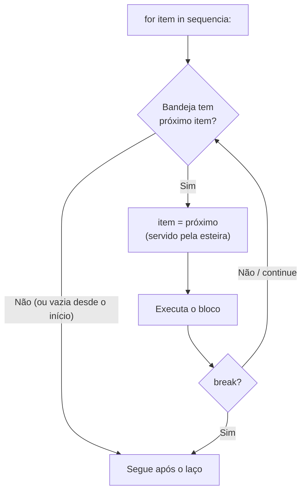

# 01.11 — Laço `for` e `range`

> **Módulo 01 — Python Fundamental** · Nível: N1 · Tempo estimado: 2h30 · Código: `codigo/cap11/`

## 1. Objetivo

- **Implementar** iteração com `for` sobre strings e sobre `range(início, fim, passo)` — sem índice manual, sem andaime.
- **Prever** os limites do `range` (fim exclusivo, coerente com as fatias) sem contar nos dedos.
- **Aplicar** acumuladores e contadores no `for` — os mesmos padrões do `while`, com metade das linhas.
- **Decidir** entre `for` e `while` pelo formato do problema, com a regra de bolso formalizada.

Ao final, o andaime `i = 0 / while i < len(...) / i += 1` estará aposentado — e a tabela de parcelamento da Aurora (2× a 12×) sairá em três linhas.

---

## 2. Pré-requisitos

- [01.10 — Laço `while`](10-laco-while.md) — acumuladores, o trio da contagem e o desconforto do índice manual (o desafio da senha foi o anúncio deste capítulo).
- [01.05 — Strings — parte 1](05-strings-parte-1.md) — o fim-exclusivo das fatias, que o `range` herda.

**Autoteste:** (1) No `while contador <= 3`, contador termina valendo...? (2) `"PED"[1]` é...? (3) A fatia `[2:5]` pega quantos itens? Se travou na 3, releia o modelo de marcas do 01.05 — o `range` usa a mesma régua.

---

## 3. Motivação

Volte ao desafio da senha (01.10/D1) e olhe o que você escreveu para responder "há um dígito nesta senha?":

```python
i = 0
while i < len(senha):
    caractere = senha[i]
    # ...o teste de verdade, UMA linha útil...
    i += 1
```

Cinco linhas — das quais **três são andaime**: inicializar o índice, testá-lo, avançá-lo. O trabalho real ("olhe cada caractere") é uma linha espremida no meio. E cada peça do andaime é uma oportunidade de demônio: esqueceu o `+= 1`? Infinito. Trocou `<` por `<=`? `IndexError` na última volta. O andaime não é só verboso — é **perigoso**.

Agora multiplique pelo dia a dia da Aurora: percorrer os caracteres de um código, imprimir as opções de parcelamento de 2× a 12×, somar os dígitos de um CPF, repetir uma etiqueta para cada item da caixa. Tudo é "para cada X, faça Y" — e em tudo o `while` obriga você a gerenciar manualmente uma variável que não é o assunto. O assunto é o caractere, a parcela, o dígito; o índice é burocracia.

As linguagens perceberam isso há décadas, e o Python levou a sério como poucas: o `for` daqui **não é** o `for` de contador do C/Java — é um "para cada" de verdade, que entrega os itens prontos na sua mão, um por volta, sem índice nenhum. E quando o que você quer *é* uma contagem (1 a 5, 2 a 12), o `range` fabrica a sequência de números para o mesmo `for` percorrer — com o fim exclusivo que você já respeita desde as fatias.

Este capítulo resolve isso assim: apresenta o `for` sobre strings e ranges, traduz os padrões do `while` (acumulador, contador, busca) para a forma sem andaime, formaliza a decisão `for` × `while` — e aposenta o índice manual com honras militares.

---

## 4. Modelo mental

> 🧠 **Modelo mental**
> O `for` é uma **esteira de servir**: a sequência (string, range) é a bandeja; a cada volta, a esteira **entrega o próximo item pronto na sua variável** — você não busca, não conta, não avança nada. `for caractere in senha:` lê-se "para cada caractere da senha" — e é exatamente isso. Quando a bandeja acaba, o laço acaba. O índice não existe porque **não é da sua conta**: quem gerencia a posição é a esteira.

**Exercício de previsão.** Sem rodar, decida o que cada laço imprime:

```python
for letra in "PED":
    print(letra)

for n in range(2, 6):
    print(n)

for n in range(10, 0, -3):
    print(n)
```

*Resposta comentada:* o primeiro imprime `P`, `E`, `D` — um caractere por volta, na ordem. O segundo imprime `2, 3, 4, 5` — **sem o 6**: `range(2, 6)` é "da marca 2 até a 6, exclusiva", a mesmíssima régua das fatias (`[2:6]` também pega 4 itens). O terceiro imprime `10, 7, 4, 1` — passo negativo desce, e para **antes** de cruzar o 0 (exclusivo de novo). Se você incluiu o 6, o fim-exclusivo ainda não virou reflexo — boa notícia: fatias e range treinam o mesmo músculo.

---

## 5. Analogia

O `while` e o `for` são dois garçons. O garçom-`while` trabalha de **comanda e relógio**: "enquanto houver pedido pendente, atenda" — ele mesmo confere a lista, marca o que já foi, decide quando parar; poderoso, e cheio de oportunidade de erro (esquecer de marcar = atender para sempre). O garçom-`for` trabalha de **rodízio**: a bandeja passa, ele serve **cada** item que está nela, e quando a bandeja acaba, acabou — sem comanda, sem relógio, sem decisão. Ninguém pergunta ao garçom de rodízio "como você sabe quando parar?": a bandeja sabe.

**Onde a analogia quebra:** o garçom de rodízio pode pular clientes; o `for` não pula item nenhum — entrega todos, na ordem, exatamente uma vez (pular é trabalho do `continue`, decisão do bloco, não da esteira). E há bandejas que se fabricam sob demanda: o `range(1_000_000)` não monta um milhão de números antes de começar — produz um por volta, conforme a esteira pede (a seção 7 abre essa miudeza, que vira assunto sério no 04.06).

---

## 6. Teoria

### A sintaxe — e o que ela dispensa

```python
for item in sequencia:
    bloco          # roda uma vez POR ITEM, com 'item' já servido
```

Compare com o andaime aposentado — mesmo comportamento, sem as três pernas do trio (inicializar/testar/avançar), e portanto **sem os demônios delas**: não há avanço para esquecer nem teste para inverter. A variável do laço (`item`, `letra`, `n` — nomeie pelo conteúdo!) nasce a cada volta com o próximo valor; sequência vazia = zero voltas, em paz e sem sintoma (o `for` sobre `""` não é bug — é bandeja vazia).

O `for` percorre **sequências**: strings (caractere a caractere — o uso imediato) e ranges (números fabricados) por enquanto; listas a partir do 01.12 (onde a esteira encontra sua bandeja definitiva), e mais adiante tudo que for *iterável* (arquivos linha a linha no 01.22! — o conceito completo é o 04.05).

### `range` — a fábrica de contagens

`range` fabrica sequências de inteiros sob demanda. As três formas, e a herança das fatias em cada uma:

| Forma | Produz | Regra |
|---|---|---|
| `range(5)` | 0, 1, 2, 3, 4 | do 0 até 5 **exclusivo** — 5 itens |
| `range(2, 13)` | 2, 3, ..., 12 | início inclusivo, fim exclusivo — as parcelas da Aurora! |
| `range(10, 0, -3)` | 10, 7, 4, 1 | passo negativo desce; para antes de cruzar o fim |

A aritmética de bolso é a das fatias (01.05): **`fim − início` é a quantidade** (com passo 1). Quer 1 a 10? `range(1, 11)`. Quer N voltas sem usar os números? `range(n)` e ignore a variável (a convenção para "não uso": nomeá-la `_`). O fim-exclusivo deixa de ser pegadinha quando você o lê como as marcas da régua: `range(2, 6)` vai da marca 2 à marca 6 — quatro casas, as mesmas de `s[2:6]`.

### Os padrões do `while`, traduzidos

**Acumulador** — idêntico, sem andaime:

```python
soma_digitos = 0
for caractere in "046990":
    soma_digitos += int(caractere)
print(soma_digitos)
# Saída: 28
```

**Contador com condição** (o "quantos passam no teste"):

```python
maiusculas = 0
for c in "Fone Bluetooth XZ-9":
    if "A" <= c <= "Z":
        maiusculas += 1
```

**Busca com veredito** (os laudos booleanos da senha, agora dignos):

```python
tem_digito = False
for c in senha:
    if "0" <= c <= "9":
        tem_digito = True
```

E o `break`/`continue` funcionam igual ao `while` — inclusive o idioma de busca com saída antecipada (`break` ao achar o primeiro: para que varrer o resto?). O desafio da senha, reescrito com estes padrões, encolhe pela metade — e é exatamente o exercício AP1.

### `for` × `while` — a decisão formalizada

| Pergunta ao problema | Laço | Exemplos |
|---|---|---|
| "Para **cada** item de algo que já existe?" | `for` | caracteres, parcelas 2–12, linhas do arquivo (01.22) |
| "**Até que** algo aconteça (não sei quantas voltas)?" | `while` | insistir até validar, sentinela, atender até fechar |

Os dois convivem no mesmo programa — o balcão v3 tem o `while` da fila **em volta** e ganhará `for`s **dentro** (o recibo item a item, no 01.12). Forçar um no papel do outro sempre denuncia: `while` fazendo "para cada" carrega andaime; `for` fazendo "até que" vira `for` sobre `range` gigante com `break` — gambiarra com crachá.

### O anti-padrão `range(len(...))` — morto antes de nascer

Quem vem de outras linguagens escreve `for i in range(len(senha)): c = senha[i]` — o andaime de volta, disfarçado de `for`. Em Python, itera-se **sobre a coisa**, não sobre os índices dela: `for c in senha:`. Os casos raros em que a *posição* também importa têm ferramenta própria (`enumerate` — curiosidade por ora, tratamento no 01.12); até lá, se você digitou `range(len(`, pare e pergunte o que realmente quer percorrer.

---

## 7. Funcionamento interno

Por dentro, na medida N1: o `for` pede à sequência um **iterador** — um "garçom de bandeja" que sabe entregar o próximo item e avisar quando acabou — e a cada volta pergunta "próximo?"; o fim da bandeja é sinalizado internamente e o laço encerra (o protocolo completo, com nomes e cerimônias, é o capítulo 04.05 — e é a porta dos geradores do 04.06). O `range`, por sua vez, é **preguiçoso no bom sentido**: `range(1_000_000)` não fabrica um milhão de inteiros — guarda só início/fim/passo e produz cada número quando o garçom pede; por isso custa o mesmo que `range(10)` para existir. Duas consequências práticas: iterar não copia a sequência (percorrer uma string gigante não a duplica), e a variável do laço é uma **etiqueta comum** (01.03) reamarrada a cada volta — o que explica um clássico: reatribuí-la dentro do bloco não altera a sequência nem o percurso (a esteira não lê a sua etiqueta; ela serve o próximo item e pronto).

---

## 8. Visualização do fluxo

A esteira do `for` — repare no que **não** existe aqui (teste seu, avanço seu):



**Como ler:** compare com o diagrama do `while` (01.10): o losango de lá testava **a sua condição**; o daqui pergunta **à bandeja** — e quem serve o item é a esteira, não você. Não há seta de "avançar" porque não há o que avançar: o único jeito de este laço não terminar é a bandeja ser infinita (não é o caso de strings nem de ranges) — os demônios do `while` não têm porta de entrada aqui.

---

## 9. Aplicação prática

A promessa do capítulo: a tabela de parcelamento da Aurora — 2× a 12× — em três linhas. Rode:

```bash
python 01-Python/codigo/cap11/esteira_de_parcelas.py
```

```text
--- Tabela de parcelamento: Fone Bluetooth (R$ 1.399,90) ---
 2x de R$    699,95
 3x de R$    466,63
 4x de R$    349,97
(...até...)
12x de R$    116,65

--- Varredura do código: PED-2026-00123 ---
Dígitos: 9 | Letras: 3 | Hífens: 2

--- Etiquetas da caixa (range como repetidor) ---
[Caixa 1 de 4] [Caixa 2 de 4] [Caixa 3 de 4] [Caixa 4 de 4]
```

O coração do arquivo é o trecho que o 01.04 fazia em blocos repetidos e o 01.10 faria com andaime:

```python
for parcelas in range(2, 13):
    parcela_base = preco_centavos // parcelas
    ...
```

Uma linha de esteira, e as onze opções saem — é o dropdown de parcelamento de qualquer e-commerce, nascendo. Depois, a varredura do código de pedido (contadores com condição — a senha do 01.10 aposentando o andaime) e o `range` como repetidor de etiquetas (com a variável dizendo "caixa N de M" — repare o `caixas_total` do 01.04 fechando o ciclo).

O gesto de fixação: pegue seu `maquina_de_troco.py` (01.04/D1, os seis degraus copiados) e **conte** quantas linhas a versão com esteira economizaria — sem escrever ainda: as notas precisam morar numa sequência percorrível, e a bandeja certa para elas chega no próximo capítulo. Anote a estimativa; o 01.12 cobra.

> 🎯 **Checkpoint rápido**
> De cabeça: `range(1, 10, 2)` produz quais números — e quantos? (Conferência pela régua: marcas 1 a 10, de 2 em 2.)

---

## 10. Código comentado

Arquivo completo em [`codigo/cap11/esteira_de_parcelas.py`](codigo/cap11/esteira_de_parcelas.py).

```python
# ------------------------------------------------------------
# esteira_de_parcelas.py
# Capítulo 01.11 — Laço for e range
# O que este arquivo demonstra: for sobre range (tabela 2x-12x),
#   for sobre string (varredura com contadores) e range repetidor
# Como executar: python esteira_de_parcelas.py
# ------------------------------------------------------------

preco_centavos = 139_990          # R$ 1.399,90 na régua exata (01.04)

print("--- Tabela de parcelamento: Fone Bluetooth (R$ 1.399,90) ---")
# range(2, 13): parcelas de 2 a 12 — fim exclusivo, como toda régua da casa.
for parcelas in range(2, 13):
    parcela_base = preco_centavos // parcelas          # centavos, sempre
    # Exibição em reais só na borda (pacto do 01.04/01.06):
    reais = f"{parcela_base / 100:,.2f}"
    reais = reais.replace(",", "@").replace(".", ",").replace("@", ".")
    print(f"{parcelas:>2}x de R$ {reais:>9}")
# Saída: 11 linhas, de " 2x de R$    699,95" a "12x de R$    116,65"

print()
print("--- Varredura do código: PED-2026-00123 ---")
codigo = "PED-2026-00123"

# Contadores com condição — a senha do 01.10, sem andaime:
digitos = 0
letras = 0
hifens = 0
for caractere in codigo:          # a esteira serve caractere a caractere
    if "0" <= caractere <= "9":
        digitos += 1
    elif "A" <= caractere <= "Z":
        letras += 1
    elif caractere == "-":
        hifens += 1

print(f"Dígitos: {digitos} | Letras: {letras} | Hífens: {hifens}")
# Saída: Dígitos: 9 | Letras: 3 | Hífens: 2

print()
print("--- Etiquetas da caixa (range como repetidor) ---")
caixas_total = 4                  # o resultado do frete do 01.04
for numero in range(1, caixas_total + 1):   # 1..4: o +1 paga o fim exclusivo
    print(f"[Caixa {numero} de {caixas_total}]", end=" ")
print()
# Saída: [Caixa 1 de 4] [Caixa 2 de 4] [Caixa 3 de 4] [Caixa 4 de 4]
```

---

## 11. Erros comuns

### Erro 1 — O fim que você jurava incluído

**Sintoma:** nenhum traceback — a tabela de parcelas para no 11×, o relatório processa até o penúltimo, a contagem "de 1 a 10" imprime até 9.
**Causa:** `range(2, 12)` termina no 11 — fim exclusivo, sempre; a intuição de "de 2 a 12" traduzida literalmente perde o último.
**Correção:** a aritmética de bolso: quero até N inclusive → `range(início, N + 1)`. E o consolo de consistência: é a **mesma** regra das fatias e do `while contador <= N` (que termina com N+1) — o Python cobra o off-by-one num idioma só; aprendeu numa régua, aprendeu em todas.

### Erro 2 — Reatribuir a variável do laço (e esperar efeito)

**Sintoma:** sem erro — e sem efeito: você "pula" ou "ajusta" a variável dentro do bloco e a esteira ignora solenemente:

```python
for n in range(5):
    if n == 2:
        n = 99          # inofensivo: a etiqueta é reamarrada...
    print(n)
# Saída: 0 1 99 3 4     # ...e na volta seguinte a esteira serve o 3
```

**Causa:** a variável do laço é etiqueta comum (01.03/seção 7): a cada volta a esteira a reamarra no próximo item — sua reatribuição vale só até o fim da volta.
**Correção:** para pular itens, `continue`; para parar, `break`; para percursos exóticos (de 2 em 2, de trás para frente), configure o `range`/fatia — o percurso se decide **na bandeja**, nunca remendando a etiqueta.

### Erro 3 — Iterar sobre o que não é sequência

**Sintoma:**

```text
Traceback (most recent call last):
  File "etiquetas.py", line 2, in <module>
    for n in 4:
TypeError: 'int' object is not iterable
```

**Causa:** `for n in 4:` tenta percorrer o inteiro 4 — e inteiro não é bandeja: não tem itens dentro. A intenção ("repita 4 vezes") precisa da fábrica de sequência.
**Correção:** `for n in range(4):` — o range transforma "4 vezes" em bandeja de 4 itens. A mensagem `is not iterable` é literal e útil: "isto não é percorrível" — quando aparecer com tipos mais exóticos adiante, a pergunta é sempre a mesma: *cadê a sequência?*

> ⚠️ **Atenção**
> O Erro 1 é o mais traiçoeiro dos três por ser silencioso **e** parecer funcionar nos testes pequenos ("contei 3 itens, saíram 3"... porque você testou com o caso que mascara). O antídoto é o teste das bordas, agora ritual: todo `range` novo, confira **o primeiro e o último valor produzidos** — em voz alta, pela régua.

---

## 12. Boas práticas

✅ **Itere sobre a coisa, não sobre índices: `for c in senha:`, nunca `range(len(senha))`** — o item já vem servido; índice manual em Python é sotaque de outra língua.

✅ **Nomeie a variável do laço pelo conteúdo: `for parcela in`, `for caractere in`** — `for x in` obriga o leitor a descobrir o que x é; o nome certo documenta de graça.

✅ **Ritual das bordas em todo range: primeiro e último valor, em voz alta** — `range(2, 13)` → "começa no 2, termina no 12" — três segundos que matam o off-by-one.

✅ **`_` para a variável que você não usa: `for _ in range(3): print("---")`** — a convenção comunica "só quero as voltas" e cala os avisos de variável ociosa.

❌ **Evite `while` com índice para percorrer sequência** — o andaime foi aposentado neste capítulo; se ele reaparecer num código seu, é revisão na certa (a exceção legítima — percursos que modificam a coleção — chega com as listas).

❌ **Evite `for` gigante com `break` fazendo papel de `while`** — `for tentativa in range(999999):` para "insistir até validar" é gambiarra com crachá; "até que" é território do `while`.

---

## 13. Performance

Nesta escala, irrelevante — e com duas notas honestas que já pagam a leitura. Primeira: o `for` não é só mais bonito que o `while` com índice — é tipicamente **mais rápido** (a esteira avança em código nativo da PVM; o andaime avança em bytecode seu, volta a volta) — elegância e economia na mesma compra, cortesia da casa. Segunda: o `range` preguiçoso custa o mesmo para "existir" com 10 ou 10 milhões — o custo real é sempre `voltas × bloco` (a fórmula do 01.10, intacta). A medição de verdade — cronômetro, milhões de linhas, for × ferramentas vetorizadas — está agendada para o módulo 10, onde você descobrirá que às vezes o laço certo é **nenhum** (Pandas fazendo por coluna o que o for faria por linha). Até lá: a fórmula orienta, o hábito de perguntar "o que roda por volta?" continua gratuito.

---

## 14. Mercado

> 🏢 **Mercado**
> O "para cada" é possivelmente o padrão mais executado do planeta em código de dados: para cada linha do CSV, para cada registro da consulta, para cada arquivo da pasta, para cada mensagem da fila — os módulos 10 (pipelines) e 06 (APIs paginadas) são, na prática, coreografias de `for`. Dois detalhes deste capítulo são marcadores de senioridade em revisão de código Python: **iterar sobre a coisa** (o `range(len(...))` denuncia recém-chegado de outra linguagem — há até nome para o estilo idiomático: código *pythônico*) e o **fim-exclusivo sem hesitação** (o off-by-one é estatisticamente uma das famílias de bug mais caras da indústria; quem domina a régua única do Python — fatias, range, while — erra menos onde todos erram). E a tabela de parcelamento que você imprimiu é literalmente o payload que o endpoint de checkout devolve no módulo 06.
>
> **Mini-cenário:** o relatório final do módulo (01.25) processará o CSV de vendas da Aurora com um `for` por linha — e a gestora não vai ver o laço: vai ver o relatório que a planilha do estagiário levava uma manhã para montar sair em meio segundo. A esteira deste capítulo é o motor daquela cena.

---

## 15. Entrevistas

**P1. "Qual a diferença entre o `for` do Python e o `for` de C/Java?"**
*Resposta esperada:* o do Python é um *for-each* — itera sobre os **itens** de qualquer sequência/iterável, sem índice, sem condição, sem incremento manuais; o de C/Java clássico é um `while` disfarçado (init/teste/incremento). Consequências: menos bugs de off-by-one e de avanço, e o anti-padrão `range(len(...))` como sintoma de tradução literal. Mencionar que "iterável" vai além de listas (strings, arquivos, geradores) sinaliza profundidade.

**P2. "O que `range(1, 10, 2)` produz — e por que o fim é exclusivo?"**
*Resposta esperada:* `1, 3, 5, 7, 9` (5 itens); o fim exclusivo mantém a régua única do Python (fatias, range) com as propriedades boas: `fim − início` = quantidade, `range(a, b)` + `range(b, c)` emendam sem sobreposição, `range(len(s))` alinha com os índices válidos de `s`. Quem explica o *porquê* da convenção (e não só a decora) fecha a questão.

**P3. "Quando você ainda usaria `while` num mundo com `for`?"**
*Resposta esperada:* quando o número de voltas é desconhecido — repetição por condição: insistir até entrada válida, sentinela, polling/espera de evento, laços de serviço (`while True` de workers e servidores). A regra de bolso ("para cada" × "até que") + um exemplo real de cada lado. Reconhecer que os dois convivem no mesmo programa (fila em `while`, itens em `for`) é o toque de prática.

**Pegadinha clássica: "Este laço imprime o quê? `for n in range(3): n = n * 10; print(n)` — e o range 'percebe' a mudança?"**
Ela derruba quem imagina o `n` controlando o laço. A saída forte: imprime `0, 10, 20` — e o range não percebe nada: a variável do laço é uma etiqueta que a esteira **reamarra a cada volta** no próximo item da bandeja; o `n = n * 10` vale até o fim da volta e é sobrescrito na seguinte. Fechar com a consequência: em Python não se "ajusta o contador" do `for` — pular é `continue`, parar é `break`, percurso é configuração do `range`. (E quem nota que o print pegou os valores *modificados* — 0, 10, 20, não 0, 1, 2 — leu o código com a atenção que a pegadinha testa.)

---

## 16. Exercícios guiados

Enunciados completos em [`exercicios/cap11.md`](exercicios/cap11.md); gabaritos em [`exercicios/gabaritos/cap11.md`](exercicios/gabaritos/cap11.md).

### Aquecimento

- **A1** `[~10 min · previsão de ranges]` — 8 ranges: liste os valores produzidos e a quantidade (ritual das bordas incluso).
- **A2** `[~10 min · previsão de laços]` — 4 fors (string, range, break, continue): saída exata de cada um.
- **A3** `[~5 min · escreva o range]` — Para 5 sequências desejadas ("1 a 100", "pares até 20", "regressiva 10→1"...), escreva o range exato.
- **A4** `[~5 min · for ou while, rodada 2]` — 6 situações novas, decisão + 1 linha de justificativa.

### Aplicação

- **AP1** `[~20 min · a senha aposenta o andaime]` — Reescreva a varredura do 01.10/D1 com `for`: mesmos laudos, metade das linhas; compare os dois arquivos e anote a diferença.
- **AP2** `[~20 min · tabela de descontos]` — Com `for` + `range`, gere a tabela "leve N, pague com X% de desconto" (N de 3 a 10, desconto = N%), em centavos, formatada.
- **AP3** `[~20 min · estatísticas do código]` — Sobre um código de pedido, produza com UM for: contagem de dígitos, letras, hífens, e a soma dos dígitos — painel formatado ao final.

---

## 17. Desafios

- **D1** `[~45 min · a régua de validação universal]` — **Validador de dígito verificador.** Códigos de barras, CPFs e boletos terminam num dígito calculado a partir dos demais — o *dígito verificador*, que detecta erros de digitação. Implemente o esquema simplificado da Aurora: o 7º dígito deve ser `(soma dos 6 primeiros) % 10` — ex.: `"4699019"` é válido (soma 29 → 29 % 10 = 9 ✓). Escreva o verificador: percorra o corpo com `for`, some, calcule o esperado, compare com o último e emita o veredito. Depois, o teste de fogo com os 5 códigos do enunciado completo (3 corretos, 1 com dígito errado, 1 com dígitos **trocados entre si**) — vereditos calculados à mão antes de rodar. O corrompido por troca passa ou reprova no seu esquema? Explique por quê em comentário — e descubra o que os esquemas reais (CPF!) fazem a respeito (pesquisa dirigida: procure "dígito verificador módulo 11" — só leitura conceitual; a implementação do CPF real é projeto para depois das listas).

<details><summary>💡 Dica 1 (conceito)</summary>
Fatias separam o corpo do dígito: corpo = codigo[:-1], digito = codigo[-1]. O for percorre o corpo somando int(c) — e cuidado: codigo[-1] é string; compare convertido.
</details>
<details><summary>💡 Dica 2 (estratégia)</summary>
Para o teste da troca: "469901"→soma 29; troque dois dígitos ("649901") — a soma muda? A adição é comutativa... aí está a resposta (e a fraqueza do esquema simplificado).
</details>
<details><summary>💡 Dica 3 (esqueleto)</summary>
corpo/dígito → for somando → esperado = soma % 10 → veredito == → 5 blocos de validação → comentário: por que a troca escapa + o que o peso por posição (módulo 11) resolve.
</details>

---

## 18. Mini projeto

**Painel de parcelamento da Aurora** `[~1h]` — o dropdown do checkout, versão terminal.

Requisitos numerados:

1. Crie `painel_parcelamento.py` em `codigo/cap11/` com o cabeçalho padrão: pergunte o preço (borda insistente do 01.10 — reaproveite seu código!) e imprima a tabela completa de 1× a 12×.
2. Regras de negócio na tabela: 1× exibe "à vista com 5% de desconto" (e o valor com desconto, em centavos — cuidado com o arredondamento: documente a escolha); parcelas de 2× a 6× "sem juros"; de 7× a 12×, "+1% por parcela" sobre o total (7× = +7%, 12× = +12% — total corrigido ANTES de dividir, sobra na primeira como sempre).
3. Formatação de painel: colunas alinhadas (parcelas `:>2`, valores `:>10`), cabeçalho e moldura consistentes com seus balcões.
4. A prova dos nove em TODA linha com juros: some as parcelas de volta e compare com o total corrigido — imprima um `ok` discreto por linha (ou o alerta, se não fechar).
5. Rode com 3 preços (um deles pequeno, tipo R$ 10,00 — onde arredondamentos aparecem) e cole as saídas.

**Critério de "está bom":** tabela completa com as 3 faixas de regra; provas fechando em todas as linhas (ou divergências explicadas); zero float fora da exibição; o `for` como motor único da tabela (nenhum bloco copiado). Este painel é a prévia exata do endpoint de simulação do módulo 06 — guarde-o.

---

## 19. Revisão

**Resumo do capítulo:**

- `for item in sequencia:` — a esteira serve os itens prontos: sem inicializar, sem testar, sem avançar; sequência vazia = zero voltas sem sintoma; os demônios do while não têm porta de entrada.
- `range(início, fim, passo)`: fábrica preguiçosa de contagens com fim **exclusivo** — a mesma régua das fatias; quero até N → `N + 1`; ritual das bordas em todo range novo.
- Padrões traduzidos: acumulador, contador com condição, busca com veredito (+ break na saída antecipada) — os mesmos do while, sem andaime.
- Decisão formalizada: "para cada" (conhecido) → for; "até que" (desconhecido) → while; os dois convivem (fila em while, itens em for).
- A variável do laço é etiqueta reamarrada por volta: reatribuí-la não afeta o percurso — pular é continue, parar é break, percurso é configuração da bandeja.
- `range(len(...))` é sotaque estrangeiro: itere sobre a coisa; `_` para voltas sem uso do valor; `for n in 4` → `TypeError: not iterable` (cadê a sequência?).

**Flashcards novos** (adicionados a [`revisao/flashcards.md`](revisao/flashcards.md)):

| ID | Frente | Verso |
|---|---|---|
| 01.11-F1 | Preveja: `range(2, 13)` produz o quê — e por que serve exatamente para as parcelas 2x a 12x? | (Previsão) 2, 3, ..., 12 (11 itens) — fim exclusivo, a régua das fatias: quero até 12, escrevo 13. |
| 01.11-F2 | Explique com suas palavras: por que o for não tem os demônios do while? | (Elaboração) Não há trio para errar: a esteira inicia, testa (pergunta à bandeja) e avança sozinha — sem avanço esquecido (infinito) nem teste invertido (zero-voltas com sintoma). |
| 01.11-F3 | `for i in range(len(senha)): c = senha[i]` — qual o problema e a forma certa? | Anti-padrão (andaime disfarçado): itera-se sobre a coisa — `for c in senha:`. Posição junto com item tem ferramenta própria (enumerate, 01.12). |
| 01.11-F4 | for ou while: pedir CPF até validar × imprimir etiquetas das N caixas? | (Decisão) CPF: while (até que — voltas desconhecidas). Etiquetas: for sobre range(1, N+1) (para cada — conhecido). |
| 01.11-F5 | Dentro do laço: `n = n * 10`. O range "percebe"? O que sai em range(3)? | Não — a variável é etiqueta reamarrada a cada volta pela esteira; sai 0, 10, 20 e o percurso segue intacto. Pular = continue; parar = break. |

**Agendamento:** registre no `PROGRESSO.md` e marque D+1, D+7, D+30, D+90 na [`Revisoes/agenda.md`](../Revisoes/agenda.md).

---

## 20. Checklist

Perguntas de domínio — teste do sim:

- [ ] Sei prever *qualquer range (bordas, passo, negativos) pelo ritual da régua*?
- [ ] Sei implementar *acumulador, contador e busca com for — sem andaime*?
- [ ] Sei decidir *for × while pela regra de bolso, com exemplo de cada*?
- [ ] Sei explicar *por que reatribuir a variável do laço não afeta o percurso*?
- [ ] Sei responder *à pegadinha do `range(len(...))` e à do `n = n * 10`*?

Itens práticos:

- [ ] Rodei `esteira_de_parcelas.py` e acertei o checkpoint do range(1, 10, 2).
- [ ] Acertei (ou entendi por que errei) as três previsões da seção 4.
- [ ] Reescrevi a varredura da senha com for (AP1) e anotei a diferença.
- [ ] Construí o painel de parcelamento (5 requisitos, provas fechando).
- [ ] Registrei a sessão e agendei as 4 revisões.

---

## 21. Próximo capítulo

Duas promessas suas estão vencendo. A máquina de troco (01.04) espera a refatoração que você estimou na seção 9 — e não saiu porque as notas (50, 20, 10, 5, 2, 1) precisam morar **numa sequência percorrível que você mesmo monta**. A tabela de vendas (01.06/D1) espera o mesmo: três linhas sujas pedindo para virar "uma coleção, um for". Ficou deliberadamente em aberto a estrutura que guarda **vários valores sob um nome só** — criável, modificável, crescível: a **lista**, primeira coleção de verdade da trilha e primeiro objeto **mutável** que você encontra. A bandeja definitiva da esteira chegou — e com ela, no capítulo seguinte, o reencontro marcado desde o 01.03 com as duas etiquetas no mesmo objeto.

→ [01.12 — Listas — parte 1](12-listas-parte-1.md)

---

*Gerado sob spec 3.0.0*
