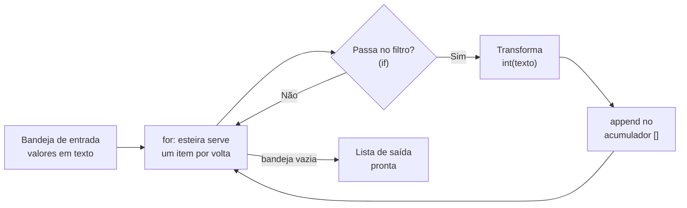

# 01.12 — Listas — parte 1

> **Módulo 01 — Python Fundamental** · Nível: N1 · Tempo estimado: 3h · Código: `codigo/cap12/`

## 1. Objetivo

- **Aplicar** criação, acesso, fatiamento e percurso de listas — reaproveitando toda a régua das strings.
- **Implementar** os três padrões de coleção: **acumular** (`append`), **filtrar** e **transformar** — o esqueleto de todo relatório.
- **Explicar** o que muda com o primeiro tipo **mutável** da trilha: alterar no lugar, sem criar objeto novo.
- **Prever** e tratar `IndexError` — e pagar as duas promessas vencidas: a máquina de troco e a tabela de vendas, refatoradas.

Ao final, "vários valores sob um nome" deixa de ser limitação contornada com variáveis numeradas — e os dados da Aurora ganham sua primeira estrutura de verdade.

---

## 2. Pré-requisitos

- [01.11 — Laço `for` e `range`](11-laco-for-e-range.md) — a esteira encontra aqui sua bandeja definitiva.
- [01.05 — Strings — parte 1](05-strings-parte-1.md) — índices, fatias e a régua (idênticos aqui).
- [01.03 — Variáveis, objetos e referências](03-variaveis-objetos-e-referencias.md) — o aviso sobre mutáveis, plantado lá, germina aqui.

**Autoteste:** (1) `"atlas"[1:4]` é...? (2) O que o `split(";")` do 01.06 devolvia (a caixa-preta)? (3) `s[0] = "X"` em string faz o quê? Se respondeu a 3 com segurança, prepare-se: a lista responde diferente — e essa diferença é o capítulo.

---

## 3. Motivação

Suas promessas venceram. A máquina de troco (01.04) tem seis degraus copiados porque as notas — 50, 20, 10, 5, 2, 1 — não tinham onde morar juntas. A tabela de vendas (01.06) tem três blocos idênticos porque cada linha vive numa variável própria: `linha_1`, `linha_2`, `linha_3`. E o balcão v3 atende a fila inteira... esquecendo cada pedido ao atender o próximo: no fechamento, você tem o total — mas não *quais* pedidos o compuseram.

O padrão é um só, e é o limite mais fundamental do que você sabia até ontem: **um nome, um valor**. Precisou de vários? Multiplicam-se variáveis (`nota_1`, `nota_2`...) — e com elas os blocos copiados, porque o `for` não percorre "um monte de variáveis parecidas": percorre **uma sequência**. Sem a estrutura que junta os valores, a esteira do 01.11 fica sem bandeja própria — servindo só strings e ranges, bandejas que vêm prontas.

A **lista** é a bandeja que você mesmo monta: vários valores, em ordem, sob um nome — criável vazia, crescível um a um (`append`), percorrível pelo `for`, fatiável pela régua que você já domina. E ela traz a novidade mais consequente do módulo: é o primeiro tipo **mutável** — dá para trocar um item *dentro dela*, sem criar objeto novo. Poder novo, regras novas: o aviso do 01.03 ("com mutáveis, as mesmas regras de etiquetas produzirão efeitos novos") começa a vencer aqui — e vence por completo no 01.13.

Este capítulo resolve isso assim: apresenta a lista com tudo que transfere de graça (índices, fatias, `len`, `in`, `for`), o `append` e a mutação por índice, os três padrões que estruturam 90% do código de dados — e cobra as duas promessas, com juros de elegância.

---

## 4. Modelo mental

> 🧠 **Modelo mental**
> A lista é o **trem de vagões destrancados**. A régua é a mesma das strings — vagões numerados do 0, negativos do fim, fatias com fim exclusivo — mas os lacres caíram: você pode **trocar a carga de um vagão** (`pedidos[0] = novo`), **engatar vagões no fim** (`append`) e **desengatar** — o trem é o mesmo objeto, reformado nos trilhos. E cada vagão aceita qualquer carga: números, strings... até outros trens.

**Exercício de previsão.** Sem rodar, decida o que imprime — e por que a linha 2 não explode:

```python
cidades = ["campinas", "santos", "campinas"]
cidades[1] = "guarulhos"
cidades.append("santos")
print(cidades)
print(len(cidades), cidades.count("campinas"))
```

*Resposta comentada:* `['campinas', 'guarulhos', 'campinas', 'santos']`, depois `4 2`. A linha 2 — que em string seria `TypeError` — aqui **funciona**: vagão destrancado, carga trocada no lugar. O `append` engatou o quarto vagão no **mesmo** trem (nenhuma lista nova foi criada — repare: sem `=` na linha 3!). E o `count` você conhece desde o 01.01 — era método de lista naquele primeiro exercício de leitura, e você o leu sem saber. Se algo aqui te surpreendeu, foi provavelmente a linha 2: guarde a surpresa — ela é a fronteira imutável/mutável, e o 01.13 mora do outro lado dela.

---

## 5. Analogia

A string é um **colar de contas soldadas** — para "trocar" uma conta, você fabrica outro colar. A lista é uma **prateleira de caixas etiquetadas por posição**: você troca o conteúdo da caixa 2 sem mexer nas outras, acrescenta caixas no fim da prateleira, tira caixas — e a prateleira continua sendo *a mesma prateleira*, no mesmo lugar do depósito (o mesmo objeto, o mesmo `id`). Quem tem um mapa para essa prateleira vê as mudanças — porque a prateleira mudou, não o mapa.

**Onde a analogia quebra:** numa prateleira real, tirar a caixa 2 deixa um buraco; na lista, os vagões seguintes **deslizam** — remover o item 2 renumera tudo dali em diante (o item 3 vira 2, e por aí vai). Essa renumeração automática é conveniente e traiçoeira: é ela que torna perigoso remover itens enquanto se percorre — armadilha com hora marcada (01.13). E a frase final da analogia — "quem tem um mapa vê as mudanças" — é mais profunda do que parece: dois mapas para a mesma prateleira veem as mesmas mudanças. Segure esse fio; o próximo capítulo puxa.

---

## 6. Teoria

### Criação e o que transfere de graça

```python
notas = [50, 20, 10, 5, 2, 1]        # literal: colchetes
vazia = []                            # o ponto de partida dos acumuladores
mista = ["PED-2026-00123", 46_990, True]   # tipos misturados: permitido
```

Da régua das strings, **tudo** transfere: `notas[0]` → `50`; `notas[-1]` → `1`; `notas[1:3]` → `[20, 10]` (fatia devolve **lista nova**); `len(notas)` → `6`; `50 in notas` → `True`; `for nota in notas:` — a esteira, enfim com bandeja própria. Até os erros transferem: índice fora explode (`IndexError`), fatia fora tolera. Um módulo inteiro de treino em strings pagando dividendos numa tabela só.

E a caixa-preta do 01.06 se abre oficialmente: o `split` sempre devolveu **uma lista** — `linha.split(";")` te entregava este capítulo em prestações. O caminho inverso também fecha: o `join` costura uma lista de strings (`" | ".join(campos)`).

### Mutabilidade: o poder novo

```python
precos = [4_990, 12_990, 46_990]
precos[1] = 11_990          # troca no lugar — MESMO objeto, conteúdo novo
```

Nenhuma lista nova, nenhuma reamarração — o objeto foi alterado por dentro. Confira com a lupa do 01.03: `id(precos)` antes e depois é **o mesmo**. Compare com a string, onde "modificar" era construir-outra-e-reamarrar: aqui a etiqueta fica parada e o **objeto** muda. É uma inversão silenciosa de tudo que você praticou — e a razão de o 01.13 existir.

### `append`: o acumulador de coleções

O método que engata no fim — e o quarto integrante dos padrões de acumulação (0 para somas, `""` para textos, e agora `[]` para coleções):

```python
aprovados = []                       # nasce vazia, FORA do laço (01.10!)
for codigo in ["PED-1", "XX-2", "PED-3"]:
    if codigo.startswith("PED"):
        aprovados.append(codigo)     # engata no MESMO trem
```

Atenção ao contrato: `append` **muta e devolve `None`** — o erro clássico `lista = lista.append(x)` destrói a lista (seção 11). Mutadores não se atribuem.

### Os três padrões de coleção

O esqueleto de virtualmente todo processamento de dados — memorize pela intenção, não pela sintaxe:

| Padrão | Pergunta | Forma |
|---|---|---|
| **Acumular** | "junte os resultados" | `resultado = []` + `for` + `append` |
| **Filtrar** | "só os que passam no teste" | acumular com `if` na frente do `append` |
| **Transformar** | "cada item, convertido" | acumular com a conversão dentro do `append` |

```python
valores_texto = ["46990", "12990", "899"]
valores = []                          # TRANSFORMAR: texto -> centavos int
for texto in valores_texto:
    valores.append(int(texto))

caros = []                            # FILTRAR: acima de R$ 100
for valor in valores:
    if valor > 10_000:
        caros.append(valor)
```

Filtrar-e-transformar combinam no mesmo laço (o `if` e a conversão convivem). No 01.17, estes três padrões ganharão uma sintaxe de uma linha (*comprehensions*) — que só faz sentido para quem os domina na forma longa: é por isso que a forma longa vem primeiro e se pratica muito.

### Percurso com posição: `enumerate`

Prometido no 01.11: quando o item **e** a posição importam (numerar o recibo!), a ferramenta é `enumerate` — a esteira que serve pares:

```python
for numero, codigo in enumerate(["PED-1", "PED-7", "PED-9"], start=1):
    print(f"{numero}. {codigo}")
# Saída: 1. PED-1  /  2. PED-7  /  3. PED-9  (uma por linha)
```

O `start=1` começa a numeração humana no 1. (O desempacotamento `numero, codigo` — duas etiquetas de uma vez — é apresentado por completo com as tuplas, 01.14; por ora, use o padrão como está: é idiomático e legível.)

---

## 7. Funcionamento interno

Por dentro, na medida N1: a lista não guarda os objetos "dentro de si" — guarda uma fileira de **referências** (etiquetas internas, uma por vagão) para objetos que vivem em outros lugares da memória. `precos[1] = 11_990` não destrói o objeto antigo: reamarra a *segunda etiqueta interna* para o objeto novo — mutação de lista é reamarração por dentro (o modelo do 01.03 escala para dentro das coleções; essa imagem vai render juros no 01.13). O `append` é barato na imensa maioria das vezes porque a lista reserva espaço extra ao crescer — engatar vagão quase nunca exige reconstruir o trem (a mecânica exata, com medição, é conversa do módulo 04/10). E é por guardar referências que a lista aceita tipos mistos sem esforço: para ela, tudo é etiqueta do mesmo tamanho.

---

## 8. Visualização do fluxo

O padrão filtrar-e-transformar — a linha de produção que estrutura o módulo 10 inteiro:



**Como ler:** a esteira do 01.11 no centro, o filtro do 01.09 no losango, o acumulador do 01.10 recebendo — este diagrama é a trilha inteira até aqui trabalhando junta. Repare que os reprovados voltam à esteira sem deixar rastro (não há "else" — eles apenas não entram no acumulador), e que a lista de saída só está "pronta" quando a bandeja de entrada esvazia. No módulo 10, troque os rótulos: a bandeja vira CSV de milhões de linhas, o filtro vira regra de qualidade, o acumulador vira tabela — o desenho não muda.

---

## 9. Aplicação prática

Pagamento das promessas, com juros. Rode:

```bash
python 01-Python/codigo/cap12/promessas_pagas.py
```

**Promessa 1 — a máquina de troco (01.04), refatorada.** Os seis degraus copiados viram um `for` sobre a lista de notas:

```text
--- Máquina de troco v2: 6 degraus viram 3 linhas ---
Troco de R$ 87: 1x R$50, 1x R$20, 1x R$10, 1x R$5, 1x R$2
Prova dos nove: 87 ✓
```

Abra o arquivo e compare com o seu D1 do 01.04: a *lógica* por degrau é idêntica (`quantas = resta // nota`, `resta %= nota`) — o que a lista eliminou foi a **cópia** dela. Mudar a política de notas (acabaram as de 10!) agora é editar a lista, não o código.

**Promessa 2 — a tabela de vendas (01.06), refatorada.** As três linhas sujas moram numa lista; a esteira de limpeza roda **uma vez**, no `for`:

```text
--- Tabela de vendas v2: 3 blocos viram 1 laço ---
 1. PED-2026-00123 | Fone Bluetooth Xz-9    | R$    469,90 | Campinas
 2. PED-2026-00124 | Mouse Sem Fio          | R$     89,90 | Santos
 3. PED-2026-00125 | Teclado Mecânico       | R$    349,00 | Campinas
Total do lote: R$ 908,80 | Pedidos de Campinas: 2
```

E os juros: numerar linhas (`enumerate`), somar o lote (acumulador numérico) e contar Campinas (filtro) custaram **três linhas extras** — na versão de blocos copiados, custariam outra rodada de cópias. É a primeira vez que você *sente* o motivo de coleções existirem: informação agregada nasce de graça quando os dados moram juntos.

> 🎯 **Checkpoint rápido**
> De cabeça: `vendas = []` dentro ou fora do `for`? E `vendas = vendas.append(v)` — o que sobra em `vendas`?

---

## 10. Código comentado

Arquivo completo em [`codigo/cap12/promessas_pagas.py`](codigo/cap12/promessas_pagas.py).

```python
# ------------------------------------------------------------
# promessas_pagas.py
# Capítulo 01.12 — Listas — parte 1
# O que este arquivo demonstra: a máquina de troco e a tabela de
#   vendas refatoradas com listas — acumular, filtrar, transformar
# Como executar: python promessas_pagas.py
# ------------------------------------------------------------

print("--- Máquina de troco v2: 6 degraus viram 3 linhas ---")
notas = [50, 20, 10, 5, 2, 1]        # a política de notas MORA em dados agora
troco = 87
resta = troco

partes = []                           # acumulador de coleção: nasce vazio, fora
for nota in notas:                    # a esteira percorre a política
    quantas = resta // nota           # a lógica de UM degrau (01.04), intacta
    resta = resta % nota
    if quantas > 0:                   # filtro: só notas usadas entram no recibo
        partes.append(f"{quantas}x R${nota}")

print(f"Troco de R$ {troco}: " + ", ".join(partes))   # join costura a lista

# Prova dos nove com o padrão transformar+acumular na forma compacta:
prova = 0
for parte in partes:
    quantas_texto = parte.split("x R$")[0]            # split devolve lista!
    valor_texto = parte.split("x R$")[1]
    prova += int(quantas_texto) * int(valor_texto)
print(f"Prova dos nove: {prova} " + ("✓" if prova == troco else "✗ DIVERGIU"))

print()
print("--- Tabela de vendas v2: 3 blocos viram 1 laço ---")
linhas_sujas = [                      # as 3 variáveis do 01.06 viram UMA lista
    "  PED-2026-00123 ; fone bluetooth XZ-9  ;46990; CAMPINAS ",
    "PED-2026-00124;  mouse sem fio ;8990;santos",
    " PED-2026-00125 ;TECLADO MECÂNICO; 34900 ;  Campinas",
]

total_lote = 0                        # acumulador numérico
de_campinas = 0                       # contador com filtro
for numero, linha in enumerate(linhas_sujas, start=1):
    campos = linha.split(";")         # a caixa-preta do 01.06, aberta: lista!
    codigo = campos[0].strip()
    produto = campos[1].strip().title()
    valor_centavos = int(campos[2].strip())
    cidade = campos[3].strip()
    cidade_canonica = cidade.lower()  # canônica p/ contar (01.06)

    total_lote += valor_centavos
    if cidade_canonica == "campinas":
        de_campinas += 1

    reais = f"{valor_centavos / 100:,.2f}"
    reais = reais.replace(",", "@").replace(".", ",").replace("@", ".")
    print(f"{numero:>2}. {codigo} | {produto:<22} | R$ {reais:>9} | {cidade.title()}")

reais_lote = f"{total_lote / 100:,.2f}".replace(",", "@").replace(".", ",").replace("@", ".")
print(f"Total do lote: R$ {reais_lote} | Pedidos de Campinas: {de_campinas}")
# Saída: (as duas tabelas mostradas na seção 9 do capítulo)
```

---

## 11. Erros comuns

### Erro 1 — `lista = lista.append(x)` (o assassinato por atribuição)

**Sintoma:** sem erro na hora — e depois:

```text
Traceback (most recent call last):
  File "caixa.py", line 5, in <module>
    print(len(pedidos))
TypeError: object of type 'NoneType' has no len()
```

**Causa:** `append` **muta** a lista e devolve `None` (contrato de todo mutador em Python — o oposto exato dos métodos de string, que devolviam a nova sem mutar nada). A atribuição joga fora a lista e amarra a etiqueta no `None`.
**Correção:** mutadores se chamam sem atribuição: `pedidos.append(x)`, linha própria. O contraste com o 01.06 merece ser dito em voz alta: **string: método devolve nova, guarde o retorno; lista: método muta, NÃO guarde o retorno.** Dois contratos, um critério — mutabilidade.

### Erro 2 — `IndexError` no vagão que não existe

**Sintoma:**

```text
Traceback (most recent call last):
  File "recibo.py", line 3, in <module>
    ultimo = pedidos[3]
IndexError: list index out of range
```

**Causa:** a mesma dos strings (01.05) — índice além de `len - 1` — com um agravante novo: o tamanho da lista **muda** durante o programa (appends, remoções), então o índice que valia na linha 10 pode não valer na 30.
**Correção:** os idiomas à prova de contagem: `pedidos[-1]` para o último; `if pedidos:` antes de acessar (truthiness — lista vazia é falsy!); e o mais importante: percorra com `for`, que nunca inventa índice. O `IndexError` em código com `for` idiomático é raridade — ele é doença de índice manual.

### Erro 3 — O acumulador global que devia ser por grupo

**Sintoma:** sem traceback — o relatório mostra o mesmo total absurdo para todas as cidades, ou o total do lote onde devia estar o subtotal.
**Causa:** parente do "acumulador renascendo" (01.10), invertido: o acumulador nasceu **uma vez só** quando a lógica pedia um por grupo — todos os grupos somam no mesmo balde.
**Correção:** pergunte a cada acumulador: *"um por execução, ou um por grupo?"* Total do lote: um só, fora do laço. Subtotal por cidade: um **por cidade** — que com as ferramentas de hoje significa laços/listas separados, desajeitado de propósito: o agrupamento elegante ("chave → acumulador") é exatamente o problema que os **dicionários** (01.15) nasceram para resolver. Sinta o desconforto; ele tem endereço.

> ⚠️ **Atenção**
> Neste capítulo, **não** faça `copia = original` esperando uma cópia de lista — você tem o conhecimento exato para prever o que acontece (01.03: duas etiquetas...), e a consequência completa — com as cirurgias de cópia certas — é o assunto inteiro do 01.13. Até lá, uma lista, uma etiqueta.

---

## 12. Boas práticas

✅ **Acumulador de coleção nasce vazio, fora do laço, com nome no plural: `aprovados = []`** — o trio do 01.10 vale para listas; o plural documenta "aqui dentro há vários".

✅ **Mutadores em linha própria, sem atribuição: `pedidos.append(pedido)`** — o contrato "muta e devolve None" nunca te pega se o gesto for esse.

✅ **Política em dados, lógica em código: `notas = [50, 20, ...]` + um laço** — o que muda com o negócio (notas, faixas, cidades) mora em listas; o que não muda (o algoritmo) mora no `for`. Mudança de política vira edição de dado.

✅ **`if lista:` para "tem algo?" — e `enumerate(..., start=1)` para numerar** — os dois idiomas que aposentam `len(...) > 0` e o contador manual paralelo.

❌ **Evite índice manual onde o `for` serve o item** — `pedidos[i]` com `i` artesanal é o andaime do 01.11 de volta, agora com `IndexError` de brinde.

❌ **Evite listas paralelas (`nomes[i]` casando com `valores[i]`)** — funcionam e apodrecem: um append esquecido dessincroniza tudo silenciosamente. O par que anda junto pede estrutura que os junte — tuplas (01.14) e dicionários (01.15) chegam para isso.

---

## 13. Performance

Nesta escala, irrelevante — e as duas notas honestas plantam colheitas próximas. Primeira: `append` é barato (a reserva de espaço da seção 7), e o padrão acumular-com-append é o jeito certo de construir listas — quem vem de outras linguagens às vezes pré-aloca por hábito; em Python, não precisa. Segunda: `valor in lista` **varre a lista inteira** no pior caso — imperceptível com 6 notas, relevante com cem mil clientes; guarde a semente: "verificar pertencimento rápido" tem estrutura própria (conjuntos, 01.16 — que fazem essa pergunta sem varrer). A fórmula do custo continua a mesma (`voltas × bloco`), e o módulo 10 a transformará em cronômetro.

---

## 14. Mercado

> 🏢 **Mercado**
> Os três padrões deste capítulo — acumular, filtrar, transformar — são, com esses nomes ou seus equivalentes (*map*, *filter*, *reduce*), o vocabulário universal do processamento de dados: são as operações do Pandas (módulo 10), do SQL (`WHERE` filtra, `SELECT` transforma — módulo 03), do Spark e de toda a família. Quem os domina na forma longa aprende as ferramentas grandes como *atalhos para o que já sabe* — quem não, decora receitas. E a decisão "política em dados, lógica em código" que você tomou com a lista de notas é uma das ideias mais rentáveis da engenharia: é ela que evolui para "faixas de frete no banco" (módulo 05) e "configuração fora do código" (06.12) — o princípio é o mesmo, a prateleira muda.
>
> **Mini-cenário:** o `linhas_sujas` de três itens do script de hoje é o ensaio geral do 01.22 — onde a lista virá de um arquivo CSV real com centenas de linhas de vendas da Aurora, e o mesmo laço (literalmente: copiar e colar) produzirá o relatório que a gestora pediu no primeiro dia do módulo. Três capítulos separam o balcão da promessa cumprida — e dois deles (dicionários, o agrupamento por cidade!) você já sabe por que precisa.

---

## 15. Entrevistas

**P1. "Qual a diferença fundamental entre listas e strings em Python?"**
*Resposta esperada:* ambas são sequências (índices, fatias, len, in, for — a régua compartilhada), mas a string é **imutável** (métodos devolvem nova) e a lista é **mutável** (métodos como append/sort alteram no lugar e devolvem None); listas aceitam tipos mistos e crescem. Nomear a consequência dos contratos opostos (guardar retorno × não guardar) mostra que você viveu os dois.

**P2. "Explique os padrões acumular/filtrar/transformar — e onde eles reaparecem."**
*Resposta esperada:* acumulador `[]` + for + append (juntar); com if (filtrar); com conversão (transformar); combináveis no mesmo laço. Reaparecem como comprehensions (sintaxe curta dos mesmos padrões), no SQL (WHERE/SELECT), no Pandas e na família map/filter. A conexão entre a forma longa e as ferramentas grandes é o que o entrevistador quer ouvir.

**P3. "O que `lista.append(x)` retorna — e por que esse design?"**
*Resposta esperada:* `None` — convenção do Python para mutadores: quem altera no lugar não devolve o objeto, forçando o código a distinguir mutação (linha própria) de criação (atribuição). Citar o contraste com strings (imutáveis: sempre devolvem nova) e o bug clássico `lista = lista.append(...)` fecha a resposta com cicatriz de quem já caiu.

**Pegadinha clássica: "O que imprime `letras = list("abc"); letras[0] = "X"; print(letras)` — e a string original 'abc' mudou?"**
Ela derruba em dois tempos. A saída forte: imprime `['X', 'b', 'c']` — o `list("abc")` **fabricou uma lista nova** com um vagão por caractere (a ponte oficial entre os dois mundos), e essa lista é mutável. E a string `"abc"`? **Intacta, como sempre** — imutável, ela nem poderia mudar; a lista tem cópias das referências aos caracteres, não um portal para dentro da string. Fechar com o idioma que essa dupla habilita: quando precisar "editar uma string", o caminho profissional é `list(s)` → cirurgias → `"".join(letras)` — mundo mutável para operar, imutável para viver.

---

## 16. Exercícios guiados

Enunciados completos em [`exercicios/cap12.md`](exercicios/cap12.md); gabaritos em [`exercicios/gabaritos/cap12.md`](exercicios/gabaritos/cap12.md).

### Aquecimento

- **A1** `[~10 min · a régua transfere]` — 8 previsões de índice/fatia/len/in sobre uma lista de pedidos.
- **A2** `[~10 min · mutação e append]` — 4 sequências de mutações: preveja o estado final da lista (e o que devolve cada operação).
- **A3** `[~5 min · os três padrões]` — Classifique 5 laços dados: acumular, filtrar, transformar (ou combinação).
- **A4** `[~5 min · string × lista]` — 4 pares de operações espelhadas: qual funciona, qual explode, por quê.

### Aplicação

- **AP1** `[~20 min · o caixa ganha memória]` — Evolua o caixa do 01.10: além de acumular o total, guarde cada valor numa lista; no fechamento: total, quantidade, ticket médio, maior e menor item (percorrendo — sem funções prontas de máximo).
- **AP2** `[~25 min · filtrar e transformar o lote]` — Da lista de linhas sujas (dada, com 6 linhas e 2 defeituosas), produza: a lista de valores válidos em centavos (transformar + filtrar os `isdigit`), a lista dos códigos rejeitados, e o relatório de ambas.
- **AP3** `[~20 min · enumerate no recibo]` — Refaça o recibo do balcão: itens numerados de 1, subtotal acumulado linha a linha, e a última linha destacada (`[-1]` + truthiness para o recibo vazio).

---

## 17. Desafios

- **D1** `[~50 min · o fechamento do dia, completo]` — **Caixa da Aurora v3.** Junte tudo: o laço de fila do balcão v3 (while), agora registrando cada pedido numa lista de valores em centavos. No fechamento: total, quantidade, ticket médio, maior e menor pedido, quantos acima de R$ 500 (filtro), e o **histograma horizontal** — uma linha por pedido, com `"#" * (valor // 10_000)` barras (cada # = R$ 100) e o número do pedido via enumerate. Recibo final digno, com o histograma alinhado. (Guarde este arquivo com carinho duplo: ele é o esqueleto exato do mini projeto do módulo, 01.25 — a diferença será os dados virem de arquivo em vez do teclado.)

<details><summary>💡 Dica 1 (conceito)</summary>
Maior/menor sem função pronta: acumuladores `maior = valores[0]` atualizados no for (`if v > maior: maior = v`) — cuidado com a lista vazia (truthiness antes!).
</details>
<details><summary>💡 Dica 2 (estratégia)</summary>
Construa em camadas testáveis: fila → lista populada → métricas → histograma. Rode e confira cada camada antes da próxima (transcrição no final).
</details>
<details><summary>💡 Dica 3 (esqueleto)</summary>
while da fila (com insistência) → valores.append por pedido → fechamento: if valores: métricas via for → for numero, v in enumerate(valores, 1): linha do histograma → else: caixa vazio.
</details>

---

## 18. Mini projeto

**Refatoração dupla certificada** `[~1h]` — as promessas pagas, pelas suas mãos, com medição.

Requisitos numerados:

1. **Troco v2:** refatore SEU `maquina_de_troco.py` (01.04/D1) para `codigo/cap12/maquina_de_troco_v2.py` com a lista de notas — mantendo prova dos nove e o caso de referência (87) batendo. Compare com a estimativa que você anotou no 01.11 (seção 9): acertou?
2. **Tabela v2:** refatore SUA `tabela_vendas.py` (01.06/D1) para `tabela_vendas_v2.py`: linhas numa lista, um laço, enumerate numerando — e os juros: total do lote e contagem por uma cidade escolhida.
3. Em ambos, o comentário de medição: linhas antes → depois, e a frase "o que agora é dado, o que continua código".
4. Teste de manutenção (a prova real da refatoração): no troco, remova a nota de 10 da lista (só o dado!) e rode — o programa deve se adaptar sozinho; na tabela, acrescente uma 4ª linha suja — idem. Cole as duas saídas adaptadas.

**Critério de "está bom":** comportamento idêntico aos originais nos casos de referência; os testes de manutenção passam **sem tocar na lógica**; medições honestas nos comentários. Refatorar-sem-quebrar com prova é gesto de gente grande — o Atlas vai exigi-lo a cada módulo, e o Git (módulo 02) vai registrá-lo com honras.

---

## 19. Revisão

**Resumo do capítulo:**

- Lista: sequência **mutável** de referências — a régua inteira das strings transfere (índices, fatias com fim exclusivo, len, in, for), e os lacres caem: `lista[i] = x` funciona, `append` engata no mesmo objeto.
- Contratos opostos por mutabilidade: métodos de string devolvem nova (guarde!); mutadores de lista alteram e devolvem `None` (não guarde! — `lista = lista.append(x)` mata a lista).
- Os três padrões de coleção: acumular (`[] + for + append`), filtrar (`if` antes do append), transformar (conversão dentro) — combináveis, e o vocabulário do processamento de dados inteiro.
- `enumerate(seq, start=1)` serve item **e** posição — o fim do contador paralelo; `if lista:` pergunta "tem algo?" (vazia é falsy).
- Política em dados, lógica em código: a lista de notas/faixas/cidades muda com o negócio sem tocar no laço.
- `split` sempre devolveu lista (caixa-preta do 01.06 paga); `list(s)` → cirurgias → `"".join()` é a ponte mutável↔imutável; e `copia = original` de lista fica **proibido até o 01.13** — por design.

**Flashcards novos** (adicionados a [`revisao/flashcards.md`](revisao/flashcards.md)):

| ID | Frente | Verso |
|---|---|---|
| 01.12-F1 | Preveja: `p = [10, 20]; p[0] = 99; p.append(30); print(p)` — e por que a linha 2 não explode? | (Previsão) `[99, 20, 30]` — lista é mutável: troca no lugar, mesmo objeto; em string seria TypeError. |
| 01.12-F2 | `pedidos = pedidos.append(x)` — o que sobra em `pedidos` e qual a regra que evita isso? | `None` (append muta e devolve None) — mutadores em linha própria, sem atribuição; o contrato oposto ao das strings. |
| 01.12-F3 | Explique com suas palavras: os três padrões de coleção e onde reaparecem. | (Elaboração) Acumular (juntar via append), filtrar (if antes), transformar (converter dentro) — reaparecem em comprehensions, SQL (WHERE/SELECT) e Pandas: o vocabulário do processamento de dados. |
| 01.12-F4 | Quando usar `enumerate` — e o que o `start=1` resolve? | (Decisão) Quando item E posição importam (numerar recibo): serve pares sem contador paralelo; start=1 dá numeração humana. |
| 01.12-F5 | "Política em dados, lógica em código" — o que significa, com o exemplo do troco? | Notas [50, 20, 10, 5, 2, 1] numa lista (o que muda com o negócio) + um for genérico (o que não muda): mudar política = editar dado, não código. |

**Agendamento:** registre no `PROGRESSO.md` e marque D+1, D+7, D+30, D+90 na [`Revisoes/agenda.md`](../Revisoes/agenda.md).

---

## 20. Checklist

Perguntas de domínio — teste do sim:

- [ ] Sei aplicar *a régua completa (índices, fatias, len, in, for) em listas sem hesitar*?
- [ ] Sei explicar *mutabilidade e os dois contratos opostos (string devolve / lista muta-e-None)*?
- [ ] Sei implementar *acumular, filtrar e transformar — separados e combinados*?
- [ ] Sei prever *e evitar o IndexError (idiomas -1, truthiness, for) e o append atribuído*?
- [ ] Sei responder *à pegadinha do `list("abc")` com a ponte entre os dois mundos*?

Itens práticos:

- [ ] Rodei `promessas_pagas.py` e comparei com meus originais do 01.04 e 01.06.
- [ ] Acertei (ou entendi por que errei) a previsão da seção 4 e o checkpoint da seção 9.
- [ ] Fiz Aquecimento e Aplicação (caixa com memória; lote filtrado; recibo numerado).
- [ ] Completei a refatoração dupla certificada (4 requisitos, testes de manutenção passando).
- [ ] Registrei a sessão e agendei as 4 revisões.

---

## 21. Próximo capítulo

Duas vezes este capítulo mordeu a língua: "não faça `copia = original` — ainda", "dois mapas para a mesma prateleira veem as mesmas mudanças — segure esse fio". Ficou deliberadamente em aberto a colisão anunciada desde o 01.03: o que acontece quando **duas etiquetas amarram o mesmo objeto mutável** — e uma delas "modifica a sua cópia"? A resposta tem nome (*aliasing*), é o bug silencioso mais famoso do Python, a pegadinha de entrevista número um — e o motivo de o telefonema da Motivação do 01.03 ("as variáveis estão mudando juntas!") existir. O próximo capítulo fecha o arco: você vai criar o bug, vê-lo corromper dados da Aurora, entendê-lo pelo modelo que já tem — e aprender as três cirurgias de cópia que o matam.

→ [01.13 — Listas — parte 2: métodos, cópias e aliasing](13-listas-parte-2-metodos-copias-e-aliasing.md)

---

*Gerado sob spec 3.0.0*
