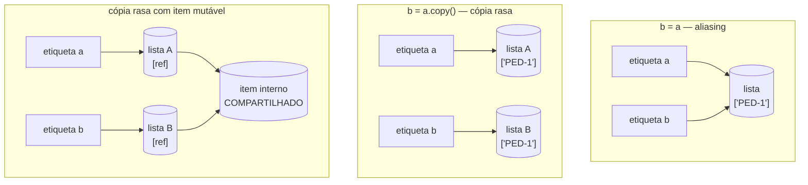

# 01.13 — Listas — parte 2: métodos, cópias e aliasing

> **Módulo 01 — Python Fundamental** · Nível: N2 · Tempo estimado: 3h · Código: `codigo/cap13/`

## 1. Objetivo

- **Depurar** bugs de **aliasing** — duas etiquetas no mesmo objeto mutável — usando o modelo do 01.03 como instrumento de diagnóstico.
- **Diferenciar** cópia rasa (`copy()`, `[:]`, `list()`) de cópia profunda — e prever exatamente onde a rasa falha.
- **Aplicar** os métodos de lista sabendo, para cada um, se ele **muta** (devolve `None`) ou **devolve novo**.
- **Prever** o comportamento de passar lista para função — o arco que fecha no 01.19.

Ao final, você terá criado, diagnosticado e matado o bug silencioso mais famoso do Python — e nunca mais escreverá `copia = original` sem saber exatamente o que acontece.

---

## 2. Pré-requisitos

- [01.12 — Listas — parte 1](12-listas-parte-1.md) — mutabilidade, `append`, os três padrões.
- [01.03 — Variáveis, objetos e referências](03-variaveis-objetos-e-referencias.md) — **releia a seção 6 antes de começar**: o modelo de etiquetas é a única ferramenta que você precisa aqui, e ele foi plantado exatamente para hoje.

**Autoteste:** (1) `b = a` copia o objeto ou a amarração? (2) O que `precos.append(x)` devolve? (3) Por que a mesma frase do item 1 era inofensiva com strings? Se a 3 não saiu limpa, a resposta é o capítulo inteiro.

---

## 3. Motivação

O telefonema do 01.03 finalmente acontece. Você escreveu, no relatório da Aurora:

```python
pedidos_originais = ["PED-1", "PED-2", "PED-3"]
pedidos_processados = pedidos_originais       # "uma cópia para trabalhar"
pedidos_processados.append("PED-4")           # marca o processamento
print(len(pedidos_originais))                 # ...4?!
```

Nenhum erro. Nenhum aviso. O "original" tem quatro pedidos — e você jura que só mexeu na cópia. Se isso acontecesse num pipeline da Aurora com dados de venda, o resultado seria pior que um traceback: **relatórios errados que parecem certos**, números que não batem entre si sem explicação, e horas de caça a um fantasma.

O fantasma tem nome — **aliasing** (*aliasing*, "apelidamento") — e é a razão pela qual o 01.03 gastou um capítulo inteiro ensinando etiquetas e objetos quando você "só queria aprender variáveis". Aquele modelo não era filosofia: era vacina. Com ele, o telefonema acima não é mistério nenhum — é a linha 2 lida corretamente: *"amarre a etiqueta `pedidos_processados` no objeto que `pedidos_originais` aponta"*. Uma lista, duas etiquetas. O `append` engatou um vagão no único trem que existe.

O que mudou entre o 01.03 e hoje: naquele capítulo, todos os objetos eram **imutáveis** — compartilhar era inofensivo, porque ninguém conseguia alterá-los. Agora existem objetos que se alteram por dentro, e o compartilhamento silencioso vira corrupção silenciosa.

Este capítulo resolve isso assim: cria o bug de propósito, disseca-o com `id()`, apresenta as três cirurgias de cópia (e o caso em que a mais comum delas **também falha**), cataloga os métodos por contrato — e deixa o terreno pronto para a última encarnação do fantasma, no 01.19.

---

## 4. Modelo mental

> 🧠 **Modelo mental**
> Nada mudou desde o 01.03 — e é exatamente esse o ponto. `b = a` **nunca** copiou objeto nenhum: sempre copiou a amarração. O que mudou é a **consequência**: com imutáveis, duas etiquetas no mesmo objeto é economia invisível; com mutáveis, é **linha telefônica compartilhada** — o que um lado fala, o outro escuta. Corolário operacional: para ter um objeto separado, é preciso **pedir uma cópia explicitamente**; o Python nunca copia por conta própria.

**Exercício de previsão.** Sem rodar, decida a saída das duas cenas — e por que elas diferem:

```python
# Cena A — imutáveis
a = "PED-1"
b = a
b = b + " (processado)"
print(a)

# Cena B — mutáveis
x = ["PED-1"]
y = x
y.append("processado")
print(x)
```

*Resposta comentada:* Cena A imprime `PED-1` (intacto); Cena B imprime `['PED-1', 'processado']` (alterado!). **A diferença não está nas etiquetas — está no verbo.** Na Cena A, `b = b + ...` **reamarra** `b` num objeto novo (o antigo continua com `a`). Na Cena B, `y.append(...)` **muta o objeto** que as duas etiquetas compartilham — ninguém reamarrou nada, e por isso `x` vê. Reamarrar afeta uma etiqueta; mutar afeta todas.

---

## 5. Analogia

Duas etiquetas na mesma lista são **dois controles remotos para a mesma TV**. Trocar o canal por qualquer um deles muda a TV — e o outro controle "vê" a mudança, porque não há duas TVs. Já **reamarrar** uma etiqueta é pegar um dos controles e pareá-lo com **outra** TV: dali em diante ele opera outra coisa, e a TV original continua no canal em que estava. A cópia (`copy()`) é comprar uma segunda TV e configurá-la igual à primeira: a partir daí, controles independentes, aparelhos independentes.

**Onde a analogia quebra:** TVs não contêm outras TVs. Listas contêm listas — e é aí que a cópia rasa mostra seu limite: comprar uma segunda TV **que compartilha o mesmo home theater embutido** da primeira. O invólucro é novo; o miolo é compartilhado. Essa é a diferença entre cópia rasa e profunda, e o motivo de a seção 6 insistir nela.

---

## 6. Teoria

### O diagnóstico: `id()` como estetoscópio

A ferramenta de investigação você já tem desde o 01.03:

```python
originais = ["PED-1", "PED-2"]
processados = originais
print(id(originais) == id(processados))   # True  -> MESMO objeto: aliasing
print(originais is processados)            # True  -> a forma idiomática
```

Regra de ouro do diagnóstico: **suspeitou de aliasing, imprima os `id` (ou use `is`)**. `True` significa "não há duas listas". É a diferença entre depurar por hipótese e depurar por chute.

### As três cirurgias de cópia rasa

Três formas equivalentes de pedir uma lista nova com os mesmos itens:

```python
copia_1 = originais.copy()     # explícita — a preferida da trilha
copia_2 = originais[:]         # fatia completa (idioma antigo, ainda comum)
copia_3 = list(originais)      # construtor (útil para converter, também copia)
```

Depois de qualquer uma: `copia is originais` → `False`. Mutar a cópia não afeta o original — **problema resolvido**, para listas de valores simples (números, strings — os imutáveis do módulo).

### Onde a cópia rasa falha: listas dentro de listas

**Cópia rasa** (*shallow copy*) duplica o **invólucro**, não o conteúdo: os vagões do trem novo apontam para os **mesmos** objetos do trem velho. Com itens imutáveis, ninguém percebe (não há como alterá-los). Com itens **mutáveis** — listas dentro de listas — o fantasma volta:

```python
lote_a = [["PED-1", 100], ["PED-2", 200]]
lote_b = lote_a.copy()          # invólucro novo...
lote_b[0].append("processado")  # ...mas o item 0 é o MESMO objeto
print(lote_a[0])
# Saída: ['PED-1', 100, 'processado']   <- o original mudou!
```

A cirurgia certa para estruturas aninhadas é a **cópia profunda** (*deep copy*), que duplica recursivamente:

```python
import copy
lote_b = copy.deepcopy(lote_a)   # invólucro E conteúdo, tudo novo
```

> 📦 **Caixa-preta: `import copy`**
> A linha `import copy` traz para o seu programa um módulo da biblioteca padrão (01.01) com ferramentas de cópia. Por enquanto, use-a como está — o mecanismo completo de `import` (o que é um módulo, como o Python o encontra, o `if __name__`) é o capítulo 01.20.

O critério prático, para não virar paranoia: **lista de valores simples → cópia rasa resolve; lista de listas (ou de objetos mutáveis) → deepcopy**.

### Os métodos de lista, catalogados por contrato

A pergunta que resolve todos: *muta (devolve `None`) ou devolve novo?*

| Método | Contrato | O que faz |
|---|---|---|
| `append(x)` | **muta** | engata um item no fim |
| `extend(outra)` | **muta** | engata todos os itens de outra sequência |
| `insert(i, x)` | **muta** | insere na posição i (os seguintes deslizam) |
| `remove(x)` | **muta** | remove a **primeira** ocorrência do valor (`ValueError` se ausente) |
| `pop(i)` | **muta e devolve o item** | remove e entrega (sem argumento: o último) |
| `clear()` | **muta** | esvazia |
| `sort()` | **muta** | ordena **no lugar** |
| `reverse()` | **muta** | inverte no lugar |
| `copy()` | **devolve novo** | cópia rasa |
| `count(x)`, `index(x)` | **devolvem valor** | contagem; posição da 1ª ocorrência |

E o par que causa mais confusão de todos — porque parecem sinônimos e têm contratos opostos:

| Muta no lugar | Devolve nova | 
|---|---|
| `lista.sort()` → `None` | `sorted(lista)` → lista nova ordenada |
| `lista.reverse()` → `None` | `reversed(lista)` (percorrível) / `lista[::-1]` → nova |

Escolha pelo que você quer preservar: precisa do original intacto? `sorted`. Vai substituir mesmo? `sort()`. E o clássico `ordenada = lista.sort()` produz `None` — o mesmo assassinato do `append` (01.12), com outra arma.

### Ordenação com critério: `key`

`sort()` e `sorted()` aceitam um critério — a promessa de "ordenar por outra coisa":

```python
produtos = ["Teclado", "fone", "Mouse"]
print(sorted(produtos))                      # ['Mouse', 'Teclado', 'fone'] — Unicode!
print(sorted(produtos, key=str.lower))       # ['fone', 'Mouse', 'Teclado'] — canônico
print(sorted([300, 100, 200], reverse=True)) # [300, 200, 100]
```

O `key=str.lower` diz "compare pela versão minúscula" — e resolve o susto da ordenação por Unicode (maiúsculas antes de minúsculas, a régua do 01.08). O mecanismo completo de passar funções como argumento é o 04.02; hoje, use as formas prontas: `key=str.lower`, `key=len`.

### Remover enquanto percorre: a armadilha anunciada

O 01.12 avisou que remover renumera a lista. Percorrer e remover ao mesmo tempo é o resultado previsível:

```python
valores = [10, 0, 0, 20]
for v in valores:
    if v == 0:
        valores.remove(v)     # a esteira perde o passo
print(valores)
# Saída: [10, 0, 20]          <- sobrou um zero!
```

Causa: a esteira avança por posição enquanto os itens deslizam para trás. Correção profissional: **construa uma lista nova** (o padrão filtrar do 01.12) — `sem_zeros = [v for v in valores if v != 0]` no futuro (01.17), e hoje com `for` + `append`. Regra: não se reforma o trem enquanto se caminha por ele.

---

## 7. Funcionamento interno

Por dentro, na medida N2 deste capítulo: a lista guarda uma fileira de **referências** (01.12/seção 7) — e é literalmente isso que `copy()` duplica: a fileira, não os alvos. Por isso a cópia rasa é barata (copiar N referências) e por isso ela vaza com aninhamento (as referências novas apontam aos mesmos objetos). O `deepcopy` percorre a estrutura recursivamente criando objetos novos — mais caro, e com sutilezas próprias (referências circulares são tratadas; objetos exóticos podem exigir cuidado). Sobre `sort()`: o Python usa **Timsort**, um algoritmo estável (mantém a ordem relativa de itens equivalentes — o que permite ordenar por dois critérios em duas passadas) e adaptativo a dados parcialmente ordenados; ordenar é `O(n log n)` — a notação chega formalmente no módulo 10, mas a intuição fica: ordenar custa mais que percorrer, e muito menos que comparar todos com todos.

---

## 8. Visualização do fluxo

O nascimento do bug — e as duas cirurgias, lado a lado:



**Como ler:** no primeiro quadro, duas etiquetas e **uma** lista — mutar por qualquer via afeta ambas (o bug). No segundo, duas listas independentes — mutação isolada (o conserto). No terceiro está a pegadinha do capítulo: os invólucros são dois, mas o **item interno é um só** — `b[0].append(...)` volta a afetar `a`. Olhe as setas: onde duas chegam no mesmo cilindro, há telefone compartilhado.

---

## 9. Aplicação prática

Criar o bug, diagnosticá-lo, matá-lo — nessa ordem. Rode:

```bash
python 01-Python/codigo/cap13/o_fantasma_do_aliasing.py
```

```text
--- Cena 1: o telefonema (o bug nascendo) ---
originais: ['PED-1', 'PED-2', 'PED-3']
processados: ['PED-1', 'PED-2', 'PED-3']
Após processados.append('PED-4'):
originais: ['PED-1', 'PED-2', 'PED-3', 'PED-4']   <- o "original" mudou!

--- Cena 2: o diagnóstico (id como estetoscópio) ---
originais is processados: True   -> não há duas listas, há duas etiquetas

--- Cena 3: a cirurgia (copy) ---
originais is copia: False
Após copia.append('PED-9'): originais segue com 4 itens ✓

--- Cena 4: a pegadinha (rasa não resolve com aninhamento) ---
lote_a[0] após mexer só em lote_b[0]: ['PED-1', 100, 'processado']  <- vazou!
Com deepcopy: lote_a[0] = ['PED-1', 100] ✓ intacto
```

Depois de rodar, faça o **teste do estetoscópio** no seu próprio código: abra o `caixa_da_aurora_v3.py` (01.12/D1) e procure qualquer linha em que uma lista é atribuída a outra etiqueta. Achou? Rode `is` entre as duas e descubra se você tem uma lista ou duas. (Se não achou nenhuma, ótimo — mas guarde o gesto: no módulo 10, ele vai te salvar de um dia inteiro de caça.)

> 🎯 **Checkpoint rápido**
> De cabeça: `ordenados = precos.sort()` — o que fica em `ordenados` e o que acontece com `precos`? E qual seria a linha correta se você quisesse **preservar** `precos`?

---

## 10. Código comentado

Arquivo completo em [`codigo/cap13/o_fantasma_do_aliasing.py`](codigo/cap13/o_fantasma_do_aliasing.py).

```python
# ------------------------------------------------------------
# o_fantasma_do_aliasing.py
# Capítulo 01.13 — Listas parte 2: métodos, cópias e aliasing
# O que este arquivo demonstra: o bug de aliasing nascendo, o
#   diagnóstico com is/id, a cópia rasa e o limite dela (deepcopy)
# Como executar: python o_fantasma_do_aliasing.py
# ------------------------------------------------------------

import copy                      # caixa-preta até 01.20: traz deepcopy

print("--- Cena 1: o telefonema (o bug nascendo) ---")
originais = ["PED-1", "PED-2", "PED-3"]
processados = originais          # NÃO é cópia: é segunda etiqueta (01.03)

print("originais:", originais)
print("processados:", processados)

processados.append("PED-4")      # muta O OBJETO — as duas etiquetas veem
print("Após processados.append('PED-4'):")
print("originais:", originais, "  <- o \"original\" mudou!")

print()
print("--- Cena 2: o diagnóstico (id como estetoscópio) ---")
print("originais is processados:", originais is processados,
      "  -> não há duas listas, há duas etiquetas")

print()
print("--- Cena 3: a cirurgia (copy) ---")
originais = ["PED-1", "PED-2", "PED-3", "PED-4"]   # recomeço limpo
copia = originais.copy()         # lista NOVA com os mesmos itens
print("originais is copia:", copia is originais)
copia.append("PED-9")
print(f"Após copia.append('PED-9'): originais segue com {len(originais)} itens ✓")

print()
print("--- Cena 4: a pegadinha (rasa não resolve com aninhamento) ---")
lote_a = [["PED-1", 100], ["PED-2", 200]]
lote_b = lote_a.copy()           # invólucro novo, itens COMPARTILHADOS
lote_b[0].append("processado")   # mexe no item interno — que é o mesmo objeto
print("lote_a[0] após mexer só em lote_b[0]:", lote_a[0], " <- vazou!")

lote_a = [["PED-1", 100], ["PED-2", 200]]          # recomeço limpo
lote_c = copy.deepcopy(lote_a)   # invólucro E conteúdo, tudo novo
lote_c[0].append("processado")
print("Com deepcopy: lote_a[0] =", lote_a[0], "✓ intacto")

print()
print("--- Bônus: sort (muta) x sorted (devolve nova) ---")
precos = [30_000, 4_990, 12_990]
ordenados = sorted(precos)       # nova lista ordenada; precos intacto
print("sorted -> ", ordenados, "| precos preservado:", precos)
precos.sort()                    # muta no lugar e devolve None
print("após precos.sort() ->", precos)
# Saída: (as quatro cenas mostradas na seção 9 do capítulo)
```

---

## 11. Erros comuns

### Erro 1 — `copia = original` (o aliasing acidental)

**Sintoma:** sem traceback — dados "originais" que mudam sozinhos; relatórios que não batem entre si; um `len()` maior do que deveria.
**Causa:** a linha copia a **amarração**, não o objeto: uma lista, duas etiquetas (01.03, literalmente).
**Correção:** peça a cópia (`original.copy()`), e confirme com o estetoscópio (`copia is original` → deve dar `False`). Prevenção cultural: ao escrever qualquer `x = y` em que `y` é lista, faça a pergunta em voz alta — *"quero duas listas ou dois nomes para a mesma?"*.

### Erro 2 — `ordenada = lista.sort()` (o mutador atribuído, segunda encarnação)

**Sintoma:**

```text
Traceback (most recent call last):
  File "relatorio.py", line 4, in <module>
    print(ordenada[0])
TypeError: 'NoneType' object is not subscriptable
```

**Causa:** `sort()` muta e devolve `None` (o contrato dos mutadores, 01.12) — a atribuição destrói a referência à lista.
**Correção:** decida pelo verbo: preservar → `ordenada = sorted(lista)`; substituir → `lista.sort()` em linha própria. E note a família: `append`, `sort`, `reverse`, `extend`, `clear` — todos mutadores, todos `None`.

> ⚠️ **Atenção**
> O erro aparece **tarde** — só quando alguém usa a variável — e a mensagem fala de `NoneType`, não de listas. Quando vir `'NoneType' object ...` em código com coleções, o primeiro suspeito é sempre um mutador atribuído; procure o `= lista.` mais próximo.

### Erro 3 — Cópia rasa em estrutura aninhada (o vazamento)

**Sintoma:** sem erro — a cópia "funciona" nos testes com listas simples e falha em produção, quando os dados ganham um nível a mais (lista de pedidos, cada um com sua lista de itens).
**Causa:** `copy()` duplica só o invólucro; itens mutáveis continuam compartilhados (o terceiro quadro do diagrama).
**Correção:** `copy.deepcopy()` para estruturas aninhadas — e a alternativa arquitetural que o 04 vai apresentar: preferir estruturas **imutáveis** onde possível (tuplas, 01.14), que não têm o problema por construção. O critério fica: um nível de valores simples → rasa; aninhado → profunda ou repensar a estrutura.

---

## 12. Boas práticas

✅ **Ao atribuir lista a novo nome, declare a intenção em voz alta** — "quero dois nomes ou duas listas?"; a resposta escolhe entre `=` e `.copy()`.

✅ **`is` como estetoscópio na primeira suspeita** — dois segundos que separam depuração por hipótese de caça ao fantasma.

✅ **`sorted`/`[::-1]` quando o original importa; `sort()`/`reverse()` quando não** — a escolha é semântica, não estilo: você está declarando se aquele dado é histórico ou rascunho.

✅ **Nunca modifique a lista que está percorrendo — construa outra** — o padrão filtrar do 01.12 é a resposta; a esteira e a reforma não convivem.

❌ **Evite `deepcopy` por precaução em tudo** — é caro e mascara o entendimento; use quando há aninhamento real, com a razão comentada.

❌ **Evite guardar o retorno de mutadores** — `x = lista.append(...)`, `x = lista.sort()`; o `None` cobra a conta lá na frente, longe do crime.

---

## 13. Performance

Nesta escala, irrelevante — e com três notas honestas que valem para sempre. **Cópia rasa** custa proporcional ao número de itens (copiar referências) — barata; **deepcopy** custa proporcional à estrutura inteira e cria objetos — cara, e por isso não se usa "por via das dúvidas". **Ordenação** é `O(n log n)`: mais cara que percorrer, e ordenar mil vezes uma lista que muda pouco é desperdício clássico (o padrão profissional é manter ordenado ou ordenar uma vez no fim). E `remove(x)`/`in` varrem a lista — o aviso do 01.12 continua de pé: pertencimento frequente pede conjunto (01.16). Medição real, com cronômetro e milhões de itens: módulo 10.

---

## 14. Mercado

> 🏢 **Mercado**
> Aliasing é a **pegadinha nº 1 de entrevistas de Python** no Brasil e no mundo — e não por maldade: bugs de mutação compartilhada são caros de verdade em produção, porque corrompem dados sem produzir erro. Times maduros os combatem com três estratégias que você verá na trilha: preferir estruturas imutáveis (tuplas — 01.14; `frozen` dataclasses — 04.13), **não mutar argumentos** de função (a regra do 01.19), e trabalhar com transformações que devolvem novos dados em vez de alterar os existentes (a filosofia do Pandas e do Polars — módulo 10, onde a mesma discussão reaparece com o nome de "cópia vs. view", e onde um `SettingWithCopyWarning` mal compreendido já custou muito relatório errado).
>
> **Mini-cenário:** o pipeline noturno da Aurora (módulo 10) lerá as vendas do dia numa lista, e três relatórios diferentes trabalharão sobre ela. Se um deles "ordenar para facilitar" com `sort()`, os outros dois receberão dados em outra ordem — e o relatório de "últimas 10 vendas" mostrará as 10 mais baratas. Nenhum erro, três meses de números estranhos. O antídoto é uma linha: `sorted(vendas)`.

---

## 15. Entrevistas

**P1. "O que é aliasing? Dê um exemplo e diga como evitar."**
*Resposta esperada:* duas ou mais etiquetas referenciando o **mesmo** objeto mutável — mutação por qualquer uma é vista por todas; exemplo com `b = a` + `append`; diagnóstico com `is`/`id`; prevenção: cópia explícita (`copy()`), estruturas imutáveis, não mutar o que se recebe. Ligar ao modelo "atribuição copia referência, não objeto" mostra fundamento, não decoreba.

**P2. "Qual a diferença entre cópia rasa e profunda? Quando cada uma?"**
*Resposta esperada:* rasa duplica o invólucro (itens compartilhados — `copy()`, `[:]`, `list()`); profunda duplica recursivamente (`copy.deepcopy`). Rasa é suficiente com itens imutáveis; aninhamento mutável exige profunda (ou redesenho para imutáveis). Citar o custo (deepcopy é cara) demonstra critério de engenharia.

**P3. "Diferença entre `lista.sort()` e `sorted(lista)`?"**
*Resposta esperada:* `sort()` muta no lugar e devolve `None` (só para listas); `sorted()` devolve **nova** lista ordenada e aceita qualquer iterável; escolha pela necessidade de preservar o original. Bônus de fluência: ambos aceitam `key` e `reverse`, e o Timsort é estável — o que permite ordenação por múltiplos critérios em passadas sucessivas.

**Pegadinha clássica: "`a = [[0] * 3] * 3` cria uma matriz 3×3. Por que `a[0][0] = 9` altera três linhas?"**
Ela derruba quem lê `* 3` como "faça três cópias". A saída forte: a multiplicação de lista **repete a mesma referência** três vezes — o invólucro externo tem 3 vagões apontando para **uma única** lista interna; alterar por um índice altera "todas as linhas" porque só existe uma. O conserto: construir com repetição real (`[[0] * 3 for _ in range(3)]` — comprehension do 01.17, ou `for` + `append` hoje), criando uma lista interna nova por linha. Fechar conectando: é o mesmo fenômeno da cópia rasa aninhada — invólucro novo, miolo compartilhado.

---

## 16. Exercícios guiados

Enunciados completos em [`exercicios/cap13.md`](exercicios/cap13.md); gabaritos em [`exercicios/gabaritos/cap13.md`](exercicios/gabaritos/cap13.md).

### Aquecimento

- **A1** `[~10 min · previsão de aliasing]` — 6 cenas (imutáveis e mutáveis, reamarrar × mutar): preveja o estado final de cada etiqueta.
- **A2** `[~5 min · contratos]` — Classifique 10 métodos: muta (None) ou devolve novo?
- **A3** `[~10 min · rasa ou profunda?]` — 4 estruturas: diga qual cirurgia é suficiente e por quê.
- **A4** `[~5 min · sort × sorted]` — 4 trechos: qual preserva o original, qual devolve None, qual explode.

### Aplicação

- **AP1** `[~20 min · autópsia do fantasma]` — Dado um script com 3 bugs de aliasing plantados (relatório da Aurora), diagnostique cada um com `is`, explique em uma linha e corrija.
- **AP2** `[~20 min · ordenações do relatório]` — Com a lista de vendas: top 3 mais caras (preservando a original), ordem alfabética por produto (case-insensitive), e a lista invertida — provando com `is`/prints que a original sobreviveu.
- **AP3** `[~20 min · a matriz que não era]` — Construa a matriz 3×3 pelo caminho errado (`[[0]*3]*3`) e pelo certo; prove a diferença com `is` e mutações; escreva a explicação com suas palavras.

---

## 17. Desafios

- **D1** `[~50 min · o histórico imutável]` — **Livro-caixa da Aurora.** Implemente um registro de vendas do dia que preserva o histórico: uma lista `vendas` que só cresce (append) e **nunca** é ordenada nem filtrada no lugar. Sobre ela, produza 4 visões — top 3 por valor, ordem alfabética por produto, só as de Campinas, e a lista na ordem inversa de chegada — **cada uma sem alterar a original** (prove com `is` e com o print da original ao fim de cada visão). Depois, o teste de sabotagem: escreva de propósito uma versão "descuidada" de uma das visões (com `sort()` no lugar) e demonstre, com saída lado a lado, o dano que ela causaria nas outras três. Feche com 5 linhas: por que "dados históricos não se mutam" é regra de arquitetura, não preciosismo.

<details><summary>💡 Dica 1 (conceito)</summary>
Cada visão é uma lista NOVA: sorted(...), sorted(..., key=...), filtro com for+append, e a fatia [::-1].
</details>
<details><summary>💡 Dica 2 (estratégia)</summary>
Para a sabotagem: rode as 4 visões, depois rode a versão com sort() e as 4 de novo — a diferença aparece nas visões que dependiam da ordem de chegada.
</details>
<details><summary>💡 Dica 3 (esqueleto)</summary>
vendas (lista de listas [produto, valor, cidade]) → 4 visões com prova de integridade → bloco de sabotagem → conclusão comentada.
</details>

---

## 18. Mini projeto

**Auditoria de mutação no seu próprio código** `[~1h]` — o capítulo aplicado ao que você já escreveu.

Requisitos numerados:

1. Crie `codigo/cap13/auditoria.md` (relatório) e revise **três** dos seus arquivos anteriores (sugestão: `caixa_da_aurora_v3.py` do 01.12/D1, `promessas_pagas` refatorado, e o balcão v3).
2. Para cada arquivo, liste: toda linha que atribui lista a nome novo (`x = y`), todo uso de mutador (`append`, `sort`, `remove`...), e todo lugar onde uma lista é usada depois de mutada. Classifique cada achado: **seguro** / **arriscado** / **bug real**.
3. Corrija os bugs reais e os arriscados, com uma linha de justificativa por correção.
4. Acrescente ao seu `socorro-execucao.md` (01.02) três fichas novas: `'NoneType' object is not subscriptable`, "dados mudando sozinhos" e "cópia que não copiou" — cada uma com sintoma → diagnóstico (`is`!) → conserto.
5. Se nenhum bug real existir (possível — seu código tem sido linear), documente isso e **injete** um de propósito num arquivo de teste, prove-o com `is`, e conserte: o objetivo é ter feito a caça, não ter culpados.

**Critério de "está bom":** os três arquivos auditados linha a linha (não "de olho"); classificação com justificativa; as três fichas novas no guia; e a caça documentada com evidência (`is`). Esta auditoria é um ensaio de *code review* — o gesto que o mercado chama de revisar código, e que o módulo 12 automatizará em partes.

---

## 19. Revisão

**Resumo do capítulo:**

- **Aliasing**: `b = a` copia a amarração, nunca o objeto — com mutáveis, as duas etiquetas veem toda mutação; diagnóstico: `a is b` / `id()`.
- Reamarrar (`b = b + x`) afeta uma etiqueta; **mutar** (`b.append(x)`) afeta o objeto — e, portanto, todas as etiquetas. O verbo decide.
- Cirurgias: `copy()`, `[:]`, `list()` para cópia **rasa** (invólucro novo, itens compartilhados) — é suficiente com itens imutáveis; `copy.deepcopy()` para estruturas **aninhadas**.
- Contratos dos métodos: mutadores (`append`, `extend`, `insert`, `remove`, `pop`, `clear`, `sort`, `reverse`) devolvem `None`; `sorted`/`[::-1]`/`copy` devolvem novo. `ordenada = lista.sort()` mata a lista.
- `sort`/`sorted` aceitam `key` (ex.: `key=str.lower` para ordem canônica) e `reverse`; Timsort é estável.
- Não se modifica a lista que se percorre — construa outra (padrão filtrar); e `[[0]*3]*3` repete referência, não conteúdo.

**Flashcards novos** (adicionados a [`revisao/flashcards.md`](revisao/flashcards.md)):

| ID | Frente | Verso |
|---|---|---|
| 01.13-F1 | Preveja: `x = ["A"]; y = x; y.append("B"); print(x)` — e por que difere do caso com strings? | (Previsão) `['A', 'B']` — mutar o objeto compartilhado; com strings, `y = y + "B"` REAMARRA y e não toca em x. O verbo decide. |
| 01.13-F2 | Explique com suas palavras: cópia rasa × profunda, e quando cada uma é suficiente. | (Elaboração) Rasa duplica o invólucro (itens compartilhados) — é suficiente com itens imutáveis; profunda (deepcopy) duplica tudo — necessária com listas dentro de listas. |
| 01.13-F3 | `ordenada = precos.sort()` — o que fica em `ordenada`, e qual a linha correta para preservar `precos`? | `None` (sort muta e devolve None). Correta: `ordenada = sorted(precos)`. |
| 01.13-F4 | Qual o primeiro gesto ao suspeitar que "os dados estão mudando sozinhos"? | (Decisão) Estetoscópio: `a is b` (ou id) — True significa uma lista com dois nomes; a cirurgia é `.copy()` (ou deepcopy, se aninhado). |
| 01.13-F5 | Por que `a = [[0]*3]*3` faz `a[0][0] = 9` alterar "três linhas"? | A multiplicação repete a mesma referência: existe UMA lista interna com 3 apontamentos. Conserto: criar uma lista nova por linha (for+append ou comprehension). |

**Agendamento:** registre no `PROGRESSO.md` e marque D+1, D+7, D+30, D+90 na [`Revisoes/agenda.md`](../Revisoes/agenda.md).

---

## 20. Checklist

Perguntas de domínio — teste do sim:

- [ ] Sei explicar *aliasing com o modelo de etiquetas e diagnosticá-lo com `is`*?
- [ ] Sei diferenciar *reamarrar de mutar — e prever o efeito de cada um em todas as etiquetas*?
- [ ] Sei escolher *entre rasa e profunda, com o critério do aninhamento*?
- [ ] Sei classificar *qualquer método de lista pelo contrato (muta/devolve) sem consultar*?
- [ ] Sei responder *à pegadinha da matriz `[[0]*3]*3` conectando-a à cópia rasa*?

Itens práticos:

- [ ] Rodei `o_fantasma_do_aliasing.py` e vi as quatro cenas (bug, diagnóstico, cirurgia, vazamento).
- [ ] Acertei (ou entendi por que errei) a previsão da seção 4 e o checkpoint da seção 9.
- [ ] Fiz Aquecimento e Aplicação (autópsia, ordenações preservando, a matriz que não era).
- [ ] Completei a auditoria dos meus três arquivos, com fichas novas no guia de socorro.
- [ ] Registrei a sessão e agendei as 4 revisões.

---

## 21. Próximo capítulo

Você acabou de gastar um capítulo inteiro defendendo dados de mutações indesejadas — com cópias, disciplina e auditoria. Existe uma alternativa mais radical e mais barata: **dados que não podem ser mutados por construção**. Ficou deliberadamente em aberto o irmão imutável da lista: a **tupla** — a estrutura que diz "este registro é assim e pronto", serve de chave para os dicionários que vêm a seguir, e habilita um dos gestos mais elegantes da linguagem: o **desempacotamento** (`a, b = b, a`, e aquele `for numero, item in enumerate(...)` que você usou sem entender no 01.12). O próximo capítulo é curto, e resolve uma classe inteira de bugs sem pedir disciplina nenhuma.

→ [01.14 — Tuplas e desempacotamento](14-tuplas-e-desempacotamento.md)

---

*Gerado sob spec 3.0.0*
