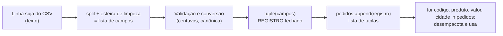

# 01.14 — Tuplas e desempacotamento

> **Módulo 01 — Python Fundamental** · Nível: N1 · Tempo estimado: 2h · Código: `codigo/cap14/`

## 1. Objetivo

- **Explicar** quando a imutabilidade é vantagem — e por que a tupla resolve por construção o que o 01.13 resolvia por disciplina.
- **Aplicar** desempacotamento múltiplo: troca de variáveis, retornos múltiplos e o `for numero, item in ...` que você usou sem entender.
- **Decidir** entre tupla e lista pelo **significado** do dado: registro (campos fixos) × coleção (itens homogêneos).
- **Prever** o erro de tentar mutar uma tupla — e o comportamento sutil de tuplas contendo listas.

Ao final, os dados da Aurora ganham a forma que eles sempre tiveram: um pedido não é "uma lista de quatro coisas" — é um **registro** com código, produto, valor e cidade.

---

## 2. Pré-requisitos

- [01.13 — Listas parte 2](13-listas-parte-2-metodos-copias-e-aliasing.md) — o capítulo inteiro é a motivação deste.
- [01.05 — Strings — parte 1](05-strings-parte-1.md) — imutabilidade, primeira encarnação.

**Autoteste:** (1) Qual a cirurgia para não compartilhar uma lista? (2) `s[0] = "X"` em string dá qual erro? (3) O que `enumerate(lista, start=1)` entregava a cada volta — uma coisa ou duas? Se a 3 ficou no ar, ela é a peça central deste capítulo.

---

## 3. Motivação

O capítulo anterior custou caro: cópias explícitas, auditoria linha a linha, `is` como estetoscópio, disciplina permanente. Tudo isso para garantir que ninguém alterasse dados que não deviam mudar. Agora considere o pedido da Aurora:

```python
pedido = ["PED-2026-00123", "Fone Bluetooth", 46_990, "Campinas"]
```

Pergunta honesta: **algum desses quatro campos deveria mudar depois de criado?** O código do pedido, não. O valor cobrado, não (uma correção é *outro* registro, não uma edição silenciosa). A cidade de entrega, não. Nada ali é "coleção que cresce" — é um **registro**: quatro campos, cada um com significado próprio, definidos no nascimento.

Guardar registro em lista é como guardar documento em bloco de rascunho: funciona, e convida ao que não devia acontecer — um `append` acidental adiciona um quinto campo sem sentido; um `sort()` embaralha os campos e transforma "Fone Bluetooth" em código de pedido; uma etiqueta compartilhada permite que outra parte do sistema reescreva o valor. Cada um desses bugs é possível **porque a estrutura permite**.

Existe alternativa: dizer ao Python, na hora de criar, que aquilo **não muda**. A **tupla** faz isso — e o ganho não é só defensivo: ela pode ser usada como chave de dicionário (01.15), sinaliza intenção a quem lê o código, e vem acompanhada do gesto mais elegante da linguagem, o desempacotamento, que já vinha te servindo escondido desde o `enumerate` do 01.12.

Este capítulo resolve isso assim: apresenta a tupla como "o registro do Python", ensina desempacotamento em suas três formas úteis, dá o critério de decisão tupla × lista — e mostra a sutileza que separa quem entendeu de quem decorou: uma tupla imutável **contendo** uma lista mutável.

---

## 4. Modelo mental

> 🧠 **Modelo mental**
> Se a lista é um **trem de vagões destrancados** (01.12), a tupla é um **documento impresso e assinado**: os campos existem em ordem fixa, você lê qualquer um por posição — e não há caneta que os altere. Para "mudar" um campo, emite-se **outro documento**. E como documentos são estáveis, eles servem de **identificador** (chave), coisa que rascunhos não podem ser.

**Exercício de previsão.** Sem rodar, decida o que acontece em cada linha:

```python
pedido = ("PED-1", "Fone", 46_990)
print(pedido[1])
print(len(pedido))
pedido[2] = 39_990
```

*Resposta comentada:* imprime `Fone` e `3` — índices e `len` funcionam **exatamente** como em listas e strings (a régua da casa, terceira encarnação). A terceira linha explode: `TypeError: 'tuple' object does not support item assignment` — a mesma mensagem das strings (01.05), trocando `str` por `tuple`. A tupla é uma sequência como as outras; a única diferença é a caneta que não existe.

---

## 5. Analogia

A lista é o **carrinho de compras** — itens entram, saem, reordenam; a tupla é a **nota fiscal emitida**: mesmos produtos, forma final, sem rasura. Note a relação natural entre elas: você **usa** o carrinho durante a compra e **emite** a nota no fim. Em código é igual: acumule numa lista enquanto os dados chegam, e converta em tupla quando o registro estiver fechado — `tuple(carrinho)`.

**Onde a analogia quebra:** uma nota fiscal é imutável até no papel-carbono; uma tupla é imutável apenas na **primeira camada**. Se um dos campos for uma lista (uma nota que carrega um bloco de rascunho grampeado), esse conteúdo interno continua editável — a tupla garante que os campos não sejam **trocados**, não que sejam **congelados por dentro**. Essa sutileza tem consequência prática séria e é o assunto da seção 6.

---

## 6. Teoria

### Criação — e a vírgula que manda

```python
pedido = ("PED-1", "Fone Bluetooth", 46_990, "Campinas")   # parênteses
coordenada = 10, 20             # os parênteses são OPCIONAIS: a vírgula cria
vazia = ()                      # tupla vazia
um_item = ("PED-1",)            # ATENÇÃO: a vírgula final é obrigatória!
nao_e_tupla = ("PED-1")         # isto é só uma string entre parênteses
```

A regra que evita o erro nº 1 do capítulo: **quem cria a tupla é a vírgula, não os parênteses**. `("PED-1")` é uma string; `("PED-1",)` é uma tupla de um item. Os parênteses existem para agrupar e dar clareza (e são obrigatórios em alguns contextos, como dentro de chamadas de função).

Tudo da régua transfere, terceira vez: `pedido[0]`, `pedido[-1]`, `pedido[1:3]` (fatia devolve **tupla**), `len(pedido)`, `"Campinas" in pedido`, `for campo in pedido:`. Só não transfere o que muta: nada de `append`, `sort`, `remove` — a tupla tem apenas `count` e `index` (os dois que não alteram nada).

### Desempacotamento — o gesto elegante

Uma tupla (ou lista) pode ser distribuída em várias etiquetas de uma vez:

```python
pedido = ("PED-1", "Fone Bluetooth", 46_990, "Campinas")
codigo, produto, valor, cidade = pedido      # quatro etiquetas, uma linha
print(f"{codigo}: {produto} por {valor} centavos em {cidade}")
```

Isto é **desempacotamento** (*unpacking*): o número de etiquetas precisa bater com o de itens (senão `ValueError`, seção 11). Três usos que aparecem o tempo todo:

**1. Troca de variáveis sem auxiliar** — o idioma mais bonito da linguagem:

```python
a, b = b, a          # o lado direito vira tupla; o esquerdo desempacota
```

**2. Retornos múltiplos** (o motivo pelo qual tuplas existem em tantas APIs) — uma função que devolve "duas coisas" devolve, na verdade, uma tupla, e quem chama desempacota. Você já viu isso sem saber: `divmod(87, 50)` devolve `(1, 37)` — quociente e resto do 01.04, num pacote só. Funções próprias com retorno múltiplo chegam no 01.18.

**3. O `enumerate` decifrado** — a caixa-preta do 01.12 abre aqui:

```python
for numero, codigo in enumerate(["PED-1", "PED-7"], start=1):
    ...
```

`enumerate` entrega **uma tupla por volta** — `(1, "PED-1")`, `(2, "PED-7")` — e o `numero, codigo` desempacota cada uma na hora. Nunca foi mágica: era tupla.

### Tupla ou lista? O critério do significado

| Pergunta | Tupla | Lista |
|---|---|---|
| Os itens têm **papéis diferentes** (campos)? | ✅ registro | ❌ |
| Os itens são **do mesmo tipo**, quantidade variável? | ❌ | ✅ coleção |
| A quantidade é **fixa** e conhecida? | ✅ | ❌ |
| Vai **crescer/encolher/reordenar**? | ❌ | ✅ |
| Precisa ser **chave** de dicionário (01.15)? | ✅ (só imutáveis podem) | ❌ |

Regra de bolso: **tupla é registro heterogêneo de tamanho fixo; lista é coleção homogênea de tamanho variável.** Um pedido → tupla. Os pedidos do dia → lista de tuplas. Essa é, literalmente, a forma dos dados da Aurora daqui em diante — e a forma que uma linha de CSV assume ao ser lida (01.22).

### A sutileza: tupla contendo lista

```python
registro = ("PED-1", [46_990, 12_990])
registro[1] = []                # TypeError — não posso TROCAR o campo
registro[1].append(899)         # ...mas posso mutar o que está DENTRO dele
print(registro)
# Saída: ('PED-1', [46990, 12990, 899])
```

A tupla congela **as amarrações** dos seus campos, não os objetos apontados (o modelo do 01.03, mais uma vez, explicando tudo). Consequência prática: uma tupla só é verdadeiramente imutável se **todos** os seus campos forem imutáveis — e é exatamente essa condição que o dicionário exigirá das suas chaves (01.15). Guarde a frase: *imutável por fora não garante imutável por dentro*.

### Conversões e o par natural

`tuple(lista)` congela; `list(tupla)` descongela. O fluxo profissional que a analogia previu: acumule em lista, **emita** em tupla — `pedido_final = tuple(campos_coletados)`.

---

## 7. Funcionamento interno

Por dentro, na medida N1: a tupla é uma sequência de referências de **tamanho fixo** — o interpretador sabe, ao criá-la, exatamente quanto espaço precisa e não reserva folga para crescimento (a folga que torna o `append` da lista barato — 01.12/seção 7). Resultado: tuplas ocupam menos memória e são criadas mais rápido que listas equivalentes; o CPython inclusive **reaproveita** tuplas pequenas descartadas, como faz com inteiros (01.03). O outro efeito da imutabilidade é o que habilita as chaves do próximo capítulo: objetos imutáveis podem ter um **valor de resumo** (*hash*) estável — um número derivado do conteúdo que não muda enquanto o objeto existir, e que dicionários e conjuntos usam para localizar itens sem varrer tudo. Uma lista, que pode mudar a qualquer momento, não pode ter esse resumo confiável — daí a regra "só imutáveis viram chave" chegar no 01.15 sem parecer arbitrária.

---

## 8. Visualização do fluxo

O ciclo de vida de um registro da Aurora — o carrinho virando nota:



**Como ler:** a mutabilidade vive só à esquerda — durante a montagem, quando campos ainda estão sendo limpos e convertidos. No momento em que o registro fecha (`tuple`), ele para de ser editável e vira dado. À direita, a coleção **é** mutável (a lista cresce a cada linha lida), mas cada item dentro dela é intocável. Essa combinação — coleção mutável de registros imutáveis — é o desenho padrão de processamento de dados, e é o que você usará do 01.22 até o módulo 10.

---

## 9. Aplicação prática

Os pedidos da Aurora ganham forma de registro. Rode:

```bash
python 01-Python/codigo/cap14/registros_da_aurora.py
```

```text
--- Registros: lista de tuplas ---
1. PED-2026-00123 | Fone Bluetooth  | R$   469,90 | Campinas
2. PED-2026-00124 | Mouse Sem Fio   | R$    89,90 | Santos
3. PED-2026-00125 | Teclado Mecânico| R$   349,00 | Campinas

--- Desempacotamento em ação ---
Troca sem auxiliar: antes (10, 20) -> depois (20, 10)
divmod(87, 50) devolveu a tupla: (1, 37)

--- A tupla protege (e o teste de sabotagem prova) ---
Tentativa de alterar o valor do pedido 1: TypeError capturado no comentário ✓
Total do lote: R$ 908,80 | Campinas: 2

--- A sutileza: tupla com lista dentro ---
('PED-9', [100, 200, 999]) <- a lista interna aceitou append
```

Repare no que o script **não precisa fazer**: nenhuma cópia defensiva, nenhum `is`, nenhuma auditoria. Os registros não podem ser alterados — a disciplina do 01.13 virou propriedade da estrutura. Compare mentalmente com o `promessas_pagas.py` (01.12): o laço é o mesmo, mas lá cada linha era uma lista editável passeando pelo programa.

E o desempacotamento no laço — `for codigo, produto, valor, cidade in pedidos:` — elimina os `campos[0]`, `campos[1]`, `campos[2]` do capítulo anterior. Nomes em vez de números: o relatório passa a se ler como português.

> 🎯 **Checkpoint rápido**
> De cabeça: `x = ("PED-1")` — que tipo é `x`? E como criar uma tupla de um elemento só?

---

## 10. Código comentado

Arquivo completo em [`codigo/cap14/registros_da_aurora.py`](codigo/cap14/registros_da_aurora.py).

```python
# ------------------------------------------------------------
# registros_da_aurora.py
# Capítulo 01.14 — Tuplas e desempacotamento
# O que este arquivo demonstra: pedidos como registros (tuplas),
#   desempacotamento no laço, troca sem auxiliar e a sutileza do
#   campo mutável dentro de tupla imutável
# Como executar: python registros_da_aurora.py
# ------------------------------------------------------------

print("--- Registros: lista de tuplas ---")
# Coleção MUTÁVEL (cresce) de registros IMUTÁVEIS (não se alteram):
pedidos = [
    ("PED-2026-00123", "Fone Bluetooth", 46_990, "Campinas"),
    ("PED-2026-00124", "Mouse Sem Fio", 8_990, "Santos"),
    ("PED-2026-00125", "Teclado Mecânico", 34_900, "Campinas"),
]

total_lote = 0
de_campinas = 0
# Desempacotamento no laço: nomes em vez de campos[0], campos[1]...
for numero, pedido in enumerate(pedidos, start=1):
    codigo, produto, valor, cidade = pedido      # 4 etiquetas de uma vez
    total_lote += valor
    if cidade.lower() == "campinas":
        de_campinas += 1
    reais = f"{valor / 100:,.2f}".replace(",", "@").replace(".", ",").replace("@", ".")
    print(f"{numero}. {codigo} | {produto:<16} | R$ {reais:>8} | {cidade}")

print()
print("--- Desempacotamento em ação ---")
a, b = 10, 20                    # a vírgula cria a tupla; o lado esquerdo desempacota
antes = (a, b)
a, b = b, a                      # troca sem variável auxiliar
print(f"Troca sem auxiliar: antes {antes} -> depois {(a, b)}")

resultado = divmod(87, 50)       # devolve TUPLA (quociente, resto) — 01.04
print("divmod(87, 50) devolveu a tupla:", resultado)

print()
print("--- A tupla protege (e o teste de sabotagem prova) ---")
# A linha abaixo, se descomentada, levanta:
#   TypeError: 'tuple' object does not support item assignment
# pedidos[0][2] = 1
print("Tentativa de alterar o valor do pedido 1: TypeError capturado no comentário ✓")

reais_lote = f"{total_lote / 100:,.2f}".replace(",", "@").replace(".", ",").replace("@", ".")
print(f"Total do lote: R$ {reais_lote} | Campinas: {de_campinas}")

print()
print("--- A sutileza: tupla com lista dentro ---")
registro = ("PED-9", [100, 200])
# registro[1] = []   -> TypeError: não posso TROCAR o campo...
registro[1].append(999)          # ...mas posso mutar o objeto que ele aponta
print(registro, "<- a lista interna aceitou append")
# Saída: ('PED-9', [100, 200, 999]) <- a lista interna aceitou append
```

---

## 11. Erros comuns

### Erro 1 — A tupla de um elemento sem vírgula

**Sintoma:** sem traceback imediato — o comportamento é que fica estranho:

```python
cidades_atendidas = ("campinas")
print(len(cidades_atendidas))    # 8?! (o len da STRING "campinas")
print("cam" in cidades_atendidas)  # True?! (substring, não item)
```

**Causa:** `("campinas")` são parênteses de agrupamento em volta de uma string — não há vírgula, não há tupla.
**Correção:** `("campinas",)` — a vírgula final cria a tupla de um item. E o diagnóstico universal do capítulo: na dúvida sobre o que você criou, `type()` (01.03) responde em um segundo.

### Erro 2 — Desempacotamento com contagem errada

**Sintoma:**

```text
Traceback (most recent call last):
  File "relatorio.py", line 3, in <module>
    codigo, produto, valor = pedido
ValueError: too many values to unpack (expected 3)
```

(ou `not enough values to unpack (expected 4, got 3)` no caso inverso)
**Causa:** o número de etiquetas à esquerda não bate com o de itens à direita — típico quando o formato do registro muda (uma coluna nova no CSV) e o desempacotamento não acompanha.
**Correção:** ajuste a contagem, e leia a mensagem como especificação: ela diz **quantos** vieram e **quantos** você esperava. Em código que lê dados externos, essa mensagem é um excelente detector de mudança de formato — melhor que descobrir depois, com dados nas colunas erradas.

### Erro 3 — Esperar imutabilidade profunda

**Sintoma:** sem erro — o registro "imutável" muda:

```python
registro = ("PED-1", [46_990])
registro[1].append(999)          # aceito!
```

**Causa:** a tupla congela suas amarrações, não os objetos apontados (a sutileza da seção 6).
**Correção:** para imutabilidade real, use **campos imutáveis** — `("PED-1", (46_990,))` com tupla dentro de tupla. E o critério de projeto: se um campo precisa de uma coleção que muda, o registro não era imutável para começo de conversa — repense a modelagem (é exatamente a discussão que o módulo 04 formaliza com `dataclass(frozen=True)`).

> ⚠️ **Atenção**
> Este erro é sutil porque a tupla dá **falsa sensação de segurança**: o código parece protegido, revisões passam batido, e o vazamento acontece dentro do campo. Regra de bolso para revisar: tupla com lista dentro merece um comentário explicando por que aquilo é aceitável — ou uma mudança de estrutura.

---

## 12. Boas práticas

✅ **Registro → tupla; coleção → lista** — a estrutura declara a intenção antes de qualquer comentário; quem lê `("PED-1", "Fone", 46990)` sabe que aquilo é um item de dado, não um acumulador.

✅ **Desempacote com nomes no início do laço: `codigo, produto, valor, cidade = pedido`** — a linha custa nada e mata todos os `campos[2]` do resto do bloco.

✅ **Emita a tupla quando o registro fechar: `tuple(campos_limpos)`** — a fronteira explícita entre "montando" e "pronto" documenta a modelagem.

✅ **Na dúvida sobre o que criou, `type()`** — o antídoto de dois segundos para a vírgula esquecida.

❌ **Evite tuplas gigantes (8, 10 campos)** — acessar `registro[7]` é ilegível e desempacotar dez nomes é frágil; registros grandes pedem estrutura com nomes (dicionários — 01.15; e as `dataclasses` do 04.13, que são o destino final desta evolução).

❌ **Evite tupla como "lista que não vou mudar por enquanto"** — se o dado é coleção homogênea que vai crescer, a estrutura certa é lista; congelar por precaução confunde quem lê.

---

## 13. Performance

Nesta escala, irrelevante — e com uma nota honesta de calibragem: tuplas são um pouco mais leves e rápidas de criar que listas (tamanho fixo, sem folga de crescimento — seção 7), o que às vezes vira argumento em discussões de otimização prematura. Não é por isso que se escolhe tupla: **escolhe-se por significado**, e o ganho de memória vem de brinde. Onde a diferença passa a importar de verdade é em escala (milhões de registros no módulo 10, onde tuplas e estruturas compactas competem com objetos completos) e em estruturas que exigem hash (chaves de dicionário e itens de conjunto — 01.15 e 01.16), onde a imutabilidade não é preferência: é requisito.

---

## 14. Mercado

> 🏢 **Mercado**
> "Lista de tuplas" é o formato de dados mais onipresente do Python profissional: é o que uma consulta ao banco devolve (cada linha vira uma tupla de colunas — módulo 05, com `cursor.fetchall()`), é o que o módulo `csv` entrega ao ler arquivos (01.22), e é a base conceitual do que Pandas chama de registro. Desempacotamento é dialeto obrigatório de leitura de código alheio — `for chave, valor in dados.items():` (que você verá no próximo capítulo) aparece em praticamente todo script Python do mundo. E a ideia central deste capítulo — **imutabilidade por construção em vez de disciplina** — é uma das tendências mais fortes da engenharia de software moderna: dados imutáveis eliminam classes inteiras de bugs de concorrência (assunto do 04.21) e tornam sistemas mais fáceis de raciocinar, o que reaparece em `frozen dataclasses` (04.13), em bancos com histórico append-only e nas camadas raw imutáveis dos pipelines (10.18).
>
> **Mini-cenário:** quando o Atlas ler o CSV de vendas da Aurora (01.22), cada linha virará uma tupla de campos, e o relatório inteiro será um `for` desempacotando quatro nomes. No módulo 05, a **mesma** linha de código lerá do PostgreSQL em vez do arquivo — porque o banco também devolve tuplas. Você está aprendendo a forma que os dados terão pelos próximos nove módulos.

---

## 15. Entrevistas

**P1. "Qual a diferença entre lista e tupla? Quando usar cada uma?"**
*Resposta esperada:* lista é mutável (cresce, ordena, remove); tupla é imutável (fixa após criação). Critério de escolha pelo **significado**: tupla para registro heterogêneo de tamanho fixo (campos), lista para coleção homogênea variável (itens). Complementos que impressionam: só imutáveis servem de chave de dicionário/item de conjunto; tuplas são mais leves; imutabilidade previne bugs de mutação compartilhada (o 01.13 inteiro).

**P2. "O que é desempacotamento? Dê três usos."**
*Resposta esperada:* distribuir os itens de uma sequência em várias etiquetas numa linha; usos: troca sem auxiliar (`a, b = b, a`), retornos múltiplos de funções (na verdade uma tupla), e iteração sobre pares (`for k, v in ...`, `enumerate`). Citar que a contagem precisa bater (e o `ValueError` como detector de mudança de formato) mostra prática.

**P3. "Uma tupla é sempre imutável?"**
*Resposta esperada:* a tupla é imutável quanto às **suas amarrações** — não se troca um campo; mas se um campo aponta para um objeto mutável (uma lista), esse conteúdo pode mudar. Imutabilidade profunda exige campos imutáveis. É uma pergunta de nível pleno disfarçada de júnior: quem responde "sempre" não entendeu o modelo de referências.

**Pegadinha clássica: "`x = (1)` e `y = (1,)` — qual a diferença? E `type(())`?"**
Ela derruba quem acha que parênteses criam tuplas. A saída forte: `x` é o **inteiro** 1 (parênteses de agrupamento, como em aritmética); `y` é uma **tupla de um elemento** — é a vírgula que cria a tupla, sempre. E `()` é o caso especial: a tupla vazia, o único lugar onde parênteses sozinhos bastam (não há como pôr vírgula em "nada"). Fechar com o efeito prático: por isso `return 1,` devolve uma tupla e `print(1,)` não muda nada — a vírgula tem significado diferente em cada contexto sintático, e é ela quem manda.

---

## 16. Exercícios guiados

Enunciados completos em [`exercicios/cap14.md`](exercicios/cap14.md); gabaritos em [`exercicios/gabaritos/cap14.md`](exercicios/gabaritos/cap14.md).

### Aquecimento

- **A1** `[~5 min · tupla ou não?]` — 6 expressões: diga o tipo resultante (a vírgula manda).
- **A2** `[~10 min · desempacotamento]` — 5 trechos: preveja os valores das etiquetas ou o erro exato.
- **A3** `[~5 min · tupla ou lista?]` — 8 dados da Aurora: classifique registro × coleção com uma linha de justificativa.
- **A4** `[~10 min · o que funciona?]` — 6 operações sobre tupla: quais valem, quais explodem e com qual mensagem.

### Aplicação

- **AP1** `[~20 min · registros do lote]` — Converta as listas sujas do 01.12 em lista de tuplas validadas, com desempacotamento no relatório.
- **AP2** `[~20 min · o carrinho vira nota]` — Monte um carrinho (lista mutável), feche em tupla, e prove que a nota não aceita alteração; inclua a tentativa comentada com a mensagem real.
- **AP3** `[~20 min · trocas e retornos]` — 4 mini-exercícios de desempacotamento: troca, rotação de três valores, `divmod` no troco, e o `enumerate` reescrito à mão (usando tuplas explícitas).

---

## 17. Desafios

- **D1** `[~45 min · a nota fiscal da Aurora]` — **Emissão com integridade.** Construa o fluxo completo do diagrama da seção 8: (1) três linhas sujas de CSV; (2) esteira de limpeza montando cada registro numa **lista** temporária; (3) validação (código no formato, valor numérico, cidade atendida — os laudos do 01.08/01.09); (4) emissão: `tuple(...)` e append na lista de pedidos; (5) relatório com desempacotamento e totais. Ao final, o **teste de integridade**: escreva (e comente) as três tentativas de sabotagem que a tupla barra — trocar valor, adicionar campo, ordenar campos — cada uma com a mensagem de erro real que produziria. Fecho reflexivo em 5 linhas: o que este desenho oferece que o `promessas_pagas.py` (01.12) não oferecia?

<details><summary>💡 Dica 1 (conceito)</summary>
A lista temporária existe porque durante a limpeza os campos ainda estão sendo construídos — a tupla nasce só quando tudo está pronto e validado.
</details>
<details><summary>💡 Dica 2 (estratégia)</summary>
Registros inválidos não viram tupla: vão para uma lista de rejeitados (com o motivo). Duas listas de saída, uma esteira.
</details>
<details><summary>💡 Dica 3 (esqueleto)</summary>
linhas_sujas → for: split/strip/converter → laudos → válido? tuple+append : rejeitados.append((linha, motivo)) → relatório desempacotado → bloco de sabotagem comentado → reflexão.
</details>

---

## 18. Mini projeto

**Migração de estruturas: o Atlas ganha registros** `[~1h]` — refatorar o que existe para a forma que os próximos módulos exigem.

Requisitos numerados:

1. Pegue seu `caixa_da_aurora_v3.py` (01.12/D1) e crie `codigo/cap14/caixa_com_registros.py`: cada pedido deixa de ser um valor solto e passa a ser a tupla `(numero_pedido, valor_centavos, cidade)` — a lista `valores` vira `pedidos`.
2. Todas as métricas do fechamento (total, quantidade, ticket médio, maior, menor, acima de R$ 500) agora percorrem os registros com desempacotamento — nenhum acesso por índice numérico no corpo do laço.
3. Acrescente uma métrica que só a nova estrutura permite: **total por cidade** para as duas cidades mais comuns — e note por escrito (comentário) o desconforto de fazer isso sem a estrutura certa. (Spoiler honesto: o desconforto é o anúncio do 01.15 — não tente resolvê-lo com elegância hoje.)
4. O histograma continua funcionando, agora rotulado com o número do pedido e a cidade.
5. Comentário final de migração: 3 linhas sobre o que ficou melhor, e 1 sobre o que ficou desconfortável (a métrica do item 3).

**Critério de "está bom":** zero índices numéricos no corpo dos laços (só desempacotamento); todas as métricas anteriores preservadas; o desconforto do item 3 registrado com honestidade em vez de contornado com gambiarra. A honestidade aqui vale nota: reconhecer que uma estrutura está faltando é o que faz o próximo capítulo fazer sentido.

---

## 19. Revisão

**Resumo do capítulo:**

- Tupla = sequência **imutável**: a régua transfere (índices, fatias, len, in, for), o que muta não existe (sem append/sort/remove; só `count` e `index`).
- **A vírgula cria a tupla**, não os parênteses: `("x")` é string; `("x",)` é tupla; `()` é a exceção da tupla vazia.
- Desempacotamento distribui itens em etiquetas: troca sem auxiliar, retornos múltiplos, `for k, v in ...` — e o `enumerate` do 01.12 era isso o tempo todo.
- Critério de escolha: **registro heterogêneo fixo → tupla; coleção homogênea variável → lista**; o desenho padrão é lista mutável de registros imutáveis.
- Imutabilidade da tupla é da **primeira camada**: tupla com lista dentro deixa a lista mutável — imutável por fora não garante imutável por dentro.
- Imutabilidade habilita hash estável → tuplas podem ser chave de dicionário e item de conjunto (01.15, 01.16); listas não.

**Flashcards novos** (adicionados a [`revisao/flashcards.md`](revisao/flashcards.md)):

| ID | Frente | Verso |
|---|---|---|
| 01.14-F1 | Preveja o tipo: `x = ("PED-1")` e `y = ("PED-1",)`. Qual a regra? | (Previsão) x é **str**, y é **tupla** — quem cria a tupla é a vírgula, não os parênteses (exceção: `()` vazia). |
| 01.14-F2 | Explique com suas palavras: quando usar tupla em vez de lista? | (Elaboração) Registro heterogêneo de tamanho fixo (campos com papéis) → tupla; coleção homogênea que cresce/reordena → lista. Bônus: só imutáveis viram chave. |
| 01.14-F3 | O que `for numero, item in enumerate(lista, start=1)` faz por baixo? | enumerate entrega uma **tupla** (posição, item) por volta; `numero, item` desempacota cada uma — nunca foi mágica. |
| 01.14-F4 | Uma tupla é sempre imutável? | (Decisão) Imutável quanto às amarrações; se um campo aponta para lista, o conteúdo dela muda. Imutabilidade profunda exige campos imutáveis. |
| 01.14-F5 | Qual o idioma para trocar duas variáveis sem auxiliar — e por que ele funciona? | `a, b = b, a` — o lado direito monta uma tupla, o esquerdo desempacota; nenhuma variável temporária é necessária. |

**Agendamento:** registre no `PROGRESSO.md` e marque D+1, D+7, D+30, D+90 na [`Revisoes/agenda.md`](../Revisoes/agenda.md).

---

## 20. Checklist

Perguntas de domínio — teste do sim:

- [ ] Sei explicar *o critério tupla × lista pelo significado do dado*?
- [ ] Sei aplicar *desempacotamento nas três formas (troca, retorno múltiplo, iteração)*?
- [ ] Sei prever *o tipo criado pela vírgula (e diagnosticar com type)*?
- [ ] Sei explicar *por que tupla com lista dentro não é profundamente imutável*?
- [ ] Sei responder *à pegadinha do `(1)` vs `(1,)` com a regra da vírgula*?

Itens práticos:

- [ ] Rodei `registros_da_aurora.py` e acertei o checkpoint da seção 9.
- [ ] Acertei (ou entendi por que errei) a previsão da seção 4.
- [ ] Fiz Aquecimento e Aplicação (registros do lote; carrinho→nota; trocas).
- [ ] Migrei o caixa para registros, com o desconforto do "total por cidade" documentado.
- [ ] Registrei a sessão e agendei as 4 revisões.

---

## 21. Próximo capítulo

O desconforto que você acabou de documentar tem nome e endereço. Somar por cidade com listas e tuplas exige: descobrir quais cidades existem, criar um acumulador para cada uma, percorrer tudo comparando strings — e refazer tudo se aparecer uma cidade nova. Ficou deliberadamente em aberto a estrutura que faz isso em três linhas e que é, sem exagero, **a mais importante do Python**: o **dicionário** — o mapeamento chave → valor que responde "quanto vendemos por cidade?" com o padrão `chave → acumulador`. É a estrutura que a Aurora está esperando desde o primeiro dia do módulo: a dor original ("ninguém sabe quanto vendemos por cidade") morre no próximo capítulo.

→ [01.15 — Dicionários](15-dicionarios.md)

---

*Gerado sob spec 3.0.0*
