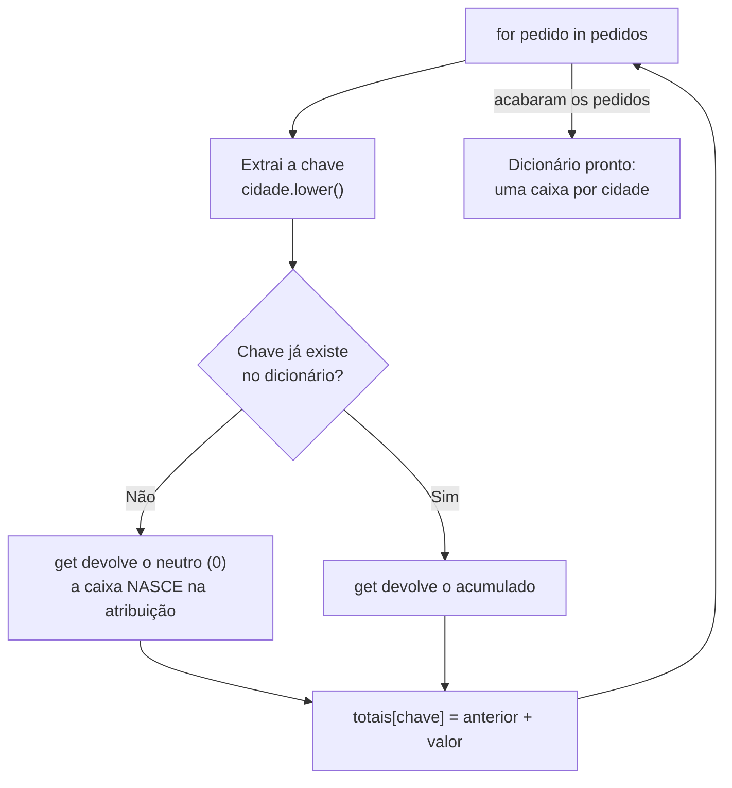

# 01.15 — Dicionários

> **Módulo 01 — Python Fundamental** · Nível: N1 · Tempo estimado: 3h · Código: `codigo/cap15/`

## 1. Objetivo

- **Implementar** o padrão **chave → acumulador**: contagem e agrupamento — o coração de todo relatório.
- **Prever** o `KeyError` e **decidir** entre `[]`, `.get()` e `setdefault()` conforme a intenção.
- **Aplicar** percursos com `.items()`, `.keys()`, `.values()` — com desempacotamento (01.14) em ação.
- **Construir** a resposta da dor original da Aurora: "quanto vendemos por cidade?" — em três linhas.

Ao final, a pergunta que abriu o módulo 01 estará respondida, e você terá em mãos a estrutura mais usada do Python.

---

## 2. Pré-requisitos

- [01.14 — Tuplas e desempacotamento](14-tuplas-e-desempacotamento.md) — chaves precisam ser imutáveis; `.items()` devolve tuplas.
- [01.12 — Listas — parte 1](12-listas-parte-1.md) — os padrões de acumulação, que aqui ganham chave.

**Autoteste:** (1) Por que uma lista não pode ser chave de nada (o que a seção 7 do 01.14 explicou)? (2) `for k, v in pares:` faz o quê com cada par? (3) Qual foi o desconforto que você documentou no mini projeto do 01.14? Se lembra da 3, este capítulo é a resposta dele.

---

## 3. Motivação

A dor original da Aurora, do primeiro dia do módulo: *"Ninguém sabe quanto vendemos por cidade."* Você tem os pedidos, tem os laços, tem os registros — e tentou somar por cidade no capítulo anterior. Como foi?

```python
total_campinas = 0
total_santos = 0
total_sao_paulo = 0
for codigo, produto, valor, cidade in pedidos:
    if cidade == "Campinas":
        total_campinas += valor
    elif cidade == "Santos":
        total_santos += valor
    # ...e quando aparecer Ribeirão Preto? Editar o código.
```

Três problemas fatais: você precisa **saber de antemão** todas as cidades; cada cidade nova exige **editar o programa**; e o código cresce linearmente com os dados — trinta cidades, sessenta linhas de acumuladores. É o oposto da lição do 01.12 ("política em dados, lógica em código"): aqui os *dados* estão no código, hardcoded, um `elif` por vez.

O que falta é uma estrutura que crie acumuladores **sob demanda**, indexados não por posição (0, 1, 2 — inútil: qual é o índice de "Campinas"?), mas pela **própria cidade**. Você quer escrever `totais["Campinas"] += valor` e que o Python resolva o resto — inclusive quando "Ribeirão Preto" aparecer pela primeira vez.

Essa estrutura é o **dicionário** — e chamá-la de "a mais importante do Python" não é exagero: objetos, módulos, argumentos nomeados e o próprio JSON (01.23) são dicionários por baixo. Aprendê-la é atravessar a porta que separa scripts de programas.

Este capítulo resolve isso assim: apresenta o mapeamento chave→valor, os três acessos (e quando cada um), o padrão chave→acumulador em suas duas formas (contar e agrupar), os percursos com `.items()` — e fecha respondendo, com dados reais, a pergunta que a gestora fez no primeiro dia.

---

## 4. Modelo mental

> 🧠 **Modelo mental**
> O dicionário é uma **central de caixas postais**: cada caixa tem uma **etiqueta única** (a chave — "Campinas", "PED-1") e um conteúdo (o valor). Você não procura pela terceira caixa da esquerda: você vai **direto** à caixa "Campinas" — e o custo é o mesmo com 10 ou 10 milhões de caixas (a busca não varre nada; ela calcula onde a caixa está). Caixas novas nascem quando você escreve nelas; escrever numa etiqueta existente **substitui** o conteúdo; e **ler** uma etiqueta que não existe é erro — a central não inventa caixa para consulta.

**Exercício de previsão.** Sem rodar, decida o que acontece em cada linha:

```python
totais = {"campinas": 46_990}
totais["santos"] = 8_990
totais["campinas"] = totais["campinas"] + 34_900
print(totais)
print(totais["osasco"])
```

*Resposta comentada:* as três primeiras funcionam — imprime `{'campinas': 81890, 'santos': 8990}`: a linha 2 **criou** a caixa "santos" (escrever cria), a linha 3 **substituiu** o conteúdo de "campinas" com a soma. A última linha explode: `KeyError: 'osasco'` — **ler** o que não existe é erro. Guarde a assimetria, ela é a fonte de metade dos bugs do capítulo: *escrever cria; ler exige que exista.*

---

## 5. Analogia

Se a lista é uma **fila numerada** (o item 0, o 1, o 2 — e para achar algo você percorre), o dicionário é uma **agenda telefônica**: você procura por *nome*, e não importa se a agenda tem 50 ou 50 mil contatos — a busca vai direto. Repare no que isso implica: a agenda não tem "ordem natural" que importe para a busca (a ordem de inserção é preservada, mas você não a usa para achar), nomes não se repetem (dois "João Silva" precisam de chaves distintas), e o nome precisa ser **estável** — se alguém pudesse mudar o nome de um contato depois de arquivado, a agenda perderia a capacidade de encontrá-lo.

**Onde a analogia quebra:** agendas telefônicas reais toleram entradas duplicadas e ambiguidade ("procure aí por João"); dicionários exigem chave exata — `"Campinas"` e `"campinas"` são caixas diferentes, e o espaço fantasma do 01.05 volta a assombrar com força total (a canônica do 01.06 é obrigatória aqui). E a última observação da analogia é literal: chaves precisam ser **imutáveis** exatamente para não "mudarem de nome" depois de arquivadas — é a exigência que o 01.14 anunciou.

---

## 6. Teoria

### Criação e acesso

```python
pedido = {"codigo": "PED-1", "produto": "Fone", "valor": 46_990, "cidade": "Campinas"}
vazio = {}                                  # dicionário vazio (não é conjunto!)

print(pedido["produto"])                    # acesso por chave -> "Fone"
pedido["valor"] = 39_990                    # substitui (a chave existe)
pedido["parcelas"] = 3                      # CRIA (a chave não existia)
del pedido["parcelas"]                      # remove a caixa
print("cidade" in pedido)                   # True — 'in' testa CHAVES
print(len(pedido))                          # quantas caixas
```

**Chaves** precisam ser imutáveis (strings, números, tuplas de imutáveis — o motivo é o hash da seção 7 do 01.14); **valores** podem ser qualquer coisa, inclusive listas e outros dicionários (o aninhamento que o 01.23 explora com JSON). Chaves não se repetem: reatribuir substitui.

Compare com o registro em tupla do 01.14: `pedido[2]` versus `pedido["valor"]`. A tupla é compacta e ordenada; o dicionário é **autodocumentado** e não depende de posição. Registros com muitos campos ou campos opcionais pedem dicionário — é o que o JSON de uma API (módulo 07) vai entregar a você.

### Os três acessos — e a intenção de cada um

| Forma | Se a chave existe | Se não existe | Quando usar |
|---|---|---|---|
| `d["k"]` | devolve o valor | **`KeyError`** | quando a ausência é bug (contrato quebrado) |
| `d.get("k")` | devolve o valor | devolve `None` | leitura opcional (campo pode faltar) |
| `d.get("k", 0)` | devolve o valor | devolve o **padrão** | leitura com valor neutro — o favorito dos acumuladores |
| `d.setdefault("k", [])` | devolve o valor | **cria** com o padrão e devolve | agrupamento (a caixa precisa existir para receber) |

A escolha é **semântica**, não estilo: `d["cpf"]` diz "este campo é obrigatório — se faltar, quero saber agora"; `d.get("apelido")` diz "pode faltar, e tudo bem".

### O padrão chave → acumulador (o coração do capítulo)

**Forma 1 — contar:**

```python
contagem = {}
for codigo, produto, valor, cidade in pedidos:
    chave = cidade.lower()                       # canônica! (01.06)
    contagem[chave] = contagem.get(chave, 0) + 1
```

Leia a linha central como uma frase: *"o novo valor da caixa é o que já havia (ou zero, se a caixa não existia) mais um"*. É o padrão acumulador do 01.10 com a inicialização resolvida sob demanda pelo `get(chave, 0)` — nenhuma cidade precisa ser conhecida de antemão.

**Forma 2 — somar (a dor da Aurora):**

```python
totais = {}
for codigo, produto, valor, cidade in pedidos:
    chave = cidade.lower()
    totais[chave] = totais.get(chave, 0) + valor
```

Três linhas. Trinta cidades ou trezentas, o código é o mesmo. Cidade nova aparece? Nasce sozinha.

**Forma 3 — agrupar (juntar os itens de cada chave):**

```python
por_cidade = {}
for pedido in pedidos:
    chave = pedido[3].lower()
    por_cidade.setdefault(chave, []).append(pedido)
```

Aqui o `setdefault` brilha: ele **garante que a lista existe** e a devolve, para que o `append` a alimente. (O `get` não serviria: devolveria uma lista solta, sem guardá-la no dicionário.)

### Percursos — e o desempacotamento em ação

```python
for cidade in totais:                    # percorre as CHAVES (padrão)
    ...
for cidade in totais.keys():             # explícito, mesmo efeito
    ...
for valor in totais.values():            # só os valores
    ...
for cidade, valor in totais.items():     # PARES — o mais usado
    print(f"{cidade}: {valor}")
```

`.items()` entrega uma **tupla por volta** — e o `cidade, valor` desempacota (01.14, exatamente como o `enumerate`). Este é o percurso que você usará em 90% dos casos.

Ordenar o resultado (top cidades!) exige o par ordenado: `sorted(totais.items())` ordena por chave; para ordenar por **valor**, o `key=` que o 04.02 completa — por hoje, uma alternativa honesta: percorrer os pares acumulando o maior (o padrão do 01.12), que é o que o script da seção 9 faz.

Sobre ordem: desde o Python 3.7, dicionários **preservam a ordem de inserção** — comportamento garantido, útil para relatórios. Mas cuidado com a interpretação: preservar ordem ≠ estar ordenado.

---

## 7. Funcionamento interno

Por dentro, na medida N1: o dicionário é uma **tabela hash** — ao guardar uma chave, o Python calcula seu *hash* (o número-resumo do 01.14/seção 7) e usa esse número para decidir **onde** a caixa fica; ao consultar, recalcula e vai direto ao lugar. É por isso que buscar por chave custa aproximadamente o mesmo com 10 ou 10 milhões de itens — enquanto `valor in lista` varre (01.12/seção 13). Três consequências práticas que valem para sempre: (1) chaves precisam ser imutáveis, senão o hash mudaria e a caixa "sumiria"; (2) chaves precisam ser comparáveis por igualdade — e `"Campinas"` ≠ `"campinas"` (a canônica não é preciosismo, é requisito); (3) a memória gasta é maior que a de uma lista equivalente — troca-se espaço por velocidade de busca, que é quase sempre um bom negócio. A medição real, com milhões de chaves, é assunto do módulo 10.

---

## 8. Visualização do fluxo

O padrão chave→acumulador, volta a volta:



**Como ler:** o losango é a única pergunta que existe — e repare que **as duas respostas levam à mesma linha de código**: é isso que o `get(chave, 0)` compra. Sem ele, seria preciso um `if chave in totais:` explícito com dois ramos (versão que funciona, é mais verbosa, e vale conhecer — está no exercício A3). A caixa nasce no momento da atribuição, não da consulta: escrever cria, ler exige.

---

## 9. Aplicação prática

A dor original da Aurora, respondida. Rode:

```bash
python 01-Python/codigo/cap15/quanto_vendemos_por_cidade.py
```

```text
--- A pergunta da gestora (primeiro dia do módulo) ---
Quanto vendemos por cidade?

campinas    | 3 pedidos | R$   1.297,80
santos      | 2 pedidos | R$     188,80
sao paulo   | 1 pedido  | R$     349,00

Campeã: campinas com R$ 1.297,80

--- Agrupamento: quais pedidos de cada cidade ---
campinas: PED-2026-00123, PED-2026-00125, PED-2026-00127
santos: PED-2026-00124, PED-2026-00126
sao paulo: PED-2026-00128

--- Índice por código (busca direta) ---
Consulta PED-2026-00125: ('Teclado Mecânico', 34900, 'Campinas')
Consulta PED-9999: não encontrado (get com padrão) ✓
```

Três respostas que nenhuma estrutura anterior dava com elegância: o **total por cidade** (contagem + soma no mesmo laço), o **agrupamento** (quais pedidos, não só quantos) e o **índice por código** — um dicionário `codigo → registro` que transforma "procurar um pedido" de varredura em consulta direta. Este último padrão tem nome no mercado (índice) e é literalmente o que um banco de dados faz por você a partir do módulo 03.

Abra o arquivo e repare no detalhe que o capítulo cobrou: **toda chave passa pela canônica** (`cidade.strip().lower()`). Comente essa linha, rode de novo, e veja "Campinas" e "campinas" virarem duas caixas — o espaço fantasma do 01.05 cobrando juros três capítulos depois.

> 🎯 **Checkpoint rápido**
> De cabeça: `totais.get("osasco", 0)` devolve o quê se "osasco" não existe — e a caixa passa a existir?

---

## 10. Código comentado

Arquivo completo em [`codigo/cap15/quanto_vendemos_por_cidade.py`](codigo/cap15/quanto_vendemos_por_cidade.py).

```python
# ------------------------------------------------------------
# quanto_vendemos_por_cidade.py
# Capítulo 01.15 — Dicionários
# O que este arquivo demonstra: chave->acumulador (contar e somar),
#   agrupamento com setdefault e índice por chave — a dor original
#   da Aurora, respondida
# Como executar: python quanto_vendemos_por_cidade.py
# ------------------------------------------------------------

# Registros do 01.14: lista (mutável) de tuplas (imutáveis)
pedidos = [
    ("PED-2026-00123", "Fone Bluetooth", 46_990, "Campinas"),
    ("PED-2026-00124", "Mouse Sem Fio", 8_990, " santos "),
    ("PED-2026-00125", "Teclado Mecânico", 34_900, "CAMPINAS"),
    ("PED-2026-00126", "Cabo HDMI", 9_890, "Santos"),
    ("PED-2026-00127", "Webcam HD", 47_890, "campinas"),
    ("PED-2026-00128", "Headset Gamer", 34_900, "São Paulo"),
]

print("--- A pergunta da gestora (primeiro dia do módulo) ---")
print("Quanto vendemos por cidade?")
print()

totais = {}       # chave -> soma em centavos
contagem = {}     # chave -> quantos pedidos

for codigo, produto, valor, cidade in pedidos:
    # CANÔNICA obrigatória (01.06): sem ela, "Campinas" e "campinas"
    # viram DUAS caixas — comente esta linha e rode para ver o estrago.
    chave = cidade.strip().lower()

    # O padrão do capítulo: o get(chave, 0) resolve a inicialização
    totais[chave] = totais.get(chave, 0) + valor
    contagem[chave] = contagem.get(chave, 0) + 1

# Percurso com .items(): cada volta entrega uma TUPLA (chave, valor)
for chave, total in totais.items():
    reais = f"{total / 100:,.2f}".replace(",", "@").replace(".", ",").replace("@", ".")
    plural = "pedidos" if contagem[chave] > 1 else "pedido "
    print(f"{chave:<11} | {contagem[chave]} {plural} | R$ {reais:>10}")

# Campeã sem key= (04.02): acumulador de máximo, padrão do 01.12
cidade_campea = ""
maior_total = 0
for chave, total in totais.items():
    if total > maior_total:
        maior_total = total
        cidade_campea = chave
reais_campea = f"{maior_total / 100:,.2f}".replace(",", "@").replace(".", ",").replace("@", ".")
print(f"\nCampeã: {cidade_campea} com R$ {reais_campea}")

print()
print("--- Agrupamento: quais pedidos de cada cidade ---")
por_cidade = {}
for codigo, produto, valor, cidade in pedidos:
    chave = cidade.strip().lower()
    # setdefault GARANTE a lista e a devolve, para o append alimentar
    por_cidade.setdefault(chave, []).append(codigo)

for chave, codigos in por_cidade.items():
    print(f"{chave}: " + ", ".join(codigos))

print()
print("--- Índice por código (busca direta) ---")
indice = {}
for codigo, produto, valor, cidade in pedidos:
    indice[codigo] = (produto, valor, cidade)     # chave -> registro

print("Consulta PED-2026-00125:", indice["PED-2026-00125"])
# get com padrão: consulta que pode falhar sem quebrar o programa
print("Consulta PED-9999:", indice.get("PED-9999", "não encontrado (get com padrão) ✓"))
# Saída: (o relatório completo mostrado na seção 9 do capítulo)
```

---

## 11. Erros comuns

### Erro 1 — `KeyError` na leitura de chave ausente

**Sintoma:**

```text
Traceback (most recent call last):
  File "relatorio.py", line 8, in <module>
    print(totais["osasco"])
KeyError: 'osasco'
```

**Causa:** ler com `[]` exige que a chave exista — e, com dados externos, você nunca sabe quais chaves virão.
**Correção:** decida pela intenção: campo obrigatório → mantenha `[]` (o erro é informação legítima: o contrato foi violado); campo opcional → `.get(chave)` ou `.get(chave, padrao)`. E o teste barato antes de qualquer acesso duvidoso: `if chave in dados:`.

### Erro 2 — Chaves não canônicas (o espaço fantasma cobra juros)

**Sintoma:** sem erro — o relatório mostra `campinas: 2` e `Campinas: 1` e ` campinas : 1`, e a soma não bate com o total geral.
**Causa:** chaves são comparadas por igualdade exata — `"Campinas"`, `"campinas"` e `" campinas "` são três caixas diferentes (01.05/01.06 voltando com força).
**Correção:** **toda** chave derivada de dado externo passa pela canônica antes de virar chave (`.strip().lower()`), e a forma de exibição se aplica só na saída (`.title()`). Esta é a regra mais importante de higiene de dicionários — e a causa nº 1 de relatórios errados em pipelines reais.

> ⚠️ **Atenção**
> Este erro é insidioso porque o programa **fica certo por acaso** em dados de teste limpos e quebra em produção com dados sujos. A defesa é canonizar **na entrada**, uma vez (a alfândega do 01.06), e não espalhar `.lower()` por todo o código.

### Erro 3 — `get` onde o caso pedia `setdefault`

**Sintoma:** sem erro — o agrupamento sai vazio ou incompleto: `por_cidade` fica `{}` mesmo depois do laço.

```python
por_cidade.get(chave, []).append(codigo)     # cria lista solta, joga fora
```

**Causa:** `get` **não guarda** o padrão no dicionário: devolve uma lista nova, o `append` a alimenta, e ela é descartada no fim da linha (o objeto sem etiqueta do 01.03, coletado sem cerimônia).
**Correção:** `setdefault(chave, []).append(codigo)` — que **insere** a lista e devolve a mesma, agora dentro do dicionário. Regra: para **ler** com padrão, `get`; para **criar-se-necessário e usar**, `setdefault`.

---

## 12. Boas práticas

✅ **Canonize a chave na entrada, sempre** — `.strip().lower()` antes de virar chave; a exibição bonita é problema da saída.

✅ **Escolha o acesso pela intenção: `[]` obrigatório, `.get()` opcional, `.setdefault()` para agrupar** — cada forma comunica um contrato diferente a quem lê.

✅ **`for chave, valor in d.items():` como percurso padrão** — desempacotamento (01.14) tornando o laço legível; `.keys()` e `.values()` quando só um lado interessa.

✅ **Dicionário como índice quando a busca se repete** — se você procura o mesmo tipo de coisa mais de uma vez, monte o índice uma vez e consulte direto (o embrião do que o banco fará no módulo 03).

❌ **Evite dicionários com chaves de tipos misturados** (`1` e `"1"` são caixas diferentes) — a confusão é garantida e o diagnóstico, penoso.

❌ **Evite mutar o dicionário enquanto o percorre** — a mesma armadilha das listas (01.13); adicionar/remover chaves durante o `for` levanta `RuntimeError: dictionary changed size during iteration`. Colete as mudanças e aplique depois.

---

## 13. Performance

Nesta escala, irrelevante — e com a nota mais importante do módulo sobre estruturas: busca por chave em dicionário é **aproximadamente constante** (não depende do tamanho), enquanto `in` numa lista **varre** (proporcional ao tamanho). Traduzindo para o dia a dia da Aurora: verificar se um cliente já existe entre 100 mil, feito 100 mil vezes, é instantâneo com dicionário e inviável com lista (bilhões de comparações). É a diferença entre um pipeline que roda em segundos e um que não termina — e o motivo de "monte um índice" ser conselho de ouro no módulo 10. O custo é memória (dicionário ocupa mais que lista) e a exigência de chaves imutáveis. Medição real: módulo 10, com cronômetro.

---

## 14. Mercado

> 🏢 **Mercado**
> O dicionário é a estrutura mais presente do Python profissional, e por um motivo estrutural: **JSON é dicionário** — toda resposta de API que você consumir (módulo 07) e toda requisição que sua API receber (módulo 06) chega como dicionário aninhado; configurações, variáveis de ambiente e argumentos nomeados (`**kwargs`, 04.01) também são. O padrão chave→acumulador é o `GROUP BY` do SQL (módulo 03) escrito à mão — e quando você aprender `GROUP BY cidade`, vai reconhecer exatamente o que o banco faz por baixo. Em entrevistas, "conte a frequência de X" é o exercício mais pedido do mundo para júnior, e a resposta esperada é este capítulo em quatro linhas.
>
> **Mini-cenário:** a gestora da Aurora recebeu hoje a resposta que pediu no primeiro dia — total e contagem por cidade, sem planilha, sem estagiário, em três linhas de código. A próxima pergunta dela (garantido) será "e por mês?" ou "e por produto?" — e a resposta será o **mesmo** padrão com outra chave. É assim que ferramentas internas nascem e crescem: uma pergunta respondida bem gera três novas.

---

## 15. Entrevistas

**P1. "Como você contaria a frequência de itens numa lista?"**
*Resposta esperada:* o padrão canônico: dicionário vazio + `for` + `contagem[item] = contagem.get(item, 0) + 1`. Complementos que impressionam: canonizar a chave se vier de dado externo; mencionar que a biblioteca padrão tem `collections.Counter` para isso (conhecer o atalho **depois** de dominar o padrão é o que se espera de júnior maduro).

**P2. "Diferença entre `d[k]`, `d.get(k)` e `d.setdefault(k, [])`?"**
*Resposta esperada:* `[]` levanta `KeyError` se ausente (use quando a ausência é bug); `get` devolve `None`/padrão sem inserir (leitura opcional); `setdefault` **insere** o padrão se ausente e devolve o valor (agrupamento). O erro clássico de usar `get` para agrupar (lista descartada) é uma ótima resposta complementar.

**P3. "Por que listas não podem ser chaves de dicionário?"**
*Resposta esperada:* chaves precisam de hash estável; o hash é derivado do conteúdo, e listas são mutáveis — se o conteúdo mudasse, a chave "sumiria" (ficaria arquivada num lugar que ninguém mais consulta). Por isso só imutáveis (strings, números, tuplas de imutáveis) servem. Ligar ao 01.14 (tupla como chave composta: `(cidade, mes)`) mostra domínio.

**Pegadinha clássica: "O que acontece com `d = {}; d[1] = 'a'; d[True] = 'b'; print(d)`?"**
Ela derruba quem não conectou os capítulos. A saída forte: imprime `{1: 'b'}` — **uma** caixa! Porque `True == 1` e `hash(True) == hash(1)` (bool é subtipo de int — 01.08), então `d[True]` não criou chave nova: **substituiu** o valor da chave `1`. Fechar com a lição prática: chaves de tipos "compatíveis por igualdade" colidem silenciosamente — mais um motivo para não misturar tipos de chave (a boa prática da seção 12).

---

## 16. Exercícios guiados

Enunciados completos em [`exercicios/cap15.md`](exercicios/cap15.md); gabaritos em [`exercicios/gabaritos/cap15.md`](exercicios/gabaritos/cap15.md).

### Aquecimento

- **A1** `[~10 min · previsão de operações]` — 8 operações sobre um dicionário: resultado ou erro exato.
- **A2** `[~5 min · qual acesso?]` — 6 situações: `[]`, `get`, `get` com padrão ou `setdefault`?
- **A3** `[~10 min · o padrão sem get]` — Escreva o contador com `if chave in d:` explícito e compare com a versão `get`.
- **A4** `[~5 min · chaves válidas]` — 6 candidatos a chave: quais servem, quais explodem (e a mensagem).

### Aplicação

- **AP1** `[~20 min · frequência de palavras]` — Conte a frequência de cada palavra num texto (canônica + `split`), e imprima as que aparecem mais de uma vez.
- **AP2** `[~25 min · relatório por produto]` — Do lote de pedidos: total e quantidade por **produto** (não cidade), com o ticket médio de cada um.
- **AP3** `[~20 min · índice de busca]` — Monte o índice `codigo → registro` e implemente um mini-balcão de consulta interativo (`while` + `get` com padrão), sem `KeyError` possível.

---

## 17. Desafios

- **D1** `[~50 min · o painel da diretoria]` — **Relatório executivo da Aurora.** Com o lote de 6 pedidos (ou mais, invente), produza um painel com **quatro** agregações diferentes, todas com o mesmo padrão: (a) total por cidade; (b) quantidade por produto; (c) ticket médio por cidade (dois dicionários trabalhando juntos: soma e contagem); (d) **total por cidade E faixa de valor** — usando **tupla como chave composta** (`(cidade, faixa)`), onde faixa é "baixo/médio/alto" conforme a cadeia do 01.09. Cada agregação impressa em bloco formatado. Fecho: 5 linhas sobre por que a chave composta do item (d) funciona (o que ela exige da tupla — 01.14/seção 7).

<details><summary>💡 Dica 1 (conceito)</summary>
Ticket médio por cidade: percorra uma vez acumulando soma E contagem em dois dicionários; depois percorra as chaves de um deles calculando soma[k] // contagem[k].
</details>
<details><summary>💡 Dica 2 (estratégia)</summary>
Chave composta: `chave = (cidade_canonica, faixa)` — e `for (cidade, faixa), total in d.items():` desempacota em dois níveis. Teste com poucos dados primeiro.
</details>
<details><summary>💡 Dica 3 (esqueleto)</summary>
pedidos → 4 laços de agregação (ou 1 laço alimentando 4 dicionários — mais eficiente, comente a escolha) → 4 blocos de impressão → reflexão sobre a chave composta.
</details>

---

## 18. Mini projeto

**Relatório Aurora v1 — a resposta oficial** `[~1h15]` — o entregável que a gestora pediu, pronto para apresentar.

Requisitos numerados:

1. Crie `codigo/cap15/relatorio_aurora_v1.py` com o cabeçalho padrão, partindo da lista de pedidos em tuplas (use 8–10 registros, com sujeira proposital nas cidades: caixas diferentes e espaços).
2. Produza, com o padrão chave→acumulador: total e quantidade por cidade; total e quantidade por produto; e o agrupamento `cidade → lista de códigos`.
3. Apresentação: um relatório formatado com cabeçalho, três blocos (cidades, produtos, detalhamento), totais gerais e a **prova dos nove** — a soma dos totais por cidade deve bater com o total geral (imprima o ✓ ou o alerta).
4. Índice `codigo → registro` + consulta de 2 códigos (um existente, um inexistente) demonstrando o `get` com padrão.
5. Comentário final: 4 linhas comparando este relatório com a solução hipotética "um acumulador por cidade" da Motivação — em linhas de código e em manutenção quando surgir a 20ª cidade.

**Critério de "está bom":** todas as chaves canonizadas (teste: as cidades sujas devem colapsar corretamente); prova dos nove fechando; relatório apresentável (alinhamento, reais brasileiros, plurais corretos); a comparação final honesta. Este arquivo é o ancestral direto do mini projeto do módulo (01.25) — lá, os dados virão de um CSV real.

---

## 19. Revisão

**Resumo do capítulo:**

- Dicionário = mapeamento **chave → valor**, com busca direta por chave (custo ~constante); chaves imutáveis e únicas, valores livres.
- **Escrever cria, ler exige**: `d[k] = v` cria ou substitui; `d[k]` levanta `KeyError` se ausente.
- Os três acessos por intenção: `[]` (obrigatório), `.get(k, padrão)` (opcional), `.setdefault(k, [])` (criar-se-necessário — o único que **insere** e serve para agrupar).
- Padrão chave→acumulador: `d[chave] = d.get(chave, 0) + valor` — contar e somar sem conhecer as chaves de antemão; agrupar com `setdefault(chave, []).append(item)`.
- Percursos: `.items()` (pares, com desempacotamento — o mais usado), `.keys()`, `.values()`; ordem de inserção preservada (≠ ordenado).
- Canônica é requisito, não estilo: chaves comparam por igualdade exata — `"Campinas"` ≠ `"campinas"` ≠ `" campinas "`.

**Flashcards novos** (adicionados a [`revisao/flashcards.md`](revisao/flashcards.md)):

| ID | Frente | Verso |
|---|---|---|
| 01.15-F1 | Escreva de memória o padrão chave→acumulador para somar valores por cidade. | `totais[chave] = totais.get(chave, 0) + valor` (com `chave = cidade.strip().lower()`) — o get resolve a inicialização sob demanda. |
| 01.15-F2 | Explique com suas palavras: `d[k]`, `d.get(k, x)` e `d.setdefault(k, [])`. | (Elaboração) `[]` exige a chave (KeyError se não — use quando ausência é bug); get lê com padrão SEM inserir; setdefault insere o padrão se faltar e devolve — o único que serve para agrupar. |
| 01.15-F3 | Preveja: `por_cidade.get(chave, []).append(x)` — por que o agrupamento sai vazio? | (Previsão) get não guarda o padrão: cria lista solta, o append a alimenta, e ela é descartada. Correto: setdefault. |
| 01.15-F4 | Por que listas não podem ser chaves — e o que pode? | (Decisão) Chave precisa de hash estável; lista é mutável (o hash mudaria e a caixa sumiria). Podem: str, int, float, bool e **tuplas de imutáveis** (chave composta). |
| 01.15-F5 | Relatório mostra "campinas: 2" e "Campinas: 1". Diagnóstico e correção? | Chaves não canonizadas — comparação é por igualdade exata. Correção: `.strip().lower()` na ENTRADA (uma vez); `.title()` só na exibição. |

**Agendamento:** registre no `PROGRESSO.md` e marque D+1, D+7, D+30, D+90 na [`Revisoes/agenda.md`](../Revisoes/agenda.md).

---

## 20. Checklist

Perguntas de domínio — teste do sim:

- [ ] Sei implementar *contagem, soma e agrupamento por chave sem consultar o capítulo*?
- [ ] Sei escolher *entre `[]`, `get` e `setdefault` explicando a intenção de cada um*?
- [ ] Sei explicar *por que a chave precisa ser imutável e canônica*?
- [ ] Sei percorrer *com `.items()` desempacotando — e ordenar o resultado*?
- [ ] Sei responder *à pegadinha do `d[1]` e `d[True]` conectando ao 01.08*?

Itens práticos:

- [ ] Rodei `quanto_vendemos_por_cidade.py` e testei o experimento da canônica comentada.
- [ ] Acertei (ou entendi por que errei) a previsão da seção 4 e o checkpoint da seção 9.
- [ ] Fiz Aquecimento e Aplicação (frequência, relatório por produto, índice interativo).
- [ ] Construí o Relatório Aurora v1 com prova dos nove fechando (5 requisitos).
- [ ] Registrei a sessão e agendei as 4 revisões.

---

## 21. Próximo capítulo

Seu relatório responde "quanto por cidade" — e a gestora fará a próxima pergunta antes do café: *"quantas cidades **diferentes** atendemos? E quais clientes compraram em Campinas **e** em Santos?"* Você consegue responder com o que tem (percorrer acumulando cidades numa lista, checando `if cidade not in lista`) — e cada `in` desses varre a lista inteira. Ficou deliberadamente em aberto a estrutura especializada em **unicidade e pertencimento**: o **conjunto** — que deduplica de graça, responde "está aí?" na velocidade do dicionário e traz as operações que você viu na escola: união, interseção, diferença. Clientes que compraram em A **e** em B viram uma linha.

→ [01.16 — Conjuntos](16-conjuntos.md)

---

*Gerado sob spec 3.0.0*
