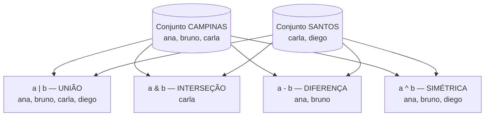

# 01.16 — Conjuntos

> **Módulo 01 — Python Fundamental** · Nível: N1 · Tempo estimado: 2h · Código: `codigo/cap16/`

## 1. Objetivo

- **Aplicar** conjuntos para **deduplicação** e teste de **pertinência** rápido.
- **Aplicar** união, interseção e diferença em perguntas reais de negócio da Aurora.
- **Decidir** entre `set`, `list` e `dict` pela pergunta que a estrutura precisa responder.
- **Prever** as duas restrições que assustam iniciantes: conjuntos não têm ordem nem aceitam itens mutáveis.

Ao final, "quais cidades distintas atendemos?" e "quais clientes compraram em A **e** em B?" viram uma linha cada.

---

## 2. Pré-requisitos

- [01.15 — Dicionários](15-dicionarios.md) — conjunto é "o dicionário só com as chaves"; o mecanismo de hash é o mesmo.
- [01.14 — Tuplas](14-tuplas-e-desempacotamento.md) — a exigência de imutabilidade vale aqui também.

**Autoteste:** (1) Por que buscar por chave em dicionário não fica mais lento com mais itens? (2) Uma lista pode ser chave? Por quê? (3) O que a canônica (`strip().lower()`) tem a ver com chaves? As três respostas são pré-requisitos duros — o conjunto herda todas.

---

## 3. Motivação

A gestora voltou, como você previu no fim do capítulo anterior: *"Quantas cidades diferentes a gente atende? E tem cliente que compra tanto em Campinas quanto em Santos?"*

Com o que você tem, a primeira pergunta sai assim:

```python
cidades_distintas = []
for codigo, produto, valor, cidade in pedidos:
    chave = cidade.strip().lower()
    if chave not in cidades_distintas:      # este 'in' VARRE a lista inteira
        cidades_distintas.append(chave)
```

Funciona — e carrega dois defeitos. O primeiro é de expressividade: cinco linhas para dizer "quero os valores únicos", uma ideia que devia caber em uma. O segundo é de custo, e cresce mal: cada `not in` percorre a lista já acumulada, então com 100 mil pedidos e 500 cidades você faz dezenas de milhões de comparações — o mesmo aviso do 01.12 (`in` varre) e do 01.15 (dicionário não varre) chegando à conta final.

A segunda pergunta é pior. "Clientes que compraram em Campinas **e** em Santos" com listas exige dois laços aninhados comparando tudo contra tudo — o código fica ilegível e o custo explode. E, no entanto, a pergunta é elementar: é **interseção de conjuntos**, a operação que você aprendeu na escola com dois círculos se sobrepondo.

Python tem exatamente essa estrutura. O **conjunto** (`set`) guarda itens **únicos, sem ordem**, responde "está aí?" na velocidade do dicionário (mesmo mecanismo de hash) e implementa as operações da teoria dos conjuntos com operadores de uma letra. Deduplicar vira uma chamada; interseção vira `a & b`.

Este capítulo resolve isso assim: apresenta o conjunto pela sua vocação (unicidade e pertencimento), as quatro operações de negócio, as duas restrições que o tornam rápido — e fecha o quarteto de estruturas do módulo com o critério de decisão entre lista, tupla, dicionário e conjunto.

---

## 4. Modelo mental

> 🧠 **Modelo mental**
> O conjunto é um **saco de bolinhas etiquetadas**: cada etiqueta existe **uma vez só** (jogar uma bolinha repetida dentro não faz nada), não há "primeira" nem "terceira" bolinha (sem ordem, sem índice), e perguntar "tem bolinha X aqui?" é instantâneo — você não despeja o saco para conferir. É o dicionário do capítulo anterior **sem os valores**: só as etiquetas das caixas.

**Exercício de previsão.** Sem rodar, decida o que imprime:

```python
cidades = {"campinas", "santos", "campinas", "sao paulo"}
print(len(cidades))
print("santos" in cidades)
print(cidades[0])
```

*Resposta comentada:* imprime `3` (a repetição de "campinas" não entra — deduplicação de graça), depois `True` (pertinência instantânea) — e a terceira linha explode: `TypeError: 'set' object is not subscriptable`. **Conjunto não tem índice** porque não tem ordem: pedir "o item 0" é pedir "a primeira bolinha do saco", pergunta sem resposta. Se essa última te pegou, guarde: a ausência de ordem não é limitação acidental — é o preço (barato) da velocidade de busca.

---

## 5. Analogia

Um conjunto é a **lista de convidados na portaria** de um evento. O segurança responde "seu nome está na lista?" em um segundo (não lê a lista inteira — procura direto), o mesmo nome não aparece duas vezes (e se aparecer, não muda nada), e ninguém pergunta "quem é o convidado número 7?" — a lista existe para *conferir presença*, não para ordenar pessoas.

E as operações de negócio ficam naturais nessa imagem: **união** é juntar as listas de dois eventos ("quem foi convidado para algum dos dois"); **interseção** é quem está nas duas ("VIPs dos dois eventos"); **diferença** é quem está numa e não na outra ("convidados exclusivos do evento A").

**Onde a analogia quebra:** listas de convidados reais guardam informação junto ao nome (mesa, acompanhante) — conjuntos guardam **só o nome**. Quando você precisa associar dados à etiqueta, a estrutura certa é o dicionário (01.15). O conjunto é deliberadamente pobre: ele sabe *quem está*, não *o que cada um tem*.

---

## 6. Teoria

### Criação — e a armadilha do `{}` vazio

```python
cidades = {"campinas", "santos", "sao paulo"}     # literal com chaves
vazio = set()                                      # ATENÇÃO: set(), não {}
de_lista = set(["campinas", "santos", "campinas"]) # dedupliza na criação
de_string = set("aurora")                          # {'a','u','r','o'} — caracteres!
```

`{}` cria um **dicionário vazio**, não um conjunto — herança histórica (o dicionário chegou primeiro). Conjunto vazio se cria com `set()`, sempre.

Operações básicas:

```python
cidades.add("osasco")            # adiciona (repetido não faz nada)
cidades.discard("osasco")        # remove se existir (sem erro se não)
cidades.remove("osasco")         # remove — KeyError se não existir
print(len(cidades), "santos" in cidades)
for cidade in cidades:           # percorrível — mas SEM ordem garantida
    ...
```

Note o par `discard`/`remove`: a mesma escolha de intenção do `get`/`[]` do dicionário — tolerante ou exigente.

### As quatro operações de negócio

| Operação | Operador | Método | Pergunta que responde |
|---|---|---|---|
| União | `a \| b` | `a.union(b)` | "quem está em **algum** dos dois?" |
| Interseção | `a & b` | `a.intersection(b)` | "quem está em **ambos**?" |
| Diferença | `a - b` | `a.difference(b)` | "quem está em A e **não** em B?" |
| Diferença simétrica | `a ^ b` | `a.symmetric_difference(b)` | "quem está em **apenas um** dos dois?" |

Todas devolvem **conjunto novo** (não mutam os originais — a lição do 01.13 respeitada por construção). E há os testes de relação: `a <= b` ("A está contido em B?"), `a.isdisjoint(b)` ("não têm nada em comum?").

Traduzindo para a Aurora: clientes que compraram em Campinas **e** em Santos → `campinas & santos`; clientes exclusivos de Campinas → `campinas - santos`; base total de clientes → `campinas | santos | sao_paulo`.

### Deduplicação: a vocação número um

```python
cidades_distintas = set()
for codigo, produto, valor, cidade in pedidos:
    cidades_distintas.add(cidade.strip().lower())      # canônica, sempre
print(len(cidades_distintas), "cidades atendidas")
```

Ou, quando os dados já estão numa lista: `set(lista)` — uma chamada. E o caminho de volta, quando você precisa de ordem: `sorted(meu_conjunto)` devolve uma **lista** ordenada — o idioma padrão para exibir conjuntos em relatórios (a ausência de ordem interna deixa de importar quando a saída é ordenada explicitamente).

### As duas restrições — e por que elas existem

**1. Sem ordem, sem índice.** `cidades[0]` é `TypeError`. Conjuntos são para *conferir presença* e *combinar*, não para percorrer em ordem — quando a ordem importa, `sorted()` na saída ou use lista.

**2. Só itens imutáveis.** Pelo mesmo motivo das chaves de dicionário (hash estável — 01.15/seção 7): strings, números e tuplas de imutáveis entram; listas e dicionários não (`TypeError: unhashable type: 'list'`). O conjunto **em si** é mutável (você adiciona e remove) — o que significa que um conjunto não pode conter outro conjunto (existe o `frozenset` para isso; curiosidade para a prateleira).

### O quarteto completo: qual estrutura usar

O módulo entregou quatro estruturas. O critério final, pela **pergunta** que você precisa responder:

| Você precisa de... | Estrutura | Pergunta típica |
|---|---|---|
| Coleção ordenada que cresce e repete | **lista** | "quais foram os pedidos, em ordem?" |
| Registro de campos fixos, imutável | **tupla** | "quais são os dados deste pedido?" |
| Associação chave → valor | **dicionário** | "quanto vendemos por cidade?" |
| Unicidade e pertencimento | **conjunto** | "quais cidades distintas? quem está em ambas?" |

Elas se combinam: lista de tuplas (registros — 01.14), dicionário de listas (agrupamento — 01.15), dicionário cujo valor é conjunto (cidades por cliente — o mini projeto deste capítulo).

---

## 7. Funcionamento interno

Por dentro, na medida N1: o conjunto é **a mesma tabela hash do dicionário, sem a coluna de valores** — cada item é armazenado pela posição que seu hash indica, e é isso que torna `in` aproximadamente constante e a deduplicação automática (dois itens iguais têm o mesmo hash e o mesmo destino; o segundo não cria nada). A ausência de ordem é consequência direta: os itens ficam onde o hash mandou, não onde você os colocou (diferente do dicionário, que desde o 3.7 guarda a ordem de inserção numa estrutura auxiliar — conjuntos não fazem isso). As operações de conjunto são otimizadas em C e percorrem o **menor** dos dois operandos quando possível — outro motivo para preferi-las a laços manuais. E a exigência de imutabilidade tem a mesma raiz de sempre: se um item mudasse depois de guardado, o hash mudaria e ele ficaria "perdido" numa posição que ninguém consulta.

---

## 8. Visualização do fluxo

As quatro operações sobre os clientes da Aurora — os diagramas de Venn em fluxo:



**Como ler:** os dois cilindros são os conjuntos de entrada; cada caixa à direita é um conjunto **novo** produzido por uma operação (nenhum dos originais é alterado). Repare em Carla: ela aparece na união uma vez só (unicidade), é a única na interseção (comprou nas duas cidades) e some da simétrica (que guarda só os exclusivos). Cada uma dessas quatro caixas é uma pergunta de negócio que a gestora fará mais cedo ou mais tarde.

---

## 9. Aplicação prática

As perguntas da gestora, respondidas. Rode:

```bash
python 01-Python/codigo/cap16/perguntas_de_conjunto.py
```

```text
--- Pergunta 1: quantas cidades distintas atendemos? ---
4 cidades: campinas, santos, sorocaba, são paulo

--- Pergunta 2: quem compra em mais de uma cidade? ---
Clientes de Campinas: ['ana', 'bruno', 'carla']
Clientes de Santos:   ['carla', 'diego']
Compraram nas DUAS (interseção): ['carla']
Exclusivos de Campinas (diferença): ['ana', 'bruno']
Base total (união): 4 clientes

--- Pergunta 3: produtos vendidos em Campinas mas nunca em Santos ---
['Fone Bluetooth', 'Mouse Sem Fio', 'Webcam HD']

--- Bônus: dedupe em uma linha e o custo de não usar conjunto ---
Lista com 8 cidades -> set -> 4 únicas (uma chamada)
```

Compare com o esforço da Motivação: a Pergunta 1 saiu de cinco linhas com `not in` para uma; a Pergunta 2, que exigiria laços aninhados, virou `campinas & santos`. O script também mostra o padrão combinado que fecha o módulo: um **dicionário cujo valor é conjunto** (`cidade → conjunto de clientes`), construído com `setdefault(chave, set()).add(cliente)` — as duas estruturas do lote trabalhando juntas.

> 🎯 **Checkpoint rápido**
> De cabeça: como se cria um conjunto vazio — e o que `{}` cria? E qual é o resultado de `set("aaa")`?

---

## 10. Código comentado

Arquivo completo em [`codigo/cap16/perguntas_de_conjunto.py`](codigo/cap16/perguntas_de_conjunto.py).

```python
# ------------------------------------------------------------
# perguntas_de_conjunto.py
# Capítulo 01.16 — Conjuntos
# O que este arquivo demonstra: deduplicação, pertinência e as
#   operações de conjunto respondendo perguntas de negócio
# Como executar: python perguntas_de_conjunto.py
# ------------------------------------------------------------

# Registros com cliente: (codigo, cliente, produto, valor, cidade)
pedidos = [
    ("PED-1", "Ana", "Fone Bluetooth", 46_990, "Campinas"),
    ("PED-2", "Bruno", "Mouse Sem Fio", 8_990, " campinas "),
    ("PED-3", "Carla", "Teclado Mecânico", 34_900, "CAMPINAS"),
    ("PED-4", "Carla", "Cabo HDMI", 9_890, "Santos"),
    ("PED-5", "Diego", "Teclado Mecânico", 34_900, "santos"),
    ("PED-6", "Ana", "Webcam HD", 47_890, "Campinas"),
    ("PED-7", "Elisa", "Mouse Sem Fio", 8_990, "São Paulo"),
    ("PED-8", "Bruno", "Cabo HDMI", 9_890, "Sorocaba"),
]

print("--- Pergunta 1: quantas cidades distintas atendemos? ---")
cidades = set()                       # conjunto vazio: set(), nunca {}
for codigo, cliente, produto, valor, cidade in pedidos:
    cidades.add(cidade.strip().lower())     # canônica antes de entrar (01.15)
# sorted() devolve LISTA ordenada — o idioma para exibir conjunto
print(f"{len(cidades)} cidades: " + ", ".join(sorted(cidades)))

print()
print("--- Pergunta 2: quem compra em mais de uma cidade? ---")
# Dicionário cujo VALOR é conjunto: as duas estruturas do lote juntas
clientes_por_cidade = {}
for codigo, cliente, produto, valor, cidade in pedidos:
    chave = cidade.strip().lower()
    clientes_por_cidade.setdefault(chave, set()).add(cliente.lower())

campinas = clientes_por_cidade["campinas"]
santos = clientes_por_cidade["santos"]
print("Clientes de Campinas:", sorted(campinas))
print("Clientes de Santos:  ", sorted(santos))
print("Compraram nas DUAS (interseção):", sorted(campinas & santos))
print("Exclusivos de Campinas (diferença):", sorted(campinas - santos))
print("Base total (união):", len(campinas | santos), "clientes")

print()
print("--- Pergunta 3: produtos vendidos em Campinas mas nunca em Santos ---")
produtos_campinas = set()
produtos_santos = set()
for codigo, cliente, produto, valor, cidade in pedidos:
    chave = cidade.strip().lower()
    if chave == "campinas":
        produtos_campinas.add(produto)
    elif chave == "santos":
        produtos_santos.add(produto)
print(sorted(produtos_campinas - produtos_santos))

print()
print("--- Bônus: dedupe em uma linha e o custo de não usar conjunto ---")
lista_bruta = ["Campinas", " campinas ", "CAMPINAS", "Santos", "santos",
               "São Paulo", "Sorocaba", "campinas"]
lista_cidades = []
for c in lista_bruta:                 # canônica (a comprehension chega em 01.17)
    lista_cidades.append(c.strip().lower())
unicas = set(lista_cidades)           # UMA chamada faz o que 5 linhas faziam
print(f"Lista com {len(lista_cidades)} cidades -> set -> {len(unicas)} únicas (uma chamada)")
# Saída: (o relatório completo mostrado na seção 9 do capítulo)
```

---

## 11. Erros comuns

### Erro 1 — `{}` para criar conjunto vazio

**Sintoma:** sem erro imediato — e depois:

```text
Traceback (most recent call last):
  File "cidades.py", line 3, in <module>
    cidades.add("campinas")
AttributeError: 'dict' object has no attribute 'add'
```

**Causa:** `{}` cria **dicionário** vazio; a sintaxe de chaves é compartilhada, e o dicionário chegou primeiro na história da linguagem.
**Correção:** `set()` para conjunto vazio. E o diagnóstico de sempre: `type(x)` responde em um segundo qual dos dois você criou.

### Erro 2 — Esperar ordem ou índice

**Sintoma:**

```text
Traceback (most recent call last):
  File "relatorio.py", line 5, in <module>
    print(cidades[0])
TypeError: 'set' object is not subscriptable
```

— ou, pior, sem erro nenhum: você imprime o conjunto e a ordem sai diferente da que inseriu, e o relatório fica "aleatório".
**Causa:** conjuntos não guardam ordem (os itens ficam onde o hash mandou — seção 7).
**Correção:** para exibir, `sorted(conjunto)` (devolve lista ordenada); para acessar por posição, você não queria um conjunto — queria uma lista. A pergunta que resolve: *"a ordem importa para o meu caso?"* Se sim, conjunto só na etapa de deduplicar, e lista ordenada na saída.

### Erro 3 — Item mutável no conjunto

**Sintoma:**

```text
Traceback (most recent call last):
  File "agrupa.py", line 2, in <module>
    grupos.add(["ana", "bruno"])
TypeError: unhashable type: 'list'
```

**Causa:** a mesma exigência das chaves de dicionário — itens precisam de hash estável, e listas mudam.
**Correção:** converta para tupla (`grupos.add(("ana", "bruno"))`) — desde que ela também não contenha mutáveis (a sutileza do 01.14). Se o que você queria era um conjunto de coleções que mudam, provavelmente a estrutura certa era outra (dicionário de listas, por exemplo).

> ⚠️ **Atenção**
> A mensagem `unhashable type` é o carimbo comum de conjuntos e dicionários — quando ela aparecer, a pergunta é sempre a mesma: *"o que estou usando como chave/item pode mudar?"*. Reconhecê-la de imediato economiza minutos toda vez.

---

## 12. Boas práticas

✅ **Conjunto para unicidade e pertencimento; lista quando a ordem importa** — a escolha declara a pergunta que a estrutura responde.

✅ **Canonize antes de adicionar** — `add(cidade.strip().lower())`; conjuntos comparam por igualdade exata, exatamente como as chaves (01.15).

✅ **`sorted(conjunto)` para qualquer saída em relatório** — deduplicação interna, ordem explícita na exibição: o melhor dos dois mundos.

✅ **Prefira os operadores de conjunto a laços aninhados** — `a & b` é mais legível **e** mais rápido que dois `for` comparando tudo com tudo; é o caso raro em que elegância e desempenho andam juntos.

❌ **Evite conjunto quando você precisa associar dados ao item** — "cidade → total" é dicionário; conjunto guarda só a etiqueta, sem carga.

❌ **Evite converter para lista só para "poder indexar"** — quase sempre o índice não era necessário: revise se o que você quer não é `sorted()`, `in` ou uma operação de conjunto.

---

## 13. Performance

Nesta escala, irrelevante — e com a comparação que fecha o quarteto de estruturas: `x in conjunto` e `x in dicionário` são aproximadamente constantes; `x in lista` **varre**. Traduzindo o exemplo da Motivação: deduplicar 100 mil pedidos com `if not in lista` faz dezenas de milhões de comparações; com conjunto, faz 100 mil inserções instantâneas. É a diferença entre segundos e minutos (ou entre minutos e "não termina") — e o motivo pelo qual "transforme em conjunto antes de conferir pertencimento" é um dos conselhos mais rentáveis do Python. As operações de conjunto (`&`, `|`, `-`) também batem qualquer laço manual equivalente. Custo: memória (como o dicionário) e a perda da ordem. Medição real: módulo 10.

---

## 14. Mercado

> 🏢 **Mercado**
> Conjuntos são a ferramenta de **qualidade de dados** por excelência: deduplicação de registros, comparação de bases ("quais IDs existem no sistema A e não no B?" — uma diferença de conjuntos), validação de valores permitidos (`if uf not in UFS_VALIDAS`), e checagem de colunas obrigatórias num arquivo (`if not COLUNAS_OBRIGATORIAS <= set(cabecalho)`). No módulo 10, o processo de **reconciliação** entre fontes é conjunto puro. E o vocabulário transfere direto para o SQL do módulo 03: `UNION`, `INTERSECT`, `EXCEPT` são as mesmas operações com outra sintaxe — quem entendeu os círculos de Venn aqui aprende aquilo em cinco minutos. Em entrevistas, "remova duplicatas mantendo a ordem" é clássico: a resposta combina conjunto (para lembrar o que já viu) com lista (para preservar a ordem) — exercício AP3 deste capítulo.
>
> **Mini-cenário:** o pipeline da Aurora (módulo 10) receberá o mesmo arquivo de vendas duas vezes por engano num dia — e a defesa contra o duplo-processamento será um conjunto de IDs já vistos. Essa ideia tem nome no mercado (**idempotência**) e capítulo próprio no módulo 11; a estrutura que a viabiliza você aprendeu hoje.

---

## 15. Entrevistas

**P1. "Quando você usaria um set em vez de uma list?"**
*Resposta esperada:* quando importa **unicidade** (deduplicar) ou **pertencimento rápido** (`in` constante vs. varredura), e quando a ordem **não** importa; mencionar que operações de conjunto (interseção/diferença) resolvem em uma linha o que exigiria laços aninhados. O complemento maduro: se a ordem importar, usar conjunto para deduplicar e `sorted()`/lista para apresentar.

**P2. "Como remover duplicatas de uma lista? E se a ordem original importar?"**
*Resposta esperada:* sem ordem: `list(set(lista))` — uma linha. Com ordem preservada: percorrer mantendo um conjunto de "já vistos" e um resultado em lista (`if item not in vistos: vistos.add(item); resultado.append(item)`). A segunda resposta é a que separa candidatos — e é exatamente o padrão de idempotência do mercado.

**P3. "Por que um set não aceita listas como itens?"**
*Resposta esperada:* itens precisam de hash estável para serem localizados; listas são mutáveis e mudariam de hash, "perdendo-se" na estrutura. Alternativa: converter para tupla (se os elementos internos também forem imutáveis). É a mesma exigência das chaves de dicionário — reconhecer a raiz comum vale ponto.

**Pegadinha clássica: "`print({}, type({}), type(set()))` — e como se cria um conjunto vazio?"**
Ela derruba quem aprendeu conjunto pela sintaxe de chaves. A saída forte: `{}` é **dicionário** vazio (`<class 'dict'>`) — por precedência histórica, o dicionário ficou com a sintaxe curta; conjunto vazio exige `set()` (`<class 'set'>`). Fechar com o detalhe que mostra atenção: `{1, 2}` **é** conjunto (com itens, não há ambiguidade) — a colisão existe apenas no caso vazio, que é justamente onde iniciantes tropeçam.

---

## 16. Exercícios guiados

Enunciados completos em [`exercicios/cap16.md`](exercicios/cap16.md); gabaritos em [`exercicios/gabaritos/cap16.md`](exercicios/gabaritos/cap16.md).

### Aquecimento

- **A1** `[~10 min · previsão]` — 8 operações sobre conjuntos: resultado ou erro exato (inclui `{}` e `set("aaa")`).
- **A2** `[~10 min · as quatro operações]` — Dados dois conjuntos de clientes, calcule à mão união, interseção, diferença (nos dois sentidos) e simétrica.
- **A3** `[~5 min · qual estrutura?]` — 8 perguntas de negócio: lista, tupla, dicionário ou conjunto?
- **A4** `[~5 min · itens válidos]` — 6 candidatos a item de conjunto: quais entram, quais explodem.

### Aplicação

- **AP1** `[~20 min · a base de clientes]` — Do lote de pedidos, monte `cidade → conjunto de clientes` e responda 4 perguntas de negócio com operações de conjunto.
- **AP2** `[~20 min · validação por lista branca]` — Valide cidades e produtos contra conjuntos de valores permitidos; relate os inválidos encontrados (com `-`).
- **AP3** `[~20 min · dedupe preservando ordem]` — Implemente o padrão "já vistos" (conjunto + lista) e compare com `list(set(...))` numa saída lado a lado.

---

## 17. Desafios

- **D1** `[~45 min · reconciliação de bases]` — **O arquivo do fornecedor.** A Aurora recebe do fornecedor um arquivo com os códigos de produtos que ele afirma ter entregue; o sistema interno tem os códigos efetivamente recebidos. Dadas as duas listas (crie-as com sobreposição parcial e duplicatas de propósito), produza o **relatório de reconciliação**: (a) quantos códigos únicos em cada base; (b) os que estão nas duas (conferem); (c) os que o fornecedor afirma e o sistema não tem (**faltantes** — cobrar!); (d) os que o sistema tem e o fornecedor não listou (**surpresas** — investigar); (e) o veredito: as bases batem? Ao final, 5 linhas: por que este relatório com listas puras seria mais lento **e** mais longo, e onde ele reaparece na vida real (importação de dados, conciliação bancária, sincronização de sistemas).

<details><summary>💡 Dica 1 (conceito)</summary>
Cada item do relatório é uma operação de conjunto — mapeie-as antes de escrever qualquer código: (b) &, (c) fornecedor - sistema, (d) sistema - fornecedor, (e) comparação de igualdade entre conjuntos.
</details>
<details><summary>💡 Dica 2 (estratégia)</summary>
Canonize os códigos (strip/upper) antes de tudo — dados de fornecedor sempre chegam com sujeira, e um espaço faz um código "sumir" da interseção.
</details>
<details><summary>💡 Dica 3 (esqueleto)</summary>
duas listas cruas → dois conjuntos canonizados → 4 operações → relatório formatado com sorted() → veredito (a == b) → reflexão.
</details>

---

## 18. Mini projeto

**Painel de relacionamento da Aurora** `[~1h]` — o quarteto de estruturas trabalhando junto.

Requisitos numerados:

1. Crie `codigo/cap16/painel_relacionamento.py` a partir do lote de pedidos com cliente (8–12 registros, com sujeira nas cidades e clientes repetidos).
2. Monte três estruturas combinadas: `cidade → conjunto de clientes` (dicionário de conjuntos), `cliente → conjunto de cidades` (o inverso!) e `cliente → total gasto` (dicionário de acumulador — 01.15).
3. Responda, com operações de conjunto e os dicionários: (a) quantas cidades distintas; (b) quantos clientes distintos; (c) clientes que compraram em mais de uma cidade (dica: use o dicionário invertido e `len`); (d) para o par de cidades com mais clientes em comum, liste-os; (e) o cliente que mais gastou (acumulador de máximo — 01.12).
4. Relatório formatado, com todas as saídas de conjunto passando por `sorted()`.
5. Comentário final: 4 linhas justificando cada escolha de estrutura do requisito 2 — por que conjunto ali, por que dicionário acolá.

**Critério de "está bom":** as três estruturas montadas num único laço (eficiência comentada); todas as chaves canonizadas; nenhuma saída de conjunto sem `sorted()`; as justificativas do item 5 citando a **pergunta** que cada estrutura responde. Este painel fecha o arco de estruturas do módulo — a partir do 01.17, o que muda é a *forma de escrever*, não o repertório.

---

## 19. Revisão

**Resumo do capítulo:**

- Conjunto = coleção de itens **únicos, sem ordem**, com pertinência rápida (mesma tabela hash do dicionário, sem valores).
- Conjunto vazio é `set()` — `{}` cria dicionário; `set(lista)` deduplica numa chamada; `sorted(conjunto)` devolve lista ordenada para exibir.
- Quatro operações de negócio: união `|`, interseção `&`, diferença `-`, simétrica `^` — todas devolvem conjunto novo, todas mais legíveis e rápidas que laços aninhados.
- Restrições com motivo: sem índice (não há ordem — os itens ficam onde o hash manda) e só itens imutáveis (hash estável — `unhashable type` é o carimbo).
- `add`/`discard`/`remove` — e a mesma escolha de intenção tolerante × exigente do `get`/`[]`.
- O quarteto do módulo: lista (ordem/repetição), tupla (registro imutável), dicionário (chave→valor), conjunto (unicidade/pertencimento) — combináveis (dicionário de conjuntos, lista de tuplas).

**Flashcards novos** (adicionados a [`revisao/flashcards.md`](revisao/flashcards.md)):

| ID | Frente | Verso |
|---|---|---|
| 01.16-F1 | Preveja: `len({"a", "b", "a"})` e `{}` cria o quê? | (Previsão) `2` (duplicata não entra) e `{}` cria **dicionário** vazio — conjunto vazio é `set()`. |
| 01.16-F2 | Explique com suas palavras: quando usar conjunto em vez de lista? | (Elaboração) Quando importa unicidade ou pertencimento rápido e a ordem não importa; `in` é ~constante no conjunto e varre na lista. |
| 01.16-F3 | Traduza para operações: "clientes que compraram em A e em B" e "só em A". | `a & b` (interseção) e `a - b` (diferença) — uma linha cada, contra laços aninhados. |
| 01.16-F4 | Por que `conjunto[0]` explode — e como exibir um conjunto em ordem? | (Decisão) Sem ordem, sem índice (`TypeError: not subscriptable`); para exibir: `sorted(conjunto)` devolve lista ordenada. |
| 01.16-F5 | Como remover duplicatas **preservando a ordem** original? | Conjunto de "já vistos" + lista de resultado: `if item not in vistos: vistos.add(item); resultado.append(item)` — o padrão da idempotência. |

**Agendamento:** registre no `PROGRESSO.md` e marque D+1, D+7, D+30, D+90 na [`Revisoes/agenda.md`](../Revisoes/agenda.md).

---

## 20. Checklist

Perguntas de domínio — teste do sim:

- [ ] Sei aplicar *deduplicação e pertencimento com conjuntos, canonizando as entradas*?
- [ ] Sei traduzir *perguntas de negócio nas quatro operações de conjunto*?
- [ ] Sei explicar *as duas restrições (sem ordem, só imutáveis) pelo mecanismo de hash*?
- [ ] Sei decidir *entre lista, tupla, dicionário e conjunto pela pergunta a responder*?
- [ ] Sei responder *à pegadinha do `{}` e implementar o dedupe com ordem preservada*?

Itens práticos:

- [ ] Rodei `perguntas_de_conjunto.py` e acertei o checkpoint da seção 9.
- [ ] Acertei (ou entendi por que errei) a previsão da seção 4.
- [ ] Fiz Aquecimento e Aplicação (base de clientes, lista branca, dedupe com ordem).
- [ ] Construí o painel de relacionamento com as três estruturas combinadas.
- [ ] Registrei a sessão e agendei as 4 revisões.

---

## 21. Próximo capítulo

Olhe o padrão que você repetiu dezenas de vezes neste lote: criar coleção vazia, percorrer, testar, transformar, acrescentar. Quatro linhas para dizer "os valores válidos convertidos em centavos". Ficou deliberadamente em aberto a sintaxe que comprime exatamente esse padrão — e que aparece uma vez no código deste capítulo, sem explicação, esperando você notar: as **compreensões** (*comprehensions*). `[int(t) for t in textos if t.isdigit()]` diz numa linha o que o laço diz em quatro — e existe para listas, dicionários e conjuntos. O próximo capítulo ensina a escrevê-las com legibilidade **e**, igualmente importante, a reconhecer quando **não** usá-las: comprehension aninhada de três níveis é o oposto do Zen.

→ [01.17 — Compreensões](17-compreensoes.md)

---

*Gerado sob spec 3.0.0*
