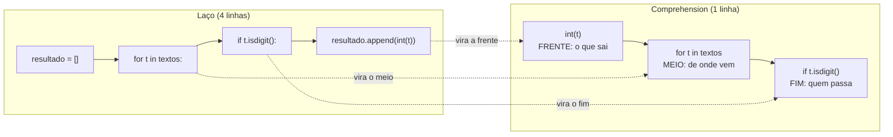

# 01.17 — Compreensões

> **Módulo 01 — Python Fundamental** · Nível: N2 · Tempo estimado: 2h30 · Código: `codigo/cap17/`

## 1. Objetivo

- **Escrever** list, dict e set comprehensions legíveis — traduzindo os três padrões do 01.12 para uma linha.
- **Traduzir** nos dois sentidos: comprehension ↔ laço equivalente, sem hesitar.
- **Avaliar** quando **não** usar: aninhamento profundo, efeitos colaterais, linha ilegível.
- **Refatorar** laços dos capítulos anteriores medindo o que melhorou — e revertendo o que piorou.

Ao final, você lerá com fluência o dialeto mais característico do Python — e saberá recusá-lo quando ele atrapalhar.

---

## 2. Pré-requisitos

- [01.16 — Conjuntos](16-conjuntos.md) e [01.15 — Dicionários](15-dicionarios.md) — as três formas de comprehension espelham as três estruturas.
- [01.12 — Listas — parte 1](12-listas-parte-1.md) — **os três padrões (acumular/filtrar/transformar) são o conteúdo deste capítulo em forma longa**.

**Autoteste:** (1) Escreva de cabeça o laço que converte uma lista de textos em inteiros. (2) E o que filtra só os maiores que 100. (3) O que `set(lista)` faz? Se a 1 e a 2 saíram sem esforço, você já sabe o conteúdo — falta só a sintaxe.

---

## 3. Motivação

Conte quantas vezes você escreveu isto no lote anterior:

```python
resultado = []
for item in colecao:
    if condicao(item):
        resultado.append(transformacao(item))
```

Foram dezenas. Quatro linhas, das quais **três são cerimônia**: criar a lista vazia, abrir o laço, chamar o append. A única informação nova é "quero `transformação(item)` para cada item que passa em `condição`" — e essa frase, em português, cabe numa linha.

O Python tem uma forma de dizer exatamente essa frase:

```python
resultado = [transformacao(item) for item in colecao if condicao(item)]
```

Isso é uma **compreensão de lista** (*list comprehension*) — e ela apareceu sem aviso no código do 01.16 (a linha do dedupe), esperando você notar. Não é açúcar sintático gratuito: é a diferença entre código que **descreve o resultado** ("a lista dos valores válidos convertidos") e código que **descreve o procedimento** ("crie uma lista, percorra, teste, acrescente"). Em revisões de código Python, essa distinção tem peso — o dialeto idiomático é reconhecível de longe.

Mas há um segundo motivo, mais importante, para este capítulo existir: comprehensions são a ferramenta mais **abusada** da linguagem. Quem descobre o brinquedo tenta espremer três laços aninhados e dois condicionais numa linha de 140 caracteres — e produz código que nem o autor lê no dia seguinte. Saber escrever é metade; saber **recusar** é a outra.

Este capítulo resolve isso assim: apresenta as três formas (lista, dicionário, conjunto), a tradução mecânica de e para laços, os critérios objetivos de "quando não usar" — e um exercício de refatoração reversa: pegar comprehensions ilegíveis e voltar para o laço.

---

## 4. Modelo mental

> 🧠 **Modelo mental**
> Uma comprehension é uma **frase declarativa lida da esquerda para a direita, com o meio primeiro**: `[o que eu quero  ←  para cada item da coleção  ←  se a condição]`. A ordem de **leitura** natural é: (1) `for` — de onde vêm os itens; (2) `if` — quais passam; (3) a expressão da frente — o que sai. Escreva na ordem em que pensa (o laço), depois **dobre** para a forma de uma linha: `for` no meio, filtro no fim, resultado na frente.

**Exercício de previsão.** Sem rodar, decida o que cada linha produz:

```python
valores = [10, 25, 40, 55]
print([v * 2 for v in valores])
print([v for v in valores if v > 30])
print({v: v * 2 for v in valores if v < 30})
print({len(str(v)) for v in valores})
```

*Resposta comentada:* `[20, 50, 80, 110]` (transformar), `[40, 55]` (filtrar), `{10: 20, 25: 50}` (dict comprehension: transformar + filtrar, produzindo pares chave→valor) e `{2}` — **um único item**: todos os valores têm 2 dígitos, e o conjunto deduplica. Se a última te pegou, ela é o lembrete de que a estrutura de saída **é escolhida pelos delimitadores**: colchetes → lista, chaves com `:` → dicionário, chaves sem `:` → conjunto.

---

## 5. Analogia

A comprehension é uma **linha de produção descrita numa etiqueta**. O laço é o manual de operação: "posicione a esteira, ligue o motor, pegue a peça, teste, coloque na caixa". A comprehension é a etiqueta na caixa de saída: *"peças polidas, das que passaram na inspeção"*. As duas produzem a mesma caixa; a segunda diz o **quê**, a primeira diz o **como**.

**Onde a analogia quebra:** etiquetas suportam qualquer descrição, por mais longa e cheia de exceções ("peças polidas exceto as azuis, salvo se importadas, agrupadas por lote..."). Comprehensions não: passado um certo ponto de complexidade, a etiqueta vira um parágrafo ilegível colado na caixa, e o manual de operação volta a ser a melhor documentação. Esse ponto de virada é o assunto da seção 12 — e reconhecê-lo é o que separa quem usa a ferramenta de quem é usado por ela.

---

## 6. Teoria

### A forma da lista comprehension

```python
[expressao for item in iteravel]                 # transformar
[expressao for item in iteravel if condicao]     # filtrar + transformar
[item for item in iteravel if condicao]          # só filtrar
```

A tradução mecânica, nos dois sentidos:

| Laço | Comprehension |
|---|---|
| `r = []` | — (a lista nasce da própria expressão) |
| `for item in colecao:` | `for item in colecao` (vai para o **meio**) |
| `if condicao:` | `if condicao` (vai para o **fim**) |
| `r.append(expr)` | `expr` (vai para a **frente**) |

Exemplos com dados da Aurora:

```python
textos = ["46990", "abc", "12990", ""]

# transformar + filtrar
centavos = [int(t) for t in textos if t.isdigit()]     # [46990, 12990]

# filtrar sem transformar
rejeitados = [t for t in textos if not t.isdigit()]    # ['abc', '']

# transformar sem filtrar
canonicas = [c.strip().lower() for c in ["  Campinas ", "SANTOS"]]
```

### Dict e set comprehensions

**Dicionário** — a expressão é um par `chave: valor`:

```python
pedidos = [("PED-1", 46_990), ("PED-2", 8_990)]
indice = {codigo: valor for codigo, valor in pedidos}      # desempacotando (01.14)
reais = {c: v / 100 for c, v in pedidos if v > 10_000}     # com filtro
```

**Conjunto** — chaves sem os dois-pontos, com deduplicação automática:

```python
cidades = {p[3].strip().lower() for p in registros}        # dedupe de graça
```

Repare no ganho combinado: o dedupe do 01.16 (que era laço + `add`) e o índice do 01.15 (que era laço + atribuição) viram uma linha cada — **desde que a expressão caiba com folga**.

### `if` no fim (filtro) × `if/else` na frente (escolha)

Duas construções parecidas com papéis diferentes:

```python
[v for v in valores if v > 100]              # FILTRO: alguns itens não saem
[v if v > 100 else 0 for v in valores]       # ESCOLHA: todos saem, alguns trocados
```

O primeiro tem `if` **no fim** e decide *quem entra*; o segundo é uma expressão condicional (o "ternário") na **frente** e decide *o que sai para cada um*. Confundir a posição é o erro nº 2 da seção 11 — e a regra de leitura resolve: filtro no fim, transformação na frente.

### Comprehension aninhada — a fronteira

É possível percorrer duas coleções:

```python
pares = [(cidade, produto) for cidade in cidades for produto in produtos]
```

A ordem dos `for` é a mesma do laço aninhado equivalente (externo primeiro). E é aqui que o alerta começa: **dois `for` já pedem atenção; três é quase sempre um laço disfarçado**. O critério da casa (seção 12): se você precisa parar para "decodificar", volte ao laço.

### O que comprehensions **não** fazem

Elas produzem **um valor**; não servem para executar ações. Escrever `[print(x) for x in lista]` "funciona" — e é considerado erro: você criou uma lista de `None` só para causar efeitos colaterais. Ação repetida é trabalho do `for` normal. Regra: *comprehension produz coleção; laço executa procedimento*.

E há um detalhe de escopo que o 01.19 aprofundará: a variável da comprehension **não vaza** para fora dela (`[x for x in range(3)]` não deixa um `x` solto no seu programa) — diferente do `for` comum. É uma proteção deliberada, e mais um motivo para preferi-las em expressões curtas.

---

## 7. Funcionamento interno

Por dentro, na medida N2: a comprehension é compilada para um bloco de bytecode dedicado que constrói a coleção — sem as chamadas repetidas ao método `append` que o laço faz explicitamente. É por isso que ela costuma ser **um pouco mais rápida** que o laço equivalente (tipicamente 20–30% em listas simples): não é mágica, é uma chamada de método a menos por item. Duas consequências práticas: a diferença é irrelevante para dezenas de itens e mensurável para milhões (medição real no módulo 10); e a escolha entre comprehension e laço deve ser feita por **legibilidade**, com a velocidade como bônus — otimizar transformando laços legíveis em comprehensions ilegíveis é péssimo negócio. O isolamento de escopo mencionado na seção 6 vem do mesmo mecanismo: o bloco tem seu próprio espaço de nomes, como se fosse uma função invisível (o quadro completo é o 01.19).

---

## 8. Visualização do fluxo

A dobra: do laço à comprehension, peça por peça:



**Como ler:** as setas pontilhadas são a tradução mecânica — cada peça do laço tem um destino fixo na comprehension. Note que a primeira linha do laço (`resultado = []`) **desaparece**: a coleção nasce da própria expressão. E note a inversão de leitura: no laço, você lê de cima para baixo na ordem de execução; na comprehension, a ordem de execução é meio → fim → frente, enquanto os olhos leem frente → meio → fim. Essa inversão é o custo cognitivo da forma curta — pequeno numa linha simples, proibitivo em três aninhamentos.

---

## 9. Aplicação prática

Refatoração medida: os laços do módulo virando comprehensions — e uma voltando atrás. Rode:

```bash
python 01-Python/codigo/cap17/refatorando_com_comprehensions.py
```

```text
--- Antes e depois: 4 refatorações ---
1. Transformar (textos -> centavos): 4 linhas -> 1
   [46990, 12990, 34900]
2. Filtrar (rejeitados): 4 linhas -> 1
   ['abc', '']
3. Dedupe de cidades (set comprehension): 4 linhas -> 1
   ['campinas', 'santos', 'sorocaba', 'são paulo']
4. Índice codigo->registro (dict comprehension): 3 linhas -> 1
   PED-2: ('Mouse Sem Fio', 8990)

--- A que NÃO deve virar comprehension ---
Versão comprimida (ilegível, 111 caracteres) vs. laço com nomes:
o laço venceu — e o motivo está comentado no arquivo.
(as duas produzem o mesmo: True)

--- Contagem final ---
14 linhas viraram 4. E uma permaneceu laço, de propósito.
```

O caso mais valioso do script é o quinto: uma agregação com condicional e formatação que **cabe** numa comprehension — e não deve caber. O arquivo mostra as duas versões lado a lado e comenta o critério. Guarde o gesto: refatorar é decidir, não aplicar automaticamente.

Depois, o exercício de fixação: abra seu `promessas_pagas.py` (01.12) e identifique **quais** dos laços de lá viram comprehension com ganho — e quais não. Você vai descobrir que o laço da tabela (que faz cinco coisas por linha) resiste, enquanto os pequenos se dobram com elegância.

> 🎯 **Checkpoint rápido**
> De cabeça: qual a diferença entre `[v for v in dados if v > 0]` e `[v if v > 0 else 0 for v in dados]` — e qual delas produz uma lista do mesmo tamanho que `dados`?

---

## 10. Código comentado

Arquivo completo em [`codigo/cap17/refatorando_com_comprehensions.py`](codigo/cap17/refatorando_com_comprehensions.py).

```python
# ------------------------------------------------------------
# refatorando_com_comprehensions.py
# Capítulo 01.17 — Compreensões
# O que este arquivo demonstra: as três formas (lista, dict, set),
#   a tradução laço->comprehension e o caso em que NÃO se deve dobrar
# Como executar: python refatorando_com_comprehensions.py
# ------------------------------------------------------------

textos = ["46990", "abc", "12990", "", "34900"]
registros = [
    ("PED-1", "Fone Bluetooth", 46_990, "Campinas"),
    ("PED-2", "Mouse Sem Fio", 8_990, " santos "),
    ("PED-3", "Teclado Mecânico", 34_900, "CAMPINAS"),
    ("PED-4", "Cabo HDMI", 9_890, "Sorocaba"),
    ("PED-5", "Webcam HD", 47_890, "São Paulo"),
]

print("--- Antes e depois: 4 refatorações ---")

# 1. TRANSFORMAR + FILTRAR (era: lista vazia + for + if + append)
centavos = [int(t) for t in textos if t.isdigit()]
print("1. Transformar (textos -> centavos): 4 linhas -> 1")
print("  ", centavos)

# 2. FILTRAR sem transformar
rejeitados = [t for t in textos if not t.isdigit()]
print("2. Filtrar (rejeitados): 4 linhas -> 1")
print("  ", rejeitados)

# 3. SET comprehension: dedupe + canônica numa linha (01.16)
cidades = {r[3].strip().lower() for r in registros}
print("3. Dedupe de cidades (set comprehension): 4 linhas -> 1")
print("  ", sorted(cidades))     # sorted para exibir (conjunto não tem ordem)

# 4. DICT comprehension com desempacotamento (01.14 + 01.15)
indice = {codigo: (produto, valor) for codigo, produto, valor, cidade in registros}
print("4. Índice codigo->registro (dict comprehension): 3 linhas -> 1")
print("   PED-2:", indice["PED-2"])

print()
print("--- A que NÃO deve virar comprehension ---")

# VERSÃO COMPRIMIDA (cabe numa linha... e não deveria):
linhas_ruim = [f"{c} | {p:<18} | R$ {v / 100:>8.2f} | {cid.strip().title()}"
               for c, p, v, cid in registros if v > 9_000 and cid.strip().lower() != "sorocaba"]

# VERSÃO LAÇO (mais linhas, nomes intermediários, lógica visível):
linhas_boa = []
for codigo, produto, valor, cidade in registros:
    cidade_canonica = cidade.strip().lower()
    if valor <= 9_000 or cidade_canonica == "sorocaba":
        continue                          # filtro explícito e nomeado
    reais = f"{valor / 100:>8.2f}"
    linhas_boa.append(f"{codigo} | {produto:<18} | R$ {reais} | {cidade.strip().title()}")

print(f"Versão comprimida (ilegível, {len(linhas_ruim[0]) + 60} caracteres) vs. laço com nomes:")
print("o laço venceu — e o motivo está comentado no arquivo.")
# CRITÉRIO: a comprimida tem 2 condições, 1 formatação e 1 desempacotamento
# na mesma linha — quem lê precisa DECODIFICAR. O laço nomeia a canônica,
# separa o filtro e deixa a formatação respirar. Legibilidade vence.
print(f"(as duas produzem o mesmo: {linhas_ruim == linhas_boa})")

print()
print("--- Contagem final ---")
print("14 linhas viraram 4. E uma permaneceu laço, de propósito.")
# Saída: (o relatório completo mostrado na seção 9 do capítulo)
```

---

## 11. Erros comuns

### Erro 1 — Comprehension para causar efeito colateral

**Sintoma:** sem erro — mas o código cria lixo e confunde:

```python
[print(pedido) for pedido in pedidos]     # imprime... e cria [None, None, None]
```

**Causa:** comprehension **produz uma coleção**; usá-la só pelo efeito de cada iteração desperdiça memória e engana quem lê (a pessoa procura onde a lista resultante é usada — e não é).
**Correção:** ação repetida é `for` normal: `for pedido in pedidos: print(pedido)`. Regra: se você não vai usar o resultado, não era comprehension.

### Erro 2 — `if/else` na posição errada

**Sintoma:**

```text
  File "relatorio.py", line 2
    valores = [v for v in dados if v > 0 else 0]
                                          ^^^^
SyntaxError: invalid syntax
```

**Causa:** o `if` do **fim** é filtro e não aceita `else`; quando você quer um valor alternativo para cada item, a construção é a expressão condicional, que vai na **frente**.
**Correção:** `[v if v > 0 else 0 for v in dados]`. A regra mnemônica: *filtro no fim (sem else); escolha na frente (com else)*.

### Erro 3 — Comprehension ilegível (o erro sem traceback)

**Sintoma:** nenhum erro — apenas uma linha de 140 caracteres com dois `for`, dois `if` e uma f-string, que **você mesmo** não entende na revisão de amanhã.
**Causa:** tratar comprehension como esporte de compressão em vez de ferramenta de clareza.
**Correção:** os três testes objetivos: (a) cabe confortavelmente em uma linha de até ~80 caracteres? (b) tem no máximo **um** `for` e **um** `if`? (c) você a lê em voz alta como uma frase? Falhou em qualquer um → volte ao laço, ou quebre em duas etapas nomeadas (uma comprehension que filtra, outra que transforma).

> ⚠️ **Atenção**
> Este é o único "erro" do módulo que nenhum interpretador aponta e nenhum teste pega — e é o mais caro a longo prazo, porque cobra juros em toda leitura futura. Em revisão de código, "isso funciona mas está ilegível" é um comentário legítimo e comum; treinar o próprio olho para isso é parte do ofício.

---

## 12. Boas práticas

✅ **Escreva o laço primeiro, dobre depois** — pensar na ordem de execução e depois compactar produz comprehensions melhores do que tentar "nascer" na forma curta.

✅ **Um `for`, um `if`, uma linha confortável — o limite da casa** — passou disso, o laço explícito comunica melhor.

✅ **Escolha a estrutura de saída pelos delimitadores conscientemente** — `[...]` lista, `{k: v ...}` dicionário, `{...}` conjunto: a mesma lógica com saídas diferentes, e a do conjunto deduplicando de brinde.

✅ **Nomeie a variável do item pelo conteúdo (`for pedido in`, `for texto in`)** — em uma linha densa, um bom nome é metade da legibilidade.

❌ **Evite comprehension com efeito colateral** — se não há resultado usado, use `for`.

❌ **Evite comprehension como exibição de habilidade** — o Zen (01.01) não premia esperteza; *readability counts* é literal, e revisores experientes leem código comprimido como sinal de imaturidade, não de domínio.

---

## 13. Performance

Nesta escala, irrelevante — e com um alerta honesto contra a otimização prematura. Comprehensions são tipicamente 20–30% mais rápidas que o laço equivalente (uma chamada de método a menos por item — seção 7), o que significa: irrelevante para centenas de itens, perceptível para milhões, e **jamais** motivo para tornar código ilegível. A hierarquia de decisão que vale para sempre: legibilidade primeiro; se o perfil de execução (módulo 10, com ferramenta de medição) apontar aquele trecho como gargalo real, aí sim considere a forma mais rápida — e comente por quê. Vale lembrar também que, para volumes grandes de dados numéricos, a resposta certa raramente é "comprehension mais rápida": é outra ferramenta inteira (Pandas/Polars — módulo 10), que opera sobre colunas em vez de itens.

---

## 14. Mercado

> 🏢 **Mercado**
> Comprehensions são um **marcador de fluência** em Python: código profissional as usa naturalmente para transformações simples, e revisores estranham tanto a ausência (laços de quatro linhas para converter uma lista) quanto o excesso (a linha de 140 caracteres). Saber a fronteira é sinal de maturidade — e é exatamente o que perguntas de entrevista sobre "quando não usar" investigam. Do lado prático, elas aparecem em toda base de código Python que você vai ler: limpar payloads de API (módulo 07), montar dicionários de configuração (06.12), preparar listas de parâmetros para consultas SQL (módulo 05). E o padrão mental que elas treinam — descrever o resultado em vez do procedimento — é a ponte para o **estilo declarativo** que domina SQL (módulo 03: `SELECT ... WHERE` é uma comprehension com outra sintaxe) e as ferramentas de dados (10.06: transformações vetorizadas do Pandas).
>
> **Mini-cenário:** quando o Atlas ler o CSV da Aurora (01.22), a linha que transforma cada registro bruto em registro limpo será uma comprehension — e quando o mesmo dado vier do PostgreSQL (módulo 05), a transformação estará no `SELECT`. Duas sintaxes, um raciocínio: dizer o que se quer, não como buscá-lo.

---

## 15. Entrevistas

**P1. "O que é uma list comprehension? Escreva uma que filtra e transforma."**
*Resposta esperada:* uma expressão que constrói uma lista a partir de um iterável, com filtro opcional: `[int(t) for t in textos if t.isdigit()]`; explicar a ordem de leitura (for → if → expressão) e mencionar as variantes dict e set. Escrever no papel sem hesitar é o que se avalia.

**P2. "Quando você **não** usaria uma comprehension?"**
*Resposta esperada:* quando há efeitos colaterais (ação repetida → `for`), quando há aninhamento profundo ou múltiplos filtros, quando a linha deixa de ser legível, e quando é preciso `try/except` no meio (01.21 — comprehension não trata exceção internamente). A pergunta separa quem usa a ferramenta de quem a idolatra.

**P3. "Qual a diferença entre `[x for x in a if cond]` e `[x if cond else y for x in a]`?"**
*Resposta esperada:* o primeiro **filtra** (a saída pode ser menor que a entrada); o segundo **escolhe** o valor de cada item (a saída tem o mesmo tamanho). A posição do `if` denuncia o papel: fim = filtro (sem else), frente = expressão condicional (com else obrigatório).

**Pegadinha clássica: "`[x for x in range(3)]` deixa um `x` acessível depois? E o `for x in range(3):` normal?"**
Ela derruba quem nunca pensou em escopo. A saída forte: a comprehension **não vaza** — sua variável vive num escopo próprio e desaparece ao fim (comportamento do Python 3; no Python 2 vazava, e a mudança foi deliberada); já o `for` comum **deixa** a variável definida após o laço, com o último valor iterado. Fechar com a consequência prática: `for` comum pode sobrescrever silenciosamente uma variável externa de mesmo nome — mais um motivo para nomes descritivos (e um aperitivo do escopo que o 01.19 destrincha).

---

## 16. Exercícios guiados

Enunciados completos em [`exercicios/cap17.md`](exercicios/cap17.md); gabaritos em [`exercicios/gabaritos/cap17.md`](exercicios/gabaritos/cap17.md).

### Aquecimento

- **A1** `[~10 min · previsão]` — 8 comprehensions (lista, dict, set, com e sem filtro): preveja a saída exata.
- **A2** `[~10 min · dobre o laço]` — Converta 4 laços em comprehensions.
- **A3** `[~10 min · desdobre a comprehension]` — Converta 3 comprehensions em laços (o caminho inverso).
- **A4** `[~5 min · filtro ou escolha?]` — 4 casos: `if` no fim ou `if/else` na frente?

### Aplicação

- **AP1** `[~20 min · a esteira em uma linha]` — Refatore a limpeza do lote (01.12) para comprehensions: válidos, rejeitados, canônicas, índice.
- **AP2** `[~20 min · as três formas]` — Do lote de registros, produza com comprehension: lista de códigos acima de R$ 100, dicionário `codigo → cidade canônica`, conjunto de produtos distintos.
- **AP3** `[~25 min · refatoração reversa]` — Dadas 3 comprehensions ilegíveis, converta-as em laços legíveis e justifique cada escolha.

---

## 17. Desafios

- **D1** `[~45 min · o júri da legibilidade]` — **Tribunal de refatoração.** Pegue **cinco** laços dos seus arquivos anteriores (01.12 a 01.16) e submeta cada um ao julgamento: escreva a versão comprehension, aplique os três testes objetivos da seção 11 (uma linha ≤ 80 caracteres? um `for` e um `if`? lê-se como frase?) e emita o veredito — **dobra** ou **permanece laço**. Para cada veredito, uma linha de justificativa. Ao final, a estatística: quantos dobraram, quantos resistiram, e o padrão que você percebeu nos que resistiram (há um: descubra-o e escreva-o em 3 linhas).

<details><summary>💡 Dica 1 (conceito)</summary>
Os que resistem costumam ter algo em comum: fazem MAIS de uma coisa por volta (calcular, formatar, acumular em dois lugares).
</details>
<details><summary>💡 Dica 2 (estratégia)</summary>
Escreva as duas versões lado a lado no arquivo e conte os caracteres da comprehension — o teste (a) é objetivo, use-o.
</details>
<details><summary>💡 Dica 3 (esqueleto)</summary>
Para cada caso: `# CASO N: origem` / laço original / comprehension proposta / os 3 testes / VEREDITO + justificativa. Fecho com a estatística e o padrão.
</details>

---

## 18. Mini projeto

**Pipeline de limpeza declarativo** `[~1h]` — a esteira do módulo escrita no estilo que os próximos módulos usam.

Requisitos numerados:

1. Crie `codigo/cap17/pipeline_declarativo.py` partindo de uma lista de ~10 linhas sujas de CSV (com defeitos variados: valores não numéricos, cidades com caixa/espaço, linhas com campos faltando).
2. Monte o pipeline em **etapas nomeadas**, cada uma uma comprehension de uma linha: (a) `campos` — cada linha dividida e com `strip` aplicado; (b) `completas` — só as com o número certo de campos; (c) `validas` — só as com valor numérico; (d) `registros` — tuplas convertidas (valor em centavos, cidade canônica); (e) `rejeitadas` — as que caíram no caminho, com o motivo.
3. Produza, também com comprehensions: o conjunto de cidades distintas, o índice `código → registro`, e a lista de códigos de pedidos acima de R$ 300.
4. Relatório final formatado com contagens de cada etapa (o "funil": 10 linhas → N completas → M válidas → K registros) e a prova de que nada se perdeu sem registro (`len(registros) + len(rejeitadas) == len(linhas)`).
5. Comentário final: qual etapa você **não** escreveu como comprehension e por quê (deve haver ao menos uma — a que exige duas decisões por linha).

**Critério de "está bom":** etapas nomeadas e legíveis (nenhuma linha ilegível — aplique os três testes); funil conferindo; a etapa não dobrada justificada. Este pipeline em etapas nomeadas é literalmente o desenho que o módulo 10 usará com Polars — você está aprendendo o estilo antes da ferramenta.

---

## 19. Revisão

**Resumo do capítulo:**

- Comprehension = os três padrões do 01.12 em forma declarativa: `[expressão for item in iterável if condição]` — frente (o que sai), meio (de onde vem), fim (quem passa).
- Três formas pelos delimitadores: `[...]` lista, `{k: v for ...}` dicionário, `{...}` conjunto (com dedupe de brinde).
- Filtro é `if` **no fim** (sem else, saída pode encolher); escolha é `if/else` na **frente** (saída do mesmo tamanho).
- Tradução mecânica nos dois sentidos: escreva o laço, dobre depois — e desdobre quando a legibilidade pedir.
- Limites: um `for`, um `if`, uma linha confortável; nada de efeitos colaterais (ação repetida é `for`); nada de `try/except` dentro (01.21).
- A variável da comprehension não vaza (escopo próprio) — diferente do `for` comum, que deixa a variável definida.

**Flashcards novos** (adicionados a [`revisao/flashcards.md`](revisao/flashcards.md)):

| ID | Frente | Verso |
|---|---|---|
| 01.17-F1 | Escreva de memória a comprehension que converte textos numéricos em int, ignorando os inválidos. | `[int(t) for t in textos if t.isdigit()]` — frente: o que sai; meio: de onde vem; fim: quem passa. |
| 01.17-F2 | Explique com suas palavras: qual a diferença entre `if` no fim e `if/else` na frente? | (Elaboração) No fim é filtro (sem else; a saída pode ser menor); na frente é expressão condicional (com else; a saída tem o mesmo tamanho). |
| 01.17-F3 | Preveja: `{len(str(v)) for v in [10, 25, 40]}` — o que sai e por quê? | (Previsão) `{2}` — um item: todos têm 2 dígitos e o conjunto deduplica; as chaves sem `:` fazem set comprehension. |
| 01.17-F4 | Quais são os três testes para decidir NÃO usar comprehension? | (Decisão) Cabe em ~80 caracteres? Tem no máximo um for e um if? Lê-se como frase? Falhou em algum → laço explícito. |
| 01.17-F5 | Por que `[print(x) for x in lista]` é considerado erro mesmo funcionando? | Comprehension produz coleção; aqui cria uma lista de None só pelo efeito colateral. Ação repetida é `for` normal. |

**Agendamento:** registre no `PROGRESSO.md` e marque D+1, D+7, D+30, D+90 na [`Revisoes/agenda.md`](../Revisoes/agenda.md).

---

## 20. Checklist

Perguntas de domínio — teste do sim:

- [ ] Sei escrever *as três formas (lista, dict, set) com e sem filtro, de memória*?
- [ ] Sei traduzir *laço ↔ comprehension nos dois sentidos sem hesitar*?
- [ ] Sei distinguir *filtro (fim) de escolha (frente) pela posição do if*?
- [ ] Sei aplicar *os três testes de legibilidade e recusar a forma curta quando devido*?
- [ ] Sei responder *à pegadinha do escopo (a variável que não vaza)*?

Itens práticos:

- [ ] Rodei `refatorando_com_comprehensions.py` e li o comentário do caso que não deve dobrar.
- [ ] Acertei (ou entendi por que errei) a previsão da seção 4 e o checkpoint da seção 9.
- [ ] Fiz Aquecimento e Aplicação (incluindo a refatoração reversa).
- [ ] Construí o pipeline declarativo com o funil conferindo (5 requisitos).
- [ ] Registrei a sessão e agendei as 4 revisões.

---

## 21. Próximo capítulo

Repare no que acabou de acontecer: você comprimiu laços em expressões, mas seus arquivos continuam sendo **um bloco corrido de instruções, de cima para baixo**. Copiou a esteira de limpeza três vezes? Ela existe três vezes. Precisa da regra de frete em dois lugares? Ela está duplicada. Ficou deliberadamente em aberto a ferramenta de organização mais importante da programação — e a única do módulo que muda a *estrutura* do seu código, não a sintaxe: as **funções**. Dar nome a um pedaço de lógica, chamá-lo de onde quiser, testá-lo isoladamente e — enfim — parar de copiar. O próximo capítulo começa a transformar seus scripts em programas.

→ [01.18 — Funções — parte 1](18-funcoes-parte-1.md)

---

*Gerado sob spec 3.0.0*
