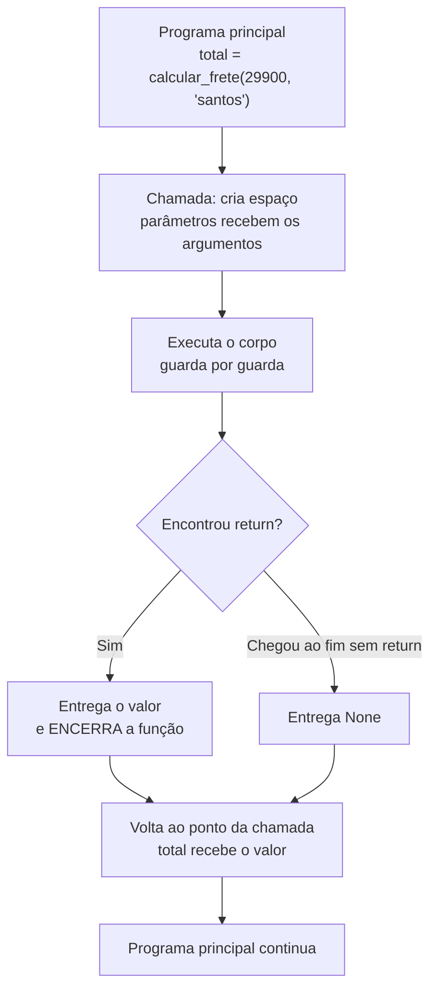

# 01.18 — Funções — parte 1

> **Módulo 01 — Python Fundamental** · Nível: N1 · Tempo estimado: 3h · Código: `codigo/cap18/`

## 1. Objetivo

- **Implementar** funções com parâmetros e retorno, cada uma com **uma responsabilidade**.
- **Diferenciar** imprimir de retornar — o erro conceitual que trava iniciantes por semanas.
- **Aplicar** parâmetros com valor padrão (imutáveis!) e argumentos nomeados.
- **Refatorar** os scripts do módulo em funções nomeadas, eliminando a duplicação acumulada.

Ao final, seus arquivos deixam de ser roteiros lineares e passam a ter **vocabulário próprio**: `calcular_frete`, `limpar_registro`, `formatar_reais` — peças que você chama de onde quiser.

---

## 2. Pré-requisitos

- [01.17 — Compreensões](17-compreensoes.md) — e, principalmente, o repertório inteiro do módulo: você vai empacotar tudo que escreveu.

**Autoteste:** (1) Quantas vezes você copiou a conversão de centavos para reais brasileiros nos capítulos anteriores? (2) O que `divmod(87, 50)` devolve — e como você usa esse retorno? (3) O que `input("Cidade: ")` devolve? As três respostas descrevem funções em uso; hoje você passa a escrevê-las.

---

## 3. Motivação

Faça uma busca nos seus arquivos por `.replace(",", "@")`. Quantas ocorrências? Provavelmente **doze** — a conversão de centavos para reais brasileiros, copiada e colada desde o 01.06, linha por linha, em cada script que precisou exibir dinheiro. Agora imagine que a Aurora decide exibir "R$ 1.399,90" como "1.399,90 BRL". São doze lugares para editar, e você vai esquecer de dois.

A duplicação é o sintoma; a causa é estrutural: seus programas não têm **vocabulário**. Tudo que eles sabem fazer está escrito inline, em blocos que não têm nome e por isso não podem ser referenciados. Quando a mesma ideia aparece de novo, a única ferramenta disponível é o Ctrl+C.

Compare com o que você já usa sem pensar: `len(texto)`, `sorted(lista)`, `input("...")`. Alguém deu nome a um pedaço de lógica, definiu o que entra e o que sai, e agora você o invoca sem saber (nem precisar saber) como funciona por dentro. É exatamente isso que uma **função** faz — e a diferença entre consumir funções e escrevê-las é a diferença entre usar uma linguagem e programar nela.

Há um segundo ganho, menos visível e mais valioso: funções tornam o código **testável**. Uma lógica presa no meio de um script só se verifica rodando o script inteiro e olhando a saída; a mesma lógica numa função se verifica isoladamente, com entradas escolhidas — o que o módulo 12 automatizará, e o que você já faz manualmente hoje com suas provas dos nove.

Este capítulo resolve isso assim: apresenta `def`, parâmetros e `return`; ataca de frente a confusão imprimir × retornar; ensina responsabilidade única com exemplos do seu próprio código; e termina com a refatoração que aposenta as doze cópias.

---

## 4. Modelo mental

> 🧠 **Modelo mental**
> Uma função é uma **máquina de vending**: você a chama informando o que entra (os **argumentos**), ela executa por dentro, e **devolve** um produto (o `return`). Três consequências: quem chama não precisa saber como a máquina funciona por dentro (só o contrato entrada→saída); a máquina não decide o que fazer com o produto — **quem chamou** decide (imprimir, somar, guardar); e uma máquina que só acende uma luz e não entrega nada devolve `None`, que é o Python dizendo "não saiu produto".

**Exercício de previsão.** Sem rodar, decida a saída das quatro linhas finais:

```python
def dobrar_imprimindo(n):
    print(n * 2)

def dobrar_retornando(n):
    return n * 2

a = dobrar_imprimindo(5)
b = dobrar_retornando(5)
print(a)
print(b + 1)
```

*Resposta comentada:* a chamada da primeira **imprime `10`** (efeito colateral) e devolve `None` — então `print(a)` mostra `None`. A segunda não imprime nada, devolve `10`, e `print(b + 1)` mostra `11`. Se você esperava que `a` valesse 10, acabou de encontrar a confusão nº 1 do capítulo: **imprimir é mostrar na tela; retornar é entregar um valor a quem chamou**. A primeira função é um beco sem saída — seu resultado não pode ser usado para mais nada.

---

## 5. Analogia

Uma função é uma **receita com nome** no caderno da cozinha. Ela declara os **ingredientes** (parâmetros), descreve o preparo (o corpo) e **entrega um prato** (o retorno). Quem pede o prato não precisa ler a receita — só saber o nome e o que informar. E o ponto que a analogia esclarece melhor que qualquer definição: uma receita que *descreve* o preparo mas termina sem entregar nada ("...e então o molho está pronto na panela") deixa quem pediu de mãos vazias — é a função que imprime sem retornar.

**Onde a analogia quebra:** receitas de verdade toleram improviso e substituições; funções são literais — se o parâmetro esperava número e chegou texto, o preparo quebra no meio (o `TypeError` do 01.07 de volta). E há um detalhe que a cozinha não tem: a receita pode **alterar os próprios ingredientes** que você entregou (mutar uma lista recebida), efeito que o 01.19 tratará com nome e sobrenome — por ora, guarde a estranheza.

---

## 6. Teoria

### Definir e chamar

```python
def formatar_reais(centavos):              # def, nome, parâmetros, dois-pontos
    reais = f"{centavos / 100:,.2f}"       # corpo indentado
    return reais.replace(",", "@").replace(".", ",").replace("@", ".")

print(formatar_reais(139_990))             # chamada -> "1.399,90"
```

Vocabulário preciso (e cobrado em entrevista): **parâmetro** é o nome na definição (`centavos`); **argumento** é o valor passado na chamada (`139_990`). A definição não executa nada — só cria a função; a execução acontece na **chamada**.

E repare no que acabou de acontecer: as doze cópias da Motivação viraram **uma** — e a mudança de formato da Aurora agora é uma linha editada.

### `return`: entregar, e encerrar

`return` faz duas coisas ao mesmo tempo: **entrega** o valor e **encerra** a função imediatamente (as linhas seguintes não executam). Isso habilita o padrão mais elegante deste capítulo — as **guardas** do 01.09, agora com saída de verdade:

```python
def calcular_frete(total_centavos, cidade):
    if cidade.strip().lower() == "campinas":
        return 0                            # sai aqui: sede tem frete grátis
    if total_centavos >= 29_900:
        return 0
    if total_centavos >= 10_000:
        return 990
    return 1_990                            # caso restante
```

Compare com a versão do 01.09 (cadeia `if/elif/else` atribuindo a uma variável): aqui cada caso **sai na hora**, sem `else`, sem variável intermediária. É o *early return* — o padrão que o mercado espera ver em código de validação.

Função sem `return` (ou com `return` vazio) devolve `None` — o valor "nada" do 01.08. Não é erro: é o contrato de funções que existem pelo efeito (imprimir, gravar).

### Retornos múltiplos — via tupla

Prometido no 01.14 e agora seu:

```python
def separar_parcelas(total_centavos, parcelas):
    base = total_centavos // parcelas
    sobra = total_centavos % parcelas
    return base + sobra, base              # devolve uma TUPLA

primeira, demais = separar_parcelas(139_990, 3)     # desempacotamento
```

O `return a, b` monta uma tupla (a vírgula manda — 01.14) e quem chama desempacota. É como `divmod` sempre funcionou.

### Parâmetros com valor padrão e argumentos nomeados

```python
def formatar_reais(centavos, com_simbolo=True, casas=2):
    ...

formatar_reais(139_990)                          # usa os padrões
formatar_reais(139_990, False)                   # posicional
formatar_reais(139_990, com_simbolo=False)       # NOMEADO — legível
formatar_reais(casas=0, centavos=139_990)        # nomeados podem trocar de ordem
```

Parâmetros com padrão vêm **depois** dos obrigatórios (senão `SyntaxError`). Argumentos nomeados são a mesma sintaxe que você já viu em `print(..., sep=" | ")` e `sorted(..., reverse=True)` (01.07, 01.13) — agora do outro lado do balcão.

> ⚠️ **Atenção**
> **Valores padrão devem ser imutáveis** (números, strings, `None`, tuplas). Escrever `def f(itens=[])` cria o bug de entrevista mais famoso do Python — a lista padrão é criada **uma vez** e sobrevive entre chamadas. O 01.19 disseca o mecanismo; por ora, a regra: padrão mutável, nunca.

### Responsabilidade única — o critério de qualidade

Uma boa função **faz uma coisa** e seu nome diz qual. Sinais de que a sua faz demais: o nome tem "e" (`limpar_e_validar_e_gravar`), ela tem mais de ~20 linhas, você não consegue explicá-la numa frase, ou ela precisa de comentários para separar suas "seções" — cada seção comentada costuma ser uma função esperando para nascer.

O padrão profissional que decorre disso: funções que **calculam** não imprimem; funções que **imprimem** não calculam. Separar as duas é o que torna o cálculo testável e a apresentação trocável (o mesmo `calcular_frete` serve ao terminal hoje e à API do módulo 06 amanhã).

### Docstring — a documentação que mora no código

```python
def calcular_frete(total_centavos, cidade):
    """Devolve o frete em centavos conforme total e cidade da Aurora."""
    ...
```

A **docstring** (*docstring*) é a primeira linha de texto do corpo, entre aspas triplas — e é o que `help(calcular_frete)` mostra. A trilha a exige a partir do módulo 05 (§18.2); adotá-la agora, em uma linha, é hábito barato de gente grande.

---

## 7. Funcionamento interno

Por dentro, na medida N1: `def` cria um **objeto função** e amarra uma etiqueta a ele — exatamente o modelo do 01.03 (é por isso que sombrear `print` com um inteiro quebrava tudo: você reamarrou a etiqueta de uma função). Como funções são objetos, elas podem ser guardadas em listas, passadas como argumento (o `key=str.lower` do 01.13 era isso!) e devolvidas por outras funções — poder que o módulo 04 explora a fundo. Na **chamada**, o interpretador cria um espaço de nomes novo (um *frame*) para os parâmetros e variáveis locais, empilha-o, executa o corpo, e ao encontrar `return` desempilha esse espaço e entrega o valor. Duas consequências: variáveis criadas dentro somem ao sair (o escopo do 01.19) e a pilha de chamadas é exatamente a "trilha" que os tracebacks mostram desde o 01.02 — agora com mais de um andar.

---

## 8. Visualização do fluxo

A chamada de função, ida e volta:



**Como ler:** a execução do programa principal **pausa** na chamada e retoma exatamente onde parou, com o valor em mãos. O losango mostra as duas saídas possíveis — e a de baixo é a origem do `None` inesperado: função que "esqueceu" o return entrega nada, e o erro aparece depois, longe daqui (a mesma assinatura do mutador atribuído do 01.12). Repare que o `return` não é "a última linha": é **qualquer** linha, e a primeira que executar encerra tudo.

---

## 9. Aplicação prática

O módulo inteiro, empacotado. Rode:

```bash
python 01-Python/codigo/cap18/ferramentas_aurora.py
```

```text
--- A caixa de ferramentas da Aurora ---
formatar_reais(139990)          -> R$ 1.399,90
calcular_frete(29900, 'santos') -> 0 (grátis por valor)
calcular_frete(5000, 'santos')  -> 1990 (cheio)
calcular_frete(5000, 'campinas')-> 0 (sede)
separar_parcelas(139990, 3)     -> primeira 46664, demais 46663
limpar_texto('  CAMPINAS ')     -> campinas
validar_codigo('PED-2026-00123')-> True
validar_codigo('XX-1')          -> False

--- O relatório, agora composto de chamadas ---
PED-2026-00123 | Fone Bluetooth  | R$   469,90 | Campinas | frete R$ 0,00
PED-2026-00124 | Mouse Sem Fio   | R$    89,90 | Santos   | frete R$ 19,90
Total: R$ 559,80 (+ frete R$ 19,90)

--- Prova da eliminação de duplicação ---
A conversão de reais existia em 12 lugares. Agora existe em 1.
```

Repare no relatório: ele virou **uma sequência de chamadas com nomes em português**. Quem lê `formatar_reais(valor)` não precisa ver os três `replace`; quem lê `calcular_frete(total, cidade)` não precisa conferir as faixas. O código passou a ter vocabulário — e o vocabulário é o que permite conversar sobre o programa ("o frete está errado" agora aponta para **uma** função).

Faça o teste que fecha o argumento: mude o formato de reais para "1.399,90 BRL" — **uma** linha, e todos os pontos do relatório mudam juntos. Depois tente imaginar essa mesma mudança nos seus arquivos do 01.12.

> 🎯 **Checkpoint rápido**
> De cabeça: uma função sem `return` devolve o quê? E se ela tiver `print` na última linha, o que a chamada entrega a quem chamou?

---

## 10. Código comentado

Arquivo completo em [`codigo/cap18/ferramentas_aurora.py`](codigo/cap18/ferramentas_aurora.py).

```python
# ------------------------------------------------------------
# ferramentas_aurora.py
# Capítulo 01.18 — Funções — parte 1
# O que este arquivo demonstra: funções com parâmetros, retorno,
#   early return, padrões imutáveis e responsabilidade única
# Como executar: python ferramentas_aurora.py
# ------------------------------------------------------------

def formatar_reais(centavos, com_simbolo=True):
    """Converte centavos (int) no formato monetário brasileiro."""
    texto = f"{centavos / 100:,.2f}"
    # O truque do 01.06, agora em UM lugar só do repositório inteiro:
    texto = texto.replace(",", "@").replace(".", ",").replace("@", ".")
    if com_simbolo:
        return "R$ " + texto
    return texto


def limpar_texto(bruto):
    """Devolve a forma canônica de um texto vindo de fora (01.06)."""
    return bruto.strip().lower()


def calcular_frete(total_centavos, cidade):
    """Devolve o frete em centavos conforme a política da Aurora."""
    # EARLY RETURN: cada caso sai na hora — sem else, sem variável temporária
    if limpar_texto(cidade) == "campinas":
        return 0                     # sede: frete grátis sempre
    if total_centavos >= 29_900:
        return 0                     # acima de R$ 299: grátis
    if total_centavos >= 10_000:
        return 990                   # entre R$ 100 e R$ 299: meio frete
    return 1_990                     # demais: frete cheio


def separar_parcelas(total_centavos, parcelas):
    """Devolve (primeira, demais) em centavos, com a sobra na primeira."""
    base = total_centavos // parcelas
    sobra = total_centavos % parcelas
    return base + sobra, base        # a vírgula monta a tupla (01.14)


def validar_codigo(codigo):
    """Diz se o código segue o formato PED-AAAA-NNNNN."""
    if len(codigo) != 14:
        return False                 # guarda barata primeiro (01.08)
    if not codigo.startswith("PED-"):
        return False
    if codigo[8] != "-":
        return False
    return "2000" <= codigo[4:8] <= "2100"


print("--- A caixa de ferramentas da Aurora ---")
print("formatar_reais(139990)          ->", formatar_reais(139_990))
print("calcular_frete(29900, 'santos') ->", calcular_frete(29_900, "santos"), "(grátis por valor)")
print("calcular_frete(5000, 'santos')  ->", calcular_frete(5_000, "santos"), "(cheio)")
print("calcular_frete(5000, 'campinas')->", calcular_frete(5_000, "campinas"), "(sede)")
primeira, demais = separar_parcelas(139_990, 3)      # desempacotamento (01.14)
print(f"separar_parcelas(139990, 3)     -> primeira {primeira}, demais {demais}")
print("limpar_texto('  CAMPINAS ')     ->", limpar_texto("  CAMPINAS "))
print("validar_codigo('PED-2026-00123')->", validar_codigo("PED-2026-00123"))
print("validar_codigo('XX-1')          ->", validar_codigo("XX-1"))

print()
print("--- O relatório, agora composto de chamadas ---")
pedidos = [
    ("PED-2026-00123", "Fone Bluetooth", 46_990, "Campinas"),
    ("PED-2026-00124", "Mouse Sem Fio", 8_990, "Santos"),
]

total_geral = 0
frete_geral = 0
for codigo, produto, valor, cidade in pedidos:
    frete = calcular_frete(valor, cidade)
    total_geral += valor
    frete_geral += frete
    # Uma linha de relatório = quatro chamadas com nome em português:
    print(f"{codigo} | {produto:<15} | {formatar_reais(valor, com_simbolo=False):>9}"
          f" | {cidade:<8} | frete {formatar_reais(frete)}")

print(f"Total: {formatar_reais(total_geral)} (+ frete {formatar_reais(frete_geral)})")

print()
print("--- Prova da eliminação de duplicação ---")
print("A conversão de reais existia em 12 lugares. Agora existe em 1.")
# Saída: (o relatório completo mostrado na seção 9 do capítulo)
```

---

## 11. Erros comuns

### Erro 1 — Imprimir onde deveria retornar

**Sintoma:** sem traceback imediato — e depois:

```text
Traceback (most recent call last):
  File "relatorio.py", line 9, in <module>
    total = calcular_frete(5000, "santos") + valor
TypeError: unsupported operand type(s) for +: 'NoneType' and 'int'
```

**Causa:** a função termina com `print(frete)` em vez de `return frete` — mostra o número na tela e devolve `None`; quem chamou recebeu nada.
**Correção:** funções que **calculam** devem **retornar**; a impressão é decisão de quem chama. Diagnóstico rápido: `NoneType` em operação aritmética logo após uma chamada sua = `return` esquecido (a mesma assinatura do mutador atribuído — 01.12).

### Erro 2 — Argumentos na ordem errada

**Sintoma:** sem erro — resultado absurdo:

```python
frete = calcular_frete("santos", 5000)     # trocou a ordem
```

O `limpar_texto` recebe um int e explode (`AttributeError: 'int' object has no attribute 'strip'`) — ou, pior, num caso em que os tipos coincidem, o programa segue com valores trocados e o relatório mente.
**Causa:** argumentos posicionais casam pela **posição**, não pelo nome.
**Correção:** argumentos nomeados nas chamadas com mais de dois parâmetros (`calcular_frete(total_centavos=5000, cidade="santos")`) — mais longo, imune a troca, e autodocumentado. É por isso que bibliotecas profissionais usam nomeados em quase tudo.

### Erro 3 — Parâmetro padrão mutável

**Sintoma:** sem erro — comportamento fantasma:

```python
def registrar(pedido, historico=[]):       # NUNCA faça isso
    historico.append(pedido)
    return historico

print(registrar("PED-1"))     # ['PED-1']
print(registrar("PED-2"))     # ['PED-1', 'PED-2']  <- de onde veio o PED-1?!
```

**Causa:** o valor padrão é criado **uma única vez**, quando a função é definida — e a mesma lista sobrevive entre chamadas (o aliasing do 01.13, agora em escala de programa).
**Correção:** use `None` como padrão e crie dentro:

```python
def registrar(pedido, historico=None):
    if historico is None:                  # o `is None` do 01.08!
        historico = []
    historico.append(pedido)
    return historico
```

O mecanismo completo (e por que esse é o clássico nº 1 de entrevistas Python) é o capítulo 01.19 — este é o aperitivo com a receita de defesa.

---

## 12. Boas práticas

✅ **Uma função, uma responsabilidade — e o nome diz qual** — verbo no infinitivo em português (`calcular_frete`, `limpar_texto`, `validar_codigo`); se o nome precisa de "e", são duas funções.

✅ **Calcular e imprimir são trabalhos diferentes** — o cálculo retorna, a apresentação imprime; separá-los torna o cálculo testável e a saída trocável (terminal hoje, API no módulo 06).

✅ **Early return nas validações** — guardas que saem cedo (01.09 com saída de verdade); código plano, sem `else`, sem variável de resultado.

✅ **Docstring de uma linha em toda função** — hábito barato que a trilha exigirá formalmente no módulo 05; e `help(minha_funcao)` passa a funcionar.

❌ **Evite parâmetros padrão mutáveis (`=[]`, `={}`)** — use `None` + criação interna; é a regra que separa quem já se queimou de quem vai se queimar.

❌ **Evite funções de 50 linhas com comentários separando "seções"** — cada seção comentada é uma função pedindo para nascer; extraia-as e nomeie.

---

## 13. Performance

Nesta escala, irrelevante — chamar uma função custa pouco (criar o espaço de nomes, empilhar, desempilhar), e a clareza que ela traz vale muito mais que os nanossegundos. A nota honesta: em laços com **milhões** de voltas, o custo de chamada aparece — e o módulo 10 mostrará que a resposta certa nesses casos raramente é "não use funções", e sim "não itere item a item" (ferramentas vetorizadas). A regra de ouro que vale para sempre: **extraia funções por clareza, sempre; otimize só o que a medição apontar**. Funções bem separadas, aliás, tornam a otimização mais direta — trocar a implementação de `calcular_frete` custa menos que caçar a lógica de frete espalhada por doze arquivos.

---

## 14. Mercado

> 🏢 **Mercado**
> Funções são a unidade básica de **tudo** que vem pela frente na trilha: rotas de API são funções decoradas (módulo 06), tarefas de pipeline são funções agendadas (10.24), testes automatizados são funções que chamam suas funções (módulo 12). O critério de responsabilidade única é o primeiro item de qualquer revisão de código; e a separação cálculo/apresentação é o que permite que a **mesma** função de frete sirva ao script, à API e ao teste — sem uma linha alterada. Em entrevistas, "refatore este script em funções" é exercício padrão para júnior, e a avaliação olha exatamente o que este capítulo cobrou: nomes que dizem o quê, responsabilidade única, retorno em vez de print, e ausência de duplicação.
>
> **Mini-cenário:** o `calcular_frete` que você escreveu hoje é, com outro nome e mais regras, uma função que existe em algum arquivo de qualquer e-commerce brasileiro — e quando a Aurora mudar a política de frete (vai mudar), a alteração acontecerá em um lugar. É a diferença entre um sistema que evolui e um que apodrece.

---

## 15. Entrevistas

**P1. "Qual a diferença entre `print` e `return` numa função?"**
*Resposta esperada:* `print` exibe na tela (efeito colateral) e a função continua devolvendo `None`; `return` entrega um valor a quem chamou e encerra a função. Consequência prática: só o valor retornado pode ser reaproveitado (somado, guardado, testado). Citar o `TypeError: NoneType` como sintoma clássico mostra vivência.

**P2. "O que é responsabilidade única e como você identifica que uma função faz demais?"**
*Resposta esperada:* uma função deve ter um único motivo para existir/mudar; sinais de excesso: nome com "e", tamanho grande, comentários separando seções, dificuldade de nomear ou de explicar em uma frase. A resposta forte inclui o corolário: funções que calculam não imprimem.

**P3. "Como você devolve mais de um valor de uma função?"**
*Resposta esperada:* `return a, b` monta uma tupla (é a vírgula, 01.14) e quem chama desempacota (`x, y = f()`); é o mecanismo do `divmod`. Complemento maduro: quando são muitos valores ou de significados diversos, um dicionário (ou, no módulo 04, uma dataclass) comunica melhor que uma tupla de cinco campos.

**Pegadinha clássica: "O que este código imprime?"**

```python
def acumular(item, lista=[]):
    lista.append(item)
    return lista
print(acumular(1)); print(acumular(2))
```

Ela derruba a maioria dos candidatos júnior. A saída forte: `[1]` e depois **`[1, 2]`** — o valor padrão é avaliado **uma vez, na definição** da função, e a mesma lista persiste entre chamadas (aliasing — 01.13). Correção: `lista=None` + `if lista is None: lista = []`. Fechar com o princípio geral: *padrões mutáveis guardam estado entre chamadas* — e por isso a regra é usar apenas imutáveis como valor padrão.

---

## 16. Exercícios guiados

Enunciados completos em [`exercicios/cap18.md`](exercicios/cap18.md); gabaritos em [`exercicios/gabaritos/cap18.md`](exercicios/gabaritos/cap18.md).

### Aquecimento

- **A1** `[~10 min · previsão de chamadas]` — 6 funções dadas: preveja retorno e saída de cada chamada.
- **A2** `[~5 min · print ou return?]` — 5 descrições: qual a função deve fazer?
- **A3** `[~10 min · parâmetros e argumentos]` — 5 chamadas: quais funcionam, quais explodem (posicional × nomeado × padrão).
- **A4** `[~5 min · responsabilidade única]` — 4 funções mal nomeadas: diga o que está errado e proponha a divisão.

### Aplicação

- **AP1** `[~25 min · a caixa de ferramentas]` — Escreva 5 funções do módulo (formatar, limpar, validar, calcular frete, parcelar) com docstrings e teste cada uma com 3 entradas.
- **AP2** `[~20 min · early return]` — Refatore uma cadeia `if/elif/else` do 01.09 em função com early return; prove que o comportamento é idêntico.
- **AP3** `[~20 min · calcular × apresentar]` — Separe uma rotina que hoje calcula e imprime em duas funções; mostre que a de cálculo pode ser usada em dois contextos diferentes.

---

## 17. Desafios

- **D1** `[~50 min · o balcão modular]` — **Balcão Aurora v4.** Pegue seu `balcao_pedido_v3.py` (01.10) e refatore-o inteiro em funções: `pedir_valor()` (com insistência e validação, devolvendo centavos), `pedir_parcelas()`, `calcular_frete()`, `separar_parcelas()`, `montar_recibo()` (devolve o texto, não imprime!) e `main()` (a orquestração: chama as outras e imprime). Regras: nenhuma função acima de 20 linhas; nenhuma que calcula imprime; todas com docstring. Ao final, compare: o arquivo antigo (linear) e o novo (modular) — quantas linhas cada um, e — a pergunta que importa — **em quantos lugares** você mexeria para mudar a política de frete em cada versão?

<details><summary>💡 Dica 1 (conceito)</summary>
`montar_recibo` devolvendo texto é o que permite testá-lo sem olhar a tela — e, no módulo 06, devolvê-lo como resposta de API em vez de imprimir.
</details>
<details><summary>💡 Dica 2 (estratégia)</summary>
Comece extraindo as funções puras (cálculo), que não dependem de input; depois as de borda (pedir_*); a main é a última e deve ficar curta e legível como um índice.
</details>
<details><summary>💡 Dica 3 (esqueleto)</summary>
defs no topo (puras primeiro, de borda depois, main por último) → chamada de main() no fim do arquivo → comparação comentada.
</details>

---

## 18. Mini projeto

**A biblioteca da Aurora** `[~1h15]` — o vocabulário do módulo, empacotado e verificado.

Requisitos numerados:

1. Crie `codigo/cap18/biblioteca_aurora.py` reunindo **8 funções** do módulo, cada uma com docstring de uma linha: `formatar_reais`, `limpar_texto`, `validar_codigo`, `calcular_frete`, `separar_parcelas`, `agrupar_por_cidade` (dicionário — 01.15), `deduplicar_preservando_ordem` (conjunto + lista — 01.16) e `montar_linha_relatorio` (devolve texto).
2. Nenhuma das oito imprime nada — todas retornam. (Se você sentir vontade de imprimir dentro de uma, é sinal de que a apresentação pertence a quem chama.)
3. Abaixo das definições, escreva a **bateria de verificação**: para cada função, 3 chamadas com resultado esperado impresso no formato `nome(args) -> resultado [esperado: X] ✓/✗`. Inclua ao menos um caso de borda por função (lista vazia, valor zero, texto com espaços).
4. A bateria deve terminar com um placar: `N/24 verificações passaram`.
5. Comentário final: as duas funções que você teve mais dificuldade de manter com responsabilidade única — e como resolveu.

**Critério de "está bom":** as 8 funções puras (zero prints internos); bateria completa com casos de borda; placar fechando em 24/24 (ou divergências explicadas). Guarde este arquivo: no 01.20 ele vira um **módulo importável** de verdade, e no módulo 12 a bateria vira suíte de testes automatizada — você está escrevendo hoje o esqueleto de duas evoluções.

---

## 19. Revisão

**Resumo do capítulo:**

- `def nome(parâmetros):` cria um objeto função e amarra uma etiqueta (01.03); a execução acontece na **chamada**, com um espaço de nomes próprio.
- **Parâmetro** é o nome na definição; **argumento** é o valor na chamada; nomeados (`f(x=1)`) são legíveis e imunes à troca de ordem.
- `return` **entrega e encerra** — habilita early return nas guardas; sem `return`, a função devolve `None` (e `NoneType` em operação é o sintoma clássico).
- Retornos múltiplos são tuplas (`return a, b`), consumidas por desempacotamento (01.14).
- Padrões devem ser **imutáveis**; `=[]` guarda estado entre chamadas (aliasing — 01.13); a defesa é `None` + criação interna.
- Responsabilidade única: nome sem "e", uma frase de explicação, cálculo separado de apresentação — o que torna o código testável e reaproveitável.

**Flashcards novos** (adicionados a [`revisao/flashcards.md`](revisao/flashcards.md)):

| ID | Frente | Verso |
|---|---|---|
| 01.18-F1 | Preveja: função que termina com `print(x)` — o que a chamada devolve a quem chamou? | (Previsão) `None` — print é efeito colateral; só `return` entrega valor. Sintoma clássico: `TypeError: NoneType` em operação após a chamada. |
| 01.18-F2 | Explique com suas palavras: por que separar "calcular" de "imprimir"? | (Elaboração) O cálculo vira testável e reaproveitável (terminal, API, teste); a apresentação vira trocável. Quem chama decide o que fazer com o valor. |
| 01.18-F3 | Como uma função devolve dois valores — e como quem chama os recebe? | `return a, b` monta uma tupla (a vírgula manda); quem chama desempacota: `x, y = f()`. É como divmod funciona. |
| 01.18-F4 | Por que `def f(itens=[])` é bug — e qual a forma correta? | (Decisão) O padrão é criado uma vez na definição e persiste entre chamadas (aliasing). Correto: `itens=None` + `if itens is None: itens = []`. |
| 01.18-F5 | O que é early return e o que ele substitui? | Sair da função assim que a decisão é tomada (`return` dentro das guardas) — substitui a cadeia if/elif/else com variável de resultado; código plano, sem else. |

**Agendamento:** registre no `PROGRESSO.md` e marque D+1, D+7, D+30, D+90 na [`Revisoes/agenda.md`](../Revisoes/agenda.md).

---

## 20. Checklist

Perguntas de domínio — teste do sim:

- [ ] Sei explicar *a diferença entre print e return, com o sintoma do NoneType*?
- [ ] Sei escrever *funções com responsabilidade única, docstring e early return*?
- [ ] Sei usar *parâmetros padrão (imutáveis) e argumentos nomeados*?
- [ ] Sei devolver *e consumir múltiplos valores via tupla*?
- [ ] Sei responder *à pegadinha do `lista=[]` com a correção do `None`*?

Itens práticos:

- [ ] Rodei `ferramentas_aurora.py` e fiz o teste de mudar o formato de reais em um lugar só.
- [ ] Acertei (ou entendi por que errei) a previsão da seção 4 e o checkpoint da seção 9.
- [ ] Fiz Aquecimento e Aplicação (caixa de ferramentas, early return, calcular × apresentar).
- [ ] Construí a biblioteca com bateria de verificação fechando (5 requisitos).
- [ ] Registrei a sessão e agendei as 4 revisões.

---

## 21. Próximo capítulo

Suas funções funcionam — e três perguntas ficaram no ar. Por que a variável criada dentro de uma função some quando ela termina? Por que `lista=[]` como padrão guarda lixo entre chamadas (você aceitou a receita, não o mecanismo)? E a mais inquietante: se você passar uma lista para uma função e ela chamar `append`, o que acontece com a **sua** lista lá fora? Ficou deliberadamente em aberto o mapa de onde os nomes vivem — o **escopo** e a regra LEGB — que responde as três de uma vez e fecha o arco do aliasing aberto no 01.03. É o capítulo que transforma "funciona" em "sei por quê".

→ [01.19 — Funções — parte 2: escopo e armadilhas](19-funcoes-parte-2-escopo-e-armadilhas.md)

---

*Gerado sob spec 3.0.0*
