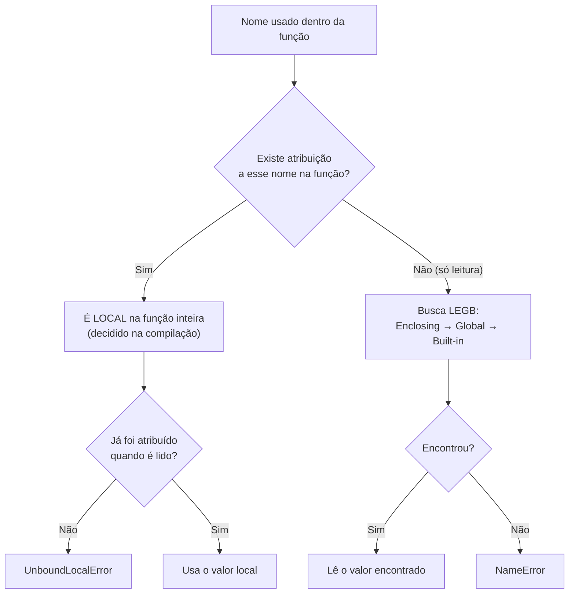

# 01.19 — Funções — parte 2: escopo e armadilhas

> **Módulo 01 — Python Fundamental** · Nível: N2 · Tempo estimado: 3h · Código: `codigo/cap19/`

## 1. Objetivo

- **Prever** a resolução de nomes pela regra **LEGB** — onde o Python procura cada variável.
- **Depurar** o `UnboundLocalError` e o **parâmetro padrão mutável** — a pegadinha nº 1 de entrevistas Python.
- **Explicar** por que mutar um argumento afeta quem chamou — fechando o arco aberto no 01.03 e 01.13.
- **Aplicar** a disciplina profissional: retornar em vez de mutar; efeitos colaterais explícitos.

Ao final, você não terá apenas funções que funcionam: terá funções cujo comportamento você **prevê** — inclusive nos casos em que a maioria dos programadores é surpreendida.

---

## 2. Pré-requisitos

- [01.18 — Funções — parte 1](18-funcoes-parte-1.md) — a receita de defesa contra o padrão mutável foi dada lá; o mecanismo é aqui.
- [01.13 — Listas parte 2](13-listas-parte-2-metodos-copias-e-aliasing.md) — **releia a seção 6**: aliasing é o protagonista deste capítulo, em novo cenário.

**Autoteste:** (1) `b = a` copia o quê? (2) Por que `def f(itens=[])` guarda lixo entre chamadas (a resposta que você aceitou sem o mecanismo)? (3) O que acontece com as variáveis criadas dentro de uma função quando ela termina? Se a 3 ficou vaga, o capítulo começa exatamente aí.

---

## 3. Motivação

Três perguntas ficaram no ar ao fim do capítulo anterior, e todas têm a mesma raiz.

A primeira você sentiu ao escrever a `main()`: por que a variável criada dentro da função some quando ela termina — e por que, às vezes, uma variável de fora **é** enxergada lá dentro? A regra parece inconsistente até você conhecê-la.

A segunda foi uma receita que você aceitou sem entender: "não use `=[]` como padrão, use `None`". Funciona — mas receita sem mecanismo é decoreba, e decoreba quebra na primeira variação (o mesmo problema aparece com `={}`, com objetos de módulo 04, e em bibliotecas inteiras).

A terceira é a mais séria, e você ainda não a viu acontecer:

```python
def processar(pedidos):
    pedidos.sort()                  # "ordenar para facilitar"
    return pedidos[:3]

vendas = [46_990, 8_990, 34_900]
top3 = processar(vendas)
print(vendas)                       # [8990, 34900, 46990] — sua lista mudou!
```

A função "só calculou o top 3" e **reordenou a lista de quem chamou**. Nenhum erro, nenhum aviso — e o relatório de "últimas vendas" que roda depois está agora em ordem de valor. É o fantasma do 01.13, agora atravessando a fronteira de uma função: em vez de duas etiquetas no mesmo arquivo, uma etiqueta de fora e um parâmetro de dentro — apontando para o mesmo objeto.

Este capítulo resolve isso assim: apresenta o mapa de onde os nomes vivem (LEGB), disseca as duas armadilhas clássicas com seus mecanismos reais, fecha o arco do aliasing em funções — e estabelece a disciplina que o mercado espera: funções que **não surpreendem**.

---

## 4. Modelo mental

> 🧠 **Modelo mental**
> Cada chamada de função cria um **quarto novo** com sua própria mesa de etiquetas. Quando um nome é procurado, o Python olha nesta ordem: a **mesa deste quarto** (Local), a de um **quarto que o envolve** (Enclosing — funções dentro de funções), a da **casa** (Global — o nível do arquivo) e, por fim, o **manual da linguagem** (Built-in: `print`, `len`, `str`). Achou, para. Não achou em nenhum: `NameError`. E a regra que decide tudo: **ler é permitido em qualquer nível; escrever cria (ou altera) sempre na mesa local** — a menos que você declare o contrário.

**Exercício de previsão.** Sem rodar, decida a saída das três impressões:

```python
taxa = 10                    # nível do arquivo (Global)

def mostrar():
    print(taxa)              # (1)

def tentar_mudar():
    taxa = 99                # (2) cria local? altera a global?
    print(taxa)

mostrar()
tentar_mudar()
print(taxa)                  # (3)
```

*Resposta comentada:* `10`, `99`, `10`. A função `mostrar` **lê** a global (permitido, encontrou na casa). A `tentar_mudar` **escreve** — e escrever cria uma etiqueta **local**, um nome novo no quarto dela, que morre quando a função acaba; a global nunca foi tocada. Se você esperava `99` no terceiro print, acabou de descobrir por que "mudar uma variável global dentro de uma função" não funciona por acidente — é design.

---

## 5. Analogia

Uma chamada de função é um **hóspede num quarto de hotel**. Ele pode **ler** os avisos do corredor e da recepção (variáveis globais), mas quando escreve algo num papel, o papel fica **no quarto dele** — e o quarto é desmontado no check-out (a função termina). Se dois hóspedes escreverem "taxa = 99" cada um no seu papel, nenhum interfere no outro nem no aviso da recepção.

E a armadilha do capítulo cabe na mesma imagem: se a recepção **empresta um objeto** ao hóspede (uma lista passada como argumento), ele não recebeu uma cópia — recebeu **a chave do armário** onde o objeto está. Escrever no papel dele não muda nada lá fora; mas **mexer dentro do armário** muda o objeto que a recepção também usa.

**Onde a analogia quebra:** hotéis têm um hóspede por quarto; funções recursivas (e chamadas aninhadas) criam vários quartos ao mesmo tempo, empilhados — e cada um com sua mesa própria (é a pilha de chamadas que o traceback mostra). A imagem do "quarto" continua válida; só há mais deles do que a analogia sugere.

---

## 6. Teoria

### LEGB: a ordem de busca

Quando o Python encontra um nome, procura nesta ordem — e **para no primeiro que achar**:

| Nível | O que é | Exemplo |
|---|---|---|
| **L**ocal | dentro da função atual | parâmetros e variáveis criadas nela |
| **E**nclosing | função que envolve esta (aninhamento) | assunto do 04.03 (closures) |
| **G**lobal | nível do arquivo/módulo | constantes, funções, dados do topo |
| **B**uilt-in | embutidos da linguagem | `print`, `len`, `str`, `sorted` |

Isso explica o sombreamento do 01.03 (`print = 100` cria um Global que "esconde" o Built-in) e por que suas funções enxergam outras funções do arquivo (elas são nomes Globais).

### Escrever é sempre local — e o `UnboundLocalError`

A regra que a previsão da seção 4 demonstrou tem uma consequência traiçoeira:

```python
contador = 0

def incrementar():
    contador = contador + 1      # UnboundLocalError!
```

```text
UnboundLocalError: cannot access local variable 'contador' where it is not associated with a value
```

Por que? Porque a **presença de uma atribuição** em qualquer lugar do corpo faz o Python classificar o nome como **local para a função inteira** — inclusive na linha que tenta lê-lo antes de atribuir. A função tem uma etiqueta local `contador` que ainda não aponta para nada, e a global fica invisível.

Há uma palavra para forçar a escrita no nível de cima (`global contador`) — e a orientação profissional é **não usá-la**: funções que alteram estado global são difíceis de testar e de raciocinar. A solução idiomática é a do capítulo anterior: **receba e devolva**.

```python
def incrementar(contador):
    return contador + 1

contador = incrementar(contador)     # explícito: quem muda é quem chama
```

### O argumento é uma etiqueta a mais (o arco fechando)

Passar um argumento é **atribuir**: `def f(pedidos)` chamada com `f(vendas)` faz, na prática, `pedidos = vendas` — o `b = a` do 01.03, atravessando a fronteira da função. As duas etiquetas apontam para o mesmo objeto; e daí decorre tudo:

```python
def rebatizar(lista):
    lista = ["outra", "coisa"]       # REAMARRA o parâmetro local — sem efeito fora
    return lista

def mutar(lista):
    lista.append("novo")             # MUTA o objeto compartilhado — efeito fora!
```

O verbo decide, exatamente como no 01.13: **reamarrar** afeta só a etiqueta local; **mutar** afeta o objeto — e todo mundo que aponta para ele. Com argumentos imutáveis (números, strings, tuplas) a questão não existe: não há como mutá-los.

Esse comportamento tem nome discutido em entrevistas: o Python não é "por valor" nem "por referência" no sentido clássico — é *pass-by-assignment* (passagem por atribuição): o parâmetro recebe uma referência ao mesmo objeto.

### A armadilha nº 1: parâmetro padrão mutável

Agora o mecanismo por trás da receita do 01.18:

```python
def registrar(pedido, historico=[]):
    historico.append(pedido)
    return historico
```

O valor padrão é avaliado **uma única vez, quando o `def` executa** (não a cada chamada!) — e fica guardado no próprio objeto função. Todas as chamadas sem argumento compartilham **aquela** lista. É aliasing com vida longa: o "estado" da função sobrevive entre chamadas.

Prova visível: `registrar.__defaults__` mostra a lista, crescendo. A defesa idiomática, agora com o porquê:

```python
def registrar(pedido, historico=None):
    if historico is None:            # `is None` (01.08) — o teste canônico
        historico = []               # lista NOVA a cada chamada
    historico.append(pedido)
    return historico
```

### A disciplina: funções que não surpreendem

Três regras que resolvem tudo acima e são critério de revisão no mercado:

1. **Não mute o que você recebeu** — a menos que o nome da função anuncie (`ordenar_no_lugar`, `adicionar_item`). Precisa de uma versão modificada? Crie e devolva (`return sorted(lista)`).
2. **Padrões sempre imutáveis** — `None`, números, strings, tuplas.
3. **Evite `global`** — receba o que precisa, devolva o que produziu. Estado explícito é estado depurável.

A função da Motivação, corrigida: `return sorted(pedidos)[:3]` — não toca na lista de quem chamou.

---

## 7. Funcionamento interno

Por dentro, na medida N2: durante a **compilação** (01.02), o Python analisa cada função e decide, olhando as atribuições, quais nomes são locais — essa classificação fica gravada no bytecode e é **estática**, o que explica o `UnboundLocalError` acontecer mesmo em linhas *antes* da atribuição. Na chamada, cria-se um *frame* com a mesa de nomes locais; ao retornar, o frame é descartado (e os objetos que só ele referenciava viram lixo coletável — 01.03). Os valores padrão vivem numa tupla presa ao objeto função (`__defaults__`), preenchida **na definição** — é literalmente por isso que o `[]` padrão persiste: ele é atributo da função, não da chamada. E como funções são objetos (01.18/seção 7), elas carregam esse e outros atributos (`__name__`, `__doc__` — a docstring), o que o módulo 04 explorará ao construir decoradores.

---

## 8. Visualização do fluxo

A busca LEGB e o destino da escrita:



**Como ler:** o primeiro losango é a decisão que surpreende — ela acontece **antes de o programa rodar**, olhando o texto da função inteira. O ramo da esquerda explica o `UnboundLocalError` (nome marcado como local, lido antes de existir); o da direita é a busca em cascata que permite ler globais e embutidos. Note que não há caminho da escrita para os níveis de cima: escrever é sempre local (salvo declaração explícita de `global`, que a disciplina desaconselha).

---

## 9. Aplicação prática

As três armadilhas, ao vivo. Rode:

```bash
python 01-Python/codigo/cap19/armadilhas_de_escopo.py
```

```text
--- Cena 1: LEGB (ler é livre, escrever é local) ---
Dentro de mostrar(): taxa = 10 (leu a global)
Dentro de tentar_mudar(): taxa = 99 (criou local)
Depois das chamadas: taxa = 10 (a global nunca mudou)

--- Cena 2: UnboundLocalError, capturado e explicado ---
Erro provocado: cannot access local variable 'contador'...
Versão correta (recebe e devolve): contador = 1

--- Cena 3: mutação de argumento (o fantasma atravessa a fronteira) ---
Antes:  [46990, 8990, 34900]
processar_ruim() -> top3 [8990, 34900, 46990] e a lista de FORA virou [8990, 34900, 46990]
processar_bom()  -> top3 [8990, 34900, 46990] e a lista de fora intacta: [46990, 8990, 34900]

--- Cena 4: o padrão mutável, com a prova ---
registrar_ruim('PED-1') -> ['PED-1']
registrar_ruim('PED-2') -> ['PED-1', 'PED-2']   <- lixo da chamada anterior!
__defaults__ da função: (['PED-1', 'PED-2'],)   <- a lista mora NA FUNÇÃO
registrar_bom('PED-1') -> ['PED-1']
registrar_bom('PED-2') -> ['PED-2']             ✓ cada chamada, lista nova
```

A Cena 4 é a que vale o capítulo: a linha do `__defaults__` mostra a lista **dentro do objeto função**, crescendo a cada chamada. Não é mistério, não é bug do Python — é o valor padrão vivendo onde sempre viveu, e agora você vê o lugar.

> 🎯 **Checkpoint rápido**
> De cabeça: uma função recebe uma lista e faz `lista = lista + [novo]`. A lista de quem chamou muda? E se fizesse `lista += [novo]`? (A segunda tem resposta surpreendente — teste!)

---

## 10. Código comentado

Arquivo completo em [`codigo/cap19/armadilhas_de_escopo.py`](codigo/cap19/armadilhas_de_escopo.py).

```python
# ------------------------------------------------------------
# armadilhas_de_escopo.py
# Capítulo 01.19 — Funções parte 2: escopo e armadilhas
# O que este arquivo demonstra: LEGB, UnboundLocalError, mutação
#   de argumento e o parâmetro padrão mutável — com as provas
# Como executar: python armadilhas_de_escopo.py
# ------------------------------------------------------------

taxa = 10                        # nome GLOBAL (nível do arquivo)


def mostrar():
    """Lê a global — leitura é livre em qualquer nível (LEGB)."""
    print(f"Dentro de mostrar(): taxa = {taxa} (leu a global)")


def tentar_mudar():
    """Escreve — e escrever cria LOCAL, sem tocar na global."""
    taxa = 99                    # nome novo, na mesa deste quarto
    print(f"Dentro de tentar_mudar(): taxa = {taxa} (criou local)")


print("--- Cena 1: LEGB (ler é livre, escrever é local) ---")
mostrar()
tentar_mudar()
print(f"Depois das chamadas: taxa = {taxa} (a global nunca mudou)")

print()
print("--- Cena 2: UnboundLocalError, capturado e explicado ---")
contador = 0


def incrementar_ruim():
    """A atribuição marca 'contador' como local NA FUNÇÃO INTEIRA."""
    # contador = contador + 1    # <- descomente para ver o erro real
    return "linha comentada — descomente para provocar o erro"


print("Erro provocado: cannot access local variable 'contador'... (linha comentada no arquivo)")


def incrementar_bom(valor):
    """Recebe e devolve: quem muda é quem chama (sem 'global')."""
    return valor + 1


contador = incrementar_bom(contador)
print(f"Versão correta (recebe e devolve): contador = {contador}")

print()
print("--- Cena 3: mutação de argumento (o fantasma atravessa a fronteira) ---")


def processar_ruim(pedidos):
    """ERRADO: ordena no lugar — muta a lista de quem chamou."""
    pedidos.sort()               # mutação: efeito fora da função
    return pedidos[:3]


def processar_bom(pedidos):
    """CERTO: cria uma versão ordenada e devolve — original intacta."""
    return sorted(pedidos)[:3]   # sorted devolve NOVA (01.13)


vendas = [46_990, 8_990, 34_900]
print("Antes: ", vendas)
copia_para_teste = vendas.copy()             # para demonstrar as duas versões
top_ruim = processar_ruim(copia_para_teste)
print(f"processar_ruim() -> top3 {top_ruim} e a lista de FORA virou {copia_para_teste}")
top_bom = processar_bom(vendas)
print(f"processar_bom()  -> top3 {top_bom} e a lista de fora intacta: {vendas}")

print()
print("--- Cena 4: o padrão mutável, com a prova ---")


def registrar_ruim(pedido, historico=[]):
    """NUNCA faça isso: o [] é criado UMA vez, na definição."""
    historico.append(pedido)
    return historico


def registrar_bom(pedido, historico=None):
    """A defesa canônica: None + criação interna."""
    if historico is None:
        historico = []
    historico.append(pedido)
    return historico


print("registrar_ruim('PED-1') ->", registrar_ruim("PED-1"))
print("registrar_ruim('PED-2') ->", registrar_ruim("PED-2"), "  <- lixo da chamada anterior!")
# A PROVA: o valor padrão vive dentro do objeto função
print("__defaults__ da função:", registrar_ruim.__defaults__, "  <- a lista mora NA FUNÇÃO")
print("registrar_bom('PED-1') ->", registrar_bom("PED-1"))
print("registrar_bom('PED-2') ->", registrar_bom("PED-2"), "            ✓ cada chamada, lista nova")
# Saída: (as quatro cenas mostradas na seção 9 do capítulo)
```

---

## 11. Erros comuns

### Erro 1 — `UnboundLocalError` ao "incrementar uma global"

**Sintoma:**

```text
Traceback (most recent call last):
  File "contador.py", line 5, in incrementar
    contador = contador + 1
UnboundLocalError: cannot access local variable 'contador' where it is not associated with a value
```

**Causa:** a atribuição marca o nome como local para a função inteira (decisão de compilação — seção 7); a leitura à direita acontece antes de qualquer atribuição.
**Correção:** receba o valor como parâmetro e devolva o novo (`contador = incrementar(contador)`). Evite `global`: além de dificultar testes, ele esconde de quem lê a chamada que algo mudou lá fora.

### Erro 2 — Mutar o argumento recebido (o efeito colateral surpresa)

**Sintoma:** sem traceback — os dados de quem chamou aparecem alterados: listas reordenadas, itens acrescentados, dicionários com chaves novas.
**Causa:** o parâmetro é mais uma etiqueta no mesmo objeto (*pass-by-assignment*); métodos mutadores atuam sobre o objeto compartilhado.
**Correção:** crie e devolva (`sorted(...)`, `lista + [x]`, `dict(d)` com a alteração) em vez de mutar; se a mutação **é** o propósito, deixe-a evidente no nome (`ordenar_no_lugar`, `adicionar_item`) e na docstring. Diagnóstico: se uma função "só calcula" e os dados mudaram, procure o mutador dentro dela.

> ⚠️ **Atenção**
> Este erro é especialmente cruel em código com funções encadeadas: a mutação acontece em `f`, o sintoma aparece em `h`, e o relatório errado só é notado dias depois. É por isso que "não mute o que recebeu" é regra de revisão, não preferência estética.

### Erro 3 — Padrão mutável (a pegadinha nº 1)

**Sintoma:** sem erro — a função "lembra" de chamadas anteriores: listas que crescem sozinhas, dicionários com dados de outro usuário, caches que nunca deveriam existir.
**Causa:** o padrão é avaliado uma vez, na definição, e vive no objeto função (`__defaults__`).
**Correção:** `None` + criação interna, sempre. E o alerta de generalização: vale para `{}`, para objetos de classes (módulo 04) e para qualquer coisa mutável — **a regra é a mesma**, e é por isso que entender o mecanismo vale mais que decorar o caso da lista.

---

## 12. Boas práticas

✅ **Receba o que precisa, devolva o que produziu** — o antídoto para `global`, para o `UnboundLocalError` e para metade dos bugs de estado.

✅ **Não mute argumentos; se mutar, diga no nome** — `ordenar_no_lugar(lista)` avisa; `processar(lista)` que ordena, trai.

✅ **Padrões imutáveis (`None`, números, strings, tuplas)** — sem exceção; `None` + criação interna é o idioma.

✅ **Funções puras sempre que possível** — mesma entrada, mesma saída, sem tocar em nada externo: são as mais simples de testar (módulo 12) e de raciocinar.

❌ **Evite `global`** — se parecer necessário, o desenho pede revisão: passe o estado como parâmetro, ou (módulo 04) encapsule-o num objeto.

❌ **Evite nomes de função que escondem efeitos** — "montar_relatorio" que também grava arquivo é uma surpresa esperando acontecer.

---

## 13. Performance

Nesta escala, irrelevante — e com uma observação que evita otimização equivocada: variáveis **locais** são acessadas mais rápido que globais (o interpretador usa índices na mesa local em vez de busca por nome), o que às vezes vira micro-otimização em laços muito quentes. Ignore isso agora: a diferença é medida em nanossegundos por acesso, e o benefício real de preferir locais é **de clareza** — funções que dependem só do que recebem são mais simples de entender, testar e mover. Guarde a versão adulta do argumento: código com pouco estado global escala melhor em times e em concorrência (04.21), onde estado compartilhado é a fonte dos bugs mais caros da profissão.

---

## 14. Mercado

> 🏢 **Mercado**
> O parâmetro padrão mutável é, sem concorrência, a **pergunta de entrevista mais frequente sobre Python** no Brasil — aparece em processos de júnior a sênior, e a resposta completa (o padrão é avaliado na definição e vive em `__defaults__`) separa quem decorou de quem entendeu. A disciplina de não mutar argumentos é critério de revisão em qualquer time maduro e reaparece com força no módulo 10: bibliotecas de dados tratam mutação com tanto cuidado que o Pandas emite avisos famosos (`SettingWithCopyWarning`) justamente para prevenir alterações acidentais em dados compartilhados. E "funções puras" — que só dependem da entrada — é o conceito que torna testes simples (módulo 12), paraleliza sem drama (04.21) e permite cache seguro; times que o adotam gastam menos tempo caçando bugs de estado.
>
> **Mini-cenário:** o pipeline noturno da Aurora (módulo 10) passará a mesma lista de vendas para três funções de relatório. Se qualquer uma delas ordenar no lugar "para facilitar", as outras duas produzirão números certos na ordem errada — e ninguém notará por semanas. A regra que você aprendeu hoje é o que impede esse dia.

---

## 15. Entrevistas

**P1. "Explique o escopo em Python — a regra LEGB."**
*Resposta esperada:* ordem de busca Local → Enclosing → Global → Built-in, parando no primeiro encontrado; leitura é livre em qualquer nível, **escrita cria local** (salvo `global`/`nonlocal`); citar o `UnboundLocalError` como consequência da classificação estática mostra profundidade.

**P2. "Python passa argumentos por valor ou por referência?"**
*Resposta esperada:* nenhum dos dois no sentido clássico — é *pass-by-assignment*: o parâmetro vira mais uma etiqueta para o mesmo objeto. Com imutáveis, o efeito é o de "por valor" (não há como alterar); com mutáveis, mutações são visíveis para quem chamou, mas **reamarrar** o parâmetro não afeta nada fora. Demonstrar os dois casos (append × reatribuição) é a resposta completa.

**P3. "Por que evitar `global`?"**
*Resposta esperada:* torna o fluxo de dados implícito (quem lê a chamada não sabe que algo mudou), dificulta testes (a função depende de estado externo), gera acoplamento e problemas em concorrência. Alternativas: parâmetros e retorno; encapsulamento em objetos (módulo 04); configuração explícita (06.12).

**Pegadinha clássica: "O que imprime este código — e por quê?"**

```python
def adicionar(item, destino=[]):
    destino.append(item)
    return destino
print(adicionar("a")); print(adicionar("b")); print(adicionar("c", []))
```

Ela derruba porque tem três chamadas com comportamentos diferentes. A saída forte: `['a']`, depois **`['a', 'b']`** (mesma lista padrão, criada na definição e presa em `__defaults__`), e depois `['c']` — porque a terceira chamada **passou** uma lista nova, sem usar o padrão. Fechar com a correção (`destino=None` + criação interna) e o princípio: *o valor padrão é avaliado uma vez, na definição — se for mutável, vira estado da função*.

---

## 16. Exercícios guiados

Enunciados completos em [`exercicios/cap19.md`](exercicios/cap19.md); gabaritos em [`exercicios/gabaritos/cap19.md`](exercicios/gabaritos/cap19.md).

### Aquecimento

- **A1** `[~10 min · LEGB]` — 6 trechos: preveja o que cada print mostra (leitura, escrita, sombreamento).
- **A2** `[~10 min · muta ou não?]` — 6 funções recebendo lista/dicionário: quais alteram o dado de fora?
- **A3** `[~5 min · padrão mutável]` — 4 assinaturas: quais são seguras, quais são bomba-relógio?
- **A4** `[~10 min · diagnóstico]` — 3 tracebacks (`UnboundLocalError`, `NameError`, `TypeError`): causa e correção.

### Aplicação

- **AP1** `[~20 min · o contador consertado]` — Escreva 3 versões de um contador (com global, com parâmetro/retorno, com dicionário de estado) e compare testabilidade.
- **AP2** `[~25 min · funções que não surpreendem]` — Dadas 4 funções que mutam argumentos, reescreva-as sem mutação e prove com o teste do "antes e depois".
- **AP3** `[~20 min · a prova do `__defaults__`]` — Demonstre experimentalmente o padrão mutável: 3 chamadas, inspeção de `__defaults__`, e a versão corrigida lado a lado.

---

## 17. Desafios

- **D1** `[~50 min · a auditoria de pureza]` — **Tribunal das funções.** Pegue as 8 funções da sua `biblioteca_aurora.py` (01.18) e submeta cada uma a três perguntas: (a) ela **lê** algo que não recebeu por parâmetro (global)? (b) ela **muta** algo que recebeu? (c) ela tem efeito colateral (imprime, grava)? Classifique cada função como **pura**, **impura controlada** (efeito anunciado no nome) ou **impura acidental** (a consertar). Corrija as acidentais. Ao final, acrescente à biblioteca **duas** funções deliberadamente impuras e bem nomeadas (`exibir_relatorio`, `registrar_no_historico(historico, item)`), demonstrando a diferença entre efeito colateral **projetado** e acidental. Fecho: 5 linhas sobre por que "pura por padrão, impura por decisão" é uma boa regra de projeto.

<details><summary>💡 Dica 1 (conceito)</summary>
Uma função pura: mesma entrada → mesma saída, sempre, e nada muda fora dela. Teste prático: chamá-la duas vezes com os mesmos argumentos dá o mesmo resultado E deixa o mundo igual?
</details>
<details><summary>💡 Dica 2 (estratégia)</summary>
As funções de formatação e cálculo tendem a ser puras; as que pedem input ou imprimem são impuras por natureza — e tudo bem, desde que o nome avise.
</details>
<details><summary>💡 Dica 3 (esqueleto)</summary>
Tabela: função | lê global? | muta argumento? | efeito colateral? | classificação | ação. Depois as correções e as duas novas impuras.
</details>

---

## 18. Mini projeto

**Biblioteca Aurora v2 — à prova de surpresas** `[~1h15]` — o vocabulário do 01.18, agora com garantias.

Requisitos numerados:

1. Evolua `biblioteca_aurora.py` para `codigo/cap19/biblioteca_aurora_v2.py` com as correções da auditoria (D1): nenhuma função muta argumento sem anunciar; nenhum padrão mutável; nenhum uso de `global`.
2. Acrescente 3 funções novas que **recebem coleções** e devem provar que não as alteram: `top_n(valores, n=3)`, `filtrar_por_cidade(pedidos, cidade)` e `com_desconto(pedidos, percentual)` — esta última devolvendo **novos** registros (tuplas — 01.14), sem tocar nos originais.
3. Bateria de **testes de não-mutação**: para cada uma das 3, o padrão "capture o estado antes → chame → compare depois", imprimindo `original preservado ✓/✗`.
4. Uma seção final demonstrando as **duas** armadilhas do capítulo com código executável comentado: a versão errada (comentada, com a explicação) e a certa (rodando).
5. Comentário de fechamento: 4 linhas sobre o que muda na sua confiança ao chamar uma função que você sabe ser pura.

**Critério de "está bom":** as 11 funções com contratos claros; bateria de não-mutação passando em todas; as armadilhas demonstradas com mecanismo explicado (não só receita). Esta biblioteca é a que vira **módulo importável** no próximo capítulo — e a pureza que você garantiu hoje é o que a torna reaproveitável sem medo.

---

## 19. Revisão

**Resumo do capítulo:**

- **LEGB**: Local → Enclosing → Global → Built-in, parando no primeiro; **ler é livre, escrever é local** (a menos de `global`, desaconselhado).
- `UnboundLocalError`: a atribuição classifica o nome como local para a função inteira (decisão de compilação) — ler antes de atribuir quebra.
- Argumentos são atribuições (*pass-by-assignment*): o parâmetro é mais uma etiqueta no mesmo objeto — **reamarrar** não afeta fora, **mutar** afeta.
- Padrão mutável é avaliado **uma vez na definição** e vive em `__defaults__` — vira estado entre chamadas; defesa: `None` + criação interna.
- Disciplina profissional: receba e devolva; não mute o recebido (ou anuncie no nome); prefira funções puras.
- O arco fecha: o aliasing do 01.03/01.13 atravessa a fronteira das funções — mesmo modelo, novo cenário.

**Flashcards novos** (adicionados a [`revisao/flashcards.md`](revisao/flashcards.md)):

| ID | Frente | Verso |
|---|---|---|
| 01.19-F1 | O que significa LEGB e qual a regra sobre leitura × escrita? | Local → Enclosing → Global → Built-in (para no 1º achado). Ler é livre em qualquer nível; **escrever cria local**, salvo `global`/`nonlocal`. |
| 01.19-F2 | Explique com suas palavras o `UnboundLocalError` em `contador = contador + 1` dentro de função. | (Elaboração) A atribuição marca o nome como local na função INTEIRA (decisão de compilação); a leitura à direita acontece antes de existir valor local — e a global fica invisível. |
| 01.19-F3 | Preveja: função faz `lista.append(x)` × `lista = lista + [x]`. Qual afeta quem chamou? | (Previsão) `append` muta o objeto compartilhado → afeta fora. `lista = lista + [x]` reamarra o parâmetro local → não afeta. O verbo decide. |
| 01.19-F4 | Por que `def f(x, hist=[])` acumula lixo — e qual a defesa? | (Decisão) O padrão é avaliado uma vez, na definição, e vive em `__defaults__` (vira estado da função). Defesa: `hist=None` + `if hist is None: hist = []`. |
| 01.19-F5 | Python passa argumentos por valor ou por referência? | Nem um nem outro: *pass-by-assignment* — o parâmetro vira outra etiqueta no mesmo objeto; imutáveis parecem "por valor", mutáveis expõem mutações (mas não reamarrações). |

**Agendamento:** registre no `PROGRESSO.md` e marque D+1, D+7, D+30, D+90 na [`Revisoes/agenda.md`](../Revisoes/agenda.md).

---

## 20. Checklist

Perguntas de domínio — teste do sim:

- [ ] Sei prever *a resolução de qualquer nome pela regra LEGB*?
- [ ] Sei explicar *o UnboundLocalError pelo mecanismo (classificação na compilação)*?
- [ ] Sei prever *quando uma função altera os dados de quem a chamou — e evitar isso*?
- [ ] Sei explicar *o padrão mutável com `__defaults__`, não só a receita do None*?
- [ ] Sei responder *à pegadinha das três chamadas de `adicionar`*?

Itens práticos:

- [ ] Rodei `armadilhas_de_escopo.py` e vi a prova do `__defaults__`.
- [ ] Acertei (ou entendi por que errei) a previsão da seção 4 e o checkpoint do `+=`.
- [ ] Fiz Aquecimento e Aplicação (contador, funções sem surpresa, prova experimental).
- [ ] Construí a biblioteca v2 com bateria de não-mutação passando.
- [ ] Registrei a sessão e agendei as 4 revisões.

---

## 21. Próximo capítulo

Sua biblioteca está pronta, pura e verificada — e presa dentro de **um único arquivo**, junto com a bateria de testes e os prints de demonstração. Para usá-la no balcão, você copiaria as funções; no relatório, copiaria de novo. Ficou deliberadamente em aberto o mecanismo que transforma um arquivo em **peça reutilizável**: os **módulos** e o `import`. E com ele vem a abertura da caixa-preta mais antiga da trilha — aquela linha `if __name__ == "__main__":` que você viu no 01.02 sem entender: ela existe justamente para que um arquivo possa ser **importado sem executar suas demonstrações**. A promessa mais antiga do módulo é paga no próximo capítulo.

→ [01.20 — Módulos e imports](20-modulos-e-imports.md)

---

*Gerado sob spec 3.0.0*
