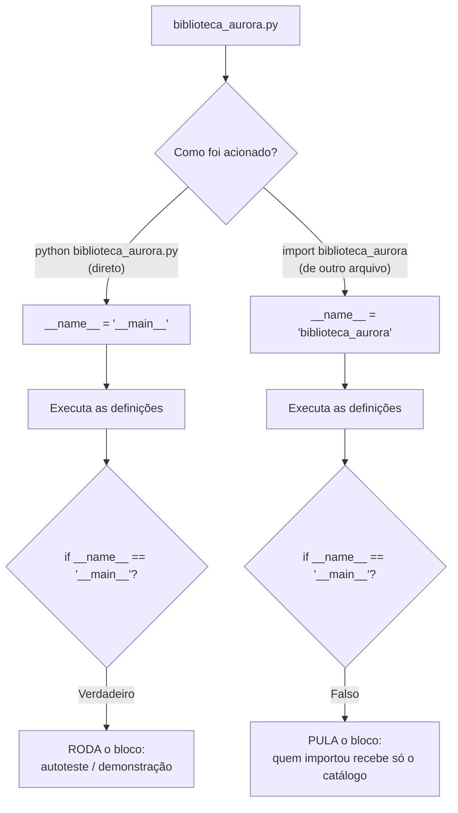

# 01.20 — Módulos e imports

> **Módulo 01 — Python Fundamental** · Nível: N1 · Tempo estimado: 2h30 · Código: `codigo/cap20/`

## 1. Objetivo

- **Organizar** um programa em múltiplos arquivos com `import` — e escolher a forma de importação certa.
- **Explicar** `if __name__ == "__main__":` — pagando a caixa-preta mais antiga da trilha.
- **Aplicar** módulos da biblioteca padrão (`csv`, `json`, `datetime`, `random`) — o ecossistema que vem de fábrica.
- **Estruturar** o embrião de organização do Atlas: biblioteca + programas que a consomem.

Ao final, sua biblioteca deixa de ser um arquivo isolado e vira **peça reutilizável** — e você entende, enfim, aquela linha misteriosa que vê em todo código Python desde o primeiro dia.

---

## 2. Pré-requisitos

- [01.19 — Funções parte 2](19-funcoes-parte-2-escopo-e-armadilhas.md) — a biblioteca v2, pura e verificada, é o que você vai importar.
- [01.02 — Como o Python executa seu código](02-como-o-python-executa-seu-codigo.md) — o `__pycache__` prometido lá aparece de verdade aqui.

**Autoteste:** (1) O que é a biblioteca padrão (01.01)? (2) O que o `import copy` do 01.13 fez? (3) Por que a `biblioteca_aurora_v2.py` não pode ser usada pelo balcão hoje sem copiar código? Se a 3 é clara, você entendeu a dor deste capítulo.

---

## 3. Motivação

Sua biblioteca tem onze funções puras, testadas, com docstrings — e está **presa**. Para usá-las no balcão, você copiaria o bloco de `def`s; para usá-las no relatório, copiaria de novo. Voltaríamos ao problema que o 01.18 resolveu, só que em escala de arquivo: a duplicação sai das linhas e vai para os arquivos.

Pior: sua biblioteca **não é só definições**. Lá no fim tem a bateria de verificação com dezenas de prints. Se você conseguisse importá-la, esses prints executariam junto — toda vez, poluindo qualquer programa que a usasse. É um problema real com uma solução conhecida, e você já a viu: aquela linha

```python
if __name__ == "__main__":
```

que apareceu no 01.02 como caixa-preta, com a promessa de ser aberta "no capítulo de módulos". Chegamos.

Há também um terceiro motivo, mais empolgante: você tem escrito tudo do zero — mas o Python vem com **centenas de módulos prontos** na biblioteca padrão. Ler CSV com o módulo `csv` (em vez de `split(";")` artesanal), trabalhar com datas de verdade, gerar dados de teste — tudo a um `import` de distância. Os capítulos 01.22 e 01.23 vivem disso, e este é o capítulo que abre a porta.

Este capítulo resolve isso assim: apresenta módulos e as formas de importar, abre a caixa-preta do `__main__` com o mecanismo real, mostra a biblioteca padrão em ação — e reorganiza seus arquivos na estrutura que o Atlas usará daqui em diante.

---

## 4. Modelo mental

> 🧠 **Modelo mental**
> Um **módulo** é um arquivo `.py` visto como **caixa de ferramentas com etiqueta**. Ao ser importado, o Python **executa o arquivo inteiro, uma única vez**, e guarda tudo que ele definiu (funções, variáveis, classes) sob o nome do módulo. É por isso que definições viajam bem — e que **código solto no meio do arquivo executa na importação**, quer você queira ou não. O `if __name__ == "__main__":` é o interruptor que separa "o que a caixa oferece" de "o que a caixa faz quando você a liga sozinha".

**Exercício de previsão.** Existem dois arquivos. `ferramentas.py`:

```python
def dobrar(n):
    return n * 2

print("carregando ferramentas...")
print(dobrar(5))
```

E `programa.py`:

```python
import ferramentas
print("programa começou")
```

Sem rodar, decida o que `python programa.py` imprime — e em que ordem.

*Resposta comentada:* imprime `carregando ferramentas...`, depois `10`, e só então `programa começou`. O `import` **executa o arquivo inteiro** — inclusive os prints, que não eram para ninguém além do autor de `ferramentas.py`. Se você esperava só "programa começou", acabou de entender por que o `if __name__` existe: sem ele, toda importação carrega junto as demonstrações do autor.

---

## 5. Analogia

Importar um módulo é **contratar um fornecedor**. Você não recebe as máquinas dele — recebe acesso ao **catálogo** (as funções que ele definiu). E há uma sutileza que a analogia captura bem: ao "abrir a conta", o fornecedor **liga a fábrica uma vez** (o arquivo executa) — se ele deixou a esteira de demonstração ligada no galpão, ela roda no seu tempo e na sua conta.

O `if __name__ == "__main__":` é a placa que separa dois modos de operar a mesma fábrica: **"visita de cliente"** (alguém importou: só o catálogo interessa) e **"operação própria"** (o dono ligou a fábrica direto: roda a demonstração, os testes, o programa principal).

**Onde a analogia quebra:** fornecedores reais têm estoque e você leva cópias; em Python, o módulo é **um só objeto compartilhado** — se dois arquivos importam o mesmo módulo, ambos falam com a mesma instância (o import acontece uma vez por execução; as demais são consultas ao que já está carregado). Consequência prática: estado global em módulo é compartilhado por todos que o importam — mais um motivo para a disciplina do 01.19.

---

## 6. Teoria

### As formas de importar

```python
import biblioteca_aurora                      # 1. módulo inteiro
biblioteca_aurora.formatar_reais(139_990)

from biblioteca_aurora import formatar_reais  # 2. nomes específicos
formatar_reais(139_990)

from biblioteca_aurora import formatar_reais, calcular_frete   # vários

import biblioteca_aurora as aurora            # 3. com apelido
aurora.formatar_reais(139_990)
```

| Forma | Vantagem | Quando |
|---|---|---|
| `import modulo` | origem explícita em cada uso (`aurora.calcular_frete`) | padrão da trilha; módulos com muitos nomes |
| `from modulo import nome` | chamadas curtas | quando são poucos nomes e o contexto é claro |
| `import modulo as apelido` | encurta nomes longos | convenção em bibliotecas (`import pandas as pd` — módulo 10) |

E a forma **proibida** pela spec (§18.3): `from modulo import *` — traz todos os nomes sem dizer quais, sombreia silenciosamente o que você tinha, e torna impossível saber de onde veio cada função ao ler o código.

### Onde o Python procura os módulos

Ao encontrar `import X`, o interpretador procura, nesta ordem: (1) módulos embutidos; (2) a **pasta do script em execução**; (3) os caminhos de instalação (biblioteca padrão e pacotes instalados). Consequência prática imediata: seus módulos precisam estar **na mesma pasta** do programa que os importa (organizações maiores — pacotes com `__init__.py`, layout `src/` — são o capítulo 04.17).

E o efeito colateral que o 01.02 prometeu: ao importar `biblioteca_aurora.py` pela primeira vez, surge uma pasta `__pycache__/` com o bytecode compilado. Agora você sabe: é cache de importação, recriado sozinho, fora do Git.

### A caixa-preta aberta: `if __name__ == "__main__":`

Todo módulo tem uma variável automática chamada `__name__`. O Python a preenche assim:

- Se o arquivo foi **executado diretamente** (`python arquivo.py`), `__name__` vale `"__main__"`.
- Se o arquivo foi **importado**, `__name__` vale o nome do módulo (`"biblioteca_aurora"`).

Logo:

```python
def formatar_reais(centavos):
    ...

if __name__ == "__main__":
    # Este bloco SÓ roda quando o arquivo é executado diretamente.
    print(formatar_reais(139_990))     # demonstração/teste do próprio módulo
```

Importado, o bloco é ignorado (só as definições chegam a quem importou); executado direto, o bloco roda. É o interruptor da analogia — e a promessa mais antiga da trilha, paga.

O idioma completo, que você usará a partir de agora em todo programa:

```python
def main():
    """Ponto de entrada do programa."""
    ...

if __name__ == "__main__":
    main()
```

### A biblioteca padrão — o que vem de fábrica

Além dos seus módulos, o Python traz centenas prontos. Os que a trilha usa em breve:

```python
import csv          # ler/escrever CSV de verdade (01.22)
import json         # dados aninhados (01.23)
from datetime import date, datetime    # datas com aritmética (04.18)
import random       # dados de teste, amostragem
from pathlib import Path               # caminhos de arquivo (01.22)
```

Um gosto do poder: `date.today().isoformat()` devolve `"2026-07-31"` sem você formatar nada; `random.sample(lista, 3)` sorteia três itens distintos. É a promessa do 01.01 se concretizando: o ecossistema é a maior vantagem competitiva do Python — e a biblioteca padrão é a parte que já está instalada.

> 📦 **Caixa-preta: instalar bibliotecas externas**
> Além da biblioteca padrão existe um universo de pacotes de terceiros (Pandas, FastAPI...) que se instalam com `pip` — e que exigem **ambientes virtuais** para não bagunçar o sistema. A trilha proíbe deliberadamente instalar qualquer coisa até o capítulo **04.16**, onde venv e pip são ensinados com o problema que eles resolvem. Até lá: biblioteca padrão e seus próprios módulos, que é bastante.

### Organizando o Atlas

A estrutura mínima que este capítulo instala (e que o módulo 04 expande):

```text
codigo/cap20/
├── biblioteca_aurora.py     # módulo: só definições + bloco __main__ de autoteste
├── relatorio.py             # programa: importa a biblioteca e produz o relatório
└── balcao.py                # programa: importa a MESMA biblioteca, outro uso
```

Uma biblioteca, dois programas, zero duplicação. É o desenho que sustenta qualquer projeto Python — e o embrião do que o Atlas será.

---

## 7. Funcionamento interno

Por dentro, na medida N1: ao importar, o Python (1) localiza o arquivo pela ordem de busca, (2) compila para bytecode e **grava em `__pycache__`** (01.02), (3) **executa o módulo de cima a baixo** criando um espaço de nomes próprio, e (4) registra o módulo pronto num dicionário interno de módulos carregados. O passo 4 explica o comportamento mais importante: importar o mesmo módulo dez vezes executa o arquivo **uma vez só** — as demais importações apenas consultam o registro (por isso mudanças num módulo não aparecem sem reiniciar o programa). E o espaço de nomes do passo 3 é o "G" do LEGB (01.19): quando uma função da biblioteca lê uma constante do topo do arquivo dela, encontra-a no Global **daquele módulo** — não no do programa que a importou. Módulos são, portanto, fronteiras de nomes: dois módulos podem ter funções de mesmo nome sem colisão, e é por isso que `aurora.formatar()` e `outro.formatar()` convivem em paz.

---

## 8. Visualização do fluxo

O que acontece nas duas formas de acionar o mesmo arquivo:



**Como ler:** os dois caminhos executam as **mesmas definições** — a diferença mora só no valor de `__name__`, preenchido pelo interpretador conforme o acionamento. O losango é o interruptor: mesmo arquivo, dois comportamentos. Guarde a consequência de projeto: tudo que **não** deve rodar na importação (prints, testes, chamadas de exemplo) vai para dentro do bloco.

---

## 9. Aplicação prática

Uma biblioteca, dois programas. Rode os três:

```bash
python 01-Python/codigo/cap20/biblioteca_aurora.py    # direto: roda o autoteste
python 01-Python/codigo/cap20/relatorio.py            # importa: só o catálogo
python 01-Python/codigo/cap20/balcao.py               # importa: outro uso
```

```text
$ python biblioteca_aurora.py
--- Autoteste da biblioteca (só roda em execução direta) ---
formatar_reais(139990) -> R$ 1.399,90 [esperado R$ 1.399,90] ✓
calcular_frete(5000, 'campinas') -> 0 [esperado 0] ✓
validar_codigo('PED-2026-00123') -> True [esperado True] ✓
3/3 verificações passaram.

$ python relatorio.py
=== Relatório Aurora (usando a biblioteca importada) ===
PED-2026-00123 | Fone Bluetooth  |    R$ 469,90 | Campinas
PED-2026-00124 | Mouse Sem Fio   |     R$ 89,90 | Santos
Total: R$ 559,80 | Gerado em 2026-07-31

$ python balcao.py
=== Balcão Aurora (mesma biblioteca, outro programa) ===
Simulação: R$ 1.399,90 em 3x -> primeira R$ 466,64, demais R$ 466,63
```

Repare no que **não** apareceu: o autoteste da biblioteca não poluiu os dois programas. E repare no `relatorio.py`: a data veio de `datetime` — biblioteca padrão em ação, sem instalar nada.

Agora o experimento que fixa o conceito: abra `biblioteca_aurora.py`, **tire** o `if __name__ == "__main__":` (deixando o autoteste solto no fim), e rode `relatorio.py` de novo. O autoteste aparece no meio do seu relatório. Devolva o `if` e siga em paz — você acabou de ver, na própria tela, o motivo de aquela linha existir.

> 🎯 **Checkpoint rápido**
> De cabeça: qual o valor de `__name__` dentro de `biblioteca_aurora.py` quando ela é importada por `relatorio.py`? E se você rodar `python biblioteca_aurora.py`?

---

## 10. Código comentado

Arquivos completos em [`codigo/cap20/`](codigo/cap20/).

```python
# ------------------------------------------------------------
# biblioteca_aurora.py
# Capítulo 01.20 — Módulos e imports
# O que este arquivo demonstra: um MÓDULO — só definições, com
#   autoteste protegido pelo if __name__ == "__main__"
# Como executar: python biblioteca_aurora.py   (roda o autoteste)
#   ou, de outro arquivo: import biblioteca_aurora
# ------------------------------------------------------------

# Constantes do módulo (o "Global" deste espaço de nomes — 01.19)
CIDADE_SEDE = "campinas"
FRETE_CHEIO = 1_990
FRETE_MEIO = 990


def formatar_reais(centavos, com_simbolo=True):
    """Converte centavos (int) no formato monetário brasileiro."""
    texto = f"{centavos / 100:,.2f}"
    texto = texto.replace(",", "@").replace(".", ",").replace("@", ".")
    return "R$ " + texto if com_simbolo else texto


def limpar_texto(bruto):
    """Devolve a forma canônica de um texto vindo de fora."""
    return bruto.strip().lower()


def calcular_frete(total_centavos, cidade):
    """Devolve o frete em centavos conforme a política da Aurora."""
    if limpar_texto(cidade) == CIDADE_SEDE:
        return 0
    if total_centavos >= 29_900:
        return 0
    if total_centavos >= 10_000:
        return FRETE_MEIO
    return FRETE_CHEIO


def separar_parcelas(total_centavos, parcelas):
    """Devolve (primeira, demais) em centavos, com a sobra na primeira."""
    base = total_centavos // parcelas
    return base + total_centavos % parcelas, base


def validar_codigo(codigo):
    """Diz se o código segue o formato PED-AAAA-NNNNN."""
    if len(codigo) != 14 or not codigo.startswith("PED-") or codigo[8] != "-":
        return False
    return "2000" <= codigo[4:8] <= "2100"


def montar_linha(codigo, produto, valor, cidade):
    """Devolve (não imprime!) uma linha formatada de relatório."""
    return f"{codigo} | {produto:<15} | {formatar_reais(valor):>12} | {cidade}"


# --- O INTERRUPTOR: só roda se este arquivo for executado diretamente ---
if __name__ == "__main__":
    print("--- Autoteste da biblioteca (só roda em execução direta) ---")
    casos = [
        ("formatar_reais(139990)", formatar_reais(139_990), "R$ 1.399,90"),
        ("calcular_frete(5000, 'campinas')", calcular_frete(5_000, "campinas"), 0),
        ("validar_codigo('PED-2026-00123')", validar_codigo("PED-2026-00123"), True),
    ]
    passaram = 0
    for descricao, obtido, esperado in casos:
        marca = "✓" if obtido == esperado else "✗"
        if obtido == esperado:
            passaram += 1
        print(f"{descricao} -> {obtido} [esperado {esperado}] {marca}")
    print(f"{passaram}/{len(casos)} verificações passaram.")
```

```python
# ------------------------------------------------------------
# relatorio.py
# Capítulo 01.20 — Módulos e imports
# O que este arquivo demonstra: um PROGRAMA que importa a
#   biblioteca e usa a biblioteca padrão (datetime)
# Como executar: python relatorio.py
# ------------------------------------------------------------

from datetime import date                 # biblioteca padrão: datas prontas
import biblioteca_aurora as aurora        # nosso módulo, com apelido

PEDIDOS = [
    ("PED-2026-00123", "Fone Bluetooth", 46_990, "Campinas"),
    ("PED-2026-00124", "Mouse Sem Fio", 8_990, "Santos"),
]


def main():
    """Ponto de entrada: monta e imprime o relatório do dia."""
    print("=== Relatório Aurora (usando a biblioteca importada) ===")
    total = 0
    for codigo, produto, valor, cidade in PEDIDOS:
        total += valor
        print(aurora.montar_linha(codigo, produto, valor, cidade))
    hoje = date.today().isoformat()        # '2026-07-31' — sem formatar à mão
    print(f"Total: {aurora.formatar_reais(total)} | Gerado em {hoje}")


if __name__ == "__main__":
    main()
```

---

## 11. Erros comuns

### Erro 1 — `ModuleNotFoundError`

**Sintoma:**

```text
Traceback (most recent call last):
  File "relatorio.py", line 2, in <module>
    import biblioteca_aurora
ModuleNotFoundError: No module named 'biblioteca_aurora'
```

**Causa:** o Python procura na pasta do **script em execução** — e o arquivo não está lá (ou você rodou de outra pasta, ou o nome tem erro de digitação/extensão).
**Correção:** mantenha módulo e programa na mesma pasta e execute a partir dela (`cd codigo/cap20` e depois `python relatorio.py`). Organizações com subpastas exigem pacotes — capítulo 04.17. E confira o nome: `import biblioteca_aurora`, sem o `.py`.

### Erro 2 — Código solto executando na importação

**Sintoma:** sem erro — apenas prints estranhos: o autoteste da biblioteca aparece no meio do seu relatório, ou uma pergunta de `input()` trava um programa que não deveria perguntar nada.
**Causa:** `import` executa o arquivo inteiro; tudo que está no nível do módulo roda.
**Correção:** dentro do módulo, **só definições** no nível do arquivo; demonstrações, testes e execução vão para o bloco `if __name__ == "__main__":`. Regra prática: módulo bem escrito, ao ser importado, **não imprime nada**.

> ⚠️ **Atenção**
> O caso mais perigoso desta categoria é código que causa efeito real na importação — apagar arquivo, enviar requisição, pedir input. Bibliotecas profissionais tratam isso como falha grave: importar deve ser **barato e sem efeito**. Guarde a regra; ela vale para o resto da carreira.

### Erro 3 — Nome de módulo colidindo com a biblioteca padrão

**Sintoma:** erros absurdos ao importar algo conhecido:

```text
AttributeError: module 'csv' has no attribute 'reader'
```

**Causa:** você criou um arquivo chamado `csv.py` (ou `json.py`, `random.py`) na mesma pasta — e a pasta do script tem prioridade sobre a biblioteca padrão: o Python importou **o seu** arquivo.
**Correção:** nunca nomeie arquivos com nomes de módulos da padrão. Se acontecer, renomeie e apague o `__pycache__` correspondente. Diagnóstico rápido: `print(modulo.__file__)` mostra qual arquivo foi realmente importado.

---

## 12. Boas práticas

✅ **Um módulo, um assunto** — `biblioteca_aurora.py` com formatação e regras de negócio; quando crescer, divida por tema (`formatacao.py`, `regras.py`) em vez de deixar um arquivo de 500 linhas.

✅ **Imports no topo do arquivo, agrupados** — biblioteca padrão primeiro, depois seus módulos (é o que a PEP 8 pede, e o 01.25 formaliza).

✅ **`if __name__ == "__main__": main()` em todo programa** — separa definição de execução, torna o arquivo importável, e é o idioma que qualquer revisor espera ver.

✅ **Importar deve ser barato e silencioso** — nada de prints, inputs ou trabalho pesado no nível do módulo.

❌ **Evite `from modulo import *`** — proibido pela spec: sombreia nomes silenciosamente e apaga a origem de cada função para quem lê.

❌ **Evite nomes que colidem com a biblioteca padrão** (`csv.py`, `json.py`, `email.py`) — o diagnóstico é confuso e a correção envolve caçar `__pycache__`.

---

## 13. Performance

Nesta escala, irrelevante — e com dois detalhes úteis. Primeiro: o `import` executa o módulo **uma única vez** por execução do programa (as demais são consultas ao registro — seção 7), então importar em vários arquivos não multiplica custo. Segundo: o custo de importar aparece na **partida** do programa, não no uso — o que importa quando a partida é frequente (scripts de linha de comando chamados milhares de vezes, funções serverless), e é por isso que bibliotecas grandes cuidam para não fazer trabalho pesado no nível do módulo. O `__pycache__` existe justamente para não recompilar a cada partida. Medição de tempo de import só vira assunto real em projetos grandes (módulo 09, ao otimizar contêineres e inicialização).

---

## 14. Mercado

> 🏢 **Mercado**
> `if __name__ == "__main__":` é, provavelmente, a linha mais reconhecível do Python profissional — e sua ausência num script destinado a ser importado é apontada em revisão. A organização "biblioteca + programas" que você montou hoje é o embrião da arquitetura em camadas que o módulo 11 formaliza: lógica reutilizável separada dos pontos de entrada. E a biblioteca padrão é um diferencial competitivo real: `csv`, `json`, `datetime`, `pathlib`, `sqlite3`, `unittest` — tudo pronto, sem instalar nada, o que faz a diferença em ambientes restritos (servidores corporativos, funções serverless com limite de tamanho). Em entrevistas, "como você organizaria este script em módulos?" é pergunta padrão para pleno; e conhecer a padrão o suficiente para não reinventar (a resposta "eu usaria `csv` em vez de fazer split") pesa mais que decorar sintaxe.
>
> **Mini-cenário:** a partir de agora, o Atlas tem forma: um módulo de biblioteca que o relatório, o balcão e (em breve) o leitor de CSV consomem. Quando o módulo 06 transformar essas funções em endpoints de API, a **mesma** `calcular_frete` será chamada por uma rota HTTP — sem uma linha alterada. É o dividendo da organização que começou hoje.

---

## 15. Entrevistas

**P1. "Explique `if __name__ == '__main__':`."**
*Resposta esperada:* `__name__` vale `"__main__"` quando o arquivo é executado diretamente e o nome do módulo quando ele é importado; o bloco separa o que o arquivo **oferece** (definições) do que ele **faz** quando é o programa principal. Uso: permitir que um arquivo seja importável sem executar demonstrações/testes, e dar-lhe um ponto de entrada claro (`main()`).

**P2. "Qual a diferença entre `import modulo` e `from modulo import nome`? E por que evitar `import *`?"**
*Resposta esperada:* a primeira traz o módulo (uso qualificado, origem explícita); a segunda traz nomes diretamente (chamadas curtas, risco de colisão). O `*` é evitado porque importa tudo sem declarar, sombreia nomes locais silenciosamente e destrói a rastreabilidade ("de onde veio esta função?").

**P3. "O que acontece exatamente quando você importa um módulo pela primeira vez?"**
*Resposta esperada:* o Python localiza o arquivo (embutidos → pasta do script → caminhos de instalação), compila para bytecode (cacheando em `__pycache__`), **executa o arquivo inteiro** criando seu espaço de nomes, e registra o módulo — importações subsequentes reusam o registro. A consequência que mostra vivência: código no nível do módulo executa na importação, e por isso não se coloca efeito colateral ali.

**Pegadinha clássica: "Por que este código quebra?" — o candidato tem um arquivo `random.py` no projeto e faz `import random; random.randint(1, 10)`.**
Ela derruba quem nunca viu o problema. A saída forte: a pasta do script tem **prioridade** sobre a biblioteca padrão na ordem de busca, então `import random` importou o arquivo do próprio projeto — que não tem `randint` (`AttributeError: module 'random' has no attribute 'randint'`). Diagnóstico: `print(random.__file__)` revela o culpado. Correção: renomear o arquivo (e limpar o `__pycache__`). Fechar com a lição: **nunca dê a arquivos nomes de módulos da biblioteca padrão** — e é por isso que projetos usam pacotes com nomes próprios.

---

## 16. Exercícios guiados

Enunciados completos em [`exercicios/cap20.md`](exercicios/cap20.md); gabaritos em [`exercicios/gabaritos/cap20.md`](exercicios/gabaritos/cap20.md).

### Aquecimento

- **A1** `[~10 min · previsão de importação]` — 4 pares de arquivos: o que cada execução imprime e em que ordem.
- **A2** `[~5 min · `__name__`]` — 4 situações: qual o valor de `__name__` em cada uma?
- **A3** `[~10 min · formas de importar]` — 6 chamadas: quais funcionam com cada forma de import.
- **A4** `[~5 min · diagnóstico]` — 3 erros de importação: causa e correção.

### Aplicação

- **AP1** `[~20 min · a biblioteca importável]` — Transforme sua `biblioteca_aurora_v2.py` (01.19) em módulo com autoteste protegido; importe-a de um programa novo e prove que o autoteste não executa.
- **AP2** `[~20 min · dois programas, uma biblioteca]` — Escreva `relatorio.py` e `balcao.py` consumindo o **mesmo** módulo, cada um com sua `main()` e seu `if __name__`.
- **AP3** `[~20 min · a biblioteca padrão]` — Explore 4 módulos prontos: `datetime` (data de hoje formatada), `random` (amostra de 3 pedidos), `pathlib` (a pasta atual) e `statistics` (média dos valores) — e compare com fazer à mão.

---

## 17. Desafios

- **D1** `[~50 min · o pacote da Aurora]` — **Três módulos, um sistema.** Divida sua biblioteca em **três** módulos por assunto: `formatacao.py` (reais, linhas de relatório, máscaras), `regras.py` (frete, parcelas, faixas — importa `formatacao`? decida e justifique) e `validacao.py` (código, cidade, valor). Cada um com seu autoteste protegido. Depois escreva `sistema.py` que importa os três e produz um relatório completo. Regras: nenhuma função duplicada entre módulos; imports no topo; nenhum `import *`. Fecho: um diagrama textual (ou Mermaid, se quiser) das dependências entre os quatro arquivos — e 5 linhas sobre o que acontece se `regras.py` importar `sistema.py` (teste, se tiver coragem: é um **import circular**, e o erro é instrutivo).

<details><summary>💡 Dica 1 (conceito)</summary>
A regra de dependência saudável: módulos de baixo nível (formatação) não conhecem os de alto nível (sistema). A seta aponta sempre para baixo.
</details>
<details><summary>💡 Dica 2 (estratégia)</summary>
Se `regras.py` precisar formatar algo, pergunte-se: ele deveria? Ou quem formata é quem apresenta? A resposta certa reduz as dependências.
</details>
<details><summary>💡 Dica 3 (esqueleto)</summary>
formatacao.py (sem imports próprios) → validacao.py (idem) → regras.py (importa validacao, se precisar) → sistema.py (importa os três) → diagrama + reflexão sobre o circular.
</details>

---

## 18. Mini projeto

**O Atlas ganha estrutura** `[~1h15]` — o embrião de organização que os próximos módulos vão expandir.

Requisitos numerados:

1. Em `codigo/cap20/`, monte a estrutura: `biblioteca_aurora.py` (módulo consolidado, com todas as funções puras do 01.19), `relatorio.py` e `balcao.py` (dois programas com `main()` e `if __name__`).
2. O módulo não imprime nada ao ser importado — prove executando os dois programas e conferindo a saída.
3. `relatorio.py` usa **dois** módulos da biblioteca padrão: `datetime` (data de geração) e `statistics` ou `random` (à sua escolha, justificando o uso em comentário).
4. Acrescente ao módulo um autoteste de **6 casos** no bloco `__main__`, com placar final — e rode-o para provar que a biblioteca continua correta após a reorganização.
5. Escreva `LEIA-ME.md` na pasta (5–10 linhas): o que é cada arquivo, como rodar cada programa, e a regra "o módulo não executa nada ao ser importado". Este arquivo é o ancestral do README do Atlas.

**Critério de "está bom":** os três arquivos funcionando isolada e conjuntamente; zero duplicação de funções; autoteste 6/6; o LEIA-ME suficiente para outra pessoa rodar tudo sem perguntar. Guarde esta pasta: no 01.22 ela ganha o leitor de CSV, e no 01.25 vira o mini projeto do módulo — o relatório de vendas Aurora v0, a entrega prometida à gestora no primeiro dia.

---

## 19. Revisão

**Resumo do capítulo:**

- **Módulo** = arquivo `.py` importável; `import` **executa o arquivo inteiro uma vez** e registra seus nomes num espaço próprio (o "G" do LEGB daquele módulo).
- Formas: `import modulo` (origem explícita — padrão da trilha), `from modulo import nome` (curto), `import modulo as apelido`; `from modulo import *` é **proibido**.
- Ordem de busca: embutidos → pasta do script → caminhos de instalação; daí o `ModuleNotFoundError` e a colisão com nomes da padrão (`random.py` seu ganha do oficial).
- `__name__` vale `"__main__"` em execução direta e o nome do módulo quando importado — o interruptor que separa catálogo de operação; idioma: `if __name__ == "__main__": main()`.
- Importar deve ser **barato e silencioso**: só definições no nível do módulo; demonstrações e testes no bloco protegido.
- A biblioteca padrão traz `csv`, `json`, `datetime`, `pathlib`, `random`, `statistics` — sem instalar nada (pacotes externos só a partir de 04.16, com venv).

**Flashcards novos** (adicionados a [`revisao/flashcards.md`](revisao/flashcards.md)):

| ID | Frente | Verso |
|---|---|---|
| 01.20-F1 | O que acontece quando você importa um módulo pela primeira vez? | Localiza → compila (cache em `__pycache__`) → **executa o arquivo inteiro** criando seu espaço de nomes → registra; importações seguintes reusam o registro. |
| 01.20-F2 | Explique com suas palavras o `if __name__ == "__main__":`. | (Elaboração) `__name__` é `"__main__"` em execução direta e o nome do módulo quando importado; o bloco separa o que o arquivo oferece (definições) do que ele faz como programa. |
| 01.20-F3 | Preveja: módulo com `print("carregando")` no nível do arquivo, importado por outro programa. O que acontece? | (Previsão) O print executa na importação — poluindo quem importou. Regra: importar deve ser barato e silencioso; demonstrações vão para o bloco `__main__`. |
| 01.20-F4 | Por que evitar `from modulo import *` e nomes como `csv.py`? | (Decisão) O `*` sombreia nomes silenciosamente e apaga a origem; arquivos com nome da padrão têm prioridade na busca e "sequestram" o import oficial (diagnóstico: `modulo.__file__`). |
| 01.20-F5 | Cite 4 módulos da biblioteca padrão úteis já — e quando pacotes externos entram na trilha. | `csv`, `json`, `datetime`, `pathlib` (também `random`, `statistics`). Externos (pip) só a partir de 04.16, com ambientes virtuais. |

**Agendamento:** registre no `PROGRESSO.md` e marque D+1, D+7, D+30, D+90 na [`Revisoes/agenda.md`](../Revisoes/agenda.md).

---

## 20. Checklist

Perguntas de domínio — teste do sim:

- [ ] Sei explicar *o que acontece na importação, passo a passo*?
- [ ] Sei explicar *o `if __name__ == "__main__":` e por que ele existe*?
- [ ] Sei escolher *entre as formas de import e justificar a proibição do `*`*?
- [ ] Sei diagnosticar *`ModuleNotFoundError` e a colisão com a biblioteca padrão*?
- [ ] Sei responder *à pegadinha do arquivo `random.py`*?

Itens práticos:

- [ ] Rodei os três arquivos de `cap20/` e fiz o experimento de remover o `if __name__`.
- [ ] Acertei (ou entendi por que errei) a previsão da seção 4 e o checkpoint da seção 9.
- [ ] Fiz Aquecimento e Aplicação (biblioteca importável, dois programas, biblioteca padrão).
- [ ] Montei a estrutura do Atlas com LEIA-ME e autoteste 6/6.
- [ ] Registrei a sessão e agendei as 4 revisões.

---

## 21. Próximo capítulo

Sua biblioteca está organizada e importável — e ainda **confia demais no mundo**. O que acontece quando o `int()` recebe lixo que a validação não previu? Quando o arquivo que você vai abrir no próximo capítulo não existe? Até aqui, sua única defesa foi validar antes (guardas, laudos) — e ela cobre o previsível. Ficou deliberadamente em aberto o mecanismo para o **imprevisível**: `try/except`, levantar erros próprios com `raise`, e a leitura profissional de tracebacks com pilha de chamadas (que agora tem vários andares — suas funções chamando suas funções). É o capítulo que transforma programas que quebram em programas que **reagem** — e a última peça antes de o Atlas tocar em arquivos de verdade.

→ [01.21 — Exceções](21-excecoes.md)

---

*Gerado sob spec 3.0.0*
