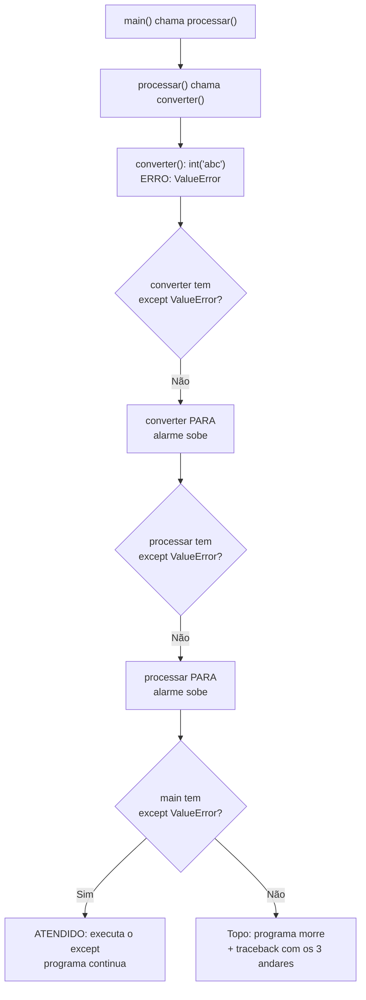

# 01.21 — Exceções

> **Módulo 01 — Python Fundamental** · Nível: N2 · Tempo estimado: 3h · Código: `codigo/cap21/`

## 1. Objetivo

- **Implementar** `try/except/else/finally` capturando exceções **específicas**.
- **Levantar** erros próprios com `raise` — e explicar quando falhar é a resposta certa.
- **Ler** tracebacks com pilha de chamadas (agora com vários andares — suas funções chamando suas funções).
- **Decidir** onde tratar e onde deixar subir — a decisão arquitetural que separa código defensivo de código covarde.

Ao final, seus programas param de quebrar diante do imprevisível: eles **reagem** — e a última pendência do seu roteiro de testes (aberta no 01.07) é paga.

---

## 2. Pré-requisitos

- [01.20 — Módulos e imports](20-modulos-e-imports.md) — a biblioteca que você vai blindar.
- [01.09 — Condicionais](09-condicionais.md) — guardas validam o previsível; exceções cobrem o resto.

**Autoteste:** (1) Em que ordem se lê um traceback (01.02)? (2) Qual erro `int("abc")` levanta? (3) O que a sua validação com `isdigit()` **não** cobre? Se a 3 gerou uma lista mental, este capítulo é sobre ela.

---

## 3. Motivação

Abra o `roteiro_de_testes.md` que você mantém desde o 01.07. A coluna "pendências" tem um item que sobreviveu a quatorze capítulos: **exceções**. Ele apareceu quando você descobriu que o balcão validava com `isdigit()` e ainda assim explodia com entradas como `"12.3.4"`, e desde então você o adiou com honestidade, capítulo após capítulo.

O item sobreviveu porque validar antes — guardas, laudos, alfândega — cobre o **previsível**. E a realidade produz o imprevisível: o arquivo que você vai abrir no próximo capítulo pode não existir; o disco pode estar cheio; a linha 4.827 do CSV pode ter um campo a menos; a API do módulo 07 pode responder algo que nenhum `if` seu antecipou.

Poderia-se argumentar: "então valide mais". Não funciona — e há um motivo estrutural. Entre a sua verificação (`o arquivo existe?`) e o uso (`abrir o arquivo`), o mundo pode mudar; e o número de coisas que podem dar errado numa operação de sistema é grande demais para enumerar em `if`s. A comunidade Python resolveu isso com uma cultura própria, resumida numa sigla famosa: **EAFP** — *easier to ask forgiveness than permission* ("é mais prático pedir perdão que permissão"): **tente** fazer, e trate o problema se ele acontecer.

O contrário — validar tudo antes (*LBYL*, *look before you leap*) — é o estilo que você praticou até aqui, e continua útil. O capítulo de hoje não substitui um pelo outro: ensina o segundo mecanismo e o critério para escolher.

Este capítulo resolve isso assim: apresenta `try/except` com captura específica (e por que `except:` genérico é proibido pela spec), o `raise` para falhar com clareza, a leitura de tracebacks multiandar, e a decisão de **onde** tratar — que é a parte que separa quem conhece a sintaxe de quem sabe usá-la.

---

## 4. Modelo mental

> 🧠 **Modelo mental**
> Uma exceção é um **alarme que sobe pela pilha de chamadas**: quando algo dá errado, a função para na hora e o alarme sobe para quem a chamou; se ninguém "atender" (capturar), ele continua subindo até o topo — e o programa morre exibindo o traceback, que é literalmente o **caminho que o alarme percorreu**. O `try/except` é um andar que **atende** o alarme: dali para cima, ninguém fica sabendo. E a regra que evita desastres: atenda apenas os alarmes que você sabe resolver — engolir alarme desconhecido é desligar o detector de incêndio.

**Exercício de previsão.** Sem rodar, decida o que imprime:

```python
def converter(texto):
    return int(texto)

def processar(texto):
    print("processando", texto)
    valor = converter(texto)
    print("nunca chego aqui se der erro")
    return valor

try:
    processar("abc")
except ValueError:
    print("capturado!")
print("programa continua")
```

*Resposta comentada:* imprime `processando abc`, depois `capturado!`, depois `programa continua`. A linha "nunca chego aqui" **não** executa: o alarme disparou dentro de `converter`, subiu para `processar` (que também parou na hora, no meio) e foi atendido pelo `except` lá em cima. E o mais importante: **o programa não morreu** — depois do `except`, a execução segue normalmente. É essa continuidade que separa um programa que reage de um que quebra.

---

## 5. Analogia

Exceções são o **sistema de emergência de um prédio**. Um problema no 5º andar dispara o alarme; se o andar não tem brigada, o alarme sobe; cada andar acima pode ter uma equipe treinada para **aquele tipo** de emergência (incêndio, vazamento, falta de energia). Se ninguém atende até a cobertura, o prédio inteiro é evacuado (o programa termina) — e o relatório da evacuação lista **por quais andares o alarme passou**: o traceback.

A regra profissional cabe na imagem: a brigada de incêndio não deve "atender" um vazamento de gás só para o alarme parar de tocar. Atender o que não se sabe resolver — o `except:` genérico — transforma emergência em silêncio, e silêncio em desastre descoberto tarde.

**Onde a analogia quebra:** num prédio, quem apaga o incêndio raramente é quem o causou; em código, o andar que atende frequentemente **é** o que sabe o que fazer (a borda que pediu o dado sabe repedi-lo). E há o `finally`: um procedimento que roda **sempre** — com ou sem emergência —, como travar as portas ao sair; prédios não têm isso, funções têm.

---

## 6. Teoria

### `try/except`: a estrutura

```python
try:
    valor = int(texto)               # código que PODE falhar
except ValueError:                    # só este tipo de alarme
    print("não é um número válido")
```

Se nada falhar, o `except` é ignorado. Se o erro for de **outro** tipo, este `except` não atende — e o alarme continua subindo. A captura é **por tipo**, e o tipo é a informação mais importante do erro.

Os tipos que você já encontrou na trilha, agora com nome de classe: `ValueError` (valor inadequado — `int("abc")`), `TypeError` (tipo errado — `"2" + 2`), `KeyError` (chave ausente — 01.15), `IndexError` (índice fora — 01.05), `ZeroDivisionError`, `FileNotFoundError` (o próximo capítulo), `AttributeError` (método inexistente).

### Múltiplos `except`, `else` e `finally`

```python
try:
    valor = int(entrada)
    resultado = 100 / valor
except ValueError:
    print("entrada não numérica")
except ZeroDivisionError:
    print("não posso dividir por zero")
except (TypeError, AttributeError) as erro:      # dois tipos, com o objeto
    print(f"problema de tipo: {erro}")
else:
    print("deu tudo certo:", resultado)           # só se NADA falhou
finally:
    print("sempre executo (limpeza)")             # com ou sem erro
```

Ordem de leitura: os `except` são testados de cima para baixo, e o primeiro compatível atende (como uma cadeia `elif` — 01.09); do mais específico para o mais genérico. O `as erro` captura o **objeto exceção**, que carrega a mensagem. O `else` roda quando o `try` termina sem erro — útil para separar "o que pode falhar" do "o que fazer com o sucesso". O `finally` roda sempre — o lugar da limpeza (fechar arquivo, liberar recurso), e o 04.20 mostrará a ferramenta que o substitui na maioria dos casos (`with`, que você usará já no 01.22).

### A proibição do `except:` genérico

```python
try:
    processar()
except:                # PROIBIDO pela spec (§18.3)
    pass               # e este 'pass' é o crime dentro do crime
```

Por que é proibido: captura **tudo** — inclusive erros de digitação no seu código (`NameError`), interrupções do usuário (`KeyboardInterrupt` — o Ctrl+C do 01.10!) e falhas que você não sabe tratar. O programa vira uma caixa-preta que "nunca falha" e sempre entrega resultado errado. É o exemplo canônico do aforismo do Zen que você comentou no 01.01: *errors should never pass silently*.

A única exceção legítima, rara e sempre com registro: capturar amplo **para logar e re-levantar**:

```python
except Exception as erro:
    print(f"[ERRO INESPERADO] {erro}")
    raise                      # re-levanta: o alarme continua subindo
```

### `raise`: falhar com clareza

Você também **produz** exceções — e isso é qualidade, não defeito:

```python
def calcular_frete(total_centavos, cidade):
    if total_centavos < 0:
        raise ValueError(f"total negativo: {total_centavos}")
    ...
```

A regra: falhe **cedo e alto** quando o contrato da sua função foi violado. Devolver um valor "esquisito" (`-1`, `None`, `0`) para sinalizar erro é a alternativa ruim — o chamador esquece de conferir, e o valor absurdo vaza para o relatório. Uma exceção não pode ser ignorada por acidente.

Escolha o tipo pela semântica: `ValueError` (valor inadequado), `TypeError` (tipo errado), `KeyError`/`IndexError` (acesso inválido). Criar tipos próprios (`class FreteInvalidoError(Exception)`) é possível e comum em projetos — a sintaxe de classes chega no módulo 04, e o 04.x o formaliza.

### Onde tratar: a decisão arquitetural

A pergunta que resolve 90% dos casos: **quem tem informação suficiente para decidir o que fazer?**

- Funções de **cálculo** (miolo): não tratam — deixam subir. Elas não sabem se o programa deve repedir a entrada, pular a linha ou abortar.
- Funções de **borda** (onde o dado entra: input, arquivo, API): tratam — porque ali existe uma resposta razoável (pedir de novo, usar padrão, registrar a linha inválida e continuar).

É o mesmo princípio do 01.19 (miolo puro, efeitos nas bordas), aplicado a erros. Na prática do seu balcão: `separar_parcelas` levanta `ValueError` se as parcelas forem zero; quem trata é o laço da borda, que repergunta.

### EAFP × LBYL — o critério

| Estilo | Forma | Quando prefira |
|---|---|---|
| **LBYL** (olhe antes) | `if texto.isdigit(): int(texto)` | condição simples, estável e barata de checar; o "erro" é esperado e frequente |
| **EAFP** (peça perdão) | `try: int(texto) except ValueError:` | muitas formas de falhar; checagem duplicaria a lógica; recursos externos (arquivo, rede) |

Os dois convivem: valide o previsível com guardas (mais legível), proteja o resto com `try`. O caso do 01.07 que ficou pendente é o exemplo perfeito: `isdigit()` cobre o comum; o `try/except ValueError` cobre `"12.3.4"`, `"1e5"`, e tudo que você não imaginou.

---

## 7. Funcionamento interno

Por dentro, na medida N2: exceções são **objetos** (instâncias de classes que herdam de `BaseException`), e a hierarquia importa — `except Exception` captura quase tudo, mas não `KeyboardInterrupt` nem `SystemExit`, que herdam direto de `BaseException` justamente para não serem engolidos por acidente (é por isso que o Ctrl+C funciona mesmo em programas com tratamento amplo). Quando uma exceção é levantada, o interpretador **desempilha** frames (01.18/seção 7) um a um procurando um `except` compatível, executando os `finally` de cada andar no caminho; a lista de frames percorridos é o traceback. Cada objeto exceção carrega mensagem, tipo e o encadeamento (`__cause__`) — o que produz aqueles tracebacks com "During handling of the above exception, another exception occurred". E o custo: montar uma exceção é mais caro que um `if`, mas o `try` em si (sem erro) é praticamente **grátis** em Python — o que justifica o estilo EAFP ser idiomático aqui e não em outras linguagens.

---

## 8. Visualização do fluxo

O alarme subindo — e onde ele é atendido:



**Como ler:** o alarme sobe pelos mesmos degraus que a chamada desceu — e cada andar sem `except` compatível é abandonado no meio da execução (as linhas após o erro **não** rodam). Compare as duas saídas de baixo: com tratamento, o programa continua; sem tratamento, o traceback lista exatamente esses três andares, do mais antigo (topo) ao mais recente (o `int('abc')`, na última linha antes da mensagem). É por isso que o traceback se lê de baixo para cima (01.02): a última linha é onde o alarme nasceu.

---

## 9. Aplicação prática

A pendência mais antiga do roteiro, paga. Rode:

```bash
python 01-Python/codigo/cap21/blindando_a_borda.py
```

```text
--- Cena 1: o que o isdigit() não cobre ---
'46990'   -> isdigit True  | try/except: 46990 ✓
'12.3.4'  -> isdigit False | try/except: recusado com ValueError ✓
'1e5'     -> isdigit False | try/except: recusado com ValueError ✓
'  99  '  -> isdigit False | try/except: 99 ✓   (o int aceita espaços!)

--- Cena 2: onde tratar (miolo levanta, borda trata) ---
separar_parcelas(1000, 0) -> ValueError capturado na borda: parcelas deve ser >= 1, recebi 0
Borda repergunta e segue: primeira 334, demais 333

--- Cena 3: o traceback de 3 andares (sem tratamento) ---
Traceback (most recent call last):
  ... 3 andares: <module> -> demonstrar_traceback -> processar_linha
ValueError: invalid literal for int() with base 10: 'abc'
(capturado pelo except do próprio script para não matar a demonstração)

--- Cena 4: except genérico (o crime) vs. específico ---
Genérico engoliu ATÉ o erro de digitação do programador: 'NameError' silenciado
  com_generico() devolveu: 'erro (mas qual?!)'
Específico deixou passar o que não sabe tratar ✓ (name 'resultado' is not defined)
```

A Cena 1 é a que fecha a pendência de quatorze capítulos: o `isdigit()` sozinho recusava `"  99  "` (que é válido!) e não protegia contra `"12.3.4"` de forma confiável. O `try/except ValueError` resolve os dois lados. A Cena 4 é a que mais assusta: o `except:` genérico **engoliu um `NameError`** — um erro de digitação do próprio programador, que ficou invisível.

> 🎯 **Checkpoint rápido**
> De cabeça: um erro acontece dentro de uma função que **não** tem `try`. O que acontece com as linhas seguintes dela? E com o programa, se ninguém capturar?

---

## 10. Código comentado

Arquivo completo em [`codigo/cap21/blindando_a_borda.py`](codigo/cap21/blindando_a_borda.py).

```python
# ------------------------------------------------------------
# blindando_a_borda.py
# Capítulo 01.21 — Exceções
# O que este arquivo demonstra: try/except específico, raise no
#   miolo + tratamento na borda, traceback multiandar e o crime
#   do except genérico
# Como executar: python blindando_a_borda.py
# ------------------------------------------------------------

def converter_centavos(texto):
    """Converte texto em centavos. Levanta ValueError se não der."""
    return int(texto.strip())          # deixa o ValueError SUBIR (miolo não trata)


def separar_parcelas(total_centavos, parcelas):
    """Devolve (primeira, demais). Levanta ValueError se parcelas < 1."""
    if parcelas < 1:
        # RAISE: o contrato foi violado — falhar é a resposta certa.
        # Devolver -1 ou None seria pior: o chamador poderia ignorar.
        raise ValueError(f"parcelas deve ser >= 1, recebi {parcelas}")
    base = total_centavos // parcelas
    return base + total_centavos % parcelas, base


print("--- Cena 1: o que o isdigit() não cobre ---")
for bruto in ["46990", "12.3.4", "1e5", "  99  "]:
    laudo = bruto.isdigit()
    try:
        valor = converter_centavos(bruto)
        veredito = f"{valor} ✓"
    except ValueError:                 # captura ESPECÍFICA
        veredito = "recusado com ValueError ✓"
    print(f"{bruto!r:<9} -> isdigit {str(laudo):<5} | try/except: {veredito}")

print()
print("--- Cena 2: onde tratar (miolo levanta, borda trata) ---")
try:
    separar_parcelas(1_000, 0)
except ValueError as erro:             # 'as' captura o objeto com a mensagem
    print(f"separar_parcelas(1000, 0) -> ValueError capturado na borda: {erro}")

primeira, demais = separar_parcelas(1_000, 3)   # a borda "reperguntou" (aqui: corrigiu)
print(f"Borda repergunta e segue: primeira {primeira}, demais {demais}")

print()
print("--- Cena 3: o traceback de 3 andares (sem tratamento) ---")


def processar_linha(linha):
    """Andar do meio: não trata, só repassa o trabalho."""
    campos = linha.split(";")
    return int(campos[1])              # aqui o alarme nasce


def demonstrar_traceback():
    """Andar de cima: também não trata."""
    return processar_linha("PED-1;abc")


try:
    demonstrar_traceback()
except ValueError as erro:
    # Capturamos só para a demonstração não matar o script:
    print("Traceback (most recent call last):")
    print("  ... 3 andares: <module> -> demonstrar_traceback -> processar_linha")
    print(f"ValueError: {erro}")
    print("(capturado pelo except do próprio script para não matar a demonstração)")

print()
print("--- Cena 4: except genérico (o crime) vs. específico ---")


def com_generico():
    try:
        resultadoo = 10 / 2            # ERRO DE DIGITAÇÃO proposital abaixo
        return resultado               # NameError: 'resultado' não existe
    except:                            # PROIBIDO: engole tudo
        return "erro (mas qual?!)"


def com_especifico():
    try:
        resultadoo = 10 / 2
        return resultado               # o mesmo NameError...
    except ZeroDivisionError:          # ...que este except NÃO atende
        return "divisão por zero"


print(f"Genérico engoliu ATÉ o erro de digitação do programador: 'NameError' silenciado")
print(f"  com_generico() devolveu: {com_generico()!r}")
try:
    com_especifico()
except NameError as erro:
    print(f"Específico deixou passar o que não sabe tratar ✓ ({erro})")
# Saída: (as quatro cenas mostradas na seção 9 do capítulo)
```

---

## 11. Erros comuns

### Erro 1 — `except:` genérico (o crime da spec)

**Sintoma:** nenhum erro visível — e bugs que somem sem explicação: o programa "funciona" mas entrega resultados errados; um `Ctrl+C` não interrompe; erros de digitação seus (`NameError`) viram mensagens genéricas.
**Causa:** capturar tudo significa capturar também o que você não sabe tratar — inclusive os erros que denunciam defeitos do seu próprio código.
**Correção:** capture **sempre** o tipo específico. Se realmente precisar de rede ampla (em bordas de sistemas longos), use `except Exception as erro:` + registro + `raise` (re-levantar). E jamais `except: pass` — a combinação mais destrutiva do repertório.

### Erro 2 — `try` grande demais

**Sintoma:** sem traceback — o diagnóstico é que fica impossível: o `except ValueError` atende, mas você não sabe **qual** das oito linhas do `try` falhou; e pior, uma linha que deveria ter falhado ruidosamente é atendida pelo tratamento de outra.

```python
try:
    dados = abrir_arquivo(caminho)
    registros = processar(dados)
    total = calcular(registros)
    gravar(total)
except ValueError:
    print("algo deu errado")        # qual "algo"?
```

**Causa:** o `try` virou "o programa inteiro"; a granularidade do tratamento se perdeu.
**Correção:** envolva **a menor** operação que pode falhar; o restante fica fora (ou no `else`). Um `try` por preocupação, com mensagem específica.

### Erro 3 — Usar exceções para fluxo normal

**Sintoma:** sem erro — código que usa `try/except` como `if`:

```python
try:
    valor = mapa[chave]
except KeyError:
    valor = 0                     # ...isto é o `mapa.get(chave, 0)` do 01.15
```

**Causa:** confundir EAFP (legítimo para o imprevisível) com "usar exceção em vez de condição" quando existe uma forma direta e legível.
**Correção:** quando a linguagem oferece a operação segura (`get`, `setdefault`, `in`), use-a; reserve exceções para o que **é** excepcional. Regra prática: se o "erro" acontece na maioria das execuções, ele não é exceção — é fluxo, e merece um `if`.

> ⚠️ **Atenção**
> A fronteira entre EAFP legítimo e abuso é a **frequência**: converter texto de usuário (falha ocasional) é EAFP; percorrer um dicionário esperando `KeyError` a cada volta é abuso — mais lento e menos claro que `get`.

---

## 12. Boas práticas

✅ **Capture o tipo específico, sempre** — a lista de tipos do capítulo cobre quase tudo do módulo; especificidade é o que separa tratamento de encobrimento.

✅ **`try` curto: só a linha que pode falhar** — o resto vai no `else` ou fora; mensagens específicas exigem escopos específicos.

✅ **Miolo levanta, borda trata** — funções de cálculo não sabem o que fazer com o erro; quem pediu o dado sabe.

✅ **`raise` com mensagem que ajuda: inclua o valor recebido** — `f"parcelas deve ser >= 1, recebi {parcelas}"` economiza a próxima meia hora de diagnóstico.

❌ **Evite `except: pass`** — a combinação que apaga o incêndio desligando o alarme; se precisar ignorar algo, ignore o tipo **específico** e comente por quê.

❌ **Evite sinalizar erro com valores especiais (`-1`, `None`, `""`)** — o chamador esquece de conferir; a exceção não pode ser ignorada por acidente.

---

## 13. Performance

Nesta escala, irrelevante — e com um dado que justifica o estilo da linguagem: em Python, entrar num bloco `try` que **não** falha custa praticamente nada (a preparação é feita na compilação); o custo aparece só quando a exceção é levantada (montar o objeto, desempilhar frames). Consequência prática: EAFP não é "mais lento" — no caminho feliz, é tão rápido quanto o código sem proteção, e frequentemente mais rápido que verificar antes (uma checagem `in` custa; um `try` que não dispara, não). O contraponto honesto: se a exceção acontece com frequência (o abuso do Erro 3), aí ela domina o custo — e é mais um motivo para reservá-la ao excepcional. Medição real com milhões de linhas: módulo 10.

---

## 14. Mercado

> 🏢 **Mercado**
> Tratamento de erros é o que separa protótipo de sistema. Em produção, três padrões deste capítulo são inegociáveis: **captura específica** (revisões reprovam `except:` genérico), **falhar cedo com mensagem útil** (o `raise` com contexto vira a linha de log que resolve um incidente às 3h da manhã) e **tratar na borda** (no módulo 06, o FastAPI transforma exceções em respostas HTTP 4xx/5xx automaticamente — o "andar que atende" vira o framework). No módulo 10, pipelines de dados processam milhares de linhas onde **algumas** vão falhar: a arquitetura padrão é `try/except` por linha, registrando as inválidas numa área de quarentena e seguindo — exatamente o padrão que você vai construir no 01.22. E o `raise` de erros próprios é como bibliotecas comunicam problemas: quando o Pandas ou o SQLAlchemy levanta uma exceção específica, é este mecanismo.
>
> **Mini-cenário:** o ETL noturno da Aurora vai processar 40 mil linhas. Sem tratamento, uma linha corrompida derruba o pipeline inteiro às 2h e a diretoria não tem relatório de manhã. Com tratamento por linha, o pipeline entrega 39.997 registros, um relatório de 3 rejeitados com o motivo, e a Aurora acorda com dados. A diferença arquitetural entre esses dois cenários é o conteúdo deste capítulo.

---

## 15. Entrevistas

**P1. "Por que `except:` sem tipo é má prática?"**
*Resposta esperada:* captura tudo — inclusive erros de programação (`NameError`, `AttributeError`) e sinais como `KeyboardInterrupt`/`SystemExit` — escondendo defeitos e impedindo interrupção; o programa passa a "nunca falhar" e a entregar resultados errados em silêncio. Alternativas: tipos específicos; ou `except Exception` + log + `raise` quando for preciso rede ampla.

**P2. "O que é EAFP e como se compara a LBYL?"**
*Resposta esperada:* EAFP (*easier to ask forgiveness than permission*) é tentar e tratar a falha — idiomático em Python, barato no caminho feliz e robusto contra condições de corrida (o estado pode mudar entre a checagem e o uso); LBYL é verificar antes — mais legível para condições simples. Os dois convivem: guardas para o previsível, `try` para o resto. Citar o caso do arquivo (existe → pode sumir antes do open) mostra maturidade.

**P3. "Onde você trataria uma exceção numa aplicação em camadas?"**
*Resposta esperada:* o mais perto de quem tem informação para decidir — geralmente nas bordas (entrada de usuário, leitura de arquivo, chamada externa, camada HTTP); o miolo levanta e deixa subir. Complementos fortes: erros de domínio próprios (`PedidoInvalidoError`) para comunicar semanticamente; e a camada de apresentação convertendo exceção em resposta (HTTP 422/500) sem vazar detalhes internos.

**Pegadinha clássica: "O que este código imprime?"**

```python
def f():
    try:
        return "try"
    finally:
        print("finally")
f()
```

Ela derruba quem acha que `return` encerra tudo. A saída forte: imprime **`finally`** — o bloco `finally` executa **mesmo com `return` no `try`**, antes de a função efetivamente retornar (o valor `"try"` já está reservado e é devolvido depois). É por isso que `finally` é o lugar canônico da limpeza: nada escapa dele — nem `return`, nem `break`, nem outra exceção. Bônus que impressiona: se o próprio `finally` tiver um `return`, ele **sobrepõe** o do `try` — e é justamente por isso que colocar `return` em `finally` é considerado erro grave.

---

## 16. Exercícios guiados

Enunciados completos em [`exercicios/cap21.md`](exercicios/cap21.md); gabaritos em [`exercicios/gabaritos/cap21.md`](exercicios/gabaritos/cap21.md).

### Aquecimento

- **A1** `[~10 min · qual exceção?]` — 8 operações: qual tipo cada uma levanta?
- **A2** `[~10 min · previsão de fluxo]` — 5 blocos com try/except/else/finally: preveja a saída exata.
- **A3** `[~5 min · específico ou genérico?]` — 4 trechos: aponte o problema e corrija.
- **A4** `[~10 min · EAFP ou LBYL?]` — 6 situações: qual estilo e por quê.

### Aplicação

- **AP1** `[~20 min · a borda blindada]` — Refaça a conversão de valores do balcão com `try/except`, cobrindo os casos que o `isdigit` não cobria.
- **AP2** `[~25 min · miolo levanta, borda trata]` — Adicione `raise` com mensagem útil a 3 funções da sua biblioteca e trate-as num programa de borda.
- **AP3** `[~20 min · o processador tolerante]` — Processe uma lista de 8 linhas (3 defeituosas) com `try/except` por linha, produzindo processados + quarentena com motivos.

---

## 17. Desafios

- **D1** `[~50 min · a quarentena]` — **Importador tolerante a falhas.** Escreva um importador que recebe 12 linhas de texto (com 5 defeitos variados: campo faltando, valor não numérico, código inválido, cidade vazia, linha vazia) e produz **três** saídas: `registros` (as válidas, como tuplas), `quarentena` (lista de `(numero_da_linha, linha_original, tipo_do_erro, mensagem)`) e um **relatório de importação** com o funil (12 lidas → N válidas → M rejeitadas) e a quebra por tipo de erro. Regras: um `try` por linha (não pelo laço inteiro!), captura específica para cada tipo esperado, e um `except Exception` final que registra o inesperado **sem** engolir (log + re-raise ou registro explícito com marcação "ERRO NÃO PREVISTO"). Fecho: 5 linhas sobre por que a quarentena é melhor que (a) derrubar tudo e (b) ignorar as linhas ruins em silêncio.

<details><summary>💡 Dica 1 (conceito)</summary>
O laço percorre; o try envolve o processamento de UMA linha. Assim uma linha ruim não derruba as outras 11.
</details>
<details><summary>💡 Dica 2 (estratégia)</summary>
Cada tipo de defeito tem uma exceção natural: campo faltando → IndexError; valor não numérico → ValueError; código inválido → seu próprio raise ValueError com mensagem.
</details>
<details><summary>💡 Dica 3 (esqueleto)</summary>
for numero, linha in enumerate(linhas, 1): try: (validações + conversões) → registros.append else quarentena.append((numero, linha, tipo, msg)) → relatório com contagens por tipo.
</details>

---

## 18. Mini projeto

**Biblioteca Aurora v3 — contratos explícitos** `[~1h15]` — as funções agora dizem quando não podem trabalhar.

Requisitos numerados:

1. Evolua a biblioteca (01.20) para `codigo/cap21/biblioteca_aurora.py`: cada função de cálculo ganha **validação de contrato** com `raise` — `formatar_reais` recusa não-int; `calcular_frete` recusa total negativo; `separar_parcelas` recusa parcelas < 1; `validar_codigo` recusa não-string.
2. Cada `raise` traz mensagem com o **valor recebido** e o esperado.
3. Atualize a docstring de cada função com uma linha "Levanta: ValueError se ..." — o contrato documentado.
4. Escreva `programa_blindado.py` que consome a biblioteca tratando as exceções **na borda**: um laço que processa 6 entradas (3 boas, 3 que violam contratos), imprimindo sucesso ou o erro capturado com contexto.
5. No autoteste da biblioteca (bloco `__main__`), acrescente 4 casos que **esperam exceção**: use `try/except` para verificar que a exceção certa foi levantada, imprimindo `✓ levantou ValueError como esperado`.

**Critério de "está bom":** contratos em todas as funções de cálculo; mensagens com valores; docstrings atualizadas; o programa de borda não quebra com nenhuma das 6 entradas; autoteste verificando exceções (o embrião do `pytest.raises` do módulo 12). Esta é a versão da biblioteca que o mini projeto do módulo (01.25) vai usar.

---

## 19. Revisão

**Resumo do capítulo:**

- Exceção = alarme que sobe pela pilha; cada função sem `except` compatível **para na hora** e repassa; sem ninguém para atender, o programa morre com o traceback (o caminho percorrido).
- `try/except TipoEspecifico` — vários `except` testados em ordem (do específico ao geral), `as erro` captura o objeto, `else` roda no sucesso, `finally` roda **sempre**.
- `except:` genérico é **proibido**: engole erros de programação e `KeyboardInterrupt`; alternativa legítima é `except Exception` + log + `raise`.
- `raise` comunica violação de contrato — falhe cedo, com mensagem que inclui o valor recebido; nunca sinalize erro com `-1`/`None`.
- Onde tratar: **miolo levanta, borda trata** — quem tem informação para decidir é quem pediu o dado.
- EAFP × LBYL: guardas para o previsível e barato; `try` para o imprevisível, o custoso de checar e o externo (arquivo, rede) — e `try` sem erro é praticamente grátis.

**Flashcards novos** (adicionados a [`revisao/flashcards.md`](revisao/flashcards.md)):

| ID | Frente | Verso |
|---|---|---|
| 01.21-F1 | Preveja: erro dentro de uma função sem try. O que acontece com as linhas seguintes dela e com o programa? | (Previsão) As linhas seguintes NÃO executam; o alarme sobe para quem chamou; sem ninguém capturar, o programa termina com o traceback dos andares percorridos. |
| 01.21-F2 | Explique com suas palavras: por que `except:` genérico é proibido? | (Elaboração) Captura tudo — inclusive NameError (defeito seu) e KeyboardInterrupt — escondendo bugs e impedindo interrupção; o programa "nunca falha" e erra em silêncio. |
| 01.21-F3 | Onde tratar exceções numa aplicação em camadas? | (Decisão) Miolo (cálculo) levanta e deixa subir; borda (input, arquivo, API, HTTP) trata — quem pediu o dado tem informação para decidir a reação. |
| 01.21-F4 | O que é EAFP e quando prefiro LBYL? | EAFP = tente e trate a falha (idiomático, barato no caminho feliz, robusto a mudanças de estado). LBYL (validar antes) para condições simples, estáveis e frequentes. |
| 01.21-F5 | Pegadinha: função com `return` dentro do `try` e `print` no `finally`. O que sai? | O `finally` executa **mesmo com return** (antes de devolver). Por isso é o lugar da limpeza — e por isso `return` dentro de `finally` (que sobrepõe o do try) é erro grave. |

**Agendamento:** registre no `PROGRESSO.md` e marque D+1, D+7, D+30, D+90 na [`Revisoes/agenda.md`](../Revisoes/agenda.md).

---

## 20. Checklist

Perguntas de domínio — teste do sim:

- [ ] Sei implementar *try/except/else/finally com captura específica*?
- [ ] Sei explicar *por que o `except:` genérico é proibido, com dois exemplos do que ele engole*?
- [ ] Sei decidir *onde tratar (miolo × borda) e usar `raise` com mensagem útil*?
- [ ] Sei ler *um traceback de múltiplos andares e identificar onde o alarme nasceu*?
- [ ] Sei responder *à pegadinha do `finally` com `return`*?

Itens práticos:

- [ ] Rodei `blindando_a_borda.py` e vi o genérico engolindo o `NameError`.
- [ ] Acertei (ou entendi por que errei) a previsão da seção 4 e o checkpoint da seção 9.
- [ ] Fiz Aquecimento e Aplicação (borda blindada, contratos, processador tolerante).
- [ ] Construí a biblioteca v3 com contratos e o programa de borda (5 requisitos).
- [ ] Atualizei o `roteiro_de_testes.md`: **a pendência de exceções está paga** — a coluna deve estar vazia.

---

## 21. Próximo capítulo

Todos os dados que você processou no módulo estavam **escritos dentro do código** — listas de tuplas digitadas por você. A Aurora, porém, não digita: ela **exporta**. O CSV de vendas que a gestora mencionou no primeiro dia existe, tem centenas de linhas, está numa pasta esperando. Ficou deliberadamente em aberto a ponte entre o seu programa e o mundo dos arquivos: abrir com `with`, escolher o encoding certo (e entender por que acentos quebram sem ele), e usar o módulo `csv` da biblioteca padrão em vez do `split(";")` artesanal. Com as exceções de hoje, você já está pronto para o `FileNotFoundError` que vai encontrar. O próximo capítulo conecta o Atlas aos dados reais.

→ [01.22 — Arquivos: texto e CSV](22-arquivos-texto-e-csv.md)

---

*Gerado sob spec 3.0.0*
