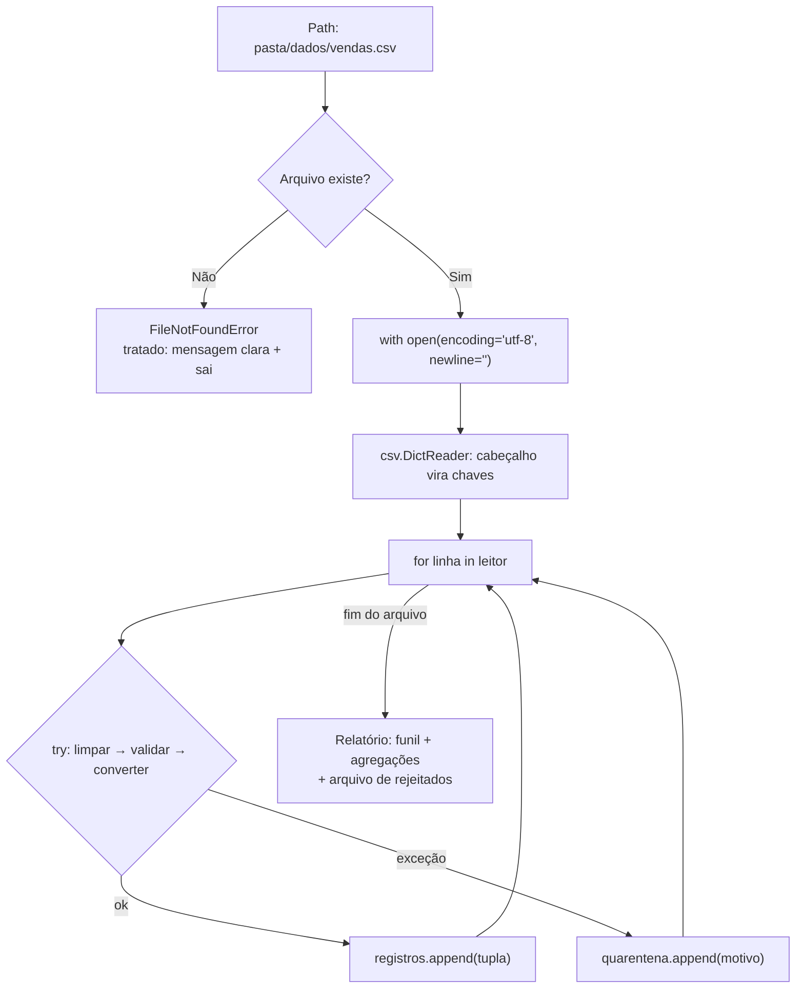

# 01.22 — Arquivos: texto e CSV

> **Módulo 01 — Python Fundamental** · Nível: N1 · Tempo estimado: 3h · Código: `codigo/cap22/`

## 1. Objetivo

- **Implementar** leitura e escrita de texto com `with`, modos e **encoding UTF-8 explícito**.
- **Processar** CSV com o módulo `csv` (`DictReader`/`DictWriter`) — aposentando o `split(";")` artesanal.
- **Depurar** os clássicos: arquivo inexistente, encoding errado, vírgula dentro do campo, cabeçalho ausente.
- **Construir** a primeira leitura real do CSV de vendas da Aurora — o dado que existia desde o primeiro dia.

Ao final, o Atlas deixa de trabalhar com dados digitados por você e passa a ler **o arquivo que a empresa exporta**.

---

## 2. Pré-requisitos

- [01.21 — Exceções](21-excecoes.md) — o `FileNotFoundError` é o erro mais comum deste capítulo.
- [01.20 — Módulos e imports](20-modulos-e-imports.md) — `csv` e `pathlib` vêm da biblioteca padrão.

**Autoteste:** (1) Que exceção `open("nao_existe.txt")` levanta? (2) O que `split(";")` devolve? (3) Por que a esteira de limpeza (01.06) existia? Se as três saíram, você tem tudo — falta o arquivo.

---

## 3. Motivação

Reveja a dor original: *"o sistema exporta um CSV com os pedidos, e o estagiário monta a planilha à mão toda segunda"*. Esse CSV existe desde o primeiro dia do módulo — e você processou dados **digitados manualmente** em quinze capítulos, porque abrir arquivo exigia peças que só agora estão todas no lugar.

Faltavam três. **Exceções** (01.21): arquivos somem, mudam de nome, chegam sem permissão — e um programa que quebra ao não achar o arquivo é inútil no agendamento noturno. **Módulos** (01.20): ler CSV direito não se faz na unha; usa-se o módulo `csv`, que a biblioteca padrão traz pronto. E **estruturas** (01.12–01.16): sem listas de dicionários, um CSV lido não teria onde morar.

Sobre "na unha": você tem usado `split(";")` desde o 01.06, e funcionou — porque os dados eram seus e bem-comportados. Arquivos reais têm campos com vírgula dentro (`"Fone Bluetooth, preto"`), campos com aspas, quebras de linha dentro de células, e um cabeçalho cuja ordem pode mudar entre exportações. Cada um desses casos quebra o `split` artesanal em silêncio — e o módulo `csv` resolve todos, porque foi escrito por quem já apanhou de todos.

Há ainda o detalhe que assombra especificamente quem escreve em português: **encoding**. Abrir um arquivo com acentos sem declarar UTF-8 produz ou `UnicodeDecodeError` ou — pior — `"São Paulo"` no relatório. É o tipo de bug que aparece só na máquina de outra pessoa.

Este capítulo resolve isso assim: apresenta `with open(...)` com encoding explícito, os modos de abertura, o módulo `csv` nas duas direções, e o padrão profissional de importação — que junta a quarentena do 01.21 com os dados reais da Aurora.

---

## 4. Modelo mental

> 🧠 **Modelo mental**
> Um arquivo aberto é uma **torneira ligada**: enquanto aberta, o sistema operacional reserva recursos e ninguém garante o que acontece se o programa morrer no meio. O `with` é a **torneira com fechamento automático**: ao sair do bloco — por término normal, por `return` ou por exceção — o arquivo é fechado, sempre. E o conteúdo que sai da torneira é **texto puro**: números, datas e estruturas são interpretações que **você** aplica depois (é o `input()` do 01.07, em escala de arquivo).

**Exercício de previsão.** O arquivo `vendas.csv` tem 3 linhas de dados e 1 de cabeçalho. Sem rodar, decida o que cada bloco imprime:

```python
with open("vendas.csv", encoding="utf-8") as arquivo:
    print(len(arquivo.readlines()))
    print(len(arquivo.readlines()))
```

*Resposta comentada:* imprime `4` e depois **`0`**. A primeira leitura consome o arquivo inteiro — o "cursor" fica no fim; a segunda encontra nada. Arquivos são **fluxos**, não listas: você percorre uma vez. Se precisar dos dados duas vezes, guarde-os numa estrutura (lista) — o que, de resto, é o que todo importador faz. Se você previu `4` e `4`, acabou de descobrir o comportamento que mais confunde iniciantes com arquivos.

---

## 5. Analogia

Ler um arquivo é **desenrolar um pergaminho** apoiado numa mesa: você o lê de cima para baixo, e ao chegar ao fim ele está desenrolado — reler exige enrolar de novo (`seek`) ou ter copiado o conteúdo. O `with` é a mesa que **enrola e guarda o pergaminho sozinha** quando você sai da sala, mesmo que saia correndo (exceção).

E o CSV: um pergaminho com **colunas separadas por marcas**. O `split` artesanal é cortar o pergaminho com tesoura nas marcas — funciona até um texto conter a própria marca ("Fone, preto" tem vírgula!). O módulo `csv` é o escriba treinado que conhece as convenções: sabe que aspas protegem o conteúdo, que uma marca dentro de aspas não separa nada, e que a primeira linha pode ser o índice das colunas.

**Onde a analogia quebra:** pergaminhos são únicos; arquivos podem ser abertos por vários programas ao mesmo tempo — e escrever enquanto outro lê produz resultados imprevisíveis (o assunto sério de bancos de dados, módulo 03). E há a diferença que define o encoding: pergaminhos guardam letras; arquivos guardam **bytes**, e a tabela de conversão bytes↔letras precisa ser combinada — é o que `encoding="utf-8"` declara.

---

## 6. Teoria

### `with open(...)`: a forma correta

```python
with open("vendas.csv", "r", encoding="utf-8") as arquivo:
    conteudo = arquivo.read()
# aqui o arquivo JÁ está fechado, aconteça o que acontecer
```

Três parâmetros que importam: o **caminho**, o **modo** e o **encoding**.

| Modo | O que faz | Cuidado |
|---|---|---|
| `"r"` | leitura (padrão) | `FileNotFoundError` se não existir |
| `"w"` | escrita | **apaga o conteúdo existente** sem avisar |
| `"a"` | acrescenta ao fim | cria se não existir; nunca apaga |
| `"x"` | criação exclusiva | falha se já existir (defesa contra sobrescrita) |

**`encoding="utf-8"` é obrigatório na trilha** — sempre, em toda abertura. Sem ele, o Python usa o padrão do sistema, que varia entre máquinas (Windows brasileiro costuma usar cp1252): o mesmo código lê certo na sua máquina e quebra na do colega. Declarar é gratuito e elimina a classe inteira de bugs.

### As formas de ler

```python
with open(caminho, encoding="utf-8") as arquivo:
    tudo = arquivo.read()          # string única (arquivos pequenos)
    # ou
    linhas = arquivo.readlines()   # lista de strings (com \n no fim de cada)
    # ou — a forma idiomática:
    for linha in arquivo:          # percorre linha a linha, sem carregar tudo
        print(linha.rstrip("\n"))  # rstrip tira a quebra de linha
```

A terceira é a preferida: funciona com arquivos de qualquer tamanho (não carrega tudo na memória) e é a que escala para os milhões de linhas do módulo 10. E repare no `rstrip("\n")`: cada linha vem **com** a quebra — esquecê-lo produz linhas em branco extras no relatório.

### Escrever

```python
with open("relatorio.txt", "w", encoding="utf-8") as arquivo:
    arquivo.write("Relatório Aurora\n")        # write NÃO adiciona \n
    arquivo.writelines(["linha 1\n", "linha 2\n"])
```

`write` não coloca quebra de linha — você coloca. E o alerta do modo `"w"`: ele **trunca** o arquivo existente no momento da abertura, antes de qualquer escrita; um `open("dados.csv", "w")` por engano apaga o arquivo, ponto.

### O módulo `csv` — o escriba treinado

**Leitura como dicionários** (a forma que a trilha usa):

```python
import csv

with open("vendas.csv", encoding="utf-8", newline="") as arquivo:
    leitor = csv.DictReader(arquivo, delimiter=";")
    for linha in leitor:                       # cada linha é um DICIONÁRIO
        print(linha["cidade"], linha["valor_centavos"])
```

`DictReader` usa a **primeira linha como cabeçalho** e entrega cada registro como dicionário `coluna → valor` — acesso por **nome**, não por posição: se a ordem das colunas mudar na exportação, seu código continua funcionando (com `split`, tudo quebraria). Todos os valores chegam como **string** — a conversão é sua (01.07 de novo, em escala de arquivo).

O `newline=""` é exigência do módulo `csv` (evita problemas de quebra de linha entre sistemas); memorize como parte da fórmula.

**Escrita:**

```python
with open("saida.csv", "w", encoding="utf-8", newline="") as arquivo:
    campos = ["codigo", "cidade", "valor"]
    escritor = csv.DictWriter(arquivo, fieldnames=campos, delimiter=";")
    escritor.writeheader()
    escritor.writerow({"codigo": "PED-1", "cidade": "Campinas", "valor": 46990})
```

E o motivo de tudo isso, em uma linha: com `csv`, o campo `"Fone Bluetooth, preto"` (com vírgula!) é lido e escrito corretamente — porque o módulo entende aspas. O `split` artesanal, não.

### Caminhos com `pathlib`

```python
from pathlib import Path

pasta = Path(__file__).parent           # a pasta deste arquivo .py
arquivo = pasta / "dados" / "vendas.csv"   # barras funcionam em todo sistema
if arquivo.exists():
    ...
```

O operador `/` monta caminhos de forma portátil (Windows usa `\`, Linux/macOS usam `/` — `pathlib` cuida disso). E `Path(__file__).parent` resolve o problema clássico "funciona quando rodo da pasta certa": o caminho passa a ser relativo **ao script**, não ao terminal.

### O padrão de importação profissional

Juntando tudo (e a quarentena do 01.21):

1. Montar o caminho com `pathlib`;
2. Abrir com `with`, `encoding="utf-8"`, `newline=""`;
3. Ler com `DictReader`;
4. Para cada linha: `try` → limpar (01.06) → validar → converter → acumular; `except` → quarentena com motivo;
5. Relatório de importação com o funil.

É literalmente o desenho de um pipeline de ingestão (módulo 10) em escala de estudo.

---

## 7. Funcionamento interno

Por dentro, na medida N1: arquivos guardam **bytes**; o parâmetro `encoding` diz qual tabela converte bytes ↔ caracteres. UTF-8 representa "a" em 1 byte e "ã" em 2 — por isso `len()` do texto e o tamanho do arquivo em bytes não coincidem em português. Ler com o encoding errado produz duas falhas típicas: `UnicodeDecodeError` (a sequência de bytes não faz sentido na tabela escolhida) ou **mojibake** — o texto sai legível-porém-errado (`"São Paulo"`), que é pior porque passa despercebido. O `with`, por sua vez, é açúcar do protocolo de **gerenciador de contexto** (04.20): o objeto arquivo tem métodos de "entrar" e "sair", e o de saída é chamado pelo interpretador mesmo se uma exceção subir — é o `finally` do 01.21, embutido. E a leitura é **bufferizada**: o sistema traz blocos de bytes por vez, o que torna o percurso linha a linha eficiente mesmo em arquivos grandes.

---

## 8. Visualização do fluxo

O importador completo — do arquivo ao relatório, com quarentena:



**Como ler:** o primeiro losango é a defesa que o 01.21 tornou possível — sem ela, o programa morre com traceback na primeira execução agendada. O `try` **dentro** do laço (não em volta) é o que permite processar 999 linhas boas apesar de 1 ruim. E note que o `with` fecha o arquivo assim que o laço acaba, mesmo que uma exceção não tratada escape — a torneira nunca fica aberta.

---

## 9. Aplicação prática

O CSV de vendas da Aurora, enfim. Rode:

```bash
python 01-Python/codigo/cap22/importar_vendas.py
```

O script lê `dados/vendas.csv` (13 linhas de dados, com 3 defeitos plantados: valor não numérico, campo faltando e cidade vazia) e produz:

```text
=== Importação: dados/vendas.csv ===
Lidas: 13 | Válidas: 10 | Rejeitadas: 3

--- Quarentena ---
Linha  4 | VALOR_INVALIDO   | invalid literal for int() with base 10: 'abc'
Linha  8 | CAMPOS_FALTANDO  | esperava 4 colunas, veio 3
Linha 12 | CIDADE_VAZIA     | cidade obrigatória

--- Vendas por cidade (chave->acumulador, 01.15) ---
campinas    | 4 pedidos | R$   1.038,60
santos      | 3 pedidos | R$     458,80
sorocaba    | 1 pedido  | R$      98,90
são paulo   | 2 pedidos | R$     508,90

Total geral: R$ 2.105,20
Relatório gravado em: dados/relatorio_vendas.txt
Rejeitados gravados em: dados/quarentena.csv
```

Três coisas para observar no arquivo. **Primeira**: o campo `"Fone Bluetooth, preto"` — com vírgula dentro — é lido corretamente porque o CSV usa aspas e o módulo as entende (troque o `DictReader` por `split(",")` e veja o estrago). **Segunda**: o acesso é por nome (`linha["cidade"]`), então trocar a ordem das colunas no CSV não quebra nada — teste! **Terceira**: o script **grava** dois arquivos — relatório em texto e quarentena em CSV — fechando o ciclo ler→processar→escrever.

E o experimento obrigatório: renomeie `vendas.csv` temporariamente e rode de novo. Em vez de traceback, você recebe a mensagem tratada — o `FileNotFoundError` do 01.21 em serviço.

> 🎯 **Checkpoint rápido**
> De cabeça: qual a diferença entre abrir com `"w"` e com `"a"` — e qual dos dois você jamais usaria por engano num arquivo de dados?

---

## 10. Código comentado

Arquivo completo em [`codigo/cap22/importar_vendas.py`](codigo/cap22/importar_vendas.py); dados em [`codigo/cap22/dados/vendas.csv`](codigo/cap22/dados/vendas.csv).

```python
# ------------------------------------------------------------
# importar_vendas.py
# Capítulo 01.22 — Arquivos: texto e CSV
# O que este arquivo demonstra: leitura de CSV com DictReader,
#   quarentena por linha, agregação e gravação de dois arquivos
# Como executar: python importar_vendas.py
# ------------------------------------------------------------

import csv
from pathlib import Path

PASTA_DADOS = Path(__file__).parent / "dados"    # caminho relativo AO SCRIPT
ARQUIVO_ENTRADA = PASTA_DADOS / "vendas.csv"
ARQUIVO_RELATORIO = PASTA_DADOS / "relatorio_vendas.txt"
ARQUIVO_QUARENTENA = PASTA_DADOS / "quarentena.csv"


def formatar_reais(centavos):
    """Converte centavos no formato monetário brasileiro."""
    texto = f"{centavos / 100:,.2f}"
    return texto.replace(",", "@").replace(".", ",").replace("@", ".")


def processar_linha(linha):
    """Valida e converte uma linha do CSV. Levanta ValueError se inválida."""
    # DictReader entrega dicionário; colunas ausentes vêm como None
    if linha.get("cidade") is None or linha.get("valor_centavos") is None:
        presentes = len([v for v in linha.values() if v is not None])
        raise ValueError(f"esperava 4 colunas, veio {presentes}")
    cidade = linha["cidade"].strip()
    if not cidade:                                # truthiness (01.08)
        raise ValueError("cidade obrigatória")
    valor = int(linha["valor_centavos"].strip())  # ValueError se não numérico
    return (linha["codigo"].strip(), linha["produto"].strip(), valor, cidade)


def classificar_erro(mensagem):
    """Devolve o tipo de rejeição a partir da mensagem do erro."""
    if "colunas" in mensagem:
        return "CAMPOS_FALTANDO"
    if "cidade" in mensagem:
        return "CIDADE_VAZIA"
    return "VALOR_INVALIDO"


def importar(caminho):
    """Lê o CSV e devolve (registros, quarentena, total_lido)."""
    registros = []
    quarentena = []
    total_lido = 0

    with open(caminho, encoding="utf-8", newline="") as arquivo:
        leitor = csv.DictReader(arquivo, delimiter=";")
        # enumerate com start=2: a linha 1 do arquivo é o cabeçalho
        for numero, linha in enumerate(leitor, start=2):
            total_lido += 1
            try:
                registros.append(processar_linha(linha))
            except ValueError as erro:
                mensagem = str(erro)
                quarentena.append((numero, classificar_erro(mensagem), mensagem))
    return registros, quarentena, total_lido


def agregar_por_cidade(registros):
    """Devolve (totais, contagem) por cidade canônica (01.15)."""
    totais = {}
    contagem = {}
    for codigo, produto, valor, cidade in registros:
        chave = cidade.strip().lower()
        totais[chave] = totais.get(chave, 0) + valor
        contagem[chave] = contagem.get(chave, 0) + 1
    return totais, contagem


def main():
    """Importa, agrega, imprime e grava os resultados."""
    print(f"=== Importação: dados/{ARQUIVO_ENTRADA.name} ===")
    try:
        registros, quarentena, lidas = importar(ARQUIVO_ENTRADA)
    except FileNotFoundError:
        # A defesa do 01.21: mensagem clara em vez de traceback
        print(f"[X] Arquivo não encontrado: {ARQUIVO_ENTRADA}")
        print("    Verifique se o export do sistema foi salvo na pasta dados/.")
        return

    print(f"Lidas: {lidas} | Válidas: {len(registros)} | Rejeitadas: {len(quarentena)}")

    print("\n--- Quarentena ---")
    for numero, tipo, mensagem in quarentena:
        print(f"Linha {numero:>2} | {tipo:<16} | {mensagem}")

    totais, contagem = agregar_por_cidade(registros)
    print("\n--- Vendas por cidade (chave->acumulador, 01.15) ---")
    linhas_relatorio = []
    for cidade, total in totais.items():
        plural = "pedidos" if contagem[cidade] > 1 else "pedido "
        linha = f"{cidade:<11} | {contagem[cidade]} {plural} | R$ {formatar_reais(total):>10}"
        print(linha)
        linhas_relatorio.append(linha)

    total_geral = sum(totais.values())     # sum: embutida útil (01.12)
    print(f"\nTotal geral: R$ {formatar_reais(total_geral)}")

    # --- Gravação 1: relatório em texto ---
    with open(ARQUIVO_RELATORIO, "w", encoding="utf-8") as saida:
        saida.write("RELATÓRIO DE VENDAS — AURORA\n")
        saida.write("=" * 44 + "\n")
        for linha in linhas_relatorio:
            saida.write(linha + "\n")      # write NÃO adiciona quebra de linha
        saida.write(f"\nTotal geral: R$ {formatar_reais(total_geral)}\n")
    print(f"Relatório gravado em: dados/{ARQUIVO_RELATORIO.name}")

    # --- Gravação 2: quarentena em CSV ---
    with open(ARQUIVO_QUARENTENA, "w", encoding="utf-8", newline="") as saida:
        escritor = csv.DictWriter(saida, fieldnames=["linha", "tipo", "mensagem"],
                                  delimiter=";")
        escritor.writeheader()
        for numero, tipo, mensagem in quarentena:
            escritor.writerow({"linha": numero, "tipo": tipo, "mensagem": mensagem})
    print(f"Rejeitados gravados em: dados/{ARQUIVO_QUARENTENA.name}")


if __name__ == "__main__":
    main()
```

---

## 11. Erros comuns

### Erro 1 — `FileNotFoundError` (e o caminho relativo ao terminal)

**Sintoma:**

```text
FileNotFoundError: [Errno 2] No such file or directory: 'dados/vendas.csv'
```

— frequentemente com o arquivo **existindo**: você rodou o script de outra pasta.
**Causa:** caminhos relativos resolvem a partir da **pasta do terminal**, não do script.
**Correção:** `Path(__file__).parent / "dados" / "vendas.csv"` — caminho ancorado no arquivo `.py`, funcionando de qualquer pasta. E, na borda, `try/except FileNotFoundError` com mensagem que diga **qual** caminho foi tentado (o `{ARQUIVO_ENTRADA}` na mensagem economiza a metade do diagnóstico).

### Erro 2 — Encoding ausente ou errado

**Sintoma:** duas caras. A barulhenta:

```text
UnicodeDecodeError: 'charmap' codec can't decode byte 0xe3 in position 42
```

E a silenciosa — pior: o relatório sai com `"São Paulo"` e `"Campinás"`.
**Causa:** sem `encoding="utf-8"`, o Python usa o padrão do sistema (que difere entre Windows e Linux); o arquivo salvo em UTF-8 é lido com outra tabela.
**Correção:** **sempre** declare `encoding="utf-8"` — em leitura e escrita. Se receber um arquivo legado que realmente está em cp1252, declare-o explicitamente (`encoding="cp1252"`) e converta na entrada — nunca "tente sem encoding para ver se funciona".

> ⚠️ **Atenção**
> A cara silenciosa é a que chega em produção: o programa roda, grava, e o relatório da diretoria sai com caracteres estranhos. Como o desenvolvedor testou na própria máquina (onde o padrão coincidia), ninguém viu. Declarar o encoding é a linha que separa "funciona aqui" de "funciona".

### Erro 3 — `split(";")` onde havia vírgula no campo

**Sintoma:** sem erro — dados deslocados: o produto `"Fone Bluetooth, preto"` vira dois campos, e a cidade passa a ser o valor, e o valor vira lixo. Em CSVs grandes, poucas linhas afetadas — as suficientes para o total ficar errado.
**Causa:** o separador aparece **dentro** de um campo protegido por aspas, e o `split` não conhece aspas.
**Correção:** módulo `csv`, que implementa a convenção completa (aspas, escape, quebras dentro de célula). Regra da trilha, daqui em diante: **CSV se lê com `csv`** — `split` só para formatos simples que você mesmo controla.

---

## 12. Boas práticas

✅ **Sempre `with` — nunca `open` solto** — o fechamento garantido vale para saída normal, `return` e exceção.

✅ **Sempre `encoding="utf-8"` (e `newline=""` com o módulo `csv`)** — as duas linhas que eliminam a classe de bugs mais irritante do português.

✅ **Caminhos com `pathlib`, ancorados em `Path(__file__).parent`** — funciona de qualquer pasta e em qualquer sistema.

✅ **`DictReader` em vez de índices** — acesso por nome sobrevive a mudanças de ordem das colunas; e o cabeçalho documenta o dado.

❌ **Evite `"w"` sem certeza absoluta** — ele trunca na abertura; para acrescentar, `"a"`; para não sobrescrever por acidente, `"x"`.

❌ **Evite carregar arquivos grandes com `read()`/`readlines()`** — percorra linha a linha; é o hábito que escala para o módulo 10 sem reescrita.

---

## 13. Performance

Nesta escala, irrelevante — dezenas de linhas processam instantaneamente. As duas notas que já orientam decisões: **percorrer linha a linha** (`for linha in arquivo`) usa memória constante, enquanto `read()`/`readlines()` carregam o arquivo inteiro — com 2 GB de vendas, a diferença é entre funcionar e travar a máquina (o módulo 10 mostra o caso real, com medição). E **abrir arquivos é caro** comparado a processar: abrir mil arquivos pequenos é muito mais lento que ler um grande — daí a preferência do mercado por formatos consolidados (Parquet, 10.13). Escrever tem o mesmo perfil: acumular linhas e gravar de uma vez bate gravar dentro do laço, quando o volume cresce.

---

## 14. Mercado

> 🏢 **Mercado**
> CSV é o formato mais onipresente da engenharia de dados brasileira: sistemas legados exportam CSV, bancos entregam extratos em CSV, o time comercial manda planilhas salvas em CSV. E a maior parte do trabalho real com eles é exatamente o que você fez: **ingestão com validação e quarentena**. O padrão que este capítulo instala — funil com contagens, rejeitados com motivo, arquivo de saída auditável — é o que o módulo 10 formaliza como camadas raw → staging (10.18) e contratos de dados (10.19). Duas práticas daqui são critério de revisão: `with` sempre (arquivo aberto e não fechado é vazamento de recurso) e encoding explícito (a maior fonte de bugs "funciona na minha máquina" em times brasileiros). E o `DictReader` versus índices é o embrião de uma discussão maior: código que depende de posição quebra quando o formato evolui; código que depende de nome, não.
>
> **Mini-cenário:** o relatório que a Aurora recebia às segundas, montado à mão pelo estagiário em uma manhã, acabou de sair em meio segundo — com quarentena auditável, que a planilha nunca teve. A gestora vai perguntar duas coisas: "dá para rodar todo dia?" (módulo 09, agendamento) e "dá para o pessoal ver numa tela?" (módulo 06, API). As duas respostas começam neste arquivo.

---

## 15. Entrevistas

**P1. "Por que usar `with` ao abrir arquivos?"**
*Resposta esperada:* garante o fechamento em qualquer saída do bloco (normal, `return`, exceção), evitando vazamento de descritores e dados não gravados (*buffer* pendente); é o protocolo de gerenciador de contexto — o equivalente a um `try/finally` embutido. Mencionar que arquivos não fechados podem manter dados no buffer mostra vivência.

**P2. "Por que usar o módulo `csv` em vez de `split(',')`?"**
*Resposta esperada:* o módulo implementa a convenção completa: campos com o separador dentro (protegidos por aspas), aspas escapadas, quebras de linha dentro de célula, cabeçalho. O `split` quebra silenciosamente nesses casos — e o pior é que só algumas linhas são afetadas, deslocando dados sem erro visível. Complemento forte: `DictReader` dá acesso por nome, resistente a mudanças de ordem.

**P3. "Como você trataria um arquivo com 3 linhas defeituosas entre 40 mil?"**
*Resposta esperada:* `try/except` **por linha**, acumulando válidas e mandando as inválidas para uma quarentena com número da linha e motivo; relatório de importação com o funil; nunca abortar o lote inteiro nem descartar em silêncio. É a resposta que demonstra pensamento de produção — e é literalmente o padrão de pipelines reais.

**Pegadinha clássica: "Você abre um CSV, itera e conta 5 mil linhas; depois itera de novo no mesmo objeto e conta 0. Por quê?"**
Ela derruba quem pensa em arquivos como listas. A saída forte: arquivos são **fluxos com posição** — a primeira iteração consome até o fim, e a segunda parte do fim (nada resta). Soluções: guardar numa lista se precisar reusar (`registros = list(leitor)`), ou reabrir/`seek(0)` para voltar ao início. Fechar com o critério prático: se vai usar duas vezes, materialize numa estrutura; se é grande demais para caber na memória, reabra — e reveja se o segundo passe é realmente necessário.

---

## 16. Exercícios guiados

Enunciados completos em [`exercicios/cap22.md`](exercicios/cap22.md); gabaritos em [`exercicios/gabaritos/cap22.md`](exercicios/gabaritos/cap22.md).

### Aquecimento

- **A1** `[~10 min · modos e previsão]` — 6 situações de abertura: o que acontece com o arquivo em cada modo?
- **A2** `[~10 min · leitura]` — 4 trechos: preveja a saída (incluindo o fluxo consumido e o `\n`).
- **A3** `[~5 min · encoding]` — 3 sintomas: qual a causa e a correção?
- **A4** `[~10 min · csv × split]` — 4 linhas de CSV com casos difíceis: o que cada abordagem produz?

### Aplicação

- **AP1** `[~20 min · o primeiro arquivo]` — Grave um relatório em texto, leia-o de volta e confira que o conteúdo bate (ida e volta).
- **AP2** `[~25 min · DictReader na prática]` — Leia o `vendas.csv` do capítulo, filtre por cidade, calcule totais e imprima — tudo por nome de coluna.
- **AP3** `[~25 min · exportar resultados]` — Grave um CSV de saída com `DictWriter` (agregação por cidade) e abra-o numa planilha para conferir.

---

## 17. Desafios

- **D1** `[~50 min · o importador auditável]` — **Ingestão com trilha completa.** Escreva um importador que: (a) recebe o caminho do CSV via `pathlib`, tratando ausência com mensagem clara; (b) processa com `DictReader` e `try` por linha, com **quatro** tipos de rejeição distintos (campos faltando, valor não numérico, valor negativo, cidade não atendida — as duas últimas são regras de negócio, com `raise` seu); (c) grava três saídas: `registros_validos.csv`, `quarentena.csv` e `relatorio.txt`; (d) imprime o funil e a quebra de rejeições por tipo. Requisito extra de auditoria: o relatório deve incluir a **data/hora** da importação (módulo `datetime`) e o nome do arquivo de origem — para que alguém, semanas depois, saiba de onde vieram aqueles números.

<details><summary>💡 Dica 1 (conceito)</summary>
Rejeições de formato (IndexError/ValueError do int) e de negócio (seu raise) merecem tipos distintos na quarentena — a diferença importa para quem vai corrigir.
</details>
<details><summary>💡 Dica 2 (estratégia)</summary>
Escreva a função `processar_linha` primeiro e teste-a isoladamente com dicionários montados à mão — sem arquivo. É a vantagem de separar cálculo de borda (01.18).
</details>
<details><summary>💡 Dica 3 (esqueleto)</summary>
main() → checar arquivo → importar() (com try por linha) → agregar() → gravar_validos() / gravar_quarentena() / gravar_relatorio() → imprimir funil.
</details>

---

## 18. Mini projeto

**Atlas lê a Aurora** `[~1h30]` — a entrega que a gestora pediu no primeiro dia, com dados reais.

Requisitos numerados:

1. Em `codigo/cap22/`, monte a estrutura completa: `biblioteca_aurora.py` (a v3 do 01.21, importada), `importar_vendas.py` (o importador) e `dados/vendas.csv` (crie um CSV com **20 linhas**, incluindo: um produto com vírgula no nome, cidades em caixas diferentes, 4 linhas defeituosas de tipos distintos e ao menos um acento em cada cidade).
2. O importador usa a biblioteca (nada de funções duplicadas) e produz: relatório por cidade, por produto, e o total geral — com a prova dos nove (soma das cidades = total).
3. Quarentena gravada em CSV com número da linha, tipo e mensagem.
4. Tratamento de arquivo ausente com mensagem que informa o caminho tentado.
5. Um `LEIA-ME.md` atualizado: o que é cada arquivo, como rodar, e **o formato esperado do CSV** (colunas e significado) — a documentação que o "estagiário do futuro" vai ler.

**Critério de "está bom":** o CSV com os casos difíceis é lido corretamente (o produto com vírgula intacto!); as 4 defeituosas caem na quarentena com motivos distintos; prova dos nove fechando; documentação suficiente para outra pessoa gerar o relatório sozinha. Guarde esta pasta — o mini projeto do módulo (01.25) parte exatamente daqui.

---

## 19. Revisão

**Resumo do capítulo:**

- `with open(caminho, modo, encoding="utf-8")` — fechamento garantido; **encoding sempre explícito**; `newline=""` com o módulo `csv`.
- Modos: `"r"` lê, `"w"` **trunca** e escreve, `"a"` acrescenta, `"x"` cria só se não existir.
- Arquivos são **fluxos**: uma passada consome; para reusar, materialize numa lista ou reabra; percorra linha a linha (memória constante) e lembre do `\n` no fim de cada.
- `csv.DictReader`/`DictWriter`: acesso por **nome** de coluna, tratamento correto de aspas e separador dentro do campo — o `split` artesanal quebra em silêncio nesses casos.
- `pathlib`: `Path(__file__).parent / "dados" / "x.csv"` — caminho ancorado no script, portátil entre sistemas.
- Padrão de importação: caminho → `with` → `DictReader` → `try` **por linha** (válidas × quarentena com motivo) → relatório com funil.

**Flashcards novos** (adicionados a [`revisao/flashcards.md`](revisao/flashcards.md)):

| ID | Frente | Verso |
|---|---|---|
| 01.22-F1 | Por que `with` ao abrir arquivos — e o que ele garante? | Fecha o arquivo em qualquer saída do bloco (normal, return, exceção): sem vazar descritor nem deixar buffer pendente. É um try/finally embutido. |
| 01.22-F2 | Explique com suas palavras: por que `encoding="utf-8"` é obrigatório? | (Elaboração) Sem ele, o Python usa o padrão do sistema (varia entre máquinas): o mesmo código lê certo aqui e quebra (ou produz "São Paulo") em outra. |
| 01.22-F3 | Preveja: `readlines()` duas vezes no mesmo arquivo aberto. O que sai na segunda? | (Previsão) Lista vazia — arquivo é fluxo com posição: a primeira leitura consumiu até o fim. Para reusar: materialize numa lista ou reabra. |
| 01.22-F4 | Por que `csv.DictReader` em vez de `split(";")`? | (Decisão) Entende aspas (separador dentro do campo), escapes e quebras em célula; acesso por NOME sobrevive a mudança de ordem das colunas. |
| 01.22-F5 | Como tratar 3 linhas defeituosas entre 40 mil? | `try/except` **por linha**: válidas acumulam, inválidas vão para quarentena com número e motivo; relatório com funil. Nunca abortar o lote nem descartar em silêncio. |

**Agendamento:** registre no `PROGRESSO.md` e marque D+1, D+7, D+30, D+90 na [`Revisoes/agenda.md`](../Revisoes/agenda.md).

---

## 20. Checklist

Perguntas de domínio — teste do sim:

- [ ] Sei abrir *arquivos com `with`, modo e encoding corretos, e explicar cada parâmetro*?
- [ ] Sei processar *CSV com `DictReader`/`DictWriter` e justificar por que não uso `split`*?
- [ ] Sei depurar *`FileNotFoundError`, encoding errado e campo com separador interno*?
- [ ] Sei montar *o padrão de importação com quarentena e funil*?
- [ ] Sei responder *à pegadinha do arquivo lido duas vezes*?

Itens práticos:

- [ ] Rodei `importar_vendas.py` e fiz o experimento do arquivo renomeado.
- [ ] Acertei (ou entendi por que errei) a previsão da seção 4 e o checkpoint da seção 9.
- [ ] Fiz Aquecimento e Aplicação (ida e volta, DictReader, exportação).
- [ ] Montei "Atlas lê a Aurora" com CSV de 20 linhas e casos difíceis (5 requisitos).
- [ ] Registrei a sessão e agendei as 4 revisões.

---

## 21. Próximo capítulo

CSV resolve dados **tabulares** — linhas e colunas, tudo plano. Mas nem todo dado é plano: um pedido tem *vários* itens; um cliente tem *vários* endereços; a resposta de uma API traz estruturas dentro de estruturas. Ficou deliberadamente em aberto o formato que domina a comunicação entre sistemas — e que é, literalmente, dicionários e listas do Python escritos em texto: o **JSON**. O próximo capítulo mostra como ler e gravar dados aninhados, navegar com segurança em estruturas profundas, e decidir entre CSV e JSON para cada dado da Aurora. É também a antecipação direta do módulo 07: toda API que você consumir falará JSON.

→ [01.23 — JSON em Python](23-json-em-python.md)

---

*Gerado sob spec 3.0.0*
