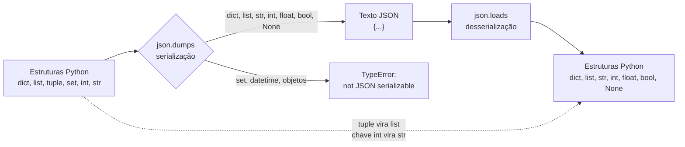

# 01.23 — JSON em Python

> **Módulo 01 — Python Fundamental** · Nível: N1 · Tempo estimado: 2h30 · Código: `codigo/cap23/`

## 1. Objetivo

- **Implementar** serialização e desserialização com `json.dump`/`load` (arquivos) e `dumps`/`loads` (strings).
- **Mapear** os tipos JSON ↔ Python — e prever o que se perde na viagem de ida e volta.
- **Navegar** estruturas aninhadas com segurança (`get` encadeado, laços em listas de dicionários).
- **Decidir** entre CSV e JSON para cada dado da Aurora — o critério que o Atlas usará daqui em diante.

Ao final, você lê e escreve o formato em que **toda API do mundo** conversa — e que o módulo 07 vai consumir sem parar.

---

## 2. Pré-requisitos

- [01.22 — Arquivos: texto e CSV](22-arquivos-texto-e-csv.md) — `with`, encoding e o padrão de importação.
- [01.15 — Dicionários](15-dicionarios.md) — JSON **é** dicionário e lista; sem eles, nada aqui faz sentido.

**Autoteste:** (1) O que `d.get("chave")` devolve se a chave não existe? (2) Como percorrer uma lista de dicionários? (3) Por que `encoding="utf-8"` é obrigatório? Se as três saíram, este capítulo é uma sobreposição direta do que você já sabe.

---

## 3. Motivação

O CSV resolveu as vendas — porque venda é **plana**: um pedido, uma linha, quatro colunas. Mas olhe o pedido de verdade da Aurora: ele tem **vários itens** (fone + cabo + garantia), um cliente com **endereço estruturado** (rua, número, cidade, CEP), e um histórico de status (criado → pago → enviado). Como isso vira linha e coluna?

As saídas ruins são conhecidas: repetir o pedido em várias linhas (uma por item — e agora o total aparece três vezes, e alguém vai somá-lo errado); ou criar colunas `item_1`, `item_2`, `item_3` (e o pedido com quatro itens quebra o formato). Dados **aninhados** não cabem em tabela sem violência.

E há o segundo motivo, mais decisivo para a sua carreira: **APIs falam JSON**. Toda integração que o módulo 07 fizer — transportadora, gateway de pagamento, serviço de CEP — vai enviar e receber JSON; toda resposta que a sua API do módulo 06 devolver será JSON. Aprender esse formato é aprender o idioma da comunicação entre sistemas.

A boa notícia — e é uma notícia excelente — é que você já sabe JSON sem saber. Ele é, literalmente, **dicionários e listas escritos em texto**, com pequenas diferenças de grafia. O capítulo 01.15 fez o trabalho pesado; aqui você aprende a atravessar a fronteira entre o texto e as estruturas.

Este capítulo resolve isso assim: apresenta as quatro funções do módulo `json`, a tabela de correspondência de tipos (com as armadilhas da viagem de volta), a navegação segura em estruturas profundas e o critério CSV × JSON aplicado aos dados reais da Aurora.

---

## 4. Modelo mental

> 🧠 **Modelo mental**
> JSON é **dicionário e lista fotografados em texto**. Serializar (`dump`) é tirar a foto: a estrutura vira uma string que pode ser gravada ou enviada pela rede. Desserializar (`load`) é revelar a foto: o texto vira dicionários e listas de novo. E, como toda fotografia, ela **perde informação**: tuplas voltam como listas, conjuntos não fotografam, e chaves numéricas viram texto. O que atravessa a viagem intacto é o que o formato conhece — os seis tipos da tabela da seção 6.

**Exercício de previsão.** Sem rodar, decida o que imprime:

```python
import json

original = {"itens": ("fone", "cabo"), "quantidade": 2, "ativo": True, "obs": None}
texto = json.dumps(original)
volta = json.loads(texto)

print(texto)
print(type(volta["itens"]))
print(volta == original)
```

*Resposta comentada:* imprime `{"itens": ["fone", "cabo"], "quantidade": 2, "ativo": true, "obs": null}` — repare em **três** transformações: a tupla virou **lista** (JSON não tem tupla), `True` virou `true` e `None` virou `null` (grafia do formato). Depois, `<class 'list'>` — confirmando a perda da tupla. E por fim **`False`**: a estrutura de volta **não é igual** à original, porque `("fone","cabo") != ["fone","cabo"]`. Se você esperava `True` na última linha, acabou de descobrir a armadilha nº 1 da viagem de ida e volta.

---

## 5. Analogia

JSON é o **formulário padronizado internacional** que dois escritórios usam para trocar informação. Cada escritório organiza seus arquivos internamente como quiser (Python usa dicionários; outra linguagem usa objetos próprios), mas na hora de **enviar**, todos preenchem o mesmo formulário — com regras rígidas: nomes de campo sempre entre aspas, decimais com ponto, verdadeiro/falso em minúsculas, nada de comentários na margem.

A rigidez é a virtude: como o formulário não admite dialeto, qualquer escritório do mundo lê o que qualquer outro escreveu. O preço é a perda de nuance — se o seu escritório distinguia "lista fixa" de "lista que cresce" (tupla × lista), o formulário não tem esse campo: chega tudo como lista do outro lado.

**Onde a analogia quebra:** formulários de papel toleram rabiscos e anotações; JSON não perdoa **nenhum** desvio — uma vírgula sobrando antes do fecho, uma aspa simples no lugar da dupla, e o documento inteiro é rejeitado (`JSONDecodeError`). É a mesma severidade da Estação 1 do 01.02: ou o texto está válido, ou nada é lido.

---

## 6. Teoria

### As quatro funções

| Função | Direção | Trabalha com |
|---|---|---|
| `json.dump(objeto, arquivo)` | Python → JSON | **arquivo** |
| `json.load(arquivo)` | JSON → Python | **arquivo** |
| `json.dumps(objeto)` | Python → JSON | **string** (o `s` é de *string*) |
| `json.loads(texto)` | JSON → Python | **string** |

```python
import json

# Gravar (dump) — com with e encoding, como sempre (01.22)
with open("pedido.json", "w", encoding="utf-8") as arquivo:
    json.dump(pedido, arquivo, ensure_ascii=False, indent=2)

# Ler (load)
with open("pedido.json", encoding="utf-8") as arquivo:
    pedido = json.load(arquivo)
```

Dois parâmetros que a trilha exige na gravação: **`ensure_ascii=False`** — sem ele, "São Paulo" é gravado como `"São Paulo"` (válido, ilegível); e **`indent=2`** — formata com quebras e recuo, tornando o arquivo legível por humanos (para tráfego de rede, omite-se o indent para economizar bytes).

As versões com `s` (`dumps`/`loads`) trabalham com strings — e são as que você usará no módulo 07, onde o JSON chega pela rede, não por arquivo.

### A tabela de correspondência

| Python | JSON | Volta como |
|---|---|---|
| `dict` | objeto `{...}` | `dict` |
| `list`, **`tuple`** | array `[...]` | **`list`** (a tupla se perde!) |
| `str` | string `"..."` | `str` |
| `int`, `float` | number | `int`/`float` |
| `True` / `False` | `true` / `false` | `bool` |
| `None` | `null` | `None` |
| `set`, `datetime`, objetos | **erro** (`TypeError`) | — |

Três armadilhas decorrem dela. **Tupla vira lista** (a previsão da seção 4). **Chaves viram string**: `{1: "a"}` volta como `{"1": "a"}` — porque JSON só admite chaves de texto. E **conjuntos e datas não são serializáveis**: `json.dumps({"cidades": {"campinas"}})` levanta `TypeError: Object of type set is not JSON serializable`; a solução é converter antes (`list(conjunto)`, `data.isoformat()`).

### Navegar estruturas aninhadas com segurança

O pedido real da Aurora, em JSON, tem esta forma:

```json
{
  "codigo": "PED-2026-00123",
  "cliente": {"nome": "Ana Souza", "endereco": {"cidade": "Campinas", "cep": "13010-000"}},
  "itens": [
    {"produto": "Fone Bluetooth", "quantidade": 1, "valor_centavos": 46990},
    {"produto": "Cabo HDMI", "quantidade": 2, "valor_centavos": 9890}
  ],
  "pago": true
}
```

Navegar é encadear acessos — e o risco é o `KeyError` do 01.15, agora em profundidade:

```python
cidade = pedido["cliente"]["endereco"]["cidade"]              # explode se faltar qualquer nível
cidade = pedido.get("cliente", {}).get("endereco", {}).get("cidade", "")   # seguro
```

O idioma do `get` com **dicionário vazio como padrão** permite encadear sem explodir: se `cliente` faltar, o `{}` segue a corrente e o resultado é a string vazia. Use-o quando o campo é opcional; use o acesso direto quando a ausência é bug (a decisão do 01.15).

E a lista de itens percorre como qualquer lista de dicionários:

```python
total = 0
for item in pedido["itens"]:
    total += item["quantidade"] * item["valor_centavos"]
```

### CSV ou JSON? O critério

| Situação | Formato | Por quê |
|---|---|---|
| Dados tabulares, mesmas colunas | **CSV** | compacto, abre em planilha, direto de agregar |
| Dados aninhados (itens, endereços) | **JSON** | representa hierarquia sem violência |
| Configuração da aplicação | **JSON** | chaves nomeadas, tipos preservados |
| Troca entre sistemas / APIs | **JSON** | padrão universal |
| Volume grande para análise | CSV (e, adiante, **Parquet** — 10.13) | eficiência de leitura em massa |

Na Aurora: o **export de vendas** é CSV (tabular, vem do sistema legado, abre no Excel); o **pedido completo** com itens e cliente é JSON; a **configuração** do Atlas (cidades atendidas, faixas de frete) é JSON. É a divisão que o projeto usará daqui em diante.

### JSON não é Python

Diferenças de grafia que o `JSONDecodeError` cobra: aspas **duplas** obrigatórias (nunca simples); `true`/`false`/`null` em minúsculas; **sem vírgula** após o último elemento; **sem comentários** (o formato não os prevê — configurações comentadas usam outros formatos, como YAML ou TOML). Colar um dicionário Python num arquivo `.json` costuma falhar por exatamente esses pontos.

---

## 7. Funcionamento interno

Por dentro, na medida N1: o módulo `json` é um **par de tradutores** — o serializador percorre a estrutura recursivamente convertendo cada tipo conhecido para a grafia do formato, e levanta `TypeError` ao encontrar algo que não sabe traduzir (conjunto, data, objeto próprio); o desserializador faz o caminho inverso, construindo dicionários e listas conforme lê. Como a tradução é recursiva, estruturas muito profundas podem estourar o limite de recursão — irrelevante nesta escala, relevante em payloads maliciosos (uma preocupação real de segurança em APIs, módulo 06). Sobre precisão: números decimais atravessam como `float` (com o arredondamento binário do 01.04) — e é por isso que **valores monetários viajam como centavos inteiros ou strings** em sistemas financeiros sérios. Por fim, o `json` da biblioteca padrão é escrito em C na parte crítica: rápido o bastante para quase tudo; bibliotecas externas mais velozes existem e são assunto de otimização no módulo 07.

---

## 8. Visualização do fluxo

A ida e volta — e o que se perde:



**Como ler:** o caminho de cima é a viagem completa; o de baixo (seta pontilhada) é o que **muda** entre a estrutura original e a que volta. Note que o conjunto sequer embarca — ele precisa ser convertido antes (`list(...)`). E note que a viagem de volta só produz os seis tipos do formato: qualquer riqueza de tipos que seu programa tinha precisa ser **reconstruída** por você depois (converter a lista de volta para tupla, a string de data para `date`, e assim por diante).

---

## 9. Aplicação prática

O pedido completo da Aurora, com itens e cliente. Rode:

```bash
python 01-Python/codigo/cap23/pedidos_em_json.py
```

```text
--- Cena 1: gravar e ler de volta ---
Gravado em dados/pedido.json (com acentos legíveis e indentação)
Lido de volta: PED-2026-00123 | cliente: Ana Souza | 2 itens

--- Cena 2: navegação segura ---
Cidade (acesso direto): Campinas
Cidade de pedido sem cliente (get encadeado): '' (sem explodir) ✓
Total dos itens: R$ 667,70

--- Cena 3: o que se perde na viagem ---
Original: itens é tuple? True  | Volta: itens é tuple? False (virou list)
Chave int 1 volta como: '1' (str)
set não embarca: Object of type set is not JSON serializable ✓ (capturado)

--- Cena 4: catálogo com vários pedidos ---
3 pedidos | total geral R$ 1.156,50 | cidades: ['Campinas', 'Santos']
Configuração lida de config.json: 3 cidades atendidas, frete grátis a partir de R$ 299,00
```

Dois detalhes valem a leitura do arquivo. Primeiro: a **Cena 2** mostra o `get` encadeado salvando um acesso a estrutura incompleta — o padrão que você usará o tempo todo com respostas de API (que frequentemente omitem campos). Segundo: a **Cena 4** lê um `config.json` — a primeira vez na trilha que a configuração sai do código e vira arquivo, antecipando o princípio que o 06.12 formaliza ("configuração por ambiente, nunca hardcoded").

E o experimento: abra `dados/pedido.json` num editor de texto. Ele é legível — você entende o pedido inteiro sem rodar nada. Agora troque o `ensure_ascii=False` por `True`, rode de novo, e veja "São" virar `São`. É o parâmetro que separa arquivo legível de arquivo apenas válido.

> 🎯 **Checkpoint rápido**
> De cabeça: `json.dumps({"data": date.today()})` funciona? E `json.dumps({"cidades": ["a", "b"]})`? Qual a diferença entre os dois casos?

---

## 10. Código comentado

Arquivo completo em [`codigo/cap23/pedidos_em_json.py`](codigo/cap23/pedidos_em_json.py).

```python
# ------------------------------------------------------------
# pedidos_em_json.py
# Capítulo 01.23 — JSON em Python
# O que este arquivo demonstra: dump/load, navegação segura em
#   estruturas aninhadas, perdas da ida e volta e configuração
# Como executar: python pedidos_em_json.py
# ------------------------------------------------------------

import json
from pathlib import Path

PASTA_DADOS = Path(__file__).parent / "dados"
ARQUIVO_PEDIDO = PASTA_DADOS / "pedido.json"
ARQUIVO_CATALOGO = PASTA_DADOS / "catalogo.json"
ARQUIVO_CONFIG = PASTA_DADOS / "config.json"


def formatar_reais(centavos):
    """Converte centavos no formato monetário brasileiro."""
    texto = f"{centavos / 100:,.2f}"
    return texto.replace(",", "@").replace(".", ",").replace("@", ".")


def total_dos_itens(pedido):
    """Soma quantidade x valor de cada item do pedido."""
    total = 0
    for item in pedido.get("itens", []):        # get com [] : lista vazia se faltar
        total += item["quantidade"] * item["valor_centavos"]
    return total


print("--- Cena 1: gravar e ler de volta ---")
pedido = {
    "codigo": "PED-2026-00123",
    "cliente": {
        "nome": "Ana Souza",
        "endereco": {"cidade": "Campinas", "cep": "13010-000"},
    },
    "itens": [
        {"produto": "Fone Bluetooth", "quantidade": 1, "valor_centavos": 46_990},
        {"produto": "Cabo HDMI", "quantidade": 2, "valor_centavos": 9_890},
    ],
    "pago": True,
    "observacao": None,
}

PASTA_DADOS.mkdir(exist_ok=True)                # cria a pasta se não existir
with open(ARQUIVO_PEDIDO, "w", encoding="utf-8") as arquivo:
    # ensure_ascii=False: acentos legíveis | indent=2: humano lê o arquivo
    json.dump(pedido, arquivo, ensure_ascii=False, indent=2)
print(f"Gravado em dados/{ARQUIVO_PEDIDO.name} (com acentos legíveis e indentação)")

with open(ARQUIVO_PEDIDO, encoding="utf-8") as arquivo:
    lido = json.load(arquivo)
print(f"Lido de volta: {lido['codigo']} | cliente: {lido['cliente']['nome']} "
      f"| {len(lido['itens'])} itens")

print()
print("--- Cena 2: navegação segura ---")
print("Cidade (acesso direto):", lido["cliente"]["endereco"]["cidade"])

pedido_incompleto = {"codigo": "PED-9"}         # sem cliente, como uma API pode devolver
cidade = pedido_incompleto.get("cliente", {}).get("endereco", {}).get("cidade", "")
print(f"Cidade de pedido sem cliente (get encadeado): {cidade!r} (sem explodir) ✓")
print("Total dos itens:", "R$", formatar_reais(total_dos_itens(lido)))

print()
print("--- Cena 3: o que se perde na viagem ---")
com_tupla = {"itens": ("fone", "cabo"), 1: "chave numérica"}
volta = json.loads(json.dumps(com_tupla))
print(f"Original: itens é tuple? {isinstance(com_tupla['itens'], tuple)} "
      f" | Volta: itens é tuple? {isinstance(volta['itens'], tuple)} (virou list)")
print(f"Chave int 1 volta como: {list(volta.keys())[1]!r} (str)")

try:
    json.dumps({"cidades": {"campinas", "santos"}})     # conjunto não embarca
except TypeError as erro:
    print(f"set não embarca: {erro} ✓ (capturado)")

print()
print("--- Cena 4: catálogo com vários pedidos ---")
catalogo = [
    pedido,
    {"codigo": "PED-2026-00124", "cliente": {"nome": "Bruno Lima",
     "endereco": {"cidade": "Santos", "cep": "11010-000"}},
     "itens": [{"produto": "Mouse Sem Fio", "quantidade": 1, "valor_centavos": 8_990}],
     "pago": False, "observacao": "entrega expressa"},
    {"codigo": "PED-2026-00125", "cliente": {"nome": "Carla Dias",
     "endereco": {"cidade": "Campinas", "cep": "13020-000"}},
     "itens": [{"produto": "Teclado Mecânico", "quantidade": 1, "valor_centavos": 34_900},
               {"produto": "Mousepad", "quantidade": 1, "valor_centavos": 4_990}],
     "pago": True, "observacao": None},
]

with open(ARQUIVO_CATALOGO, "w", encoding="utf-8") as arquivo:
    json.dump(catalogo, arquivo, ensure_ascii=False, indent=2)

total_geral = 0
cidades = set()
for p in catalogo:
    total_geral += total_dos_itens(p)
    cidades.add(p["cliente"]["endereco"]["cidade"])
print(f"{len(catalogo)} pedidos | total geral R$ {formatar_reais(total_geral)} "
      f"| cidades: {sorted(cidades)}")

# Configuração em arquivo — o princípio que o 06.12 formaliza
config = {"cidades_atendidas": ["campinas", "santos", "sao paulo"],
          "frete_gratis_a_partir_de_centavos": 29_900,
          "parcelas_maximas": 12}
with open(ARQUIVO_CONFIG, "w", encoding="utf-8") as arquivo:
    json.dump(config, arquivo, ensure_ascii=False, indent=2)

with open(ARQUIVO_CONFIG, encoding="utf-8") as arquivo:
    config_lida = json.load(arquivo)
print(f"Configuração lida de config.json: {len(config_lida['cidades_atendidas'])} cidades "
      f"atendidas, frete grátis a partir de R$ "
      f"{formatar_reais(config_lida['frete_gratis_a_partir_de_centavos'])}")
# Saída: (as quatro cenas mostradas na seção 9 do capítulo)
```

---

## 11. Erros comuns

### Erro 1 — `TypeError: Object of type X is not JSON serializable`

**Sintoma:**

```text
TypeError: Object of type set is not JSON serializable
```

(também comum com `datetime`, `Decimal` e objetos próprios)
**Causa:** o tipo não existe no formato JSON — a tabela da seção 6 lista o que embarca.
**Correção:** converta **antes** de serializar: `list(conjunto)`, `data.isoformat()` (texto `"2026-07-31"`), `str(decimal)` ou centavos inteiros para dinheiro. A conversão explícita é melhor que a mágica: quem lê o JSON precisa saber que aquela string é uma data.

### Erro 2 — `JSONDecodeError` (o formato não perdoa)

**Sintoma:**

```text
json.decoder.JSONDecodeError: Expecting property name enclosed in double quotes: line 3 column 5 (char 42)
```

**Causa:** grafia de Python num arquivo JSON — aspas simples, `True`/`None` com maiúscula, vírgula sobrando antes de `}`/`]`, ou comentários.
**Correção:** leia a mensagem: ela dá **linha e coluna** exatas. E lembre que JSON é mais rígido que Python: aspas duplas sempre, `true/false/null` minúsculos, sem vírgula final, sem comentários. Um validador (o próprio VS Code aponta) resolve em segundos.

### Erro 3 — `KeyError` em estrutura aninhada

**Sintoma:**

```text
KeyError: 'endereco'
```

— vindo de `pedido["cliente"]["endereco"]["cidade"]`, e o traceback aponta a **linha inteira**, sem dizer qual nível faltou.
**Causa:** dados externos (APIs, arquivos de terceiros) omitem campos opcionais com frequência; o acesso direto exige que **todos** os níveis existam.
**Correção:** para campos opcionais, `get` encadeado com `{}` como padrão; para obrigatórios, mantenha o acesso direto **e** valide na entrada (o contrato do 01.21). E no diagnóstico: imprima o dicionário do nível anterior (`print(pedido["cliente"])`) para ver o que **de fato** veio — quase sempre a surpresa está aí.

> ⚠️ **Atenção**
> Com respostas de API (módulo 07), assumir que um campo sempre vem é a fonte nº 1 de quebras em produção — a API do parceiro muda, um campo vira opcional, e seu código para. O `get` encadeado com padrão sensato é defesa barata; validação de contrato (Pydantic, 04.15) é a defesa madura.

---

## 12. Boas práticas

✅ **Sempre `ensure_ascii=False` e `indent=2` ao gravar arquivos para humanos** — arquivo legível é arquivo depurável; para rede, omita o indent.

✅ **Converta tipos não serializáveis explicitamente** — datas para ISO (`isoformat`), conjuntos para listas, dinheiro para centavos inteiros; e documente a convenção.

✅ **`get` encadeado para campos opcionais; acesso direto para obrigatórios** — a mesma decisão de intenção do 01.15, agora em profundidade.

✅ **JSON para aninhado e configuração; CSV para tabular** — e registre a escolha no LEIA-ME do projeto.

❌ **Evite guardar float para dinheiro em JSON** — o arredondamento binário (01.04) atravessa a viagem; use centavos inteiros ou string.

❌ **Evite assumir que a estrutura veio completa** — dados externos são promessas, não garantias; navegue com defesa nas bordas.

---

## 13. Performance

Nesta escala, irrelevante — serializar alguns pedidos custa microssegundos. Duas notas de calibragem: JSON é **mais volumoso** que CSV para dados tabulares (repete o nome de cada campo em cada registro — um CSV de 10 MB pode virar 40 MB em JSON), o que importa em tráfego de rede e armazenamento; e a serialização/desserialização é **custo de CPU** que aparece em APIs de alto volume (o módulo 07 menciona bibliotecas mais rápidas quando isso vira gargalo real). Para volumes grandes de análise, nem CSV nem JSON são a resposta: o módulo 10 apresenta o **Parquet** (10.13), que é colunar e comprimido. Regra de bolso do momento: JSON para comunicação e configuração; formatos tabulares para volume.

---

## 14. Mercado

> 🏢 **Mercado**
> JSON é o formato de troca entre sistemas — sem concorrente relevante em APIs web. Tudo que você fará do módulo 06 em diante passa por ele: os *payloads* que sua API recebe e devolve (06.05, 06.07), as respostas de serviços externos (07.01), os arquivos de configuração de praticamente toda ferramenta moderna, e até bancos de dados o armazenam nativamente (o tipo `JSONB` do PostgreSQL — 05.03 — que permite guardar o pedido aninhado inteiro numa coluna). O padrão de navegação segura que você aprendeu é defensiva obrigatória: em produção, campos somem, tipos mudam, e o `get` com padrão é a diferença entre uma resposta degradada e um erro 500. E a decisão CSV × JSON reaparece o tempo todo em engenharia de dados: formato de troca (JSON), formato de análise (colunar), formato de intercâmbio com humanos (CSV/planilha).
>
> **Mini-cenário:** o `config.json` que você gravou hoje é o ancestral direto do arquivo de configuração do Atlas em produção (06.12) — onde cidades atendidas, faixas de frete e limites deixam o código e passam a ser ajustáveis sem redeploy. A gestora da Aurora vai pedir "mudar o frete grátis para R$ 249" numa sexta-feira à tarde; a diferença entre editar uma linha de JSON e reescrever código é o que decide se isso é um pedido tranquilo ou um problema.

---

## 15. Entrevistas

**P1. "O que é JSON e como ele se relaciona com estruturas Python?"**
*Resposta esperada:* formato de texto para troca de dados; mapeia diretamente para `dict` (objeto), `list` (array), `str`, `int`/`float`, `bool` e `None`. Diferenças de grafia: aspas duplas, `true/false/null` minúsculos, sem comentários nem vírgula final. Complemento forte: o que **não** mapeia (set, datetime, tupla-que-volta-lista).

**P2. "O que se perde ao serializar e desserializar?"**
*Resposta esperada:* tuplas viram listas; chaves não-string viram string; tipos ricos (datetime, Decimal, set, objetos) precisam de conversão explícita; floats carregam o arredondamento binário. Consequência prática: `objeto == json.loads(json.dumps(objeto))` pode ser `False` — a resposta que demonstra que a pessoa já se queimou.

**P3. "Como você acessaria com segurança um campo aninhado que pode não existir?"**
*Resposta esperada:* `dados.get("a", {}).get("b", {}).get("c", padrao)` para opcionais; acesso direto quando a ausência é violação de contrato (e aí o `KeyError` é informação legítima). Complemento maduro: validar o formato na borda (Pydantic, 04.15) em vez de espalhar `get` defensivo por todo o código.

**Pegadinha clássica: "Você grava `{"cidades": {"campinas", "santos"}}` em JSON e o programa quebra. Depois grava `{"total": 46990.0}` e funciona — mas o valor volta diferente. O que houve nos dois casos?"**
Ela cobra a tabela de tipos por dois ângulos. A saída forte: o primeiro é **conjunto**, tipo que o JSON não conhece — `TypeError: not JSON serializable`; conversão explícita para lista resolve (perdendo a garantia de unicidade, que precisa ser reconstruída na volta). O segundo é **float**: JSON o representa em decimal, mas o valor já carregava o arredondamento binário do IEEE 754 (01.04) — e por isso sistemas financeiros trafegam dinheiro como **inteiro em centavos** ou string. Fechar com o princípio: o formato preserva o que ele conhece; tudo além disso é convenção que **você** precisa documentar nas duas pontas.

---

## 16. Exercícios guiados

Enunciados completos em [`exercicios/cap23.md`](exercicios/cap23.md); gabaritos em [`exercicios/gabaritos/cap23.md`](exercicios/gabaritos/cap23.md).

### Aquecimento

- **A1** `[~10 min · correspondência de tipos]` — 8 valores Python: o que vira em JSON e o que volta?
- **A2** `[~10 min · JSON válido?]` — 6 trechos: quais são JSON válido e qual o erro dos demais?
- **A3** `[~10 min · navegação]` — 5 acessos numa estrutura aninhada dada: resultado ou erro?
- **A4** `[~5 min · CSV ou JSON?]` — 6 dados da Aurora: qual formato e por quê?

### Aplicação

- **AP1** `[~20 min · ida e volta]` — Grave um pedido completo, leia de volta, e verifique quais partes sobreviveram idênticas (com relatório de diferenças).
- **AP2** `[~25 min · o catálogo]` — Leia um JSON com 5 pedidos aninhados e produza: total por cidade, produto mais vendido e a lista de pedidos não pagos.
- **AP3** `[~20 min · configuração externa]` — Mova as constantes da sua biblioteca (cidades, faixas de frete, limite de parcelas) para um `config.json` e faça a biblioteca lê-lo.

---

## 17. Desafios

- **D1** `[~50 min · o conversor bidirecional]` — **CSV ⇄ JSON.** Escreva duas funções: `csv_para_json(caminho_csv, caminho_json)` — que lê o `vendas.csv` do 01.22 e grava um JSON **agrupado por cidade** (cada cidade com sua lista de pedidos e seu total) — e `json_para_csv(caminho_json, caminho_csv)` — que faz o caminho inverso, "achatando" a estrutura de volta para linhas. Depois, o teste de **ida e volta**: converta CSV → JSON → CSV e compare o arquivo final com o original (ordem das linhas pode mudar; o conjunto de registros não). Documente em 5 linhas: o que se perde em cada direção, e por que "achatar" é sempre uma decisão com perdas.

<details><summary>💡 Dica 1 (conceito)</summary>
O agrupamento por cidade é o `setdefault(cidade, []).append(pedido)` do 01.15 — e é exatamente o que o JSON representa bem e o CSV não.
</details>
<details><summary>💡 Dica 2 (estratégia)</summary>
Para comparar ida e volta, ordene os dois conjuntos de registros antes (sorted por código) — a ordem não é o que você quer testar.
</details>
<details><summary>💡 Dica 3 (esqueleto)</summary>
ler CSV (DictReader) → agrupar em dicionário → json.dump; json.load → percorrer grupos → DictWriter → comparar ordenados.
</details>

---

## 18. Mini projeto

**Atlas fala JSON** `[~1h]` — configuração externa e pedidos aninhados no projeto.

Requisitos numerados:

1. Em `codigo/cap23/`, crie `config.json` com: cidades atendidas (lista), faixas de frete (lista de objetos com `limite_centavos` e `frete_centavos`), parcelas máximas e nome da empresa.
2. Adapte sua `biblioteca_aurora.py` para **ler a configuração** de `config.json` (uma função `carregar_config(caminho)` que devolve o dicionário, com `FileNotFoundError` tratado e valores padrão sensatos).
3. `calcular_frete` passa a usar as faixas do arquivo — e você prova, mudando o JSON e rodando de novo, que a política mudou **sem tocar no código**.
4. Grave o `pedidos.json` com 4 pedidos aninhados (cliente + itens) e escreva um programa que lê e produz: total por cidade, ticket médio e lista de não pagos.
5. Documente no LEIA-ME: o formato esperado do `config.json` (com exemplo) e a decisão CSV × JSON para cada arquivo do projeto.

**Critério de "está bom":** a mudança de política por edição de JSON funciona (o teste do requisito 3 é o coração do projeto); navegação segura nos campos opcionais; documentação suficiente para alguém alterar a configuração sem ler o código. Este é o último tijolo antes do mini projeto do módulo.

---

## 19. Revisão

**Resumo do capítulo:**

- JSON = dicionários e listas em texto; quatro funções: `dump`/`load` (arquivo) e `dumps`/`loads` (string).
- Gravação para humanos: `ensure_ascii=False` (acentos legíveis) + `indent=2`; para rede, sem indent.
- Tabela de tipos: dict/list/str/int/float/bool/None atravessam; **tupla volta lista**, **chave vira string**, e set/datetime/objetos **não embarcam** (`TypeError`) — converta antes.
- Navegação segura: `get` encadeado com `{}` para campos opcionais; acesso direto quando a ausência é violação de contrato.
- JSON é rígido: aspas duplas, `true/false/null`, sem vírgula final, sem comentários — `JSONDecodeError` traz linha e coluna.
- Critério: JSON para aninhado, configuração e troca entre sistemas; CSV para tabular e planilha; Parquet (10.13) para volume analítico.

**Flashcards novos** (adicionados a [`revisao/flashcards.md`](revisao/flashcards.md)):

| ID | Frente | Verso |
|---|---|---|
| 01.23-F1 | Quais as 4 funções do módulo json e a diferença entre elas? | `dump`/`load` trabalham com **arquivo**; `dumps`/`loads` com **string** (o "s" é de string). Serializar = Python→texto; desserializar = texto→Python. |
| 01.23-F2 | Explique com suas palavras: o que se perde numa viagem de ida e volta em JSON? | (Elaboração) Tuplas voltam listas; chaves não-string viram string; set/datetime/objetos nem embarcam (TypeError); floats carregam o arredondamento binário. |
| 01.23-F3 | Preveja: `json.dumps({"itens": ("a","b")})` — o que sai, e `loads` devolve tupla? | (Previsão) Sai `{"itens": ["a", "b"]}`; volta como **lista** — JSON não tem tupla. Por isso `original == volta` pode ser False. |
| 01.23-F4 | Como acessar `dados["cliente"]["endereco"]["cidade"]` com segurança? | (Decisão) `dados.get("cliente", {}).get("endereco", {}).get("cidade", "")` para opcionais; acesso direto quando a ausência é violação de contrato. |
| 01.23-F5 | Quais dois parâmetros usar ao gravar JSON para humanos — e por quê? | `ensure_ascii=False` (acentos legíveis em vez de ã) e `indent=2` (legível/diffável). Para tráfego de rede, omita o indent. |

**Agendamento:** registre no `PROGRESSO.md` e marque D+1, D+7, D+30, D+90 na [`Revisoes/agenda.md`](../Revisoes/agenda.md).

---

## 20. Checklist

Perguntas de domínio — teste do sim:

- [ ] Sei usar *as quatro funções e escolher entre arquivo e string*?
- [ ] Sei prever *o que muda na viagem de ida e volta (tupla, chave, tipos ausentes)*?
- [ ] Sei navegar *estruturas aninhadas com defesa nos campos opcionais*?
- [ ] Sei decidir *CSV × JSON para cada tipo de dado, justificando*?
- [ ] Sei responder *à pegadinha do set e do float monetário*?

Itens práticos:

- [ ] Rodei `pedidos_em_json.py` e fiz o experimento do `ensure_ascii`.
- [ ] Acertei (ou entendi por que errei) a previsão da seção 4 e o checkpoint da seção 9.
- [ ] Fiz Aquecimento e Aplicação (ida e volta, catálogo, configuração externa).
- [ ] Construí "Atlas fala JSON" e provei a mudança de política por arquivo (5 requisitos).
- [ ] Registrei a sessão e agendei as 4 revisões.

---

## 21. Próximo capítulo

Você tem, agora, um sistema que lê arquivos, valida, agrega e grava — com quarentena, configuração externa e biblioteca organizada. E quando algo der errado nele, sua ferramenta de diagnóstico ainda é a mesma do primeiro dia: **espalhar `print`**. Funciona, é lento, e suja o código com linhas que você depois esquece de remover. Ficou deliberadamente em aberto o instrumento profissional: o **depurador** do VS Code — pontos de parada, execução passo a passo, inspeção de variáveis ao vivo e a pilha de chamadas navegável. O próximo capítulo troca a lanterna pelo raio-X — e é a última peça técnica antes do mini projeto que fecha o módulo.

→ [01.24 — Depuração no VS Code](24-depuracao-no-vs-code.md)

---

*Gerado sob spec 3.0.0*
