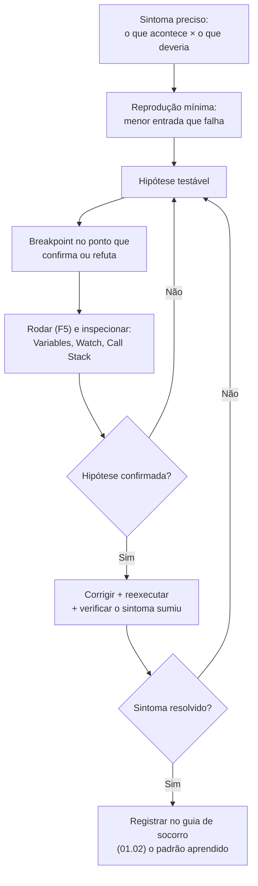

# 01.24 — Depuração no VS Code

> **Módulo 01 — Python Fundamental** · Nível: N2 · Tempo estimado: 2h30 · Código: `codigo/cap24/`

## 1. Objetivo

- **Depurar** com breakpoints, execução passo a passo (*step over/into/out*), painel de variáveis e pilha de chamadas.
- **Substituir** o print-debugging por inspeção sistemática — e saber quando o print ainda é a ferramenta certa.
- **Aplicar** o método científico de depuração: sintoma → hipótese → experimento → conclusão.
- **Depurar** um bug real plantado no código do módulo, do sintoma à correção.

Ao final, você troca a lanterna pelo raio-X — e ganha a habilidade que mais economiza tempo na vida profissional.

---

## 2. Pré-requisitos

- [01.23 — JSON em Python](23-json-em-python.md) e todo o repertório do módulo — você vai depurar o próprio código.
- [01.02 — Como o Python executa seu código](02-como-o-python-executa-seu-codigo.md) — o modelo de execução e a leitura de tracebacks.

**Autoteste:** (1) Quantos `print` você já apagou depois de resolver um bug? (2) Qual foi o último bug que levou mais de 20 minutos? (3) Você conseguiria dizer, hoje, o valor de uma variável na volta 47 de um laço? A resposta da 3 é "não, sem muito esforço" — e é isso que muda hoje.

---

## 3. Motivação

Seu método de diagnóstico não mudou desde o primeiro capítulo: espalhar `print`, rodar, ler, apagar, repetir. Funciona — e é caro de três maneiras.

**Caro em tempo**: cada hipótese exige editar o código, salvar, rodar de novo, ler a saída. Num programa que lê CSV e agrega, são 20 segundos por ciclo; vinte hipóteses são sete minutos de espera pura, mais o custo mental de reencontrar o ponto a cada rodada.

**Caro em ruído**: prints se acumulam. Você já encontrou (ou vai encontrar) um `print("aqui 3")` esquecido num arquivo seu — e no dia em que esquecer num programa que roda em produção, o "aqui 3" vai parar no log da empresa.

**Caro em cegueira**: o print mostra **o que você pensou em imprimir**. O bug frequentemente está no que você não imaginou — a variável que ninguém suspeitava, o laço que rodou zero vezes, a função que recebeu o argumento na ordem trocada. Perguntas que você não fez não têm resposta.

O depurador resolve os três: **pausa** o programa em pontos escolhidos, mostra **todas** as variáveis vivas naquele instante (não só as que você lembrou), permite avançar **uma linha por vez** e revela a **pilha de chamadas** — quem chamou quem até ali. E não exige editar o código: os pontos de parada vivem no editor, não no arquivo.

Este capítulo resolve isso assim: instala o depurador do VS Code, apresenta os quatro comandos que cobrem 95% dos casos, ensina o método científico de depuração — e aplica tudo a um bug real plantado num programa do módulo, do sintoma à correção.

---

## 4. Modelo mental

> 🧠 **Modelo mental**
> O depurador é um **botão de pausa com raio-X**. O `print` é uma foto que você pediu antes de rodar; o depurador **congela o programa vivo** e deixa você olhar tudo: cada variável, cada quadro da pilha de chamadas, e o que acontece na próxima linha — antes de ela acontecer. E a inversão que importa: com print, você decide as perguntas **antes** de ver o problema; com o depurador, você faz as perguntas **diante** dele.

**Exercício de previsão.** Você põe um breakpoint na linha 12 de uma função chamada dentro de um laço de 50 voltas, e roda. Sem consultar nada, decida: o programa para quantas vezes — e o que você vê ao continuar?

*Resposta comentada:* para **50 vezes** — uma por volta, porque o breakpoint é um ponto no *código*, não no tempo. Ao continuar (F5), ele avança até a próxima passagem pelo mesmo ponto. É esse comportamento que torna insuportável depurar a volta 47 no braço — e é por isso que existem os **breakpoints condicionais** (`if numero == 47`), que a seção 6 apresenta. Se você respondeu "uma vez", acabou de descobrir a primeira frustração de quem começa com o depurador — e sua solução.

---

## 5. Analogia

Depurar com `print` é investigar um crime pelas **fotos do circuito interno**: você vê os instantes que as câmeras cobriram, e só eles. Se o culpado passou fora de quadro, não há como saber — e a única saída é instalar mais câmeras (mais prints) e esperar o crime acontecer de novo.

O depurador é **congelar o tempo na cena**. Você anda pela sala, abre gavetas, confere todos os bolsos de todos os presentes (o painel de variáveis), e reconstitui quem entrou antes de quem (a pilha de chamadas). Nenhuma câmera precisava estar no lugar certo.

**Onde a analogia quebra:** congelar o tempo real seria mágica; congelar o programa tem custo — a execução fica muito mais lenta sob o depurador, e há situações em que ele atrapalha: programas com temporização sensível, código que roda em servidor remoto, laços de milhões de voltas. Nesses casos, o print (ou o *log*, do 04.19) volta a ser a ferramenta certa. Depuração profissional é ter as duas e escolher.

---

## 6. Teoria

### Instalando o palco

Você já tem tudo desde o 00.03: VS Code + extensão Python. Para depurar um arquivo: abra-o, e use **F5** (Executar e Depurar). Na primeira vez, o VS Code pergunta a configuração — escolha **"Python File"**. Não é preciso criar arquivos de configuração para o uso do dia a dia.

### Breakpoints: onde o tempo congela

Clique na **margem esquerda** ao lado do número da linha — surge um ponto vermelho. Ao rodar com F5, a execução para **antes** de executar aquela linha.

Variações que resolvem a frustração da previsão da seção 4 (botão direito sobre o breakpoint):

| Tipo | O que faz | Quando |
|---|---|---|
| Comum | para sempre que a linha executa | uso normal |
| **Condicional** | para só se a condição for verdadeira (`numero == 47`) | laços longos, caso específico |
| **Contagem de acessos** | para na N-ésima passagem | "o erro acontece na 12ª linha do arquivo" |
| **Logpoint** | não para: imprime uma mensagem | print sem sujar o código! |

O **logpoint** merece destaque: ele dá o benefício do print (registro contínuo) sem editar o arquivo — ideal para laços em que parar seria inviável.

### Os quatro comandos

| Comando | Tecla | O que faz |
|---|---|---|
| **Continue** | F5 | roda até o próximo breakpoint (ou o fim) |
| **Step Over** | F10 | executa a linha atual **inteira** e para na próxima (não entra em funções) |
| **Step Into** | F11 | **entra** na função chamada na linha atual |
| **Step Out** | Shift+F11 | termina a função atual e volta a quem a chamou |

A escolha entre F10 e F11 é a decisão mais frequente: **F10** quando você confia na função chamada (`len`, `sorted`, a sua função já testada); **F11** quando a suspeita está lá dentro. E **Shift+F11** quando você entrou por engano numa função da biblioteca padrão e quer voltar.

### Os painéis: onde a informação mora

Ao pausar, o painel lateral mostra quatro áreas:

- **Variables** — todas as variáveis vivas: locais, globais, e o conteúdo de estruturas (expanda listas e dicionários para ver dentro). É o painel que responde perguntas que você não pensou em fazer.
- **Watch** — expressões que você quer acompanhar (`len(registros)`, `total // len(itens)`); reavaliadas a cada passo.
- **Call Stack** — a pilha de chamadas: quem chamou quem até aqui. Clicar num quadro mostra as variáveis **daquele** nível — é o traceback (01.02), navegável e vivo.
- **Debug Console** — um terminal Python **dentro** do momento pausado: digite qualquer expressão e veja o resultado com os valores atuais. É onde se testam hipóteses sem alterar o programa.

### O método científico de depuração

A ferramenta não substitui o método — e o método é o que separa quem resolve em 5 minutos de quem chuta por uma hora:

1. **Sintoma**: descreva com precisão o que acontece *e* o que deveria acontecer ("o total sai R$ 0,00; deveria sair R$ 2.105,20").
2. **Reprodução**: encontre a menor entrada que produz o problema (uma linha do CSV, não as 40 mil).
3. **Hipótese**: uma afirmação **testável** ("a lista `registros` está vazia quando chega no agregador").
4. **Experimento**: breakpoint no ponto certo + inspeção que confirma ou refuta.
5. **Conclusão**: hipótese confirmada → corrija; refutada → **formule outra** (e não mude código no chute).

O contrato do 01.02 ("nenhum conserto sem hipótese") ganha aqui o instrumento adequado.

### Quando o print (ou o log) ainda vence

Depurador não é sempre a resposta: em laços de milhões de voltas (use logpoint ou log agregado), em código que roda remotamente (módulo 09), em problemas de temporização, e em bugs que só aparecem em produção. A ferramenta madura para esses casos é o **logging** (04.19) — que é o print profissional: com níveis, destino configurável e sem sujar a saída do programa.

---

## 7. Funcionamento interno

Por dentro, na medida N2: o depurador do VS Code conversa com um **adaptador de depuração** (`debugpy`) que usa o mecanismo de rastreamento do próprio Python — o interpretador oferece pontos de gancho chamados a cada linha executada, e o depurador os usa para verificar se há breakpoint ali. Duas consequências práticas: (1) o programa fica **sensivelmente mais lento** sob depuração (cada linha passa pelo gancho) — o que explica por que não se depura laços de milhões de voltas linha a linha; (2) o depurador vê exatamente o que o interpretador vê — os frames do 01.18 e as mesas de nomes do 01.19 —, e é por isso que o painel Variables consegue mostrar locais e globais separados, e a Call Stack navega frames. É o modelo de execução que você estudou, exposto numa interface.

---

## 8. Visualização do fluxo

O ciclo de depuração — método e ferramenta juntos:



**Como ler:** o laço central (hipótese → experimento → hipótese) é o coração do método — e repare que **não existe seta** de "mudar código no chute" para "resolvido": toda correção passa por uma hipótese confirmada. A caixa final é o que transforma tempo gasto em capital: cada bug resolvido vira ficha no seu guia, e o próximo do mesmo tipo custa dois minutos.

---

## 9. Aplicação prática

Um bug real, do sintoma à correção. O arquivo `relatorio_com_bug.py` contém um defeito plantado — e ele **não** quebra o programa: produz um número errado, silenciosamente.

**Passo 1 — Observe o sintoma.** Rode normalmente:

```bash
python 01-Python/codigo/cap24/relatorio_com_bug.py
```

```text
=== Relatório de vendas (COM BUG) ===
campinas    | 4 pedidos | R$   1.347,70
santos      | 3 pedidos | R$     458,80
sorocaba    | 1 pedido  | R$      98,90
são paulo   | 2 pedidos | R$     508,90

Total geral: R$ 508,90       <- ERRADO! deveria ser R$ 2.414,30
Ticket médio: R$ 127,22      <- consequência do primeiro (e há um segundo bug aqui)
```

Sintoma preciso: **o total geral traz o valor da última cidade**, não a soma. As linhas por cidade estão certas — logo, o defeito está no cálculo do total, não na agregação.

**Passo 2 — Hipótese.** "A variável `total_geral` está sendo **atribuída** em vez de acumulada dentro do laço" — a hipótese mais provável dado o sintoma (o valor final é o último item).

**Passo 3 — Experimento no depurador.** Abra o arquivo no VS Code, coloque um breakpoint na linha do `total_geral` dentro do laço, e rode com **F5**. A cada parada (F5 para continuar), observe no painel **Variables** o valor de `total_geral`. Se ele **não cresce** — se a cada volta vale o total da cidade atual —, hipótese confirmada.

**Passo 4 — Confirmação no Debug Console.** Com o programa pausado, digite no console: `total_geral` e `total` — e veja que são iguais. Digite também `sum(totais.values())` para ver o valor **correto** ali mesmo, sem alterar o programa.

**Passo 5 — Corrija e verifique.** O defeito está na linha comentada no arquivo (`total_geral = total` em vez de `total_geral += total`). Corrija, rode, e confira: o total geral passa a R$ 2.414,30 — a soma das quatro cidades.

**Passo 6 — Registre.** Acrescente ao seu `socorro-execucao.md` (01.02) a ficha: *Sintoma: total = valor do último item → Diagnóstico: `=` no lugar de `+=` num acumulador → Verificação: breakpoint no acumulador + Variables por volta*.

O arquivo traz um **segundo bug** (mais sutil, no cálculo do ticket médio) para você caçar sozinho no exercício AP3 — sem o gabarito à vista.

> 🎯 **Checkpoint rápido**
> De cabeça: qual comando você usa para **entrar** numa função suspeita, e qual para **pular** uma função em que confia? E o que fazer se entrou por engano?

---

## 10. Código comentado

Arquivo completo em [`codigo/cap24/relatorio_com_bug.py`](codigo/cap24/relatorio_com_bug.py).

```python
# ------------------------------------------------------------
# relatorio_com_bug.py
# Capítulo 01.24 — Depuração no VS Code
# O que este arquivo demonstra: dois bugs SILENCIOSOS plantados
#   para serem caçados com o depurador (nenhum quebra o programa)
# Como executar: python relatorio_com_bug.py   (ou F5 no VS Code)
# ------------------------------------------------------------

VENDAS = [
    ("PED-1", 46_990, "Campinas"),
    ("PED-2", 8_990, " santos "),
    ("PED-3", 34_900, "CAMPINAS"),
    ("PED-4", 9_890, "Sorocaba"),
    ("PED-5", 47_890, "campinas"),
    ("PED-6", 34_900, "São Paulo"),
    ("PED-7", 12_990, "Santos"),
    ("PED-8", 15_990, "são paulo"),
    ("PED-9", 4_990, "Campinas"),
    ("PED-10", 23_900, "Santos"),
]


def formatar_reais(centavos):
    """Converte centavos no formato monetário brasileiro."""
    texto = f"{centavos / 100:,.2f}"
    return texto.replace(",", "@").replace(".", ",").replace("@", ".")


def agregar(vendas):
    """Devolve (totais, contagem) por cidade canônica."""
    totais = {}
    contagem = {}
    for codigo, valor, cidade in vendas:
        chave = cidade.strip().lower()
        totais[chave] = totais.get(chave, 0) + valor
        contagem[chave] = contagem.get(chave, 0) + 1
    return totais, contagem


def main():
    """Monta e imprime o relatório (com os bugs plantados)."""
    print("=== Relatório de vendas (COM BUG) ===")
    totais, contagem = agregar(VENDAS)

    total_geral = 0
    for cidade, total in totais.items():
        plural = "pedidos" if contagem[cidade] > 1 else "pedido "
        print(f"{cidade:<11} | {contagem[cidade]} {plural} | R$ {formatar_reais(total):>10}")

        # >>> BUG 1 (breakpoint aqui): atribuição no lugar de acumulação.
        # A hipótese da seção 9 se confirma observando esta variável por volta.
        total_geral = total           # deveria ser: total_geral += total

    print(f"\nTotal geral: R$ {formatar_reais(total_geral)}")

    # >>> BUG 2 (para o exercício AP3): o ticket médio usa o denominador errado.
    # Sintoma: o valor sai maior do que deveria. Cace-o com o depurador —
    # dica: ponha 'len(totais)' e 'sum(contagem.values())' no painel Watch.
    ticket_medio = total_geral // len(totais)
    print(f"Ticket médio: R$ {formatar_reais(ticket_medio)}")


if __name__ == "__main__":
    main()
```

---

## 11. Erros comuns

### Erro 1 — Depurar sem hipótese (o clique aleatório)

**Sintoma:** você põe breakpoints em dez lugares, avança com F10 por cinquenta linhas, olha variáveis sem saber o que procura — e sai mais confuso do que entrou.
**Causa:** ferramenta sem método. O depurador **responde** perguntas; ele não as formula.
**Correção:** escreva a hipótese antes de clicar (literalmente, num comentário ou papel): "acredito que X está Y quando Z". Depois escolha **um** breakpoint que confirma ou refuta. Uma hipótese, um experimento.

### Erro 2 — Breakpoint em laço longo sem condição

**Sintoma:** o programa para 5.000 vezes; você aperta F5 desesperadamente e desiste.
**Causa:** breakpoint comum num laço grande — o comportamento da previsão da seção 4.
**Correção:** breakpoint **condicional** (`numero_linha == 4827` ou `valor < 0`) ou **por contagem**. Para acompanhar sem parar, **logpoint**. É a diferença entre usar a ferramenta e sofrer com ela.

### Erro 3 — Prints esquecidos no código

**Sintoma:** sem erro — mas a saída do programa tem `print("aqui")`, `print(x)` e `print("!!!!")` espalhados; num programa que roda em produção, isso vira lixo no log (ou, pior, vazamento de dados no console).
**Causa:** o ciclo do print-debugging exige editar o arquivo, e a limpeza depende de memória.
**Correção:** prefira breakpoints/logpoints (que não tocam no código); quando usar print, marque-o (`print("[DEBUG]", ...)`) para poder localizá-los todos com uma busca; e, a partir do 04.19, use **logging** com nível `DEBUG` — que se liga e desliga por configuração, sem tocar no código.

> ⚠️ **Atenção**
> Prints de depuração esquecidos são o defeito mais comum em revisões de código de iniciantes — e o de prevenção mais barata. Antes de dar qualquer trabalho por concluído, faça uma busca por `print(` no arquivo e confira se cada um deveria estar lá.

---

## 12. Boas práticas

✅ **Hipótese antes do breakpoint, sempre** — a ferramenta é um instrumento de teste, não um passeio.

✅ **Reprodução mínima antes de investigar** — depurar 40 mil linhas é sofrimento; encontre a linha que falha e depure só ela.

✅ **Use Watch para as expressões-chave do problema** — `len(registros)`, `total_geral`, `sum(...)`: as três que respondem à hipótese ficam visíveis a cada passo.

✅ **Debug Console para testar a correção antes de escrevê-la** — descubra ali a expressão certa, depois edite o arquivo uma vez só.

❌ **Evite step-by-step sem rumo** — F10 cinquenta vezes é o equivalente a reler o código no braço; use breakpoints nos pontos de decisão.

❌ **Evite depurar código que você não leu** — cinco minutos lendo a função quase sempre economizam vinte de depuração.

---

## 13. Performance

Nesta escala, irrelevante para o programa — mas relevante para **você**: sob o depurador, a execução fica muito mais lenta (o gancho por linha da seção 7), então depurar um laço de milhões de voltas é inviável na prática. As alternativas profissionais: **breakpoint condicional** (para exatamente onde interessa), **logpoint** (registra sem parar), e **logging** (04.19) para o que precisa ser observado em execução normal. E o cálculo que vale a carreira: o tempo de aprendizado do depurador (umas duas horas, este capítulo) se paga na primeira semana de trabalho — depuração é, para a maioria dos programadores, a atividade que mais consome tempo.

---

## 14. Mercado

> 🏢 **Mercado**
> Saber depurar é uma das habilidades mais valorizadas — e menos ensinadas — da profissão. Em entrevistas técnicas, é comum entregar código quebrado e observar o **método** do candidato: quem lê o traceback, formula hipótese e usa ferramenta adequada se destaca de quem muda coisas no chute. No dia a dia, times passam mais tempo lendo e consertando código do que escrevendo do zero, e a diferença entre um profissional que resolve um bug em 15 minutos e outro que leva 3 horas é quase sempre método + ferramenta, não talento. O depurador do VS Code que você aprendeu hoje funciona igual para código remoto (módulo 09), dentro de contêineres (módulo 08) e para APIs em execução (módulo 06) — a interface é a mesma; muda só a configuração de conexão.
>
> **Mini-cenário:** o bug do `=` no lugar de `+=` que você caçou hoje é real e comum — e num relatório financeiro da Aurora ele produziria números plausíveis-porém-errados por semanas, porque ninguém confere um total que "parece razoável". A defesa em camadas que a trilha ensina: prova dos nove no código (01.04), quarentena e funil (01.22), e agora o instrumento para investigar quando algo escapa.

---

## 15. Entrevistas

**P1. "Como você depura um problema em Python?"**
*Resposta esperada:* o método antes da ferramenta — sintoma preciso, reprodução mínima, hipótese testável, experimento, conclusão; ferramentas: leitura do traceback, depurador (breakpoints condicionais, watch, call stack), logging para o que roda em produção. Citar "nenhum conserto sem hipótese" é a frase que separa método de tentativa.

**P2. "Quando você usa depurador e quando usa log?"**
*Resposta esperada:* depurador para investigação local e interativa (pausa, inspeção completa, passo a passo); log para o que precisa ser observado em execução normal, em produção, em código remoto/assíncrono, ou em laços grandes demais para parar. Complemento maduro: logpoints como meio-termo, e a lembrança de que depurador desacelera a execução.

**P3. "O que é a call stack e como ela ajuda?"**
*Resposta esperada:* a pilha de chamadas — quem chamou quem até o ponto atual; permite navegar até o quadro onde os dados ficaram errados (o erro se manifesta num nível, mas frequentemente nasce em outro) e ver as variáveis de cada nível. É o traceback (que só aparece na falha), disponível a qualquer momento e navegável.

**Pegadinha clássica: "Você coloca um breakpoint dentro de um laço de 10 mil voltas e precisa investigar a volta 9.457. Como faz?"**
Ela separa quem já usou de quem só ouviu falar. A saída forte: **breakpoint condicional** — botão direito no breakpoint → *Edit Breakpoint* → condição `contador == 9457` (ou a condição de negócio: `valor < 0`, `codigo == "PED-9457"`), que é ainda melhor porque descreve o **caso**, não a posição. Alternativas citáveis: breakpoint por contagem de acessos, ou logpoint registrando as variáveis-chave de todas as voltas para análise posterior. Fechar com o princípio: pare **onde o problema está**, não onde ele passa.

---

## 16. Exercícios guiados

Enunciados completos em [`exercicios/cap24.md`](exercicios/cap24.md); gabaritos em [`exercicios/gabaritos/cap24.md`](exercicios/gabaritos/cap24.md).

### Aquecimento

- **A1** `[~10 min · os comandos]` — 6 situações: qual comando (F5, F10, F11, Shift+F11) e por quê?
- **A2** `[~10 min · onde parar]` — 4 sintomas: em que linha você colocaria o breakpoint e o que observaria?
- **A3** `[~5 min · tipo de breakpoint]` — 4 casos: comum, condicional, por contagem ou logpoint?
- **A4** `[~10 min · hipóteses]` — 4 sintomas: escreva a hipótese testável de cada um.

### Aplicação

- **AP1** `[~25 min · o primeiro breakpoint]` — Depure o Bug 1 do capítulo seguindo os 6 passos; registre cada passo (hipótese, o que observou, conclusão).
- **AP2** `[~20 min · watch e console]` — Com o programa pausado, use Watch e Debug Console para responder 5 perguntas sobre o estado interno.
- **AP3** `[~25 min · cace o Bug 2]` — Encontre o segundo bug plantado (ticket médio) usando o método; escreva o relatório completo: sintoma, hipótese, experimento, correção, verificação.

---

## 17. Desafios

- **D1** `[~50 min · o caça-bugs]` — **Cinco defeitos, cinco relatórios.** O arquivo `caca_bugs.py` (você o escreve) reúne cinco funções, cada uma com um bug silencioso plantado por você mesmo — escolha entre: acumulador com `=`, laço que não roda (zero-voltas do 01.10), aliasing mutando dado de fora (01.13/01.19), chave não canonizada em dicionário (01.15) e off-by-one em fatia/range (01.05/01.11). Depois **troque de papel**: passe uma semana (ou uma noite) sem olhar e volte para caçá-los com o depurador, escrevendo o relatório de cada um no formato do método (sintoma → hipótese → experimento → correção). Fecho: qual dos cinco foi mais difícil de encontrar **mesmo sabendo que existia** — e o que isso diz sobre bugs silenciosos em código alheio.

<details><summary>💡 Dica 1 (conceito)</summary>
Bugs silenciosos são os que não levantam exceção — todos os cinco sugeridos são desse tipo, de propósito: são os que o depurador mais ajuda a encontrar.
</details>
<details><summary>💡 Dica 2 (estratégia)</summary>
Plante os bugs em funções que produzem números "plausíveis" — a dificuldade de caçá-los vem justamente de a saída não parecer absurda.
</details>
<details><summary>💡 Dica 3 (esqueleto)</summary>
5 funções + main que imprime os 5 resultados + gabarito comentado no fim do arquivo (não olhe!) + 5 relatórios em .md.
</details>

---

## 18. Mini projeto

**Guia de depuração da Aurora** `[~1h]` — o instrumento pessoal que sobrevive ao módulo.

Requisitos numerados:

1. Evolua seu `socorro-execucao.md` (01.02) para `guia-de-depuracao.md`, agora com **duas partes**: (a) as fichas de erro que **quebram** (exceções: os 5 tipos mais comuns que você encontrou no módulo, com sintoma → diagnóstico → conserto) e (b) as fichas de bugs **silenciosos** (total errado, laço que não roda, dado mudando sozinho, cidade duplicada no relatório, fatia com item a menos).
2. Cada ficha da parte (b) traz: sintoma observável, hipótese típica, **onde colocar o breakpoint** e o que observar (variável, watch, call stack).
3. Uma seção "Método em 5 passos" com o ciclo do capítulo, nas suas palavras.
4. Uma seção "Ferramenta certa" com a decisão: depurador × print × logpoint × logging (04.19, anotado como futuro).
5. Teste de usabilidade: peça a alguém (ou a você mesmo, dias depois) para usar o guia num bug real do seu código — e ajuste o que não funcionou.

**Critério de "está bom":** ≥ 10 fichas nas duas partes; cada ficha da parte (b) com o ponto de breakpoint indicado; o guia resolve um bug real no teste do requisito 5. Este arquivo é o tipo de material que profissionais mantêm por anos — e que, no módulo 12, evolui para testes que **impedem** os bugs de voltarem.

---

## 19. Revisão

**Resumo do capítulo:**

- Depurador = pausa com raio-X: F5 (rodar/continuar), F10 (passar por cima), F11 (entrar), Shift+F11 (sair) — e os painéis Variables, Watch, Call Stack e Debug Console.
- Breakpoints vivem no editor (não sujam o código) e têm variações: condicional, por contagem e **logpoint** (registra sem parar) — a solução para laços longos.
- Método antes da ferramenta: sintoma preciso → reprodução mínima → hipótese testável → experimento → conclusão; nenhum conserto sem hipótese confirmada.
- Call Stack é o traceback vivo e navegável: o erro se manifesta num nível e frequentemente nasce em outro.
- Debug Console testa a correção **antes** de escrevê-la, com os valores reais em mãos.
- O depurador desacelera a execução: para laços enormes, produção e código remoto, a ferramenta é log (04.19) ou logpoint.

**Flashcards novos** (adicionados a [`revisao/flashcards.md`](revisao/flashcards.md)):

| ID | Frente | Verso |
|---|---|---|
| 01.24-F1 | Quais são os 4 comandos do depurador e quando usar F10 × F11? | F5 continuar · F10 step over (executa a linha sem entrar em funções) · F11 step into (entra na função) · Shift+F11 step out (sai). F11 quando a suspeita está dentro; F10 quando confio na função. |
| 01.24-F2 | Explique com suas palavras: por que o depurador vence o print? | (Elaboração) Mostra TODAS as variáveis vivas (não só as que você lembrou de imprimir), permite passo a passo e navegar a pilha, e não exige editar o código a cada hipótese. |
| 01.24-F3 | Breakpoint num laço de 10 mil voltas: como investigar a volta 9.457? | (Decisão) Breakpoint **condicional** (`contador == 9457`, ou melhor: a condição de negócio) — ou por contagem de acessos; para acompanhar sem parar, logpoint. |
| 01.24-F4 | Quais são os 5 passos do método de depuração? | Sintoma preciso → reprodução mínima → hipótese testável → experimento (breakpoint + inspeção) → conclusão (corrigir ou nova hipótese). |
| 01.24-F5 | Sintoma: "o total geral é igual ao valor do último item". Hipótese imediata? | Acumulador com `=` no lugar de `+=` dentro do laço. Verificação: breakpoint na linha do acumulador, observar a variável por volta no painel Variables. |

**Agendamento:** registre no `PROGRESSO.md` e marque D+1, D+7, D+30, D+90 na [`Revisoes/agenda.md`](../Revisoes/agenda.md).

---

## 20. Checklist

Perguntas de domínio — teste do sim:

- [ ] Sei usar *breakpoints (comuns e condicionais), os 4 comandos e os painéis*?
- [ ] Sei aplicar *o método de 5 passos, começando pela hipótese*?
- [ ] Sei escolher *entre depurador, logpoint e print/log conforme a situação*?
- [ ] Sei navegar *a call stack para encontrar onde o dado ficou errado*?
- [ ] Sei responder *à pegadinha do laço de 10 mil voltas*?

Itens práticos:

- [ ] Depurei o Bug 1 seguindo os 6 passos e registrei cada um.
- [ ] Cacei o Bug 2 sozinho, com relatório completo do método.
- [ ] Fiz Aquecimento e Aplicação (comandos, watch/console, o segundo bug).
- [ ] Construí o `guia-de-depuracao.md` com ≥ 10 fichas e o teste de usabilidade.
- [ ] Registrei a sessão e agendei as 4 revisões.

---

## 21. Próximo capítulo

Você tem tudo: ferramentas, estruturas, funções, módulos, arquivos, tratamento de erros e agora um método de depuração. O que falta é a **entrega** — e ela é a promessa mais antiga desta trilha: a gestora da Aurora pediu, no primeiro dia, um relatório de vendas por cidade que ninguém conseguia fazer. Ficou deliberadamente em aberto o capítulo que costura tudo: o guia de estilo **PEP 8** (para que o código não pareça apenas funcional, mas profissional) e o **mini projeto do módulo** — o *Relatório de Vendas Aurora v0*, uma CLI completa que lê o CSV real, valida, agrega, formata e grava, com quarentena e configuração externa. É a sua primeira entrega do Atlas, o fim do módulo 01, e a prova de que 70 horas viraram capacidade.

→ [01.25 — PEP 8 + mini projeto do módulo](25-pep8-e-mini-projeto.md)

---

*Gerado sob spec 3.0.0*
