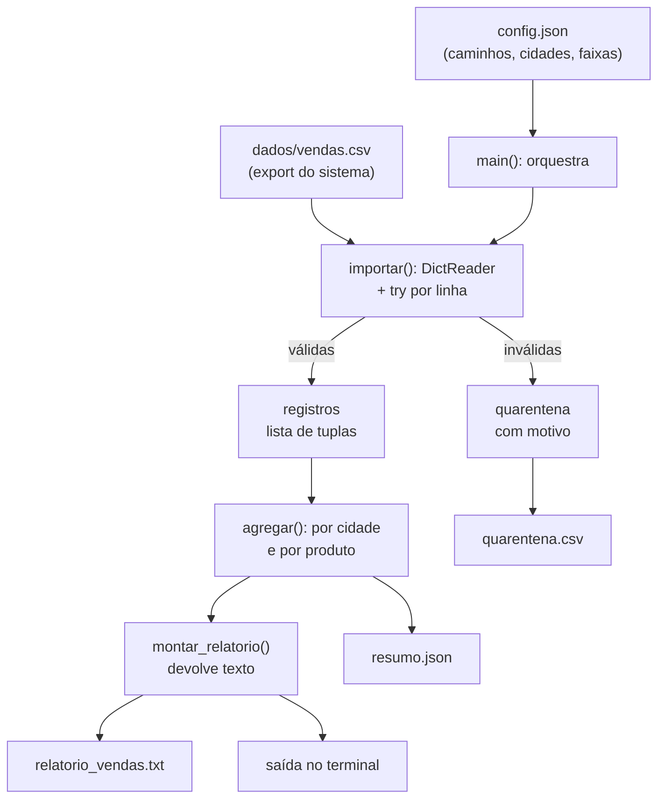

# 01.25 — PEP 8 + mini projeto do módulo

> **Módulo 01 — Python Fundamental** · Nível: N2 · Tempo estimado: 6h · Código: `codigo/cap25/`

## 1. Objetivo

- **Aplicar** o guia de estilo PEP 8: nomes, espaçamento, imports, comprimento de linha e docstrings.
- **Avaliar** o próprio código com autocrítica — nomes que contam a história, funções coesas, ausência de duplicação.
- **Construir** o **Relatório de Vendas Aurora v0**: a CLI completa que lê o CSV real, valida, agrega, formata e grava.
- **Integrar** todo o módulo num artefato que vai para o Atlas via commit — a primeira entrega da trilha.

Ao final, a promessa do primeiro dia estará cumprida: a gestora da Aurora tem seu relatório, e você tem a prova de que 70 horas viraram capacidade.

---

## 2. Pré-requisitos

- **Todos os capítulos do módulo 01.** Este é o capítulo de integração — não há conteúdo novo além do estilo.
- Em especial: [01.22](22-arquivos-texto-e-csv.md) (CSV), [01.21](21-excecoes.md) (quarentena), [01.20](20-modulos-e-imports.md) (módulos) e [01.15](15-dicionarios.md) (agregação).

**Autoteste:** (1) Seu `guia-de-depuracao.md` tem ≥ 10 fichas? (2) Sua biblioteca lê configuração de JSON? (3) Seu importador tem quarentena? Se as três forem "sim", o mini projeto é montagem — não construção do zero.

---

## 3. Motivação

Reveja a cena do primeiro dia: *"Ninguém sabe quanto vendemos por cidade. O sistema exporta um CSV, o estagiário monta a planilha à mão toda segunda, e cada versão dá um número diferente."*

Você tem, agora, cada peça necessária: ler o CSV com o módulo certo, validar linha a linha com quarentena, agregar por cidade com dicionários, formatar em reais brasileiros, gravar relatório e rejeitados, tratar arquivo ausente, configurar sem tocar no código. O que falta é **juntar** — e é isso que este capítulo faz.

Mas há uma segunda coisa faltando, e ela decide se o seu trabalho parece profissional ou amador: **estilo**. O código que funciona e o código que se lê são diferentes — e a diferença não é gosto pessoal. Python tem um guia oficial (a **PEP 8**) que a comunidade inteira segue: nomes em `snake_case`, quatro espaços de recuo, imports agrupados no topo, linhas que cabem na tela, espaços em volta de operadores. Um arquivo que segue PEP 8 é lido por qualquer programador Python do mundo sem atrito; um que não segue chama atenção pelo motivo errado.

Há também o argumento prático: a partir do módulo 12, uma ferramenta (`ruff`) vai verificar seu estilo automaticamente, e todo projeto profissional que você tocar terá essa verificação no CI (módulo 09). Aprender o padrão agora, escrevendo o próprio código, é infinitamente mais barato do que apanhar de um *linter* depois.

Este capítulo resolve isso assim: apresenta a PEP 8 pelo que ela resolve (não como lista de regras), dá o checklist de autocrítica que separa código funcional de código bom — e conduz a construção do Relatório de Vendas Aurora v0, requisito a requisito, com rubrica de avaliação.

---

## 4. Modelo mental

> 🧠 **Modelo mental**
> Estilo de código é **ortografia profissional**. Um texto com erros de ortografia pode ser compreendido — e ainda assim desqualifica quem o escreveu, porque obriga o leitor a gastar atenção com a forma em vez do conteúdo. PEP 8 é o acordo ortográfico do Python: seguir dá ao seu código o benefício de parecer **familiar** para qualquer leitor; desviar sem motivo custa atenção alheia. E a regra que resolve os casos de dúvida: *a legibilidade para quem vem depois vence qualquer preferência sua.*

**Exercício de previsão.** Os dois trechos abaixo fazem a mesma coisa. Sem consultar a PEP 8, decida: quais **cinco** diferenças de estilo o segundo corrige?

```python
# Versão A
def CalcularFrete( totalCentavos,cidade ):
    if cidade.strip().lower()=="campinas": return 0
    if totalCentavos>=29900: return 0
    return 1990
```

```python
# Versão B
def calcular_frete(total_centavos, cidade):
    """Devolve o frete em centavos conforme a política da Aurora."""
    if cidade.strip().lower() == "campinas":
        return 0
    if total_centavos >= 29_900:
        return 0
    return 1_990
```

*Resposta comentada:* (1) nome da função em `snake_case`, não PascalCase (que é para classes — módulo 04); (2) parâmetros em `snake_case`, não camelCase; (3) espaços após vírgulas e nenhum logo dentro dos parênteses; (4) espaços em volta dos operadores de comparação; (5) corpo do `if` na **linha seguinte**, indentado (nunca na mesma linha). Bônus: docstring e sublinhado em números grandes. Se você identificou três ou mais sem consultar, seu olho já foi treinado pelos 24 capítulos.

---

## 5. Analogia

Escrever código sem PEP 8 é como redigir um documento profissional **sem parágrafos, com fontes misturadas e margens irregulares**: o conteúdo pode estar correto, mas o leitor gasta energia decifrando a forma — e conclui, antes de avaliar o mérito, que quem escreveu não se importou.

E o mini projeto deste capítulo é a **entrega ao cliente**: até aqui você produziu peças (funções, módulos, scripts de exercício); agora produz algo que outra pessoa usa sem falar com você. Isso muda os critérios: além de funcionar, precisa ter mensagem de erro compreensível, documentação de uso e comportamento previsível quando o mundo não coopera.

**Onde a analogia quebra:** documentos são lidos uma vez; código é lido dezenas de vezes, por pessoas diferentes, ao longo de anos — inclusive por você, que terá esquecido tudo. O investimento em legibilidade tem retorno maior do que a analogia sugere.

---

## 6. Teoria

### PEP 8 — o que importa de verdade

**Nomes** (o que mais impacta a leitura):

| Elemento | Convenção | Exemplo |
|---|---|---|
| Variáveis e funções | `snake_case` | `total_centavos`, `calcular_frete` |
| Constantes | `MAIUSCULAS_COM_SUBLINHADO` | `FRETE_CHEIO`, `CIDADE_SEDE` |
| Classes | `PascalCase` (módulo 04) | `RelatorioVendas` |
| Módulos/arquivos | `snake_case.py` | `biblioteca_aurora.py` |
| "Privado" por convenção | `_prefixo` | `_cache_interno` |

E a regra da trilha (§18 da spec): identificadores em **português sem acentos**, descritivos — `calcular_frete`, não `calc_f` nem `calculateShipping`.

**Espaçamento:**

- 4 espaços por nível de indentação (nunca tabs — o VS Code já faz isso);
- espaços em volta de operadores binários (`a = b + c`, `x >= 10`) e após vírgulas;
- **sem** espaço logo dentro de parênteses/colchetes: `f(a, b)`, não `f( a, b )`;
- sem espaços em volta do `=` de argumentos nomeados: `f(nome="Ana")`;
- duas linhas em branco entre funções de nível superior; uma entre métodos (módulo 04).

**Linhas:** até 79 caracteres (a PEP 8 original) — a trilha adota **até 100**, o padrão prático de muitos times; o importante é a consistência e a legibilidade em tela dividida. Quebre linhas longas dentro de parênteses, alinhando os continuadores.

**Imports** (o que o 01.20 antecipou):

```python
import csv                      # 1. biblioteca padrão
import json
from pathlib import Path

import biblioteca_aurora        # 2. seus módulos (depois de uma linha em branco)
```

Um import por linha; nada de `import *`; ordem: padrão → terceiros → locais.

**Comentários e docstrings:** comentário explica o **porquê** (o "o quê" o código já diz); docstring de uma linha em toda função pública (o hábito do 01.18, que vira obrigação no módulo 05). Comentário desatualizado é pior que ausência — atualize-os junto com o código.

### O checklist de autocrítica

PEP 8 cuida da forma; a qualidade tem outros quatro critérios, que você aplica lendo o próprio código com olhos de revisor:

1. **Nomes contam a história?** Alguém entende a função pelo nome e pela assinatura, sem ler o corpo?
2. **Cada função faz uma coisa?** (01.18) — o nome tem "e"? Passa de 20 linhas? Precisa de comentários separando seções?
3. **Há duplicação?** Trechos parecidos em dois lugares são uma função esperando nascer.
4. **O caminho feliz está plano?** (01.09/01.18) — guardas cedo, aninhamento raso.

### Mini projeto: Relatório de Vendas Aurora v0

**O que é:** uma CLI que lê o export de vendas da Aurora (CSV), valida e converte cada linha, agrega por cidade e por produto, imprime o relatório formatado e grava três saídas (relatório em texto, rejeitados em CSV, resumo em JSON).

**Requisitos funcionais** (numerados para a rubrica):

1. **Entrada configurável**: caminho do CSV lido de `config.json` (com padrão sensato) e tratamento de arquivo ausente com mensagem clara.
2. **Validação com quarentena**: cada linha passa por limpeza, validação e conversão; as inválidas vão para a quarentena com número da linha, tipo e mensagem — sem derrubar a importação.
3. **Agregações**: total e quantidade por cidade (canônica); total e quantidade por produto; ticket médio geral; cidade campeã.
4. **Relatório formatado**: cabeçalho com data/hora e arquivo de origem, seções alinhadas, valores em reais brasileiros, funil de importação (lidas → válidas → rejeitadas) e **prova dos nove** (soma das cidades = total geral).
5. **Três saídas gravadas**: `relatorio_vendas.txt`, `quarentena.csv` e `resumo.json` (estrutura aninhada com as agregações).
6. **Organização**: biblioteca importada (zero duplicação), `main()` com `if __name__`, funções com docstring, PEP 8 aplicado.
7. **LEIA-ME**: como rodar, formato esperado do CSV, formato do `config.json`, e o que cada saída contém.

**Requisitos não funcionais:** nenhuma digitação ou dado ruim derruba o programa; nenhuma função acima de ~25 linhas; nomes em português sem acentos; zero `print` de depuração esquecido.

---

## 7. Funcionamento interno

Por dentro, na medida N2: PEP 8 não é verificada pelo interpretador — é convenção social, e é por isso que existem **linters** (ferramentas que a checam). A trilha usa `ruff` a partir do módulo 12, e ele funciona analisando a **árvore sintática** do seu código (a mesma estrutura que a Estação 1 do 01.02 monta) para encontrar desvios de estilo e problemas prováveis (variável não usada, import desnecessário, sombreamento de embutido — o erro do 01.03!). O VS Code, com a extensão Python, já faz parte disso ao vivo: os sublinhados ondulados que você vê são, em boa parte, análise estática. A lição transferível: forma e função são verificáveis por ferramenta, e times profissionais automatizam essa verificação (CI — módulo 09) exatamente para que revisões humanas discutam **arquitetura**, não vírgulas.

---

## 8. Visualização do fluxo

A arquitetura do Relatório Aurora v0 — o módulo inteiro em um desenho:



**Como ler:** o desenho é uma cadeia de **funções puras no miolo** (importar, agregar, montar) com **efeitos nas bordas** (ler arquivo, gravar arquivos, imprimir) — exatamente a arquitetura que o 01.19 defendeu. Repare que `montar_relatorio` **devolve texto**: por isso o mesmo texto vai para a tela e para o arquivo sem duplicação, e por isso ele será testável no módulo 12 (e devolvível por uma API no módulo 06). A separação que parecia teórica agora é a razão de o desenho funcionar.

---

## 9. Aplicação prática

O relatório completo, rodando. Rode:

```bash
python 01-Python/codigo/cap25/relatorio_aurora.py
```

```text
================================================================
RELATÓRIO DE VENDAS — AURORA COMÉRCIO
Origem: vendas.csv | Gerado em: 2026-07-31 14:22:05
================================================================

IMPORTAÇÃO
  Lidas: 13 | Válidas: 10 | Rejeitadas: 3

VENDAS POR CIDADE
  campinas    |  4 pedidos | R$   1.038,60
  santos      |  3 pedidos | R$     458,80
  sorocaba    |  1 pedido  | R$      98,90
  são paulo   |  2 pedidos | R$     508,90
  ----------------------------------------------
  TOTAL       | 10 pedidos | R$   2.105,20
  Prova dos nove: OK (soma das cidades = total geral)

VENDAS POR PRODUTO (top 5)
  Webcam HD            | 1 un | R$     478,90
  Fone Bluetooth XZ-9  | 1 un | R$     469,90
  Headset Gamer        | 1 un | R$     349,00
  Luminária LED        | 1 un | R$     239,00
  Hub USB-C            | 1 un | R$     159,90

INDICADORES
  Ticket médio: R$ 210,52
  Cidade campeã: campinas (R$ 1.038,60)

QUARENTENA (3 linhas)
  Linha  4 | VALOR_INVALIDO   | invalid literal for int() with base 10: 'abc'
  Linha  8 | CAMPOS_FALTANDO  | esperava 4 colunas, veio 3
  Linha 12 | CIDADE_VAZIA     | cidade obrigatória

Arquivos gerados:
  saida/relatorio_vendas.txt
  saida/quarentena.csv
  saida/resumo.json
================================================================
```

Três coisas para observar. **Uma**: o relatório inclui a **prova dos nove** — o hábito nascido no 01.04 sobreviveu ao módulo inteiro e agora é requisito de entrega. **Duas**: a quarentena aparece no relatório *e* num arquivo — porque quem lê o relatório precisa saber que 3 linhas ficaram de fora (silêncio seria mentira por omissão). **Três**: o `resumo.json` existe para consumo por **outros programas** — é a mesma informação em formato de máquina, antecipando o módulo 06, quando essa estrutura virará resposta de API.

E o teste que fecha o módulo: mude o `config.json` (por exemplo, o caminho do CSV ou a lista de cidades atendidas) e rode de novo — o comportamento muda sem uma linha de código alterada.

> 🎯 **Checkpoint rápido**
> De cabeça: por que `montar_relatorio` devolve texto em vez de imprimir — e quais **três** consumidores diferentes esse texto tem no projeto?

---

## 10. Código comentado

Arquivo principal em [`codigo/cap25/relatorio_aurora.py`](codigo/cap25/relatorio_aurora.py) (a biblioteca e os dados acompanham a pasta).

```python
# ------------------------------------------------------------
# relatorio_aurora.py
# Capítulo 01.25 — PEP 8 + mini projeto do módulo
# O que este arquivo demonstra: o Relatório de Vendas Aurora v0 —
#   importação com quarentena, agregações, relatório formatado e
#   três saídas gravadas (txt, csv, json)
# Como executar: python relatorio_aurora.py
# ------------------------------------------------------------

import csv
import json
from datetime import datetime
from pathlib import Path

PASTA = Path(__file__).parent
ARQUIVO_CONFIG = PASTA / "config.json"
PASTA_SAIDA = PASTA / "saida"

CONFIG_PADRAO = {
    "arquivo_vendas": "dados/vendas.csv",
    "separador": ";",
    "cidades_atendidas": ["campinas", "santos", "sao paulo", "sorocaba"],
    "top_produtos": 5,
}


def carregar_config(caminho):
    """Lê a configuração; devolve os padrões se o arquivo não existir."""
    try:
        with open(caminho, encoding="utf-8") as arquivo:
            return {**CONFIG_PADRAO, **json.load(arquivo)}
    except FileNotFoundError:
        return CONFIG_PADRAO


def formatar_reais(centavos):
    """Converte centavos (int) no formato monetário brasileiro."""
    texto = f"{centavos / 100:,.2f}"
    return texto.replace(",", "@").replace(".", ",").replace("@", ".")


def processar_linha(linha):
    """Valida e converte uma linha do CSV. Levanta ValueError se inválida."""
    if linha.get("cidade") is None or linha.get("valor_centavos") is None:
        presentes = len([valor for valor in linha.values() if valor is not None])
        raise ValueError(f"esperava 4 colunas, veio {presentes}")
    cidade = linha["cidade"].strip()
    if not cidade:
        raise ValueError("cidade obrigatória")
    valor = int(linha["valor_centavos"].strip())
    return (linha["codigo"].strip(), linha["produto"].strip(), valor, cidade)


def classificar_erro(mensagem):
    """Devolve o tipo de rejeição a partir da mensagem do erro."""
    if "colunas" in mensagem:
        return "CAMPOS_FALTANDO"
    if "cidade" in mensagem:
        return "CIDADE_VAZIA"
    return "VALOR_INVALIDO"


def importar(caminho, separador):
    """Lê o CSV e devolve (registros, quarentena, total_lido)."""
    registros = []
    quarentena = []
    total_lido = 0
    with open(caminho, encoding="utf-8", newline="") as arquivo:
        leitor = csv.DictReader(arquivo, delimiter=separador)
        for numero, linha in enumerate(leitor, start=2):
            total_lido += 1
            try:
                registros.append(processar_linha(linha))
            except ValueError as erro:
                mensagem = str(erro)
                quarentena.append((numero, classificar_erro(mensagem), mensagem))
    return registros, quarentena, total_lido


def agregar(registros):
    """Devolve as agregações por cidade e por produto (chave -> acumulador)."""
    por_cidade = {}
    contagem_cidade = {}
    por_produto = {}
    contagem_produto = {}
    for _codigo, produto, valor, cidade in registros:
        chave_cidade = cidade.strip().lower()
        por_cidade[chave_cidade] = por_cidade.get(chave_cidade, 0) + valor
        contagem_cidade[chave_cidade] = contagem_cidade.get(chave_cidade, 0) + 1
        por_produto[produto] = por_produto.get(produto, 0) + valor
        contagem_produto[produto] = contagem_produto.get(produto, 0) + 1
    return por_cidade, contagem_cidade, por_produto, contagem_produto


def cidade_campea(por_cidade):
    """Devolve (cidade, total) da cidade com maior faturamento."""
    campea = ""
    maior = 0
    for cidade, total in por_cidade.items():
        if total > maior:
            maior = total
            campea = cidade
    return campea, maior


def montar_relatorio(dados):
    """Devolve o texto completo do relatório (não imprime — 01.18)."""
    linhas = []
    linhas.append("=" * 64)
    linhas.append("RELATÓRIO DE VENDAS — AURORA COMÉRCIO")
    agora = datetime.now().strftime("%Y-%m-%d %H:%M:%S")
    linhas.append(f"Origem: {dados['origem']} | Gerado em: {agora}")
    linhas.append("=" * 64)

    linhas.append("\nIMPORTAÇÃO")
    linhas.append(f"  Lidas: {dados['lidas']} | Válidas: {dados['validas']} "
                  f"| Rejeitadas: {dados['rejeitadas']}")

    linhas.append("\nVENDAS POR CIDADE")
    for cidade in sorted(dados["por_cidade"]):
        total = dados["por_cidade"][cidade]
        quantidade = dados["contagem_cidade"][cidade]
        plural = "pedidos" if quantidade > 1 else "pedido "
        linhas.append(f"  {cidade:<11} | {quantidade:>2} {plural} "
                      f"| R$ {formatar_reais(total):>10}")
    linhas.append("  " + "-" * 46)
    linhas.append(f"  {'TOTAL':<11} | {dados['validas']:>2} pedidos "
                  f"| R$ {formatar_reais(dados['total_geral']):>10}")

    # Prova dos nove: hábito nascido no 01.04, agora requisito de entrega
    soma_cidades = sum(dados["por_cidade"].values())
    prova = "OK" if soma_cidades == dados["total_geral"] else "DIVERGÊNCIA"
    linhas.append(f"  Prova dos nove: {prova} (soma das cidades = total geral)")

    linhas.append(f"\nVENDAS POR PRODUTO (top {dados['top_produtos']})")
    # Ordenação por valor sem key= (que só chega em 04.02):
    # acumulador de máximo repetido sobre uma cópia do dicionário.
    restantes = dict(dados["por_produto"])
    mostrados = 0
    while restantes and mostrados < dados["top_produtos"]:
        melhor_produto = ""
        melhor_valor = 0
        for produto, total in restantes.items():
            if total > melhor_valor:
                melhor_valor = total
                melhor_produto = produto
        quantidade = dados["contagem_produto"][melhor_produto]
        linhas.append(f"  {melhor_produto:<20} | {quantidade} un "
                      f"| R$ {formatar_reais(melhor_valor):>10}")
        del restantes[melhor_produto]
        mostrados += 1

    linhas.append("\nINDICADORES")
    if dados["validas"] > 0:
        ticket = dados["total_geral"] // dados["validas"]
        linhas.append(f"  Ticket médio: R$ {formatar_reais(ticket)}")
    else:
        linhas.append("  Ticket médio: não aplicável (nenhuma venda válida)")
    campea, total_campea = cidade_campea(dados["por_cidade"])
    if campea:
        linhas.append(f"  Cidade campeã: {campea} (R$ {formatar_reais(total_campea)})")

    linhas.append(f"\nQUARENTENA ({dados['rejeitadas']} linhas)")
    for numero, tipo, mensagem in dados["quarentena"]:
        linhas.append(f"  Linha {numero:>2} | {tipo:<16} | {mensagem}")

    return "\n".join(linhas)


def gravar_saidas(texto, quarentena, resumo):
    """Grava relatório (txt), quarentena (csv) e resumo (json)."""
    PASTA_SAIDA.mkdir(exist_ok=True)

    with open(PASTA_SAIDA / "relatorio_vendas.txt", "w", encoding="utf-8") as arquivo:
        arquivo.write(texto + "\n")

    with open(PASTA_SAIDA / "quarentena.csv", "w", encoding="utf-8",
              newline="") as arquivo:
        escritor = csv.DictWriter(arquivo, fieldnames=["linha", "tipo", "mensagem"],
                                  delimiter=";")
        escritor.writeheader()
        for numero, tipo, mensagem in quarentena:
            escritor.writerow({"linha": numero, "tipo": tipo, "mensagem": mensagem})

    with open(PASTA_SAIDA / "resumo.json", "w", encoding="utf-8") as arquivo:
        json.dump(resumo, arquivo, ensure_ascii=False, indent=2)


def main():
    """Ponto de entrada: importa, agrega, monta o relatório e grava."""
    config = carregar_config(ARQUIVO_CONFIG)
    caminho_vendas = PASTA / config["arquivo_vendas"]

    try:
        registros, quarentena, lidas = importar(caminho_vendas, config["separador"])
    except FileNotFoundError:
        print(f"[X] Arquivo de vendas não encontrado: {caminho_vendas}")
        print("    Ajuste 'arquivo_vendas' no config.json ou salve o export na pasta.")
        return

    por_cidade, contagem_cidade, por_produto, contagem_produto = agregar(registros)
    total_geral = sum(por_cidade.values())

    dados = {
        "origem": caminho_vendas.name,
        "lidas": lidas,
        "validas": len(registros),
        "rejeitadas": len(quarentena),
        "por_cidade": por_cidade,
        "contagem_cidade": contagem_cidade,
        "por_produto": por_produto,
        "contagem_produto": contagem_produto,
        "total_geral": total_geral,
        "quarentena": quarentena,
        "top_produtos": config["top_produtos"],
    }

    texto = montar_relatorio(dados)
    print(texto)

    resumo = {
        "origem": caminho_vendas.name,
        "gerado_em": datetime.now().isoformat(timespec="seconds"),
        "funil": {"lidas": lidas, "validas": len(registros),
                  "rejeitadas": len(quarentena)},
        "total_geral_centavos": total_geral,
        "por_cidade": por_cidade,
        "por_produto": por_produto,
    }
    gravar_saidas(texto, quarentena, resumo)

    print("\nArquivos gerados:")
    print("  saida/relatorio_vendas.txt")
    print("  saida/quarentena.csv")
    print("  saida/resumo.json")
    print("=" * 64)


if __name__ == "__main__":
    main()
```

---

## 11. Erros comuns

### Erro 1 — Estilo inconsistente no mesmo arquivo

**Sintoma:** sem erro — mas o arquivo mistura `total_centavos` e `totalCentavos`, tem funções com e sem docstring, linhas de 40 e de 140 caracteres. Quem lê perde tempo se adaptando a cada trecho.
**Causa:** código escrito em sessões diferentes sem um padrão consciente (ou copiado de fontes com convenções distintas).
**Correção:** passe o arquivo inteiro uma vez aplicando o checklist da seção 6 — e, a partir do módulo 12, deixe o `ruff` fazer isso automaticamente. A consistência interna importa mais que a regra específica: um arquivo coerente se lê melhor que um arquivo "certo pela metade".

### Erro 2 — Função gigante no mini projeto

**Sintoma:** sem erro — uma `main()` de 120 linhas que lê, valida, agrega, formata, imprime e grava; impossível testar qualquer pedaço isoladamente, e cada mudança exige entender tudo.
**Causa:** a montagem foi feita "empilhando" código em vez de compondo funções.
**Correção:** cada verbo do requisito é uma função (`importar`, `agregar`, `montar_relatorio`, `gravar_saidas`); a `main()` só orquestra. O teste: você consegue explicar a `main()` lendo apenas os nomes das chamadas? Se sim, está certo.

### Erro 3 — Relatório que esconde as rejeições

**Sintoma:** sem erro — o relatório mostra os totais e **não menciona** que 3 linhas foram descartadas. Quem lê acredita que os números cobrem tudo.
**Causa:** tratar a quarentena como detalhe técnico em vez de informação de negócio.
**Correção:** o funil (lidas → válidas → rejeitadas) é **parte do relatório**, não anexo. Um número sem a informação do que ficou de fora é uma meia-verdade — e a lição vale para todo relatório que você produzirá na carreira.

> ⚠️ **Atenção**
> Este é o erro mais grave dos três, porque não é técnico: é de **integridade da informação**. Um relatório que omite exclusões leva alguém a tomar decisão com dados incompletos, acreditando que estão completos. Sempre mostre o funil.

---

## 12. Boas práticas

✅ **Aplique PEP 8 desde a primeira linha, não como faxina final** — escrever no padrão custa zero; converter depois custa uma revisão inteira.

✅ **Nomes em português sem acentos, descritivos, no padrão certo** — `snake_case` para funções e variáveis, `MAIUSCULAS` para constantes; o nome é a primeira documentação.

✅ **`montar_*` devolve texto; `exibir_*`/`gravar_*` produzem efeito** — a separação que torna o mesmo conteúdo reutilizável em três destinos.

✅ **Funil e prova dos nove em todo relatório** — os dois hábitos que transformam saída em informação confiável.

❌ **Evite `main()` que faz tudo** — orquestrar é chamar; se ela calcula, formata e grava, as funções não foram extraídas.

❌ **Evite entregar sem LEIA-ME** — quem recebe precisa saber rodar, e o formato de entrada precisa estar documentado; entrega sem documentação é rascunho.

---

## 13. Performance

Nesta escala, irrelevante — 13 linhas processam instantaneamente. As notas honestas que fecham o módulo: o programa carrega **todos** os registros na memória (lista) para agregar, o que é perfeito até dezenas de milhares de linhas e vira problema em milhões (a solução — agregar durante a leitura, sem acumular tudo — está a um passo de distância e é o padrão do módulo 10); a ordenação artesanal do top-5 (acumulador de máximo repetido) existe porque `key=` só chega no 04.02 — com ela, seria uma linha; e gravar três arquivos separadamente custa três aberturas, irrelevante aqui e otimizável se fossem milhares. O critério que vale: **primeiro correto e legível; medir antes de otimizar** — e você tem, no módulo 10, o cronômetro para medir.

---

## 14. Mercado

> 🏢 **Mercado**
> PEP 8 é pré-requisito silencioso: código fora do padrão chama atenção em revisão e sinaliza inexperiência antes de qualquer avaliação de mérito; e a verificação automática por linter em CI (módulo 09) é padrão da indústria — desviar do estilo passa a **quebrar o build**, não a gerar debate. Sobre o projeto em si: o Relatório Aurora v0 é, na estrutura, um **job de ETL** — extrai (CSV), transforma (valida, converte, agrega) e carrega (grava saídas) — exatamente o que o módulo 10 formaliza com ferramentas industriais. As três saídas também têm significado profissional: texto para humanos, CSV para planilha, JSON para máquinas — a mesma informação em três contratos. E o funil com quarentena é o que separa um script de um **processo auditável**: quando a diretoria perguntar "esse número inclui tudo?", a resposta estará no relatório.
>
> **Mini-cenário:** a gestora recebe o relatório na segunda de manhã, sem estagiário e sem planilha. A primeira pergunta dela será: "dá para rodar automático todo dia?" — e a resposta é o módulo 09 (agendamento). A segunda: "dá para ver numa tela, filtrando por período?" — módulo 06 (API). A terceira, quando o volume crescer: "por que está demorando?" — módulo 10. Sua entrega de hoje é o começo de uma conversa que dura o resto da trilha.

---

## 15. Entrevistas

**P1. "O que é PEP 8 e por que ela importa?"**
*Resposta esperada:* o guia de estilo oficial do Python (nomes, espaçamento, imports, comprimento de linha, docstrings); importa porque padroniza a leitura entre pessoas e projetos, reduz atrito em revisão e é verificada automaticamente por linters em pipelines de CI. Complemento maduro: consistência interna vale mais que aderência cega; desvios justificados existem, mas são exceção documentada.

**P2. "Como você organizaria um script que lê CSV, processa e gera relatório?"**
*Resposta esperada:* funções por responsabilidade (ler/importar, validar, agregar, montar saída, gravar), miolo puro e efeitos nas bordas, `main()` só orquestrando, `if __name__ == "__main__"`, configuração externa, tratamento de erro por linha com quarentena, e saída em formatos distintos conforme o consumidor. É a descrição do projeto deste capítulo — e é o que se espera de um júnior sólido.

**P3. "Como você garante que o relatório está correto?"**
*Resposta esperada:* verificações internas (prova dos nove: soma das partes = total), funil explícito (lidas = válidas + rejeitadas), casos de borda testados (arquivo vazio, todas as linhas inválidas, uma cidade só) e, no futuro, testes automatizados (módulo 12). Citar a prova dos nove como hábito, não como exceção, impressiona.

**Pegadinha clássica: "Seu relatório mostra R$ 2,1 milhões em vendas. Como você sabe que esse número está certo?"**
Ela testa maturidade, não sintaxe. A saída fraca é "porque o código está certo". A resposta forte tem camadas: (1) **conferência interna** — a soma das cidades bate com o total (prova dos nove no próprio relatório); (2) **transparência do funil** — o relatório declara quantas linhas entraram, quantas foram válidas e quantas foram rejeitadas, com motivo, então o número tem escopo conhecido; (3) **comparação externa** — bater com uma fonte independente (o total do sistema de origem, um mês anterior, uma amostra manual); (4) **reprodutibilidade** — mesma entrada, mesma saída, com data e origem registradas no cabeçalho. Fechar com a honestidade que vale a vaga: "o número está certo **para os dados que entraram**; a qualidade da entrada é uma responsabilidade separada, e é por isso que a quarentena aparece no relatório".

---

## 16. Exercícios guiados

Enunciados completos em [`exercicios/cap25.md`](exercicios/cap25.md); gabaritos em [`exercicios/gabaritos/cap25.md`](exercicios/gabaritos/cap25.md).

### Aquecimento

- **A1** `[~10 min · caça ao desvio]` — 8 linhas de código: aponte o desvio de PEP 8 em cada uma.
- **A2** `[~10 min · nomes]` — 8 nomes: classifique (bom / errado de convenção / pouco descritivo) e corrija.
- **A3** `[~5 min · imports]` — Reorganize um bloco de 6 imports bagunçados.
- **A4** `[~10 min · autocrítica]` — 4 funções: aplique o checklist dos 4 critérios e dê o veredito.

### Aplicação

- **AP1** `[~25 min · faxina de estilo]` — Passe **três** arquivos seus do módulo pelo checklist PEP 8 e registre as correções.
- **AP2** `[~30 min · montagem por partes]` — Construa `importar` + `agregar` do mini projeto e teste-as isoladamente com dados montados à mão.
- **AP3** `[~25 min · o relatório em texto]` — Escreva `montar_relatorio(dados)` devolvendo texto; teste chamando com um dicionário fixo (sem ler arquivo).

---

## 17. Desafios

- **D1** `[~50 min · o teste de estresse]` — **Quatro cenários hostis.** Depois do mini projeto pronto, submeta-o a: (a) CSV **vazio** (só cabeçalho); (b) CSV em que **todas** as linhas são inválidas; (c) CSV com **uma** cidade só; (d) `config.json` apontando para arquivo inexistente. Para cada cenário, registre: o que aconteceu, o que **deveria** acontecer, e a correção aplicada. Nenhum cenário pode produzir traceback, divisão por zero ou relatório enganoso (ex.: "ticket médio" quando não há vendas). Fecho: 5 linhas sobre por que testar as bordas é mais valioso que testar o caminho feliz.

<details><summary>💡 Dica 1 (conceito)</summary>
Os cenários (a) e (b) levam ao mesmo lugar perigoso: zero registros válidos → divisão por zero no ticket médio (o escudo do 01.08).
</details>
<details><summary>💡 Dica 2 (estratégia)</summary>
Crie os CSVs de teste numa pasta `dados/testes/` e aponte o config para cada um — sem alterar código entre os cenários.
</details>
<details><summary>💡 Dica 3 (esqueleto)</summary>
4 arquivos de teste + 4 execuções + tabela de resultados (cenário | aconteceu | deveria | correção) + reflexão.
</details>

---

## 18. Mini projeto

**Relatório de Vendas Aurora v0 — a entrega do módulo** `[~6h]` — os 7 requisitos da seção 6, construídos por você.

**Rubrica de avaliação** (escala 0–4 por critério; aprovação: soma ≥ 15/20, nenhum critério < 2):

| Critério | O que observa | Nota 4 |
|---|---|---|
| **Funcionalidade** | Os 7 requisitos numerados atendidos | Todos, incluindo as 3 saídas e o config |
| **Robustez** | Bordas: arquivo ausente, CSV vazio, todas inválidas, campos sujos | Nenhum cenário produz traceback; mensagens úteis |
| **Qualidade do código** | PEP 8, nomes, funções coesas, zero duplicação | Passaria em revisão sem comentários de estilo |
| **Organização** | Biblioteca importada, `main()`, estrutura de pastas | Módulo + programa + dados + saída separados |
| **Documentação** | LEIA-ME com uso, formato de entrada e saídas | Outra pessoa roda sem perguntar nada |

**Autoavaliação honesta** (§22.3 da spec): avalie **um dia depois** de terminar — distância melhora o julgamento. Perguntas-espelho por critério: *Robustez*: o que acontece se o CSV tiver 0 linhas? Você testou? *Qualidade*: alguma função passa de 25 linhas? Algum trecho aparece duas vezes? *Documentação*: você conseguiria rodar seguindo **apenas** o seu LEIA-ME, sem lembrar nada?

**Entrega no Atlas:** copie o projeto final para `13-Projetos/atlas/` (a pasta fundada no 00.05) e registre no `PROGRESSO.md` que a **entrega do módulo 01 está concluída**. No módulo 02, o primeiro `git commit` consciente da sua vida vai versionar exatamente este código — e o histórico do Atlas começa aqui.

---

## 19. Revisão

**Resumo do capítulo:**

- PEP 8 é a ortografia profissional do Python: `snake_case` para funções/variáveis, `MAIUSCULAS` para constantes, 4 espaços, espaços em volta de operadores, imports agrupados no topo, linhas curtas, docstrings.
- Consistência interna vale mais que aderência cega; linters (`ruff`, módulo 12) automatizam a verificação e liberam a revisão humana para arquitetura.
- Checklist de autocrítica: nomes contam a história? uma responsabilidade por função? há duplicação? o caminho feliz está plano?
- O mini projeto integra o módulo: config externa → importação com quarentena → agregações → relatório em texto → três saídas (txt/csv/json).
- Arquitetura: miolo puro (importar, agregar, montar) + efeitos nas bordas (ler, gravar, imprimir) — o mesmo texto serve tela e arquivo.
- Integridade da informação: **funil** (lidas → válidas → rejeitadas) e **prova dos nove** são parte do relatório, não anexos técnicos.

**Flashcards novos** (adicionados a [`revisao/flashcards.md`](revisao/flashcards.md)):

| ID | Frente | Verso |
|---|---|---|
| 01.25-F1 | Cite 5 regras de PEP 8 que mais impactam a leitura. | snake_case (funções/variáveis) e MAIUSCULAS (constantes); 4 espaços de indentação; espaços em volta de operadores e após vírgulas; imports agrupados no topo (padrão → terceiros → locais); linhas curtas + docstrings. |
| 01.25-F2 | Explique com suas palavras: por que `montar_relatorio` devolve texto em vez de imprimir? | (Elaboração) Um texto serve a três consumidores (tela, arquivo, e futuramente API) sem duplicação — e vira testável (módulo 12). Quem calcula/monta não imprime (01.18). |
| 01.25-F3 | Quais são os 4 critérios do checklist de autocrítica? | Nomes contam a história? · Uma responsabilidade por função? · Há duplicação? · O caminho feliz está plano (guardas cedo)? |
| 01.25-F4 | Por que o funil (lidas → válidas → rejeitadas) é parte do relatório? | (Decisão) Um total sem o escopo do que ficou de fora é meia-verdade: quem lê precisa saber que 3 linhas foram excluídas e por quê. Integridade da informação, não detalhe técnico. |
| 01.25-F5 | "Como você sabe que o número do relatório está certo?" — as 4 camadas da resposta. | Conferência interna (prova dos nove) · funil explícito (escopo conhecido) · comparação com fonte externa · reprodutibilidade (mesma entrada, mesma saída, com origem e data registradas). |

**Agendamento:** registre no `PROGRESSO.md` e marque D+1, D+7, D+30, D+90 na [`Revisoes/agenda.md`](../Revisoes/agenda.md).

---

## 20. Checklist

Perguntas de domínio — teste do sim:

- [ ] Sei aplicar *PEP 8 (nomes, espaçamento, imports, linhas) sem consultar*?
- [ ] Sei avaliar *o próprio código pelos 4 critérios de autocrítica*?
- [ ] Sei montar *um programa completo com miolo puro e efeitos nas bordas*?
- [ ] Sei explicar *por que funil e prova dos nove são requisitos de integridade*?
- [ ] Sei responder *"como você sabe que esse número está certo?" nas 4 camadas*?

Itens práticos:

- [ ] Rodei `relatorio_aurora.py` e mudei o `config.json` para provar a configuração externa.
- [ ] Fiz a faxina de estilo em 3 arquivos meus (AP1).
- [ ] Executei os 4 cenários hostis do desafio, sem traceback em nenhum.
- [ ] **Completei o Relatório de Vendas Aurora v0** (7 requisitos) e me autoavaliei pela rubrica, um dia depois.
- [ ] Copiei a entrega para `13-Projetos/atlas/` e registrei a conclusão no `PROGRESSO.md`.

---

## 21. Próximo capítulo

O módulo 01 termina aqui — e com ele a Fase 1 ganha seu primeiro artefato real. Antes de seguir, feche o ciclo do módulo: faça o pacote de revisão em [`revisao/`](revisao/resumo.md) (resumo, mapa mental e questões) e depois o **simulado CP2** em [`Simulados/modulo-01.md`](../Simulados/modulo-01.md) — 10 objetivas + 3 discursivas + 1 prático de 45 minutos. Aprovado (≥ 8/10 e prático ≥ 3)? O módulo 02 te espera com a dor seguinte da Aurora: *"perdemos uma versão do script ontem"*. Você vai aprender terminal e Git — e o primeiro commit consciente da sua vida vai versionar exatamente o relatório que você acabou de entregar.

→ [Módulo 02 — Git e Linux](../02-Git-Linux/00-visao-do-modulo.md)

---

*Gerado sob spec 3.0.0*
