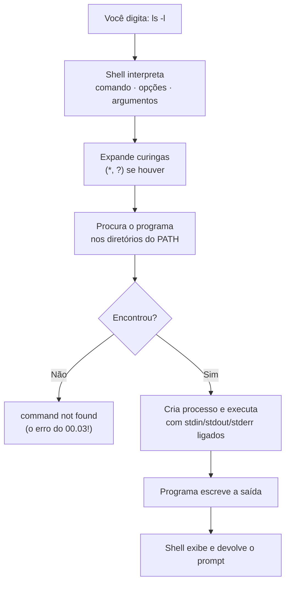

# 02.01 — Terminal: por que a linha de comando

> **Módulo 02 — Git e Linux** · Nível: N1 · Tempo estimado: 2h · Código: `codigo/cap01/`

## 1. Objetivo

- **Explicar** a diferença entre terminal, shell e interface gráfica — e o que cada um oferece.
- **Justificar** por que servidores, containers e automações vivem sem interface gráfica.
- **Executar** os primeiros comandos com confiança, lendo a saída como informação.
- **Identificar** o shell em uso no seu sistema e as implicações práticas disso.

Ao final, o terminal deixa de ser "aquela tela preta assustadora" e passa a ser o lugar onde você **conversa com o computador** — e onde vai passar boa parte da carreira.

---

## 2. Pré-requisitos

- [Módulo 01 completo](../01-Python/00-visao-do-modulo.md), com CP2 aprovado — você vai versionar o código que escreveu lá.
- [00.03 — Preparando o ambiente](../00-Introducao/03-preparando-o-ambiente.md) — o terminal integrado do VS Code e, no Windows, o Git Bash.

**Autoteste:** (1) Como você abre o terminal integrado no VS Code? (2) O que `python --version` respondeu na sua máquina? (3) O que o PATH tem a ver com o terminal encontrar programas? Se a 3 ficou vaga, o 02.06 a resolve por completo — por ora, é suficiente lembrar que existe.

---

## 3. Motivação

Você já usa o terminal desde o módulo 00 — para rodar `python arquivo.py`. Mas o usa como quem aperta um botão: sempre o mesmo comando, sem olhar em volta. Este módulo transforma esse botão numa **oficina**.

A pergunta legítima de quem vem da interface gráfica é: *por que digitar comandos se existe um gerenciador de arquivos com ícones?* Três respostas, em ordem crescente de importância.

**Primeira: onde você vai trabalhar não tem tela.** O servidor que hospedará o Atlas (módulo 09) responde por SSH — só texto. O container que empacota a aplicação (módulo 08) não tem ambiente gráfico. O agendador que roda o ETL às 3h da manhã (módulo 10) executa comandos. Quem só sabe clicar não consegue operar nada disso.

**Segunda: o terminal é automatizável.** Renomear 400 arquivos com o mouse é uma tarde perdida; com um comando, é uma linha. E a linha pode virar script, que vira tarefa agendada, que roda sozinha para sempre. Interface gráfica não se automatiza — comandos, sim.

**Terceira, e a mais subestimada: comandos são comunicáveis.** Quando você pede ajuda com um erro, o colega manda **o comando** que resolve — e você cola e roda. Documentação de projeto, tutoriais, respostas de fórum, este manual: tudo troca comandos. "Clique no menu Arquivo, depois em Preferências, depois..." não se copia, não se versiona e envelhece a cada atualização de interface.

Este capítulo resolve isso assim: separa os conceitos que costumam se confundir (terminal, shell, prompt), mostra a filosofia por trás do funcionamento (ferramentas pequenas que se combinam), e coloca você executando os primeiros comandos com o repertório mínimo para se orientar — sem decorar nada.

---

## 4. Modelo mental

> 🧠 **Modelo mental**
> O terminal é a **janela**; o shell é o **atendente** do outro lado. Você digita um pedido, o atendente (shell) interpreta, encontra o programa certo, manda executar e traz a resposta de volta para a janela. Cada comando é uma frase com estrutura fixa: **verbo** (o programa), **advérbios** (as opções, com `-`) e **objeto** (o alvo). `ls -l pasta` = "liste, em formato longo, a pasta".

**Exercício de previsão.** Sem rodar, decida o que cada comando faz — usando só a estrutura verbo/opções/objeto:

```bash
ls -a
mkdir relatorios
cd relatorios
pwd
```

*Resposta comentada:* `ls -a` lista os arquivos **incluindo os ocultos** (o `-a` é de *all*); `mkdir relatorios` cria a pasta com esse nome; `cd relatorios` entra nela; `pwd` mostra onde você está agora (*print working directory*). Repare que você **inferiu** o comportamento sem decorar — porque a estrutura da frase é sempre a mesma. Guarde o método: diante de um comando desconhecido, identifique o verbo primeiro; opções e alvo se leem em seguida.

---

## 5. Analogia

Interface gráfica é o **cardápio ilustrado com fotos**: você aponta para o que quer, e não precisa saber o nome do prato. É excelente para quem chega, e limitado — só existe o que está no cardápio, e pedir uma variação exige garçom.

O terminal é **falar a língua da cozinha**. Exige aprender vocabulário, e em troca você pede exatamente o que quer, combina ingredientes de formas que o cardápio não previu, e — o mais importante — pode **escrever a receita** para que outra pessoa (ou uma máquina, às 3h da manhã) a execute igualzinho.

**Onde a analogia quebra:** cardápios e cozinhas coexistem pacificamente; no trabalho profissional, há tarefas que **só** existem na cozinha — não há botão para "reiniciar o serviço no servidor de produção". E a curva de aprendizado é diferente: o cardápio nunca exige treino; a língua da cozinha custa duas semanas e depois é mais rápida que apontar.

---

## 6. Teoria

### Terminal, shell, prompt: três coisas diferentes

| Palavra | O que é | Exemplos |
|---|---|---|
| **Terminal** (*terminal emulator*) | O programa com a janela onde você digita | Terminal do VS Code, Windows Terminal, iTerm |
| **Shell** | O interpretador que lê seus comandos e os executa | bash, zsh, PowerShell |
| **Prompt** | O texto que o shell exibe indicando que está pronto | `usuario@maquina:~/atlas$` |

A confusão é natural — e a distinção importa: você pode trocar de terminal mantendo o shell, ou rodar outro shell dentro do mesmo terminal. Na trilha, o **terminal** é o integrado do VS Code e o **shell** de referência é o **bash** (no Windows, via Git Bash — decisão D-009).

O prompt costuma dizer bastante: usuário, máquina, pasta atual e um símbolo final (`$` para usuário comum, `#` para administrador — um sinal de alerta útil).

### A anatomia de um comando

```bash
ls -l -a /caminho/da/pasta
│  │     │
│  │     └── argumentos: o alvo
│  └── opções (flags): modificam o comportamento
└── comando: o programa a executar
```

Opções curtas usam um traço e podem se agrupar (`-la` = `-l -a`); opções longas usam dois (`--all`). Argumentos com espaço precisam de aspas (`cd "Meus Documentos"`). E quase todo comando aceita `--help`:

```bash
ls --help        # a documentação rápida, no próprio terminal
man ls           # o manual completo (Linux/macOS; saia com 'q')
```

### O repertório mínimo para se orientar

Cinco comandos que respondem "onde estou e o que tem aqui":

| Comando | O que faz |
|---|---|
| `pwd` | mostra a pasta atual (*print working directory*) |
| `ls` | lista o conteúdo (`-l` detalhado, `-a` inclui ocultos, `-h` tamanhos legíveis) |
| `cd` | muda de pasta (`cd ..` sobe, `cd ~` vai para a pasta pessoal, `cd -` volta à anterior) |
| `clear` | limpa a tela (ou `Ctrl+L`) |
| `history` | lista os comandos que você já digitou |

O 02.02 aprofunda navegação e manipulação; aqui o objetivo é só não se sentir perdido.

### Os atalhos que mudam a experiência

Estes quatro separam quem sofre de quem flui:

- **Seta ↑/↓** — navega no histórico (você já usa desde o 01.02).
- **Tab** — **autocompleta** nomes de arquivos, pastas e comandos. Digite as primeiras letras e aperte Tab; se houver ambiguidade, aperte duas vezes para ver as opções. É o atalho mais importante do terminal: elimina erros de digitação e economiza tempo real.
- **Ctrl+C** — interrompe o comando em execução (o exorcismo do loop infinito, 01.10).
- **Ctrl+L** — limpa a tela sem apagar o histórico.

### A filosofia Unix — por que os comandos são pequenos

Os comandos parecem primitivos de propósito: `ls` só lista, `wc` só conta, `grep` só busca. A filosofia por trás disso, formulada nos anos 1970, é **"faça uma coisa e faça bem"** — e a potência vem de **combiná-los** (o assunto do 02.04, com o operador `|`).

É a mesma ideia da responsabilidade única que você aplicou às funções no 01.18 — em escala de sistema operacional. Reconhecer essa continuidade ajuda: você já sabe pensar assim.

### O aviso que vale desde já

Comandos de terminal **não têm desfazer**. `rm arquivo` não manda para a lixeira: apaga. Não há caixa de diálogo "tem certeza?" por padrão. Essa é a contrapartida do poder, e o 02.02 dedica uma seção inteira ao assunto. Por ora, a regra de sobrevivência: **leia o comando antes de apertar Enter** — especialmente se você o copiou da internet.

---

## 7. Funcionamento interno

Por dentro, na medida N1: quando você digita `ls -l` e aperta Enter, o shell (1) **interpreta** a linha, separando comando, opções e argumentos (e expandindo curingas como `*`, se houver); (2) **procura** o programa `ls` percorrendo os diretórios do PATH — exatamente o mecanismo do 00.03, agora do lado de quem usa; (3) **cria um processo** para executá-lo, passando os argumentos; (4) conecta os canais de entrada e saída desse processo ao seu terminal (o stdin/stdout/stderr do 01.07); e (5) **espera** o programa terminar, exibindo o resultado e devolvendo o prompt. Cada comando é, portanto, um **programa de verdade** rodando — não uma função interna do shell (com poucas exceções, como `cd`, que precisa alterar o estado do próprio shell). É por isso que você pode escrever seus próprios comandos: um script Python com permissão de execução é tão "comando" quanto o `ls` (02.05 e 02.07 fecham esse ciclo).

---

## 8. Visualização do fluxo

O caminho de um comando, do Enter à resposta:



**Como ler:** o losango é o reencontro com o 00.03 — `command not found` significa "não achei no PATH", não "não existe". Repare que o shell faz um trabalho **antes** de executar (interpretar e expandir): é por isso que `ls *.py` funciona mesmo que o `ls` não saiba nada sobre `*` — quem expandiu foi o shell, e o `ls` recebeu a lista pronta de nomes. Essa divisão de trabalho explica muita coisa nos capítulos seguintes.

---

## 9. Aplicação prática

Primeiro contato com a oficina. Abra o terminal integrado (`Ctrl+'`) e execute a sequência, **lendo cada saída** antes do próximo comando:

```bash
pwd
```

```text
/home/voce/Manual-Mestre
```

Você está na raiz do repositório. Agora veja o que há aqui:

```bash
ls
```

```text
00-Introducao  02-Git-Linux  04-Python-Avancado  ...  README.md  manualMestre_v3.0.md
```

E com detalhes (o formato que você usará sempre):

```bash
ls -lh
```

```text
total 132K
drwxr-xr-x 6 voce voce 4,0K jul 30 11:31 00-Introducao
drwxr-xr-x 6 voce voce 4,0K jul 31 09:12 01-Python
-rw-r--r-- 1 voce voce 1,2K jul 31 14:02 README.md
```

Cada coluna diz algo — permissões, dono, tamanho, data (o 02.05 destrincha a primeira). Por ora, note o `d` inicial: **d**iretório. Arquivos comuns começam com `-`.

Agora o experimento que vale o capítulo — **o Tab**. Digite apenas `cd 01-` e aperte **Tab**: o shell completa para `01-Python/`. Entre, liste, e volte:

```bash
cd 01-Python
ls
cd ..
pwd
```

Repita o gesto do Tab meia dúzia de vezes com nomes diferentes até ele virar reflexo. É o hábito com maior retorno deste módulo.

Por fim, a exploração dirigida — quatro comandos que respondem perguntas reais sobre o seu próprio trabalho:

```bash
ls 01-Python/codigo/cap25          # o que entreguei no mini projeto?
ls -a                              # o que está oculto na raiz? (surpresa: .git)
history | tail -5                  # meus últimos 5 comandos
clear                              # limpar a tela
```

O `ls -a` revela algo importante: a pasta **`.git`** — o cartório fundado no 00.05, que estava lá o tempo todo, invisível. Arquivos e pastas iniciados por ponto são **ocultos por convenção** no Unix, e é onde ferramentas guardam configuração (`.gitignore`, `.vscode`, `.env` — este último no 06.12).

> 💡 **Dica**
> Errou o comando? Aperte ↑ e edite em vez de digitar de novo. E se a tela virar um caos (você abriu um arquivo binário com `cat`, por exemplo), digite `reset` e Enter — ele reconstrói o terminal.

---

## 10. Código comentado

Este capítulo não produz um programa, e sim um **caderno de comandos** — o formato que o módulo usará: um arquivo `.sh` com comandos comentados, para você executar linha a linha (copiando ou com `bash arquivo.sh` quando fizer sentido).

Arquivo completo em [`codigo/cap01/primeiros_comandos.sh`](codigo/cap01/primeiros_comandos.sh).

```bash
#!/usr/bin/env bash
# ------------------------------------------------------------
# primeiros_comandos.sh
# Capítulo 02.01 — Terminal: por que a linha de comando
# O que este arquivo demonstra: o repertório mínimo de orientação
#   no terminal, com a saída esperada comentada
# Como executar: bash primeiros_comandos.sh
#   (ou copie cada linha para o terminal, uma a uma — recomendado)
# ------------------------------------------------------------

# 1. ONDE ESTOU? (print working directory)
pwd
# Saída: o caminho completo da pasta atual

# 2. O QUE TEM AQUI? (list)
ls
# Saída: nomes de arquivos e pastas, em colunas

# 3. COM DETALHES: -l (longo), -h (tamanhos legíveis), -a (ocultos)
ls -lha
# Saída: uma linha por item — permissões, dono, tamanho, data, nome
# O 'd' inicial marca diretórios; nomes com ponto são ocultos (.git!)

# 4. QUEM SOU EU E ONDE ESTOU RODANDO?
whoami
# Saída: seu nome de usuário no sistema

echo "Shell em uso: $SHELL"
# Saída: o caminho do shell (ex.: /bin/bash) — a variável do 02.06

# 5. QUE DIA É HOJE? (útil em scripts de automação — 02.07)
date
# Saída: data e hora do sistema

# 6. O MANUAL ESTÁ NO PRÓPRIO TERMINAL
# ls --help | head -5    # descomente para ver as primeiras linhas da ajuda
# man ls                 # manual completo (Linux/macOS) — saia com 'q'

# 7. HISTÓRICO: o que já digitei?
history | tail -5
# Saída: os 5 comandos mais recentes (o | e o tail chegam no 02.03/02.04)

echo "--- Caderno concluído. Agora repita cada comando à mão, usando Tab. ---"
```

---

## 11. Erros comuns

### Erro 1 — `command not found`

**Sintoma:**

```text
bash: git: command not found
```

**Causa:** o shell procurou o programa nos diretórios do PATH e não encontrou — o programa não está instalado **ou** não está no PATH (o reencontro com o 00.03).
**Correção:** confirme a instalação (`git --version`); se instalou agora, **feche e reabra o terminal** (ele lê o PATH ao abrir); no Windows, verifique se está no Git Bash e não no PowerShell, onde alguns comandos Unix não existem. Diagnóstico útil: `which git` (Unix) mostra **onde** o programa foi encontrado — silêncio significa "não está no PATH".

### Erro 2 — `No such file or directory` (o caminho relativo)

**Sintoma:**

```text
cd: 01-Python: No such file or directory
```

— com a pasta existindo.
**Causa:** caminhos relativos partem da **pasta atual**; você não está onde pensa que está.
**Correção:** `pwd` primeiro, sempre — é o comando de orientação. Depois `ls` para confirmar o que existe ali, e então navegue. E use **Tab**: se o nome não completa, ele não existe naquele lugar (o Tab é também um verificador de existência).

### Erro 3 — Espaços em nomes sem aspas

**Sintoma:**

```text
$ cd Meus Documentos
bash: cd: too many arguments
```

**Causa:** o shell separa argumentos por espaço — `Meus` e `Documentos` viraram dois argumentos.
**Correção:** aspas (`cd "Meus Documentos"`) ou escape (`cd Meus\ Documentos`); o Tab também resolve, porque ele escapa automaticamente. E a lição preventiva que a trilha já aplica (§7 da spec): **não use espaços em nomes de arquivos e pastas de projeto** — use hífen ou sublinhado.

> ⚠️ **Atenção**
> Nunca cole no terminal um comando que você não entende — especialmente com `sudo`, `rm` ou `curl ... | bash`. Comandos copiados de fóruns já apagaram sistemas inteiros. A regra do módulo: identifique o **verbo** antes de apertar Enter; se não souber o que ele faz, `--help` primeiro.

---

## 12. Boas práticas

✅ **Tab para tudo — nomes, caminhos, comandos** — elimina erros de digitação e confirma existência de graça; é o hábito de maior retorno do módulo.

✅ **`pwd` antes de operações que dependem do lugar** — dois segundos que evitam criar arquivo na pasta errada (ou apagar da errada).

✅ **Leia o comando antes do Enter, sobretudo se foi copiado** — identifique o verbo, confira o alvo.

✅ **`--help` como primeiro recurso** — a documentação mora no próprio terminal e é mais rápida que buscar na internet.

❌ **Evite decorar comandos que você usa uma vez por mês** — anote-os num arquivo pessoal (você criará um cheatsheet no fechamento do módulo); memória é para o que se usa todo dia.

❌ **Evite trabalhar como administrador (`sudo`, prompt `#`) por hábito** — o poder desnecessário só aumenta o dano de um engano; o 02.05 mostra quando ele é legítimo.

---

## 13. Performance

Nesta escala, irrelevante — e com uma inversão interessante: o terminal é **mais rápido que a interface gráfica** para quase tudo que envolve muitos arquivos, porque não precisa desenhar nada. Copiar mil arquivos com o mouse exige que o sistema renderize ícones, animações e barras de progresso; com `cp`, o trabalho é só o essencial. A diferença fica evidente no módulo 09, quando você operar servidores remotos: transferir a saída de um comando por SSH custa bytes; transmitir uma tela gráfica custa megabytes por segundo — e é por isso que servidores sequer instalam ambiente gráfico. Por ora, a nota que orienta: se uma tarefa envolve **muitos** itens ou **repetição**, o terminal quase sempre vence — em tempo seu, não da máquina.

---

## 14. Mercado

> 🏢 **Mercado**
> Fluência em terminal é pré-requisito silencioso de qualquer vaga de backend, dados ou infraestrutura — não aparece como requisito porque é assumido, do mesmo jeito que "saber usar e-mail". Onde isso se materializa: acessar servidores por SSH (módulo 09), operar containers (módulo 08), rodar migrações de banco (05.10), inspecionar logs em produção, executar pipelines. Em entrevistas práticas, é comum pedir que o candidato compartilhe a tela e faça algo simples no terminal — e a hesitação denuncia mais do que qualquer resposta teórica. A boa notícia: o repertório que resolve 90% do dia a dia cabe em uma página (a cheatsheet que você produzirá no fechamento deste módulo), e a fluência vem de semanas de uso, não de meses de estudo.
>
> **Mini-cenário:** o servidor da Aurora (módulo 09) vai responder por SSH — sem tela, sem ícones. Quando o Atlas estiver no ar e alguém disser "o relatório de segunda não gerou", você vai entrar por SSH, olhar o log com `tail`, encontrar a linha do erro com `grep` e reexecutar o script. Os quatro comandos dessa frase são deste módulo.

---

## 15. Entrevistas

**P1. "Qual a diferença entre terminal e shell?"**
*Resposta esperada:* terminal é o programa que fornece a janela e a interação (emulador de terminal); shell é o interpretador que lê os comandos e os executa (bash, zsh, PowerShell). Você pode trocar um sem trocar o outro. Citar que `bash` é o mais comum em servidores Linux e que o Windows usa PowerShell (com Git Bash/WSL como alternativas Unix) mostra vivência prática.

**P2. "Por que profissionais preferem o terminal à interface gráfica?"**
*Resposta esperada:* três razões: ambientes remotos e containers não têm interface; comandos são automatizáveis (viram scripts e tarefas agendadas); e comandos são comunicáveis e versionáveis (copiar/colar, documentar, reproduzir). Complemento maduro: não é ideologia — para tarefas visuais (comparar imagens, navegar hierarquias desconhecidas), a interface gráfica é melhor.

**P3. "Como você descobre o que um comando desconhecido faz?"**
*Resposta esperada:* `comando --help` para a ajuda rápida, `man comando` para o manual completo; identificar o verbo e as flags; testar em ambiente seguro antes de rodar com dados reais. E a resposta que impressiona: **nunca** executar comando copiado sem entender — especialmente com `sudo` ou `rm`.

**Pegadinha clássica: "Você roda `ls` e não vê o arquivo que sabe que existe. O que houve?"**
Ela testa se o candidato conhece o básico do sistema. Saídas fortes possíveis, em ordem de probabilidade: (1) você **não está na pasta certa** — `pwd` primeiro (a causa mais comum); (2) o arquivo é **oculto** (nome começa com ponto) e exige `ls -a` — o caso do `.git` e do `.env`; (3) o nome tem diferença de **maiúsculas** (Linux é sensível a caixa: `Dados.csv` ≠ `dados.csv`, e isso quebra código que funcionava no Windows); (4) o arquivo está numa subpasta. Fechar com a ordem de diagnóstico (`pwd` → `ls -a` → `find`) demonstra método, não sorte.

---

## 16. Exercícios guiados

Enunciados completos em [`exercicios/cap01.md`](exercicios/cap01.md); gabaritos em [`exercicios/gabaritos/cap01.md`](exercicios/gabaritos/cap01.md).

### Aquecimento

- **A1** `[~5 min · anatomia]` — 6 comandos: identifique verbo, opções e alvo em cada um.
- **A2** `[~10 min · orientação]` — Execute a sequência de 8 comandos e registre a saída de cada um.
- **A3** `[~5 min · terminal × shell]` — 5 afirmações: qual conceito cada uma descreve?
- **A4** `[~10 min · diagnóstico]` — 4 mensagens de erro: causa provável e primeiro comando de diagnóstico.

### Aplicação

- **AP1** `[~15 min · o tour do repositório]` — Navegue pela estrutura do Manual Mestre sem o mouse, respondendo 6 perguntas sobre o que existe onde.
- **AP2** `[~15 min · Tab como reflexo]` — 10 navegações usando **apenas** Tab para completar nomes; cronometre antes e depois.
- **AP3** `[~20 min · exploração do seu próprio trabalho]` — Use os comandos do capítulo para responder 5 perguntas sobre os arquivos que você criou no módulo 01.

---

## 17. Desafios

- **D1** `[~30 min · o mapa do território, versão terminal]` — **Caderno de bordo.** Crie `meu-caderno-terminal.md` (na sua pasta de anotações) com uma tabela: comando · o que faz · exemplo real que **você** executou · quando usaria de novo. Comece com os 10 comandos deste capítulo, executando cada um pelo menos duas vezes em contextos diferentes. Depois, o exercício de investigação: use `ls`, `pwd` e `history` para responder **sem abrir o explorador de arquivos**: quantas pastas de módulo existem no repositório? Qual o arquivo mais recente que você modificou na raiz? Quantos arquivos `.py` existem em `01-Python/codigo/cap25`? Registre os comandos usados — eles são a resposta tanto quanto os números.

<details><summary>💡 Dica 1 (conceito)</summary>
`ls -lt` ordena por data de modificação (mais recente primeiro) — o `--help` conta isso.
</details>
<details><summary>💡 Dica 2 (estratégia)</summary>
Para contar itens, o `wc -l` (02.03) ainda não foi apresentado — conte na saída mesmo, ou descubra sozinho com `ls --help`. Investigar é parte do exercício.
</details>
<details><summary>💡 Dica 3 (esqueleto)</summary>
Tabela com 4 colunas · 10 linhas · seção final "investigação" com pergunta, comando e resposta.
</details>

---

## 18. Mini projeto

**Sua estação de trabalho no terminal** `[~45 min]` — configurar e documentar o ambiente que você usará pelos próximos onze módulos.

Requisitos numerados:

1. Identifique e registre (no caderno de bordo): qual **terminal** você usa, qual **shell** (`echo $SHELL`), qual sistema e versão (`uname -a` no Unix), e seu usuário (`whoami`).
2. Configure o terminal integrado do VS Code para abrir **na raiz do repositório** por padrão (abrir a pasta do repositório no VS Code é o suficiente — confirme com `pwd` num terminal novo).
3. Crie, **pelo terminal**, a estrutura de trabalho pessoal: uma pasta `meus-testes/` na raiz do repositório, com três subpastas (`terminal/`, `git/`, `rascunhos/`). Use apenas `mkdir` (dica: `-p` cria pais de uma vez).
4. Registre no caderno os 10 comandos do capítulo, cada um com uma execução **real e sua** (não copiada do manual) e a saída correspondente.
5. Escreva 5 linhas sobre a diferença que você percebeu entre "usar o terminal para rodar Python" (o que fazia até ontem) e "trabalhar no terminal" (o que começou hoje).

**Critério de "está bom":** as informações do requisito 1 corretas para a **sua** máquina; a estrutura criada por comando (não pelo explorador); o caderno com execuções próprias; a reflexão honesta. Este caderno cresce durante todo o módulo e vira sua cheatsheet pessoal no 02.12.

---

## 19. Revisão

**Resumo do capítulo:**

- **Terminal** é a janela, **shell** é o interpretador, **prompt** é o convite; a trilha usa terminal do VS Code + bash (Git Bash no Windows).
- Anatomia do comando: verbo (programa) · opções (`-l`, `--all`) · argumentos (alvo); `--help` e `man` documentam tudo, no próprio terminal.
- Repertório de orientação: `pwd` (onde estou), `ls` (o que tem aqui), `cd` (mudar de lugar), `clear`, `history`.
- Atalhos que definem a experiência: **Tab** (autocompletar — o mais importante), ↑/↓ (histórico), Ctrl+C (interromper), Ctrl+L (limpar).
- Por dentro: o shell interpreta, expande curingas, procura no PATH, cria o processo e liga stdin/stdout/stderr — `command not found` é problema de PATH.
- Filosofia Unix: ferramentas pequenas que se combinam (a responsabilidade única do 01.18, em escala de sistema); e o aviso: comandos **não têm desfazer**.

**Flashcards novos** (adicionados a [`revisao/flashcards.md`](revisao/flashcards.md)):

| ID | Frente | Verso |
|---|---|---|
| 02.01-F1 | Qual a diferença entre terminal, shell e prompt? | Terminal = o programa/janela; shell = o interpretador que executa os comandos (bash, zsh, PowerShell); prompt = o texto que indica que o shell está pronto. |
| 02.01-F2 | Explique com suas palavras: por que servidores e containers não têm interface gráfica? | (Elaboração) Ambientes remotos e automatizados operam por texto: é leve, automatizável, comunicável e versionável. Interface gráfica custa recursos e não se aciona por script. |
| 02.01-F3 | Preveja: você roda `ls` e o arquivo que existe não aparece. Três causas prováveis? | (Previsão) Pasta errada (`pwd`!) · arquivo oculto (nome com ponto — `ls -a`) · diferença de maiúsculas (Linux é sensível a caixa). |
| 02.01-F4 | Qual é o atalho de maior retorno no terminal — e por quê? | **Tab** (autocompletar): elimina erros de digitação, economiza tempo e confirma a existência do que você está digitando. |
| 02.01-F5 | Qual a anatomia de um comando, e como ler um comando desconhecido? | `comando -opções argumentos` — identifique o **verbo** primeiro, depois as opções e o alvo; `--help` para confirmar. Nunca execute copiado sem entender. |

**Agendamento:** registre no `PROGRESSO.md` e marque D+1, D+7, D+30, D+90 na [`Revisoes/agenda.md`](../Revisoes/agenda.md).

---

## 20. Checklist

Perguntas de domínio — teste do sim:

- [ ] Sei explicar *a diferença entre terminal, shell e prompt*?
- [ ] Sei justificar *por que o trabalho profissional acontece no terminal*?
- [ ] Sei ler *a anatomia de um comando desconhecido e descobrir o que ele faz*?
- [ ] Sei me orientar *com `pwd`, `ls`, `cd` sem hesitar*?
- [ ] Sei responder *à pegadinha do "arquivo que não aparece" com a ordem de diagnóstico*?

Itens práticos:

- [ ] Executei todos os comandos da seção 9, lendo cada saída.
- [ ] Descobri o `.git` com `ls -a` e entendi por que estava oculto.
- [ ] Usei Tab pelo menos 10 vezes até virar reflexo.
- [ ] Montei a estação de trabalho e o caderno de bordo (5 requisitos).
- [ ] Registrei a sessão e agendei as 4 revisões.

---

## 21. Próximo capítulo

Você sabe se orientar — mas ainda não **trabalha**: criar, copiar, mover e apagar arquivos continuam sendo tarefas de mouse. Ficou deliberadamente em aberto o conjunto de comandos que faz o trabalho pesado do dia a dia, junto com a habilidade que o torna seguro: entender que `rm` **apaga de verdade**, sem lixeira e sem confirmação. O próximo capítulo dá o poder e o respeito por ele — e ensina os curingas (`*`, `?`) que transformam "renomear 400 arquivos" numa linha só.

→ [02.02 — Navegação e manipulação de arquivos](02-navegacao-e-manipulacao-de-arquivos.md)

---

*Gerado sob spec 3.0.0*
