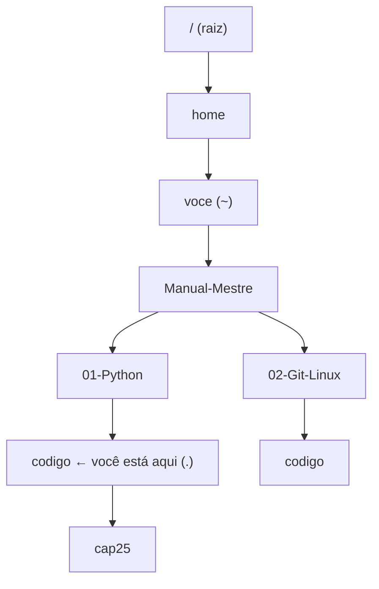

# 02.02 — Navegação e manipulação de arquivos

> **Módulo 02 — Git e Linux** · Nível: N1 · Tempo estimado: 2h30 · Código: `codigo/cap02/`

## 1. Objetivo

- **Executar** navegação com caminhos absolutos e relativos (`..`, `~`, `-`) sem se perder.
- **Criar, copiar, mover e remover** com `mkdir -p`, `cp -r`, `mv`, `rm` — com respeito pela ausência de lixeira.
- **Aplicar** curingas (`*`, `?`, `[]`) para operar em muitos arquivos de uma vez.
- **Depurar** os erros clássicos: caminho errado, espaço no nome, pasta não vazia, sobrescrita acidental.

Ao final, você faz pelo terminal — mais rápido e de forma automatizável — tudo que fazia com o explorador de arquivos.

---

## 2. Pré-requisitos

- [02.01 — Terminal](01-terminal-por-que-a-linha-de-comando.md) — anatomia de comando, `pwd`, `ls`, `cd`, e o hábito do Tab.

**Autoteste:** (1) O que `pwd` responde? (2) Como você lista arquivos ocultos? (3) Qual é o **primeiro** comando quando algo "não é encontrado"? Se as três saíram, você tem a orientação — falta a manipulação.

---

## 3. Motivação

O relatório do módulo 01 gerou três arquivos de saída. Amanhã você roda de novo, e quer guardar a versão de hoje. Depois vem a terceira, a quarta — e em duas semanas há dezenas de arquivos com nomes parecidos, alguns importantes, outros lixo. Organizar isso com o mouse é uma tarde; com quatro comandos, é um minuto.

Mas há um motivo mais sério para aprender isso **agora**, antes do Git: para versionar código com segurança, você precisa entender o que acontece com os arquivos no disco. O Git vai criar, mover, restaurar e apagar arquivos por você — e quem não sabe manipular arquivos no terminal fica sem entender o que a ferramenta está fazendo.

E há o motivo que dá arrepio: no terminal, `rm` **apaga**. Não vai para a lixeira, não pergunta "tem certeza?", não tem Ctrl+Z. Um comando mal digitado com curingas pode apagar centenas de arquivos em silêncio, instantaneamente. Este é o capítulo em que você ganha uma ferramenta poderosa — e a disciplina para não se machucar com ela.

Este capítulo resolve isso assim: sistematiza os caminhos (absolutos e relativos, com os atalhos que economizam digitação), apresenta os comandos de manipulação com suas opções essenciais, ensina curingas como multiplicador de força — e dedica atenção séria à segurança, incluindo o hábito profissional de "listar antes de apagar".

---

## 4. Modelo mental

> 🧠 **Modelo mental**
> O sistema de arquivos é uma **árvore**, e você está sempre num galho (a pasta atual). Endereços vêm em duas formas: **absoluto** (começa na raiz `/` — como um endereço postal completo: "funciona de qualquer lugar") e **relativo** (parte de onde você está — como "duas quadras à direita": depende de onde você está). Os atalhos são pontos de referência: `.` é aqui, `..` é o galho acima, `~` é sua pasta pessoal, `-` é onde você estava antes.

**Exercício de previsão.** Você está em `/home/voce/Manual-Mestre/01-Python/codigo`. Sem rodar, decida onde cada comando te deixa:

```bash
cd ..
cd ../02-Git-Linux
cd ~
cd -
```

*Resposta comentada:* `..` sobe para `/home/voce/Manual-Mestre/01-Python`; `../02-Git-Linux` sobe um nível **e** entra no módulo 02 (`/home/voce/Manual-Mestre/02-Git-Linux`); `~` vai para a sua pasta pessoal (`/home/voce`); e `cd -` volta para **onde você estava antes** — ou seja, `/home/voce/Manual-Mestre/02-Git-Linux`. Se o último te pegou, guarde: o `-` é o "voltar" do navegador, e alterna entre os dois últimos lugares.

---

## 5. Analogia

Manipular arquivos no terminal é **trabalhar num arquivo físico de escritório com um assistente extremamente literal e muito rápido**. Você diz "copie a pasta Vendas para o armário 2" e ele faz — instantaneamente, sem perguntar nada. Se você disser "jogue fora tudo que começa com 'rel'", ele joga: relatórios, relações de clientes, tudo. Ele não interpreta intenção, não hesita e **não tem cesto de lixo** — o que sai, saiu.

A disciplina profissional que decorre disso é uma só: **peça para ele mostrar antes de mandar destruir**. "Liste tudo que começa com 'rel'" (com `ls`) e, só depois de conferir a lista, "agora jogue fora isso" (com `rm`).

**Onde a analogia quebra:** o assistente físico se cansaria com 10 mil pastas; o terminal não muda de ritmo entre 10 e 10 mil. E há uma diferença que joga a favor: o assistente digital **completa nomes** (Tab) e avisa quando o que você pediu não existe — o que o torna mais seguro que a analogia sugere, desde que você use esses recursos.

---

## 6. Teoria

### Caminhos: absolutos, relativos e os atalhos

```bash
/home/voce/Manual-Mestre/README.md      # ABSOLUTO: começa em / (raiz)
01-Python/codigo                        # RELATIVO: parte da pasta atual
./relatorio.py                          # o "." explícito: aqui
../02-Git-Linux                         # sobe um nível e entra
~/Manual-Mestre                         # ~ = sua pasta pessoal (home)
```

| Atalho | Significa | Uso típico |
|---|---|---|
| `.` | a pasta atual | `cp arquivo .` (copiar para cá) |
| `..` | a pasta acima | `cd ..`, `../dados/vendas.csv` |
| `~` | sua pasta pessoal | `cd ~`, `~/projetos` |
| `-` | a pasta anterior | `cd -` (alternar entre duas) |
| `/` | a raiz do sistema | caminhos absolutos |

> 📌 **Observação (Windows)**
> No Git Bash, os discos aparecem como `/c/Users/...` em vez de `C:\Users\...` — e as barras são normais (`/`), não invertidas. O PowerShell usa a forma do Windows; é mais um motivo para ficar no Git Bash durante este módulo (D-009).

### Criar: `mkdir` e `touch`

```bash
mkdir relatorios                  # cria uma pasta
mkdir -p saida/2026/julho         # -p cria a hierarquia inteira (e não reclama se existir)
touch anotacoes.md                # cria um arquivo VAZIO (ou atualiza a data do existente)
```

O `-p` é o que você usará quase sempre: cria pais faltantes e é **idempotente** (rodar duas vezes não dá erro) — propriedade que importa em scripts (02.07).

### Copiar e mover: `cp` e `mv`

```bash
cp origem.txt destino.txt              # copia arquivo
cp origem.txt pasta/                   # copia PARA dentro da pasta (mantendo o nome)
cp -r pasta_origem pasta_destino       # -r (recursivo): obrigatório para pastas
cp -i origem.txt destino.txt           # -i pergunta antes de sobrescrever

mv antigo.txt novo.txt                 # RENOMEIA (mover para o mesmo lugar com outro nome)
mv arquivo.txt pasta/                  # move para outra pasta
mv -i origem destino                   # pergunta antes de sobrescrever
```

Duas observações que evitam prejuízo: `mv` é **renomear e mover ao mesmo tempo** (não existe comando "rename" no Unix — renomear é mover para o mesmo lugar com outro nome); e tanto `cp` quanto `mv` **sobrescrevem sem avisar** por padrão — daí o `-i` (*interactive*), que vale como hábito enquanto a intuição não amadurece.

### Remover: `rm` e `rmdir` — a seção do respeito

```bash
rm arquivo.txt                    # apaga o arquivo. Definitivamente.
rm -i arquivo.txt                 # pergunta antes (recomendado enquanto aprende)
rmdir pasta_vazia                 # remove pasta VAZIA (falha se houver conteúdo — é uma proteção)
rm -r pasta                       # remove pasta e TODO o conteúdo, recursivamente
rm -rf pasta                      # -f (force): sem perguntar, sem reclamar. Perigoso.
```

**Não há lixeira.** O que `rm` apaga, some — recuperar exige backup (ou perícia). E o combo `-rf` é o mais perigoso do terminal: com um caminho errado, ele apaga tudo abaixo dele em silêncio.

O hábito profissional que previne desastres, em duas etapas:

```bash
ls relatorio_*.txt          # 1. LISTE primeiro — confira o que o curinga pegou
rm relatorio_*.txt          # 2. só então apague (seta ↑ e troque 'ls' por 'rm')
```

> ⚠️ **Atenção**
> Jamais rode `rm -rf` com caminho que você não conferiu — e desconfie de qualquer comando da internet que contenha essa combinação. Dois cuidados extras: nunca deixe um **espaço acidental** antes da barra (`rm -rf / caminho` apaga a raiz!) e prefira caminhos **relativos curtos** dentro do projeto, não absolutos longos, onde um erro de digitação passa despercebido.

### Curingas (globs): o multiplicador de força

Quem expande os curingas é o **shell**, antes de o comando executar (a seção 7 do 02.01):

| Curinga | Significa | Exemplo |
|---|---|---|
| `*` | qualquer sequência (inclusive vazia) | `*.py` (todos os .py), `rel*` (começa com rel) |
| `?` | exatamente um caractere | `cap0?.md` (cap01 a cap09) |
| `[...]` | um caractere do conjunto | `cap0[123].md` (cap01, cap02, cap03) |
| `{a,b}` | alternativas (bash) | `*.{py,md}` (py **ou** md) |

Curingas são o que torna o terminal desproporcionalmente mais rápido que o mouse — e são exatamente por isso que exigem o hábito do `ls` antes do `rm`.

### Ver o que existe: `ls` com as opções úteis

```bash
ls -l          # formato longo: permissões, dono, tamanho, data
ls -a          # inclui ocultos (nomes com ponto)
ls -h          # tamanhos legíveis (K, M, G) — combine: ls -lh
ls -t          # ordena por data de modificação (mais recente primeiro)
ls -R          # recursivo: mostra subpastas também
ls -d */       # só as pastas
```

### Curiosidade útil: o comando `tree`

```bash
tree -L 2      # mostra a árvore até 2 níveis (se instalado)
```

Nem todo sistema tem, mas quando tem, é a forma mais rápida de entender a estrutura de um projeto desconhecido — inclusive para colar em documentação (a árvore do §5 da spec foi feita assim).

---

## 7. Funcionamento interno

Por dentro, na medida N1: no sistema de arquivos, um **nome** é apenas uma entrada numa pasta apontando para os dados. Isso explica três comportamentos que parecem estranhos. (1) **`mv` no mesmo disco é instantâneo**, mesmo com arquivos gigantes — ele só altera a entrada de nome; mover **entre discos** copia e apaga, e aí demora. (2) **`rm` não apaga os dados**: remove a referência, e o espaço passa a ser reutilizável — por isso ferramentas de recuperação às vezes conseguem resgatar arquivos, e por isso "apagar" não é o mesmo que "destruir com segurança". (3) Pastas são arquivos especiais que listam nomes — e é por isso que **remover uma pasta cheia exige `-r`**: são muitas entradas a remover, uma a uma. Guarde a consequência prática: renomear e mover são baratos; copiar é caro (duplica dados de verdade).

---

## 8. Visualização do fluxo

A árvore, os caminhos e o ponto de partida:



**Como ler:** estando em `codigo` (o nó destacado), `..` é `01-Python`, `../..` é `Manual-Mestre`, e `../../02-Git-Linux/codigo` chega ao nó da direita — subindo dois níveis e descendo dois. O caminho **absoluto** para o mesmo destino seria `/home/voce/Manual-Mestre/02-Git-Linux/codigo`: mais longo, mas funciona de qualquer galho. Regra prática: **relativo** dentro do projeto (curto, e continua válido se o projeto mudar de lugar); **absoluto** quando o alvo está fora do projeto ou o script pode rodar de qualquer pasta.

---

## 9. Aplicação prática

Uma oficina real: organizar as saídas do relatório do módulo 01. Trabalhe na sua pasta de testes (criada no mini projeto do 02.01) para não bagunçar o repositório.

**Passo 1 — Prepare o cenário** (simula saídas acumuladas de vários dias):

```bash
cd meus-testes/terminal
mkdir -p saidas/arquivo
touch relatorio_2026-07-28.txt relatorio_2026-07-29.txt relatorio_2026-07-30.txt
touch quarentena_2026-07-28.csv quarentena_2026-07-29.csv
touch rascunho.tmp observacoes.md
ls -lh
```

**Passo 2 — Investigue antes de agir** (o hábito que salva):

```bash
ls relatorio_*.txt          # quantos relatórios existem?
ls *2026-07-28*             # tudo do dia 28 (relatório + quarentena)
ls *.tmp                    # o lixo temporário
```

**Passo 3 — Organize com curingas:**

```bash
mv relatorio_*.txt saidas/          # move os 3 relatórios de uma vez
mv quarentena_*.csv saidas/         # e as quarentenas
ls saidas/                          # confira
```

**Passo 4 — Arquive o mais antigo e limpe o lixo:**

```bash
cp saidas/relatorio_2026-07-28.txt saidas/arquivo/    # copia (mantém o original)
ls *.tmp                                              # 1. LISTE o que será apagado
rm *.tmp                                              # 2. só então apague
ls -R                                                 # veja a estrutura final
```

Saída esperada ao final:

```text
.:
observacoes.md  saidas

./saidas:
arquivo  quarentena_2026-07-28.csv  quarentena_2026-07-29.csv
relatorio_2026-07-28.txt  relatorio_2026-07-29.txt  relatorio_2026-07-30.txt

./saidas/arquivo:
relatorio_2026-07-28.txt
```

Quatro comandos organizaram o que exigiria dezenas de cliques — e, mais importante, essa sequência pode virar um **script** (02.07) que roda sozinho todo dia.

> 🎯 **Checkpoint rápido**
> De cabeça: qual a diferença entre `cp arquivo.txt pasta` e `cp arquivo.txt pasta/`? E o que acontece se `pasta` não existir em cada caso?

---

## 10. Código comentado

Arquivo completo em [`codigo/cap02/oficina_de_arquivos.sh`](codigo/cap02/oficina_de_arquivos.sh) — ele **cria seu próprio cenário** numa pasta temporária e o remove ao final, então é seguro executar.

```bash
#!/usr/bin/env bash
# ------------------------------------------------------------
# oficina_de_arquivos.sh
# Capítulo 02.02 — Navegação e manipulação de arquivos
# O que este arquivo demonstra: criar, copiar, mover, remover e
#   curingas — num cenário isolado que se limpa ao final
# Como executar: bash oficina_de_arquivos.sh
# ------------------------------------------------------------

set -e   # para na primeira falha (boa prática — o 02.07 explica)

PASTA_TESTE="oficina_temporaria"

echo "--- 1. Criando o cenário ---"
# -p cria a hierarquia inteira e não reclama se já existir (idempotente)
mkdir -p "$PASTA_TESTE/saidas/arquivo"
cd "$PASTA_TESTE"

# touch cria arquivos vazios (ou atualiza a data dos existentes)
touch relatorio_2026-07-28.txt relatorio_2026-07-29.txt relatorio_2026-07-30.txt
touch quarentena_2026-07-28.csv quarentena_2026-07-29.csv
touch rascunho.tmp cache.tmp observacoes.md
ls

echo
echo "--- 2. Investigando ANTES de agir (o hábito que salva) ---"
echo "Relatórios encontrados:"
ls relatorio_*.txt
echo "Tudo do dia 28:"
ls ./*2026-07-28*
echo "Arquivos temporários (candidatos a apagar):"
ls ./*.tmp

echo
echo "--- 3. Organizando com curingas ---"
mv relatorio_*.txt saidas/       # move os 3 de uma vez
mv quarentena_*.csv saidas/
echo "Conteúdo de saidas/:"
ls saidas/

echo
echo "--- 4. Arquivando e limpando ---"
# cp mantém o original; mv o levaria embora
cp saidas/relatorio_2026-07-28.txt saidas/arquivo/
echo "Arquivo histórico:"
ls saidas/arquivo/

# O par LISTAR -> APAGAR (nunca apague sem conferir a lista antes)
echo "Vou apagar estes arquivos:"
ls ./*.tmp
rm ./*.tmp
echo "Após a limpeza:"
ls

echo
echo "--- 5. Estrutura final ---"
ls -R

echo
echo "--- 6. Limpeza do cenário de teste ---"
cd ..
# -r porque é pasta com conteúdo; sem -f para que erros apareçam
rm -r "$PASTA_TESTE"
echo "Pasta temporária removida. Nada ficou para trás."
```

---

## 11. Erros comuns

### Erro 1 — `rm` sem conferir o curinga (o desastre silencioso)

**Sintoma:** nenhum erro — e arquivos importantes desaparecem:

```bash
rm relatorio *.txt        # ESPAÇO acidental: apaga 'relatorio' E todos os .txt
```

**Causa:** o espaço transformou um argumento em dois; o shell expandiu `*.txt` para **todos** os arquivos de texto.
**Correção:** o par **listar → apagar**: rode com `ls` primeiro, confira a lista, e só então (com ↑) troque para `rm`. Enquanto o hábito não amadurece, use `rm -i` (pergunta a cada arquivo). E jamais monte comandos com `rm` "no automático" a partir de exemplos da internet.

### Erro 2 — `cp` de pasta sem `-r`

**Sintoma:**

```text
cp: -r not specified; omitting directory 'saidas'
```

**Causa:** copiar uma pasta significa copiar tudo que está dentro, recursivamente — e o `cp` exige que você declare essa intenção.
**Correção:** `cp -r origem destino`. E note a assimetria: `mv` **não** precisa de `-r` (mover uma pasta é alterar uma entrada de nome — a seção 7 explica), mas `rm` precisa. As exigências refletem o custo real da operação.

### Erro 3 — Sobrescrita silenciosa

**Sintoma:** sem erro — o arquivo de destino é substituído e o conteúdo anterior some:

```bash
cp relatorio_novo.txt relatorio_final.txt     # o 'final' anterior morreu, sem aviso
```

**Causa:** `cp` e `mv` sobrescrevem por padrão; o Unix assume que você sabe o que está fazendo.
**Correção:** `-i` (pergunta antes) enquanto o hábito se forma; `-n` (*no-clobber*) para nunca sobrescrever; e, no fluxo profissional, a resposta definitiva: **versionar com Git** (a partir do 02.08), onde sobrescrever deixa de ser perda porque o histórico guarda tudo.

---

## 12. Boas práticas

✅ **`ls` antes de `rm`, sempre — com o mesmo curinga** — dois segundos que separam limpeza de desastre.

✅ **`mkdir -p` em vez de criar pasta por pasta** — idempotente, funciona em script, cria a hierarquia inteira.

✅ **Caminhos relativos dentro do projeto; absolutos quando o alvo é externo** — relativos sobrevivem à mudança de lugar do projeto.

✅ **Tab para completar caminhos, sempre** — evita erro de digitação no lugar em que ele custa mais caro (comandos destrutivos).

❌ **Evite `rm -rf` com caminho longo ou copiado** — confira o caminho, prefira relativo curto, e desconfie de espaços acidentais.

❌ **Evite espaços e acentos em nomes de arquivos de projeto** — a convenção da trilha (§7 da spec) existe justamente porque o terminal e os scripts sofrem com eles.

---

## 13. Performance

Nesta escala, irrelevante — e com as três notas da seção 7, que orientam decisões reais: **mover no mesmo disco é instantâneo** (só muda a entrada de nome), então reorganizar uma pasta de 50 GB com `mv` leva milissegundos; **copiar duplica dados**, e aí o tempo é proporcional ao tamanho; e **operações em muitos arquivos pequenos** custam mais que o tamanho total sugere (cada arquivo tem sobrecarga própria) — o motivo pelo qual o módulo 10 preferirá poucos arquivos grandes (Parquet) a milhares de pequenos. Guarde a regra de bolso: reorganizar é barato, copiar é caro, e muitos arquivinhos são caros mesmo quando pequenos.

---

## 14. Mercado

> 🏢 **Mercado**
> Manipulação de arquivos por comando é rotina em qualquer trabalho de dados e infraestrutura: organizar exports diários, rotacionar logs, preparar diretórios de deploy, limpar arquivos temporários que enchem o disco de um servidor às 3h da manhã. Duas práticas deste capítulo são cultura profissional: o par **listar-antes-de-apagar** (que aparece em checklists de operação de times sérios) e a preferência por **caminhos relativos** em scripts, para que funcionem em qualquer máquina. E há uma história de guerra que todo time tem: alguém que rodou `rm -rf` no lugar errado — em produção, num sábado. É por isso que ambientes maduros restringem permissões (02.05), fazem backup e, principalmente, versionam tudo que importa (02.08 em diante).
>
> **Mini-cenário:** quando o Atlas estiver no ar (módulo 09), a pasta de logs vai crescer até encher o disco — e a solução será um script agendado que move os logs antigos para um arquivo compactado e remove os de mais de 30 dias. Os comandos desse script são exatamente os deste capítulo, com o cuidado deste capítulo.

---

## 15. Entrevistas

**P1. "Qual a diferença entre caminho absoluto e relativo? Quando usar cada um?"**
*Resposta esperada:* absoluto começa na raiz (`/`) e funciona de qualquer lugar; relativo parte da pasta atual e é mais curto. Em scripts de projeto, relativo (o projeto pode mudar de lugar) ou ancorado (`$(dirname "$0")` no shell; `Path(__file__).parent` no Python — 01.22); absoluto quando o alvo é externo e fixo (`/var/log`, `/etc`). Citar o problema do "funciona só se eu rodar da pasta certa" mostra vivência.

**P2. "O que acontece quando você roda `rm arquivo`? Dá para recuperar?"**
*Resposta esperada:* o `rm` remove a referência ao arquivo; não há lixeira, e o espaço passa a ser reutilizável. Recuperação depende de backup (ou perícia, com chances baixas e decrescentes conforme o disco é usado). Complemento maduro: em trabalho profissional, a proteção real é **versionamento** (Git) e backup automatizado — não cuidado individual.

**P3. "Como você copiaria uma pasta inteira com subpastas?"**
*Resposta esperada:* `cp -r origem destino` (o `-r` é obrigatório para pastas); mencionar que `mv` não precisa de `-r`, e explicar por quê (mover altera a entrada de nome; copiar duplica dados), demonstra entendimento do sistema de arquivos, não só do comando. Bônus: `rsync` para cópias grandes/incrementais — conhecimento de campo.

**Pegadinha clássica: "Qual a diferença entre `rm -rf pasta/` e `rm -rf pasta /`?"**
Ela é a pegadinha mais séria do módulo, e existe porque o erro é real. A resposta: o primeiro remove a pasta e tudo dentro dela; o segundo, por causa do **espaço**, é interpretado como dois argumentos — remove a pasta **e tenta remover a raiz do sistema** (`/`), apagando tudo a que o usuário tiver acesso. Sistemas modernos protegem a raiz por padrão (`--preserve-root`), mas a lição permanece: **um espaço muda tudo**. Fechar com as defesas profissionais: conferir com `ls` antes, usar caminhos relativos curtos, nunca colar comandos destrutivos sem ler, e trabalhar sem privilégios de administrador no dia a dia (02.05).

---

## 16. Exercícios guiados

Enunciados completos em [`exercicios/cap02.md`](exercicios/cap02.md); gabaritos em [`exercicios/gabaritos/cap02.md`](exercicios/gabaritos/cap02.md).

### Aquecimento

- **A1** `[~10 min · caminhos]` — 8 navegações a partir de uma pasta dada: onde cada comando termina?
- **A2** `[~10 min · curingas]` — Dada uma lista de 10 arquivos, quais cada curinga seleciona?
- **A3** `[~5 min · qual comando?]` — 6 intenções: qual comando e quais opções?
- **A4** `[~10 min · diagnóstico]` — 4 erros reais: causa e correção.

### Aplicação

- **AP1** `[~20 min · a oficina]` — Execute o cenário completo da seção 9, conferindo cada passo com `ls`.
- **AP2** `[~20 min · organização por curingas]` — Dado um cenário com 15 arquivos misturados, organize em 3 pastas usando o mínimo de comandos.
- **AP3** `[~15 min · o par seguro]` — Pratique listar-antes-de-apagar em 5 situações, registrando a lista conferida antes de cada remoção.

---

## 17. Desafios

- **D1** `[~40 min · o organizador de saídas]` — **Simule duas semanas de relatórios.** Crie um cenário com 14 relatórios diários (`relatorio_2026-07-DD.txt`), 14 quarentenas e alguns arquivos temporários. Depois, organize com o mínimo de comandos possível: relatórios em `saidas/relatorios/`, quarentenas em `saidas/quarentenas/`, os 7 mais antigos de cada tipo copiados para `saidas/arquivo/`, e os temporários removidos (com o par seguro). Registre **cada comando** e a contagem final de arquivos por pasta. Desafio extra: consegue mover os relatórios de julho e os de agosto para pastas diferentes com **dois** comandos? (dica: o curinga pode ser mais específico do que você imagina).

<details><summary>💡 Dica 1 (conceito)</summary>
Para gerar 14 arquivos sem digitar 14 nomes: `touch relatorio_2026-07-{15..28}.txt` — expansão de chaves do bash (a mesma família dos curingas).
</details>
<details><summary>💡 Dica 2 (estratégia)</summary>
"Os 7 mais antigos" — se os nomes têm data no formato AAAA-MM-DD, a ordem alfabética É a ordem cronológica. Isso não é sorte: é o motivo de esse formato ser o padrão profissional.
</details>
<details><summary>💡 Dica 3 (esqueleto)</summary>
mkdir -p das 3 pastas → mv com curinga por tipo → cp dos antigos (curinga com faixa de datas) → ls antes → rm dos temporários → ls -R final.
</details>

---

## 18. Mini projeto

**Faxina no seu repositório** `[~50 min]` — organizar o que você produziu no módulo 01, pelo terminal.

Requisitos numerados:

1. **Inventário primeiro:** liste, sem apagar nada, todos os arquivos gerados automaticamente no repositório — pastas `__pycache__`, arquivos em `saida/`, arquivos `.tmp` se houver. Registre a lista.
2. **Classifique** cada achado em: (a) gerado, pode apagar (o programa recria); (b) gerado, deve ser mantido (saídas que documentam a entrega); (c) fonte, jamais apagar.
3. **Execute a limpeza** apenas da categoria (a), com o par listar→apagar registrado para cada comando.
4. **Organize** sua pasta pessoal de anotações (`meus-testes/`, caderno de bordo, guias) numa estrutura com subpastas por tema, criada com `mkdir -p`.
5. Documente no caderno de bordo: os comandos usados, o que aprendeu sobre "arquivos gerados vs. fonte" — e uma frase sobre por que essa distinção vai importar quando o Git chegar (02.09 e o `.gitignore`).

**Critério de "está bom":** nenhum arquivo-fonte apagado (a classificação do requisito 2 é a proteção); cada `rm` precedido de `ls` registrado; a estrutura pessoal criada por comando. A distinção "gerado × fonte" que você fez aqui é **exatamente** o critério do `.gitignore` — você está resolvendo o problema antes de conhecer a ferramenta.

---

## 19. Revisão

**Resumo do capítulo:**

- Caminhos: **absolutos** (começam em `/`, funcionam de qualquer lugar) e **relativos** (partem daqui); atalhos `.` (aqui), `..` (acima), `~` (pasta pessoal), `-` (anterior).
- Criar: `mkdir -p` (hierarquia inteira, idempotente) e `touch` (arquivo vazio / atualiza data).
- Copiar e mover: `cp` (`-r` para pastas, `-i` para perguntar), `mv` (renomeia **e** move; não precisa de `-r`).
- Remover: `rm` **não tem lixeira**; `rmdir` só apaga pasta vazia (proteção); `rm -r` para pastas; `-rf` é o comando mais perigoso do terminal.
- O hábito que salva: **listar antes de apagar**, com o mesmo curinga (`ls padrao` → ↑ → `rm padrao`).
- Curingas expandidos pelo **shell**: `*` (qualquer sequência), `?` (um caractere), `[...]` (conjunto), `{a,b}` (alternativas) — o multiplicador de força do terminal.

**Flashcards novos** (adicionados a [`revisao/flashcards.md`](revisao/flashcards.md)):

| ID | Frente | Verso |
|---|---|---|
| 02.02-F1 | O que significam `.`, `..`, `~` e `-` num caminho? | `.` a pasta atual · `..` a pasta acima · `~` sua pasta pessoal (home) · `-` a pasta anterior (alterna entre as duas últimas). |
| 02.02-F2 | Explique com suas palavras: por que `cp` de pasta exige `-r` e `mv` não? | (Elaboração) Copiar duplica os dados de tudo que está dentro (recursivo, caro); mover no mesmo disco só altera a entrada de nome — instantâneo, sem percorrer conteúdo. |
| 02.02-F3 | Preveja: `rm relatorio *.txt` (com espaço). O que acontece? | (Previsão) Dois argumentos: apaga o arquivo `relatorio` **e todos** os `.txt`. Um espaço muda tudo — daí o par listar→apagar. |
| 02.02-F4 | Qual o hábito que previne desastres com `rm` — e como se executa? | (Decisão) Listar antes de apagar com o **mesmo** curinga: `ls padrao`, conferir, ↑, trocar `ls` por `rm`. E `-i` enquanto o hábito não amadurece. |
| 02.02-F5 | Quem expande o curinga `*.py` — o comando ou o shell? Qual a consequência? | O **shell**, antes de executar: o comando recebe a lista de nomes já pronta. Por isso `ls *.py` e `rm *.py` selecionam exatamente o mesmo conjunto. |

**Agendamento:** registre no `PROGRESSO.md` e marque D+1, D+7, D+30, D+90 na [`Revisoes/agenda.md`](../Revisoes/agenda.md).

---

## 20. Checklist

Perguntas de domínio — teste do sim:

- [ ] Sei navegar *com caminhos absolutos, relativos e os quatro atalhos*?
- [ ] Sei criar, copiar, mover e remover *sabendo quais opções cada operação exige*?
- [ ] Sei aplicar *curingas para operar em muitos arquivos — e conferir antes*?
- [ ] Sei explicar *por que `rm` não tem lixeira e o que fazer a respeito*?
- [ ] Sei responder *à pegadinha do espaço no `rm -rf`*?

Itens práticos:

- [ ] Rodei `oficina_de_arquivos.sh` e entendi cada etapa.
- [ ] Acertei (ou entendi por que errei) a previsão da seção 4 e o checkpoint da seção 9.
- [ ] Fiz Aquecimento e Aplicação (incluindo o par seguro 5 vezes).
- [ ] Completei a faxina no repositório, com a classificação gerado × fonte (5 requisitos).
- [ ] Registrei a sessão e agendei as 4 revisões.

---

## 21. Próximo capítulo

Você move e organiza arquivos — mas ainda precisa **abri-los no editor** para saber o que tem dentro. Num arquivo de 200 mil linhas de log, isso é inviável; num servidor sem interface gráfica, impossível. Ficou deliberadamente em aberto o conjunto de ferramentas que responde "o que há neste arquivo?" sem sair do terminal: `cat`, `less`, `head`, `tail` (inclusive o `-f`, que acompanha um log em tempo real) e `wc`, que conta linhas em segundos. O próximo capítulo aplica todas ao CSV de vendas da Aurora — e você vai descobrir coisas sobre os seus próprios dados que o Python do módulo 01 não te contou.

→ [02.03 — Inspecionando arquivos](03-inspecionando-arquivos.md)

---

*Gerado sob spec 3.0.0*
