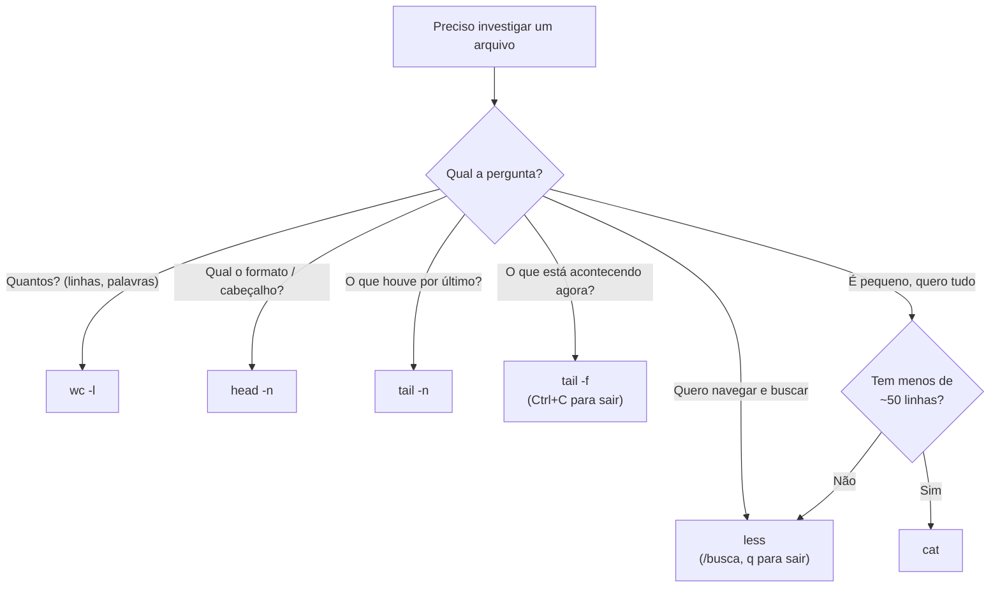

# 02.03 — Inspecionando arquivos

> **Módulo 02 — Git e Linux** · Nível: N1 · Tempo estimado: 2h30 · Código: `codigo/cap03/`

## 1. Objetivo

- **Executar** `cat`, `less`, `head`, `tail` (inclusive `-f`) e `wc` para investigar arquivos sem abrir editor.
- **Decidir** qual ferramenta usar conforme o tamanho do arquivo e a pergunta a responder.
- **Editar** no terminal com `nano` — o mínimo para consertar um arquivo num servidor.
- **Aplicar** tudo ao CSV de vendas da Aurora: contar linhas, ver cabeçalho, conferir os últimos registros.

Ao final, você responde perguntas sobre arquivos de qualquer tamanho em segundos — inclusive os de 2 GB que nenhum editor abre.

---

## 2. Pré-requisitos

- [02.02 — Navegação e manipulação de arquivos](02-navegacao-e-manipulacao-de-arquivos.md) — caminhos, curingas e o hábito de conferir.
- [01.22 — Arquivos: texto e CSV](../01-Python/22-arquivos-texto-e-csv.md) — o CSV da Aurora e a noção de fluxo.

**Autoteste:** (1) Qual comando mostra onde você está? (2) O que `ls -lh` acrescenta ao `ls`? (3) Quantas linhas tem o `vendas.csv` que você criou no 01.22 — você sabe de cabeça? A resposta da 3 é o capítulo.

---

## 3. Motivação

O importador do 01.22 processou 13 linhas e rejeitou 3. Você confia no número — mas confia porque **escreveu o programa**. Agora imagine a cena real: o export da Aurora chega numa segunda-feira com 40 mil linhas, o relatório acusa 8.412 rejeições, e alguém pergunta "o arquivo veio certo?".

Abrir 40 mil linhas no VS Code é lento e inútil (você não vai rolar até a linha 8.412). Escrever um script Python para conferir é matar mosca com canhão — e leva mais tempo do que o problema merece. O que você quer é uma resposta em cinco segundos: **quantas linhas tem?** **qual é o cabeçalho?** **como são as últimas linhas?** **o arquivo está truncado?**

Essas quatro perguntas — e outras dez do mesmo tipo — têm ferramentas dedicadas no terminal, todas com décadas de uso e otimizadas para arquivos de qualquer tamanho. `wc -l` conta 40 mil linhas instantaneamente; `head` mostra o começo sem carregar o resto; `tail -f` acompanha um log **enquanto ele cresce** (o que nenhum editor faz).

E há o cenário que torna isso obrigatório: no servidor (módulo 09), não existe VS Code. Quando o relatório noturno falhar às 3h, você entrará por SSH e terá exatamente estes comandos para descobrir o que houve.

Este capítulo resolve isso assim: apresenta as cinco ferramentas de inspeção com o critério de escolha entre elas, ensina o mínimo de `nano` para consertos emergenciais, e aplica tudo aos dados reais que você mesmo produziu.

---

## 4. Modelo mental

> 🧠 **Modelo mental**
> Inspecionar arquivo no terminal é **usar instrumentos de medição, não abrir o pacote**. Cada ferramenta responde a uma pergunta específica sem carregar o arquivo inteiro: `wc` mede (quantas linhas/palavras/bytes), `head` e `tail` **espiam as pontas**, `less` **navega** sem trazer tudo para a memória, e `cat` **despeja** o conteúdo (o que só é boa ideia em arquivos pequenos). A pergunta que você faz determina o instrumento — e usar `cat` num arquivo de 2 GB é como despejar um caminhão de areia na mesa para ver a cor do grão.

**Exercício de previsão.** O arquivo `vendas.csv` tem 1 linha de cabeçalho e 13 de dados. Sem rodar, decida o que cada comando mostra:

```bash
wc -l vendas.csv
head -3 vendas.csv
tail -1 vendas.csv
```

*Resposta comentada:* `wc -l` mostra **14** — ele conta **todas** as linhas, incluindo o cabeçalho (a distinção "linhas do arquivo" × "registros de dados" é fonte constante de confusão em relatórios; sempre subtraia o cabeçalho). `head -3` mostra o cabeçalho e os dois primeiros registros. `tail -1` mostra a última linha do arquivo — o último registro. Se você respondeu 13 no primeiro, acabou de conhecer o erro de contagem mais comum ao inspecionar CSV.

---

## 5. Analogia

As ferramentas de inspeção são o **instrumental de um médico examinando um paciente sem cirurgia**. A balança (`wc`) dá números objetivos em segundos. O estetoscópio nas pontas (`head`/`tail`) escuta onde os sintomas costumam aparecer — começo (cabeçalho, formato) e fim (truncamento, últimos eventos). O endoscópio (`less`) percorre por dentro, com controle, sem abrir o paciente. E a cirurgia exploratória (`cat` em arquivo grande) é o que se evita: invasiva, demorada, e derruba a sala.

**Onde a analogia quebra:** exames médicos custam caro e demoram; estes são instantâneos e gratuitos — o que muda a estratégia: **meça sempre antes de agir**. Um `wc -l` antes de processar um arquivo é o exame de rotina que evita a surpresa de descobrir, depois de meia hora de processamento, que o arquivo tinha 3 linhas.

---

## 6. Teoria

### `wc` — medir

```bash
wc -l vendas.csv        # linhas (o mais usado)
wc -w texto.md          # palavras
wc -c arquivo.bin       # bytes
wc vendas.csv           # tudo: linhas, palavras, bytes
```

`wc -l` é o comando de aferição por excelência: instantâneo em arquivos de qualquer tamanho. E o cuidado que a previsão da seção 4 plantou: **ele conta linhas físicas**, então em CSV com cabeçalho, `registros = linhas - 1`.

### `head` e `tail` — espiar as pontas

```bash
head vendas.csv           # as 10 primeiras linhas (padrão)
head -3 vendas.csv        # as 3 primeiras
tail vendas.csv           # as 10 últimas
tail -5 vendas.csv        # as 5 últimas
tail -n +2 vendas.csv     # da linha 2 em diante (pula o cabeçalho!)
```

O `head` responde "qual o formato deste arquivo?" — cabeçalho, separador, exemplo de registro. O `tail` responde "o que aconteceu por último?" — e, em logs, é onde o erro está.

E o superpoder do `tail`:

```bash
tail -f relatorio.log     # segue o arquivo em tempo real (Ctrl+C para sair)
```

O `-f` (*follow*) mantém o comando aberto exibindo **novas linhas conforme elas são escritas**. É como se você olhasse o log ao vivo — e é o que você fará no módulo 09 enquanto um deploy acontece.

### `less` — navegar

```bash
less vendas.csv
```

Abre um navegador de texto dentro do terminal. Os comandos essenciais (que também valem no `man`):

| Tecla | Ação |
|---|---|
| `↓`/`↑`, `Espaço` | rolar linha / página |
| `g` / `G` | ir para o início / o fim |
| `/texto` | buscar (depois `n` para a próxima ocorrência) |
| `q` | **sair** |

O `less` **não carrega o arquivo inteiro** na memória — abre um arquivo de 10 GB instantaneamente. É a ferramenta certa para "preciso olhar isso com calma". (Existe o `more`, mais antigo e limitado; o nome do `less` é uma piada com ele — *less is more*.)

### `cat` — despejar (com moderação)

```bash
cat config.json                 # mostra o arquivo inteiro
cat arquivo1.txt arquivo2.txt   # concatena (a origem do nome: concatenate)
```

`cat` é ótimo para arquivos pequenos (configuração, script, um CSV de 10 linhas) e péssimo para grandes: despeja tudo na tela, você perde o começo, e num arquivo binário embaralha o terminal (conserto: `reset`).

### O critério de escolha

| Pergunta | Ferramenta |
|---|---|
| Quantas linhas/palavras/bytes? | `wc` |
| Qual o formato / cabeçalho? | `head` |
| O que aconteceu por último? | `tail` |
| O que está acontecendo **agora**? | `tail -f` |
| Preciso olhar com calma / buscar dentro | `less` |
| Arquivo pequeno, quero tudo na tela | `cat` |

### `nano` — o editor de emergência

Quando é preciso **alterar** um arquivo sem interface gráfica:

```bash
nano config.json
```

O rodapé mostra os atalhos (o `^` significa Ctrl):

- **Ctrl+O** — gravar (*write Out*), depois Enter para confirmar o nome
- **Ctrl+X** — sair
- **Ctrl+W** — buscar (*Where is*)
- **Ctrl+K** — cortar a linha

O `nano` é o editor mais simples disponível em praticamente todo servidor Linux. Existe o `vim`, mais poderoso e com curva íngreme (a piada sobre "como sair do vim" é real: `:q!`) — a trilha usa `nano` deliberadamente: o objetivo é consertar uma linha de configuração às 3h da manhã, não dominar um editor modal.

> 📌 **Observação**
> Editar em servidor deve ser exceção, não rotina. O fluxo profissional é: editar no seu computador → versionar (Git) → publicar (deploy). O `nano` existe para emergências e diagnósticos — e é por isso que meia dúzia de atalhos resolve.

---

## 7. Funcionamento interno

Por dentro, na medida N1: a diferença de desempenho entre estas ferramentas vem de **quanto elas precisam ler**. O `head -3` lê os primeiros bytes e **para** — instantâneo em qualquer tamanho. O `wc -l` precisa percorrer o arquivo inteiro contando quebras de linha, mas não guarda nada: memória constante, tempo proporcional ao tamanho (ainda assim, milissegundos para dezenas de MB). O `tail` é mais esperto do que parece: ele **lê do fim para trás**, buscando as últimas quebras de linha — por isso é rápido mesmo em arquivos gigantes. O `less` carrega apenas a parte visível e busca o resto sob demanda. E o `cat` despeja tudo, sem estratégia — daí ser ruim para arquivos grandes. O `tail -f`, por fim, mantém o arquivo aberto e é notificado pelo sistema quando novos bytes chegam. É a mesma economia do "percorra linha a linha" do 01.22, agora em ferramentas prontas.

---

## 8. Visualização do fluxo

O critério de escolha em forma de decisão:



**Como ler:** a pergunta determina a ferramenta — e o único caminho com condição é o do `cat`, porque ele é o único que pode causar dano (encher a tela, embaralhar o terminal com binários). Repare que `less` aparece duas vezes: ele é a escolha segura sempre que houver dúvida sobre o tamanho. Regra de bolso: **na dúvida, `less`**.

---

## 9. Aplicação prática

Investigando os dados que **você** produziu. Vá até a pasta do mini projeto do módulo 01:

```bash
cd 01-Python/codigo/cap25
ls dados saida
```

**Pergunta 1 — Quantas linhas tem o export?**

```bash
wc -l dados/vendas.csv
```

```text
14 dados/vendas.csv
```

Quatorze linhas físicas → **13 registros** (o cabeçalho é a primeira). Confere com o funil do relatório: "Lidas: 13".

**Pergunta 2 — Qual o formato?**

```bash
head -3 dados/vendas.csv
```

```text
codigo;produto;valor_centavos;cidade
PED-2026-00123;Fone Bluetooth XZ-9;46990;Campinas
PED-2026-00124;Mouse Sem Fio;8990; santos
```

Em três linhas você descobre: separador `;`, quatro colunas, nomes das colunas, e — repare — **o espaço antes de "santos"**, a sujeira que a canônica do 01.15 resolve. Você acabou de fazer, em um comando, o diagnóstico que no 01.05 exigiu `repr()` e `len()`.

**Pergunta 3 — Como termina o arquivo?**

```bash
tail -2 dados/vendas.csv
```

```text
PED-2026-00134;Luminária LED;23900;Santos
PED-2026-00135;Filtro de Linha;3990;Campinas
```

Sem truncamento — o último registro está completo. (Arquivos truncados por transferência interrompida são um clássico; o `tail` é como se detecta.)

**Pergunta 4 — E o relatório gerado?**

```bash
wc -l saida/relatorio_vendas.txt
cat saida/quarentena.csv
less saida/relatorio_vendas.txt      # navegue com ↓, busque com /TOTAL, saia com q
```

A quarentena, sendo pequena, cabe num `cat`; o relatório merece `less` (e o `/TOTAL` leva direto à linha do total — busca em vez de rolagem).

**Experimento final — o `tail -f` ao vivo.** Em um terminal, execute:

```bash
tail -f /tmp/teste.log
```

Em **outro** terminal (o VS Code permite abrir vários com o `+` do painel), execute:

```bash
echo "primeira linha" >> /tmp/teste.log
echo "segunda linha" >> /tmp/teste.log
```

As linhas aparecem no primeiro terminal **na hora**. É assim que se acompanha um deploy, um pipeline ou um servidor em produção. (O `>>` acrescenta ao arquivo — o assunto formal do 02.04; use como caixa-preta por enquanto.)

> 🎯 **Checkpoint rápido**
> De cabeça: um CSV tem `wc -l` = 40.001. Quantos registros de dados ele tem? E qual comando você usa para ver se a última linha está completa?

---

## 10. Código comentado

Arquivo completo em [`codigo/cap03/inspecionando.sh`](codigo/cap03/inspecionando.sh) — cria seu próprio cenário e o limpa ao final.

```bash
#!/usr/bin/env bash
# ------------------------------------------------------------
# inspecionando.sh
# Capítulo 02.03 — Inspecionando arquivos
# O que este arquivo demonstra: wc, head, tail e cat aplicados a
#   um CSV de vendas — o instrumental de diagnóstico
# Como executar: bash inspecionando.sh
# ------------------------------------------------------------

set -e

PASTA="inspecao_temporaria"
ARQUIVO="$PASTA/vendas.csv"

echo "--- 1. Criando um CSV de teste (cabeçalho + 12 registros) ---"
mkdir -p "$PASTA"
{
  echo "codigo;produto;valor_centavos;cidade"
  echo "PED-001;Fone Bluetooth;46990;Campinas"
  echo "PED-002;Mouse Sem Fio;8990; santos"
  echo "PED-003;Teclado Mecanico;34900;CAMPINAS"
  echo "PED-004;Cabo HDMI;9890;Sorocaba"
  echo "PED-005;Webcam HD;47890;campinas"
  echo "PED-006;Headset Gamer;34900;Sao Paulo"
  echo "PED-007;Monitor 24;129900;Santos"
  echo "PED-008;Suporte de Mesa;12990;Santos"
  echo "PED-009;Hub USB-C;15990;sao paulo"
  echo "PED-010;Mousepad Grande;4990;Campinas"
  echo "PED-011;Luminaria LED;23900;Santos"
  echo "PED-012;Filtro de Linha;3990;Campinas"
} > "$ARQUIVO"          # o > redireciona a saída para o arquivo (02.04)

echo
echo "--- 2. MEDIR: quantas linhas? (wc) ---"
wc -l "$ARQUIVO"
# Atenção: conta o CABEÇALHO também — registros = linhas - 1

echo
echo "--- 3. ESPIAR O COMEÇO: qual o formato? (head) ---"
head -3 "$ARQUIVO"
# Em 3 linhas: separador, colunas e um exemplo de registro
# (repare o espaço antes de 'santos' — sujeira detectada sem abrir editor)

echo
echo "--- 4. ESPIAR O FIM: o arquivo está completo? (tail) ---"
tail -2 "$ARQUIVO"
# Última linha completa = arquivo não truncado

echo
echo "--- 5. PULAR O CABEÇALHO: só os dados (tail -n +2) ---"
tail -n +2 "$ARQUIVO" | head -3
# Da linha 2 em diante, mostrando só as 3 primeiras (o | é do 02.04)

echo
echo "--- 6. DESPEJAR: arquivo pequeno cabe no cat ---"
cat "$ARQUIVO"

echo
echo "--- 7. Contagens úteis para um relatório ---"
echo "Linhas físicas: $(wc -l < "$ARQUIVO")"
echo "Registros de dados: $(( $(wc -l < "$ARQUIVO") - 1 ))"
echo "Palavras: $(wc -w < "$ARQUIVO")"
echo "Bytes: $(wc -c < "$ARQUIVO")"

echo
echo "--- 8. Limpeza ---"
rm -r "$PASTA"
echo "Cenário removido."
```

---

## 11. Erros comuns

### Erro 1 — Contar linhas esquecendo o cabeçalho

**Sintoma:** sem erro — o relatório diz "processados 14 registros" quando eram 13; ou o total não bate com a soma.
**Causa:** `wc -l` conta **linhas físicas**; CSV com cabeçalho tem uma linha a mais que os registros.
**Correção:** `registros = wc -l menos 1` — e, quando for automatizar, `tail -n +2 arquivo | wc -l` conta só os dados. Registre a convenção no seu caderno: é a fonte nº 1 de discrepância de 1 unidade em relatórios.

### Erro 2 — `cat` num arquivo grande (ou binário)

**Sintoma:** a tela despeja milhares de linhas por segundos (você perde o começo e o histórico), ou — com binário — o terminal fica com caracteres estranhos e o prompt embaralhado.
**Causa:** `cat` despeja tudo, sem paginação e sem verificar o tipo do conteúdo.
**Correção:** `Ctrl+C` para interromper; `reset` para consertar o terminal embaralhado. Prevenção: `wc -l` antes (para saber o tamanho), `less` quando houver dúvida, `head` quando só o começo importa. Na dúvida, `less` — ele lida bem com qualquer tamanho.

### Erro 3 — Ficar preso no `less` (ou no `man`)

**Sintoma:** você abriu, leu, e agora o terminal não aceita comandos — Ctrl+C não resolve, e a sensação é de travamento.
**Causa:** o `less` é um programa interativo em tela cheia; ele não terminou.
**Correção:** **`q`** para sair. Vale para `less`, `man`, `more` e a maioria dos paginadores. (E se você abriu o `vim` sem querer: `:q!` + Enter.) Guarde `q` como o "Esc universal" dos visualizadores de terminal.

> ⚠️ **Atenção**
> Editar arquivos de configuração diretamente em servidor com `nano` é aceitável em emergência e **péssimo** como rotina: a alteração não fica versionada, ninguém sabe que existe, e o próximo deploy a apaga. Se você editou algo em produção, o passo seguinte é **replicar a mudança no repositório** — senão ela morre no próximo deploy (e o problema volta).

---

## 12. Boas práticas

✅ **`wc -l` antes de processar arquivo desconhecido** — cinco segundos que evitam descobrir o tamanho do problema depois.

✅ **`head -3` para entender formato antes de escrever código** — separador, colunas e um exemplo real valem mais que a suposição.

✅ **`tail -f` para acompanhar processos longos** — deploys, pipelines, servidores; é o "monitor cardíaco" do sistema.

✅ **Na dúvida sobre o tamanho, `less`** — seguro em qualquer arquivo, com busca (`/`) e saída (`q`).

❌ **Evite `cat` em arquivo que você não mediu** — meça com `wc -l` primeiro, ou use `less`.

❌ **Evite editar em servidor como rotina** — o fluxo é editar local → versionar → publicar; `nano` é para emergência, e toda emergência deve virar commit depois.

---

## 13. Performance

Nesta escala, irrelevante — e com números que valem para sempre: `head -3` é **instantâneo em qualquer tamanho** (lê o começo e para); `tail` também (lê do fim para trás); `wc -l` percorre tudo, mas com memória constante — conta 40 mil linhas em milissegundos e 40 milhões em segundos; `less` abre arquivos de gigabytes na hora (carrega só a parte visível). O único que degrada é o `cat`, que despeja tudo. É a mesma lição do 01.22 (percorrer linha a linha × `read()`), agora com ferramentas prontas — e é por isso que, no módulo 10, a primeira inspeção de um dataset de milhões de linhas será com estes comandos, não com Python.

---

## 14. Mercado

> 🏢 **Mercado**
> Este é o instrumental de **diagnóstico em produção**. Quando algo falha às 3h da manhã, a sequência típica de um profissional é: `tail -100 arquivo.log` (o que houve por último), `grep ERROR` (02.04, filtrar), `wc -l` (dimensionar o problema), `less` (investigar com calma). Em times de dados, `head` é o primeiro contato com **todo** arquivo novo — antes de escrever uma linha de código, olha-se o cabeçalho e três registros. E `tail -f` acompanha deploys e pipelines em tempo real: é o que se deixa aberto numa janela enquanto o sistema sobe. São comandos que aparecem em runbooks, em documentação de incidente e em toda conversa de suporte — "roda um `tail -f` no log e me manda o que aparece" é frase corrente.
>
> **Mini-cenário:** o ETL da Aurora (módulo 10) vai rodar de madrugada gravando um log. Na segunda em que ele falhar, você não vai abrir editor nenhum: `tail -50 etl.log` mostra o fim da execução, e a linha do erro estará ali. Trinta segundos entre a pergunta e a resposta.

---

## 15. Entrevistas

**P1. "Como você inspecionaria um arquivo de log de 2 GB?"**
*Resposta esperada:* nunca com `cat` ou editor. Sequência: `wc -l` para dimensionar, `head` para entender o formato, `tail -n 100` para o que houve por último, `less` para navegar com busca, `grep` para filtrar (02.04). Explicar **por que** (head/tail leem só as pontas; less não carrega tudo) mostra entendimento, não decoreba.

**P2. "Para que serve `tail -f`?"**
*Resposta esperada:* acompanhar um arquivo em tempo real, exibindo novas linhas conforme são escritas — usado para monitorar logs durante deploy, execução de pipeline ou depuração de serviço no ar. Complemento maduro: em ambientes modernos, a versão agregada disso é a ferramenta de logs centralizados (09.09), mas o `tail -f` continua sendo o primeiro recurso.

**P3. "Um CSV tem `wc -l` igual a 10.001. Quantos registros ele tem?"**
*Resposta esperada:* provavelmente 10.000 — se houver cabeçalho. E a resposta completa acrescenta as ressalvas de quem já se queimou: **depende** de o arquivo terminar com quebra de linha, e de não haver quebras **dentro** de campos entre aspas (que o `wc` conta como linhas separadas, mas o parser de CSV não). É por isso que contagem definitiva se faz com o leitor de CSV (01.22), não com `wc`.

**Pegadinha clássica: "Você rodou `cat arquivo.bin` e o terminal virou um caos de caracteres estranhos. E agora?"**
Ela testa desenvoltura, não conhecimento profundo. A saída forte: o terminal recebeu bytes de controle que alteraram seu estado (mudança de conjunto de caracteres, cores travadas). Solução: digitar **`reset`** e Enter — mesmo que a tela não mostre o que você digita — ou `stty sane` como alternativa. E a prevenção que vale o ponto: **verifique o tipo antes** (`file arquivo` diz se é texto ou binário) e prefira `less`, que trata binários com aviso em vez de despejar. Fechar mencionando que fechar e reabrir o terminal também resolve — mas saber o `reset` evita perder o histórico e as sessões abertas.

---

## 16. Exercícios guiados

Enunciados completos em [`exercicios/cap03.md`](exercicios/cap03.md); gabaritos em [`exercicios/gabaritos/cap03.md`](exercicios/gabaritos/cap03.md).

### Aquecimento

- **A1** `[~5 min · qual ferramenta?]` — 8 perguntas sobre arquivos: qual comando responde cada uma?
- **A2** `[~10 min · previsão de saída]` — 6 comandos sobre um arquivo conhecido: quantas linhas cada um mostra?
- **A3** `[~5 min · saindo dos programas]` — 4 situações: como sair de cada visualizador?
- **A4** `[~10 min · contagem correta]` — 4 arquivos com características diferentes: quantos registros de dados cada um tem?

### Aplicação

- **AP1** `[~20 min · diagnóstico do seu CSV]` — Responda 6 perguntas sobre o `vendas.csv` do 01.22 usando só comandos de inspeção.
- **AP2** `[~20 min · o log ao vivo]` — Monte o experimento do `tail -f` com dois terminais e registre o que observou.
- **AP3** `[~15 min · nano na prática]` — Crie, edite e salve um arquivo de configuração usando apenas o `nano`.

---

## 17. Desafios

- **D1** `[~40 min · o detetive de arquivos]` — **Cinco arquivos, cinco diagnósticos.** Prepare (ou peça ao script do capítulo que prepare) cinco arquivos com problemas diferentes: (a) um CSV truncado no meio de uma linha; (b) um CSV com cabeçalho duplicado no meio; (c) um arquivo vazio (0 bytes); (d) um arquivo com apenas o cabeçalho; (e) um CSV com quebra de linha dentro de um campo entre aspas. Para cada um, use **apenas** comandos de inspeção para descobrir o problema, e registre: qual comando revelou, o que você viu, e como o importador do 01.22 se comportaria com esse arquivo. Fecho: 5 linhas sobre por que "inspecionar antes de processar" é hábito de engenharia, não de curiosidade.

<details><summary>💡 Dica 1 (conceito)</summary>
O arquivo vazio e o só-cabeçalho se distinguem com `wc -l` (0 vs. 1) — e os dois quebram cálculos de média se o código não os previr (a borda do 01.25!).
</details>
<details><summary>💡 Dica 2 (estratégia)</summary>
Para o caso (e), compare `wc -l` com a contagem que o leitor de CSV faria — a divergência é o diagnóstico.
</details>
<details><summary>💡 Dica 3 (esqueleto)</summary>
Tabela: arquivo · comando que revelou · o que apareceu · comportamento esperado do importador · correção sugerida.
</details>

---

## 18. Mini projeto

**Painel de diagnóstico de dados** `[~50 min]` — o roteiro que você seguirá diante de todo arquivo novo.

Requisitos numerados:

1. Crie `diagnostico-de-arquivos.md` no seu caderno: um **roteiro em 6 passos** para inspecionar qualquer arquivo de dados desconhecido, com o comando de cada passo e o que ele revela.
2. Aplique o roteiro a **três** arquivos reais do seu repositório: o `vendas.csv` (01.22), o `resumo.json` (01.25) e o `manualMestre_v3.0.md` (raiz). Registre as saídas.
3. Para cada um, responda: quantas linhas? qual o formato? há sujeira visível nas primeiras linhas? o arquivo parece completo?
4. Acrescente uma seção "sinais de alerta": 5 achados que exigiriam investigação antes de processar (arquivo vazio, só cabeçalho, truncado, separador inesperado, encoding suspeito — com o comando que detecta cada um).
5. Teste de usabilidade: peça a alguém (ou a você mesmo, dias depois) para diagnosticar um arquivo seguindo **apenas** o roteiro — e ajuste o que faltou.

**Critério de "está bom":** o roteiro funciona sem consultar o capítulo; os três arquivos diagnosticados com saídas reais; os sinais de alerta com comando de detecção. Este roteiro é o mesmo que profissionais de dados aplicam a datasets novos — e você vai reusá-lo no módulo 10, com arquivos mil vezes maiores.

---

## 19. Revisão

**Resumo do capítulo:**

- Cada pergunta tem sua ferramenta: `wc` mede, `head`/`tail` espiam as pontas, `less` navega, `cat` despeja (só em arquivos pequenos).
- `wc -l` conta **linhas físicas** — em CSV com cabeçalho, `registros = linhas - 1`; `tail -n +2` pula o cabeçalho.
- `tail -f` acompanha em tempo real (Ctrl+C para sair) — o instrumento de deploys e pipelines.
- `less` não carrega o arquivo inteiro: abre gigabytes instantaneamente; `/` busca, `q` sai (o "Esc universal" dos paginadores).
- `nano` para consertos de emergência (Ctrl+O grava, Ctrl+X sai) — e toda edição em servidor deve virar commit depois.
- Por dentro: head/tail leem só as pontas, wc percorre com memória constante, less carrega sob demanda — por isso escalam para qualquer tamanho.

**Flashcards novos** (adicionados a [`revisao/flashcards.md`](revisao/flashcards.md)):

| ID | Frente | Verso |
|---|---|---|
| 02.03-F1 | `wc -l` num CSV devolve 40.001. Quantos registros de dados? | 40.000 — o `wc` conta linhas físicas, e a primeira é o cabeçalho. Para contar só dados: `tail -n +2 arquivo \| wc -l`. |
| 02.03-F2 | Explique com suas palavras: por que `head` é instantâneo mesmo num arquivo de 10 GB? | (Elaboração) Ele lê apenas os primeiros bytes e para — não percorre o arquivo. O `tail` faz o equivalente lendo do fim para trás; o `less` carrega só a parte visível. |
| 02.03-F3 | Qual ferramenta para: (a) ver o formato, (b) ver o fim, (c) acompanhar ao vivo, (d) navegar e buscar? | (a) `head -n` · (b) `tail -n` · (c) `tail -f` · (d) `less` (`/` busca, `q` sai). |
| 02.03-F4 | Você abriu o `less` (ou o `man`) e o terminal "travou". O que fazer? | Apertar **`q`** — é um programa interativo em tela cheia, não um travamento. Vale para less, man e more (no vim: `:q!`). |
| 02.03-F5 | Quando NÃO usar `cat` — e o que fazer se o terminal embaralhar? | (Decisão) Não use em arquivo grande ou binário (despeja tudo, sem paginação). Se embaralhou: `reset` (ou `stty sane`); prevenção: `file arquivo` e `less`. |

**Agendamento:** registre no `PROGRESSO.md` e marque D+1, D+7, D+30, D+90 na [`Revisoes/agenda.md`](../Revisoes/agenda.md).

---

## 20. Checklist

Perguntas de domínio — teste do sim:

- [ ] Sei escolher *a ferramenta certa pela pergunta que preciso responder*?
- [ ] Sei contar registros *corretamente num CSV com cabeçalho*?
- [ ] Sei usar *`tail -f` para acompanhar um arquivo em tempo real*?
- [ ] Sei navegar e buscar *dentro do `less` — e sair dele*?
- [ ] Sei responder *à pegadinha do terminal embaralhado pelo `cat`*?

Itens práticos:

- [ ] Rodei `inspecionando.sh` e entendi cada uma das 7 etapas.
- [ ] Diagnostiquei o `vendas.csv` do 01.22 e encontrei a sujeira nas primeiras linhas.
- [ ] Fiz o experimento do `tail -f` com dois terminais.
- [ ] Construí o painel de diagnóstico com os 3 arquivos e os 5 sinais de alerta.
- [ ] Registrei a sessão e agendei as 4 revisões.

---

## 21. Próximo capítulo

Você inspeciona arquivos inteiros — mas ainda não consegue responder perguntas **seletivas**: "quantas vendas de Campinas há neste CSV?", "quais linhas do log contêm ERROR?", "onde está o arquivo que menciona 'frete'?". Ficou deliberadamente em aberto o que transforma comandos isolados num sistema: o operador **`|`** (pipe), que conecta a saída de um à entrada de outro, mais o `grep` (buscar dentro) e o `find` (localizar arquivos). É o capítulo em que a filosofia Unix — ferramentas pequenas que se combinam — deixa de ser teoria e vira poder: três comandos encadeados respondem, em uma linha, perguntas que exigiriam um script Python.

→ [02.04 — Pipes, redirecionamento e busca](04-pipes-redirecionamento-e-busca.md)

---

*Gerado sob spec 3.0.0*
