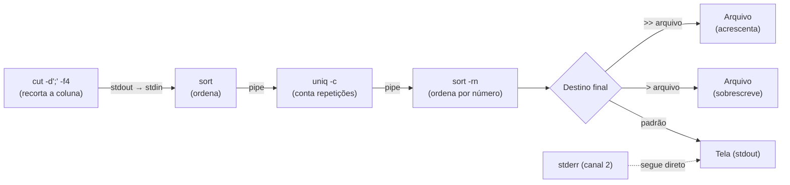

# 02.04 — Pipes, redirecionamento e busca

> **Módulo 02 — Git e Linux** · Nível: N2 · Tempo estimado: 3h · Código: `codigo/cap04/`

## 1. Objetivo

- **Compor** comandos com `|` (pipe), encadeando ferramentas pequenas — a filosofia Unix em ação.
- **Redirecionar** saída e erro com `>`, `>>`, `2>`, `&>` — fechando o arco do stdout/stderr do 01.07.
- **Buscar** dentro de arquivos com `grep` (`-i`, `-n`, `-v`, `-r`, `-c`) e localizar arquivos com `find`.
- **Investigar** dados reais: responder perguntas sobre o CSV da Aurora sem abrir o arquivo nem escrever Python.

Ao final, você monta em uma linha o que exigiria um script — e adquire o reflexo de investigação que define quem opera sistemas.

---

## 2. Pré-requisitos

- [02.03 — Inspecionando arquivos](03-inspecionando-arquivos.md) — as ferramentas que serão encadeadas.
- [01.07 — Entrada e saída](../01-Python/07-entrada-e-saida.md) — **releia a seção 7**: stdin, stdout e stderr são o mecanismo deste capítulo.

**Autoteste:** (1) O que são stdout e stderr? (2) Qual comando conta linhas? (3) O que `tail -n +2` faz? Se a 1 ficou vaga, o 01.07/seção 7 é releitura obrigatória — o capítulo inteiro depende dela.

---

## 3. Motivação

O relatório do módulo 01 respondeu "quanto vendemos por cidade" com 200 linhas de Python — e valeu a pena, porque o programa roda todo dia, valida, agrega e grava. Mas agora imagine perguntas **pontuais**, das que aparecem numa conversa:

*"Quantas vendas de Campinas tem nesse arquivo?"* — *"Tem algum registro com valor negativo?"* — *"Em quais arquivos do projeto aparece a palavra 'frete'?"* — *"O log de ontem tem quantos ERROR?"*

Escrever um script para cada uma dessas é desproporcional: você gastaria dez minutos para responder algo que precisa de dez segundos. E é exatamente aqui que o terminal mostra por que sobreviveu cinquenta anos: **encadeando ferramentas pequenas**, cada pergunta dessas vira uma linha.

O mecanismo tem duas peças. O **pipe** (`|`) conecta a saída de um comando à entrada do próximo, montando uma esteira: `filtra | conta`. E o **redirecionamento** (`>`, `>>`) desvia a saída para um arquivo em vez da tela — o que transforma qualquer comando em gerador de relatório.

A peça que faltava você já tem desde o 01.07: os canais **stdin**, **stdout** e **stderr**. Naquele capítulo, eles eram uma curiosidade de rodapé ("o shell pode replugar esses canais"). Este é o capítulo em que a promessa se cumpre — e você vai reconhecer, com prazer, que o `print` do seu programa Python participa da mesma esteira.

Este capítulo resolve isso assim: apresenta pipes e redirecionamentos com o modelo mental da esteira, ensina `grep` (a ferramenta mais usada do Unix) e `find`, e monta investigações reais sobre os seus próprios dados — terminando com perguntas que você não conseguiria responder rápido de outro jeito.

---

## 4. Modelo mental

> 🧠 **Modelo mental**
> Cada comando é uma **estação numa esteira**: recebe dados pela entrada (stdin), transforma, e entrega pela saída (stdout). O `|` **conecta a saída de uma estação à entrada da próxima** — e como todas falam o mesmo formato (texto em linhas), qualquer estação se conecta a qualquer outra. O `>` desvia o produto final para um **caixote** (arquivo) em vez da esteira de exibição. E há uma segunda esteira, paralela e independente: a de **erros** (stderr), que continua indo para a tela mesmo quando você desvia a principal — de propósito, para que problemas não sumam num arquivo.

**Exercício de previsão.** Sem rodar, decida o que cada linha faz:

```bash
cat vendas.csv | wc -l
grep Campinas vendas.csv | wc -l
grep Campinas vendas.csv > campinas.txt
ls arquivo_inexistente > saida.txt
```

*Resposta comentada:* a primeira conta as linhas (o `cat` despeja, o `wc` conta — funciona, mas é o *useless use of cat*: `wc -l vendas.csv` faz o mesmo direto). A segunda **filtra e conta**: quantas linhas contêm "Campinas". A terceira grava as linhas filtradas num arquivo, sem mostrar nada na tela. E a quarta é a que ensina: o `saida.txt` fica **vazio**, e a mensagem de erro **aparece na tela** — porque erro vai por stderr, e o `>` só desvia stdout. Se você esperava a mensagem dentro do arquivo, acabou de entender por que existem dois canais.

---

## 5. Analogia

A filosofia Unix é uma **linha de montagem com máquinas especializadas**. Cada máquina faz uma coisa: uma corta, outra fura, outra pinta. Nenhuma delas sabe fazer um produto inteiro — e é justamente por isso que você pode montar **qualquer** produto, combinando-as em ordens diferentes. O `|` é a esteira que liga a saída de uma à entrada da seguinte.

A alternativa seria uma máquina gigante que faz tudo (o "programa monolítico"): funciona para o produto previsto, e é inútil para o próximo pedido. O mundo Unix apostou nas máquinas pequenas — e por isso comandos escritos nos anos 1970 seguem úteis, combinados de formas que seus autores nunca imaginaram.

**Onde a analogia quebra:** máquinas de fábrica processam peças físicas, uma de cada vez; pipes processam **fluxos**, e as estações trabalham **simultaneamente** — o `grep` já está filtrando as primeiras linhas enquanto o `cat` ainda lê o meio do arquivo. Isso tem consequência prática ótima: um pipe sobre um arquivo de 10 GB não carrega 10 GB na memória; ele escoa.

---

## 6. Teoria

### Os três canais (o arco do 01.07 se fechando)

Todo programa nasce com três canais:

| Canal | Número | O que é | Padrão |
|---|---|---|---|
| **stdin** | 0 | entrada de dados | teclado |
| **stdout** | 1 | saída normal | tela |
| **stderr** | 2 | mensagens de erro | tela |

A separação entre 1 e 2 é deliberada: assim você pode **desviar o resultado** para um arquivo e **continuar vendo os erros** — ou o contrário. O `print` do Python escreve em stdout; o traceback (01.02) vai por stderr. É o mesmo mecanismo, do outro lado.

### Redirecionamento

```bash
comando > arquivo.txt      # stdout PARA o arquivo (SOBRESCREVE!)
comando >> arquivo.txt     # stdout ACRESCENTA ao fim
comando 2> erros.txt       # stderr para o arquivo
comando > saida.txt 2>&1   # stdout para o arquivo E stderr junto ("2 para onde 1 foi")
comando &> tudo.txt        # atalho do bash para o anterior
comando < entrada.txt      # stdin VEM do arquivo
comando > /dev/null        # descarta a saída (o "ralo" do sistema)
```

O `>` **trunca** o arquivo — o mesmo perigo do modo `"w"` do 01.22, agora no terminal. Para acumular (logs!), `>>`.

### Pipes: a esteira

```bash
comando1 | comando2 | comando3
```

A saída de cada um vira a entrada do próximo. Os elos mais úteis do repertório:

```bash
wc -l                # conta linhas do que chegou
head -5 / tail -5    # as pontas do que chegou
sort                 # ordena
sort | uniq          # ordena e remove duplicatas adjacentes
sort | uniq -c       # ...e conta quantas vezes cada uma apareceu
cut -d';' -f4        # recorta a 4ª coluna (separador ;)
```

E a combinação canônica, que responde "quantos de cada" em qualquer conjunto de dados:

```bash
cut -d';' -f4 vendas.csv | sort | uniq -c | sort -rn
```

Leia como frase: *pegue a coluna 4 (cidade) → ordene → conte as repetições → ordene pelo número, do maior para o menor*. É o `chave → acumulador` do 01.15, montado com quatro peças — sem escrever um programa.

### `grep`: buscar dentro

```bash
grep "Campinas" vendas.csv          # linhas que contêm o texto
grep -i "campinas" vendas.csv       # -i: ignora maiúsculas/minúsculas
grep -n "ERROR" app.log             # -n: mostra o número da linha
grep -v "Campinas" vendas.csv       # -v: INVERTE (linhas que NÃO contêm)
grep -c "Campinas" vendas.csv       # -c: só a contagem
grep -r "frete" .                   # -r: recursivo, em todos os arquivos da pasta
grep -l "frete" *.py                # -l: só os NOMES dos arquivos que contêm
```

O `grep` é provavelmente o comando mais usado do Unix. Ele aceita **expressões regulares** (padrões poderosos) — a trilha as apresenta formalmente adiante; por ora, texto literal resolve 90% dos casos, e vale conhecer três atalhos: `^texto` (começa com), `texto$` (termina com), `.` (qualquer caractere).

### `find`: localizar arquivos

Enquanto o `grep` busca **dentro**, o `find` busca **arquivos**:

```bash
find . -name "*.py"                    # todos os .py a partir daqui
find . -name "vendas*"                 # por padrão de nome
find . -type d -name "codigo"          # -type d: só diretórios
find . -type f -newer arquivo.txt      # arquivos mais novos que outro
find . -name "*.tmp" -delete           # CUIDADO: localiza e apaga
find . -name "*.log" -size +1M         # maiores que 1 MB
```

E a combinação com o `grep`, para "procurar texto só em certos arquivos":

```bash
grep -r "frete" --include="*.py" .     # busca 'frete' apenas nos .py
```

### Os padrões que resolvem o dia a dia

Cinco linhas que valem por um capítulo inteiro:

```bash
# 1. Quantas ocorrências?
grep -c "ERROR" app.log

# 2. Quantos de cada categoria? (o "group by" do terminal)
cut -d';' -f4 vendas.csv | sort | uniq -c | sort -rn

# 3. As últimas ocorrências de um erro
grep "ERROR" app.log | tail -20

# 4. Filtrar e salvar para análise
grep -i "campinas" vendas.csv > campinas.csv

# 5. Onde no projeto está isso?
grep -rn "calcular_frete" --include="*.py" .
```

> 📌 **Observação**
> Existe um "uso inútil do `cat`" (*useless use of cat*): `cat arquivo | grep x` faz o que `grep x arquivo` faz direto. Não é erro, mas revela pouca familiaridade — e desperdiça um processo. Use o pipe quando ele **conecta transformações**, não para entregar um arquivo a um comando que já sabe abri-lo sozinho.

---

## 7. Funcionamento interno

Por dentro, na medida N2: quando você escreve `a | b`, o shell cria **os dois processos ao mesmo tempo** e um **buffer** entre eles — a saída de `a` alimenta esse buffer, e `b` lê dali. Eles rodam **em paralelo**: `b` começa a processar as primeiras linhas antes de `a` terminar. Duas consequências práticas importantes. (1) **Memória constante**: `grep x arquivo_gigante | wc -l` não carrega o arquivo — os dados escoam pela esteira (é o "percorra linha a linha" do 01.22, no nível do sistema). (2) Se `b` terminar antes (`head -5`, por exemplo), `a` recebe um sinal e **para** — por isso `cat arquivo_de_10GB | head -5` retorna instantaneamente, sem ler os 10 GB. O redirecionamento, por sua vez, é ainda mais simples: o shell abre o arquivo **antes** de executar o comando e liga o canal a ele — o que explica por que `> arquivo` trunca mesmo se o comando falhar depois (o arquivo já foi aberto em modo de escrita).

---

## 8. Visualização do fluxo

A esteira e os desvios:



**Como ler:** as quatro estações da esquerda formam a esteira — cada seta é um pipe, e todas trabalham simultaneamente sobre o fluxo. O losango é a decisão do destino: tela, arquivo novo (`>`) ou arquivo acumulado (`>>`). E repare na linha pontilhada de baixo: **stderr não passa pela esteira** — mensagens de erro vão direto para a tela mesmo quando você desvia a saída principal, e é isso que evita que um problema desapareça dentro de um arquivo sem ninguém notar.

---

## 9. Aplicação prática

Investigação real sobre os seus dados. Vá até a pasta do mini projeto:

```bash
cd 01-Python/codigo/cap25/dados
```

**Pergunta 1 — Quantas vendas de Campinas?**

```bash
grep -ci "campinas" vendas.csv
```

```text
4
```

O `-i` é essencial: sem ele, `CAMPINAS` e `campinas` ficariam de fora. Este é o mesmo problema de canonização do 01.15, agora resolvido com uma flag.

**Pergunta 2 — Quais são essas linhas?**

```bash
grep -in "campinas" vendas.csv
```

```text
2:PED-2026-00123;Fone Bluetooth XZ-9;46990;Campinas
4:PED-2026-00125;Teclado Mecânico;abc;CAMPINAS
6:PED-2026-00127;Webcam HD;47890;campinas
11:PED-2026-00132;Mousepad Grande;4990;Campinas
```

Com `-n`, você tem os **números de linha** — que batem com a quarentena do importador (a linha 4, com valor `abc`, é a rejeitada).

**Pergunta 3 — Quantas vendas por cidade? (o "group by" do terminal)**

```bash
tail -n +2 vendas.csv | cut -d';' -f4 | tr -d ' ' | tr 'A-Z' 'a-z' | sort | uniq -c | sort -rn
```

```text
      5 campinas
      3 santos
      2 sãopaulo
      1 sorocaba
      1
```

Cinco estações: pula o cabeçalho → recorta a coluna 4 → remove espaços (`tr -d`) → minúsculas (`tr`) → ordena → conta → ordena pelo número. É **exatamente** o que o `agregar()` do 01.25 faz — em uma linha, sem programa. (E repare na última linha, com contagem 1 e cidade vazia: é o registro da quarentena `CIDADE_VAZIA`, aparecendo sozinho.)

> 📌 **Observação**
> O `tr` (*translate*) não foi apresentado formalmente — é uma estação que troca ou remove caracteres. Está aqui de propósito: você vai encontrar comandos desconhecidos no meio de pipes o tempo todo, e o gesto profissional é o do 02.01 — identificar o verbo, consultar `--help`, seguir.

**Pergunta 4 — Onde no projeto se calcula frete?**

```bash
cd ../../../..    # de volta à raiz do repositório
grep -rn "calcular_frete" --include="*.py" 01-Python/codigo | head
```

Você acaba de fazer, em um comando, o que faria abrindo arquivo por arquivo — e é assim que se navega um projeto desconhecido no primeiro dia de trabalho.

**Pergunta 5 — Gerando um relatório rápido:**

```bash
{
  echo "RELATÓRIO RÁPIDO — $(date +%Y-%m-%d)"
  echo "Total de registros: $(( $(wc -l < 01-Python/codigo/cap25/dados/vendas.csv) - 1 ))"
  echo "Vendas em Campinas: $(grep -ci campinas 01-Python/codigo/cap25/dados/vendas.csv)"
} > /tmp/relatorio_rapido.txt

cat /tmp/relatorio_rapido.txt
```

Três linhas de terminal produziram um relatório datado. Não substitui o programa do 01.25 (que valida, trata erros e grava três saídas) — mas responde a pergunta de hoje em dez segundos.

> 🎯 **Checkpoint rápido**
> De cabeça: qual a diferença entre `comando > log.txt` e `comando >> log.txt`? E o que acontece com as mensagens de **erro** em cada caso?

---

## 10. Código comentado

Arquivo completo em [`codigo/cap04/investigando_dados.sh`](codigo/cap04/investigando_dados.sh) — cria o cenário e limpa ao final.

```bash
#!/usr/bin/env bash
# ------------------------------------------------------------
# investigando_dados.sh
# Capítulo 02.04 — Pipes, redirecionamento e busca
# O que este arquivo demonstra: pipes, redirecionamento, grep e
#   find respondendo perguntas reais sobre um CSV
# Como executar: bash investigando_dados.sh
# ------------------------------------------------------------

set -e

PASTA="investigacao_temporaria"
CSV="$PASTA/vendas.csv"
LOG="$PASTA/app.log"

echo "--- 1. Criando o cenário ---"
mkdir -p "$PASTA"
{
  echo "codigo;produto;valor_centavos;cidade"
  echo "PED-001;Fone Bluetooth;46990;Campinas"
  echo "PED-002;Mouse Sem Fio;8990; santos"
  echo "PED-003;Teclado Mecanico;34900;CAMPINAS"
  echo "PED-004;Cabo HDMI;9890;Sorocaba"
  echo "PED-005;Webcam HD;47890;campinas"
  echo "PED-006;Headset Gamer;34900;Santos"
  echo "PED-007;Monitor 24;129900;Santos"
  echo "PED-008;Mousepad;4990;Campinas"
} > "$CSV"

{
  echo "2026-07-31 03:00:01 INFO iniciando importacao"
  echo "2026-07-31 03:00:02 INFO 8 linhas lidas"
  echo "2026-07-31 03:00:03 ERROR linha 4: valor invalido"
  echo "2026-07-31 03:00:03 WARN cidade vazia na linha 7"
  echo "2026-07-31 03:00:04 ERROR linha 6: cidade nao atendida"
  echo "2026-07-31 03:00:05 INFO importacao concluida"
} > "$LOG"

echo
echo "--- 2. GREP: buscar dentro (com -i, -n, -c, -v) ---"
echo "Vendas de Campinas (ignorando maiusculas):"
grep -ic "campinas" "$CSV"

echo "Com numero de linha:"
grep -in "campinas" "$CSV"

echo "Linhas que NAO sao de Campinas (-v), sem o cabecalho:"
tail -n +2 "$CSV" | grep -vi "campinas" | wc -l

echo
echo "--- 3. PIPES: a esteira de estacoes ---"
echo "Quantas vendas por cidade (o 'group by' do terminal):"
# pula cabeçalho -> recorta col 4 -> remove espaços -> minúsculas -> ordena -> conta -> ordena por número
tail -n +2 "$CSV" | cut -d';' -f4 | tr -d ' ' | tr 'A-Z' 'a-z' | sort | uniq -c | sort -rn

echo
echo "--- 4. REDIRECIONAMENTO: > (sobrescreve) e >> (acrescenta) ---"
grep -i "campinas" "$CSV" > "$PASTA/campinas.csv"
echo "Linhas gravadas em campinas.csv: $(wc -l < "$PASTA/campinas.csv")"

echo "-- acrescentando ao mesmo arquivo com >> --"
grep -i "santos" "$CSV" >> "$PASTA/campinas.csv"
echo "Agora com Santos junto: $(wc -l < "$PASTA/campinas.csv")"

echo
echo "--- 5. STDOUT x STDERR: os dois canais ---"
# O erro aparece na TELA mesmo com > desviando o stdout:
ls arquivo_que_nao_existe > "$PASTA/saida.txt" 2> "$PASTA/erros.txt" || true
echo "Conteudo de saida.txt (stdout): $(wc -c < "$PASTA/saida.txt") bytes (vazio!)"
echo "Conteudo de erros.txt (stderr):"
cat "$PASTA/erros.txt"

echo
echo "--- 6. Analisando o log (o caso real de producao) ---"
echo "Quantos ERROR:"
grep -c "ERROR" "$LOG"
echo "Quais foram:"
grep "ERROR" "$LOG"
echo "Resumo por nivel:"
cut -d' ' -f3 "$LOG" | sort | uniq -c | sort -rn

echo
echo "--- 7. FIND: localizar arquivos ---"
echo "Arquivos .csv a partir daqui:"
find "$PASTA" -name "*.csv"
echo "Arquivos modificados (todos, com tipo arquivo):"
find "$PASTA" -type f | sort

echo
echo "--- 8. Limpeza ---"
rm -r "$PASTA"
echo "Cenario removido."
```

---

## 11. Erros comuns

### Erro 1 — `>` onde deveria ser `>>` (a sobrescrita silenciosa)

**Sintoma:** sem erro — o arquivo de log tem apenas a última execução; as anteriores sumiram.

```bash
echo "execução de hoje" > historico.log     # apaga tudo que havia
```

**Causa:** `>` **trunca** o arquivo antes de escrever (o modo `"w"` do 01.22).
**Correção:** `>>` para acumular. E o cuidado extra: o truncamento acontece **na abertura**, antes do comando executar — então `comando_que_falha > arquivo` deixa o arquivo vazio mesmo sem produzir nada. Em scripts de log, `>>` é o padrão.

### Erro 2 — Esperar erros no arquivo redirecionado

**Sintoma:** você redireciona a saída de um script para `saida.txt`, ele falha, e o arquivo está vazio — enquanto a mensagem de erro apareceu na tela.
**Causa:** `>` desvia **apenas stdout**; stderr segue para a tela (por design — para que erros não desapareçam).
**Correção:** `comando > saida.txt 2> erros.txt` (canais separados — o ideal) ou `comando > tudo.txt 2>&1` (juntos). Em automações agendadas (módulo 09), separar os dois é a prática: o log normal cresce, e o de erros é o que dispara alerta.

### Erro 3 — `grep` sem `-i` (e a contagem que engana)

**Sintoma:** sem erro — a contagem sai menor que o esperado: `grep -c "campinas"` devolve 2 quando há 5, porque três registros vêm como `Campinas` e `CAMPINAS`.
**Causa:** `grep` é sensível a maiúsculas por padrão.
**Correção:** `-i` para busca insensível a caixa. E a lição transferível: é o **mesmo** problema de canonização do 01.15 — dados sujos não se comportam, e toda contagem sobre texto humano precisa decidir explicitamente se ignora caixa, espaços e acentos. Aqui, `-i` resolve caixa; espaços e acentos exigem o `tr` (como no pipe da seção 9) ou tratamento em código.

> ⚠️ **Atenção**
> `find . -name "*.tmp" -delete` apaga **tudo** que casar, recursivamente, sem confirmação — é o `rm -rf` com outra roupa. O par seguro do 02.02 vale aqui em dobro: rode **sem** o `-delete` primeiro, confira a lista inteira, e só então acrescente a flag (ou use `-exec rm -i {} \;`).

---

## 12. Boas práticas

✅ **Monte o pipe por etapas, conferindo cada uma** — rode `cut ...`, veja a saída; acrescente `| sort`, veja; depois `| uniq -c`. Montar tudo de uma vez e depurar depois é o caminho lento.

✅ **`>>` para logs, `>` só quando quiser mesmo recomeçar** — e sempre conferir o alvo antes (o truncamento é silencioso).

✅ **Separe stdout de stderr em automações** — `> saida.log 2> erros.log`; o arquivo de erros vazio é a boa notícia que você quer conferir de manhã.

✅ **`grep -i` por padrão em dados de texto humano** — cidades, nomes e produtos vêm com caixa inconsistente; a flag é mais barata que a surpresa.

❌ **Evite `cat arquivo | comando`** — a maioria dos comandos abre arquivos direto; o `cat` extra desperdiça processo e denuncia pouca familiaridade.

❌ **Evite `find -delete` sem listar antes** — o mesmo respeito do `rm`: liste, confira, só então apague.

---

## 13. Performance

Nesta escala, irrelevante — e com dois fatos que mudam decisões em escala real. Primeiro: pipes têm **memória constante** e trabalham em paralelo (seção 7), então `grep ERRO log_de_10GB | wc -l` funciona numa máquina modesta, enquanto carregar o arquivo num programa que lê tudo de uma vez travaria. Segundo: o encerramento antecipado é gratuito — `comando_pesado | head -5` **para** o comando pesado assim que o `head` se satisfaz. Na comparação com Python: para filtrar e contar linhas, o `grep` costuma ser **muito** mais rápido que um script equivalente (é código C otimizado há décadas); mas para lógica de negócio, validação e agregações complexas, o Python vence em clareza e manutenção. O critério maduro: **terminal para investigar e responder rápido; Python para o que roda todo dia e precisa ser mantido.**

---

## 14. Mercado

> 🏢 **Mercado**
> Este capítulo é o que separa "sei rodar comandos" de "sei investigar sistemas". Em produção, a sequência `grep | tail | wc` é o primeiro diagnóstico de qualquer incidente: quantos erros, quais, desde quando. Em engenharia de dados, o pipe `cut | sort | uniq -c` é a inspeção rápida de qualquer arquivo novo — e você vai reconhecer a mesma operação no `GROUP BY` do SQL (módulo 03) e no `value_counts()` do Pandas (10.07). Em times, `grep -rn` é como se navega uma base de código desconhecida no primeiro dia ("onde está a função que calcula isso?"). E o redirecionamento é a base de toda automação: todo script agendado grava log com `>>` e separa erros — porque o alerta de madrugada nasce do arquivo de stderr.
>
> **Mini-cenário:** o ETL da Aurora falha numa terça. Sua sequência: `tail -50 etl.log` (o que houve por último), `grep -c ERROR etl.log` (dimensão), `grep ERROR etl.log | cut -d' ' -f4- | sort | uniq -c` (quais tipos de erro, agrupados). Três comandos, e você sabe se é uma linha corrompida ou o arquivo inteiro fora do formato — antes de abrir uma única linha de código.

---

## 15. Entrevistas

**P1. "O que faz o `|` e por que ele é central no Unix?"**
*Resposta esperada:* conecta stdout de um comando ao stdin do próximo, permitindo compor ferramentas pequenas e especializadas; os processos rodam em paralelo com memória constante. É a materialização da filosofia "faça uma coisa e faça bem" — e a razão de comandos antigos continuarem úteis em combinações novas.

**P2. "Qual a diferença entre `>`, `>>` e `2>`?"**
*Resposta esperada:* `>` grava stdout truncando o arquivo; `>>` acrescenta; `2>` grava stderr. Complemento que mostra prática: `2>&1` junta os dois no mesmo destino, `> /dev/null` descarta, e em automações separa-se stdout de stderr para que o arquivo de erros dispare alerta.

**P3. "Como você contaria quantas vezes cada valor aparece numa coluna de um CSV?"**
*Resposta esperada:* `cut -d';' -f4 arquivo.csv | sort | uniq -c | sort -rn` — explicando cada estação; mencionar `tail -n +2` para pular o cabeçalho e a normalização (`tr` para caixa/espaços) demonstra atenção a dados reais. Bônus: reconhecer que é o mesmo `GROUP BY` do SQL.

**Pegadinha clássica: "Por que `uniq` sozinho não remove todas as duplicatas de um arquivo?"**
Ela derruba quem decorou o comando sem entender. A resposta: o `uniq` remove apenas duplicatas **adjacentes** — ele compara cada linha com a **anterior**, num único passe, o que o torna eficiente em memória (não guarda o que já viu). Por isso o idioma é sempre `sort | uniq`: ordenar agrupa as iguais, e aí o `uniq` funciona. Fechar com a alternativa e o critério: `sort -u` faz os dois de uma vez; e quando a **ordem original** precisa ser preservada, o `sort` não serve — aí a solução é outra (`awk '!vistos[$0]++'`, ou o padrão "conjunto de já vistos" do 01.16, em Python). Reconhecer que é o mesmo problema do dedupe-preservando-ordem fecha a conexão entre os módulos.

---

## 16. Exercícios guiados

Enunciados completos em [`exercicios/cap04.md`](exercicios/cap04.md); gabaritos em [`exercicios/gabaritos/cap04.md`](exercicios/gabaritos/cap04.md).

### Aquecimento

- **A1** `[~10 min · previsão de pipes]` — 6 pipes: o que cada um produz?
- **A2** `[~10 min · redirecionamento]` — 6 comandos: o que vai para onde (tela, arquivo, descartado)?
- **A3** `[~5 min · flags do grep]` — 6 intenções: qual flag resolve cada uma?
- **A4** `[~10 min · monte o pipe]` — 4 perguntas de negócio: escreva o pipe que responde.

### Aplicação

- **AP1** `[~25 min · investigação do CSV]` — 8 perguntas sobre o `vendas.csv` do módulo 01, respondidas só com pipes.
- **AP2** `[~20 min · análise de log]` — Dado um log de 30 linhas com INFO/WARN/ERROR, produza 5 análises.
- **AP3** `[~20 min · relatório redirecionado]` — Monte um relatório em arquivo combinando `echo`, pipes e redirecionamento.

---

## 17. Desafios

- **D1** `[~45 min · o investigador de incidentes]` — **Simule um incidente e resolva-o.** Gere um log de 200 linhas (com script: INFO, WARN e ERROR misturados, com mensagens repetidas e timestamps) e responda, **cada uma com um único pipe**: (a) quantas linhas ao todo? (b) quantos ERROR? (c) quais os 3 tipos de erro mais frequentes? (d) em que minuto houve mais erros? (e) quais linhas contêm ERROR **e** mencionam "timeout"? (f) quantas linhas **não** são INFO? Grave todas as respostas num arquivo de diagnóstico (com `>>`), no formato "pergunta / comando / resposta". Fecho: 5 linhas sobre por que essa investigação seria mais lenta em Python — e em que ponto o Python passaria a ser a ferramenta certa.

<details><summary>💡 Dica 1 (conceito)</summary>
Para (c) e (d), o padrão é sempre o mesmo: recortar o campo que interessa (`cut`) → `sort` → `uniq -c` → `sort -rn`. Muda só qual campo.
</details>
<details><summary>💡 Dica 2 (estratégia)</summary>
Para (e), dois greps encadeados: `grep ERROR | grep timeout` — cada estação filtra mais.
</details>
<details><summary>💡 Dica 3 (esqueleto)</summary>
Gerar log com laço de shell (ou seu Python do 01.10!) → 6 pipes → cada resultado com `>>` no arquivo de diagnóstico → reflexão.
</details>

---

## 18. Mini projeto

**Kit de investigação da Aurora** `[~1h]` — os comandos que você vai reusar pelos próximos dez módulos.

Requisitos numerados:

1. Crie `kit-investigacao.md` no seu caderno: **10 receitas** de investigação, cada uma com pergunta, comando completo, exemplo de saída e quando usar.
2. As receitas obrigatórias: contar registros de CSV (sem cabeçalho); contar ocorrências de um texto; agrupar e contar por coluna; ver os N últimos erros de um log; achar em quais arquivos existe um termo; listar arquivos por tamanho; filtrar e salvar um subconjunto; separar stdout de stderr; acompanhar log ao vivo com filtro (`tail -f | grep`); e uma receita **sua**, nascida de uma pergunta real que você teve.
3. Cada receita testada nos **seus** dados (não em exemplos inventados) — cole a saída real.
4. Uma seção "armadilhas": 4 erros que você cometeu (ou quase) durante a prática, com o que aprendeu — sobrescrita por `>`, `grep` sem `-i`, `find -delete` sem listar, `uniq` sem `sort`.
5. Uma seção final "terminal ou Python?": 5 linhas com o seu critério de decisão, com um exemplo de cada lado tirado do seu próprio trabalho.

**Critério de "está bom":** as 10 receitas testadas com saída real colada; as armadilhas com aprendizado concreto; o critério terminal × Python com exemplos próprios. Este kit é material de consulta permanente — profissionais mantêm arquivos assim por anos, e ele é o embrião da cheatsheet do módulo.

---

## 19. Revisão

**Resumo do capítulo:**

- Três canais (01.07 fechado): **stdin** (0), **stdout** (1), **stderr** (2) — separados de propósito, para que erros não sumam num arquivo.
- Redirecionamento: `>` trunca, `>>` acrescenta, `2>` desvia erros, `2>&1` junta, `< arquivo` alimenta a entrada, `> /dev/null` descarta.
- **Pipe** `|` conecta stdout ao stdin do próximo: estações trabalham em paralelo, com memória constante; `| head` encerra o comando pesado antecipadamente.
- `grep` busca **dentro** (`-i` caixa, `-n` linha, `-v` inverte, `-c` conta, `-r` recursivo, `-l` só nomes); `find` localiza **arquivos** (`-name`, `-type`, `-size`, `-delete` com cuidado).
- O "group by" do terminal: `cut -d';' -fN | sort | uniq -c | sort -rn` — o mesmo `chave → acumulador` do 01.15, sem programa.
- `uniq` só remove duplicatas **adjacentes** — por isso o idioma é `sort | uniq` (ou `sort -u`).

**Flashcards novos** (adicionados a [`revisao/flashcards.md`](revisao/flashcards.md)):

| ID | Frente | Verso |
|---|---|---|
| 02.04-F1 | Qual a diferença entre `>`, `>>` e `2>` — e o que acontece com os erros no primeiro? | `>` grava stdout **truncando**; `>>` acrescenta; `2>` grava stderr. Com `>`, os erros continuam indo para a **tela** (canais separados por design). |
| 02.04-F2 | Explique com suas palavras: o que o `\|` faz e por que ele usa memória constante. | (Elaboração) Conecta stdout de um comando ao stdin do próximo; os processos rodam em paralelo e os dados **escoam** pela esteira — nada é carregado inteiro na memória. |
| 02.04-F3 | Escreva o pipe que conta quantas vendas há por cidade (coluna 4, separador `;`). | `tail -n +2 vendas.csv \| cut -d';' -f4 \| sort \| uniq -c \| sort -rn` (com `tr` para normalizar caixa/espaços, se os dados forem sujos). |
| 02.04-F4 | Por que `uniq` sozinho não remove todas as duplicatas? | Ele compara cada linha com a **anterior** (duplicatas adjacentes), num único passe. Por isso `sort \| uniq` — ou `sort -u`. Preservando a ordem original, a solução é outra. |
| 02.04-F5 | `grep -c "campinas"` devolve 2, mas há 5 vendas na cidade. O que houve? | Busca sensível a maiúsculas: `Campinas` e `CAMPINAS` ficaram de fora. Correção: `-i`. É o mesmo problema de canonização do 01.15. |

**Agendamento:** registre no `PROGRESSO.md` e marque D+1, D+7, D+30, D+90 na [`Revisoes/agenda.md`](../Revisoes/agenda.md).

---

## 20. Checklist

Perguntas de domínio — teste do sim:

- [ ] Sei explicar *os três canais e o que cada redirecionamento faz com eles*?
- [ ] Sei montar *pipes de 3+ estações, conferindo etapa por etapa*?
- [ ] Sei usar *`grep` com as flags essenciais e `find` com segurança*?
- [ ] Sei escrever *o "group by" do terminal para qualquer coluna de um CSV*?
- [ ] Sei responder *à pegadinha do `uniq` sem `sort`*?

Itens práticos:

- [ ] Rodei `investigando_dados.sh` e entendi as 8 etapas.
- [ ] Acertei (ou entendi por que errei) a previsão da seção 4 e o checkpoint da seção 9.
- [ ] Respondi as 5 perguntas de investigação sobre os meus dados.
- [ ] Montei o kit de investigação com 10 receitas testadas (5 requisitos).
- [ ] Registrei a sessão e agendei as 4 revisões.

---

## 21. Próximo capítulo

Seus comandos funcionam — mas há coisas que o sistema **recusa**: um script que você criou não executa ("permission denied"), um arquivo do sistema não deixa você editar, e às vezes um programa fica preso consumindo o processador sem que você saiba como pará-lo. Ficou deliberadamente em aberto o sistema de **permissões** (quem pode ler, escrever e executar o quê) e o de **processos** (o que está rodando agora, e como encerrar). É o capítulo que torna seus scripts executáveis de verdade — pré-requisito direto do 02.07 — e que explica por que `sudo` existe e por que você deve usá-lo o mínimo possível.

→ [02.05 — Permissões e processos](05-permissoes-e-processos.md)

---

*Gerado sob spec 3.0.0*
