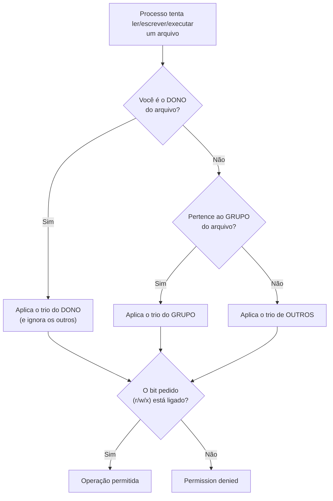

# 02.05 — Permissões e processos

> **Módulo 02 — Git e Linux** · Nível: N2 · Tempo estimado: 2h30 · Código: `codigo/cap05/`

## 1. Objetivo

- **Explicar** o modelo usuário/grupo/outros e a notação `rwx` (simbólica e numérica).
- **Aplicar** `chmod` para tornar um script executável — e **explicar** o `#!` (shebang) que o faz funcionar.
- **Listar e encerrar** processos com `ps`, `top`/`htop` e `kill`, ligando ao `Ctrl+C` do 01.10.
- **Reconhecer** quando `sudo` é necessário — e por que raramente deveria ser.

Ao final, seus scripts executam de verdade (pré-requisito do 02.07), e você entende por que o sistema recusa algumas operações — em vez de contornar com `sudo` no chute.

---

## 2. Pré-requisitos

- [02.04 — Pipes, redirecionamento e busca](04-pipes-redirecionamento-e-busca.md) — `ps aux | grep` é o primeiro uso real do pipe em diagnóstico.
- [01.10 — Laço `while`](../01-Python/10-laco-while.md) — o `Ctrl+C` que você usou para matar o loop infinito é o assunto formal deste capítulo.

**Autoteste:** (1) O que a primeira coluna do `ls -l` (aquele `drwxr-xr-x`) significa? (2) Como você interrompeu o loop infinito no 01.10? (3) O que acontece se você tentar executar um script `.sh` que acabou de criar? A terceira é a pergunta que abre o capítulo.

---

## 3. Motivação

Você escreveu quatro scripts de caderno nos capítulos anteriores e os executou sempre da mesma forma: `bash arquivo.sh`. Funciona — mas não é assim que ferramentas de verdade são usadas. Ninguém digita `bash git` para usar o Git; digita `git`. A diferença entre "um arquivo de texto que o bash lê" e "um comando do sistema" são duas coisas: **permissão de execução** e uma linha especial no topo do arquivo.

E tente adivinhar o que acontece ao criar `meu_script.sh` e rodar `./meu_script.sh`:

```text
bash: ./meu_script.sh: Permission denied
```

Essa mensagem é a porta de entrada de um assunto que parece burocrático e é, na verdade, o **sistema de segurança inteiro do Unix**: cada arquivo tem dono, grupo e um conjunto de permissões que decide quem pode ler, escrever e executar. Compreender isso resolve três classes de problema que você encontrará: scripts que não executam, arquivos que não deixam você editar, e — no módulo 09, num servidor real — a decisão sobre quais permissões dar a quê.

A segunda metade do capítulo trata do que está **rodando agora**. Você já matou um processo com Ctrl+C (o loop infinito do 01.10) sem saber o que aconteceu por baixo. Quando um programa trava sem responder ao Ctrl+C, ou quando o servidor fica lento e você precisa descobrir quem está consumindo o processador, a ferramenta é outra: listar processos, identificar o culpado pelo número, e encerrá-lo.

Este capítulo resolve isso assim: apresenta o modelo de permissões com as duas notações, faz seus scripts virarem comandos de verdade, mostra o ciclo de vida de um processo e os sinais que o encerram — e trata `sudo` com o respeito que ele merece.

---

## 4. Modelo mental

> 🧠 **Modelo mental**
> Cada arquivo tem uma **fechadura com três chaveiros**: um do **dono**, um do **grupo** e um de **todos os outros**. Cada chaveiro tem três chaves: **r** (ler), **w** (escrever/alterar) e **x** (executar). Quando você tenta algo, o sistema pergunta "quem é você para este arquivo?" — dono, membro do grupo ou outro — e olha **apenas aquele chaveiro**. Um processo, por sua vez, é um programa **em execução**: tem um número (PID), um dono, e pode receber **sinais** — sendo o Ctrl+C o mais educado deles ("por favor, termine") e o `kill -9` o mais brutal ("morra agora").

**Exercício de previsão.** Você vê esta saída do `ls -l`. Sem consultar nada, decida: quem pode fazer o quê com cada arquivo?

```text
-rw-r--r--  1 ana  dev   1240 jul 31 10:15 relatorio.py
-rwxr-xr-x  1 ana  dev    890 jul 31 10:20 backup.sh
drwxr-x---  2 ana  dev   4096 jul 31 10:22 privado
```

*Resposta comentada:* o `relatorio.py` (`rw-r--r--`) — a dona **ana** lê e escreve; o grupo **dev** e os outros apenas leem; **ninguém executa** (sem `x`). O `backup.sh` (`rwxr-xr-x`) — ana lê, escreve e executa; todos os demais leem e executam: é um script pronto para uso. E `privado` (`drwxr-x---`) — o `d` inicial diz que é **diretório**; ana tem tudo, o grupo entra e lista, e os outros **não têm acesso nenhum**. Se a primeira coluna era ruído para você até agora, ela acabou de virar informação.

---

## 5. Analogia

Permissões são o **crachá de um prédio corporativo**. Cada sala (arquivo) tem uma regra que define três níveis de acesso: o **responsável pela sala** (dono), o **departamento** dela (grupo) e **visitantes** (outros). E cada nível pode ter três autorizações independentes: entrar e olhar (leitura), mexer no conteúdo (escrita), e **usar os equipamentos** (execução).

O `sudo` é a **chave-mestra da administração predial**. Ela abre tudo — e é justamente por isso que não se anda com ela no bolso o dia inteiro: um engano com chave-mestra estraga o prédio, enquanto o mesmo engano com o crachá comum estraga apenas a sua sala.

**Onde a analogia quebra:** crachás protegem contra pessoas; permissões protegem também contra **você mesmo** — impedindo que um comando distraído altere arquivos do sistema. E há uma sutileza que a analogia não captura: em diretórios, o `x` não significa "executar", e sim **atravessar** (entrar na pasta). Uma pasta com `r` mas sem `x` deixa você ver a lista de nomes e não acessar nada dentro — comportamento estranho até você conhecer a regra.

---

## 6. Teoria

### Lendo a primeira coluna do `ls -l`

```text
-rwxr-xr-x
│└┬┘└┬┘└┬┘
│ │  │  └── outros: r-x (ler e executar)
│ │  └───── grupo:  r-x
│ └──────── dono:   rwx (tudo)
└────────── tipo:   - arquivo · d diretório · l link
```

| Letra | Em arquivo | Em diretório |
|---|---|---|
| `r` | ler o conteúdo | listar os nomes (`ls`) |
| `w` | alterar o conteúdo | criar/remover arquivos dentro |
| `x` | **executar** como programa | **entrar** (`cd`) e acessar o conteúdo |

A diferença do `x` em diretórios explica o comportamento estranho da analogia: sem `x`, você não atravessa a pasta — nem para acessar um arquivo cujo caminho você conhece.

### `chmod`: as duas notações

**Simbólica** (mais legível para mudanças pontuais):

```bash
chmod +x backup.sh          # adiciona execução para todos
chmod u+x backup.sh         # só para o dono (u=user, g=group, o=others, a=all)
chmod go-w arquivo.txt      # remove escrita de grupo e outros
chmod u=rw,go=r arquivo.txt # define exatamente
```

**Numérica** (mais rápida para definir tudo de uma vez): cada permissão vale um número — `r`=4, `w`=2, `x`=1 — e você soma:

| Número | Permissões | Significado |
|---|---|---|
| 7 | rwx | tudo |
| 6 | rw- | ler e escrever |
| 5 | r-x | ler e executar |
| 4 | r-- | só ler |
| 0 | --- | nada |

```bash
chmod 755 backup.sh         # dono: rwx (7) · grupo: r-x (5) · outros: r-x (5)
chmod 644 relatorio.py      # dono: rw- (6) · grupo e outros: r-- (4)
chmod 600 .env              # dono: rw- · ninguém mais vê (segredos!)
```

Os três números acima cobrem quase tudo na prática: **755** para scripts e pastas, **644** para arquivos comuns, **600** para arquivos com segredos.

### O shebang: o que torna um script um comando

Permissão de execução sozinha não é suficiente — o sistema precisa saber **com o quê** executar o arquivo. É o papel da primeira linha:

```bash
#!/usr/bin/env bash
```

O `#!` (*shebang*) diz ao sistema: "execute este arquivo com o programa a seguir". A forma `/usr/bin/env bash` é a preferida por ser portátil (encontra o bash onde quer que ele esteja). Com shebang + `chmod +x`, o arquivo vira comando:

```bash
chmod +x backup.sh
./backup.sh              # executa direto — sem 'bash' na frente
```

E o `./` na frente? Porque o shell só procura comandos nos diretórios do **PATH** (00.03 e, em detalhe, 02.06) — e a pasta atual **não está** no PATH, por segurança. O `./` diz "o programa é este daqui mesmo".

O mesmo vale para Python: um script com `#!/usr/bin/env python3` no topo e permissão de execução roda como `./relatorio.py` — o seu programa do módulo 01 pode virar um comando do sistema.

### Processos: o que está rodando

```bash
ps                      # processos do seu terminal atual
ps aux                  # TODOS os processos do sistema (formato completo)
ps aux | grep python    # filtrando com o pipe do 02.04
top                     # monitor em tempo real (q para sair)
htop                    # versão melhorada (se instalada)
```

A saída do `ps aux` traz as colunas que importam: **PID** (o número que identifica o processo), **%CPU** e **%MEM** (consumo), **COMMAND** (o que está rodando). O PID é o que você usa para agir.

### Sinais: como encerrar

```bash
kill 12345              # pede educadamente para terminar (sinal TERM)
kill -9 12345           # força o encerramento imediato (sinal KILL)
pkill -f "relatorio.py" # mata por nome/padrão do comando
```

O Ctrl+C que você usou no 01.10 envia o sinal **INT** ao processo em primeiro plano — e agora você sabe o que aconteceu: o Python recebeu o sinal, o converteu no `KeyboardInterrupt`, e o programa terminou exibindo o traceback.

A hierarquia de educação, do mais para o menos gentil:

| Ação | Sinal | O que faz | Quando |
|---|---|---|---|
| Ctrl+C | INT | interrompe o programa em primeiro plano | uso normal |
| `kill PID` | TERM | pede para terminar; o programa pode **limpar** antes de sair | padrão |
| `kill -9 PID` | KILL | encerra imediatamente; **sem chance de limpeza** | último recurso |

O `-9` é o último recurso justamente porque o programa não consegue fechar arquivos, gravar o que estava em memória nem liberar recursos — usá-lo por hábito é o caminho para dados corrompidos.

### `sudo`: a chave-mestra

```bash
sudo comando            # executa como administrador (pede sua senha)
```

Você precisa dele para: instalar programas no sistema, alterar arquivos fora da sua pasta pessoal (`/etc`, `/usr`), e gerenciar serviços. **Não** precisa dele para: trabalhar nos seus projetos, criar e executar scripts seus, usar Git, rodar Python.

> ⚠️ **Atenção**
> Se um comando falha com "permission denied" e você não sabe **por quê**, a resposta correta é investigar (`ls -l`, `whoami`), não repetir com `sudo`. O `sudo` no chute resolve o sintoma e cria dois problemas: pode alterar o dono de arquivos do seu projeto (quebrando-os para o seu usuário normal) e mascara um erro de configuração que voltará depois. A regra da trilha: **`sudo` só quando você sabe exatamente o que ele vai fazer**.

---

## 7. Funcionamento interno

Por dentro, na medida N2: o sistema guarda para cada arquivo um dono (UID), um grupo (GID) e 9 bits de permissão — os três trios que você lê no `ls -l`. Quando um processo tenta abrir um arquivo, o núcleo do sistema (*kernel*) compara o UID do processo com o do arquivo e aplica **apenas o trio correspondente**: se você é o dono, valem as permissões do dono — mesmo que o grupo tenha mais direitos. Sobre processos: cada um tem PID, dono, e uma tabela de descritores (os canais stdin/stdout/stderr do 01.07 e do 02.04). Quando o shell executa um comando, ele **duplica-se** e substitui a cópia pelo programa pedido — e é por isso que cada comando roda isolado, com suas próprias variáveis (o 02.06 explora a consequência disso). Os sinais são interrupções assíncronas entregues pelo kernel: TERM pode ser **capturado** pelo programa (que faz sua limpeza e sai — é o que o `finally` do 01.21 permitiria), enquanto KILL é tratado pelo próprio kernel e não chega ao programa — daí ser impossível "ignorar" um `kill -9`.

---

## 8. Visualização do fluxo

A decisão de permissão, do pedido ao veredito:



**Como ler:** o detalhe que surpreende está no primeiro ramo — **só um trio é consultado**. Se você é o dono e o trio do dono não tem escrita, você não escreve, mesmo que "outros" possam (situação incomum, mas possível). E note que o veredito final é sempre o mesmo bit: `Permission denied` não é ambíguo — significa que o trio aplicável não tinha o bit pedido, e o diagnóstico é `ls -l` + `whoami`.

---

## 9. Aplicação prática

Transformando seus scripts em comandos de verdade. Trabalhe na sua pasta de testes:

**Passo 1 — Crie um script e tente executá-lo:**

```bash
cd meus-testes/terminal
cat > ola.sh << 'FIM'
#!/usr/bin/env bash
echo "Olá do meu primeiro comando!"
FIM

./ola.sh
```

```text
bash: ./ola.sh: Permission denied
```

**Passo 2 — Investigue antes de agir:**

```bash
ls -l ola.sh
```

```text
-rw-r--r-- 1 voce voce 52 jul 31 15:02 ola.sh
```

Nenhum `x` em lugar nenhum — o arquivo é legível, mas não é executável. Diagnóstico completo em um comando.

**Passo 3 — Dê a permissão e execute:**

```bash
chmod +x ola.sh
ls -l ola.sh
./ola.sh
```

```text
-rwxr-xr-x 1 voce voce 52 jul 31 15:02 ola.sh
Olá do meu primeiro comando!
```

Você acabou de criar um comando. O `#!/usr/bin/env bash` disse **com o quê** executar; o `chmod +x` disse **que pode**.

**Passo 4 — O mesmo com Python:**

```bash
cat > saudacao.py << 'FIM'
#!/usr/bin/env python3
print("Olá do Python — sem digitar 'python' na frente!")
FIM

chmod +x saudacao.py
./saudacao.py
```

Seu relatório do módulo 01 pode receber o mesmo tratamento — e virar um comando que qualquer pessoa da Aurora executa sem saber que é Python.

**Passo 5 — Processos: veja o que está rodando:**

```bash
ps aux | head -5           # os primeiros processos do sistema
ps aux | grep -c ""        # quantos processos ao todo (o pipe do 02.04)
```

**Passo 6 — O experimento do sinal.** Em um terminal, rode um processo que não termina:

```bash
sleep 300      # dorme por 5 minutos, ocupando o terminal
```

Em **outro** terminal, encontre e encerre:

```bash
ps aux | grep "sleep 300" | grep -v grep     # acha o PID (o -v tira o próprio grep!)
kill PID_ENCONTRADO
```

No primeiro terminal, o `sleep` termina com a mensagem `Terminated`. Você acabou de fazer o que fará num servidor travado — e o `grep -v grep` é o detalhe profissional que evita encontrar o próprio comando de busca na lista.

> 🎯 **Checkpoint rápido**
> De cabeça: o que significa `chmod 755` em rwx? E por que um script com `chmod +x` mas **sem** shebang pode falhar de forma estranha?

---

## 10. Código comentado

Arquivo completo em [`codigo/cap05/permissoes_e_processos.sh`](codigo/cap05/permissoes_e_processos.sh).

```bash
#!/usr/bin/env bash
# ------------------------------------------------------------
# permissoes_e_processos.sh
# Capítulo 02.05 — Permissões e processos
# O que este arquivo demonstra: leitura de permissões, chmod,
#   shebang, e o ciclo listar/encerrar processos
# Como executar: bash permissoes_e_processos.sh
# ------------------------------------------------------------

set -e

PASTA="permissoes_temporaria"

echo "--- 1. Criando o cenário ---"
mkdir -p "$PASTA"
cd "$PASTA"

# Um script COM shebang, mas sem permissão de execução ainda
cat > ola.sh << 'FIM'
#!/usr/bin/env bash
echo "  (saída do script) Olá do meu comando!"
FIM

echo "Permissões recém-criadas:"
ls -l ola.sh
# Repare: -rw-r--r-- (644) — nenhum 'x' em lugar nenhum

echo
echo "--- 2. Tentando executar SEM permissão ---"
# O || evita que o 'set -e' interrompa o script na falha esperada
./ola.sh 2>/dev/null || echo "  -> Permission denied (esperado!)"

echo
echo "--- 3. Dando a permissão (chmod) e executando ---"
chmod +x ola.sh
echo "Depois do chmod +x:"
ls -l ola.sh          # agora -rwxr-xr-x (755)
./ola.sh              # e agora executa

echo
echo "--- 4. As duas notações do chmod ---"
touch arquivo_comum.txt segredo.env
chmod 644 arquivo_comum.txt     # dono rw- · grupo r-- · outros r--
chmod 600 segredo.env           # dono rw- · mais ninguém (segredos!)
ls -l arquivo_comum.txt segredo.env
echo "  644 = arquivo comum · 755 = script/pasta · 600 = segredo"

echo
echo "--- 5. Um script Python vira comando ---"
cat > saudacao.py << 'FIM'
#!/usr/bin/env python3
print("  (saída do Python) Rodei sem digitar 'python' na frente!")
FIM
chmod +x saudacao.py
./saudacao.py

echo
echo "--- 6. Processos: quem está rodando ---"
echo "  PID deste script: $$"
echo "Total de processos no sistema:"
ps aux | tail -n +2 | wc -l      # tail -n +2 pula o cabeçalho (02.03!)

echo
echo "--- 7. Ciclo completo: criar, achar e encerrar um processo ---"
sleep 60 &                       # o & roda em segundo plano
PID_SLEEP=$!                     # $! guarda o PID do último comando em background
echo "  Iniciei um 'sleep 60' com PID $PID_SLEEP"
ps -p "$PID_SLEEP" -o pid,comm   # confirma que existe
kill "$PID_SLEEP"                # pede para terminar (sinal TERM)
sleep 0.2
echo "  Após o kill, o processo ainda existe?"
ps -p "$PID_SLEEP" > /dev/null 2>&1 && echo "  sim" || echo "  não — encerrado ✓"

echo
echo "--- 8. Limpeza ---"
cd ..
rm -r "$PASTA"
echo "Cenário removido."
```

---

## 11. Erros comuns

### Erro 1 — `Permission denied` ao executar script

**Sintoma:**

```text
bash: ./backup.sh: Permission denied
```

**Causa:** o arquivo não tem o bit `x` — foi criado como arquivo comum (644).
**Correção:** `chmod +x backup.sh`. E o diagnóstico que confirma antes: `ls -l backup.sh` mostra a ausência do `x`. Guarde a sequência: erro → `ls -l` → `chmod` → executar. (Se o erro persistir mesmo com `x`, o suspeito é o shebang — Erro 2.)

### Erro 2 — Shebang ausente ou errado

**Sintoma:** varia de forma confusa — o script executa "com o interpretador errado" e produz erros absurdos:

```text
./relatorio.py: line 3: syntax error near unexpected token `('
```

(o shell tentou interpretar código Python como comandos de shell)
**Causa:** sem `#!`, o sistema executa o arquivo com o **shell padrão**; com shebang errado (caminho inexistente), a mensagem é `bad interpreter`.
**Correção:** primeira linha `#!/usr/bin/env bash` ou `#!/usr/bin/env python3`. E um detalhe que causa horas de sofrimento: se o arquivo foi salvo no Windows com quebras de linha CRLF, o shebang quebra (`bad interpreter: /usr/bin/env bash^M`) — a correção é salvar com quebras Unix (LF), configurável no VS Code no canto inferior direito.

### Erro 3 — `sudo` como resposta automática

**Sintoma:** o comando "funciona" com `sudo` — e depois seu projeto quebra: arquivos passam a pertencer ao administrador, e você não consegue mais editá-los sem `sudo`.
**Causa:** usar `sudo` para contornar um erro cuja causa não foi investigada. Cada arquivo criado com `sudo` fica com dono `root`.
**Correção:** investigue primeiro (`ls -l`, `whoami`, `pwd`) — na esmagadora maioria dos casos você está no lugar errado ou faltou `chmod`, e `sudo` não era necessário. Se já aconteceu, conserte o dono: `sudo chown -R seu_usuario:seu_usuario pasta/`. Regra: **dentro do seu projeto, `sudo` nunca deveria ser necessário**.

---

## 12. Boas práticas

✅ **`ls -l` antes de qualquer diagnóstico de permissão** — a informação está toda ali, e o palpite custa mais que o comando.

✅ **Shebang em todo script, sempre `#!/usr/bin/env programa`** — portátil entre sistemas, e transforma o arquivo em comando de verdade.

✅ **Os três números que resolvem 95% dos casos: 755 (scripts e pastas), 644 (arquivos), 600 (segredos)** — decorar a tabela inteira é desnecessário.

✅ **`kill` antes de `kill -9`** — dê ao programa a chance de fechar arquivos e gravar o que estava em memória.

❌ **Evite `chmod 777`** — dar tudo a todos é a solução preguiçosa que vira falha de segurança; se 777 "resolveu", o problema era outro e continua lá.

❌ **Evite `sudo` sem saber por quê** — investigue; e nunca use `sudo` para operar dentro do seu próprio projeto.

---

## 13. Performance

Nesta escala, irrelevante — verificar permissão é uma operação de nanossegundos que o sistema faz milhões de vezes por segundo. As notas úteis são de outra natureza. **Processos custam memória**: cada um tem seu espaço, e é por isso que o `ps aux` num servidor mostra centenas de linhas e o consumo total importa (no módulo 08, containers existem justamente para limitar isso). E o `kill -9` tem um **custo escondido**: o programa morre sem gravar buffers — num banco de dados ou num arquivo sendo escrito, isso significa dados corrompidos ou perdidos. O TERM educado dá ao programa a chance de fazer o `finally` (01.21) do mundo real. É o mesmo raciocínio do `with` do 01.22: encerramento limpo importa.

---

## 14. Mercado

> 🏢 **Mercado**
> Permissões são assunto diário em servidores: um deploy que falha porque o usuário da aplicação não pode escrever na pasta de logs, um script agendado que não executa por falta do bit `x`, um arquivo `.env` com segredos que **precisa** ser 600 (se estiver 644, qualquer usuário do servidor lê suas senhas — e auditorias de segurança reprovam isso). O trio 755/644/600 aparece em documentação de deploy de praticamente todo projeto. Já processos são o instrumental de incidente: "o servidor está lento" começa com `top`, identifica o processo, e decide entre encerrar ou investigar. E `sudo` é assunto de cultura: times maduros operam com o mínimo privilégio necessário (o *princípio do menor privilégio*), e containers (módulo 08) levam isso ao extremo — rodar como root dentro de container é apontado como falha em qualquer revisão de segurança.
>
> **Mini-cenário:** quando o Atlas for para o servidor (módulo 09), três decisões deste capítulo aparecerão no roteiro de deploy: o script de inicialização precisa de `chmod +x`, o arquivo de configuração com a senha do banco precisa de `chmod 600`, e a aplicação **não** deve rodar como root. As três em duas linhas de documentação — e as três reprovadas em auditoria se erradas.

---

## 15. Entrevistas

**P1. "Explique `chmod 755`."**
*Resposta esperada:* três dígitos para dono/grupo/outros, somando r=4, w=2, x=1 — logo 7 (rwx) para o dono, 5 (r-x) para grupo e outros. Uso típico: scripts e diretórios. Complemento que mostra prática: 644 para arquivos comuns e 600 para arquivos com segredos, e a menção a `chmod +x` como forma simbólica equivalente para o caso mais comum.

**P2. "Qual a diferença entre `kill` e `kill -9`?"**
*Resposta esperada:* `kill` envia TERM — o programa **pode capturar** o sinal, fechar arquivos, gravar estado e sair de forma limpa; `kill -9` envia KILL, tratado pelo kernel, que encerra imediatamente sem dar chance de limpeza. Consequência: `-9` pode corromper dados em programas que escrevem arquivos ou mantêm estado. Ordem correta: TERM primeiro, KILL só se não responder.

**P3. "Um script não executa com `./script.sh`. Como você diagnostica?"**
*Resposta esperada:* sequência: `ls -l` (tem bit `x`?) → `chmod +x` se faltar → verificar o **shebang** na primeira linha → verificar quebras de linha (CRLF quebra o shebang em arquivos vindos do Windows) → confirmar que está na pasta certa (`pwd`). Citar o `./` e explicar por que ele é necessário (a pasta atual não está no PATH, por segurança) demonstra entendimento, não decoreba.

**Pegadinha clássica: "Você tem permissão de leitura (`r`) numa pasta, mas não de execução (`x`). O que consegue fazer?"**
Ela derruba quem só decorou "r = ler". A resposta: você consegue **listar os nomes** dos arquivos (`ls`) e **nada mais** — não consegue entrar na pasta (`cd`), nem ler os arquivos de dentro, mesmo sabendo o nome exato e mesmo que os arquivos tenham permissão de leitura. Isso porque, em diretórios, o `x` significa **atravessar**: sem ele, o caminho não pode ser percorrido. Fechar com o inverso, que é ainda mais curioso: com `x` mas sem `r`, você **não pode listar** o conteúdo, mas **pode acessar** um arquivo cujo nome você já conheça — é assim que se criam diretórios "por convite", cujo conteúdo só é acessível a quem sabe o caminho exato.

---

## 16. Exercícios guiados

Enunciados completos em [`exercicios/cap05.md`](exercicios/cap05.md); gabaritos em [`exercicios/gabaritos/cap05.md`](exercicios/gabaritos/cap05.md).

### Aquecimento

- **A1** `[~10 min · lendo permissões]` — 6 saídas de `ls -l`: quem pode fazer o quê?
- **A2** `[~10 min · traduzindo notações]` — Converta 8 casos entre simbólico e numérico.
- **A3** `[~5 min · qual comando?]` — 5 intenções: qual `chmod` resolve?
- **A4** `[~10 min · diagnóstico]` — 4 falhas de execução: causa e sequência de investigação.

### Aplicação

- **AP1** `[~20 min · seu primeiro comando]` — Transforme um script seu (shell e Python) em comando executável, testando cada etapa.
- **AP2** `[~20 min · o caçador de processos]` — Crie, encontre e encerre 3 processos, praticando `ps`, `grep -v grep` e `kill`.
- **AP3** `[~15 min · permissões de projeto]` — Aplique 755/644/600 aos arquivos certos de um projeto simulado, justificando cada escolha.

---

## 17. Desafios

- **D1** `[~40 min · o auditor de permissões]` — **Revisão de segurança do seu repositório.** Percorra o repositório do Manual Mestre e produza um relatório: (a) quais arquivos são executáveis (`find . -type f -perm -u+x`) — algum deveria ou não deveria ser? (b) existe algum arquivo com permissões amplas demais (777, ou escrita para "outros")? (c) se você tivesse um arquivo `.env` com a senha do banco, que permissão ele deveria ter — e o que aconteceria se estivesse 644 num servidor compartilhado? (d) seus scripts de shell têm shebang e bit `x`? Corrija o que estiver errado, registrando cada comando. Fecho: 5 linhas sobre o princípio do menor privilégio e por que ele aparece em auditorias.

<details><summary>💡 Dica 1 (conceito)</summary>
`find . -type f -perm -u+x` lista arquivos com execução para o dono. Compare com o que **deveria** ser executável (scripts) — arquivos `.md` e `.csv` executáveis são ruído (ou sinal de cópia do Windows).
</details>
<details><summary>💡 Dica 2 (estratégia)</summary>
Para (b): `find . -perm -o+w` acha arquivos graváveis por qualquer um — o achado mais grave possível numa auditoria.
</details>
<details><summary>💡 Dica 3 (esqueleto)</summary>
Tabela: achado · comando que revelou · risco · correção aplicada. Fecho com o princípio.
</details>

---

## 18. Mini projeto

**Seus scripts viram ferramentas** `[~50 min]` — o repertório do módulo transformado em comandos de verdade.

Requisitos numerados:

1. Pegue os quatro scripts de caderno que você executou nos capítulos 02.01–02.04 (ou reescreva versões suas) e transforme cada um em **comando executável**: shebang correto, `chmod +x`, execução com `./`.
2. Transforme também o `relatorio_aurora.py` (01.25) num comando: shebang `#!/usr/bin/env python3`, permissão, e teste rodando `./relatorio_aurora.py` de dentro da pasta.
3. Crie um script `verificar_permissoes.sh` que, dado um caminho, imprima um pequeno relatório: quantos arquivos, quantos executáveis, quantos com escrita para outros — usando `find`, pipes e `wc` (02.04).
4. Documente no caderno de bordo: a tabela dos três números (755/644/600) com um exemplo real seu de cada, e os dois problemas que você encontrou ao tornar os scripts executáveis (haverá pelo menos um — shebang, quebra de linha ou caminho).
5. Registre a diferença prática: quantos caracteres você digitava antes (`bash caminho/script.sh`) e quantos digita agora (`./script.sh`) — e o que muda quando o script vai para um servidor.

**Critério de "está bom":** os cinco scripts executando com `./`; o `verificar_permissoes.sh` funcionando em pelo menos duas pastas diferentes; os problemas encontrados documentados com a solução. Guarde o `verificar_permissoes.sh` — ele volta no 02.07, quando você aprender a passar argumentos e torná-lo genérico.

---

## 19. Revisão

**Resumo do capítulo:**

- Permissões: três trios (**dono / grupo / outros**) × três bits (**r / w / x**); em diretórios, `x` significa **atravessar**, não executar.
- `chmod` simbólico (`+x`, `u+w`, `go-r`) para ajustes pontuais; numérico (soma r=4, w=2, x=1) para definir tudo: **755** scripts e pastas, **644** arquivos, **600** segredos.
- **Shebang** (`#!/usr/bin/env bash|python3`) diz **com o quê** executar; `chmod +x` diz **que pode**; o `./` é necessário porque a pasta atual não está no PATH.
- Processos: `ps aux` lista, `top`/`htop` monitora, PID identifica; `ps aux | grep X | grep -v grep` é o idioma da busca.
- Sinais: Ctrl+C (INT) → `kill` (TERM, permite limpeza) → `kill -9` (KILL, imediato e sem limpeza — último recurso).
- `sudo` só quando você sabe exatamente o que ele fará; dentro do seu projeto, nunca deveria ser necessário — e `chmod 777` é solução preguiçosa que vira falha de segurança.

**Flashcards novos** (adicionados a [`revisao/flashcards.md`](revisao/flashcards.md)):

| ID | Frente | Verso |
|---|---|---|
| 02.05-F1 | O que significa `-rwxr-xr-x` — e qual o número equivalente? | Arquivo (`-`); dono rwx, grupo r-x, outros r-x → **755**. Soma: r=4, w=2, x=1. |
| 02.05-F2 | Explique com suas palavras: o que o `x` significa num diretório? | (Elaboração) **Atravessar** (entrar e acessar o conteúdo), não executar. Sem `x`, você pode até listar nomes (se tiver `r`), mas não acessa nada dentro. |
| 02.05-F3 | Preveja: script com `chmod +x` mas sem shebang, executado com `./`. O que acontece? | (Previsão) O sistema usa o shell padrão para interpretar — se for código Python, produz erros de sintaxe absurdos. Shebang diz COM O QUÊ executar. |
| 02.05-F4 | Diferença entre `kill` e `kill -9` — e por que a ordem importa? | (Decisão) `kill` (TERM) pode ser capturado: o programa fecha arquivos e sai limpo. `kill -9` (KILL) é imediato, sem limpeza — risco de dados corrompidos. TERM primeiro, sempre. |
| 02.05-F5 | Quais são os três números de permissão que resolvem quase tudo? | **755** (scripts e pastas: dono tudo, demais leem e executam) · **644** (arquivos comuns) · **600** (segredos: só o dono lê e escreve). |

**Agendamento:** registre no `PROGRESSO.md` e marque D+1, D+7, D+30, D+90 na [`Revisoes/agenda.md`](../Revisoes/agenda.md).

---

## 20. Checklist

Perguntas de domínio — teste do sim:

- [ ] Sei ler *a primeira coluna do `ls -l` e dizer quem pode o quê*?
- [ ] Sei usar *as duas notações do `chmod` e escolher entre 755/644/600*?
- [ ] Sei explicar *o papel do shebang e por que o `./` é necessário*?
- [ ] Sei encontrar e encerrar *um processo pelo PID, na ordem TERM → KILL*?
- [ ] Sei responder *à pegadinha do diretório com `r` mas sem `x`*?

Itens práticos:

- [ ] Rodei `permissoes_e_processos.sh` e vi o `Permission denied` esperado virar execução.
- [ ] Transformei um script Python meu em comando executável.
- [ ] Fiz o experimento do `sleep` + `kill` com dois terminais.
- [ ] Completei "Seus scripts viram ferramentas" (5 requisitos).
- [ ] Registrei a sessão e agendei as 4 revisões.

---

## 21. Próximo capítulo

Você deu permissão de execução aos seus scripts — e ainda precisa digitar `./` na frente deles, porque o sistema não os encontra pelo nome. Ficou deliberadamente em aberto o mecanismo que decide **onde o sistema procura programas**: o **PATH**, mencionado desde o 00.03 como "a agenda de endereços do terminal" e nunca aberto. O próximo capítulo fecha esse arco, apresenta as variáveis de ambiente que configuram todo o seu ambiente de trabalho, e antecipa o princípio que o módulo 06 formalizará: **configuração vive fora do código** — inclusive (e principalmente) senhas.

→ [02.06 — Variáveis de ambiente e PATH](06-variaveis-de-ambiente-e-path.md)

---

*Gerado sob spec 3.0.0*
