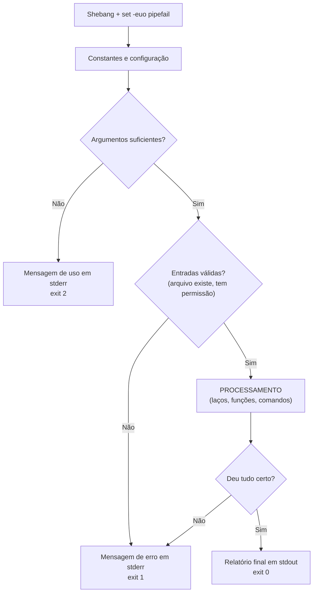

# 02.07 — Scripts de shell

> **Módulo 02 — Git e Linux** · Nível: N2 · Tempo estimado: 3h00 · Código: `codigo/cap07/`

## 1. Objetivo

- **Escrever** scripts de shell com variáveis, argumentos, condicionais e laços.
- **Aplicar** o cabeçalho de segurança (`set -euo pipefail`) e explicar cada opção.
- **Validar** entradas e comunicar falhas pelo código de saída.
- **Automatizar** uma tarefa real e repetitiva do seu fluxo de trabalho.

Ao final, você transforma sequências de comandos em ferramentas reutilizáveis — e entende por que shell é a linguagem de cola da infraestrutura.

---

## 2. Pré-requisitos

- [02.06 — Variáveis de ambiente e PATH](06-variaveis-de-ambiente-e-path.md) — variáveis, `export`, shebang, e a pasta do PATH onde seus scripts vão morar.
- [01.09 — Condicionais](../01-Python/09-condicionais.md) e [01.11 — Laço for e range](../01-Python/11-laco-for-e-range.md) — a **lógica** é a mesma; muda a sintaxe.

**Autoteste:** (1) O que faz `if not lista:` em Python? (2) Como você percorre uma lista de nomes em Python? (3) O que é um shebang? Se as três saem sem hesitação, este capítulo é tradução, não conceito novo.

---

## 3. Motivação

Você tem um repertório de umas trinta ferramentas de terminal e um ambiente configurado. E toda vez que quer verificar o estado do seu estudo — quantos capítulos existem, quantos scripts rodam, se algum arquivo ficou sem par de exercício — você digita a mesma sequência de seis ou sete comandos, de memória, com pequenas variações a cada vez.

Isso tem três problemas, e são os mesmos do 01.18, quando você aprendeu funções: **repetição** (o mesmo trabalho todo dia), **inconsistência** (a sequência nunca sai idêntica) e **intransmissibilidade** (você não consegue entregar "a sequência" a outra pessoa, só descrevê-la). Em Python, a solução foi a função. Aqui, é o script.

Mas há um motivo maior, e ele é sobre a sua carreira. Em engenharia de dados e backend, shell é a **linguagem de cola**: o que executa o pipeline às 3 da manhã, o que prepara o ambiente antes do container subir, o que roda no passo do CI, o que faz o backup do banco antes da migração. Você não vai escrever sistemas em shell — vai escrever os **cem scripts de vinte linhas** que fazem o resto funcionar. E vai **ler** muitos mais: todo projeto sério tem `entrypoint.sh`, `deploy.sh`, `wait-for-it.sh`, e não saber lê-los é ficar dependente de quem sabe.

Este capítulo resolve isso assim: apresenta a sintaxe de shell a partir do que você já sabe de Python (condicional, laço, argumento, função), acrescenta o cabeçalho de segurança que separa script amador de script profissional, e termina com uma ferramenta de verdade que você vai usar para monitorar o próprio progresso na trilha.

---

## 4. Modelo mental

> 🧠 **Modelo mental**
> Um script de shell é uma **receita para o terminal**: as mesmas linhas que você digitaria, salvas em ordem. A diferença em relação a uma linguagem de programação é a matéria-prima: em Python você manipula **objetos**; em shell você orquestra **programas**, e a moeda de troca entre eles é **texto** (pelos pipes) mais um **número de saída** (0 = deu certo, qualquer outro = falhou). Todo `if` em shell é, no fundo, uma pergunta sobre esse número. Por isso shell é excelente para **coordenar** ferramentas e desconfortável para **calcular** — quando a lógica cresce, a resposta certa é chamar Python.

**Exercício de previsão.** Um script tem estas três linhas, e a primeira falha (o arquivo não existe):

```bash
cp dados.csv backup/
rm dados.csv
echo "Backup concluído"
```

Sem rodar, decida: o que acontece com as linhas 2 e 3?

*Resposta comentada:* elas **executam normalmente** — e o script apaga o arquivo sem ter feito o backup, anunciando sucesso. Por padrão, o shell **ignora falhas** e segue em frente, comportamento herdado de quando scripts eram sequências interativas. É o motivo de existir o `set -e` da seção 6, e a razão pela qual essa opção é a primeira linha de todo script sério. Se você previu "o script para na linha 1", você previu o comportamento **desejável**, não o padrão.

---

## 5. Analogia

Um script de shell é uma **linha de montagem com um supervisor distraído**. Cada estação (comando) faz seu trabalho e passa a peça adiante; o supervisor anota se a estação reportou sucesso ou falha — e, por padrão, **não interrompe a linha** quando algo falha. A peça defeituosa segue até o fim, e o produto sai errado com carimbo de aprovado.

O `set -e` é você instruindo o supervisor a **parar a linha ao primeiro defeito**. O `set -u` é proibir estações de trabalhar com peça que ninguém entregou (variável não definida). O `pipefail` é fazer o supervisor olhar a esteira **inteira**, e não só a última estação — porque numa esteira de três máquinas, se a primeira quebra e a última funciona, o padrão do shell reporta sucesso.

**Onde a analogia quebra:** linhas de montagem produzem peças idênticas; scripts lidam com entradas variáveis — e a maior parte do trabalho de um bom script é **validar** o que chegou antes de processar. E há um detalhe que a analogia esconde: mesmo com o supervisor atento, algumas falhas continuam invisíveis (comandos dentro de `if`, por exemplo, não disparam o `set -e` — por design, senão nenhum teste funcionaria).

---

## 6. Teoria

### O esqueleto de todo script

```bash
#!/usr/bin/env bash
# ------------------------------------------------------------
# nome.sh — o que faz
# Uso: ./nome.sh <argumento>
# ------------------------------------------------------------

set -euo pipefail          # o cabeçalho de segurança

# ... o script ...
```

O cabeçalho merece explicação linha a linha, porque é o que separa amador de profissional:

| Opção | O que faz | Sem ela |
|---|---|---|
| `set -e` | encerra ao primeiro comando que falha | o script segue depois do erro (o desastre da seção 4) |
| `set -u` | erro ao usar variável não definida | um nome digitado errado vira string vazia — e `rm -r "$PAST/"` vira `rm -r /` |
| `set -o pipefail` | um pipe falha se **qualquer** parte falhar | só o último comando da esteira conta |

O `set -u` é o mais subestimado: sem ele, um erro de digitação em nome de variável não produz erro nenhum, só comportamento silenciosamente errado — exatamente a classe de bug mais cara.

### Variáveis e argumentos

```bash
NOME="Aurora"                    # sem espaços em volta do = !
echo "Olá, $NOME"
echo "Arquivos: $(ls | wc -l)"   # $(...) captura a saída de um comando

echo "Nome do script: $0"
echo "Primeiro argumento: $1"
echo "Segundo argumento: $2"
echo "Quantos argumentos: $#"
echo "Todos: $@"
```

Chamado como `./relatorio.sh vendas.csv 2024`, o script recebe `$1="vendas.csv"` e `$2="2024"`. É o equivalente aos parâmetros de função do 01.18 — com a diferença de que **tudo é texto** e nada é validado automaticamente.

> ⚠️ **Atenção**
> **Sempre entre aspas duplas:** `"$1"`, `"$ARQUIVO"`, `"$@"`. Sem aspas, um nome de arquivo com espaço (`Relatório de vendas.csv`) vira três argumentos, e o script processa arquivos que não existem. É a causa número um de bugs em shell — e a razão de o `shellcheck` (seção 12) reclamar disso antes de qualquer outra coisa.

### Condicionais

```bash
if [ "$#" -eq 0 ]; then
    echo "Uso: $0 <arquivo>" >&2      # mensagens de erro vão para stderr!
    exit 1                             # código diferente de 0 = falhou
fi

if [ -f "$1" ]; then
    echo "É um arquivo"
elif [ -d "$1" ]; then
    echo "É um diretório"
else
    echo "Não existe" >&2
    exit 1
fi
```

Os testes que resolvem quase tudo:

| Teste | Verdadeiro quando |
|---|---|
| `-f arquivo` | existe e é arquivo comum |
| `-d pasta` | existe e é diretório |
| `-r` / `-w` / `-x` | tem permissão de leitura / escrita / execução (02.05) |
| `-z "$VAR"` | a variável está **vazia** |
| `-n "$VAR"` | a variável **não** está vazia |
| `"$A" = "$B"` | textos iguais (`!=` para diferentes) |
| `"$A" -eq "$B"` | números iguais (`-ne -lt -gt -le -ge`) |

A distinção entre `=` (texto) e `-eq` (número) é a pegadinha clássica: `[ "01" = "1" ]` é **falso**, `[ "01" -eq "1" ]` é **verdadeiro**.

### Laços

```bash
for arquivo in *.csv; do             # percorre o resultado do curinga (02.02)
    echo "Processando $arquivo"
done

for cidade in campinas sorocaba santos; do
    echo "Relatório de $cidade"
done

for numero in {1..5}; do             # sequência
    echo "Tentativa $numero"
done

while read -r linha; do              # lê linha a linha (o -r é obrigatório)
    echo "Linha: $linha"
done < arquivo.txt
```

O `while read` é o idioma para processar arquivos linha a linha — o equivalente shell do `for linha in arquivo:` do 01.22.

### Funções

```bash
registrar() {
    echo "[$(date '+%H:%M:%S')] $1"
}

registrar "Iniciando processamento"
registrar "Concluído"
```

Sem `def`, sem lista de parâmetros: os argumentos chegam como `$1`, `$2`, exatamente como no script. E o retorno é o **código de saída**, não um valor — para "devolver" dados, a função imprime e quem chama captura com `$(...)`.

### Código de saída: a comunicação com o mundo

```bash
exit 0      # sucesso
exit 1      # erro genérico
exit 2      # erro de uso (argumentos)
```

Todo programa devolve um número ao terminar. Você já o usa sem saber: é o que faz `comando1 && comando2` executar o segundo só se o primeiro deu certo, e o que o `set -e` observa. Numa automação (módulo 09), é assim que o sistema decide se o passo passou ou falhou — e um script que erra **silenciosamente com exit 0** faz um pipeline inteiro reportar sucesso sobre um desastre.

```bash
echo "$?"                    # o código do último comando executado
comando && echo "deu certo"  # executa se o anterior devolveu 0
comando || echo "falhou"     # executa se o anterior devolveu != 0
```

### Validação: o começo de todo script bom

```bash
if [ "$#" -lt 1 ]; then
    echo "Uso: $0 <arquivo.csv> [separador]" >&2
    exit 2
fi

ARQUIVO="$1"
SEPARADOR="${2:-;}"                  # valor padrão se não vier o argumento!

if [ ! -f "$ARQUIVO" ]; then
    echo "Erro: arquivo '$ARQUIVO' não encontrado." >&2
    exit 1
fi
```

O `${2:-;}` é o `get` com padrão do 01.15, em sintaxe de shell: usa `$2` se existir, senão `;`. E repare no padrão completo — **valide primeiro, processe depois** —, o mesmo dos *guard clauses* do 01.09.

---

## 7. Funcionamento interno

Por dentro, na medida N2: ao executar `./script.sh`, o sistema lê o shebang, inicia um novo processo do interpretador indicado e entrega o arquivo para ele. O bash então lê o script **linha a linha, interpretando na hora** — não há compilação nem verificação prévia, e é por isso que um erro de sintaxe na linha 50 só aparece depois que as 49 primeiras já executaram (um `mkdir` já foi feito, um arquivo já foi apagado). A consequência prática: scripts destrutivos devem validar tudo **no começo**. Cada comando externo (`ls`, `grep`, `cut`) é um processo novo, com o custo de criação que isso implica — daí a orientação da seção 13 sobre laços que chamam comandos milhares de vezes. E o `set -e` funciona observando o código de saída de cada comando, com exceções deliberadas: comandos dentro de `if`, à esquerda de `&&`/`||`, ou negados com `!` não disparam o encerramento — senão nenhuma verificação condicional seria possível.

---

## 8. Visualização do fluxo

A anatomia de um script bem escrito:



**Como ler:** de cima para baixo, o script gasta as duas primeiras decisões **validando** e só então processa — a mesma ordem dos guard clauses do 01.09. Repare que **todas** as saídas de erro vão para stderr com código diferente de zero (a esquerda do diagrama), e a saída boa vai para stdout com zero: é essa separação, do 02.04, que permite `./script.sh > resultado.txt` sem misturar erro com resultado, e que faz o passo de um pipeline saber se passou.

---

## 9. Aplicação prática

Construindo um script de verdade, em quatro passos incrementais.

**Passo 1 — O mínimo que já funciona:**

```bash
#!/usr/bin/env bash
set -euo pipefail

echo "Relatório gerado em $(date '+%d/%m/%Y %H:%M')"
echo "Arquivos CSV nesta pasta: $(ls -1 *.csv 2>/dev/null | wc -l)"
```

**Passo 2 — Recebendo e validando argumentos:**

```bash
#!/usr/bin/env bash
set -euo pipefail

if [ "$#" -lt 1 ]; then
    echo "Uso: $0 <arquivo.csv> [separador]" >&2
    exit 2
fi

ARQUIVO="$1"
SEPARADOR="${2:-;}"

if [ ! -f "$ARQUIVO" ]; then
    echo "Erro: '$ARQUIVO' não encontrado." >&2
    exit 1
fi

echo "Analisando $ARQUIVO (separador '$SEPARADOR')"
echo "Linhas: $(wc -l < "$ARQUIVO")"
```

**Passo 3 — Laço e função:**

```bash
registrar() {
    echo "[$(date '+%H:%M:%S')] $1"
}

registrar "Início"
for arquivo in *.csv; do
    [ -f "$arquivo" ] || continue          # protege contra "nenhum arquivo"
    registrar "  $arquivo: $(wc -l < "$arquivo") linhas"
done
registrar "Fim"
```

O `[ -f "$arquivo" ] || continue` cobre um detalhe traiçoeiro: quando **nenhum** arquivo corresponde ao curinga, o shell entrega o padrão literal (`*.csv`) como se fosse um nome — e o laço tenta processar um arquivo chamado `*.csv`.

**Passo 4 — Testando o comportamento:**

```bash
./analisar.sh                        # sem argumentos → uso + exit 2
echo "$?"                            # 2

./analisar.sh inexistente.csv        # → erro + exit 1
echo "$?"                            # 1

./analisar.sh vendas.csv             # → funciona
echo "$?"                            # 0

./analisar.sh vendas.csv > saida.txt # só o resultado vai ao arquivo;
                                     # erros continuam na tela (02.04)
```

Esse passo 4 é o que a maioria pula — e é o que garante que o script se comporta bem quando algo dá errado, que é justamente quando ele importa.

> 🎯 **Checkpoint rápido**
> De cabeça: por que `PASTA="dados"` seguido de `rm -r "$PATSA/"` (digitado errado) é catastrófico sem `set -u` — e o que exatamente acontece?

---

## 10. Código comentado

Arquivo completo em [`codigo/cap07/verificar_manual.sh`](codigo/cap07/verificar_manual.sh) — uma ferramenta de verdade, que audita a estrutura de um módulo do Manual Mestre.

```bash
#!/usr/bin/env bash
# ------------------------------------------------------------
# verificar_manual.sh
# Capítulo 02.07 — Scripts de shell
# O que este arquivo demonstra: validação de argumentos, funções,
#   laços, condicionais e código de saída num script útil de verdade
# Uso: ./verificar_manual.sh <pasta-do-modulo>
# ------------------------------------------------------------

set -euo pipefail

# --- 1. Validação de argumentos (antes de qualquer processamento) ---
if [ "$#" -lt 1 ]; then
    echo "Uso: $0 <pasta-do-modulo>" >&2
    echo "Exemplo: $0 02-Git-Linux" >&2
    exit 2
fi

PASTA="$1"

if [ ! -d "$PASTA" ]; then
    echo "Erro: '$PASTA' não é uma pasta existente." >&2
    exit 1
fi

# --- 2. Funções auxiliares ---
registrar() {
    echo "[$(date '+%H:%M:%S')] $1"
}

# Conta capítulos (arquivos NN-nome.md, exceto o 00-visao)
contar_capitulos() {
    find "$1" -maxdepth 1 -name "[0-9][0-9]-*.md" \
        -not -name "00-visao*" | wc -l
}

# --- 3. Coleta de dados ---
registrar "Auditando: $PASTA"
echo

CAPITULOS=$(contar_capitulos "$PASTA")
EXERCICIOS=$(find "$PASTA/exercicios" -maxdepth 1 -name "cap*.md" 2>/dev/null | wc -l)
GABARITOS=$(find "$PASTA/exercicios/gabaritos" -name "cap*.md" 2>/dev/null | wc -l)
SCRIPTS=$(find "$PASTA/codigo" -name "*.sh" 2>/dev/null | wc -l)

echo "  Capítulos:  $CAPITULOS"
echo "  Exercícios: $EXERCICIOS"
echo "  Gabaritos:  $GABARITOS"
echo "  Scripts:    $SCRIPTS"
echo

# --- 4. Verificações (cada uma pode registrar um problema) ---
PROBLEMAS=0

registrar "Verificando pares capítulo/exercício..."
if [ "$CAPITULOS" -ne "$EXERCICIOS" ]; then
    echo "  ! $CAPITULOS capítulos para $EXERCICIOS exercícios" >&2
    PROBLEMAS=$((PROBLEMAS + 1))
else
    echo "  OK: todo capítulo tem exercício"
fi

if [ "$EXERCICIOS" -ne "$GABARITOS" ]; then
    echo "  ! $EXERCICIOS exercícios para $GABARITOS gabaritos" >&2
    PROBLEMAS=$((PROBLEMAS + 1))
else
    echo "  OK: todo exercício tem gabarito"
fi

registrar "Verificando shebang e permissão dos scripts..."
for script in $(find "$PASTA/codigo" -name "*.sh" 2>/dev/null); do
    if ! head -1 "$script" | grep -q "^#!"; then
        echo "  ! sem shebang: $script" >&2
        PROBLEMAS=$((PROBLEMAS + 1))
    fi
done
echo "  OK: shebangs conferidos"

registrar "Procurando pendências deixadas no texto..."
# O ":" evita casar com a palavra portuguesa TODO/TODOS.
# O "|| true" é obrigatório: grep sem resultado devolve 1 e, com
# "set -e" + pipefail, encerraria o script justamente quando está tudo certo.
PENDENCIAS=$(grep -rEo "(TODO|FIXME|XXX):" "$PASTA"/*.md 2>/dev/null | wc -l || true)
if [ "$PENDENCIAS" -gt 0 ]; then
    echo "  ! $PENDENCIAS marcação(ões) de pendência esquecida(s)" >&2
    PROBLEMAS=$((PROBLEMAS + 1))
else
    echo "  OK: nenhuma pendência esquecida"
fi

# --- 5. Conclusão e código de saída ---
echo
if [ "$PROBLEMAS" -eq 0 ]; then
    registrar "Auditoria concluída: nenhum problema."
    exit 0
else
    registrar "Auditoria concluída: $PROBLEMAS problema(s)."
    exit 1        # código != 0 permite usar em automação (módulo 09)
fi
```

> ⚠️ **Atenção**
> Repare no `|| true` da última verificação — ele não é enfeite. O `grep` devolve **1** quando não encontra nada, e "não encontrar nada" é justamente o resultado bom aqui. Com `set -e` e `pipefail` ativos, essa saída 1 encerraria o script no momento em que estivesse tudo certo, sem imprimir a conclusão. É a contrapartida honesta do cabeçalho de segurança: ele é rigoroso, e comandos cujo "fracasso" é um resultado legítimo precisam ser marcados como tal. Esse mesmo detalhe apareceu ao escrever este capítulo, e custou uma execução confusa até o diagnóstico.

---

## 11. Erros comuns

### Erro 1 — Espaços em volta do `=`

**Sintoma:**

```text
./script.sh: line 3: NOME: command not found
```

**Causa:** `NOME = "Aurora"` — com espaços, o shell lê `NOME` como um **comando** e `=` e `"Aurora"` como argumentos. Vindo de Python, onde `x = 1` é o estilo recomendado (PEP 8), o dedo escreve sozinho.
**Correção:** `NOME="Aurora"`, sem espaço nenhum. É o erro nº 1 de quem chega de outra linguagem, e o mais rápido de diagnosticar depois que você o viu uma vez.

### Erro 2 — Variável sem aspas com espaço no valor

**Sintoma:** o script processa arquivos que não existem, ou apaga o errado:

```bash
ARQUIVO="Relatório de vendas.csv"
rm $ARQUIVO          # tenta apagar TRÊS arquivos: "Relatório", "de", "vendas.csv"
```

**Causa:** sem aspas, o shell **divide o valor em palavras** antes de passar ao comando.
**Correção:** `rm "$ARQUIVO"` — sempre. E `"$@"` (com aspas) para repassar todos os argumentos preservando os que têm espaço. Prevenção estrutural: rode o `shellcheck` (seção 12), que aponta cada ocorrência.

### Erro 3 — Script que falha sem falhar

**Sintoma:** o pipeline reporta sucesso e o backup não existe:

```bash
#!/usr/bin/env bash
cp dados.csv /backup/     # falha (pasta não existe) — e o script segue!
rm dados.csv
echo "Backup concluído"   # mentira, com exit 0
```

**Causa:** sem `set -e`, comandos que falham não interrompem o script; e o `exit 0` implícito do fim faz o mundo acreditar que deu tudo certo.
**Correção:** `set -euo pipefail` no topo — e, para casos que **podem** falhar legitimamente, tratar explicitamente: `comando || { echo "Erro X" >&2; exit 1; }`. Esse par (cabeçalho de segurança + tratamento explícito das exceções) é o que distingue script de produção de script de rascunho.

---

## 12. Boas práticas

✅ **`set -euo pipefail` como terceira linha, sempre** — e saiba explicar as três; é pergunta de entrevista.

✅ **Valide argumentos e entradas no começo, com mensagem de uso** — quem chama descobre como usar sem abrir o código.

✅ **Aspas em toda variável: `"$1"`, `"$ARQUIVO"`, `"$@"`** — a regra que elimina a classe de bug mais comum de shell.

✅ **Erros em stderr (`>&2`) e código de saída coerente** — é o que permite redirecionar, encadear e automatizar.

✅ **Rode o `shellcheck`** — analisador estático que encontra aspas faltando, variáveis não usadas e testes mal formados; é o equivalente do analisador estático que o módulo 04 apresenta para Python, e vale instalar hoje.

❌ **Evite lógica complexa em shell** — quando aparecem estruturas de dados, aritmética mais elaborada ou parsing de formato, chame Python: o custo de manutenção de um script de 300 linhas é maior que o de reescrevê-lo.

---

## 13. Performance

Nesta escala, irrelevante. Duas notas para quando a escala mudar: cada comando externo num laço cria **um processo novo**, e um laço com 10.000 iterações chamando `grep` a cada volta gasta a maior parte do tempo criando e destruindo processos — a correção é inverter (`grep` uma vez sobre o arquivo inteiro, com o pipe fazendo o trabalho) e é a otimização mais comum em shell, com ganhos de dezenas de vezes. A segunda: shell não tem estruturas de dados eficientes; agrupar, ordenar e cruzar dados em shell puro fica lento e ilegível — o `sort | uniq -c` do 02.04 é a fronteira razoável, e depois dela o trabalho é do Python (ou do banco). A lição transferível: cada ferramenta tem uma escala confortável, e reconhecer a saída dela é decisão de engenharia.

---

## 14. Mercado

> 🏢 **Mercado**
> Shell é a linguagem que sustenta a infraestrutura: todo container tem um `entrypoint.sh` (módulo 08), todo pipeline de CI executa passos em shell (módulo 09), todo servidor tem scripts de backup e manutenção. Ninguém é contratado como "desenvolvedor shell" — e todo desenvolvedor de dados ou backend **escreve e lê** shell semanalmente. O que se espera de um pleno: escrever scripts de 20 a 50 linhas com validação e código de saída correto, ler scripts alheios sem medo, e **saber a hora de parar** e chamar Python. Em entrevista, "escreva um script que processa todos os CSVs de uma pasta" é exercício frequente — e o que se avalia não é a sintaxe, é se você validou a entrada, tratou o caso de pasta vazia e usou aspas.
>
> **Mini-cenário:** o `verificar_manual.sh` deste capítulo é um exemplo direto do que se faz na prática — uma verificação automatizada que devolve 0 ou 1. No módulo 09, o mesmo script vira um **passo de pipeline**: a cada alteração enviada ao repositório, ele roda sozinho, e o código de saída 1 impede a publicação. O script não muda; muda quem o chama.

---

## 15. Entrevistas

**P1. "O que faz `set -euo pipefail` e por que usar?"**
*Resposta esperada:* `-e` encerra ao primeiro erro (o padrão do shell é continuar); `-u` transforma variável não definida em erro (pega erro de digitação, que de outro modo vira string vazia e comportamento silenciosamente errado); `-o pipefail` faz um pipe falhar se qualquer parte falhar (sem ele, só o último comando conta). Fechar com o risco concreto: sem `-e`, um script de backup apaga o original depois de uma cópia que falhou.

**P2. "Por que sempre usar aspas em variáveis?"**
*Resposta esperada:* sem aspas, o shell divide o valor em palavras e expande curingas — um nome com espaço vira vários argumentos, e um valor com `*` expande para a lista de arquivos. Exemplo prático (`rm $ARQUIVO` apagando três arquivos errados) vale mais que a explicação teórica. Bônus: `"$@"` preserva argumentos, `$*` não.

**P3. "Quando você usaria shell e quando usaria Python?"**
*Resposta esperada:* shell para **orquestrar** (encadear ferramentas, mover arquivos, preparar ambiente, colar comandos existentes); Python quando aparecem estruturas de dados, lógica condicional aninhada, parsing de formato, tratamento de erro com granularidade, ou necessidade de teste automatizado. O sinal de alerta: quando o script passa de umas 100 linhas ou precisa de arrays, o custo de manutenção já superou o de reescrever. Demonstrar esse critério vale mais que defender qualquer das duas.

**Pegadinha clássica: "Este script tem um bug grave. Qual?"**

```bash
#!/bin/bash
DESTINO=$1
rm -rf $DESTINO/*
cp -r /origem/* $DESTINO/
```

Quatro problemas, e a ordem em que você os cita mostra maturidade. **(1) Sem validação:** chamado sem argumento, `$DESTINO` fica vazio e `rm -rf /*` tenta apagar o sistema inteiro — é o bug catastrófico, e vem primeiro. **(2) Sem aspas:** um destino com espaço quebra o comando de formas imprevisíveis. **(3) Sem cabeçalho de segurança:** sem `set -u`, a variável vazia não gera erro; sem `set -e`, a cópia acontece mesmo se a limpeza falhar. **(4) Ordem perigosa:** apaga antes de garantir que a origem existe e é legível — se a origem estiver vazia ou inacessível, o destino já foi destruído. A correção começa por validar (`[ "$#" -eq 1 ]`, `[ -d "$DESTINO" ]`), acrescenta `set -euo pipefail`, põe aspas em tudo e inverte a ordem (verificar origem → copiar → remover o que sobrou). Esse padrão de bug já causou incidentes públicos famosos, o que torna a pergunta recorrente.

---

## 16. Exercícios guiados

Enunciados completos em [`exercicios/cap07.md`](exercicios/cap07.md); gabaritos em [`exercicios/gabaritos/cap07.md`](exercicios/gabaritos/cap07.md).

### Aquecimento

- **A1** `[~10 min · sintaxe]` — 6 linhas com erro de sintaxe: encontre e corrija.
- **A2** `[~10 min · previsão]` — 5 trechos: o que imprimem, com e sem `set -e`?
- **A3** `[~10 min · testes]` — 6 condições: escreva o `if` correspondente.
- **A4** `[~10 min · código de saída]` — 4 situações: qual `exit` usar e por quê?

### Aplicação

- **AP1** `[~25 min · seu primeiro script útil]` — Um script que recebe uma pasta e produz um resumo do conteúdo, com validação completa.
- **AP2** `[~25 min · processando em laço]` — Percorra todos os CSVs de uma pasta e produza um relatório consolidado.
- **AP3** `[~20 min · endurecendo um script]` — Receba um script cheio de problemas e corrija todos, justificando cada correção.

---

## 17. Desafios

- **D1** `[~50 min · o painel de estudo]` — **A ferramenta que você vai usar de verdade.** Escreva `progresso.sh`, que audita o repositório do Manual Mestre e imprime um painel: (a) para cada módulo, quantos capítulos existem e quantos têm exercício + gabarito; (b) quantos scripts `.py` e `.sh` existem, e quantos têm shebang; (c) quantos flashcards estão registrados (contando linhas das tabelas); (d) verificação de saúde — capítulo sem exercício, exercício sem gabarito, script sem cabeçalho — cada achado impresso em stderr; (e) `exit 0` se estiver tudo certo, `exit 1` se houver achados. Requisitos: aceitar a pasta raiz como argumento (padrão: a atual), validar a entrada, usar pelo menos duas funções, e passar no `shellcheck` sem avisos. Fecho: 5 linhas sobre o que você automatizaria em seguida.

<details><summary>💡 Dica 1 (conceito)</summary>
`find raiz -maxdepth 1 -type d -name "[0-9][0-9]-*"` lista as pastas de módulo. Percorra com `for` e reaproveite a lógica do `verificar_manual.sh`.
</details>
<details><summary>💡 Dica 2 (estratégia)</summary>
Uma função por verificação, cada uma devolvendo o número de achados; some tudo numa variável `PROBLEMAS` e decida o `exit` no fim.
</details>
<details><summary>💡 Dica 3 (esqueleto)</summary>
cabeçalho → validação → funções (contar_capitulos, verificar_pares, verificar_scripts) → laço pelos módulos → resumo → exit conforme PROBLEMAS.
</details>

---

## 18. Mini projeto

**Automatize a tarefa que você mais repete** `[~60 min]` — o script que vai sobreviver ao curso.

Requisitos numerados:

1. Escolha **uma tarefa real e repetitiva** do seu fluxo: organizar downloads por extensão, fazer backup datado de uma pasta, preparar o ambiente de estudo do dia, consolidar arquivos de saída. Descreva-a em duas linhas antes de escrever qualquer código.
2. Escreva o script com: cabeçalho de documentação (o que faz, uso, exemplo), `set -euo pipefail`, validação de argumentos com mensagem de uso, e pelo menos uma função e um laço.
3. Trate o caso de erro mais provável explicitamente (arquivo ausente, pasta vazia, permissão negada) — com mensagem em stderr e código de saída próprio.
4. Instale o script em `~/meus-scripts` (do 02.06) para chamá-lo pelo nome, de qualquer pasta.
5. Teste os **três** cenários: sem argumentos, com argumento inválido, e com uso correto. Registre as três saídas e os três códigos de saída (`echo $?`).

**Critério de "está bom":** o script funcionando pelo nome, de qualquer lugar; os três cenários testados e registrados; e o teste final — **você o usaria amanhã?** Um script que você não usa é exercício; um que você usa é ferramenta. Se a resposta for não, ou a tarefa escolhida não era repetitiva de verdade, ou o script ficou mais trabalhoso que a tarefa.

---

## 19. Revisão

**Resumo do capítulo:**

- Script = receita salva; a matéria-prima é **programa + texto + código de saída**, não objetos.
- Cabeçalho de segurança: `set -euo pipefail` — encerra ao erro, proíbe variável indefinida, e faz o pipe inteiro contar.
- Argumentos: `$1`, `$2`, `$#`, `$@`; padrão com `${2:-valor}`; **sempre entre aspas**.
- Condicionais com `[ ]`: `-f` `-d` `-z` `-n` para arquivos e strings, `=`/`!=` para texto, `-eq`/`-lt`/`-gt` para número.
- Laços: `for x in lista`, `for a in *.csv`, `while read -r linha; do ... done < arquivo`.
- Código de saída: 0 sucesso, ≠0 falha; erros em `>&2`; é assim que automações decidem se o passo passou.
- Estrutura: valide primeiro, processe depois — e chame Python quando a lógica crescer.

**Flashcards novos** (adicionados a [`revisao/flashcards.md`](revisao/flashcards.md)):

| ID | Frente | Verso |
|---|---|---|
| 02.07-F1 | O que fazem `-e`, `-u` e `-o pipefail` em `set -euo pipefail`? | `-e` encerra ao primeiro erro · `-u` erro em variável não definida · `pipefail` o pipe falha se qualquer parte falhar. Sem eles, o script segue depois de falhar. |
| 02.07-F2 | Explique com suas palavras: por que variáveis precisam de aspas em shell? | (Elaboração) Sem aspas, o shell **divide o valor em palavras** e expande curingas — um nome com espaço vira vários argumentos, e `rm $ARQ` apaga o que não devia. |
| 02.07-F3 | Preveja: `NOME = "Aurora"` (com espaços). O que acontece? | (Previsão) `NOME: command not found` — o shell lê `NOME` como comando. Atribuição em shell não aceita espaços em volta do `=`. |
| 02.07-F4 | Quando usar shell e quando usar Python? | (Decisão) Shell para **orquestrar** (encadear ferramentas, mover arquivos, preparar ambiente); Python quando aparecem estruturas de dados, lógica aninhada, parsing ou necessidade de teste. |
| 02.07-F5 | Para que serve o código de saída de um script, e como se define? | 0 = sucesso, ≠0 = falha; define-se com `exit N` e lê-se com `$?`. É o que faz `&&`/`\|\|`, o `set -e` e os passos de pipeline funcionarem. |

**Agendamento:** registre no `PROGRESSO.md` e marque D+1, D+7, D+30, D+90 na [`Revisoes/agenda.md`](../Revisoes/agenda.md).

---

## 20. Checklist

Perguntas de domínio — teste do sim:

- [ ] Sei explicar *cada uma das três opções de `set -euo pipefail`*?
- [ ] Sei escrever *um script com validação de argumentos e mensagem de uso*?
- [ ] Sei usar *condicionais e laços em shell sem consultar a sintaxe a cada linha*?
- [ ] Sei justificar *o código de saída que escolhi para cada tipo de falha*?
- [ ] Sei decidir *quando parar de usar shell e chamar Python*?

Itens práticos:

- [ ] Rodei `verificar_manual.sh` no meu repositório e vi o resultado.
- [ ] Testei um script meu nos três cenários (sem argumento, inválido, correto).
- [ ] Instalei o `shellcheck` e rodei nos meus scripts.
- [ ] Completei "Automatize a tarefa que você mais repete" (5 requisitos).
- [ ] Registrei a sessão e agendei as 4 revisões.

---

## 21. Próximo capítulo

Você tem scripts que funcionam, ferramentas instaladas e um repositório com dezenas de arquivos que você vem editando há semanas. E ainda não tem resposta para três perguntas que vão aparecer: *o que eu mudei ontem?*, *como volto à versão que funcionava?* e *como trabalho com outra pessoa no mesmo arquivo sem sobrescrever o trabalho dela?* Ficou deliberadamente em aberto, desde o 00.05, o que é aquela pasta `.git` que você viu com `ls -a` no 02.01 — e ela é a resposta para as três. O próximo capítulo apresenta o **modelo mental do Git**: não os comandos (esses vêm depois), mas as três áreas e o grafo de commits que explicam por que o Git parece confuso quando aprendido de cor, e fica evidente quando aprendido pelo modelo.

→ [02.08 — Git: o modelo mental](08-git-o-modelo-mental.md)

---

*Gerado sob spec 3.0.0*
