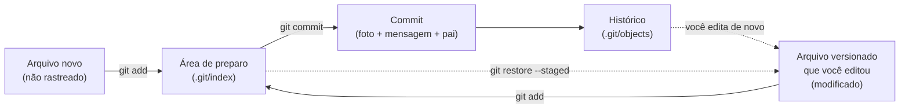
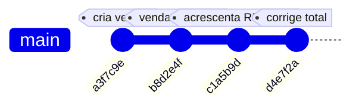

# 02.08 — Git: o modelo mental

> **Módulo 02 — Git e Linux** · Nível: N1 · Tempo estimado: 2h30 · Código: `codigo/cap08/`

## 1. Objetivo

- **Explicar** o problema que o Git resolve e por que ele é distribuído.
- **Descrever** as três áreas (diretório de trabalho, área de preparo, repositório) e o caminho de um arquivo entre elas.
- **Interpretar** o histórico como um **grafo de fotografias**, não como uma lista de diferenças.
- **Identificar** onde cada arquivo do seu projeto está, a qualquer momento, usando `git status`.

Ao final, a pasta `.git` deixa de ser caixa-preta — e os comandos do próximo capítulo passam a fazer sentido antes de você decorá-los.

---

## 2. Pré-requisitos

- [02.07 — Scripts de shell](07-scripts-de-shell.md) — você vai ler e rodar um script que demonstra o ciclo completo.
- [02.01 — Terminal](01-terminal-por-que-a-linha-de-comando.md) — **a dívida deste capítulo**: a pasta `.git` que apareceu no `ls -a` e ficou sem explicação.

**Autoteste:** (1) O que você faz hoje quando quer guardar uma versão de um arquivo antes de mexer nele? (2) Como duas pessoas editam o mesmo arquivo sem sobrescrever o trabalho uma da outra? (3) O que tem dentro da pasta `.git`? Se a resposta de (1) envolve `_final_v2_agora_vai`, este capítulo é para você.

---

## 3. Motivação

Você tem, neste momento, uma pasta com dezenas de arquivos que vem editando há semanas. Três perguntas vão aparecer, e você não tem resposta para nenhuma:

**"O que eu mudei ontem?"** Você lembra vagamente que mexeu no relatório e num script. Quais linhas? Por quê? Se alguém perguntar em duas semanas, a memória já terá apagado.

**"Como volto à versão que funcionava?"** Você alterou o `relatorio_aurora.py`, ele parou de rodar, e as alterações estão espalhadas por três funções. Desfazer no editor com Ctrl+Z funciona até você fechar o arquivo. Depois disso, a versão que funcionava não existe mais em lugar nenhum.

**"Como trabalho com outra pessoa no mesmo arquivo?"** Você manda por e-mail, ela devolve editado, você já tinha mexido enquanto isso — e agora existem duas versões incompatíveis, e alguém vai perder trabalho.

A solução caseira é conhecida: `relatorio.py`, `relatorio_v2.py`, `relatorio_final.py`, `relatorio_final_CORRIGIDO.py`. Ela falha por três motivos: consome espaço, não registra **por que** cada versão existe, e é intransmissível — ninguém além de você entende a sequência.

O Git resolve exatamente isso, e por isso está em praticamente todo projeto de software do planeta. Mas ele tem uma fama justa de confuso — e a causa é conhecida: **quase todo mundo aprende Git decorando comandos**. `git add`, `git commit`, `git push`, e a esperança de que funcione. No dia em que algo sai do roteiro (e sai), a pessoa fica sem chão, procura a resposta na internet e cola um comando que não entende.

Este capítulo faz o contrário: **zero decoreba, só modelo**. Você vai entender as três áreas, o grafo de commits e o que acontece dentro do `.git`. Os comandos vêm no próximo capítulo — e, quando vierem, cada um será a consequência direta de algo que você já entendeu.

---

## 4. Modelo mental

> 🧠 **Modelo mental**
> O Git é um **álbum de fotografias do seu projeto**. Cada *commit* é uma foto completa do estado de **todos** os arquivos num instante, com etiqueta: quem tirou, quando, e por quê. As fotos não ficam soltas — cada uma **aponta para a anterior**, formando uma corrente que você pode percorrer de trás para frente. E entre "editar" e "fotografar" existe um passo intermediário deliberado: a **área de preparo**, onde você escolhe *o que* vai entrar na próxima foto. Você edita dez arquivos e fotografa só três, se essas três formam uma mudança coerente.

**Exercício de previsão.** Você tem um projeto com 200 arquivos versionados. Altera **uma linha** de **um** arquivo e faz um commit. Sem consultar, decida: o Git guarda (a) só a linha alterada, (b) o arquivo alterado inteiro, ou (c) uma cópia dos 200 arquivos?

*Resposta comentada:* conceitualmente, **(c)** — o commit é a fotografia do projeto **inteiro**, e é por isso que voltar a qualquer ponto do histórico é uma operação instantânea e confiável. Na prática, o Git é econômico: os 199 arquivos não alterados **não são copiados**, apenas referenciados pelo mesmo endereço interno (a seção 7 explica). Então a resposta honesta é "(c) do ponto de vista do modelo, com a eficiência de (b)". Se você respondeu (a), você estava pensando no modelo de *diferenças* — que é como ferramentas mais antigas funcionavam, e é a fonte de metade da confusão de quem aprende Git depois delas.

---

## 5. Analogia

Imagine um **estúdio fotográfico com uma mesa de preparação**. Você trabalha na bancada (o **diretório de trabalho**: os arquivos que você abre e edita). Quando uma mudança fica pronta, você leva os objetos escolhidos para a mesa de preparação (a **área de preparo**), arrumando ali exatamente o que quer que apareça na foto. Satisfeito, você fotografa (o **commit**) — e a foto vai para o álbum (o **repositório**), com data, autor e uma legenda explicando o que mudou.

A mesa de preparação é a parte que confunde quem vem de outras ferramentas, e é a mais valiosa. Ela existe para que você **separe** o trabalho: se numa manhã você corrigiu um bug e, de quebra, arrumou a formatação de outro arquivo, pode fotografar as duas coisas **separadamente** — duas fotos, duas legendas, dois pontos distintos para os quais voltar. Sem a mesa, tudo entraria na mesma foto, com uma legenda vaga do tipo "várias mudanças".

**Onde a analogia quebra:** fotos comuns não se conectam entre si; commits **apontam para o anterior**, e é essa corrente que permite percorrer o histórico e comparar dois pontos quaisquer. E há um segundo ponto: o álbum não é só seu — cada colaborador tem o álbum **inteiro** na própria máquina (é o que significa "distribuído"), e sincronizar é combinar álbuns, não pedir permissão a um servidor central.

---

## 6. Teoria

### O que o Git é

Um **sistema de controle de versão distribuído**: registra o histórico completo do projeto, e cada cópia é um repositório completo — com todo o histórico, funcionando sem rede.

Três consequências práticas do "distribuído": você trabalha e registra versões **offline**; se o servidor central pegar fogo, qualquer clone reconstrói o projeto inteiro; e as operações do dia a dia (ver histórico, comparar versões, trocar de linha de trabalho) são locais, portanto instantâneas.

> ⚠️ **Atenção**
> **Git ≠ GitHub.** Git é o programa que roda na sua máquina. GitHub (ou GitLab, Bitbucket) é um **serviço** que hospeda repositórios Git na internet. Você pode usar Git a vida inteira sem GitHub; e o GitHub sem Git não existe. Confundir os dois é o mal-entendido nº 1 de iniciantes — e aparece em entrevista.

### As três áreas

```text
   DIRETÓRIO DE TRABALHO          ÁREA DE PREPARO           REPOSITÓRIO
   (os arquivos que você       (o que vai entrar na       (o histórico, dentro
    edita, na sua pasta)          próxima foto)               do .git/)

        editar  ──────►  git add  ──────►  git commit  ──────►  histórico
```

| Área | O que é | Estado dos arquivos |
|---|---|---|
| Diretório de trabalho | a pasta que você vê e edita | *modificado* (ou não rastreado) |
| Área de preparo | uma lista do que entra no próximo commit | *preparado* |
| Repositório (`.git/`) | o histórico permanente | *versionado* |

E um quarto estado que precede todos: **não rastreado** — arquivo novo, que o Git enxerga mas ainda não acompanha. O `git status` é a ferramenta que responde, a qualquer momento, em qual estado está cada arquivo. É o comando mais usado do Git, com folga.

### O commit

Um commit guarda cinco coisas:

1. **Uma fotografia** do projeto inteiro naquele instante;
2. **O autor** (nome e e-mail configurados na máquina);
3. **A data e hora**;
4. **A mensagem** — por que essa mudança existe;
5. **O ponteiro para o commit anterior** (o pai).

E recebe um **identificador** de 40 caracteres, calculado a partir do próprio conteúdo:

```text
a3f7c9e2b4d1f8a6c5e3b7d9f2a4c6e8b1d3f5a7
```

Na prática, os 7 primeiros caracteres já identificam sem ambiguidade (`a3f7c9e`). Como o identificador vem do conteúdo, **qualquer alteração num commit antigo muda o identificador dele e o de todos os posteriores** — é o mecanismo que torna o histórico verificável, e a razão de reescrever histórico compartilhado ser problemático (02.12).

### O grafo

Os commits formam uma corrente, cada um apontando para o pai:

```text
a3f7c9e ◄── b8d2e4f ◄── c1a5b9d ◄── d4e7f2a
(início)                              (mais recente)
```

**HEAD** é o marcador que indica "onde você está" — normalmente, o commit mais recente da linha de trabalho atual. Quando você faz um commit novo, ele nasce apontando para onde o HEAD estava, e o HEAD avança.

Essa estrutura é o que permite **ramificações** (02.10): a partir de qualquer ponto, uma segunda corrente pode nascer, seguir em paralelo, e depois ser reunida à principal. Por enquanto, guarde apenas isto: **um commit pode ter mais de um filho** — e é daí que sai a colaboração.

### O que fica dentro do `.git/`

A pasta que você viu no 02.01 contém tudo:

| Item | O que guarda |
|---|---|
| `objects/` | os objetos: conteúdo dos arquivos, árvores de diretório e commits |
| `refs/` | os ponteiros nomeados (ramificações e etiquetas) |
| `HEAD` | onde você está agora (aponta para a linha principal — `main` nas versões recentes do Git, `master` nas antigas; o 02.10 trata disso) |
| `config` | configuração daquele repositório |
| `index` | a área de preparo (é um arquivo!) |

Duas conclusões práticas: **apagar a pasta `.git` apaga o histórico inteiro** (os arquivos ficam, a memória some) — e copiar a pasta do projeto com o `.git` junto leva o histórico completo.

### O ciclo, em quatro estados

```text
não rastreado ──► preparado ──► versionado ──► modificado ──► preparado ──► ...
              add            commit          (você edita)   add
```

Esse laço é o dia a dia inteiro do Git. Todo o resto — desfazer, ramificar, sincronizar, resolver conflito — é variação sobre ele.

### O que **não** deve entrar no histórico

Antes de versionar qualquer coisa, três categorias ficam de fora:

- **Segredos** — `.env`, senhas, chaves (02.06). Uma vez no histórico, ficam lá para sempre, mesmo apagados depois.
- **Arquivos gerados** — `__pycache__/` (01.20), saídas de relatório, arquivos temporários. São reproduzíveis; versioná-los polui o histórico.
- **Arquivos grandes e binários** — vídeos, bases de dados. O Git guarda cada versão inteira de arquivos binários, e o repositório incha rapidamente.

O mecanismo que executa essa exclusão é o `.gitignore`, que o próximo capítulo apresenta junto com os comandos.

---

## 7. Funcionamento interno

Por dentro, na medida N2: o Git é, no fundo, um **banco de dados de chave-valor** onde a chave é o resumo criptográfico (SHA-1) do conteúdo e o valor é o próprio conteúdo comprimido. Ele guarda quatro tipos de objeto: *blob* (o conteúdo de um arquivo, sem nome), *tree* (um diretório: lista de nomes apontando para blobs e outras trees), *commit* (aponta para uma tree, para o commit pai e carrega autor/data/mensagem) e *tag*. Daí decorrem três fatos que explicam o comportamento observável: (1) dois arquivos com conteúdo **idêntico** viram um único blob, e um arquivo não alterado entre commits é referenciado pelo **mesmo** blob — é por isso que "fotografar tudo" custa pouco; (2) o identificador de um commit depende do conteúdo **e do pai**, então alterar qualquer ponto do passado altera todos os identificadores posteriores, o que torna o histórico à prova de adulteração silenciosa; (3) a área de preparo é literalmente o arquivo `.git/index`, uma lista de caminhos e blobs — e é por isso que "preparar" é instantâneo, mesmo em projetos gigantes. Vale registrar que projetos modernos migram para SHA-256; a mecânica não muda.

---

## 8. Visualização do fluxo

As três áreas e o caminho de uma alteração:



**Como ler:** siga a seta cheia da esquerda para a direita — é o caminho normal de qualquer alteração, e note que **as duas origens** (arquivo novo e arquivo modificado) usam o mesmo `git add`. A seta pontilhada de baixo é o laço do dia a dia: depois do commit, você edita de novo e a volta recomeça. A pontilhada de cima à direita mostra que a área de preparo é **reversível** — tirar algo da mesa antes de fotografar não perde trabalho nenhum, e saber disso remove boa parte do medo de errar.

E o histórico que esse ciclo produz — o grafo de commits:



**Como ler:** cada bolinha é um commit, e a linha que as une é a corrente de ponteiros — cada commit **aponta para o anterior**, e o mais recente (à direita) é para onde o HEAD aponta. Repare que o identificador não tem ordem numérica: ele vem do conteúdo, não de um contador, e é a corrente que define a sequência. Esta é a forma mais simples do grafo, uma linha única; no 02.10 ele ganha ramos que saem de um commit qualquer e voltam a se juntar mais adiante — e é aí que o "grafo" deixa de ser figura de linguagem.

---

## 9. Aplicação prática

Um passeio pelo modelo, sem decorar comando nenhum — o objetivo aqui é **ver** as três áreas funcionando.

**Passo 1 — Crie um repositório e olhe o que apareceu:**

```bash
mkdir laboratorio-git && cd laboratorio-git
git init
ls -a                    # a pasta .git apareceu (a caixa-preta do 02.01)
ls .git                  # objects, refs, HEAD, config...
```

**Passo 2 — Um arquivo novo é "não rastreado":**

```bash
echo "vendas da aurora" > vendas.txt
git status
```

```text
No commits yet

Untracked files:
  (use "git add <file>..." to include in what will be committed)
        vendas.txt
```

O Git **vê** o arquivo e diz, na própria mensagem, o que fazer. Ler a saída do `git status` é 80% de aprender Git.

**Passo 3 — Preparar move para a mesa:**

```bash
git add vendas.txt
git status
```

```text
Changes to be committed:
  (use "git rm --cached <file>..." to unstage)
        new file:   vendas.txt
```

**Passo 4 — Fotografar:**

```bash
git commit -m "Cria arquivo de vendas"
git log --oneline
```

```text
a3f7c9e Cria arquivo de vendas
```

**Passo 5 — Editar cria o estado "modificado":**

```bash
echo "campinas 100" >> vendas.txt
git status
```

```text
Changes not staged for commit:
        modified:   vendas.txt
```

Repare na diferença entre o passo 2 e este: lá era *untracked* (o Git nunca viu o arquivo), aqui é *modified* (o Git conhece a versão anterior e detectou a diferença). São estados distintos, e confundi-los é a origem de metade das dúvidas iniciais.

**Passo 6 — Duas mudanças, dois commits (o valor da mesa):**

```bash
echo "sorocaba 200" >> vendas.txt
echo "# Laboratório" > README.md

git add vendas.txt                       # só um dos dois!
git commit -m "Registra venda de sorocaba"

git add README.md
git commit -m "Acrescenta README"

git log --oneline
```

```text
c1a5b9d Acrescenta README
b8d2e4f Registra venda de sorocaba
a3f7c9e Cria arquivo de vendas
```

Três commits, três legendas, três pontos para os quais voltar. **Isso** é a área de preparo trabalhando — e a razão de ela existir.

> 🎯 **Checkpoint rápido**
> De cabeça: qual a diferença entre um arquivo *untracked* e um *modified*? E o que acontece com o histórico se você apagar a pasta `.git`?

---

## 10. Código comentado

Arquivo completo em [`codigo/cap08/ciclo_do_git.sh`](codigo/cap08/ciclo_do_git.sh) — um script que constrói um repositório do zero e mostra o `git status` em cada estado.

```bash
#!/usr/bin/env bash
# ------------------------------------------------------------
# ciclo_do_git.sh
# Capítulo 02.08 — Git: o modelo mental
# O que este arquivo demonstra: os quatro estados de um arquivo e
#   o caminho entre as três áreas, com git status em cada etapa
# Como executar: bash ciclo_do_git.sh
# ------------------------------------------------------------

set -euo pipefail

PASTA="laboratorio_git_temporario"
rm -rf "$PASTA"
mkdir "$PASTA"
cd "$PASTA"

echo "--- 1. Criando o repositório ---"
git init -q
# Identidade local, só para este repositório (o -q silencia a saída):
git config user.name "Estudante Aurora"
git config user.email "estudante@exemplo.local"
echo "  Pasta .git criada. Conteúdo:"
ls .git | head -5

echo
echo "--- 2. Estado: NÃO RASTREADO ---"
echo "cidade;valor" > vendas.csv
echo "campinas;100.00" >> vendas.csv
git status --short          # o --short resume: ?? = não rastreado

echo
echo "--- 3. Estado: PREPARADO (depois do add) ---"
git add vendas.csv
git status --short          # A = acrescentado à área de preparo

echo
echo "--- 4. Estado: VERSIONADO (depois do commit) ---"
git commit -q -m "Cria base de vendas com a primeira cidade"
git status --short          # nada: o diretório está limpo
echo "  (saída vazia acima = tudo versionado)"

echo
echo "--- 5. Estado: MODIFICADO (editei um arquivo versionado) ---"
echo "sorocaba;200.00" >> vendas.csv
git status --short          # M = modificado, mas ainda não preparado

echo
echo "--- 6. A área de preparo escolhendo o que entra na foto ---"
echo "# Laboratório Aurora" > README.md    # segundo arquivo, novo
git add vendas.csv                          # preparo SÓ o primeiro
git status --short                          # M preparado + ?? não rastreado
git commit -q -m "Registra a venda de sorocaba"

echo
echo "--- 7. O histórico: o grafo de commits ---"
git log --oneline
echo
echo "  Detalhe do commit mais recente:"
git log -1 --format="  id:    %h%n  autor: %an%n  data:  %ad%n  msg:   %s" --date=short

echo
echo "--- 8. O que o Git guardou por dentro ---"
echo "  Objetos no banco: $(git count-objects | cut -d' ' -f1)"
echo "  Onde o HEAD aponta: $(cat .git/HEAD)"

echo
echo "--- 9. Limpeza ---"
cd ..
rm -rf "$PASTA"
echo "Laboratório removido."
```

---

## 11. Erros comuns

### Erro 1 — Confundir Git com GitHub

**Sintoma:** "não consigo usar Git porque não tenho internet"; ou a suposição de que criar um repositório no GitHub versiona a pasta da sua máquina.
**Causa:** tratar o programa local e o serviço de hospedagem como a mesma coisa.
**Correção:** Git roda na sua máquina e funciona **offline** — inclusive todo o histórico, comparações e ramificações. GitHub é um lugar onde você **publica** uma cópia (02.11). Teste mental: `git init`, `git add`, `git commit` e `git log` funcionam com o cabo de rede desligado. Só `push`, `pull` e `clone` precisam de rede.

### Erro 2 — Achar que o commit guarda só as diferenças

**Sintoma:** confusão ao voltar a um commit antigo ("mas eu só tinha mudado um arquivo, por que os outros voltaram também?"), e medo de que o repositório fique gigante.
**Causa:** modelo mental de *diferenças* (herdado de ferramentas anteriores ao Git) em vez de *fotografias*.
**Correção:** cada commit é o estado **completo** do projeto; a economia acontece por dentro, reutilizando os objetos não alterados (seção 7). Consequência prática que vale ouro: voltar a qualquer ponto do histórico devolve o projeto **inteiro** naquele estado, não um arquivo isolado.

### Erro 3 — Mensagens de commit sem informação

**Sintoma:** um histórico assim, e a impossibilidade de encontrar quando algo quebrou:

```text
d4e7f2a atualizações
c1a5b9d correções
b8d2e4f mudanças
a3f7c9e ajustes finais
```

**Causa:** tratar a mensagem como formalidade burocrática, e não como a razão de o histórico existir.
**Correção:** a mensagem responde **por que**, não *o quê* (o "o quê" já está na fotografia). Padrão praticado: verbo no imperativo, até ~50 caracteres, específico — `Corrige cálculo de total quando o CSV tem linha vazia`. O teste é concreto: daqui a seis meses, procurando o commit que introduziu um bug, essa mensagem ajuda? O 02.09 formaliza a convenção.

---

## 12. Boas práticas

✅ **`git status` antes e depois de qualquer coisa** — ele diz o estado de cada arquivo e sugere o comando seguinte, na própria saída.

✅ **Um commit = uma mudança coerente** — é para isso que existe a área de preparo; commits pequenos e temáticos são o que torna o histórico útil.

✅ **Mensagem que responde "por quê"** — imperativo, específica, ~50 caracteres na primeira linha.

✅ **Aprenda pelo modelo, não pelos comandos** — quando algo sair do roteiro (e vai), o modelo te salva; o comando decorado, não.

❌ **Evite versionar segredos, arquivos gerados e binários grandes** — o histórico é permanente; o que entra, fica (02.09).

❌ **Evite colar comandos de Git que você não entende** — especialmente os que a internet oferece com "isso resolve": muitos reescrevem histórico ou descartam trabalho sem confirmação.

---

## 13. Performance

Nesta escala, irrelevante — e vale entender por quê, porque a razão é o modelo. Praticamente toda operação de Git é **local**: ver histórico, comparar versões, trocar de ramificação e criar commits não tocam a rede, e por isso são instantâneas mesmo em repositórios com dezenas de milhares de commits. A reutilização de objetos idênticos (seção 7) mantém o tamanho sob controle enquanto os arquivos são texto. O que **realmente** degrada um repositório é conteúdo binário grande versionado repetidamente — cada versão de um arquivo binário é guardada por inteiro, e um repositório com vídeos ou bases de dados fica lento para clonar e impossível de limpar depois. A lição transferível: escolhas de arquitetura que parecem inofensivas no começo (o que entra no histórico) definem o custo operacional anos depois.

---

## 14. Mercado

> 🏢 **Mercado**
> Git é requisito universal, não diferencial: praticamente todo processo seletivo de tecnologia pressupõe fluência, e o histórico do seu repositório público costuma ser a primeira coisa que um recrutador técnico abre. O que separa quem sabe de quem decorou aparece rápido — em entrevistas, "explique a área de preparo" e "o que é um commit" são perguntas de triagem, e a resposta baseada em modelo (fotografia, grafo, três áreas) se distingue imediatamente da lista de comandos. Na prática do dia a dia, um bom histórico é ferramenta de investigação: quando um sistema quebra em produção, a primeira pergunta é "o que mudou?", e a qualidade das mensagens de commit decide se a resposta leva cinco minutos ou uma tarde.
>
> **Mini-cenário:** a partir do próximo capítulo, o Manual Mestre inteiro passa a viver num repositório Git — cada capítulo estudado vira um commit com mensagem descritiva, e no 02.11 esse repositório vai para o GitHub, público. Ao terminar a trilha, você terá um histórico de meses de estudo consistente e visível: o tipo de evidência que nenhum currículo consegue transmitir.

---

## 15. Entrevistas

**P1. "Qual a diferença entre Git e GitHub?"**
*Resposta esperada:* Git é o sistema de controle de versão distribuído que roda na sua máquina; GitHub é um serviço de hospedagem de repositórios Git, com recursos de colaboração por cima (revisão de código, gestão de tarefas, automações). Git funciona offline e sem GitHub; alternativas de hospedagem existem (GitLab, Bitbucket, servidor próprio). É pergunta de triagem — errar aqui encerra a conversa técnica.

**P2. "Explique as três áreas do Git."**
*Resposta esperada:* diretório de trabalho (os arquivos que você edita), área de preparo (o que entra no próximo commit) e repositório (o histórico, no `.git`). O caminho: editar → `add` → `commit`. E o **porquê** da área intermediária: permite separar mudanças em commits coerentes, mesmo tendo editado várias coisas ao mesmo tempo. Quem responde só a sequência de comandos perde a pergunta; quem explica o propósito da área de preparo demonstra o modelo.

**P3. "O que é um commit? O que ele guarda?"**
*Resposta esperada:* uma fotografia completa do projeto num instante, com autor, data, mensagem e ponteiro para o commit pai, identificada por um resumo criptográfico do próprio conteúdo. Consequências que valem citar: o histórico é um grafo (não uma lista); alterar o passado muda todos os identificadores seguintes; e, apesar de conceitualmente completo, o armazenamento reutiliza objetos não alterados.

**Pegadinha clássica: "Se o commit é uma fotografia do projeto inteiro, um repositório com mil commits não ocuparia mil vezes o tamanho do projeto?"**
Ela testa se você entende o modelo **e** a implementação, e derruba quem decorou a metáfora sem saber o que há embaixo. A resposta forte separa as duas camadas: **conceitualmente** sim, cada commit representa o estado completo — é o que torna qualquer ponto do histórico recuperável por inteiro. **Na prática**, não: o Git guarda cada conteúdo uma única vez, endereçado pelo resumo do próprio conteúdo, e um arquivo não alterado entre dois commits é referenciado pelo mesmo objeto em ambos. Um commit que muda uma linha acrescenta ao banco apenas o novo conteúdo daquele arquivo, as árvores de diretório afetadas e o objeto do commit. Fechar com a exceção honesta, que é o que demonstra experiência: **isso vale para texto**; arquivos binários grandes mudam por inteiro a cada versão, o repositório incha de verdade, e a solução é não versioná-los (ou usar uma extensão específica para arquivos grandes).

---

## 16. Exercícios guiados

Enunciados completos em [`exercicios/cap08.md`](exercicios/cap08.md); gabaritos em [`exercicios/gabaritos/cap08.md`](exercicios/gabaritos/cap08.md).

### Aquecimento

- **A1** `[~10 min · as três áreas]` — 6 situações: em qual área está o arquivo?
- **A2** `[~10 min · lendo o status]` — 4 saídas de `git status`: o que aconteceu antes?
- **A3** `[~10 min · verdadeiro ou falso]` — 8 afirmações sobre o modelo do Git.
- **A4** `[~10 min · mensagens]` — 6 mensagens de commit: avalie e reescreva as ruins.

### Aplicação

- **AP1** `[~25 min · o laboratório]` — Reproduza o ciclo completo, registrando o `git status` em cada um dos quatro estados.
- **AP2** `[~20 min · a área de preparo trabalhando]` — Edite três arquivos e produza **dois** commits temáticos a partir deles.
- **AP3** `[~20 min · autópsia do .git]` — Explore a pasta `.git` e identifique onde estão o histórico, a área de preparo e o ponteiro HEAD.

---

## 17. Desafios

- **D1** `[~40 min · o histórico que conta uma história]` — **Um repositório é um documento.** Crie um repositório de laboratório e construa nele um histórico de **6 commits** que narre a evolução de um pequeno script de análise de vendas: criação, primeira função, tratamento de erro, correção de bug, ajuste de formatação e documentação. Requisitos: (a) cada commit deve conter **uma** mudança coerente — use a área de preparo para separar, mesmo que você tenha editado tudo de uma vez; (b) mensagens no imperativo, específicas, até 50 caracteres; (c) ao menos um commit que envolva **dois** arquivos por serem a mesma mudança lógica; (d) ao final, produza a saída de `git log --oneline` e escreva, ao lado de cada commit, o que uma pessoa de fora entenderia dele. Fecho: 5 linhas comparando esse histórico com a estratégia de arquivos `_v2_final`.

<details><summary>💡 Dica 1 (conceito)</summary>
Você pode fazer todas as edições primeiro e depois separar em commits — é justamente para isso que a área de preparo existe. `git add arquivo` prepara um por vez.
</details>
<details><summary>💡 Dica 2 (estratégia)</summary>
Escreva as 6 mensagens **antes** de programar. Elas viram o roteiro, e o histórico sai coerente naturalmente.
</details>
<details><summary>💡 Dica 3 (esqueleto)</summary>
init → 6 ciclos de (editar → add seletivo → commit -m) → log --oneline → tabela commit/mensagem/o-que-comunica → reflexão.
</details>

---

## 18. Mini projeto

**Diagrama do modelo, com suas palavras** `[~45 min]` — a prova de que o modelo é seu.

Requisitos numerados:

1. Desenhe (à mão, em ferramenta de diagrama, ou em Mermaid) as **três áreas** e as setas entre elas, com os comandos que movem um arquivo de uma para a outra.
2. Acrescente ao desenho os **quatro estados** de um arquivo e indique em que ponto do fluxo cada um aparece.
3. Desenhe, separadamente, um **grafo de 4 commits** com identificadores, mensagens e o ponteiro HEAD.
4. Escreva, ao lado, três perguntas que o modelo responde — e as respostas: "onde está o meu arquivo agora?", "o que acontece se eu apagar o `.git`?", "por que existe a área de preparo?".
5. Explique o diagrama **em voz alta**, para alguém ou gravando, em até 3 minutos, sem consultar o capítulo.

**Critério de "está bom":** o passo 5 é o critério. Se você travar em algum ponto da explicação, é exatamente ali que o modelo ainda não está formado — volte à seção correspondente e refaça. Um diagrama bonito que você não consegue narrar não serve; um rabisco que você explica com fluidez é o objetivo.

---

## 19. Revisão

**Resumo do capítulo:**

- Git = controle de versão **distribuído**; cada cópia tem o histórico completo e funciona offline. **Git ≠ GitHub**.
- Três áreas: diretório de trabalho → (`add`) → área de preparo → (`commit`) → repositório (`.git/`).
- Quatro estados: não rastreado, modificado, preparado, versionado — e o `git status` sempre diz qual é.
- Commit = **fotografia completa** do projeto + autor + data + mensagem + ponteiro para o pai, identificado por um resumo do conteúdo.
- O histórico é um **grafo**; HEAD marca onde você está; alterar o passado muda todos os identificadores seguintes.
- A área de preparo existe para **separar** mudanças em commits coerentes — e é reversível.
- Fora do histórico: segredos, arquivos gerados e binários grandes.

**Flashcards novos** (adicionados a [`revisao/flashcards.md`](revisao/flashcards.md)):

| ID | Frente | Verso |
|---|---|---|
| 02.08-F1 | Quais são as três áreas do Git e o que move um arquivo entre elas? | Diretório de trabalho → (`git add`) → área de preparo → (`git commit`) → repositório (`.git/`). |
| 02.08-F2 | Explique com suas palavras: por que existe a área de preparo? | (Elaboração) Para **escolher** o que entra no próximo commit: você edita várias coisas e fotografa só as que formam uma mudança coerente — commits temáticos, com mensagens úteis. |
| 02.08-F3 | Preveja: você apaga a pasta `.git` do projeto. O que acontece? | (Previsão) Os arquivos atuais permanecem; **todo o histórico some** — commits, mensagens, versões anteriores. A pasta do projeto vira uma pasta comum. |
| 02.08-F4 | Um commit guarda as diferenças ou o estado completo? | (Decisão) Conceitualmente, o **estado completo** (fotografia); na implementação, objetos idênticos são reutilizados, então o custo é próximo ao das diferenças. Vale para texto — binários incham. |
| 02.08-F5 | Qual a diferença entre Git e GitHub? | Git = o programa de controle de versão, local e offline. GitHub = serviço que **hospeda** repositórios Git na internet. Um existe sem o outro (nessa direção). |

**Agendamento:** registre no `PROGRESSO.md` e marque D+1, D+7, D+30, D+90 na [`Revisoes/agenda.md`](../Revisoes/agenda.md).

---

## 20. Checklist

Perguntas de domínio — teste do sim:

- [ ] Sei explicar *as três áreas e o que move um arquivo entre elas*?
- [ ] Sei diferenciar *os quatro estados de um arquivo lendo o `git status`*?
- [ ] Sei descrever *o que um commit guarda e por que ele tem um identificador*?
- [ ] Sei justificar *a existência da área de preparo com um exemplo concreto*?
- [ ] Sei responder *à pegadinha do "mil commits, mil cópias?"*?

Itens práticos:

- [ ] Rodei `ciclo_do_git.sh` e vi os quatro estados no `git status`.
- [ ] Explorei a pasta `.git` e identifiquei `objects`, `refs`, `HEAD` e `index`.
- [ ] Produzi dois commits temáticos a partir de três arquivos editados.
- [ ] Completei "Diagrama do modelo, com suas palavras" — incluindo a explicação em voz alta.
- [ ] Registrei a sessão e agendei as 4 revisões.

---

## 21. Próximo capítulo

Você entende o modelo e já viu as três áreas funcionando — e ainda não tem um repositório **de verdade**: o Manual Mestre continua sendo uma pasta comum, sem histórico, sem rede de segurança. Ficou deliberadamente em aberto o conjunto de comandos que operam o modelo no dia a dia: configurar a identidade, iniciar o repositório, preparar, fotografar, consultar o histórico, comparar versões — e o `.gitignore`, que mantém segredos e arquivos gerados fora da fotografia, fechando a promessa do 02.06. O próximo capítulo transforma o seu repositório de estudo num projeto versionado de verdade, com o primeiro commit da sua trilha.

→ [02.09 — Fluxo essencial do Git](09-fluxo-essencial-do-git.md)

---

*Gerado sob spec 3.0.0*
