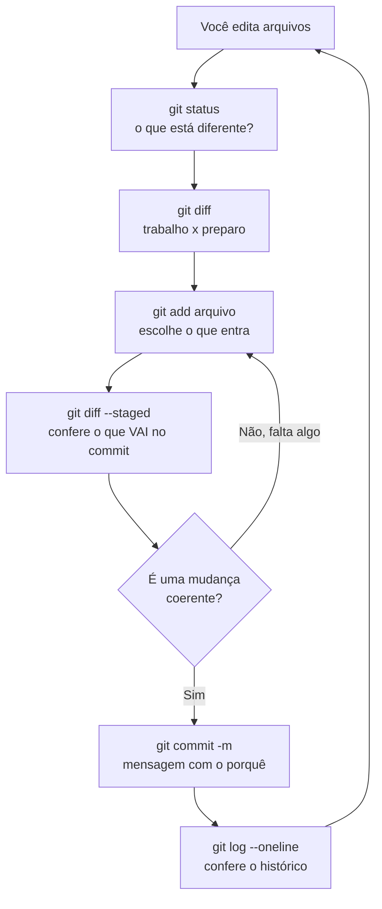

# 02.09 — Fluxo essencial do Git

> **Módulo 02 — Git e Linux** · Nível: N1 · Tempo estimado: 3h00 · Código: `codigo/cap09/`

## 1. Objetivo

- **Executar** o ciclo diário: `status` → `add` → `commit` → `log`.
- **Escrever** mensagens de commit que servem ao futuro (o que e por quê).
- **Ler** `diff` nas três comparações possíveis e `log` com formatos úteis.
- **Configurar** o `.gitignore` — aposentando o `__pycache__` prometido desde o 01.02.

Ao final, o Manual Mestre é um repositório Git de verdade, com histórico legível e sem lixo versionado.

---

## 2. Pré-requisitos

- [02.08 — Git: o modelo mental](08-git-o-modelo-mental.md) — as três áreas e o grafo; sem isso, os comandos daqui viram decoreba.
- [02.06 — Variáveis de ambiente e PATH](06-variaveis-de-ambiente-e-path.md) — **a dívida deste capítulo**: o `.env` que deve ficar fora do histórico.

**Autoteste:** (1) Quais são as três áreas do Git? (2) O que o `git status` responde? (3) Por que um `.env` não pode entrar no repositório? Se travar em alguma, releia o 02.08 antes de seguir.

---

## 3. Motivação

Você entende o modelo. Falta operá-lo — e a diferença é grande: saber que existe uma área de preparo não te dá o hábito de usá-la três vezes por dia.

O problema imediato é que seu repositório de estudo ainda não existe. Todos os arquivos que você produziu nas últimas semanas — capítulos anotados, scripts, exercícios resolvidos — vivem numa pasta comum, sem rede de segurança. Uma pasta apagada por engano, um arquivo salvo por cima, e o trabalho some.

Mas há um segundo problema, menos evidente e mais caro: **o que entra no histórico fica lá para sempre**. Se você fizer `git add .` na sua pasta agora, entram junto os `__pycache__` que o Python gerou (prometidos desde o 01.02 e explicados no 01.20), as saídas de relatório, e — o caso grave — qualquer arquivo com senha. Apagar depois não resolve: o histórico guarda todas as versões, e quem clonar o repositório recebe o arquivo apagado junto.

Este capítulo resolve os dois de uma vez. Primeiro o `.gitignore`, que define **antes** o que nunca entra. Depois o ciclo diário, com os quatro comandos que você vai rodar milhares de vezes. E, no meio, as duas ferramentas de leitura que separam quem usa Git de quem sofre com ele: o `diff`, que mostra exatamente o que mudou, e o `log`, que transforma o histórico em documento consultável.

---

## 4. Modelo mental

> 🧠 **Modelo mental**
> O ciclo diário do Git é um **loop de quatro perguntas**, sempre na mesma ordem: *"o que está diferente?"* (`status`), *"o que exatamente mudou?"* (`diff`), *"o que entra nesta foto?"* (`add`) e *"por que essa mudança existe?"* (`commit -m`). O `log` é a quinta pergunta, feita depois: *"como chegamos até aqui?"*. Quem pula a primeira pergunta comete o erro clássico de versionar o que não queria; quem pula a segunda escreve mensagens genéricas, porque não olhou o que estava fotografando.

**Exercício de previsão.** Você editou `analise.py`, rodou `git add analise.py` e, **antes de fazer o commit**, editou o arquivo de novo. Sem rodar, decida: o que o `git commit` vai gravar — a versão preparada ou a mais recente?

*Resposta comentada:* a **versão preparada**, a do momento do `add`. A segunda edição está só no diretório de trabalho, e o `git status` mostra o mesmo arquivo nas **duas** listas ao mesmo tempo (preparado *e* modificado) — uma saída que assusta quem não conhece o modelo e é perfeitamente coerente com ele. A correção é rodar `git add` de novo antes de fotografar. Se você respondeu "a mais recente", seu modelo ainda funde área de preparo com diretório de trabalho — e este é o exercício que separa os dois de vez.

---

## 5. Analogia

O ciclo diário é a rotina de um **diário de bordo de navio**. Ao fim de cada turno, o oficial não escreve tudo o que aconteceu: ele confere o que mudou desde o último registro (`status`), examina os detalhes que importam (`diff`), decide o que merece constar (`add`) e escreve a entrada explicando **por que** as decisões foram tomadas (`commit`). Semanas depois, quando alguém precisa entender por que a rota mudou naquele dia, o diário responde — e responde melhor quanto mais disciplinada foi a escrita.

O `.gitignore` é a regra do próprio diário sobre o que **nunca** se registra: o consumo de café da tripulação, os rascunhos descartados, e as informações confidenciais que não podem circular. Definir isso antes evita ter de arrancar páginas depois — e arrancar páginas de um diário já copiado e distribuído é justamente o que não funciona.

**Onde a analogia quebra:** um diário de bordo é linear e imutável; o histórico do Git pode ganhar ramos e ser reescrito **antes** de publicado (02.12). E há um detalhe operacional que a analogia esconde: o Git registra automaticamente autor, data e o estado completo dos arquivos — a única parte que exige esforço humano é exatamente a que mais importa, a explicação do porquê.

---

## 6. Teoria

### Configuração inicial (uma vez por máquina)

```bash
git config --global user.name "Seu Nome"
git config --global user.email "seu@email.com"
git config --global init.defaultBranch main      # nome moderno da linha principal
git config --global core.editor "code --wait"    # VS Code para mensagens longas

git config --list                                 # confere tudo
```

O `--global` vale para a máquina inteira; sem ele, a configuração vale só para o repositório atual — útil quando você usa e-mails diferentes para trabalho e projetos pessoais.

### O `.gitignore`: decidir antes o que nunca entra

Um arquivo de texto na raiz do repositório, com um padrão por linha:

```gitignore
# --- Python ---
__pycache__/
*.pyc
.venv/
venv/

# --- Segredos (NUNCA versionar) ---
.env
*.key
credenciais.json

# --- Saídas geradas ---
saidas/
*.log
relatorio_*.txt

# --- Sistema e editor ---
.DS_Store
Thumbs.db
.vscode/settings.json

# --- Exceção: este SIM deve ser versionado ---
!.env.example
```

Três regras de sintaxe resolvem quase tudo: barra no fim (`__pycache__/`) marca **pasta**; `*` é curinga (o mesmo do 02.02); e `!` no início **reverte** a exclusão, que é como o `.env.example` do 02.06 continua no repositório enquanto o `.env` fica de fora.

> ⚠️ **Atenção**
> O `.gitignore` só funciona para arquivos **ainda não rastreados**. Se um arquivo já foi versionado, acrescentá-lo ao `.gitignore` não o remove — o Git continua acompanhando. Para parar de rastrear sem apagar do disco: `git rm --cached arquivo`. E se o arquivo era um segredo, remover não é suficiente: **as versões antigas continuam no histórico**, e a credencial deve ser considerada comprometida e revogada (02.06).

### O ciclo diário

```bash
git init                          # cria o repositório (uma vez por projeto)
git status                        # 1. o que está diferente?
git diff                          # 2. o que exatamente mudou?
git add arquivo.py                # 3. o que entra nesta foto?
git commit -m "Mensagem"          # 4. por que essa mudança existe?
git log --oneline                 # 5. como chegamos até aqui?
```

As variações de `add` que valem conhecer:

| Comando | O que prepara |
|---|---|
| `git add arquivo.py` | um arquivo específico (o padrão recomendado) |
| `git add *.py` | todos os `.py` da pasta atual |
| `git add .` | tudo o que mudou — cômodo e perigoso |
| `git add -p` | **pedaço por pedaço**, perguntando a cada trecho |

O `git add .` é o comando que mais versiona coisa errada. Use-o depois de olhar o `status`, nunca antes. O `git add -p` é o oposto: permite separar duas mudanças que estão no mesmo arquivo, e é a ferramenta preferida de quem leva commits a sério.

### As três comparações do `diff`

Este é o ponto em que a maioria se perde, e o modelo das três áreas resolve:

```bash
git diff                    # trabalho  ×  preparo   (o que ainda NÃO preparei)
git diff --staged           # preparo   ×  último commit  (o que VAI no commit)
git diff HEAD               # trabalho  ×  último commit  (tudo o que mudou)
```

Ler a saída exige conhecer quatro marcas:

```diff
--- a/vendas.py
+++ b/vendas.py
@@ -10,7 +10,8 @@
 def calcular_total(itens):
-    return sum(itens)
+    validos = [item for item in itens if item > 0]
+    return sum(validos)
```

`---`/`+++` são as duas versões (antes/depois); `@@` indica a região do arquivo; `-` é linha removida e `+` é linha acrescentada. Linhas sem marca são contexto, mostradas só para você se localizar.

### Mensagens de commit

A convenção praticada no mercado:

```text
Corrige cálculo do total ignorando itens negativos

O CSV da Aurora traz devoluções como valores negativos, que
estavam sendo somados ao faturamento. Passa a filtrá-los antes
da soma, conforme a regra confirmada com o financeiro.
```

Três regras: **primeira linha até ~50 caracteres, no imperativo** ("Corrige", não "Corrigido" nem "Correções"); **linha em branco**; **corpo explicando o porquê**, quando o assunto merece. Para mudanças pequenas, a primeira linha é suficiente (`git commit -m "..."`); para as que exigem contexto, `git commit` sem `-m` abre o editor configurado.

O teste prático: daqui a seis meses, investigando quando um bug entrou, essa mensagem ajuda? Se a resposta for não, ela ainda não está pronta.

### O `log`, um documento consultável

```bash
git log                                    # completo
git log --oneline                          # uma linha por commit
git log --oneline -5                       # os 5 mais recentes
git log --oneline --graph                  # com o desenho do grafo (útil no 02.10)
git log --stat                             # com os arquivos alterados
git log --since="1 week ago"               # por período
git log --author="Maria"                   # por autor
git log --grep="total"                     # busca na MENSAGEM
git log -p arquivo.py                      # histórico de um arquivo, com as diferenças
git show a3f7c9e                           # o conteúdo completo de um commit
```

O `git log --grep` é o que transforma boas mensagens em investimento: com um histórico bem escrito, encontrar "quando o cálculo de total mudou" leva segundos.

### Desfazer o básico

Duas situações que aparecem já na primeira semana — o tratamento completo fica no 02.12:

```bash
git restore arquivo.py              # descarta as alterações NÃO preparadas (irreversível!)
git restore --staged arquivo.py     # tira da área de preparo, mantendo as alterações
```

O segundo é seguro e reversível; o **primeiro descarta trabalho de verdade**, sem passar por lugar nenhum de onde se possa recuperar. Confira com `git diff` antes de usá-lo.

---

## 7. Funcionamento interno

Por dentro, na medida N1, dois pontos bastam. O `git add` calcula o resumo criptográfico do conteúdo, grava o objeto correspondente no banco (`.git/objects`) e registra o par caminho→objeto no arquivo `.git/index` — ou seja, **o conteúdo já está salvo antes do commit**, o que explica por que preparar e depois editar produz aquele estado duplo do exercício de previsão. O `git commit` monta as árvores de diretório a partir do index, cria o objeto de commit apontando para a árvore raiz e para o commit atual, e **avança o ponteiro da linha de trabalho** (`.git/refs/heads/main`) para o novo commit. Já o `.gitignore` não é consultado para arquivos que constam no index — a decisão de ignorar acontece na varredura de arquivos **não rastreados**, e é exatamente por isso que ele não tem efeito sobre o que já foi versionado.

---

## 8. Visualização do fluxo

O ciclo diário, com as três comparações do `diff`:



**Como ler:** o laço externo (de `H` de volta para `A`) é o dia inteiro de trabalho, repetido quantas vezes forem as mudanças coerentes. O laço interno — do losango de volta ao `add` — é o passo que quase todo mundo pula: **conferir com `--staged` antes de fotografar**. Repare que as duas chamadas de `diff` comparam pares diferentes: a primeira mostra o que **ainda não** foi preparado, a segunda o que **já está** na mesa. Confundir as duas é a origem do commit que sai pela metade.

---

## 9. Aplicação prática

Versionando o Manual Mestre — o repositório que vai te acompanhar por toda a trilha.

**Passo 1 — Configure a identidade (uma vez por máquina):**

```bash
git config --global user.name "Seu Nome"
git config --global user.email "seu@email.com"
git config --global init.defaultBranch main
git config --list | grep user
```

**Passo 2 — Crie o `.gitignore` ANTES do primeiro commit:**

```bash
cd ~/manual-mestre        # a pasta do seu repositório de estudo

cat > .gitignore << 'FIM'
__pycache__/
*.pyc
.venv/
.env
*.log
saidas/
.DS_Store
!.env.example
FIM
```

A ordem importa: `.gitignore` primeiro, `git init` e `git add` depois. Invertido, o `__pycache__` entra no histórico e sair dele dá trabalho.

**Passo 3 — Inicie e confira o que o Git vê:**

```bash
git init
git status
```

Compare a lista com o conteúdo real da pasta: os `__pycache__` **não** aparecem. O `.gitignore` está trabalhando.

**Passo 4 — Primeiro commit:**

```bash
git add .
git status                     # CONFIRA antes de fotografar
git commit -m "Inicia repositório do Manual Mestre"
git log --oneline
```

**Passo 5 — O ciclo, com uma alteração de verdade:**

```bash
echo "- Estudei 02.09 hoje" >> PROGRESSO.md

git status                     # 1. modified: PROGRESSO.md
git diff                       # 2. a linha acrescentada, com "+"
git add PROGRESSO.md           # 3.
git diff                       # vazio agora! (nada mais fora da mesa)
git diff --staged              # a mudança aparece aqui
git commit -m "Registra estudo do capítulo 02.09"
```

O par de `diff` do passo 5 é o exercício central do capítulo: a mesma mudança **muda de lista** quando você prepara. Ver isso uma vez vale mais que dez explicações.

**Passo 6 — Consultando o histórico:**

```bash
git log --oneline -5
git log --stat -1                     # o que mudou no último commit
git log --grep="02.09"                # procurando pela mensagem
git show HEAD                         # o commit mais recente, por inteiro
```

> 🎯 **Checkpoint rápido**
> De cabeça: qual a diferença entre `git diff` e `git diff --staged`? E o que acontece se você acrescentar um arquivo já versionado ao `.gitignore`?

---

## 10. Código comentado

Arquivo completo em [`codigo/cap09/fluxo_diario.sh`](codigo/cap09/fluxo_diario.sh) — o ciclo inteiro, com as três comparações do `diff` e o `.gitignore` em ação.

```bash
#!/usr/bin/env bash
# ------------------------------------------------------------
# fluxo_diario.sh
# Capítulo 02.09 — Fluxo essencial do Git
# O que este arquivo demonstra: .gitignore, o ciclo status/diff/
#   add/commit/log e as três comparações possíveis do diff
# Como executar: bash fluxo_diario.sh
# ------------------------------------------------------------

set -euo pipefail

PASTA="fluxo_temporario"
rm -rf "$PASTA"; mkdir "$PASTA"; cd "$PASTA"

echo "--- 1. .gitignore ANTES de tudo ---"
cat > .gitignore << 'FIM'
__pycache__/
*.log
.env
!.env.example
FIM
echo "  .gitignore criado com 4 regras"

git init -q
git config user.name "Estudante Aurora"
git config user.email "estudante@exemplo.local"

echo
echo "--- 2. Criando arquivos: dois versionáveis, dois que devem sumir ---"
echo "total = 0" > analise.py
echo "AURORA_TOP=5" > .env.example         # versionável (a exceção com !)
echo "SENHA=secreta123" > .env             # NUNCA versionar
mkdir -p __pycache__ && touch __pycache__/analise.cpython-312.pyc
echo "erro na linha 3" > sistema.log
git status --short                          # .env e .log NÃO aparecem

echo
echo "--- 3. Primeiro commit ---"
git add .
git commit -q -m "Inicia projeto de análise da Aurora"
git log --oneline

echo
echo "--- 4. As três comparações do diff ---"
echo "total = sum(valores)" > analise.py    # altera o arquivo versionado

echo "  (a) git diff — trabalho x preparo (o que ainda NAO preparei):"
git diff --stat

git add analise.py
echo "  (b) git diff — depois do add (vazio: nada fora da mesa):"
git diff --stat
echo "      [vazio, como esperado]"

echo "  (c) git diff --staged — o que VAI no commit:"
git diff --staged --stat

echo
echo "--- 5. Fotografando com uma mensagem que serve ao futuro ---"
git commit -q -m "Calcula total somando a lista de valores"

echo
echo "--- 6. O histórico como documento consultável ---"
echo "  Últimos commits:"
git log --oneline
echo "  Buscando pela mensagem (--grep 'total'):"
git log --oneline --grep="total"
echo "  Arquivos tocados pelo último commit:"
git log -1 --stat --format="  %h %s"

echo
echo "--- 7. A prova de que o .gitignore funcionou ---"
echo "  Arquivos rastreados pelo Git:"
git ls-files | sed 's/^/    /'
echo "  (.env, .log e __pycache__ ficaram de fora — como planejado)"

echo
echo "--- 8. Limpeza ---"
cd ..; rm -rf "$PASTA"
echo "Laboratório removido."
```

---

## 11. Erros comuns

### Erro 1 — `git add .` sem olhar o `status`

**Sintoma:** o commit leva junto arquivos que você não queria — saídas geradas, um `.env`, um arquivo de 200 MB, o `__pycache__`.
**Causa:** o `.` significa "tudo o que mudou", e "tudo" inclui o que você esqueceu que estava ali.
**Correção:** `git status` **sempre** antes; e um `.gitignore` bem feito no primeiro dia do projeto. Se o arquivo indevido ainda não foi comitado, `git restore --staged arquivo` o tira da mesa. Se já foi comitado e é um segredo, a resposta não é técnica: revogue a credencial (02.06) e trate o vazamento como incidente.

### Erro 2 — Achar que o `.gitignore` remove o que já está versionado

**Sintoma:** você acrescenta `.env` ao `.gitignore` e o arquivo continua aparecendo no `git status` como modificado, e continua indo nos commits.
**Causa:** o `.gitignore` decide sobre arquivos **não rastreados**; o que já está no index continua sendo acompanhado.
**Correção:** `git rm --cached .env` (remove do rastreamento, mantém no disco) e comite essa remoção. E o alerta que importa: as versões anteriores **permanecem no histórico** — para segredos, a única resposta correta continua sendo revogar a credencial.

### Erro 3 — Commits gigantes com mensagens vagas

**Sintoma:** um commit com 40 arquivos e a mensagem `atualizações`; três semanas depois, ninguém consegue descobrir o que quebrou onde.
**Causa:** trabalhar o dia inteiro e comitar no fim, com `git add .`.
**Correção:** comitar por **mudança coerente**, não por sessão de trabalho — se você fez três coisas, são três commits, e o `git add` seletivo (ou `-p`) separa. Regra prática de bolso: se a mensagem precisa da palavra "e", provavelmente são dois commits.

---

## 12. Boas práticas

✅ **`.gitignore` no primeiro dia do projeto** — mais barato que remover depois, e a única defesa que funciona para segredos.

✅ **`git status` antes de `add`, `git diff --staged` antes de `commit`** — dois olhares que evitam quase todo commit indevido.

✅ **Mensagem no imperativo, ~50 caracteres, com o porquê no corpo quando merecer** — o histórico é para o seu eu de daqui a seis meses.

✅ **Um commit = uma mudança coerente** — se a mensagem precisa de "e", separe.

❌ **Evite `git add .` no automático** — é o comando que mais versiona o que não devia.

❌ **Evite `git restore arquivo` sem conferir antes** — descarta alterações sem rede de segurança; confira com `git diff` primeiro.

---

## 13. Performance

Nesta escala, irrelevante — e por um motivo estrutural: `status`, `add`, `commit`, `diff` e `log` são operações **locais**, sem rede, sobre um banco de objetos indexado por resumo. Duas notas para quando a escala mudar: o `git status` percorre a árvore de arquivos, e em repositórios muito grandes (centenas de milhares de arquivos) ele passa a demorar — a solução profissional é o cache do sistema de arquivos, mas a solução prática é não versionar pastas geradas, que é justamente o papel do `.gitignore`. E arquivos binários grandes tornam `diff` inútil (não há linhas para comparar) e o clone lento. A lição transferível: o custo operacional de um repositório é decidido pelo que se permite entrar nele, e essa decisão se toma no primeiro commit.

---

## 14. Mercado

> 🏢 **Mercado**
> O ciclo deste capítulo é a rotina literal de qualquer pessoa que escreve código profissionalmente — executado dezenas de vezes por dia. O que se avalia em processo seletivo não é conhecer os comandos, e sim a **higiene**: histórico com commits pequenos e temáticos, mensagens que explicam decisões, nenhum segredo versionado, `.gitignore` presente desde o início. Recrutadores técnicos abrem o `git log` de repositórios de portfólio, e um histórico de 200 commits chamados "update" comunica algo — sem que você diga nada. Em equipes, a qualidade das mensagens vira ferramenta de investigação: quando um sistema quebra, `git log --grep` e `git log -p arquivo` são o primeiro recurso, e funcionam na proporção do cuidado que a equipe teve ao escrever.
>
> **Mini-cenário:** a partir de hoje, cada capítulo estudado vira um commit no seu repositório — `Estuda 02.09: fluxo essencial do Git`, `Resolve exercícios do 02.09`. Ao final da trilha, o `git log` será um registro datado e verificável de meses de estudo consistente. No 02.11 esse repositório vai para o GitHub, e esse histórico passa a ser público.

---

## 15. Entrevistas

**P1. "Descreva o seu fluxo de trabalho diário com Git."**
*Resposta esperada:* `status` para ver o estado → `diff` para examinar as mudanças → `add` seletivo do que forma uma mudança coerente → `diff --staged` para conferir → `commit` com mensagem explicando o porquê → `log` para verificar. Citar a disciplina de commits pequenos e o `.gitignore` desde o início demonstra prática real; recitar a sequência `add . / commit -m / push` demonstra o contrário.

**P2. "Qual a diferença entre `git diff` e `git diff --staged`?"**
*Resposta esperada:* `git diff` compara diretório de trabalho com a área de preparo — o que **ainda não** foi preparado; `git diff --staged` compara a área de preparo com o último commit — o que **vai** no próximo commit. E `git diff HEAD` compara o diretório de trabalho direto com o último commit, mostrando tudo. Ancorar a resposta nas três áreas (02.08) é o que a torna sólida.

**P3. "O que deve e o que não deve ir para o repositório?"**
*Resposta esperada:* vai o código-fonte, a configuração de projeto, a documentação e o `.env.example`. **Não** vão segredos, arquivos gerados (caches, saídas, dependências instaladas) e binários grandes. O mecanismo é o `.gitignore`, criado antes do primeiro commit — e a ressalva que separa quem já se queimou: `.gitignore` não afeta o que já está rastreado, e segredo comitado exige revogar a credencial, não apagar o arquivo.

**Pegadinha clássica: "Você comitou um arquivo com a senha do banco. Já fez `push`. O que faz?"**
Ela testa se você entende que o problema é de **segurança**, não de Git — e a resposta errada (que aparece com frequência) é "removo o arquivo e faço outro commit". Ordem correta, e a ordem é a nota: **(1) revogue a credencial imediatamente** — ela deve ser considerada comprometida no instante em que foi publicada, porque bots varrem repositórios públicos continuamente e o vazamento pode ter sido explorado antes de você perceber; (2) gere uma nova credencial e mova-a para variável de ambiente, com `.env` no `.gitignore` (02.06); (3) só então limpe o histórico, sabendo que isso **reescreve commits** e exige coordenação com todo mundo que já clonou, além de não alcançar clones e caches já existentes; (4) revise o processo para que não se repita — verificação automática de segredos antes do commit, que o módulo 09 apresenta. Fechar com a frase que resume a maturidade: *o histórico não é o problema; a credencial viva é.*

---

## 16. Exercícios guiados

Enunciados completos em [`exercicios/cap09.md`](exercicios/cap09.md); gabaritos em [`exercicios/gabaritos/cap09.md`](exercicios/gabaritos/cap09.md).

### Aquecimento

- **A1** `[~10 min · o comando certo]` — 8 intenções: qual comando resolve?
- **A2** `[~10 min · lendo um diff]` — Interprete uma saída de `diff` linha a linha.
- **A3** `[~10 min · gitignore]` — 8 arquivos: entram ou não? E qual regra escrever?
- **A4** `[~10 min · mensagens]` — Reescreva 5 mensagens ruins de commit.

### Aplicação

- **AP1** `[~25 min · versionando o seu repositório]` — Transforme sua pasta de estudo num repositório Git com `.gitignore` e primeiro commit.
- **AP2** `[~20 min · as três comparações]` — Reproduza os três `diff` e registre a saída de cada um no mesmo cenário.
- **AP3** `[~20 min · investigando o histórico]` — Use `log` com 5 filtros diferentes para responder perguntas sobre um repositório.

---

## 17. Desafios

- **D1** `[~50 min · o repositório do Manual Mestre]` — **O repositório definitivo da sua trilha.** Transforme sua pasta de estudo num repositório Git profissional: (a) `.gitignore` completo, cobrindo Python, segredos, saídas geradas e arquivos de sistema, com pelo menos uma exceção `!`; (b) primeiro commit com **apenas** o que deve ser versionado — comprove com `git ls-files`; (c) construa **5 commits temáticos** a partir do trabalho que você já tem (capítulos, scripts, exercícios), separando por assunto com `git add` seletivo; (d) escreva um `README.md` do repositório explicando a estrutura e comite-o; (e) demonstre três consultas úteis ao histórico (`--grep`, `--stat`, `-p` num arquivo) e explique o que cada uma responde. Fecho: 5 linhas sobre o que você faria diferente se pudesse recomeçar o repositório.

<details><summary>💡 Dica 1 (conceito)</summary>
`git status --short` é a forma compacta de conferir; `git ls-files` lista exatamente o que está rastreado — é a prova do item (b).
</details>
<details><summary>💡 Dica 2 (estratégia)</summary>
Para separar em 5 commits o que já existe: prepare por pasta ou por assunto (`git add 00-Introducao/`), conferindo com `--staged` antes de cada commit.
</details>
<details><summary>💡 Dica 3 (esqueleto)</summary>
.gitignore → init → add seletivo ×5 com commits temáticos → README → log --oneline → as três consultas → reflexão.
</details>

---

## 18. Mini projeto

**Uma semana de diário de bordo versionado** `[~40 min de setup + hábito diário]`

Requisitos numerados:

1. Configure a identidade global e crie o `.gitignore` do repositório (se ainda não fez no D1).
2. Estabeleça a sua **convenção de mensagens** e documente-a no `README.md`: prefixos (`Estuda`, `Resolve`, `Corrige`, `Documenta`), tamanho e idioma.
3. Durante **cinco sessões de estudo**, faça ao menos um commit por sessão, seguindo a convenção.
4. Ao fim, produza o `git log --oneline` e verifique: as mensagens fazem sentido lidas isoladamente, fora de contexto?
5. Escreva 5 linhas avaliando a própria convenção — o que funcionou, o que você mudaria.

**Critério de "está bom":** o passo 4 é o critério, e ele só funciona com honestidade. Leia o seu `git log` como se fosse de outra pessoa: se em alguma linha você precisar abrir o commit para entender do que se trata, aquela mensagem falhou. O objetivo do capítulo não é ter commits — é ter um histórico que **você** consegue ler daqui a seis meses.

---

## 19. Revisão

**Resumo do capítulo:**

- Configuração: `user.name`, `user.email`, `init.defaultBranch main` — com `--global`, uma vez por máquina.
- `.gitignore` **antes** do primeiro commit: `pasta/`, `*.ext`, e `!` para exceções. Não afeta o que já está rastreado (`git rm --cached`).
- Ciclo diário: `status` → `diff` → `add` → `diff --staged` → `commit -m` → `log`.
- Três comparações: `git diff` (trabalho×preparo) · `--staged` (preparo×commit) · `HEAD` (trabalho×commit).
- Mensagens: imperativo, ~50 caracteres na primeira linha, corpo com o porquê quando merecer.
- `log` como documento: `--oneline`, `--stat`, `--grep`, `--since`, `-p arquivo`, `git show`.
- Desfazer básico: `restore --staged` (seguro) e `restore` (descarta trabalho — confira antes).

**Flashcards novos** (adicionados a [`revisao/flashcards.md`](revisao/flashcards.md)):

| ID | Frente | Verso |
|---|---|---|
| 02.09-F1 | Qual a diferença entre `git diff`, `git diff --staged` e `git diff HEAD`? | Trabalho×preparo (o que **não** preparei) · preparo×último commit (o que **vai** no commit) · trabalho×último commit (tudo). |
| 02.09-F2 | Explique com suas palavras: por que o `.gitignore` deve vir antes do primeiro commit? | (Elaboração) Ele só age sobre arquivos **não rastreados**. Depois de versionado, o arquivo continua acompanhado — e, se for segredo, as versões antigas ficam no histórico para sempre. |
| 02.09-F3 | Preveja: você faz `add`, edita o arquivo de novo e comita. O que foi gravado? | (Previsão) A versão do momento do `add`. O `status` mostra o arquivo nas duas listas (preparado **e** modificado); é preciso `add` de novo. |
| 02.09-F4 | O que caracteriza uma boa mensagem de commit? | (Decisão) Imperativo, ~50 caracteres na primeira linha, específica, respondendo **por quê**. Teste: daqui a 6 meses, investigando um bug, ela ajuda? Se precisa de "e", são dois commits. |
| 02.09-F5 | Você comitou e publicou um arquivo com senha. Qual o primeiro passo? | **Revogar a credencial** — ela está comprometida. Limpar o histórico vem depois e não alcança clones já feitos. O problema é de segurança, não de Git. |

**Agendamento:** registre no `PROGRESSO.md` e marque D+1, D+7, D+30, D+90 na [`Revisoes/agenda.md`](../Revisoes/agenda.md).

---

## 20. Checklist

Perguntas de domínio — teste do sim:

- [ ] Sei executar *o ciclo completo sem consultar a sequência*?
- [ ] Sei explicar *as três comparações do `diff` ancorado nas três áreas*?
- [ ] Sei escrever *um `.gitignore` e explicar por que ele vem primeiro*?
- [ ] Sei julgar *se uma mensagem de commit está boa, com o teste dos seis meses*?
- [ ] Sei responder *o que fazer quando um segredo vaza para o repositório*?

Itens práticos:

- [ ] Rodei `fluxo_diario.sh` e vi as três comparações do `diff`.
- [ ] Meu repositório de estudo tem `.gitignore` e primeiro commit limpo (`git ls-files` confere).
- [ ] Produzi 5 commits temáticos com mensagens que se sustentam isoladas.
- [ ] Completei "Uma semana de diário de bordo versionado" (5 requisitos).
- [ ] Registrei a sessão e agendei as 4 revisões.

---

## 21. Próximo capítulo

Seu repositório tem histórico limpo e uma linha reta de commits — e é uma linha só. Isso funciona enquanto você trabalha sozinho numa coisa de cada vez. Ficou deliberadamente em aberto o que acontece quando você quer **experimentar** uma mudança arriscada sem comprometer o que já funciona, ou quando duas pessoas mexem no mesmo projeto ao mesmo tempo. O grafo do 02.08 mostrou uma corrente única; o próximo capítulo abre os ramos: o que é uma *branch* (e por que criar uma custa quase nada), como reuni-la de volta com `merge`, e o que fazer quando o Git avisa que não consegue decidir sozinho — o conflito, que assusta mais pela fama do que pela dificuldade.

→ [02.10 — Branches e merge](10-branches-e-merge.md)

---

*Gerado sob spec 3.0.0*
