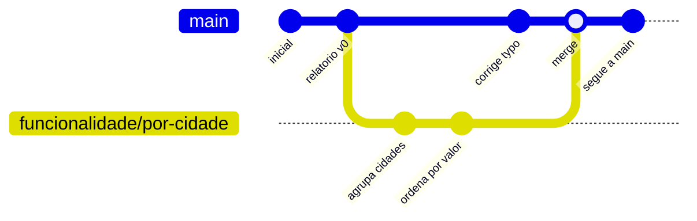

# 02.10 — Branches e merge

> **Módulo 02 — Git e Linux** · Nível: N2 · Tempo estimado: 3h00 · Código: `codigo/cap10/`

## 1. Objetivo

- **Explicar** branch como um **ponteiro móvel** e por que criar uma custa quase nada.
- **Aplicar** `branch`, `switch` e `merge` no fluxo de uma funcionalidade.
- **Resolver** conflitos simples: entender os marcadores, decidir, concluir o merge.
- **Reconhecer** os fluxos de trabalho do mercado (main + feature branches) e o papel do PR.

Ao final, você experimenta mudanças arriscadas sem medo — porque a linha que funciona continua intacta enquanto você trabalha.

---

## 2. Pré-requisitos

- [02.09 — Fluxo essencial do Git](09-fluxo-essencial-do-git.md) — o ciclo diário; branches são uma camada por cima dele.
- [02.08 — Git: o modelo mental](08-git-o-modelo-mental.md) — **a dívida deste capítulo**: o grafo mostrado como linha reta, com a promessa de que um commit pode ter mais de um filho.

**Autoteste:** (1) O que o HEAD marca? (2) O que um commit aponta? (3) O que acontece com o histórico quando você faz um commit novo? As três são a base do que vem aqui.

---

## 3. Motivação

Seu repositório tem uma linha reta de commits, e isso funciona enquanto você faz uma coisa de cada vez. Dois cenários quebram esse arranjo — e você vai encontrar os dois nas próximas semanas.

**O experimento arriscado.** Você quer reescrever o `relatorio_aurora.py` para usar uma estrutura diferente. Pode dar certo e pode não dar. Se você mexer direto no arquivo, passa horas com o programa quebrado, e se decidir desistir no meio precisa desfazer manualmente cada alteração. A alternativa caseira — copiar a pasta para `projeto_teste/` — funciona mal: as correções que você fizer num lado não aparecem no outro, e reunir os dois depois é trabalho manual e propenso a erro.

**Duas pessoas, um projeto.** Você e um colega trabalham no mesmo repositório. Ele mexe na leitura do CSV, você no relatório. Se ambos trabalham na mesma linha, cada envio precisa esperar o outro, e qualquer coisa incompleta que um publique quebra o trabalho do outro.

O Git resolve os dois com o mesmo mecanismo: **branches** — linhas de trabalho paralelas que partem de um ponto comum e podem ser reunidas depois. E a característica que muda tudo é o custo: criar uma branch no Git custa **41 bytes** (um arquivo com o identificador de um commit), o que é fundamentalmente diferente de sistemas anteriores, em que ramificar significava copiar o projeto inteiro e era decisão de arquitetura, não do dia a dia.

Este capítulo abre o grafo prometido no 02.08, apresenta o `merge` que reúne as linhas, e enfrenta o **conflito** — que tem fama de pesadelo e é, na prática, o Git dizendo com honestidade "duas pessoas mudaram a mesma linha; eu não decido isso por você".

---

## 4. Modelo mental

> 🧠 **Modelo mental**
> Uma branch é apenas uma **etiqueta grudada num commit** — e a etiqueta **anda sozinha** quando você faz commits novos. Não há cópia de arquivos, não há pasta paralela: `main` é uma etiqueta, `nova-funcionalidade` é outra, e o **HEAD** é a etiqueta que diz em qual das duas você está. Trocar de branch é mover o HEAD e reescrever os arquivos da pasta para o estado daquele commit. Reunir duas branches é criar um commit com **dois pais**.

**Exercício de previsão.** Você está na `main`, com 10 commits. Cria a branch `experimento`, muda para ela e faz 3 commits. Sem rodar, decida: quantos commits a `main` tem agora? E o que acontece com os arquivos da sua pasta quando você volta para a `main`?

*Resposta comentada:* a `main` continua com **10** — ela é uma etiqueta parada no décimo commit, e quem andou foi a etiqueta `experimento`, agora no décimo terceiro. Ao voltar para a `main`, o Git **reescreve os arquivos da pasta** para o estado do commit 10: o seu trabalho dos 3 commits some da vista — e não some do repositório, porque continua guardado sob a etiqueta `experimento`. Quem responde "13" está pensando em branch como cópia de pasta; quem se assusta com o sumiço dos arquivos ainda não separou "o que está no disco" de "o que está no banco de objetos".

---

## 5. Analogia

Pense num **livro de aventura com escolhas**. A história principal segue seu curso (`main`). Num determinado ponto, você marca a página com um post-it e segue por um caminho alternativo — escrevendo capítulos novos numa branch. Se a alternativa ficar boa, você a incorpora à história principal (`merge`); se não ficar, arranca o post-it e nada da história principal foi tocado.

Duas propriedades importam. Primeira: o post-it é **barato** — colar um não custa nada, e por isso você experimenta sem cerimônia. Segunda: quando duas versões alteraram **o mesmo parágrafo** de formas diferentes, ninguém consegue juntar automaticamente; alguém tem que ler os dois e decidir. Isso é o **conflito**, e ele não é um erro do Git: é o Git recusando-se a escolher no seu lugar.

**Onde a analogia quebra:** livros são lineares e o leitor escolhe um caminho; no Git as linhas coexistem, e o `merge` produz uma versão que contém as duas. E há um detalhe importante: mudar de branch não te dá dois textos abertos ao mesmo tempo — a pasta mostra **uma** versão por vez, a do commit onde o HEAD está.

---

## 6. Teoria

### Criando e trocando

```bash
git branch                          # lista as branches (* marca a atual)
git branch nova-funcionalidade      # cria (sem mudar para ela)
git switch nova-funcionalidade      # muda para ela
git switch -c nova-funcionalidade   # cria E muda, num comando só
git switch main                     # volta para a principal
git switch -                        # alterna com a anterior (como o `cd -`)
```

O `switch` é o comando moderno e específico. Você vai encontrar `git checkout nova-funcionalidade` em textos mais antigos: funciona igual, e o `checkout` acumula tantas funções diferentes (trocar de branch, restaurar arquivo, apontar para um commit) que o Git separou as responsabilidades em `switch` e `restore` — os que este manual usa.

> ⚠️ **Atenção**
> Trocar de branch com alterações não comitadas costuma funcionar (o Git as leva junto), mas falha quando há conflito com o destino. A disciplina que evita dor: **comite ou guarde antes de trocar**. O `git stash`, que guarda alterações temporariamente sem comitar, é apresentado no 02.12.

### O que acontece por baixo

```text
Antes de criar a branch:

    A ── B ── C          ← main (etiqueta), HEAD → main

Depois de switch -c experimento e dois commits:

    A ── B ── C          ← main
               \
                D ── E   ← experimento, HEAD → experimento
```

A `main` não se moveu. O HEAD está na `experimento`, e é ela que avança a cada commit.

### Merge: reunindo as linhas

```bash
git switch main                     # 1. vá para quem VAI RECEBER
git merge experimento               # 2. traga a outra para cá
git branch -d experimento           # 3. apague a etiqueta (o histórico fica)
```

A ordem é a fonte de metade dos enganos: você **vai para o destino** e traz a origem. Quem inverte acaba com a mudança no lugar errado.

Existem dois desfechos possíveis:

**Fast-forward** — quando a `main` não andou desde a separação, o Git só **desliza a etiqueta** para frente. Não há commit novo:

```text
    A ── B ── C ── D ── E     ← main e experimento juntas
```

**Merge commit** — quando as duas linhas avançaram, o Git cria um commit com **dois pais**:

```text
    A ── B ── C ─────── F     ← main (F tem dois pais: C e E)
               \       /
                D ── E        ← experimento
```

Esse commit de dois pais é a materialização do grafo do 02.08. Para ver o desenho:

```bash
git log --oneline --graph --all
```

### Conflitos: quando o Git não decide

O Git resolve sozinho quando as mudanças estão em **arquivos diferentes**, ou em **partes diferentes** do mesmo arquivo. Ele para quando as duas linhas alteraram **as mesmas linhas** de forma diferente:

```text
Auto-merging analise.py
CONFLICT (content): Merge conflict in analise.py
Automatic merge failed; fix conflicts and then commit the result.
```

O arquivo passa a conter os marcadores:

```python
def calcular_total(itens):
<<<<<<< HEAD
    return sum(item for item in itens if item > 0)
=======
    return round(sum(itens), 2)
>>>>>>> experimento
```

A leitura: entre `<<<<<<< HEAD` e `=======` está a versão **de onde você está** (a `main`); entre `=======` e `>>>>>>>` está a versão que chegou (a `experimento`).

Resolver tem três passos, e nenhum deles é automático:

1. **Editar** o arquivo, decidindo o resultado final e **apagando os três marcadores**;
2. `git add arquivo.py` — sinaliza ao Git que aquele conflito foi resolvido;
3. `git commit` — conclui o merge (o Git já oferece uma mensagem pronta).

A decisão do passo 1 não é necessariamente escolher um lado: com frequência, o resultado correto combina os dois — no exemplo acima, filtrar os negativos **e** arredondar.

```bash
git merge --abort          # desiste do merge e volta ao estado anterior
git status                 # durante o conflito, lista os arquivos a resolver
```

O `--abort` é a rede de segurança: em qualquer momento antes do commit final, você pode desfazer tudo e voltar ao estado anterior.

### Nomes e fluxos do mercado

```text
funcionalidade/relatorio-por-cidade
correcao/total-com-devolucoes
docs/atualiza-readme
```

O padrão dominante é **main + feature branches**: a `main` sempre funcional, e cada mudança nasce numa branch própria, curta, com um assunto só. Quando pronta, ela é revisada por outra pessoa antes de entrar — no GitHub, esse ritual chama-se **Pull Request** (02.11), e é onde a maior parte da comunicação técnica de uma equipe acontece.

A propriedade que sustenta o fluxo: **branches curtas**. Uma branch que vive três semanas acumula divergência e transforma o merge num pesadelo de conflitos; uma que vive dois dias reúne-se quase sempre sem atrito.

---

## 7. Funcionamento interno

Por dentro, na medida N2: uma branch é um arquivo de texto em `.git/refs/heads/` contendo **um** identificador de commit — 41 bytes com a quebra de linha. Criar uma branch é criar esse arquivo; e `.git/HEAD` guarda uma referência simbólica (`ref: refs/heads/main`) apontando para qual delas está ativa. Fazer um commit atualiza o arquivo da branch atual para o novo identificador — é literalmente o "andar da etiqueta" do modelo mental. Trocar de branch faz duas coisas: reescreve o `HEAD` e **atualiza os arquivos do disco e o index** para o estado da árvore daquele commit, o que explica por que o trabalho não comitado pode atrapalhar a troca. No merge, o Git localiza o **ancestral comum** das duas linhas e compara cada uma contra ele: mudanças presentes em só um lado são aplicadas direto; mudanças nos dois lados sobre a mesma região disparam o conflito. É por isso que o resultado depende de **onde as linhas se separaram** — e por que branches curtas conflitam menos: menos tempo desde o ancestral comum significa menos território disputado.

---

## 8. Visualização do fluxo

O ciclo de uma funcionalidade, do nascimento da branch à sua remoção:



**Como ler:** a linha de baixo é a branch de funcionalidade, que nasce de um commit da `main` e segue em paralelo. Repare que a `main` **também andou** enquanto isso (o "corrige typo") — é essa divergência dos dois lados que faz o merge criar um commit próprio, com dois pais, em vez de apenas deslizar a etiqueta. Depois do merge, a história volta a ser uma linha só, e a etiqueta da funcionalidade pode ser apagada sem perder nada: os commits dela continuam no grafo, agora como parte da `main`.

---

## 9. Aplicação prática

Uma funcionalidade completa, do nascimento ao merge — inclusive com conflito.

**Passo 1 — Veja onde você está:**

```bash
git branch
git status
git log --oneline -3
```

**Passo 2 — Nasce a branch:**

```bash
git switch -c funcionalidade/relatorio-por-cidade
git branch                  # a nova está marcada com *
```

**Passo 3 — Trabalhe normalmente (o ciclo do 02.09):**

```bash
echo "def agrupar_por_cidade(vendas): ..." >> analise.py
git add analise.py
git commit -m "Agrupa vendas por cidade"

echo "# ordenação por valor" >> analise.py
git add analise.py
git commit -m "Ordena o relatório por valor total"
```

**Passo 4 — Confira a divergência:**

```bash
git log --oneline --graph --all
git switch main
ls                          # os arquivos voltaram ao estado da main!
cat analise.py              # sem as funções novas
git switch -
```

O passo 4 é o exercício mais valioso do capítulo: **ver os arquivos mudarem** ao trocar de branch é o que torna concreto o modelo do ponteiro.

**Passo 5 — Merge sem conflito:**

```bash
git switch main
git merge funcionalidade/relatorio-por-cidade
git log --oneline --graph
git branch -d funcionalidade/relatorio-por-cidade
```

**Passo 6 — Provocando um conflito de propósito:**

```bash
# Na main:
echo "VERSAO = '1.0'" > versao.py
git add versao.py && git commit -m "Define versao 1.0"

# Numa branch, alterando a MESMA linha:
git switch -c ajuste-versao
echo "VERSAO = '1.1-beta'" > versao.py
git add versao.py && git commit -m "Marca versao como beta"

# Na main, alterando a mesma linha de outro jeito:
git switch main
echo "VERSAO = '2.0'" > versao.py
git add versao.py && git commit -m "Promove para versao 2.0"

git merge ajuste-versao          # CONFLICT!
```

**Passo 7 — Resolvendo:**

```bash
git status                       # lista "both modified: versao.py"
cat versao.py                    # veja os marcadores
```

```text
<<<<<<< HEAD
VERSAO = '2.0'
=======
VERSAO = '1.1-beta'
>>>>>>> ajuste-versao
```

```bash
echo "VERSAO = '2.0-beta'" > versao.py    # sua decisão: combina os dois
git add versao.py
git commit -m "Reune versao 2.0 com a marcacao beta"
git log --oneline --graph
```

> 🎯 **Checkpoint rápido**
> De cabeça: por que criar uma branch é barato no Git? E o que significa exatamente a linha `<<<<<<< HEAD` num arquivo em conflito?

---

## 10. Código comentado

Arquivo completo em [`codigo/cap10/branches_e_merge.sh`](codigo/cap10/branches_e_merge.sh) — cria um repositório, ramifica, reúne, e **provoca e resolve um conflito** de ponta a ponta.

```bash
#!/usr/bin/env bash
# ------------------------------------------------------------
# branches_e_merge.sh
# Capítulo 02.10 — Branches e merge
# O que este arquivo demonstra: branch como ponteiro, merge por
#   fast-forward, merge com dois pais, e um conflito resolvido
# Como executar: bash branches_e_merge.sh
# ------------------------------------------------------------

set -euo pipefail

PASTA="branches_temporario"
rm -rf "$PASTA"; mkdir "$PASTA"; cd "$PASTA"

git init -q -b main
git config user.name "Estudante Aurora"
git config user.email "estudante@exemplo.local"

echo "--- 1. Dois commits na main ---"
echo "VERSAO = '1.0'" > versao.py
git add . && git commit -q -m "Inicia projeto Aurora"
echo "def total(v): return sum(v)" > analise.py
git add . && git commit -q -m "Cria funcao de total"
git log --oneline

echo
echo "--- 2. Nasce a branch (uma etiqueta, 41 bytes) ---"
git switch -q -c funcionalidade/por-cidade
echo "  Branches existentes:"
git branch | sed 's/^/  /'
echo "  Tamanho do arquivo da branch: \
$(wc -c < .git/refs/heads/funcionalidade/por-cidade) bytes"

echo
echo "--- 3. Dois commits na branch ---"
echo "def por_cidade(v): pass" >> analise.py
git add . && git commit -q -m "Agrupa vendas por cidade"
echo "# ordena por valor" >> analise.py
git add . && git commit -q -m "Ordena relatorio por valor"

echo
echo "--- 4. A main NAO andou (a etiqueta ficou parada) ---"
echo "  Commits na branch: $(git rev-list --count HEAD)"
echo "  Commits na main:   $(git rev-list --count main)"

echo
echo "--- 5. Trocar de branch reescreve os arquivos do disco ---"
git switch -q main
echo "  Conteudo de analise.py na main:"
sed 's/^/    /' analise.py
git switch -q -
echo "  Conteudo de analise.py na branch:"
sed 's/^/    /' analise.py

echo
echo "--- 6. Merge por fast-forward (a main nao andou) ---"
git switch -q main
git merge -q funcionalidade/por-cidade
git branch -d funcionalidade/por-cidade      # a etiqueta some, o historico fica
git log --oneline --graph

echo
echo "--- 7. Provocando um conflito de proposito ---"
git switch -q -c ajuste-versao
echo "VERSAO = '1.1-beta'" > versao.py
git add . && git commit -q -m "Marca versao como beta"

git switch -q main
echo "VERSAO = '2.0'" > versao.py
git add . && git commit -q -m "Promove para versao 2.0"

# O "|| true" é necessário: o merge com conflito devolve código != 0,
# e com "set -e" o script encerraria justamente no ponto de interesse.
git merge ajuste-versao || true

echo
echo "--- 8. O arquivo em conflito, com os marcadores ---"
sed 's/^/    /' versao.py

echo
echo "--- 9. Resolvendo: a decisao combina os dois lados ---"
echo "VERSAO = '2.0-beta'" > versao.py       # apaga os marcadores!
git add versao.py
git commit -q -m "Reune versao 2.0 com a marcacao beta"

echo "  Resultado final:"
sed 's/^/    /' versao.py
echo "  O merge criou um commit com DOIS pais:"
git log -1 --format="    %h  pais: %p"

echo
echo "--- 10. O grafo completo ---"
git log --oneline --graph --all | sed 's/^/  /'

echo
echo "--- 11. Limpeza ---"
cd ..; rm -rf "$PASTA"
echo "Laboratorio removido."
```

---

## 11. Erros comuns

### Erro 1 — Fazer merge na direção errada

**Sintoma:** você queria levar a funcionalidade para a `main` e acabou com a `main` dentro da branch de funcionalidade — a `main` continua sem a novidade.
**Causa:** o merge traz a branch citada **para onde você está**, e a confusão entre origem e destino é frequente.
**Correção:** a regra em duas partes — **vá para quem recebe**, depois **traga quem chega**: `git switch main` e só então `git merge funcionalidade`. Confira sempre com `git branch` antes; e, se errou, `git merge --abort` (antes de concluir) ou um `reset` (02.12) resolvem.

### Erro 2 — Deixar os marcadores de conflito no arquivo

**Sintoma:** o programa quebra com erro de sintaxe, e no meio do código estão `<<<<<<< HEAD` e `>>>>>>>`.
**Causa:** resolver o conflito escolhendo o conteúdo e esquecer de apagar as três linhas de marcação — elas fazem parte do texto do arquivo, não são metadados invisíveis.
**Correção:** depois de resolver, procure por marcadores antes de comitar: `grep -rn "<<<<<<<" .` (o `grep` do 02.04 trabalhando a seu favor). Editores modernos oferecem botões de resolução que cuidam disso; ainda assim, a verificação é hábito barato — e o módulo 09 mostra como automatizá-la antes do commit.

### Erro 3 — Branches longas demais

**Sintoma:** depois de três semanas trabalhando numa branch, o merge produz dezenas de conflitos e leva um dia inteiro.
**Causa:** quanto mais tempo desde o ancestral comum, mais território disputado (seção 7).
**Correção:** branches **curtas** — dias, não semanas — com um assunto só; e trazer a `main` para dentro da sua branch com frequência (`git switch minha-branch && git merge main`), resolvendo conflitos pequenos enquanto ainda são pequenos. É a diferença entre pagar em parcelas e pagar tudo de uma vez.

---

## 12. Boas práticas

✅ **Uma branch por assunto, com nome descritivo** — `funcionalidade/relatorio-por-cidade`, não `teste2`.

✅ **Branches curtas e reunidas cedo** — a defesa mais eficaz contra conflitos difíceis.

✅ **`git log --oneline --graph --all` sempre que se perder** — o desenho responde "onde eu estou e o que divergiu".

✅ **Ao conflitar, leia os dois lados antes de decidir** — com frequência a resposta certa combina os dois, não escolhe um.

❌ **Evite trabalhar direto na `main`** — mesmo sozinho: a `main` sempre funcional é o que torna possível voltar a um estado bom a qualquer momento.

❌ **Evite `merge` sem saber onde você está** — confira com `git branch` antes; a direção importa.

---

## 13. Performance

Nesta escala, irrelevante — e o motivo é conceitualmente interessante. Criar uma branch é escrever um arquivo de 41 bytes: **tempo constante**, independentemente do tamanho do projeto. É essa característica que mudou a cultura de desenvolvimento: em sistemas anteriores, ramificar copiava o projeto e podia levar minutos, o que fazia de cada branch uma decisão pensada; no Git, ramificar é tão barato que virou o gesto padrão para qualquer mudança. Trocar de branch, por outro lado, custa proporcionalmente aos **arquivos que diferem** entre os dois pontos — daí ser instantâneo entre commits próximos e perceptível ao saltar meses de histórico. E o merge compara três versões (as duas pontas e o ancestral comum), com custo proporcional à divergência. A lição transferível: quando uma operação fica barata o suficiente, ela deixa de ser uma decisão e vira um hábito — e o hábito muda a forma de trabalhar.

---

## 14. Mercado

> 🏢 **Mercado**
> O fluxo **main + feature branches** é o padrão dominante da indústria, e a variação entre empresas é de detalhe, não de conceito. A regra que sustenta tudo: a `main` está sempre em estado publicável, e ninguém escreve nela diretamente — mudanças entram por branch e passam por revisão. No GitHub, esse ritual é o **Pull Request** (02.11): você publica a branch, abre o PR, colegas comentam linha a linha, a automação roda os testes (módulo 12) e, aprovado, o merge acontece. Boa parte da comunicação técnica de uma equipe mora nos PRs — e a habilidade de escrever uma descrição clara e responder a comentários com objetividade pesa tanto quanto o código. Em entrevistas, "como você trabalha com branches?" e "já resolveu um conflito?" são perguntas de rotina; a resposta que impressiona menciona branches curtas e merge frequente da `main`, porque revela quem já sentiu a dor do contrário.
>
> **Mini-cenário:** a partir do 02.11, cada módulo novo do Manual Mestre entra por uma branch (`modulo/03-sql`) e é reunido à `main` quando concluído. O seu histórico passará a mostrar o fluxo profissional — e um repositório com esse padrão comunica experiência antes mesmo de alguém ler o código.

---

## 15. Entrevistas

**P1. "O que é uma branch no Git e por que criá-las é barato?"**
*Resposta esperada:* uma referência (ponteiro) para um commit, guardada num arquivo de 41 bytes em `.git/refs/heads/`. Criar não copia arquivos — daí o custo constante, independentemente do tamanho do projeto. O HEAD indica a branch ativa, e comitar avança o ponteiro. Comparar com sistemas anteriores (em que ramificar copiava o projeto) mostra por que a prática de "uma branch por mudança" só se tornou viável com o Git.

**P2. "Explique o fluxo main + feature branches."**
*Resposta esperada:* `main` sempre funcional e publicável; cada mudança nasce numa branch curta com nome descritivo; ao concluir, abre-se um PR para revisão; testes automatizados rodam; aprovado, faz-se o merge e a branch é apagada. Citar o motivo das branches curtas (menos divergência, menos conflito) é o que separa quem seguiu o processo de quem o entendeu.

**P3. "O que é um conflito e como você resolve?"**
*Resposta esperada:* acontece quando as duas linhas alteraram **as mesmas linhas** de forma diferente — o Git resolve sozinho o resto. Os marcadores delimitam a versão local (`<<<<<<< HEAD`) e a que chega (`>>>>>>>`). Resolver é editar decidindo o resultado (que pode combinar os dois lados), apagar os marcadores, `git add` e `git commit`. Mencionar `git merge --abort` como saída e a verificação por marcadores esquecidos demonstra prática.

**Pegadinha clássica: "Você está numa branch com 3 commits, troca para a `main` e seus arquivos 'sumiram'. O trabalho foi perdido?"**
Ela testa o modelo e provoca o pânico que todo iniciante sente uma vez. **Não foi perdido**: os arquivos da pasta refletem o commit onde o HEAD está, e a `main` está num ponto anterior; os 3 commits continuam guardados no banco de objetos, referenciados pela etiqueta da branch. `git switch minha-branch` traz tudo de volta, e `git log --oneline --all` mostra que os commits nunca saíram do repositório. A resposta forte acrescenta as duas situações vizinhas, que é onde mora o perigo real: **trabalho não comitado** não está protegido por nada — se você trocar de branch com alterações soltas, elas viajam junto ou impedem a troca, e um `git restore` descuidado as apaga de vez. E se você apagar uma branch **não reunida**, o Git avisa e exige `-D` maiúsculo; mesmo assim os commits sobrevivem por semanas e podem ser recuperados pelo `reflog` (02.12). O resumo que demonstra maturidade: *no Git, o que foi comitado é muito difícil de perder; o que não foi comitado não tem proteção nenhuma.*

---

## 16. Exercícios guiados

Enunciados completos em [`exercicios/cap10.md`](exercicios/cap10.md); gabaritos em [`exercicios/gabaritos/cap10.md`](exercicios/gabaritos/cap10.md).

### Aquecimento

- **A1** `[~10 min · o comando certo]` — 6 intenções envolvendo branches: qual comando?
- **A2** `[~10 min · previsão do grafo]` — 4 cenários: desenhe o grafo resultante.
- **A3** `[~10 min · lendo o conflito]` — Interprete um arquivo em conflito e proponha a resolução.
- **A4** `[~10 min · fast-forward ou merge commit?]` — 4 situações: qual desfecho o merge terá?

### Aplicação

- **AP1** `[~25 min · uma funcionalidade completa]` — Branch, dois commits, merge e remoção da etiqueta, conferindo o grafo a cada passo.
- **AP2** `[~25 min · o conflito provocado]` — Crie um conflito de propósito, resolva-o combinando os dois lados e verifique se sobraram marcadores.
- **AP3** `[~20 min · duas funcionalidades em paralelo]` — Trabalhe em duas branches alternadamente e reúna as duas na `main`.

---

## 17. Desafios

- **D1** `[~50 min · a simulação de equipe]` — **Trabalhar em duas frentes, como numa equipe de verdade.** Num repositório de laboratório com um script de análise: (a) crie a branch `funcionalidade/filtro-cidade` e implemente um filtro por cidade em 2 commits; (b) volte à `main` e implemente, em 2 commits, uma correção urgente que **altera a mesma função** — simulando o colega que mexeu no mesmo lugar; (c) reúna a funcionalidade à `main` e resolva o conflito **combinando** as duas mudanças (não escolhendo um lado); (d) verifique que não sobraram marcadores e que o script ainda roda; (e) produza `git log --oneline --graph --all` e explique cada bifurcação do desenho. Fecho: 5 linhas sobre o que teria evitado o conflito — e por que evitá-lo nem sempre é possível nem desejável.

<details><summary>💡 Dica 1 (conceito)</summary>
Para provocar o conflito, as duas linhas precisam alterar **as mesmas linhas** do arquivo. Mudanças em funções diferentes o Git resolve sozinho.
</details>
<details><summary>💡 Dica 2 (estratégia)</summary>
Antes de resolver, rode `git status` — ele lista os arquivos em conflito. E `git merge --abort` desfaz tudo se você quiser tentar de novo.
</details>
<details><summary>💡 Dica 3 (esqueleto)</summary>
init → commit base → branch + 2 commits → switch main + 2 commits → merge (conflito) → editar combinando → add → commit → grep por marcadores → executar → grafo.
</details>

---

## 18. Mini projeto

**Adote o fluxo de branches no seu repositório** `[~45 min de setup + hábito]`

Requisitos numerados:

1. No seu repositório do Manual Mestre, defina e documente no `README.md` a sua convenção de nomes de branch (prefixos por tipo: `modulo/`, `correcao/`, `docs/`).
2. Crie uma branch para o próximo módulo de estudo e trabalhe **apenas** nela por uma sessão inteira.
3. Faça ao menos 3 commits temáticos na branch, e ao final reúna-a à `main`.
4. Documente no caderno de bordo: o grafo antes e depois do merge (`--graph`), e se foi fast-forward ou merge commit — explicando por quê.
5. Provoque **deliberadamente** um conflito num arquivo de teste e resolva-o, registrando os três marcadores e a decisão tomada.

**Critério de "está bom":** o item 5 é o que importa mais, e ele é sobre medo. Conflito tem fama de catástrofe, e a maioria das pessoas trabalha meses desviando dele até que um apareça no pior momento possível. Provocar um em ambiente controlado, com um arquivo que não importa, transforma um evento assustador em procedimento conhecido — e é a diferença entre travar e resolver quando ele acontecer de verdade.

---

## 19. Revisão

**Resumo do capítulo:**

- Branch = **etiqueta (ponteiro) num commit**, num arquivo de 41 bytes; comitar faz a etiqueta andar.
- HEAD indica a branch ativa; trocar de branch **reescreve os arquivos do disco**.
- `switch -c nome` cria e muda; `switch -` alterna; `branch -d` apaga a etiqueta (o histórico fica).
- Merge: **vá para quem recebe, traga quem chega**. Fast-forward (etiqueta desliza) ou merge commit (dois pais).
- Conflito = as duas linhas mudaram as **mesmas linhas**. Resolver: editar, apagar marcadores, `add`, `commit`. `--abort` desfaz.
- Fluxo do mercado: `main` sempre funcional + branches curtas por assunto + revisão por PR.
- Branches curtas conflitam menos — menos tempo desde o ancestral comum, menos território disputado.

**Flashcards novos** (adicionados a [`revisao/flashcards.md`](revisao/flashcards.md)):

| ID | Frente | Verso |
|---|---|---|
| 02.10-F1 | O que é uma branch, tecnicamente, e por que criá-la é barato? | Um arquivo de **41 bytes** em `.git/refs/heads/` com o identificador de um commit. Nada é copiado — custo constante, independente do tamanho do projeto. |
| 02.10-F2 | Explique com suas palavras: por que branches curtas conflitam menos? | (Elaboração) O merge compara as duas pontas contra o **ancestral comum**; quanto mais tempo desde a separação, mais mudanças de cada lado sobre o mesmo território. |
| 02.10-F3 | Preveja: você está na `main` (10 commits), cria uma branch e faz 3 commits nela. Quantos commits a `main` tem? | (Previsão) **10** — a etiqueta `main` ficou parada; quem andou foi a etiqueta da branch. Ao voltar para a `main`, os arquivos do disco voltam ao estado do commit 10. |
| 02.10-F4 | Você quer levar `funcionalidade` para a `main`. Qual a sequência? | (Decisão) `git switch main` **e depois** `git merge funcionalidade` — vá para quem recebe, traga quem chega. Depois, `git branch -d funcionalidade`. |
| 02.10-F5 | O que significam `<<<<<<< HEAD`, `=======` e `>>>>>>>` num arquivo? | Marcadores de conflito: acima do `=======` está a versão de **onde você está**; abaixo, a que **chegou**. Resolver = editar, **apagar os três marcadores**, `add`, `commit`. |

**Agendamento:** registre no `PROGRESSO.md` e marque D+1, D+7, D+30, D+90 na [`Revisoes/agenda.md`](../Revisoes/agenda.md).

---

## 20. Checklist

Perguntas de domínio — teste do sim:

- [ ] Sei explicar *branch como ponteiro e prever o grafo de um cenário*?
- [ ] Sei aplicar *o merge na direção certa, e dizer se será fast-forward*?
- [ ] Sei resolver *um conflito lendo os marcadores e combinando os dois lados*?
- [ ] Sei justificar *por que branches curtas são a defesa contra conflitos difíceis*?
- [ ] Sei responder *à pegadinha dos "arquivos que sumiram" ao trocar de branch*?

Itens práticos:

- [ ] Rodei `branches_e_merge.sh` e vi o conflito ser provocado e resolvido.
- [ ] Troquei de branch e observei os arquivos do disco mudarem.
- [ ] Provoquei e resolvi um conflito por conta própria, sem marcadores esquecidos.
- [ ] Completei "Adote o fluxo de branches no seu repositório" (5 requisitos).
- [ ] Registrei a sessão e agendei as 4 revisões.

---

## 21. Próximo capítulo

Você domina o fluxo local: ramifica, reúne, resolve conflitos. E todo esse trabalho vive numa **única máquina** — se o disco falhar amanhã, o repositório inteiro vai junto, com histórico e tudo. Ficou deliberadamente em aberto a metade distribuída do Git: como um repositório conversa com outro, o que são `clone`, `push`, `pull` e `fetch`, e como publicar o seu trabalho num lugar onde ele sobrevive à sua máquina — e onde outras pessoas podem vê-lo. O próximo capítulo conecta seu repositório ao GitHub, configura autenticação por chave SSH e publica o Manual Mestre: o repositório que, daqui a alguns meses, será o seu portfólio.

→ [02.11 — Remotos e GitHub](11-remotos-e-github.md)

---

*Gerado sob spec 3.0.0*
