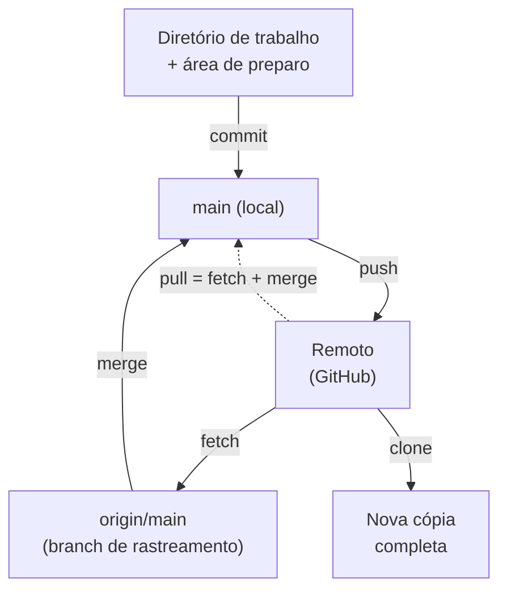

# 02.11 — Remotos e GitHub

> **Módulo 02 — Git e Linux** · Nível: N2 · Tempo estimado: 3h00 · Código: `codigo/cap11/`

## 1. Objetivo

- **Explicar** a relação entre repositório local e remoto, e o que são as branches de rastreamento.
- **Configurar** autenticação com chaves SSH e **publicar** com `remote add` + `push`.
- **Executar** `clone`, `pull`, `fetch` — e explicar a diferença entre os dois últimos.
- **Publicar** o Manual Mestre com um README decente: o repositório que vira portfólio.

Ao final, seu trabalho existe em mais de um lugar, sobrevive à sua máquina e pode ser mostrado a qualquer pessoa.

---

## 2. Pré-requisitos

- [02.10 — Branches e merge](10-branches-e-merge.md) — `pull` é, por dentro, um merge; sem isso, o comportamento dele confunde.
- [02.05 — Permissões e processos](05-permissoes-e-processos.md) — **a dívida deste capítulo**: a permissão 600 que a chave SSH privada exige.

**Autoteste:** (1) O que acontece com seu repositório se o disco falhar agora? (2) O que é um merge? (3) Por que uma chave privada precisa de permissão 600? A primeira é a motivação; as outras duas, a base técnica.

---

## 3. Motivação

Seu repositório está impecável: histórico limpo, branches curtas, mensagens que explicam decisões. E ele existe em **um único lugar** — o disco da sua máquina. Um defeito de hardware, um notebook roubado, uma formatação apressada, e meses de trabalho desaparecem com o `.git` junto.

Esse é o motivo defensivo, e ele bastaria. Mas há dois outros, e são maiores.

**Colaboração.** Nenhum projeto profissional é escrito por uma pessoa só. Enquanto seu repositório for local, não existe forma de outra pessoa contribuir — e "mandar a pasta zipada" reintroduz exatamente os problemas que o Git resolveu.

**Visibilidade.** Um repositório público bem cuidado é a evidência mais direta de competência técnica que existe. Currículos afirmam; um repositório **mostra** — o código, a organização, o histórico, a consistência ao longo de meses. Para quem está mudando de carreira ou buscando a primeira vaga, é frequentemente o item que mais pesa, porque é o único que não depende de acreditar no que você diz.

O Git foi projetado para isso desde o começo: sendo **distribuído** (02.08), cada cópia é um repositório completo, e sincronizar é combinar cópias. Este capítulo mostra como: configurar a autenticação por chave SSH (que resolve o problema da senha de uma vez), conectar seu repositório local a um remoto, e operar os quatro comandos que movem commits entre eles. E, no fim, publicar o Manual Mestre — que a partir de hoje deixa de ser uma pasta e passa a ser um projeto visível.

---

## 4. Modelo mental

> 🧠 **Modelo mental**
> Um remoto é **outro repositório Git completo**, num endereço acessível, com um apelido local (`origin`). Não há hierarquia técnica: o remoto não é "o de verdade" e o seu não é "a cópia" — ambos têm o histórico inteiro, e a diferença é organizacional (o remoto é o ponto de encontro combinado). Entre os dois, o Git mantém um terceiro conjunto de etiquetas: as **branches de rastreamento** (`origin/main`), que registram *onde o remoto estava na última vez que você olhou*. Entender essas três camadas — sua branch, a de rastreamento e o remoto real — dissolve toda a confusão entre `fetch` e `pull`.

**Exercício de previsão.** Você e uma colega clonaram o mesmo repositório. Ela fez 3 commits e enviou. Você, sem sincronizar, fez 2 commits locais e tenta enviar. Sem rodar, decida: o que acontece?

*Resposta comentada:* o `push` é **recusado** — `rejected (non-fast-forward)`. O Git protege o histórico dela: aceitar seu envio faria os 3 commits sumirem do remoto. A saída é trazer o que existe lá (`git pull`), reunir com o seu trabalho (um merge, possivelmente com conflito) e só então enviar. Se você respondeu "sobrescreve o dela", está pensando em sincronização de arquivos, tipo pasta na nuvem; o Git **nunca descarta commits sem que você peça explicitamente** — e a recusa é o mecanismo.

---

## 5. Analogia

Pense num **cartório onde um grupo registra escrituras**. Cada pessoa tem em casa a cópia completa do livro de registros (o repositório local, com todo o histórico). O cartório (o remoto) é o ponto de encontro combinado: quem quer publicar uma escritura leva a sua até lá (`push`), e quem quer se atualizar traz cópia do que foi registrado desde a última visita (`pull`).

Duas regras do cartório explicam quase tudo. A primeira: você **não pode registrar por cima** do que outra pessoa registrou — se o livro dela avançou desde a sua última visita, é preciso primeiro incorporar as páginas dela às suas e só então levar o conjunto. A segunda: dá para **consultar sem incorporar** — pedir para ver o que há de novo (`fetch`) sem colar nada no seu livro, decidindo depois.

**Onde a analogia quebra:** cartórios são autoridade central; num sistema distribuído, o remoto é apenas um repositório em que o grupo combinou de se encontrar — tecnicamente, qualquer cópia pode assumir esse papel, e é por isso que projetos sobrevivem à queda do servidor. E há um detalhe operacional: o cartório da analogia guarda originais; aqui, todo mundo tem o histórico completo o tempo todo.

---

## 6. Teoria

### Autenticação: chaves SSH

Antes de qualquer coisa, o problema de "como o servidor sabe que sou eu". Autenticação por senha é frágil e incômoda; o padrão é o **par de chaves**: uma **privada**, que nunca sai da sua máquina, e uma **pública**, que você entrega ao serviço.

```bash
ssh-keygen -t ed25519 -C "seu@email.com"     # gera o par (aceite o caminho padrão)
# defina uma frase-senha quando perguntado — é a proteção se a máquina for roubada

cat ~/.ssh/id_ed25519.pub                     # a PÚBLICA: esta você copia e cola
ls -l ~/.ssh/                                 # confira as permissões
```

```text
-rw------- 1 voce voce  464 id_ed25519       ← privada: 600, só o dono
-rw-r--r-- 1 voce voce  103 id_ed25519.pub   ← pública: 644, pode ser lida
```

Ali está o 02.05 trabalhando: a chave privada **precisa** de 600 — o cliente SSH **recusa-se a usá-la** se outros usuários puderem lê-la, e essa recusa é uma proteção, não um capricho.

A chave pública vai para o GitHub em *Settings → SSH and GPG keys → New SSH key*. Depois:

```bash
ssh -T git@github.com        # testa: deve responder "Hi <usuario>!"
```

> ⚠️ **Atenção**
> A chave **privada** (`id_ed25519`, sem extensão) nunca é publicada, nunca vai para um repositório, nunca é enviada por mensagem. Só a `.pub` circula. E ela nunca deve ser versionada — daí `.ssh/` e `*.key` estarem no `.gitignore` do 02.09. Se uma chave privada vazar, o procedimento é o mesmo dos segredos do 02.06: **revogar** (apagar a pública do serviço) e gerar um par novo.

### Conectando o local ao remoto

Dois caminhos, conforme de onde você parte:

**Você já tem o repositório local** (o seu caso):

```bash
# 1. crie o repositório VAZIO no GitHub (sem README, sem .gitignore)
git remote add origin git@github.com:usuario/manual-mestre.git
git remote -v                       # confere: fetch e push apontando para lá
git push -u origin main             # primeiro envio, estabelecendo o rastreamento
```

**O repositório já existe no servidor:**

```bash
git clone git@github.com:usuario/projeto.git
cd projeto                          # o remoto "origin" já vem configurado
```

O `origin` é apenas um **apelido** — a convenção universal para "o remoto principal". O `-u` do primeiro push estabelece o vínculo entre `main` local e `origin/main`, e é o que permite digitar `git push` sozinho daí em diante.

### Os quatro comandos

| Comando | O que faz | Toca seus arquivos? |
|---|---|---|
| `git clone URL` | copia um repositório inteiro para uma pasta nova | cria a pasta |
| `git push` | envia seus commits para o remoto | não |
| `git fetch` | **baixa** as novidades, sem incorporar | **não** |
| `git pull` | `fetch` + `merge` — baixa **e** incorpora | **sim** |

A distinção `fetch`/`pull` é a pergunta de entrevista mais frequente do capítulo, e a resposta está no modelo das três camadas:

```bash
git fetch origin              # atualiza APENAS a etiqueta origin/main
git log --oneline main..origin/main    # o que existe lá e não aqui
git diff main origin/main              # o que exatamente mudou
git merge origin/main                  # agora sim, incorpora

git pull                      # os três últimos passos, de uma vez
```

O `fetch` é o hábito profissional: ver antes de incorporar, especialmente quando você tem trabalho em andamento. O `pull` é a conveniência do dia a dia, quando o diretório está limpo.

### Enviando branches

```bash
git switch -c funcionalidade/relatorio
# ... commits ...
git push -u origin funcionalidade/relatorio    # publica a branch
```

No GitHub, a branch publicada gera o convite para abrir um **Pull Request** — o pedido de revisão do 02.10. O fluxo completo: publica a branch → abre o PR com descrição → colegas comentam → automação roda os testes → aprovado, o merge acontece no servidor → você atualiza sua `main` com `git pull` e apaga a branch local.

### O README: a porta de entrada

O `README.md` é a primeira (e frequentemente única) coisa que alguém lê. Um bom README responde, em ordem:

1. **O que é** este projeto, em uma frase;
2. **Por que** existe;
3. **Como usar** — instalação e primeiro comando, testáveis;
4. **Como está organizado** — a estrutura de pastas;
5. **Estado atual** — o que funciona, o que não.

Nada disso exige extensão: um README de trinta linhas bem escritas vale mais que trezentas mal organizadas. E vale a inversão de perspectiva: escreva para alguém que **nunca viu** o projeto e tem dois minutos.

### Repositório público ou privado?

Público expõe o código a qualquer pessoa — é o que permite usá-lo como portfólio. Antes de tornar público, confira três coisas: **nenhum segredo** em nenhum commit do histórico (não apenas no estado atual), nenhum dado pessoal de terceiros, e nenhum material com restrição de licença. Na dúvida, comece privado; tornar público depois é um clique, e o caminho inverso não desfaz o que já foi visto.

---

## 7. Funcionamento interno

Por dentro, na medida N2: o Git guarda a configuração de remotos em `.git/config` (o mapeamento apelido → URL) e mantém as branches de rastreamento em `.git/refs/remotes/origin/`. Um `fetch` abre conexão, negocia com o outro lado **quais objetos faltam** (o protocolo troca identificadores, não arquivos inteiros), baixa apenas o que não existe localmente e atualiza as referências em `refs/remotes/` — sem tocar em `refs/heads/` nem no disco de trabalho, e é exatamente por isso que ele é seguro em qualquer situação. O `push` faz o caminho inverso, com uma verificação a mais: o servidor só aceita a atualização se o commit que você envia **contém** o commit atual da branch remota como ancestral — o teste de *fast-forward*. Falhar nesse teste é o `rejected` do exercício de previsão, e é a proteção que impede que um envio apague o trabalho de outra pessoa. O `--force` desliga essa verificação, o que explica por que ele é perigoso em branches compartilhadas e por que existe o `--force-with-lease`, que ao menos confirma que ninguém publicou nada desde a sua última leitura.

---

## 8. Visualização do fluxo

As três camadas e os comandos que as movem:



**Como ler:** a coluna do meio tem **três** camadas, não duas — e é aí que mora a confusão comum. `origin/main` não é o remoto: é a sua anotação local de onde o remoto estava na última consulta. O `fetch` atualiza só essa anotação (seta cheia, sem tocar no seu trabalho); o `merge` traz a anotação para a sua branch; o `pull` (seta pontilhada) faz os dois de uma vez. Repare que **nenhuma seta vai do remoto direto para o diretório de trabalho** — toda incorporação passa pela sua branch local, com merge, e pode conflitar.

---

## 9. Aplicação prática

Publicando o Manual Mestre.

**Passo 1 — Gere e instale a chave SSH:**

```bash
ssh-keygen -t ed25519 -C "seu@email.com"      # Enter para o caminho padrão
cat ~/.ssh/id_ed25519.pub                      # copie a linha inteira
ls -l ~/.ssh/id_ed25519                        # confirme o -rw------- (600)
```

Cole no GitHub em *Settings → SSH and GPG keys → New SSH key* e teste:

```bash
ssh -T git@github.com
```

```text
Hi seu-usuario! You've successfully authenticated, but GitHub does not
provide shell access.
```

Essa segunda linha **não é erro** — o GitHub está dizendo que a autenticação funcionou e que ele não oferece terminal remoto.

**Passo 2 — Crie o repositório vazio no GitHub:**

Em *New repository*: nome `manual-mestre`, sem README, sem `.gitignore`, sem licença. O repositório precisa nascer vazio porque o seu já tem histórico — nascendo com arquivos, os dois históricos divergem antes mesmo do primeiro push.

**Passo 3 — Conecte e publique:**

```bash
cd ~/manual-mestre
git remote add origin git@github.com:seu-usuario/manual-mestre.git
git remote -v
git push -u origin main
```

```text
Enumerating objects: 247, done.
Writing objects: 100% (247/247), 186.42 KiB | 3.10 MiB/s, done.
To github.com:seu-usuario/manual-mestre.git
 * [new branch]      main -> main
branch 'main' set up to track 'origin/main'.
```

Abra o repositório no navegador: seu trabalho está lá, com todo o histórico.

**Passo 4 — O ciclo com remoto:**

```bash
echo "- 02.11 concluído" >> PROGRESSO.md
git add PROGRESSO.md
git commit -m "Registra estudo do capitulo 02.11"
git push                        # sem -u: o vínculo já existe
```

**Passo 5 — Simule a colaboração (clone numa outra pasta):**

```bash
cd /tmp
git clone git@github.com:seu-usuario/manual-mestre.git copia-teste
cd copia-teste
git log --oneline -3            # o histórico completo veio junto
echo "- linha da outra máquina" >> PROGRESSO.md
git add . && git commit -m "Acrescenta linha de teste"
git push
```

**Passo 6 — Traga de volta, com `fetch` antes do `merge`:**

```bash
cd ~/manual-mestre
git fetch origin
git log --oneline main..origin/main      # o que existe lá e não aqui
git merge origin/main                     # incorpora
git log --oneline -3
```

O passo 6 é o hábito que vale carregar: **olhar antes de incorporar**.

> 🎯 **Checkpoint rápido**
> De cabeça: qual a diferença entre `fetch` e `pull`? E por que o GitHub recusa um `push` quando o remoto tem commits que você não tem?

---

## 10. Código comentado

Arquivo completo em [`codigo/cap11/remoto_local.sh`](codigo/cap11/remoto_local.sh) — o ciclo completo com remoto, **sem depender de internet**: um repositório local simula o servidor.

```bash
#!/usr/bin/env bash
# ------------------------------------------------------------
# remoto_local.sh
# Capítulo 02.11 — Remotos e GitHub
# O que este arquivo demonstra: clone, push, fetch, pull e a
#   recusa de push, usando um repositório "bare" como servidor
# Como executar: bash remoto_local.sh
# ------------------------------------------------------------

set -euo pipefail

BASE="remoto_temporario"
rm -rf "$BASE"; mkdir "$BASE"; cd "$BASE"
RAIZ="$PWD"

identificar() {                      # a identidade em cada cópia
    git config user.name "Estudante Aurora"
    git config user.email "estudante@exemplo.local"
}

echo "--- 1. O 'servidor': um repositório bare (sem pasta de trabalho) ---"
git init -q --bare -b main servidor.git       # -b main: mesma linha principal
echo "  Criado: servidor.git (é o que o GitHub hospeda por baixo)"

echo
echo "--- 2. Máquina A: repositório local e primeiro push ---"
mkdir maquina-a && cd maquina-a
git init -q -b main; identificar
echo "# Aurora" > README.md
git add . && git commit -q -m "Cria README do projeto"
git remote add origin "$RAIZ/servidor.git"
git push -q -u origin main
echo "  Enviado. Remotos configurados:"
git remote -v | sed 's/^/    /'

echo
echo "--- 3. Máquina B: clone (o histórico completo vem junto) ---"
cd "$RAIZ"
git clone -q servidor.git maquina-b
cd maquina-b; identificar
echo "  Commits recebidos: $(git rev-list --count HEAD)"
echo "  Remoto já configurado: $(git remote get-url origin | xargs basename)"

echo
echo "--- 4. Máquina B trabalha e envia ---"
echo "vendas = []" > analise.py
git add . && git commit -q -m "Cria estrutura de analise"
git push -q origin main
echo "  Máquina B enviou 1 commit."

echo
echo "--- 5. Máquina A tenta enviar SEM sincronizar → recusado ---"
cd "$RAIZ/maquina-a"
echo "config = {}" > config.py
git add . && git commit -q -m "Cria arquivo de configuracao"
# O "|| true" mantém o script vivo: o push recusado devolve código != 0
git push origin main 2>&1 | grep -E "rejected|fetch first" | sed 's/^/    /' || true
echo "    (o Git protegeu o commit da outra máquina)"

echo
echo "--- 6. O caminho correto: fetch, olhar, merge ---"
git fetch -q origin
echo "  O que existe no remoto e não aqui:"
git log --oneline main..origin/main | sed 's/^/    /'
git merge -q origin/main -m "Reune trabalho da maquina B"
echo "  Depois do merge, commits locais: $(git rev-list --count HEAD)"

echo
echo "--- 7. Agora o push é aceito ---"
git push -q origin main
echo "  Enviado com sucesso."

echo
echo "--- 8. Máquina B se atualiza com pull (fetch + merge) ---"
cd "$RAIZ/maquina-b"
git pull -q origin main
echo "  Arquivos na máquina B agora:"
ls | sed 's/^/    /'
echo "  Histórico conciliado:"
git log --oneline --graph | sed 's/^/    /'

echo
echo "--- 9. Limpeza ---"
cd "$RAIZ/.."; rm -rf "$BASE"
echo "Laboratório removido."
```

---

## 11. Erros comuns

### Erro 1 — `Permission denied (publickey)`

**Sintoma:** o `push` ou o `clone` falha com essa mensagem, e nada acontece.
**Causa:** a chave SSH não foi encontrada, não foi cadastrada no serviço, ou está com permissões erradas.
**Correção:** diagnostique em ordem — `ssh -T git@github.com` (a mensagem de erro indica onde parou); `ls -l ~/.ssh/` (a privada precisa de **600**, e o cliente recusa se estiver mais aberta); confirme que a chave **pública** está cadastrada no serviço; e verifique se o remoto usa SSH e não HTTPS (`git remote -v` — endereços `https://` pedem outra forma de autenticação). Corrigir permissão: `chmod 600 ~/.ssh/id_ed25519` (02.05).

### Erro 2 — `Updates were rejected because the remote contains work that you do not have`

**Sintoma:** o `push` é recusado.
**Causa:** o remoto avançou desde a sua última sincronização — outra pessoa (ou você, de outra máquina) publicou commits.
**Correção:** `git pull` (ou `fetch` + `merge`), resolver conflitos se houver, e enviar de novo. **Não** use `--force`: ele descarta os commits do outro lado, e é a forma mais rápida de destruir o trabalho de alguém. A exceção — branch pessoal, não compartilhada, depois de reescrever histórico deliberadamente — usa `--force-with-lease`, que ao menos verifica se ninguém publicou nada desde a sua última leitura.

### Erro 3 — Publicar segredo junto com o repositório

**Sintoma:** o repositório vai para o GitHub e, junto, um `.env`, uma chave, ou um arquivo de configuração com senha comitado semanas atrás.
**Causa:** `.gitignore` criado tarde demais, ou o arquivo já rastreado antes da regra (02.09).
**Correção:** antes de tornar público, **audite o histórico inteiro**, não só o estado atual: `git log --all --name-only | sort -u | grep -iE "\.env|\.key|senha|credencial"`. E se algo já foi publicado, o primeiro passo não é técnico — **revogue a credencial** (02.06), depois trate o repositório. É por isso que o hábito de começar privado e revisar antes de publicar custa pouco e evita muito.

---

## 12. Boas práticas

✅ **Chave SSH com frase-senha, privada em 600** — a autenticação que você configura uma vez e esquece.

✅ **`git fetch` + olhar antes de `merge`, quando há trabalho em andamento** — evita surpresas no meio de uma mudança.

✅ **Publique branches, não commits diretos na `main`** — mesmo sozinho, o hábito prepara para o fluxo de equipe.

✅ **README que responde as cinco perguntas** — é a porta de entrada e, muitas vezes, a única coisa lida.

✅ **Audite o histórico antes de tornar público** — segredos, dados de terceiros, material com restrição.

❌ **Evite `git push --force` em branch compartilhada** — apaga commits alheios; se for inevitável, `--force-with-lease`.

---

## 13. Performance

Nesta escala, irrelevante. Três notas para quando importar: o protocolo do Git negocia **quais objetos faltam** antes de transferir, então enviar dez commits de texto move alguns kilobytes, não o repositório inteiro — a rede raramente é o gargalo em projetos de código. O que pesa é histórico com **binários grandes**: cada versão é um objeto completo, e um repositório com vídeos ou bases de dados demora minutos para clonar e não emagrece removendo os arquivos depois (as versões antigas continuam lá). E o `clone` traz **todo** o histórico por padrão; em repositórios muito antigos existe o `--depth 1`, que baixa só o estado atual — útil para automações (módulo 09), inadequado para trabalho de desenvolvimento, porque um repositório raso não tem o histórico que dá sentido às operações locais.

---

## 14. Mercado

> 🏢 **Mercado**
> O GitHub é, na prática, a infraestrutura de trabalho de boa parte da indústria: além de hospedar código, é onde acontecem a revisão (PRs), a gestão de tarefas (issues), a automação (Actions, no módulo 09) e a documentação. Ter um perfil com repositórios organizados é uma das poucas formas de demonstrar competência sem depender de credenciais formais — e, para quem está migrando de carreira, costuma ser o item mais eficaz do processo. O que se avalia num repositório de portfólio: README que explica o projeto, histórico com mensagens coerentes, código organizado, ausência de segredos, e — o que mais pesa — **consistência ao longo do tempo**. Um repositório com commits regulares durante seis meses comunica disciplina de um jeito que nenhuma afirmação de currículo alcança.
>
> **Mini-cenário:** a partir de hoje o Manual Mestre está publicado. Cada capítulo estudado vira um commit datado, e o gráfico de atividade do seu perfil registra a trilha inteira. Quando você chegar ao módulo 13 e publicar o Atlas 1.0, o repositório terá história — e a história é o que diferencia um portfólio de uma pasta de exemplos.

---

## 15. Entrevistas

**P1. "Qual a diferença entre `fetch` e `pull`?"**
*Resposta esperada:* `fetch` baixa os objetos e atualiza apenas as branches de rastreamento (`origin/main`), **sem** tocar na sua branch nem nos seus arquivos; `pull` é `fetch` + `merge`, portanto altera seu trabalho e pode gerar conflito. Prática recomendada: `fetch` e inspecionar (`git log main..origin/main`) quando há trabalho em andamento; `pull` quando o diretório está limpo. Ancorar nas três camadas (branch local, rastreamento, remoto) é o que demonstra o modelo.

**P2. "O que é o `origin`?"**
*Resposta esperada:* um **apelido** para a URL de um remoto — convenção, não obrigação. Um repositório pode ter vários remotos (`origin`, `upstream` em projetos bifurcados), e `git remote -v` os lista. Deixar claro que não há hierarquia técnica entre local e remoto (ambos são repositórios completos) mostra que o conceito de "distribuído" foi entendido.

**P3. "Como você configura autenticação com o GitHub?"**
*Resposta esperada:* par de chaves SSH (`ssh-keygen -t ed25519`), pública cadastrada no serviço, privada na máquina com permissão 600 e frase-senha; teste com `ssh -T git@github.com`. Alternativa: HTTPS com token de acesso pessoal, nunca senha de conta. Citar que a chave privada não é versionada nem compartilhada, e o que fazer se vazar (revogar e gerar outra), completa a resposta.

**Pegadinha clássica: "Seu colega diz que fez `git push --force` e o seu trabalho sumiu do repositório. Recuperável?"**
Ela testa entendimento do modelo distribuído **e** postura diante de incidentes. A resposta forte separa três fatos. **Primeiro**: no remoto, os commits deixaram de ser referenciados pela branch, mas continuam existindo por um tempo — em serviços como o GitHub, é possível recuperá-los pelo identificador, e o `reflog` do servidor (quando acessível) ou de qualquer clone os localiza. **Segundo, e o mais importante**: como o Git é distribuído, **qualquer pessoa que tivesse o trabalho localmente ainda o tem** — se você não apagou seu repositório, seus commits estão intactos na sua máquina, e republicá-los resolve o incidente. É a propriedade que torna o modelo distribuído resiliente na prática, não só na teoria. **Terceiro**: a prevenção é organizacional, não técnica — proteção de branch no serviço (impedindo force push na `main`), `--force-with-lease` no lugar do `--force`, e a combinação de nunca reescrever histórico já compartilhado (02.12). Fechar reconhecendo o limite honesto: se o trabalho **só** existia no remoto e o serviço já expirou os objetos soltos, aí sim está perdido — e é por isso que "está no remoto" não substitui backup.

---

## 16. Exercícios guiados

Enunciados completos em [`exercicios/cap11.md`](exercicios/cap11.md); gabaritos em [`exercicios/gabaritos/cap11.md`](exercicios/gabaritos/cap11.md).

### Aquecimento

- **A1** `[~10 min · o comando certo]` — 6 intenções envolvendo remotos: qual comando?
- **A2** `[~10 min · fetch × pull]` — 4 cenários: o que muda em cada camada?
- **A3** `[~10 min · diagnóstico]` — 5 mensagens de erro de remoto: causa e correção.
- **A4** `[~10 min · o que não publicar]` — 6 itens: podem ir para um repositório público?

### Aplicação

- **AP1** `[~25 min · publicando de verdade]` — Gere a chave SSH, crie o repositório e publique o seu Manual Mestre.
- **AP2** `[~25 min · simulando duas máquinas]` — Clone em outra pasta, trabalhe nos dois lados e reconcilie.
- **AP3** `[~20 min · o README que abre a porta]` — Escreva o README do seu repositório respondendo às cinco perguntas.

---

## 17. Desafios

- **D1** `[~60 min · o repositório-portfólio]` — **O repositório que você vai mostrar.** Publique o Manual Mestre com padrão profissional: (a) chave SSH configurada e testada, com a privada em 600 comprovada por `ls -l`; (b) **auditoria do histórico completo** procurando segredos, com o comando registrado e o resultado; (c) `README.md` respondendo às cinco perguntas, com a estrutura de pastas e o estado atual da trilha; (d) publique uma branch de funcionalidade e abra um **Pull Request** de você para você mesmo, com descrição decente — e faça o merge pelo GitHub; (e) atualize o local com `pull` e apague a branch nos dois lados. Fecho: 5 linhas avaliando o que o seu repositório comunica hoje a um recrutador técnico, e o que falta.

<details><summary>💡 Dica 1 (conceito)</summary>
Auditoria do histórico: `git log --all --name-only --format="" | sort -u` lista todo arquivo que já existiu no repositório — filtre com `grep -iE "env|key|senha|credencial|token"`.
</details>
<details><summary>💡 Dica 2 (estratégia)</summary>
O PR de você para você mesmo parece estranho e é o melhor treino disponível: escreva a descrição como se fosse para um colega que não acompanhou a mudança.
</details>
<details><summary>💡 Dica 3 (esqueleto)</summary>
ssh-keygen → cadastrar → auditar histórico → README → remote add → push -u → branch → push → PR → merge → pull → branch -d local e remota.
</details>

---

## 18. Mini projeto

**Sincronização como hábito** `[~40 min de setup + rotina]`

Requisitos numerados:

1. Publique o repositório do Manual Mestre (se ainda não fez no D1) e confirme que o histórico completo está lá.
2. Estabeleça a rotina: ao **começar** a estudar, `git pull`; ao **terminar**, commit e `push`. Documente-a no README.
3. Simule uma segunda máquina clonando em outra pasta. Trabalhe alternadamente nos dois lados por três ciclos, sempre sincronizando antes de começar.
4. Provoque **deliberadamente** um push recusado (commits nos dois lados sem sincronizar), registre a mensagem completa e resolva pelo caminho correto.
5. Documente no caderno: o que `git remote -v`, `git branch -vv` e `git log --oneline --graph --all` mostram no seu repositório — e o que cada um responde.

**Critério de "está bom":** o item 4 é o coração. O push recusado é o primeiro susto de todo mundo com remotos, e quem o encontra pela primeira vez num momento de pressa costuma resolver com `--force` — apagando trabalho alheio. Encontrá-lo em ambiente controlado, ler a mensagem com calma e resolver pelo caminho certo transforma o susto em procedimento. E o `git branch -vv` do item 5 é o comando que raramente se ensina e sempre se precisa: ele mostra, para cada branch local, qual remota ela rastreia e quantos commits está à frente ou atrás.

---

## 19. Revisão

**Resumo do capítulo:**

- Remoto = **outro repositório completo**, com apelido local (`origin`); não há hierarquia técnica.
- Três camadas: sua branch (`main`) · rastreamento (`origin/main`, sua anotação) · o remoto real.
- SSH: `ssh-keygen -t ed25519`, pública cadastrada no serviço, **privada em 600** e nunca publicada.
- `clone` copia tudo · `push` envia · `fetch` baixa **sem** incorporar · `pull` = `fetch` + `merge`.
- Push recusado = o remoto avançou. Solução: `pull`, reunir, reenviar. **Nunca** `--force` em branch compartilhada.
- Branch publicada → Pull Request → revisão → merge no servidor → `pull` local e apagar a branch.
- Antes de publicar: audite o **histórico inteiro** por segredos; comece privado se houver dúvida.

**Flashcards novos** (adicionados a [`revisao/flashcards.md`](revisao/flashcards.md)):

| ID | Frente | Verso |
|---|---|---|
| 02.11-F1 | Qual a diferença entre `git fetch` e `git pull`? | `fetch` baixa e atualiza só `origin/main`, **sem** tocar no seu trabalho; `pull` = `fetch` + `merge`, altera seus arquivos e pode conflitar. |
| 02.11-F2 | Explique com suas palavras: o que é `origin/main`? | (Elaboração) Uma **branch de rastreamento**: a sua anotação local de onde o remoto estava na última consulta. Não é o remoto, e só se atualiza com `fetch`/`pull`. |
| 02.11-F3 | Preveja: o remoto tem 3 commits que você não tem, e você tenta `push`. O que acontece? | (Previsão) Recusado (`non-fast-forward`) — o Git protege os commits do outro lado. Solução: `pull`, reunir, reenviar. Nunca `--force` em branch compartilhada. |
| 02.11-F4 | Que permissão a chave SSH privada precisa ter — e por quê? | (Decisão) **600** (só o dono lê e escreve). O cliente SSH **recusa** chaves legíveis por outros: se qualquer usuário do sistema pudesse lê-la, ela não autenticaria mais ninguém com segurança. |
| 02.11-F5 | O que verificar antes de tornar um repositório público? | Segredos em **todo o histórico** (não só no estado atual), dados pessoais de terceiros e material com restrição de licença. Na dúvida: comece privado. |

**Agendamento:** registre no `PROGRESSO.md` e marque D+1, D+7, D+30, D+90 na [`Revisoes/agenda.md`](../Revisoes/agenda.md).

---

## 20. Checklist

Perguntas de domínio — teste do sim:

- [ ] Sei explicar *as três camadas (branch, rastreamento, remoto) e o que cada comando move*?
- [ ] Sei diferenciar *`fetch` e `pull`, e justificar quando prefiro cada um*?
- [ ] Sei configurar *autenticação SSH e diagnosticar `Permission denied (publickey)`*?
- [ ] Sei explicar *por que um push é recusado e por que `--force` é perigoso*?
- [ ] Sei auditar *um repositório antes de torná-lo público*?

Itens práticos:

- [ ] Rodei `remoto_local.sh` e vi o push recusado e reconciliado.
- [ ] Publiquei o Manual Mestre no GitHub, com o histórico completo.
- [ ] Escrevi um README que responde às cinco perguntas.
- [ ] Completei "Sincronização como hábito" — inclusive o push recusado provocado.
- [ ] Registrei a sessão e agendei as 4 revisões.

---

## 21. Próximo capítulo

Seu repositório está publicado, o fluxo funciona, e você tem uma nova categoria de medo: **e quando eu errar?** Commit com a mensagem errada, arquivo comitado sem querer, mudança que quebrou tudo e precisa voltar, trabalho no meio de uma coisa quando surge uma urgência em outra. Ficou deliberadamente em aberto a caixa de ferramentas do arrependimento — `restore`, `revert`, `reset` (com seus três modos), `stash` — e, acima de tudo, a árvore de decisão que diz **qual usar**, cuja pergunta central é: *o commit já foi publicado?* O capítulo final do módulo entrega essa árvore, apresenta o `reflog` (a rede de segurança que recupera o que parecia perdido) e fecha com o mini projeto: o fluxo de trabalho completo do Atlas, publicado com histórico legível.

→ [02.12 — Desfazendo + mini projeto](12-desfazendo-e-mini-projeto.md)

---

*Gerado sob spec 3.0.0*
