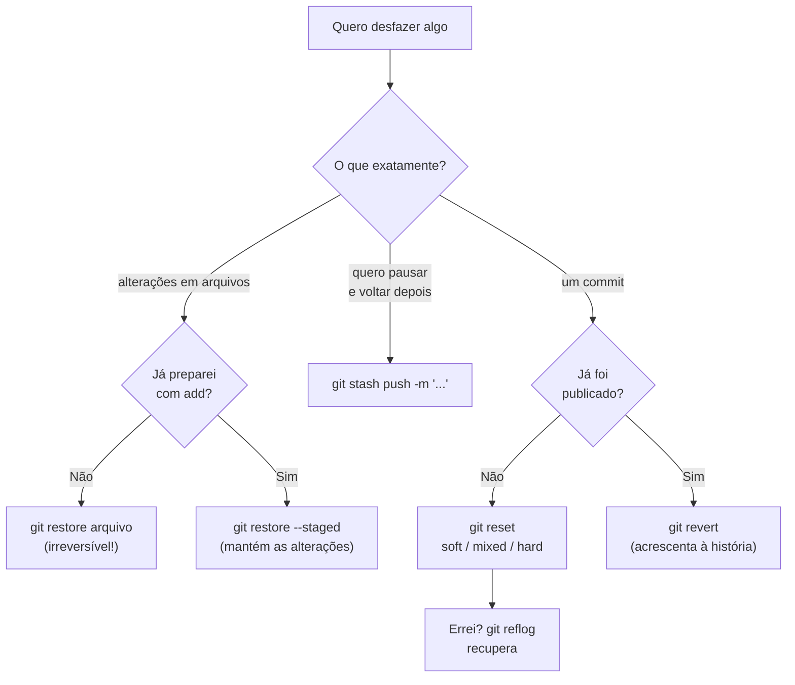

# 02.12 — Desfazendo + mini projeto

> **Módulo 02 — Git e Linux** · Nível: N2 · Tempo estimado: 4h00 · Código: `codigo/cap12/`

## 1. Objetivo

- **Diferenciar** `restore`, `revert`, `reset` (soft/mixed/hard) e `stash` pelo que cada um desfaz.
- **Aplicar** a árvore de decisão: "o que eu quero desfazer, e o commit já foi publicado?"
- **Recuperar** trabalho aparentemente perdido com `reflog` — a rede de segurança que tira o medo.
- **Construir** o fluxo de trabalho padrão do Atlas e publicá-lo com histórico legível.

Ao final, errar deixa de ser um problema: você sabe exatamente qual ferramenta usa cada arrependimento.

---

## 2. Pré-requisitos

- [02.11 — Remotos e GitHub](11-remotos-e-github.md) — a pergunta central deste capítulo é "já foi publicado?".
- [02.09 — Fluxo essencial do Git](09-fluxo-essencial-do-git.md) — as três áreas em movimento; desfazer é mover coisas entre elas para trás.

**Autoteste:** (1) O que `git restore --staged` faz? (2) Qual a diferença entre um commit local e um publicado? (3) O que acontece quando você faz `push` de um histórico reescrito? Se a (3) parecer nebulosa, ela é o eixo do capítulo.

---

## 3. Motivação

Onze capítulos depois, você opera o Git com fluência — e carrega um medo específico, que praticamente todo mundo carrega: **o medo de errar de forma irreversível**. Ele se manifesta em sintomas conhecidos: evitar comandos que não se conhece, copiar soluções da internet sem entender, refazer o trabalho do zero em vez de tentar recuperar, e — o mais comum — deixar de experimentar.

O medo é compreensível e, em grande parte, **infundado**. O Git foi projetado para não perder trabalho: praticamente tudo o que foi comitado alguma vez continua recuperável por semanas, mesmo depois de operações que parecem destrutivas. O que falta não é segurança; é **saber qual ferramenta usar**.

E são muitas, com nomes parecidos e efeitos bem diferentes. `restore` desfaz alterações em arquivos. `revert` cria um commit que anula outro. `reset` move o ponteiro da branch — e tem três modos que confundem até quem usa Git há anos. `stash` guarda trabalho temporariamente. Escolher errado no momento errado é a única forma real de perder algo.

A boa notícia é que a escolha se resolve com **duas perguntas**: *o que eu quero desfazer?* e *isso já foi publicado?* Este capítulo transforma essas duas perguntas numa árvore de decisão, apresenta o `reflog` (o histórico do histórico, que recupera o que parecia perdido) e fecha o módulo com o mini projeto: o fluxo de trabalho completo do Atlas, publicado com histórico legível.

---

## 4. Modelo mental

> 🧠 **Modelo mental**
> Desfazer no Git é escolher **em qual das três áreas** você quer voltar atrás, e **se a história pode mudar**. Alterações soltas no diretório de trabalho: `restore`. Coisas na área de preparo: `restore --staged`. Commits que ainda **não saíram** da sua máquina: `reset`, que reescreve a história. Commits **já publicados**: `revert`, que acrescenta um capítulo dizendo "aquilo foi desfeito" em vez de arrancar a página. E, para tudo o que já foi comitado alguma vez, o `reflog` guarda o rastro — inclusive do que "sumiu".

**Exercício de previsão.** Você tem 5 commits locais, nenhum publicado. Roda `git reset --hard HEAD~2`. Sem consultar, decida: (a) o que acontece com os 2 últimos commits, (b) com os arquivos da pasta, e (c) eles podem ser recuperados?

*Resposta comentada:* (a) a branch volta ao terceiro commit — os 2 últimos deixam de estar na história; (b) os arquivos da pasta voltam ao estado daquele commit, e **qualquer alteração não comitada é destruída sem aviso**; (c) os commits **continuam recuperáveis** pelo `reflog` por semanas, porque o Git registrou cada movimento do HEAD. A resposta completa expõe a assimetria que vale ouro: o que foi **comitado** é quase indestrutível; o que **não foi comitado** não tem proteção nenhuma — e o `--hard` é o único comando deste capítulo que apaga trabalho de verdade.

---

## 5. Analogia

Desfazer no Git é como corrigir um **documento em diferentes estágios de publicação**.

Enquanto o texto está no rascunho na sua mesa, você risca e reescreve à vontade (`restore`) — ninguém viu, nada precisa ser explicado. Quando já separou as páginas para a gráfica mas nada foi impresso, dá para tirar páginas da pilha (`restore --staged`). Se você já encadernou algumas cópias mas ainda não distribuiu, pode desmontar e refazer a encadernação (`reset`) — a versão anterior deixa de existir e ninguém percebe.

Mas se o documento **já foi distribuído**, arrancar páginas não funciona: as cópias na mão das pessoas continuam como estavam, e a sua versão fica incompatível com a delas. O procedimento correto passa a ser publicar uma **errata** — um documento novo que diz "o parágrafo X foi anulado" (`revert`). A história ganha uma página em vez de perder uma, e todo mundo permanece sincronizado.

**Onde a analogia quebra:** erratas de papel não removem a informação errada; um `revert` no Git de fato restaura o conteúdo anterior nos arquivos — o que ele preserva é o **registro** de que a mudança existiu e foi desfeita. E há um detalhe que a analogia não alcança: o `reflog` é como ter uma câmera gravando cada movimento da sua mesa nos últimos 90 dias, permitindo recuperar até o rascunho que você jogou fora.

---

## 6. Teoria

### A árvore de decisão

Antes dos comandos, as duas perguntas que resolvem a escolha:

```text
O que quero desfazer?
│
├── Alterações em arquivos, não preparadas ......... git restore <arquivo>
│
├── Algo que preparei (add) ....................... git restore --staged <arquivo>
│
├── Trabalho em andamento, preciso sair daqui ..... git stash
│
└── Um COMMIT
    │
    ├── Ainda NÃO publicado ....................... git reset (soft/mixed/hard)
    │
    └── JÁ publicado ............................. git revert
```

A segunda pergunta é a que importa: **reset reescreve a história; revert acrescenta a ela**. Reescrever história já compartilhada quebra o repositório de todo mundo que já a tem.

### `restore`: desfazendo em arquivos

```bash
git restore arquivo.py             # descarta alterações NÃO preparadas (irreversível!)
git restore .                      # todas as alterações da pasta (cuidado!)
git restore --staged arquivo.py    # tira da área de preparo, MANTÉM as alterações
git restore --source=HEAD~2 arquivo.py    # traz o arquivo como estava 2 commits atrás
```

O primeiro é o comando mais perigoso do capítulo depois do `reset --hard`: alterações não comitadas descartadas **não passam pelo reflog**, porque nunca foram para o banco de objetos. Sempre `git diff` antes.

### `stash`: guardar sem comitar

```bash
git stash                          # guarda as alterações e limpa o diretório
git stash push -m "meia refatoracao do relatorio"   # com descrição (recomendado)
git stash list                     # lista o que está guardado
git stash pop                      # devolve o mais recente e o remove da pilha
git stash apply stash@{1}          # devolve um específico, mantendo na pilha
git stash drop stash@{0}           # descarta um item guardado
```

O caso clássico: você está no meio de uma mudança e surge uma correção urgente noutra branch. `stash` → resolve a urgência → `stash pop` → continua de onde parou.

> ⚠️ **Atenção**
> O `stash` é uma **pilha temporária, não um sistema de versionamento**. Itens guardados não vão para o remoto, não aparecem no `log`, e acumular meia dúzia deles sem lembrar o que cada um continha acontece rápido — daí a recomendação de sempre usar `push -m` com descrição. Para trabalho que precisa durar mais que algumas horas, o certo é um commit numa branch.

### `reset`: movendo o ponteiro (só antes de publicar)

Os três modos diferem **no que acontece com as três áreas**:

| Modo | Move a branch | Área de preparo | Diretório de trabalho |
|---|---|---|---|
| `--soft` | sim | **preserva** as mudanças | preserva |
| `--mixed` (padrão) | sim | limpa | **preserva** as mudanças |
| `--hard` | sim | limpa | **destrói** as mudanças |

```bash
git reset --soft HEAD~1     # desfaz o commit, tudo continua preparado
git reset HEAD~1            # desfaz o commit e o add; arquivos intactos
git reset --hard HEAD~1     # desfaz tudo, inclusive as alterações
```

O `--soft` é a ferramenta para **refazer o último commit**: desfaz, você ajusta e comita de novo. Para o caso mais simples — só corrigir a mensagem — existe o atalho:

```bash
git commit --amend -m "Mensagem corrigida"      # substitui o último commit
git commit --amend --no-edit                     # acrescenta o que está preparado a ele
```

O `--amend` também **reescreve a história**: vale para commits não publicados.

### `revert`: desfazendo o que já saiu

```bash
git revert a3f7c9e          # cria um commit que anula aquele
git revert HEAD             # anula o commit mais recente
git revert --no-commit a3f7c9e    # aplica a anulação sem comitar (para agrupar)
```

O `revert` não apaga nada: ele calcula o inverso das mudanças daquele commit e grava isso como um **commit novo**. A história fica mais longa e honesta — e quem já tinha o histórico continua compatível. É a única resposta correta para desfazer algo publicado.

### `reflog`: a rede de segurança

O Git registra **cada movimento do HEAD** nos últimos 90 dias (por padrão), inclusive os que a história atual não mostra:

```bash
git reflog
```

```text
d4e7f2a HEAD@{0}: reset: moving to HEAD~2
c1a5b9d HEAD@{1}: commit: Acrescenta relatorio por cidade
b8d2e4f HEAD@{2}: commit: Corrige calculo do total
a3f7c9e HEAD@{3}: checkout: moving from main to experimento
```

Para recuperar um commit "perdido":

```bash
git reflog                          # encontre o identificador de antes do erro
git reset --hard c1a5b9d            # volta para lá
# ou, mais seguro, sem mexer na branch atual:
git switch -c recuperado c1a5b9d    # cria uma branch a partir daquele ponto
```

Este é o comando que transforma o medo em confiança: **quase tudo o que foi comitado alguma vez está aqui**. A exceção — e é importante — é o que nunca foi comitado: alterações soltas descartadas por `restore` ou `reset --hard` não aparecem no reflog, porque nunca chegaram ao banco de objetos.

### Removendo arquivos do rastreamento

```bash
git rm --cached .env        # para de rastrear, mantém no disco (02.09)
git rm arquivo.py           # remove do rastreamento E do disco
```

E o lembrete que fecha o arco do 02.06: remover um segredo **não o tira do histórico**. Para segredos, o primeiro passo continua sendo revogar a credencial.

---

## 7. Funcionamento interno

Por dentro, na medida N2: `reset` altera o arquivo da branch em `.git/refs/heads/` para apontar a outro commit — os commits antigos **continuam no banco de objetos**, apenas deixam de ser alcançáveis pela branch. É por isso que "desfazer" é barato e reversível: nada foi apagado, um ponteiro foi movido. O `reflog` é um arquivo em `.git/logs/` onde o Git anexa uma linha a cada mudança de HEAD, com o identificador anterior — é essa lista que permite reencontrar commits órfãos. Objetos não alcançáveis por nenhuma referência sobrevivem até a coleta de lixo (`git gc`), que roda automaticamente de tempos em tempos e, por padrão, só remove objetos soltos com mais de duas semanas **e** já expirados no reflog — daí a janela de recuperação. O `revert` é diferente em natureza: ele calcula a diferença inversa do commit alvo e a aplica como uma mudança nova, o que significa que pode **conflitar** (se o código mudou desde então) e exige resolução como qualquer merge. E o `stash` guarda o trabalho como **commits reais** num refúgio próprio (`refs/stash`), o que explica por que ele é confiável apesar de invisível no `log`.

---

## 8. Visualização do fluxo

A árvore de decisão do arrependimento:



**Como ler:** o losango decisivo é o `G` — **"já foi publicado?"** —, e ele separa as duas filosofias: à esquerda reescreve-se a história (barato e seguro enquanto for só sua); à direita acrescenta-se a ela (a única opção quando outros já a têm). Repare que só **dois** caminhos destroem trabalho de forma real: o `restore` sem preparo e o `reset --hard` — e ambos atingem apenas o que nunca foi comitado. Tudo o mais tem volta pelo `reflog`, o nó final.

---

## 9. Aplicação prática

Cada ferramenta num cenário real.

**Cenário 1 — Editei o arquivo errado:**

```bash
git status                      # modified: config.py (não era para mexer)
git diff config.py              # CONFIRA antes de descartar
git restore config.py
git status                      # limpo
```

**Cenário 2 — Preparei o arquivo errado:**

```bash
git add .                       # ops, entrou o .env também
git status                      # ele está preparado
git restore --staged .env       # tira da mesa, mantém no disco
echo ".env" >> .gitignore       # e resolve de vez (02.09)
```

**Cenário 3 — Mensagem de commit errada:**

```bash
git commit -m "correções"       # mensagem ruim, ainda não publicada
git commit --amend -m "Corrige total ignorando devolucoes"
git log --oneline -1
```

**Cenário 4 — Urgência no meio do trabalho:**

```bash
git stash push -m "meio da refatoracao do relatorio"
git switch main
# ... resolve a urgência, comita, publica ...
git switch -
git stash pop
git status                      # o trabalho voltou exatamente como estava
```

**Cenário 5 — Commit local que não deveria existir:**

```bash
git log --oneline -3
git reset --soft HEAD~1         # desfaz o commit, tudo fica preparado
git status                      # as mudanças estão na mesa
git restore --staged arquivo_indevido.log     # tira o que não devia
git commit -m "Ajusta calculo do ticket medio"
```

**Cenário 6 — Commit já publicado que quebrou tudo:**

```bash
git log --oneline -3
git revert a3f7c9e              # cria o commit de anulação
git log --oneline -2            # os DOIS commits aparecem
git push                        # todo mundo continua sincronizado
```

**Cenário 7 — "Apaguei commits sem querer":**

```bash
git reset --hard HEAD~3         # ops
git log --oneline               # os 3 commits sumiram da história
git reflog                      # mas estão AQUI
git reset --hard c1a5b9d        # o identificador de antes do erro
git log --oneline               # de volta
```

> 🎯 **Checkpoint rápido**
> De cabeça: por que `revert` e não `reset` para um commit já publicado? E qual é a única coisa que o `reflog` **não** recupera?

---

## 10. Código comentado

Arquivo completo em [`codigo/cap12/desfazendo.sh`](codigo/cap12/desfazendo.sh) — os sete cenários, executáveis, incluindo a recuperação pelo `reflog`.

```bash
#!/usr/bin/env bash
# ------------------------------------------------------------
# desfazendo.sh
# Capítulo 02.12 — Desfazendo
# O que este arquivo demonstra: restore, stash, amend, os três
#   modos de reset, revert e a recuperação pelo reflog
# Como executar: bash desfazendo.sh
# ------------------------------------------------------------

set -euo pipefail

PASTA="desfazendo_temporario"
rm -rf "$PASTA"; mkdir "$PASTA"; cd "$PASTA"

git init -q -b main
git config user.name "Estudante Aurora"
git config user.email "estudante@exemplo.local"

echo "VERSAO = '1.0'" > config.py
echo "def total(v): return sum(v)" > analise.py
git add . && git commit -q -m "Inicia projeto Aurora"

echo "--- 1. restore: descartando alteracao nao preparada ---"
echo "VERSAO = 'ERRADO'" > config.py
echo "  Antes:  $(cat config.py)"
git restore config.py                    # descarta (irreversivel!)
echo "  Depois: $(cat config.py)"

echo
echo "--- 2. restore --staged: tirando da area de preparo ---"
echo "SENHA=123" > .env
git add .env
echo "  Preparados: $(git diff --staged --name-only | tr '\n' ' ')"
git restore --staged .env                # sai da mesa, fica no disco
echo "  Depois do restore --staged: $(git status --short | tr '\n' ' ')"
echo ".env" > .gitignore                 # e resolve de vez
git add .gitignore && git commit -q -m "Ignora arquivo de segredos"

echo
echo "--- 3. commit --amend: corrigindo a ultima mensagem ---"
echo "# nota" >> analise.py
git add . && git commit -q -m "correcoes"
echo "  Mensagem ruim: $(git log -1 --format=%s)"
git commit -q --amend -m "Documenta a funcao de total"
echo "  Corrigida:     $(git log -1 --format=%s)"

echo
echo "--- 4. stash: pausando o trabalho para uma urgencia ---"
echo "def por_cidade(v): pass  # incompleto" >> analise.py
git stash push -q -m "meio da refatoracao"
echo "  Diretorio limpo? [$(git status --short)]"
echo "  Guardado: $(git stash list | head -1)"
echo "URGENTE = True" >> config.py
git add . && git commit -q -m "Corrige urgencia em producao"
git stash pop -q
echo "  Trabalho de volta: $(git status --short | tr '\n' ' ')"
git add . && git commit -q -m "Esboca agrupamento por cidade"

echo
echo "--- 5. reset --soft: refazendo o ultimo commit (nao publicado) ---"
git log --oneline | head -3 | sed 's/^/    /'
echo "  reset --soft HEAD~1 (desfaz o commit, mantem preparado):"
git reset -q --soft HEAD~1
git status --short | sed 's/^/    /'
git commit -q -m "Esboca agrupamento por cidade (refeito)"

echo
echo "--- 6. revert: desfazendo um commit JA publicado ---"
ALVO=$(git log --oneline --format="%h %s" | grep "urgencia" | cut -d' ' -f1)
echo "  Anulando o commit: $ALVO"
git revert --no-edit "$ALVO" > /dev/null
echo "  Os DOIS commits aparecem na historia:"
git log --oneline -2 | sed 's/^/    /'
echo "  URGENTE ainda existe no arquivo? \
$(grep -c URGENTE config.py || true) ocorrencia(s)"

echo
echo "--- 7. reflog: recuperando o que 'sumiu' ---"
ANTES=$(git rev-parse --short HEAD)
git reset -q --hard HEAD~3                # apaga 3 commits da historia
echo "  Depois do reset --hard, commits: $(git rev-list --count HEAD)"
echo "  O reflog guarda o rastro:"
git reflog -3 | sed 's/^/    /'
git reset -q --hard "$ANTES"              # de volta ao ponto anterior
echo "  Recuperado. Commits: $(git rev-list --count HEAD)"

echo
echo "--- 8. Limpeza ---"
cd ..; rm -rf "$PASTA"
echo "Laboratorio removido."
```

---

## 11. Erros comuns

### Erro 1 — `reset` em commits já publicados

**Sintoma:** você reescreve a história local, tenta enviar e o push é recusado; se forçar, os colegas passam a receber conflitos estranhos e commits duplicados ao sincronizar.
**Causa:** `reset` reescreve; o que já foi publicado está em outras máquinas com os identificadores antigos.
**Correção:** para o que já saiu, **`revert`** — sempre. Se o `reset` já aconteceu localmente e nada foi forçado, o `reflog` devolve o estado anterior. E a regra que evita o problema: *história compartilhada não se reescreve*.

### Erro 2 — `reset --hard` com trabalho não comitado

**Sintoma:** horas de alteração desaparecem, e o `reflog` não ajuda.
**Causa:** o `--hard` sobrescreve o diretório de trabalho, e o que nunca foi comitado **nunca entrou** no banco de objetos — não há rastro para recuperar.
**Correção:** prevenção, porque cura não existe. Antes de qualquer `--hard`: `git status` para ver o que está solto, e `git stash` para guardar. Regra prática: se você digitou `--hard` sem antes rodar `git status`, pare e rode.

### Erro 3 — Acumular stashes sem descrição

**Sintoma:** `git stash list` mostra seis entradas chamadas `WIP on main: a3f7c9e ...`, e você não sabe o que há em nenhuma.
**Causa:** usar `git stash` puro, sem mensagem, e tratar a pilha como armazenamento de longo prazo.
**Correção:** `git stash push -m "descrição"` sempre; e a disciplina de esvaziar a pilha no mesmo dia. Para trabalho que precisa durar, o certo é uma **branch** com commits — que aparece no `log`, vai para o remoto e não se perde.

---

## 12. Boas práticas

✅ **Antes de desfazer, responda: "já foi publicado?"** — a pergunta que decide entre `reset` e `revert`.

✅ **`git status` e `git diff` antes de qualquer coisa destrutiva** — dois segundos que evitam a única perda irrecuperável.

✅ **`stash push -m` com descrição, esvaziado no mesmo dia** — pilha temporária, não gaveta.

✅ **`reflog` como primeiro recurso quando algo "sumiu"** — antes de refazer do zero, olhe lá.

✅ **`--amend` para corrigir o último commit não publicado** — mais limpo que um commit "corrige commit anterior".

❌ **Evite `reset --hard` como reflexo** — é o único comando que apaga trabalho sem volta.

❌ **Evite reescrever história compartilhada** — quebra o repositório de todo mundo que já a tem.

---

## 13. Performance

Nesta escala, irrelevante — e por uma razão elegante: `reset`, `revert` e `stash` operam sobre **ponteiros e objetos já existentes**, não copiam o projeto. Um `reset` é a reescrita de um arquivo de 41 bytes; o custo perceptível vem apenas da atualização dos arquivos do disco, proporcional ao que difere entre os dois pontos. Uma nota que importa em repositórios antigos: o `reflog` cresce indefinidamente e é podado pela coleta de lixo — commits órfãos permanecem recuperáveis por semanas, não para sempre, o que faz do `reflog` uma rede de segurança e não um backup. A lição transferível: sistemas bem projetados tornam as operações de recuperação **baratas**, porque recuperação cara é recuperação que ninguém faz.

---

## 14. Mercado

> 🏢 **Mercado**
> A diferença entre `reset` e `revert` é uma das perguntas mais frequentes em entrevistas de Git, e não por acaso: ela revela se a pessoa entende o modelo distribuído ou apenas decorou comandos. Na prática do dia a dia, times maduros protegem a `main` no serviço de hospedagem justamente para impedir reescrita de história, e o `revert` é o procedimento padrão quando algo quebra em produção — rápido, rastreável e auditável, com o registro de que a mudança existiu e foi anulada. O `reflog` é conhecimento de quem já se salvou com ele, e mencioná-lo numa entrevista costuma mudar a conversa: sinaliza que a pessoa já enfrentou um problema real e o resolveu sem apelar para refazer tudo.
>
> **Mini-cenário:** no módulo 09, quando o Atlas estiver publicado com implantação automatizada, um commit ruim na `main` significa uma versão quebrada no ar. O procedimento de emergência é `git revert` + push: em minutos, a versão anterior volta ao ar, com registro completo do que aconteceu. É literalmente este capítulo, sob pressão.

---

## 15. Entrevistas

**P1. "Qual a diferença entre `reset` e `revert`?"**
*Resposta esperada:* `reset` move o ponteiro da branch, **reescrevendo a história** — válido apenas para commits não publicados; `revert` cria um **commit novo** que anula as mudanças de outro, preservando a história e mantendo todos sincronizados. O critério de escolha é uma pergunta só: já foi publicado? Citar a proteção de branch e o `revert` como procedimento de emergência em produção demonstra prática.

**P2. "Explique os três modos do `reset`."**
*Resposta esperada:* todos movem a branch; a diferença está nas outras duas áreas. `--soft` preserva preparo e diretório (útil para refazer o último commit); `--mixed` (padrão) limpa o preparo e preserva o diretório; `--hard` limpa tudo e **destrói alterações não comitadas**. Ancorar nas três áreas do 02.08 é o que torna a resposta memorável — e mencionar que só o `--hard` perde trabalho de verdade mostra que a pessoa entende o risco.

**P3. "O que é o `reflog` e quando você o usa?"**
*Resposta esperada:* um registro local de **todos os movimentos do HEAD** (últimos 90 dias por padrão), incluindo commits que a história atual não alcança. Usa-se para recuperar trabalho após um `reset` equivocado, uma branch apagada ou um merge desastroso: encontra-se o identificador anterior ao erro e volta-se a ele. O limite honesto: não recupera o que nunca foi comitado.

**Pegadinha clássica: "Você fez `git reset --hard` e perdeu 3 commits e 2 horas de alterações não comitadas. O que dá para recuperar?"**
Ela é excelente porque tem **duas respostas diferentes na mesma pergunta**, e quem responde só uma não entendeu o modelo. **Os 3 commits: recuperáveis** — `git reflog` mostra o identificador anterior ao reset, e `git reset --hard <id>` (ou, mais seguro, `git switch -c recuperado <id>`) traz tudo de volta; eles nunca saíram do banco de objetos, apenas deixaram de ser alcançáveis pela branch. **As 2 horas não comitadas: perdidas** — nunca foram gravadas em lugar nenhum, e o reflog registra movimentos do HEAD, não o conteúdo do diretório de trabalho. A conclusão que a pergunta quer ouvir é a assimetria: **comitar é o que protege**. Daí as práticas que decorrem — commits frequentes mesmo que imperfeitos (podem ser reorganizados depois com `--amend` ou `reset --soft`), `stash` antes de qualquer operação destrutiva, e `git status` como reflexo antes de digitar `--hard`. Uma resposta que acrescente "e é por isso que eu comito antes de experimentar" encerra o assunto.

---

## 16. Exercícios guiados

Enunciados completos em [`exercicios/cap12.md`](exercicios/cap12.md); gabaritos em [`exercicios/gabaritos/cap12.md`](exercicios/gabaritos/cap12.md).

### Aquecimento

- **A1** `[~10 min · a árvore de decisão]` — 8 situações: qual comando resolve?
- **A2** `[~10 min · os três resets]` — 3 cenários: o que acontece com cada área?
- **A3** `[~10 min · reset ou revert?]` — 6 casos: qual usar e por quê?
- **A4** `[~10 min · recuperável?]` — 6 perdas: o `reflog` traz de volta?

### Aplicação

- **AP1** `[~25 min · os sete cenários]` — Reproduza cada cenário da seção 9 e registre o `git status` antes e depois.
- **AP2** `[~20 min · a recuperação]` — Provoque um `reset --hard` desastroso e recupere tudo pelo `reflog`.
- **AP3** `[~20 min · stash na prática]` — Simule uma urgência no meio do trabalho e resolva com `stash`.

---

## 17. Desafios

- **D1** `[~50 min · a sala de emergência]` — **Seis desastres, seis recuperações.** Num repositório de laboratório com histórico de 6 commits, provoque e resolva, documentando cada um: (a) alteração descartada por engano — o que dá e o que não dá para recuperar; (b) `.env` comitado sem querer, **antes** de publicar; (c) mensagem de commit errada no último commit; (d) commit publicado que quebrou o código; (e) `reset --hard HEAD~3` acidental; (f) branch apagada com trabalho não reunido. Para cada um: o comando que resolve, o que foi recuperado, o que foi perdido, e a prática que teria evitado. Fecho: a sua própria árvore de decisão, desenhada de memória.

<details><summary>💡 Dica 1 (conceito)</summary>
Em (b), a pergunta chave é se já houve push: sem push, `reset --soft` ou `--amend` resolvem; com push, o segredo já vazou e a resposta é revogar (02.06).
</details>
<details><summary>💡 Dica 2 (estratégia)</summary>
Em (f), branch apagada: `git reflog` mostra o commit da ponta; `git switch -c nome <id>` recria a branch a partir dele.
</details>
<details><summary>💡 Dica 3 (esqueleto)</summary>
Tabela: desastre · comando · recuperado · perdido · prevenção. Depois, a árvore de memória — e só então confira com a seção 8.
</details>

---

## 18. Mini projeto

**O fluxo de trabalho do Atlas** `[~3h · entrega do módulo 02]`

O módulo fecha entregando a base sobre a qual todo o resto da trilha será construído: o repositório do Atlas, publicado, com fluxo profissional.

Requisitos numerados:

1. **Repositório publicado** — `atlas` (ou o nome que escolher) no GitHub, com `.gitignore` completo (Python, segredos, saídas, sistema) e nenhum segredo em nenhum ponto do histórico. Comprove a auditoria com o comando e o resultado.
2. **README que abre a porta** — as cinco perguntas do 02.11, com estrutura de pastas, estado atual e instruções testáveis de execução.
3. **Código migrado** — traga o `relatorio_aurora.py` (01.25) e os scripts de shell que você escreveu no 02.07, organizados em pastas com propósito claro.
4. **Fluxo de branches demonstrado** — implemente **uma melhoria real** no relatório (a leitura de configuração por variáveis de ambiente do 02.06 é a candidata natural) numa branch de funcionalidade, com 3+ commits temáticos, PR aberto com descrição, merge e limpeza da branch nos dois lados.
5. **Histórico legível** — `git log --oneline --graph --all` deve contar a história do projeto de forma compreensível para quem chega de fora. Inclua ao menos um `revert` deliberado, documentado no README como exemplo do procedimento.
6. **Documento de fluxo** — um `CONTRIBUINDO.md` descrevendo o seu fluxo padrão: nomes de branch, formato de mensagem, o que nunca é versionado, e o procedimento quando algo dá errado.

**Critério de "está bom":** o teste é do item 5, e é implacável — peça a alguém (ou ao seu eu de daqui a um mês) para abrir o repositório e responder, **sem perguntar nada a você**: o que este projeto faz, como se executa, e o que mudou na última semana. Se o README e o `log` respondem, o módulo cumpriu seu objetivo. Se não, o problema não está no Git — está na comunicação, e é ela que este mini projeto treina.

---

## 19. Revisão

**Resumo do capítulo:**

- Duas perguntas resolvem tudo: **o que desfazer** e **já foi publicado?**
- `restore` (arquivos, irreversível) · `restore --staged` (tira do preparo, mantém alterações).
- `stash push -m` guarda temporariamente; pilha, não gaveta — esvazie no mesmo dia.
- `reset`: `--soft` (preserva tudo), `--mixed` (limpa preparo), `--hard` (**destrói** o não comitado). Só antes de publicar.
- `commit --amend` refaz o último commit não publicado (mensagem ou conteúdo).
- `revert` cria um commit que anula outro — a única opção correta para o que já saiu.
- `reflog` recupera commits órfãos por ~90 dias. **Não** recupera o que nunca foi comitado.
- Assimetria central: o que foi comitado é quase indestrutível; o que não foi não tem proteção.

**Flashcards novos** (adicionados a [`revisao/flashcards.md`](revisao/flashcards.md)):

| ID | Frente | Verso |
|---|---|---|
| 02.12-F1 | Qual a diferença entre `reset` e `revert`? | `reset` move o ponteiro e **reescreve a história** (só antes de publicar); `revert` cria um commit que **anula** outro, preservando a história (obrigatório para o que já saiu). |
| 02.12-F2 | Explique com suas palavras: o que muda entre `--soft`, `--mixed` e `--hard`? | (Elaboração) Todos movem a branch. `--soft` preserva preparo e diretório · `--mixed` limpa o preparo · `--hard` **destrói** também as alterações não comitadas. |
| 02.12-F3 | Preveja: `reset --hard HEAD~3` com 2 horas de trabalho não comitado. O que se recupera? | (Previsão) Os **3 commits sim** (pelo `reflog`); as **2 horas não** — nunca foram gravadas. Comitar é o que protege. |
| 02.12-F4 | Você precisa sair da branch no meio de uma mudança. O que usa? | (Decisão) `git stash push -m "descrição"` → resolve a urgência → `git stash pop`. Para trabalho longo, o certo é commit numa branch. |
| 02.12-F5 | O que é o `reflog` e qual o seu limite? | Registro de todos os movimentos do HEAD (~90 dias), incluindo commits fora da história atual. Limite: **não** recupera o que nunca foi comitado. |

**Agendamento:** registre no `PROGRESSO.md` e marque D+1, D+7, D+30, D+90 na [`Revisoes/agenda.md`](../Revisoes/agenda.md). Este é o último capítulo do módulo — agende também o **CP2 do módulo 02** ([`Simulados/modulo-02.md`](../Simulados/modulo-02.md)).

---

## 20. Checklist

Perguntas de domínio — teste do sim:

- [ ] Sei percorrer *a árvore de decisão e escolher a ferramenta certa para cada arrependimento*?
- [ ] Sei explicar *os três modos do `reset` ancorado nas três áreas*?
- [ ] Sei justificar *por que `revert` é obrigatório para commits publicados*?
- [ ] Sei recuperar *commits perdidos com `reflog` — e dizer o que ele não recupera*?
- [ ] Sei responder *à pegadinha das "duas respostas" do `reset --hard`*?

Itens práticos:

- [ ] Rodei `desfazendo.sh` e vi os sete cenários, inclusive a recuperação.
- [ ] Provoquei e recuperei um `reset --hard` acidental por conta própria.
- [ ] Completei os seis desastres do desafio D1, com a árvore desenhada de memória.
- [ ] Entreguei o mini projeto: repositório do Atlas publicado, com fluxo e histórico legível.
- [ ] Registrei a sessão, agendei as 4 revisões e marquei o CP2 do módulo.

---

## 21. Próximo capítulo

O módulo 02 fecha aqui, e com ele a sua base de trabalho: você opera o terminal, escreve scripts, versiona com fluência e publica o que faz. As três dores da Aurora que abriram o módulo — "perdemos uma versão do script ontem", "ninguém sabe o que mudou" e "não conseguimos trabalhar juntos" — têm resposta, e a resposta está publicada no seu GitHub.

O próximo módulo muda de território. Até aqui, os dados da Aurora viveram em arquivos CSV e JSON, lidos linha a linha — e você já sentiu o limite: agrupar por cidade exigiu escrever o agrupamento à mão, cruzar duas fontes seria trabalho manual, e nada disso sobrevive a milhões de registros. O módulo 03 apresenta a linguagem que resolve isso e que é, junto com Python, a outra metade do trabalho de engenharia de dados: **SQL**. Você vai deixar de percorrer dados e passar a **descrevê-los** — dizendo o que quer, não como buscar.

Antes de seguir: complete o pacote de revisão do módulo, faça o simulado CP2 e confirme os pré-requisitos.

→ [Módulo 03 — SQL](../03-SQL/00-visao-do-modulo.md)

---

*Gerado sob spec 3.0.0*
