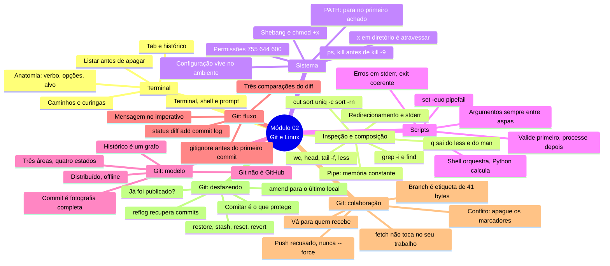

# Mapa mental — Módulo 02

Abra a pré-visualização (`Ctrl+Shift+V`). Use nas revisões D+7/D+30: cubra um ramo, reconstrua-o em voz alta, confira.

```mermaid
mindmap
  root((Módulo 02<br/>Git e Linux))
    Terminal
      Terminal, shell e prompt
      Anatomia: verbo, opções, alvo
      Tab e histórico
      Caminhos e curingas
      Listar antes de apagar
    Inspeção e composição
      wc, head, tail -f, less
      q sai do less e do man
      Redirecionamento e stderr
      Pipe: memória constante
      cut sort uniq -c sort -rn
      grep -i e find
    Sistema
      Permissões 755 644 600
      x em diretório é atravessar
      Shebang e chmod +x
      ps, kill antes de kill -9
      PATH: para no primeiro achado
      Configuração vive no ambiente
    Scripts
      set -euo pipefail
      Argumentos sempre entre aspas
      Valide primeiro, processe depois
      Erros em stderr, exit coerente
      Shell orquestra, Python calcula
    Git: modelo
      Distribuído, offline
      Git não é GitHub
      Três áreas, quatro estados
      Commit é fotografia completa
      Histórico é um grafo
    Git: fluxo
      status diff add commit log
      Três comparações do diff
      Mensagem no imperativo
      gitignore antes do primeiro commit
    Git: colaboração
      Branch é etiqueta de 41 bytes
      Vá para quem recebe
      Conflito: apague os marcadores
      fetch não toca no seu trabalho
      Push recusado, nunca --force
    Git: desfazendo
      Já foi publicado?
      restore, stash, reset, revert
      amend para o último local
      reflog recupera commits
      Comitar é o que protege
```
