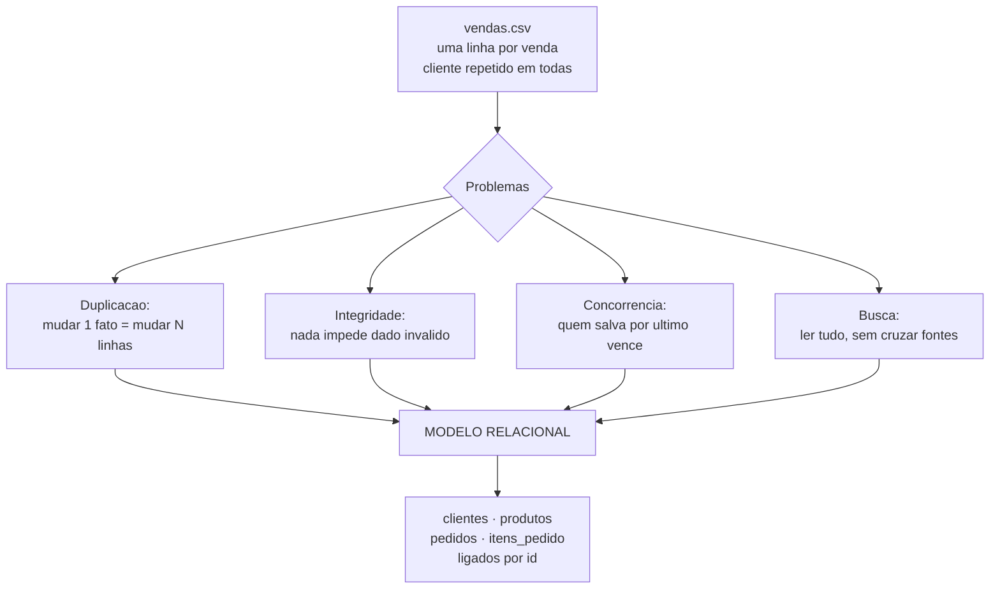

# 03.01 — Por que bancos relacionais existem

> **Módulo 03 — SQL** · Nível: N1 · Tempo estimado: 2h30 · Código: `codigo/cap01/`

## 1. Objetivo

- **Explicar** os quatro problemas que planilhas e CSVs não resolvem: duplicação, integridade, concorrência e busca.
- **Descrever** o modelo relacional como conjunto de tabelas ligadas por **valores**, não por posição.
- **Preparar** o laboratório SQLite e executar a primeira consulta em menos de um minuto.
- **Reconhecer** o que é SQL (a linguagem) e o que é o banco (a implementação).

Ao final, você entende por que praticamente todo sistema do mundo guarda dados assim — e escreveu sua primeira consulta.

---

## 2. Pré-requisitos

- [01.22 — Arquivos: texto e CSV](../01-Python/22-arquivos-texto-e-csv.md) — **a dívida deste capítulo**: você importou o CSV da Aurora e sentiu os limites dele na pele.
- [01.15 — Dicionários](../01-Python/15-dicionarios.md) — o padrão `chave → acumulador` que o `GROUP BY` vai substituir por uma linha.

**Autoteste:** (1) Como você somaria as vendas por cidade a partir do CSV? (2) O que acontece se o nome de um cliente estiver grafado de dois jeitos? (3) Como duas pessoas editam o mesmo CSV ao mesmo tempo? A terceira não tem resposta boa — e é o assunto aqui.

---

## 3. Motivação

Volte ao `vendas.csv` do módulo 01. Ele tem quatro colunas e funciona — até você fazer a segunda pergunta.

**"Quantos pedidos a Fernanda fez este ano, e quanto ela gastou por categoria?"**

O CSV não responde. E os motivos são quatro, cada um pior que o anterior.

**Duplicação.** O nome do cliente se repete em cada linha de venda. Fernanda comprou dezoito vezes: o nome dela está lá dezoito vezes, o e-mail também, a cidade também. Se ela mudar de cidade, você precisa alterar dezoito linhas — e se esquecer uma, passa a existir uma Fernanda em duas cidades ao mesmo tempo.

**Integridade.** Nada impede que a décima nona linha traga `"fernanda lima"`, `"Fernanda"` ou `"FERNANDA LIMA"`. Você já viu isso no 01.15 e resolveu canonizando na entrada — um remendo que funciona porque você é a única pessoa escrevendo no arquivo. Nada impede também um valor negativo, uma data impossível, ou uma venda de um produto que não existe.

**Concorrência.** Duas pessoas abrem o CSV, cada uma acrescenta uma venda, as duas salvam. A segunda sobrescreve a primeira, e ninguém percebe. É o mesmo problema que o Git resolveu para código (02.08) — e que ninguém resolve para arquivos de dados.

**Busca.** Para responder "quanto a Fernanda gastou em áudio", seu programa lê o arquivo **inteiro**, linha por linha. Com quarenta mil linhas, tudo bem. Com quarenta milhões, cada pergunta custa minutos — e você não tem como cruzar o produto com a categoria, porque a categoria não está no CSV de vendas. Estaria em outro arquivo, que você teria que abrir e casar na mão.

Bancos de dados relacionais existem para resolver **os quatro de uma vez**, e a ideia central é anterior ao computador que você usa: separar os dados em tabelas, cada coisa registrada **uma única vez**, ligadas por valores. Este capítulo mostra o modelo e coloca você conversando com um banco de verdade nos próximos dez minutos.

---

## 4. Modelo mental

> 🧠 **Modelo mental**
> Um banco relacional é um **conjunto de tabelas que se referenciam por valor**. Cada tabela guarda **um tipo de coisa** (clientes numa, produtos noutra, pedidos numa terceira), e cada coisa aparece **uma única vez**. As ligações não são setas nem posições: são **valores repetidos de propósito** — o pedido guarda o número do cliente, e é só isso que os une. E a diferença mais importante em relação a tudo que você fez até aqui: você para de dizer **como** buscar e passa a dizer **o que** quer. Quem decide o caminho é o banco.

**Exercício de previsão.** A Aurora tem 8 clientes e 20 pedidos. No CSV, o nome do cliente aparece uma vez por venda. No banco, ele fica só na tabela `clientes`, e cada pedido guarda o `cliente_id`. Sem contar, decida: se a Fernanda mudar de e-mail, quantas alterações são necessárias em cada modelo?

*Resposta comentada:* no CSV, **uma por linha de venda dela** — cinco pedidos com vários itens cada, e todas precisam mudar juntas ou os dados ficam inconsistentes. No banco, **uma**: a linha dela na tabela `clientes`. Todos os pedidos continuam apontando para o mesmo `id`, e passam a "ver" o e-mail novo automaticamente — porque nunca tiveram uma cópia dele. Esse princípio tem nome, **cada fato registrado num único lugar**, e é o que a normalização do 03.16 formaliza. Se você respondeu "uma" para os dois, provavelmente pensou num CSV com uma linha por cliente — que é justamente o banco, com outro nome.

---

## 5. Analogia

Uma planilha é um **caderno de anotações**; um banco relacional é um **arquivo de fichas de biblioteca**.

No caderno, você anota cada empréstimo numa linha: nome do leitor, endereço, título do livro, autor, data. Funciona por um tempo. Quando o leitor muda de endereço, você tem que caçar todas as linhas dele. Quando quer saber quantos livros de um autor foram emprestados, precisa ler o caderno inteiro. E se duas pessoas anotam ao mesmo tempo, uma escreve por cima da outra.

No arquivo de fichas, cada **leitor** tem uma ficha, cada **livro** tem uma ficha, e cada **empréstimo** é uma ficha pequena que traz apenas dois números: o do leitor e o do livro. Endereço muda? Uma ficha. Quer os empréstimos de um autor? Vai às fichas de livros dele e segue os números. E o balcão controla quem escreve, um de cada vez.

**Onde a analogia quebra:** fichas físicas exigem que alguém percorra a gaveta; o banco tem índices (03.14) que localizam sem percorrer, e um otimizador que decide sozinho o melhor caminho. E há um ponto que a analogia não alcança: o arquivo de fichas **recusa** uma ficha de empréstimo que aponte para um leitor inexistente — o banco impõe as regras, não confia na disciplina de quem escreve.

---

## 6. Teoria

### O vocabulário mínimo

| Termo | O que é | No CSV seria |
|---|---|---|
| **Tabela** | uma coleção de coisas do mesmo tipo | um arquivo |
| **Linha** (registro) | uma coisa específica | uma linha |
| **Coluna** (campo) | um atributo, com **tipo** definido | uma coluna, sem tipo |
| **Chave primária** | o identificador único da linha | não existe |
| **Chave estrangeira** | a coluna que aponta para outra tabela | não existe |
| **Schema** | a estrutura: quais tabelas, colunas e tipos | o cabeçalho, e só |

A diferença que mais importa está nas duas últimas linhas: o CSV tem **dados**; o banco tem dados **e regras sobre eles**.

### O modelo da Aurora

Quatro tabelas — as mesmas que você vai modelar do zero no 03.16:

```text
   clientes                 pedidos                 itens_pedido            produtos
   --------                 -------                 ------------            --------
   id  ◄──────────┐         id  ◄──────────┐        id                      id  ◄────┐
   nome           └──────── cliente_id     └─────── pedido_id                nome    │
   email                    data                    produto_id ──────────────┘ categoria
   cidade                   status                  quantidade                preco_centavos
   data_cadastro                                    preco_unitario_centavos    ativo
```

Leia as setas como "aponta para": um pedido aponta para **um** cliente; um item aponta para **um** pedido e **um** produto. Do outro lado, um cliente tem **muitos** pedidos. É a relação **um para muitos**, e ela é a peça de construção de praticamente todo sistema.

Repare em duas decisões deliberadas, que o módulo vai justificar:

- **`preco_centavos`** — dinheiro em inteiro de centavos, a disciplina do 01.04, agora no banco (03.12 discute a alternativa).
- **`preco_unitario_centavos` no item** — o preço no **momento da venda**, que não é o preço atual do produto. Sem ele, uma promoção de hoje reescreveria o faturamento do ano passado.

### SQL: a linguagem

SQL (*Structured Query Language*) é **declarativa**: você descreve o resultado desejado, não o algoritmo. Compare o que você escreveu no 01.15 com o equivalente aqui:

```python
# Python (01.15): você diz COMO fazer
totais = {}
for venda in vendas:
    chave = venda["cidade"].strip().lower()
    totais[chave] = totais.get(chave, 0) + venda["valor"]
```

```sql
-- SQL: você diz O QUE quer
SELECT cidade, SUM(valor) FROM vendas GROUP BY cidade;
```

O laço, o acumulador e a inicialização desapareceram. Eles continuam existindo — dentro do banco, escritos por gente que passou décadas otimizando isso. É a mesma troca do 02.04, quando `sort | uniq -c` substituiu um programa: você descreve, a ferramenta executa.

E a família de comandos se divide em três grupos, que o módulo percorre nesta ordem:

| Grupo | Comandos | Onde |
|---|---|---|
| **DQL** — consulta | `SELECT` | 03.03 a 03.10 |
| **DML** — manipulação | `INSERT`, `UPDATE`, `DELETE` | 03.11 |
| **DDL** — definição | `CREATE`, `ALTER`, `DROP` | 03.12 e 03.13 |

> ⚠️ **Atenção**
> **SQL ≠ banco de dados**, do mesmo jeito que Git ≠ GitHub (02.08). SQL é a linguagem, padronizada desde 1986; SQLite, PostgreSQL, MySQL, SQL Server e Oracle são **implementações**, cada uma com seus acréscimos. Cerca de 90% do que você escrever funciona em qualquer uma; os 10% restantes são dialeto, e este manual sinaliza a diferença sempre que ela puder confundir.

### O laboratório: SQLite

O SQLite é um banco completo que vive num **arquivo único**, sem servidor, sem senha, sem instalação — e ele já está no seu computador, porque acompanha o Python. Não é um brinquedo: roda em bilhões de dispositivos, dentro de navegadores, celulares e aviões.

O que ele **não** tem, e o módulo 05 apresenta: usuários e permissões, acesso pela rede, e concorrência de escrita em escala. Para aprender SQL, essas ausências são vantagem — você foca na linguagem, não na administração.

---

## 7. Funcionamento interno

Por dentro, na medida N1: quando você envia uma consulta, o banco não a executa como você escreveu. Ele **interpreta** o texto, valida contra o schema (as colunas existem? os tipos batem?) e entrega a um **otimizador**, que gera vários planos de execução possíveis, estima o custo de cada um usando estatísticas sobre os dados, e escolhe o mais barato. Só então executa. É por isso que a mesma pergunta, escrita de duas formas diferentes, frequentemente roda no mesmo tempo: o otimizador reduz as duas ao mesmo plano. E é por isso que um índice (03.14) muda o desempenho sem que você reescreva nada — ele apenas oferece ao otimizador um caminho mais barato. No SQLite, tudo isso acontece dentro do seu próprio processo, lendo e escrevendo um arquivo; em bancos com servidor (módulo 05), acontece numa máquina separada, que atende muitos clientes ao mesmo tempo.

---

## 8. Visualização do fluxo

Do CSV ao modelo relacional — o que muda:



**Como ler:** de cima para baixo, os quatro problemas do arquivo convergem para a mesma solução. Repare que eles não são independentes: a duplicação **causa** o problema de integridade (o mesmo fato em vários lugares diverge), e a ausência de estrutura **causa** o problema de busca (não há como cruzar o que não está relacionado). Por isso a resposta é única — separar em tabelas resolve os quatro, e não quatro remendos separados.

---

## 9. Aplicação prática

Montando o laboratório e fazendo a primeira pergunta.

**Passo 1 — Crie o banco:**

```bash
cd 03-SQL
python codigo/cap01/criar_laboratorio.py
```

```text
Laboratorio Aurora criado!
  Arquivo: ../dados/aurora.db
  Tabelas carregadas:
    clientes         8 linhas
    produtos        12 linhas
    pedidos         20 linhas
    itens_pedido    31 linhas

  Primeira consulta:
    python codigo/sql.py "SELECT nome, cidade FROM clientes LIMIT 3"
```

Um arquivo. É o banco inteiro — dados, estrutura e regras. Pode copiar, enviar por e-mail, versionar (embora o `.gitignore` do 02.09 já exclua `*.db`, e com razão: ele é **gerado** pelo script).

**Passo 2 — A primeira consulta:**

```bash
python codigo/sql.py "SELECT nome, cidade, email FROM clientes LIMIT 4"
```

```text
nome             | cidade   | email
-----------------+----------+--------------------
Fernanda Lima    | campinas | fernanda@aurora.com
Ana Souza        | santos   | ana@aurora.com
Beatriz Nogueira | campinas | NULL
Carlos Menezes   | sorocaba | carlos@aurora.com

(4 linhas)
```

Leia a consulta em voz alta: *selecione nome, cidade e e-mail, da tabela clientes, limitando a 4*. SQL foi projetado para ser lido assim — e é o motivo de ele ter sobrevivido cinquenta anos.

Repare no `NULL` da Beatriz. Não é vazio, não é zero, não é a string `"NULL"`: é a **ausência de valor**, e ela tem regras próprias que o 03.03 detalha.

**Passo 3 — Conheça as outras tabelas:**

```bash
python codigo/sql.py "SELECT id, nome, categoria, preco_centavos FROM produtos LIMIT 3"
```

```text
id | nome                | categoria   | preco_centavos
---+---------------------+-------------+---------------
 1 | Fone Bluetooth XZ-9 | audio       |          46990
 2 | Mouse Sem Fio       | perifericos |           8990
 3 | Teclado Mecanico K2 | perifericos |          32900
```

```bash
python codigo/sql.py "SELECT status, COUNT(*) AS quantos FROM pedidos GROUP BY status ORDER BY quantos DESC"
```

```text
status    | quantos
----------+--------
concluido |      17
pendente  |       2
cancelado |       1
```

**Passo 4 — A pergunta que abriu o módulo:**

Esta consulta usa tudo o que você ainda **não** aprendeu — junções, agregação, agrupamento. Não tente entendê-la: rode e veja o que o banco entrega.

```bash
python codigo/sql.py codigo/cap01/primeira_consulta.sql
```

```text
--- [1] SELECT pr.categoria,
categoria   | itens | total_reais
------------+-------+------------
audio       |     3 |      1088.8
acessorios  |     4 |       394.4
perifericos |     1 |       329.0

(3 linhas)
```

(A primeira linha é do executor: rodando um **arquivo**, ele anuncia cada comando antes do resultado.)

Sete linhas de SQL responderam o que o CSV não respondia — cruzando quatro tabelas, filtrando por cliente e status, somando e agrupando. **Este é o destino do módulo**: em dez capítulos, você escreve isso sem consultar nada. Guarde a saída; vamos voltar a ela no 03.07.

> 🎯 **Checkpoint rápido**
> De cabeça: dos quatro problemas do CSV, qual deles a canonização com `.strip().lower()` do 01.15 resolvia — e qual ela apenas disfarçava?

---

## 10. Código comentado

Dois arquivos sustentam o laboratório do módulo inteiro.

**O criador do banco** — [`codigo/cap01/criar_laboratorio.py`](codigo/cap01/criar_laboratorio.py). O trecho que importa:

```python
ESTRUTURA = """
CREATE TABLE clientes (
    id             INTEGER PRIMARY KEY,
    nome           TEXT    NOT NULL,
    email          TEXT,                      -- pode ser NULL (03.03)
    cidade         TEXT,
    data_cadastro  TEXT    NOT NULL
);

CREATE TABLE pedidos (
    id          INTEGER PRIMARY KEY,
    cliente_id  INTEGER NOT NULL,
    data        TEXT    NOT NULL,
    status      TEXT    NOT NULL,              -- concluido, pendente, cancelado
    FOREIGN KEY (cliente_id) REFERENCES clientes(id)
);
"""

def criar_banco():
    """Recria o banco do zero e devolve um resumo do que foi carregado."""
    conexao = sqlite3.connect(BANCO)
    try:
        conexao.executescript(ESTRUTURA)
        conexao.executemany(
            "INSERT INTO clientes VALUES (?, ?, ?, ?, ?)", CLIENTES)
        conexao.commit()
        ...
    finally:
        conexao.close()          # o finally do 01.21, agora com um recurso caro
```

Três coisas para observar já, mesmo sem entender tudo: o `PRIMARY KEY` marca o identificador; o `NOT NULL` é uma **regra** que o banco vai impor (03.13); e o `FOREIGN KEY` declara a ligação — a partir dela, o banco recusa um pedido de um cliente inexistente.

E repare no `?` do `INSERT`: os valores não são coladas no texto do comando. Isso tem um nome e um motivo de segurança sério que o 06.07 desenvolve; por ora, guarde o hábito.

**O executor de consultas** — [`codigo/sql.py`](codigo/sql.py). É a sua janela para o banco durante todo o módulo:

```bash
python codigo/sql.py "SELECT ..."          # uma consulta direta
python codigo/sql.py consultas.sql          # um arquivo inteiro
python codigo/sql.py                        # modo interativo
```

```python
def exibir(valor):
    """NULL precisa aparecer como NULL, não como vazio (03.03)."""
    if valor is None:
        return "NULL"
    return str(valor)
```

Essa função de quatro linhas existe por um motivo pedagógico: a maioria das ferramentas mostra `NULL` como célula vazia, e isso esconde exatamente a distinção que o 03.03 vai cobrar.

O banco fica em `dados/aurora.db`, e o caminho pode ser trocado pela variável `AURORA_BANCO` — o padrão de configuração por ambiente do 02.06, aplicado sem cerimônia.

---

## 11. Erros comuns

### Erro 1 — `banco nao encontrado`

**Sintoma:**

```text
Erro: banco nao encontrado em .../dados/aurora.db
Rode antes: python codigo/cap01/criar_laboratorio.py
```

**Causa:** o laboratório ainda não foi criado, ou você está numa pasta diferente da esperada.
**Correção:** rode o criador. E confira onde está com `pwd` (02.01) — o caminho do banco é relativo ao script, mas o caminho do **script** é relativo a você. Rodar sempre a partir de `03-SQL/` elimina a dúvida.

### Erro 2 — Confundir "vazio" com `NULL`

**Sintoma:** uma consulta que filtra `WHERE email = ''` não devolve a Beatriz, mesmo o e-mail dela "estando vazio".
**Causa:** o e-mail dela é `NULL` — **ausência de valor** —, e não a string vazia. São coisas diferentes, e nenhuma comparação com `=` funciona sobre `NULL`.
**Correção:** `WHERE email IS NULL`. O 03.03 dedica uma seção a isso, porque é a origem de uma classe inteira de bugs silenciosos: consultas que devolvem menos linhas do que deveriam, sem erro nenhum.

### Erro 3 — Tratar o banco como planilha

**Sintoma:** a tentativa de "abrir o `aurora.db` e editar as linhas na mão", ou a expectativa de que as linhas tenham uma ordem fixa.
**Causa:** o modelo mental da planilha sobrevivendo à mudança de ferramenta.
**Correção:** duas correções de modelo. Primeira: dados entram e saem por **comandos** (`INSERT`, `UPDATE`), não por edição direta — é o que permite validar, registrar e desfazer. Segunda, e mais surpreendente: **linhas não têm ordem**. Um `SELECT` sem `ORDER BY` pode devolver em qualquer ordem, e depender do que apareceu no teste é um bug esperando o volume de dados crescer (03.04).

---

## 12. Boas práticas

✅ **Uma tabela por tipo de coisa, um fato registrado num lugar só** — o princípio que resolve duplicação e integridade de uma vez.

✅ **Palavras-chave em maiúsculas, identificadores em minúsculas** — `SELECT nome FROM clientes`. Não é exigência do banco; é legibilidade, e é convenção universal.

✅ **Termine todo comando com `;`** — o SQLite tolera a ausência num comando só, ferramentas e arquivos `.sql` não.

✅ **Dinheiro em centavos inteiros** — a lição do 01.04 vale igual no banco (03.12 mostra a alternativa e os trade-offs).

❌ **Evite guardar dados calculáveis** — o total do pedido é a soma dos itens; guardá-lo cria duas verdades que podem divergir. (Há exceções, e o módulo 10 as discute.)

❌ **Evite tratar o banco como um CSV com sotaque** — se você só faz `SELECT * FROM tabela` e processa tudo em Python, está pagando o preço do banco sem receber o benefício.

---

## 13. Performance

Nesta escala, irrelevante — 71 linhas em quatro tabelas cabem folgadamente na memória, e qualquer consulta responde instantaneamente. Vale registrar a ordem de grandeza que torna o assunto real: bancos relacionais operam confortavelmente com milhões de linhas por tabela, e a diferença entre uma consulta bem escrita e uma mal escrita nessa escala é de segundos para minutos — ou de minutos para horas. Os dois capítulos que tratam disso diretamente são o 03.14 (índices, que evitam ler a tabela inteira) e o 03.08 (junções, onde o produto cartesiano acidental transforma 1.000 × 1.000 linhas em um milhão). A lição transferível para agora: **o custo de uma consulta não é proporcional ao tamanho do texto que você escreve** — sete linhas de SQL podem ser mais baratas que setenta, e a intuição para isso se constrói medindo, não adivinhando.

---

## 14. Mercado

> 🏢 **Mercado**
> SQL aparece em praticamente toda vaga de dados e backend, e a proporção que surpreende quem está começando é esta: em engenharia de dados, é comum passar **mais tempo escrevendo SQL do que Python**. A linguagem foi padronizada em 1986 e continua sendo a forma mais direta de responder perguntas sobre dados — sobreviveu a todas as ondas de tecnologia que prometeram substituí-la. Em processos seletivos, o teste de SQL é quase sempre eliminatório e costuma vir antes do teste de programação: escrever uma consulta com junção e agrupamento sob observação é o filtro mais comum da área. E o nível esperado não é alto em sintaxe — é em **modelagem**: entender por que as tabelas são o que são separa quem consulta de quem projeta.
>
> **Mini-cenário:** o banco que você acabou de criar é o esqueleto do Atlas. No módulo 05 ele vira PostgreSQL de verdade, com servidor e usuários; no 06 uma API FastAPI passa a lê-lo e escrevê-lo; no 10 ele alimenta um pipeline de dados. As quatro tabelas de hoje atravessam a trilha inteira.

---

## 15. Entrevistas

**P1. "Por que usar um banco relacional em vez de arquivos?"**
*Resposta esperada:* os quatro problemas — duplicação (um fato em vários lugares diverge), integridade (o banco impõe regras que o arquivo não impõe), concorrência (escrita simultânea controlada por transações) e busca (índices e junções, sem ler tudo). A resposta forte dá um exemplo concreto de cada um em vez de listar os nomes, e reconhece o outro lado: para dados pequenos, imutáveis e de leitura única, um arquivo continua sendo a escolha certa.

**P2. "O que é SQL e o que ele tem de diferente do Python?"**
*Resposta esperada:* SQL é uma linguagem **declarativa** para dados relacionais — você descreve o resultado, não o algoritmo; o otimizador do banco decide como executar. Python é imperativo: você escreve o laço. Consequência prática que vale citar: em SQL não existe "passo a passo" para depurar da mesma forma, e o equivalente ao depurador é o plano de execução (`EXPLAIN`, 03.14).

**P3. "O que é uma chave primária e uma chave estrangeira?"**
*Resposta esperada:* a primária identifica a linha unicamente dentro da tabela; a estrangeira é a coluna que guarda a chave primária de outra tabela, criando a ligação. Complemento que demonstra maturidade: a estrangeira habilita a **integridade referencial** — o banco recusa apontar para o que não existe —, e é por isso que a ligação é uma garantia, não uma convenção.

**Pegadinha clássica: "Se o modelo relacional é tão bom, por que existem bancos NoSQL?"**
Ela testa se você entende o modelo como **escolha de engenharia** ou como dogma, e derruba tanto quem responde "NoSQL é moda" quanto quem responde "relacional é ultrapassado". A resposta forte separa três eixos. **Estrutura:** o relacional exige schema definido antes, o que é uma vantagem quando os dados têm forma estável (pedidos, clientes) e um obstáculo quando não têm (documentos heterogêneos, telemetria de formato variável). **Escala:** distribuir junções e transações por muitas máquinas é caro; sistemas que precisam de escrita massiva distribuída trocam garantias por desempenho — deliberadamente. **Garantias:** o relacional oferece ACID (03.15); muitos NoSQL oferecem consistência eventual, o que é aceitável para um contador de visualizações e inaceitável para um saldo bancário. O fecho que encerra a pergunta: a decisão vem do **problema**, e a escolha padrão continua sendo relacional — porque a maioria dos sistemas tem dados estruturados, precisa de garantias, e nunca chega à escala em que a distribuição compensa. Vale citar ainda que os bancos relacionais modernos absorveram parte do NoSQL (colunas JSON), e que o módulo 05 trata dos dois.

---

## 16. Exercícios guiados

Enunciados completos em [`exercicios/cap01.md`](exercicios/cap01.md); gabaritos em [`exercicios/gabaritos/cap01.md`](exercicios/gabaritos/cap01.md).

### Aquecimento

- **A1** `[~10 min · vocabulário]` — 8 termos e 8 definições: relacione.
- **A2** `[~10 min · os quatro problemas]` — 6 situações: qual problema do CSV cada uma ilustra?
- **A3** `[~10 min · lendo o modelo]` — 5 perguntas sobre o diagrama das quatro tabelas.
- **A4** `[~10 min · primeiras consultas]` — 5 consultas prontas: preveja a saída antes de rodar.

### Aplicação

- **AP1** `[~20 min · montando o laboratório]` — Crie o banco, explore as quatro tabelas e registre o que encontrou.
- **AP2** `[~20 min · CSV × banco]` — Compare o mesmo dado nos dois modelos e conte as alterações necessárias em três cenários de mudança.
- **AP3** `[~20 min · traduzindo perguntas]` — 6 perguntas de negócio: quais tabelas seriam necessárias para responder cada uma?

---

## 17. Desafios

- **D1** `[~40 min · o caso da planilha]` — **Diagnóstico de um modelo ruim.** Uma escola controla matrículas numa planilha com as colunas `aluno, email_aluno, curso, professor, email_professor, nota, data_matricula`, uma linha por matrícula. (a) Liste **cinco** problemas concretos desse modelo, cada um com um exemplo do que daria errado; (b) proponha a divisão em tabelas, dizendo o que cada uma guarda e como se ligam; (c) desenhe o diagrama no estilo do capítulo; (d) para cada um dos cinco problemas, explique como a sua proposta o resolve; (e) identifique **um** problema que a sua proposta **não** resolve — e o que resolveria. Fecho: 5 linhas sobre por que "juntar tudo numa tabela só" é tentador e por que falha.

<details><summary>💡 Dica 1 (conceito)</summary>
Pergunte-se, para cada coluna: "este dado se repete em várias linhas?" Se sim, ele provavelmente descreve outra coisa, e essa coisa merece a própria tabela.
</details>
<details><summary>💡 Dica 2 (estratégia)</summary>
Comece pelos substantivos do enunciado: aluno, curso, professor, matrícula. Cada substantivo costuma virar uma tabela — e a matrícula é a que **liga** as outras.
</details>
<details><summary>💡 Dica 3 (esqueleto)</summary>
Tabela de problemas (problema · exemplo concreto · como a proposta resolve) → diagrama → o problema não resolvido → reflexão.
</details>

---

## 18. Mini projeto

**O modelo do seu domínio** `[~50 min]` — modelar algo que **você** conhece.

Requisitos numerados:

1. Escolha um domínio da sua vida real que hoje viveria numa planilha: controle de estudos, finanças pessoais, coleção, agenda de clientes de um serviço.
2. Escreva as **seis perguntas** que você gostaria de responder sobre esses dados. Perguntas primeiro, tabelas depois — esta é a ordem que o 03.16 vai formalizar.
3. Liste os substantivos que aparecem nas perguntas e proponha uma tabela para cada, com as colunas.
4. Identifique as ligações (quem aponta para quem) e desenhe o diagrama no estilo da seção 6.
5. Para cada uma das seis perguntas, marque se o seu modelo consegue respondê-la. Se alguma ficar de fora, ajuste o modelo — e **registre o ajuste**, porque é ele o aprendizado.

**Critério de "está bom":** o passo 5 é o critério, e ele quase sempre expõe uma falha na primeira tentativa — normalmente uma ligação que faltou, ou um dado que você guardou no lugar errado. Modelar é iterativo: ninguém acerta de primeira, e quem diz que acerta não testou o modelo contra as perguntas. Se as seis foram respondidas na primeira versão, desconfie e acrescente uma sétima pergunta mais difícil.

---

## 19. Revisão

**Resumo do capítulo:**

- Quatro problemas do CSV: **duplicação, integridade, concorrência, busca** — e eles se causam mutuamente.
- Banco relacional = tabelas ligadas por **valor**; cada fato registrado **num único lugar**.
- Vocabulário: tabela, linha, coluna, chave primária (identifica), chave estrangeira (aponta), schema (estrutura + regras).
- Modelo da Aurora: `clientes` ← `pedidos` ← `itens_pedido` → `produtos`; relação **um para muitos**.
- SQL é **declarativo**: você descreve o resultado, o otimizador escolhe o caminho. Grupos: DQL (`SELECT`), DML (`INSERT`/`UPDATE`/`DELETE`), DDL (`CREATE`/`ALTER`/`DROP`).
- **SQL ≠ banco**: a linguagem é padronizada; SQLite, PostgreSQL e MySQL são implementações com dialetos.
- `NULL` é **ausência de valor** — não é vazio, não é zero (03.03 detalha).
- Linhas **não têm ordem** garantida sem `ORDER BY`.

**Flashcards novos** (adicionados a [`revisao/flashcards.md`](revisao/flashcards.md)):

| ID | Frente | Verso |
|---|---|---|
| 03.01-F1 | Quais são os quatro problemas que um banco relacional resolve e o CSV não? | **Duplicação** (um fato em vários lugares) · **integridade** (nada impede dado inválido) · **concorrência** (quem salva por último vence) · **busca** (ler tudo, sem cruzar fontes). |
| 03.01-F2 | Explique com suas palavras: o que significa SQL ser uma linguagem declarativa? | (Elaboração) Você descreve **o que** quer, não **como** buscar. O laço e o acumulador do Python somem; o otimizador do banco decide o plano de execução. |
| 03.01-F3 | Preveja: a Fernanda muda de e-mail. Quantas alterações no CSV de vendas e quantas no banco? | (Previsão) No CSV, **uma por linha de venda dela**; no banco, **uma** — a linha na tabela `clientes`. Os pedidos apontam para o `id`, nunca tiveram cópia do e-mail. |
| 03.01-F4 | Qual a diferença entre chave primária e chave estrangeira? | (Decisão) Primária **identifica** a linha unicamente na tabela; estrangeira **aponta** para a primária de outra tabela — e habilita a integridade referencial. |
| 03.01-F5 | O que é `NULL` e o que ele **não** é? | Ausência de valor. **Não** é string vazia, **não** é zero, **não** é `False`. Comparações com `=` não funcionam: use `IS NULL` (03.03). |

**Agendamento:** registre no `PROGRESSO.md` e marque D+1, D+7, D+30, D+90 na [`Revisoes/agenda.md`](../Revisoes/agenda.md).

---

## 20. Checklist

Perguntas de domínio — teste do sim:

- [ ] Sei explicar *os quatro problemas do CSV com um exemplo concreto de cada*?
- [ ] Sei descrever *o modelo relacional como tabelas ligadas por valor*?
- [ ] Sei diferenciar *SQL (linguagem) de SQLite/PostgreSQL (implementações)*?
- [ ] Sei ler *o diagrama das quatro tabelas da Aurora e dizer quem aponta para quem*?
- [ ] Sei responder *à pegadinha do "por que existe NoSQL", pelos três eixos*?

Itens práticos:

- [ ] Criei o laboratório e rodei a primeira consulta.
- [ ] Explorei as quatro tabelas e vi o `NULL` da Beatriz.
- [ ] Rodei a consulta do passo 4 e guardei a saída para comparar no 03.07.
- [ ] Completei "O modelo do seu domínio" (5 requisitos), com o ajuste registrado.
- [ ] Registrei a sessão e agendei as 4 revisões.

---

## 21. Próximo capítulo

Você viu as quatro tabelas e as setas entre elas — e as setas ainda são desenho. Ficou deliberadamente em aberto **o que faz uma ligação existir de verdade**: por que o `id` do cliente é um número e não o nome, o que impede um pedido de apontar para um cliente que não existe, e o que acontece quando alguém tenta apagar um cliente que tem pedidos. O próximo capítulo abre as chaves — primária e estrangeira — e apresenta a **integridade referencial**: a garantia que o banco oferece e que nenhum arquivo consegue dar.

→ [03.02 — Tabelas, linhas e chaves](02-tabelas-linhas-e-chaves.md)

---

*Gerado sob spec 3.0.0*
