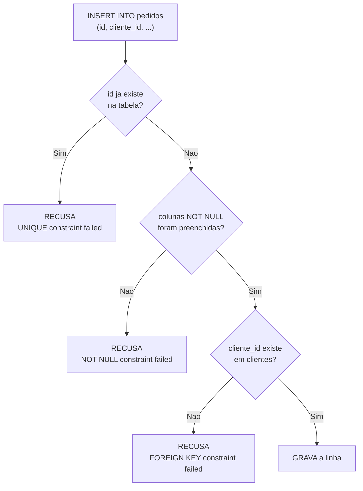

# 03.02 — Tabelas, linhas e chaves

> **Módulo 03 — SQL** · Nível: N1 · Tempo estimado: 2h30 · Código: `codigo/cap02/`

## 1. Objetivo

- **Explicar** tabela, linha, coluna e tipo — e a diferença entre um registro e uma linha de CSV.
- **Distinguir** chave primária de chave estrangeira, e **justificar** por que identificadores não são nomes.
- **Explicar** integridade referencial: o banco recusando dados que apontam para o nada.
- **Ler** um diagrama de relacionamento e traduzir "um para muitos" em duas tabelas.

Ao final, as setas do diagrama deixam de ser desenho: você viu o banco **recusar** dados inválidos, com a mensagem de erro na tela.

---

## 2. Pré-requisitos

- [03.01 — Por que bancos relacionais existem](01-por-que-bancos-relacionais-existem.md) — **a dívida deste capítulo**: o diagrama das quatro tabelas ficou como desenho, sem explicação do que sustenta as ligações.
- [01.14 — Tuplas e desempacotamento](../01-Python/14-tuplas-e-desempacotamento.md) — a ideia de **registro de campos**, que é o que uma linha é.

**Autoteste:** (1) Por que o pedido guarda `cliente_id` e não `nome_cliente`? (2) O que impede dois clientes de terem o mesmo `id`? (3) O que acontece se você apagar um cliente que tem pedidos? A terceira você vai ver acontecer.

---

## 3. Motivação

No capítulo anterior você viu o diagrama e aceitou as setas. Elas escondem três perguntas que ninguém responde no primeiro contato — e das quais depende tudo o que vem depois.

**Por que o pedido guarda um número em vez do nome?** Parece mais trabalhoso: para saber de quem é o pedido 7, você precisa ir até `clientes` procurar o `id` 2. Guardar `"Ana Souza"` direto seria mais direto de ler. E é justamente o que o CSV fazia — com as consequências do 03.01.

**O que impede dados absurdos?** Nada impediria, num arquivo, um pedido do cliente 999, que não existe. Nem dois clientes com o mesmo identificador. Nem um cliente sem nome. Num banco, alguma coisa impede — e vale saber exatamente o quê, porque é essa garantia que justifica a complexidade do modelo.

**O que acontece quando você apaga algo que outros usam?** Se a Fernanda pedir para ser excluída do sistema, e ela tiver cinco pedidos que apontam para ela, o que deveria acontecer? Apagar tudo junto? Recusar? Deixar os pedidos órfãos? A resposta é uma decisão de negócio — e o banco te obriga a tomá-la conscientemente.

As três perguntas têm uma resposta comum: **chaves**. Este capítulo abre as duas que importam, mostra o banco recusando dados inválidos com erro de verdade, e apresenta o conceito que dá nome à garantia: **integridade referencial**.

---

## 4. Modelo mental

> 🧠 **Modelo mental**
> Uma **chave primária** é o número de matrícula de uma linha: escolhido pelo sistema, único, e que **nunca muda**. Uma **chave estrangeira** é uma linha guardando o número de matrícula de outra — e o banco **verifica** que aquele número existe, a cada escrita. É essa verificação que separa uma ligação real de uma convenção: no CSV, "cliente" era uma coluna de texto que você prometia manter consistente; no banco, é uma promessa **imposta pelo sistema**, que recusa a escrita quando ela seria quebrada.

**Exercício de previsão.** Você tenta inserir um pedido do cliente `999`, que não existe na tabela `clientes`. Sem rodar, decida: o banco (a) aceita e cria a linha, (b) aceita e cria o cliente 999 automaticamente, ou (c) recusa a operação?

*Resposta comentada:* **(c)**, com a mensagem `FOREIGN KEY constraint failed`. O banco não corrige nem inventa: ele **recusa** e explica. E aqui está a diferença de filosofia em relação a tudo o que você fez até agora — no Python do 01.22, quando um dado vinha errado, **você** escrevia a validação; se esquecesse, o dado entrava. No banco, a regra é declarada uma vez, na estrutura, e vale para **toda** escrita, venha ela do seu script, de outro sistema ou de alguém digitando à mão. Se você respondeu (a), estava pensando em CSV; se respondeu (b), estava pensando em algo mais esperto do que o banco pretende ser — e essa modéstia é deliberada.

---

## 5. Analogia

Pense num **prontuário de hospital**.

Cada paciente recebe um número ao ser cadastrado — não o nome, não o CPF: um número interno, sequencial, que nunca muda mesmo se a pessoa trocar de nome, de documento ou de endereço. É a **chave primária**.

Cada exame realizado registra apenas esse número, mais o resultado. Nenhum exame guarda o nome do paciente. Isso parece burocrático até o dia em que uma paciente muda de sobrenome: os quatrocentos exames dela continuam corretos, porque nunca souberam o sobrenome. É a **chave estrangeira** funcionando.

E o balcão tem uma regra rígida: **não aceita um exame com número de paciente que não existe**. Não cadastra o paciente na hora, não deixa em branco, não "resolve depois" — devolve o papel. É a **integridade referencial**.

**Onde a analogia quebra:** um balcão humano pode ser convencido a abrir exceção; o banco não. E há um detalhe que a analogia não alcança: se alguém tentar remover um paciente que tem exames, o sistema também **recusa** — porque apagar deixaria os exames apontando para o nada. O hospital tem que decidir antes: arquiva o paciente sem apagar, ou apaga os exames junto? É a decisão que a seção 6 chama de comportamento em cascata.

---

## 6. Teoria

### Linha não é linha de CSV

| | Linha de CSV | Linha de tabela |
|---|---|---|
| Tipo das colunas | tudo é texto | cada coluna tem **tipo** |
| Identidade | a posição no arquivo | a **chave primária** |
| Ordem | fixa, definida pelo arquivo | **não garantida** sem `ORDER BY` |
| Regras | nenhuma | `NOT NULL`, `UNIQUE`, `CHECK`, chaves |
| Ausência de valor | célula vazia, ambígua | `NULL`, explícito |

A linha mais importante é a segunda. Numa linha de CSV, "a terceira linha" é uma identidade; numa tabela, a terceira linha pode virar a décima amanhã, e a única identidade estável é a chave primária.

### Chave primária

A coluna (ou combinação) que identifica **unicamente** cada linha. Três propriedades obrigatórias:

1. **Única** — não existem duas linhas com o mesmo valor;
2. **Não nula** — toda linha tem uma;
3. **Estável** — não muda ao longo da vida da linha.

```sql
CREATE TABLE clientes (
    id    INTEGER PRIMARY KEY,          -- a chave primária
    nome  TEXT NOT NULL,
    email TEXT
);
```

A propriedade 3 é a que decide o desenho. Por que não usar o **e-mail** como chave, já que é único?

- Pessoas trocam de e-mail — e a chave mudaria, obrigando a atualizar toda linha que aponta para ela.
- O e-mail pode ser desconhecido (a Beatriz, do 03.01) — e chave não aceita `NULL`.
- Dados de negócio mudam de regra: hoje o e-mail é único, amanhã a empresa aceita conta familiar.

Daí a prática dominante: uma **chave artificial** (`id` inteiro, gerado pelo banco), sem significado de negócio nenhum. Ela não muda porque não representa nada — e essa ausência de significado é a virtude.

> 📌 **Dialeto**
> No SQLite, `INTEGER PRIMARY KEY` faz a coluna se autonumerar: você pode omitir o `id` no `INSERT` e o banco atribui o próximo. Em PostgreSQL o equivalente moderno é `GENERATED ALWAYS AS IDENTITY` (ou o antigo `SERIAL`); em MySQL, `AUTO_INCREMENT`. O conceito é o mesmo; o 03.12 detalha.

### Chave estrangeira

A coluna que guarda a chave primária de outra tabela:

```sql
CREATE TABLE pedidos (
    id          INTEGER PRIMARY KEY,
    cliente_id  INTEGER NOT NULL,
    data        TEXT    NOT NULL,
    status      TEXT    NOT NULL,
    FOREIGN KEY (cliente_id) REFERENCES clientes(id)
);
```

A última linha é a declaração da ligação — e é ela que transforma uma coluna comum numa **garantia**. A partir dali, o banco impede duas coisas:

- inserir ou atualizar um pedido com `cliente_id` que não existe em `clientes`;
- apagar um cliente que ainda tem pedidos apontando para ele.

Esse par de proibições é a **integridade referencial**: a promessa de que nenhuma referência aponta para o nada.

> ⚠️ **Atenção**
> **No SQLite, a verificação de chave estrangeira vem desligada por padrão**, por compatibilidade histórica. Sem `PRAGMA foreign_keys = ON`, as declarações `FOREIGN KEY` viram documentação decorativa, e dados órfãos entram sem reclamação. O `sql.py` do laboratório liga o pragma em toda conexão; se você usar outra ferramenta, confira. Em PostgreSQL e MySQL (InnoDB) a verificação é sempre ativa.

### Um para muitos

A relação mais comum, e a peça de construção de quase tudo:

```text
   UM cliente  ────────►  MUITOS pedidos
```

A regra de implementação cabe numa frase: **a chave estrangeira mora do lado "muitos"**. O pedido guarda o `cliente_id`; o cliente **não** guarda a lista de pedidos. É contraintuitivo por um instante e evidente no seguinte — uma coluna não comporta uma lista de tamanho variável, e essa foi exatamente a resposta do exercício A3 do capítulo anterior.

A Aurora tem três dessas relações encadeadas:

```text
clientes  ──1:N──►  pedidos  ──1:N──►  itens_pedido  ◄──N:1──  produtos
```

E repare no que acontece nas pontas: `itens_pedido` aponta para **dois** lados. Ela existe justamente para permitir que um pedido tenha vários produtos **e** um produto apareça em vários pedidos — a relação **muitos para muitos**, que sempre se resolve com uma tabela no meio. O 03.16 formaliza o padrão.

### O que fazer ao apagar: `ON DELETE`

Quando alguém tenta apagar um cliente com pedidos, o banco precisa de uma instrução. Ela é declarada na chave estrangeira:

| Comportamento | O que faz | Quando usar |
|---|---|---|
| `RESTRICT` / `NO ACTION` (padrão) | **recusa** a exclusão | quase sempre — a decisão volta para quem apaga |
| `ON DELETE CASCADE` | apaga os pedidos junto | quando o filho não existe sem o pai (itens de um pedido) |
| `ON DELETE SET NULL` | deixa `cliente_id` nulo | quando o vínculo é opcional |

O padrão é o mais seguro, e a razão é filosófica: recusar transforma um apagamento acidental em um **erro visível**, e não numa exclusão silenciosa em cadeia. O `CASCADE` é apropriado quando a dependência é de existência — apagar um pedido deve apagar seus itens, porque um item de pedido não significa nada sozinho. Aplicá-lo entre cliente e pedido apagaria o histórico de vendas junto com o cadastro, e o 03.13 volta a esse cuidado.

### Inspecionando a estrutura

```sql
SELECT name FROM sqlite_master WHERE type = 'table';   -- quais tabelas existem
SELECT sql  FROM sqlite_master WHERE name = 'pedidos'; -- o DDL de uma tabela
PRAGMA table_info(pedidos);                            -- colunas, tipos, PK
PRAGMA foreign_key_list(pedidos);                      -- as chaves estrangeiras
```

Saber ler a estrutura de um banco desconhecido é habilidade prática: ao chegar num sistema novo, a primeira coisa que se faz é olhar o schema — as tabelas contam o modelo de negócio antes de qualquer documentação.

---

## 7. Funcionamento interno

Por dentro, na medida N1: a chave primária não é apenas uma regra, é uma **estrutura**. Ao declará-la, o banco cria automaticamente um índice único (03.14) sobre aquela coluna — e é ele que torna a verificação de unicidade barata: em vez de percorrer a tabela a cada inserção para conferir se o valor já existe, o banco consulta uma árvore ordenada. A chave estrangeira funciona pelo mesmo mecanismo, na direção inversa: a cada `INSERT` ou `UPDATE` na tabela filha, o banco procura o valor na chave primária da tabela pai; a cada `DELETE` na pai, procura referências na filha. Essa segunda busca é a que costuma ser lenta, porque a coluna de chave estrangeira **não** ganha índice automaticamente — daí a recomendação, que o 03.14 justifica com medição, de indexar toda chave estrangeira à mão. No SQLite, tudo isso convive num arquivo único, com as tabelas guardadas em páginas de tamanho fixo.

---

## 8. Visualização do fluxo

O que o banco verifica a cada escrita:



**Como ler:** a escrita atravessa uma sequência de verificações, e **qualquer uma** que falhe cancela a operação inteira — não existe "grava metade". Repare que as três recusas produzem mensagens **diferentes e específicas**: o banco não diz apenas "erro", ele diz qual regra foi violada e em qual coluna. Ler essa mensagem é o diagnóstico completo, e é por isso que a seção 11 trata cada uma como informação, não como obstáculo.

---

## 9. Aplicação prática

Vendo o banco recusar — quatro tentativas que falham de propósito.

**Passo 1 — Leia a estrutura antes de mexer:**

```bash
python codigo/sql.py "SELECT name FROM sqlite_master WHERE type='table'"
python codigo/sql.py "PRAGMA table_info(pedidos)"
```

```text
cid | name       | type    | notnull | dflt_value | pk
----+------------+---------+---------+------------+---
  0 | id         | INTEGER |       0 | NULL       |  1
  1 | cliente_id | INTEGER |       1 | NULL       |  0
  2 | data       | TEXT    |       1 | NULL       |  0
  3 | status     | TEXT    |       1 | NULL       |  0
```

A coluna `pk` marca a chave primária; `notnull` marca as obrigatórias. Este comando responde "como esta tabela funciona?" em um segundo.

**Passo 2 — Chave estrangeira apontando para o nada:**

```bash
python codigo/sql.py "INSERT INTO pedidos VALUES (99, 999, '2026-08-01', 'concluido')"
```

```text
Erro de SQL: FOREIGN KEY constraint failed
```

Não existe cliente 999. O banco recusou — e nenhuma linha foi criada.

**Passo 3 — Chave primária duplicada:**

```bash
python codigo/sql.py "INSERT INTO clientes VALUES (1, 'Outro', 'x@x.com', 'campinas', '2026-01-01')"
```

```text
Erro de SQL: UNIQUE constraint failed: clientes.id
```

A mensagem diz **exatamente** qual coluna de qual tabela.

**Passo 4 — Coluna obrigatória vazia:**

```bash
python codigo/sql.py "INSERT INTO clientes VALUES (99, NULL, 'x@x.com', 'campinas', '2026-01-01')"
```

```text
Erro de SQL: NOT NULL constraint failed: clientes.nome
```

**Passo 5 — Apagar quem tem dependentes:**

```bash
python codigo/sql.py "DELETE FROM clientes WHERE id = 1"
```

```text
Erro de SQL: FOREIGN KEY constraint failed
```

A Fernanda tem cinco pedidos. O banco recusa apagá-la, porque isso deixaria os pedidos órfãos. A decisão volta para você: arquivar em vez de apagar, transferir os pedidos, ou apagá-los junto — e **essa** é a conversa que o banco te obriga a ter.

**Passo 6 — Uma inserção que dá certo:**

```bash
python codigo/sql.py "INSERT INTO clientes (nome, email, cidade, data_cadastro) VALUES ('Marcos Ribeiro', 'marcos@aurora.com', 'campinas', '2026-08-01')"
python codigo/sql.py "SELECT id, nome FROM clientes ORDER BY id DESC LIMIT 2"
```

```text
OK. Linhas afetadas: 1

id | nome
---+---------------
 9 | Marcos Ribeiro
 8 | Juliana Castro
```

Repare: o `id` **não** foi informado, e o banco atribuiu o 9. É a autonumeração da chave primária — e o motivo de identificadores serem responsabilidade do sistema, não sua.

**Passo 7 — Volte ao estado original:**

```bash
python codigo/cap01/criar_laboratorio.py
```

O laboratório é descartável de propósito. Estrague à vontade; um comando recria.

> 🎯 **Checkpoint rápido**
> De cabeça: por que o e-mail é uma péssima chave primária, mesmo sendo único? E de que lado da relação "um para muitos" mora a chave estrangeira?

---

## 10. Código comentado

Arquivo completo em [`codigo/cap02/chaves_e_integridade.sql`](codigo/cap02/chaves_e_integridade.sql) — as verificações do banco, uma por vez.

```sql
-- ------------------------------------------------------------
-- chaves_e_integridade.sql
-- Capítulo 03.02 — Tabelas, linhas e chaves
-- O que este arquivo demonstra: leitura de estrutura e as quatro
--   recusas do banco (FK, PK duplicada, NOT NULL, DELETE com filhos)
-- Como executar: python codigo/sql.py codigo/cap02/chaves_e_integridade.sql
--
-- ATENÇÃO: os comandos 4 a 7 FALHAM de propósito. O erro é o resultado
-- esperado — leia a mensagem, ela diz qual regra foi violada e onde.
-- Rode um por vez (o executor para no primeiro erro).
-- ------------------------------------------------------------

-- [1] Que tabelas existem neste banco?
SELECT name FROM sqlite_master WHERE type = 'table' ORDER BY name;

-- [2] Como a tabela pedidos é feita? (pk=1 marca a chave primária)
SELECT name, type, "notnull", pk FROM pragma_table_info('pedidos');

-- [3] Para onde as chaves estrangeiras de itens_pedido apontam?
SELECT "table" AS tabela_destino, "from" AS coluna_origem, "to" AS coluna_destino
FROM pragma_foreign_key_list('itens_pedido');

-- [4] FALHA: cliente 999 não existe
--     -> FOREIGN KEY constraint failed
INSERT INTO pedidos VALUES (99, 999, '2026-08-01', 'concluido');

-- [5] FALHA: o id 1 já é da Fernanda
--     -> UNIQUE constraint failed: clientes.id
INSERT INTO clientes VALUES (1, 'Outro', 'x@x.com', 'campinas', '2026-01-01');

-- [6] FALHA: nome é NOT NULL
--     -> NOT NULL constraint failed: clientes.nome
INSERT INTO clientes VALUES (99, NULL, 'x@x.com', 'campinas', '2026-01-01');

-- [7] FALHA: a Fernanda tem 5 pedidos apontando para ela
--     -> FOREIGN KEY constraint failed
DELETE FROM clientes WHERE id = 1;
```

O padrão de leitura vale para os quatro erros: **a mensagem nomeia a regra e o alvo**. `NOT NULL constraint failed: clientes.nome` diz o tipo da regra, a tabela e a coluna — não sobra ambiguidade. Compare com o que um CSV te daria na mesma situação: nada, e o dado errado gravado.

Repare também nos comandos 2 e 3: `pragma_table_info` e `pragma_foreign_key_list` são funções que devolvem o schema **como tabela**, e por isso podem ser consultadas com `SELECT`. É a forma de descobrir a estrutura de um banco que você nunca viu — a primeira coisa que se faz ao chegar num sistema desconhecido.

---

## 11. Erros comuns

### Erro 1 — Usar dado de negócio como chave primária

**Sintoma:** o CPF era a chave, e agora um cadastro estrangeiro sem CPF não entra; ou o e-mail era a chave, alguém trocou de e-mail, e mil linhas dependentes precisam ser atualizadas em cadeia.
**Causa:** confundir "é único hoje" com "serve como identidade permanente".
**Correção:** chave **artificial** (`id` inteiro autonumerado), sem significado de negócio. O CPF continua na tabela, com `UNIQUE` se a regra exigir (03.13) — a diferença é que ele passa a ser um **atributo**, não a identidade. Regra prática: se um valor pode mudar, ou pode ser desconhecido, ou depende de regra de negócio, ele não é chave primária.

### Erro 2 — Esquecer o `PRAGMA foreign_keys = ON` no SQLite

**Sintoma:** você declara `FOREIGN KEY`, insere um pedido do cliente 999, e o banco **aceita**. Meses depois, um relatório mostra pedidos sem cliente.
**Causa:** por compatibilidade histórica, o SQLite deixa a verificação desligada por padrão em cada conexão nova.
**Correção:** `PRAGMA foreign_keys = ON;` logo após abrir a conexão — o `sql.py` do laboratório já faz isso. É a única pegadinha grave de dialeto do módulo, e vale conferir sempre que usar outra ferramenta com SQLite. O antídoto de longo prazo: em produção, PostgreSQL e MySQL não têm esse comportamento.

### Erro 3 — Colocar a chave estrangeira do lado errado

**Sintoma:** a tentativa de criar uma coluna `pedidos_ids` na tabela `clientes`, guardando `"1,2,5,9,13"`.
**Causa:** pensar na relação a partir de "o cliente **tem** pedidos", e tentar guardar a lista.
**Correção:** a chave estrangeira mora do lado **"muitos"** — o pedido aponta para o cliente. E o motivo de a lista falhar merece ser enunciado: uma coluna com valores separados por vírgula não pode ser verificada pelo banco (a integridade referencial se perde), não pode ser indexada com eficiência, e obriga a filtrar por texto (`LIKE '%,5,%'`), que quebra com o item `15`. Sempre que você sentir vontade de guardar uma lista numa coluna, o que falta é uma **tabela**.

---

## 12. Boas práticas

✅ **Chave primária artificial em toda tabela** — `id` inteiro, sem significado de negócio, gerado pelo banco.

✅ **Declare toda ligação como `FOREIGN KEY`** — a garantia só existe se estiver declarada; comentário não impõe nada.

✅ **`PRAGMA foreign_keys = ON` em toda conexão SQLite** — sem isso, as declarações não valem nada.

✅ **Leia o schema antes de escrever consultas** — `sqlite_master` e `pragma_table_info` contam o modelo de negócio em segundos.

✅ **Nomeie a chave estrangeira como `<tabela_singular>_id`** — `cliente_id`, `produto_id`. Convenção universal, legível sem consulta.

❌ **Evite guardar listas em colunas** — vírgulas numa coluna são sempre uma tabela faltando.

❌ **Evite `ON DELETE CASCADE` por conveniência** — use só quando o filho **não existe** sem o pai; entre cliente e pedido, cascatear apaga o histórico de vendas.

---

## 13. Performance

Nesta escala, irrelevante — e há um detalhe estrutural que vale registrar desde já. A chave primária ganha um índice automático, então verificar unicidade é barato mesmo com milhões de linhas. A chave **estrangeira**, não: a coluna que aponta para outra tabela **não** é indexada automaticamente em nenhum banco relacional comum. A consequência aparece na exclusão — apagar um cliente exige varrer `pedidos` inteira procurando referências, e numa tabela grande isso vira um problema real. Por isso a recomendação, que o 03.14 mede: **indexe toda coluna de chave estrangeira**. É o índice mais frequentemente esquecido e um dos que mais rendem, porque ele acelera de uma vez as exclusões, as verificações de integridade e as junções (03.07) — que quase sempre acontecem exatamente por essas colunas.

---

## 14. Mercado

> 🏢 **Mercado**
> "Explique chave primária e estrangeira" é pergunta de triagem em qualquer entrevista de dados ou backend — e a resposta que passa não é a definição, é a **consequência**: integridade referencial garantida pelo sistema, não pela disciplina de quem escreve. O erro que mais aparece em bases reais herdadas é justamente a ausência dessas declarações: tabelas que se referenciam "por convenção", acumulando registros órfãos que ninguém percebe até um relatório não fechar. Em revisão de código e de modelagem, a checagem padrão é curta e sempre a mesma: toda tabela tem chave primária artificial? toda ligação está declarada como FK? toda FK tem índice?
>
> **Mini-cenário:** as quatro tabelas que você inspecionou hoje são as do Atlas. No 03.16 você as recria do zero, decidindo cada chave, cada `NOT NULL` e cada comportamento de exclusão — e vai comparar as suas escolhas com as que usou durante quinze capítulos sem questionar.

---

## 15. Entrevistas

**P1. "O que é chave primária e por que não usar o e-mail?"**
*Resposta esperada:* identificador único, não nulo e **estável** de cada linha. O e-mail falha nas três frentes: pode mudar (e toda referência muda junto), pode ser desconhecido (`NULL` não é permitido em chave), e é regra de negócio, que muda. A prática é a chave artificial — sem significado, e justamente por isso permanente. Complemento forte: o e-mail continua na tabela como atributo, com `UNIQUE` se a regra exigir.

**P2. "O que é integridade referencial?"**
*Resposta esperada:* a garantia de que toda chave estrangeira aponta para uma linha que existe. O banco a impõe recusando duas operações: inserir/atualizar com referência inexistente, e apagar uma linha que ainda tem referências. Citar que o comportamento de exclusão é configurável (`RESTRICT`, `CASCADE`, `SET NULL`) e que o padrão é recusar demonstra prática.

**P3. "Como você implementa uma relação um-para-muitos? E muitos-para-muitos?"**
*Resposta esperada:* um-para-muitos, a chave estrangeira fica do lado **"muitos"** (o pedido guarda `cliente_id`). Muitos-para-muitos exige uma **tabela intermediária** com duas chaves estrangeiras — e o exemplo do laboratório é o `itens_pedido`, ligando pedidos a produtos. Bônus que separa: a tabela intermediária frequentemente ganha atributos próprios (quantidade, preço no momento), e quando isso acontece ela deixa de ser "técnica" e vira uma entidade do negócio.

**Pegadinha clássica: "Você precisa apagar um cliente por pedido de exclusão de dados, mas ele tem cinco pedidos. O que você faz?"**
Ela parece técnica e é, sobretudo, uma pergunta sobre **consequências** — e derruba quem responde só "uso `ON DELETE CASCADE`". A resposta forte reconhece que existem três caminhos, cada um com um custo. **Cascatear** apaga os pedidos junto: some o histórico de vendas, o faturamento do período muda retroativamente, e a contabilidade deixa de fechar — quase nunca é aceitável. **Recusar** mantém tudo, e não atende ao pedido. O caminho usado na prática é o terceiro: **anonimizar em vez de apagar** — manter a linha do cliente com um identificador estável, substituindo nome, e-mail e demais dados pessoais por marcadores, e registrando a data da anonimização. Os pedidos continuam válidos (o `id` não mudou), o histórico financeiro permanece íntegro, e os dados pessoais deixaram de existir. Fechar citando que essa tensão entre direito à exclusão e integridade contábil é real, tem tratamento jurídico (a LGPD prevê a retenção para cumprimento de obrigação legal) e é decisão de negócio com apoio jurídico, não escolha de quem escreve o SQL — é o que demonstra maturidade profissional, e não só técnica.

---

## 16. Exercícios guiados

Enunciados completos em [`exercicios/cap02.md`](exercicios/cap02.md); gabaritos em [`exercicios/gabaritos/cap02.md`](exercicios/gabaritos/cap02.md).

### Aquecimento

- **A1** `[~10 min · serve como chave?]` — 8 candidatas a chave primária: aprove ou reprove, com o motivo.
- **A2** `[~10 min · qual erro?]` — 6 operações: qual mensagem o banco devolve?
- **A3** `[~10 min · de que lado mora?]` — 5 relações: onde fica a chave estrangeira?
- **A4** `[~10 min · lendo o schema]` — 5 perguntas respondidas só com `pragma_table_info`.

### Aplicação

- **AP1** `[~20 min · as quatro recusas]` — Provoque cada violação e registre a mensagem exata.
- **AP2** `[~20 min · lendo um banco desconhecido]` — Descreva o modelo da Aurora usando **apenas** consultas ao schema.
- **AP3** `[~20 min · a lista na coluna]` — Receba um modelo com lista separada por vírgula e proponha a correção.

---

## 17. Desafios

- **D1** `[~45 min · o modelo da biblioteca]` — **Modelar com as três relações.** Uma biblioteca precisa controlar: livros (com título, ISBN, ano), exemplares físicos (o mesmo livro pode ter 5 cópias), leitores, empréstimos e autores (um livro pode ter vários autores, e um autor vários livros). (a) Proponha as tabelas com colunas e tipos; (b) marque a chave primária de cada uma e **justifique** por que não usou ISBN nem CPF; (c) declare todas as chaves estrangeiras e diga de que lado cada uma mora; (d) identifique qual relação é **muitos-para-muitos** e mostre a tabela intermediária; (e) para cada FK, decida o comportamento `ON DELETE` e justifique em uma linha; (f) escreva o `CREATE TABLE` de **duas** delas e execute no laboratório, provando que as restrições funcionam com uma inserção inválida. Fecho: 5 linhas sobre por que "exemplar" precisa ser uma tabela separada de "livro".

<details><summary>💡 Dica 1 (conceito)</summary>
Todo substantivo do enunciado é candidato a tabela. A pergunta que revela a relação é "quantos X para cada Y, e quantos Y para cada X?" — se a resposta for "muitos" dos dois lados, falta uma tabela no meio.
</details>
<details><summary>💡 Dica 2 (estratégia)</summary>
"O mesmo livro pode ter 5 cópias" é a frase-chave do item (f): o que se empresta é o exemplar, não o livro. O empréstimo aponta para exemplar, não para livro.
</details>
<details><summary>💡 Dica 3 (esqueleto)</summary>
Tabelas e colunas → PKs com justificativa → FKs com o lado → a tabela de ligação autores↔livros → ON DELETE de cada uma → dois CREATE TABLE executados → a inserção que falha.
</details>

---

## 18. Mini projeto

**Chaves no seu domínio** `[~45 min]` — continuação do mini projeto do 03.01.

Requisitos numerados:

1. Retome o modelo que você desenhou no 03.01 e defina a **chave primária** de cada tabela, justificando cada escolha em uma linha.
2. Identifique qualquer atributo que você tenha sido tentado a usar como chave (e-mail, código, nome) e explique por que ele **não** serve — ou por que, no seu caso específico, serviria.
3. Declare todas as chaves estrangeiras, indicando de que lado cada uma mora e por quê.
4. Para cada FK, decida o comportamento `ON DELETE` e justifique — inclusive as que devem **recusar**.
5. Escreva o `CREATE TABLE` de todas as tabelas e execute num banco novo (`AURORA_BANCO=meu_projeto.db`), provando que as restrições funcionam: uma inserção válida e **três** inválidas, cada uma violando uma regra diferente.

**Critério de "está bom":** o passo 5 é o critério, e o detalhe que o torna real é a exigência das **três violações diferentes**. Criar tabelas é a parte simples; provar que elas recusam o que devem recusar é o que separa um schema que existe de um schema que protege. Se alguma das três inserções que deveria falhar acabar sendo aceita, você encontrou uma regra que esqueceu de declarar — e esse é o aprendizado do exercício.

---

## 19. Revisão

**Resumo do capítulo:**

- Linha de tabela ≠ linha de CSV: tem **tipo**, tem **identidade** (a PK), **não tem ordem** garantida, e obedece a regras.
- **Chave primária**: única, não nula e **estável**. Daí a preferência por chave **artificial** (`id` inteiro) sem significado de negócio.
- **Chave estrangeira**: guarda a PK de outra tabela; declarada com `FOREIGN KEY ... REFERENCES`.
- **Integridade referencial**: o banco recusa referência inexistente e recusa apagar quem tem dependentes.
- No **SQLite**, ligar com `PRAGMA foreign_keys = ON` — desligado por padrão.
- Um para muitos: a FK mora do lado **"muitos"**. Muitos para muitos: **tabela intermediária**.
- `ON DELETE`: `RESTRICT` (padrão, seguro) · `CASCADE` (só quando o filho não existe sem o pai) · `SET NULL`.
- Ler schema: `sqlite_master`, `pragma_table_info`, `pragma_foreign_key_list`.

**Flashcards novos** (adicionados a [`revisao/flashcards.md`](revisao/flashcards.md)):

| ID | Frente | Verso |
|---|---|---|
| 03.02-F1 | Quais as três propriedades de uma boa chave primária? | **Única**, **não nula** e **estável** (nunca muda). Daí a chave artificial (`id` inteiro sem significado de negócio) ser a prática dominante. |
| 03.02-F2 | Explique com suas palavras: o que é integridade referencial? | (Elaboração) A garantia, **imposta pelo banco**, de que toda chave estrangeira aponta para uma linha existente. Ele recusa referência inexistente e recusa apagar quem tem dependentes. |
| 03.02-F3 | Preveja: `INSERT` de um pedido com `cliente_id = 999`, que não existe. O que acontece? | (Previsão) Recusado: `FOREIGN KEY constraint failed`. Nada é gravado, nada é criado automaticamente. **No SQLite, só com `PRAGMA foreign_keys = ON`.** |
| 03.02-F4 | Numa relação um-para-muitos, de que lado mora a chave estrangeira? | (Decisão) Do lado **"muitos"** — o pedido guarda `cliente_id`. O cliente não guarda lista de pedidos: coluna não comporta lista de tamanho variável. |
| 03.02-F5 | Por que o e-mail é uma péssima chave primária, mesmo sendo único? | Pode **mudar** (toda referência mudaria junto), pode ser **desconhecido** (chave não aceita `NULL`), e é regra de negócio (que muda). Fica como atributo, com `UNIQUE` se preciso. |

**Agendamento:** registre no `PROGRESSO.md` e marque D+1, D+7, D+30, D+90 na [`Revisoes/agenda.md`](../Revisoes/agenda.md).

---

## 20. Checklist

Perguntas de domínio — teste do sim:

- [ ] Sei justificar *por que identificadores são artificiais, e não dados de negócio*?
- [ ] Sei explicar *integridade referencial pelas duas proibições que a compõem*?
- [ ] Sei decidir *de que lado mora a chave estrangeira, e por quê*?
- [ ] Sei ler *a estrutura de um banco desconhecido com `pragma_table_info`*?
- [ ] Sei responder *à pegadinha da exclusão de cliente com pedidos, pelos três caminhos*?

Itens práticos:

- [ ] Provoquei as quatro recusas e li cada mensagem de erro.
- [ ] Inseri um cliente sem informar o `id` e vi a autonumeração.
- [ ] Descrevi o modelo da Aurora usando apenas consultas ao schema.
- [ ] Completei "Chaves no seu domínio" — com as três violações provadas.
- [ ] Registrei a sessão e agendei as 4 revisões.

---

## 21. Próximo capítulo

Você conhece a estrutura e viu o banco defendê-la. E até agora só executou consultas prontas: `SELECT nome FROM clientes` foi copiado, não escrito. Ficou deliberadamente em aberto **a linguagem de fazer perguntas** — como escolher colunas, como filtrar linhas por valor, faixa, lista e semelhança de texto, e como lidar com o `NULL` da Beatriz, que não responde a nenhuma comparação comum. O próximo capítulo é o mais usado da sua vida profissional em SQL: `SELECT` e `WHERE`, e o começo da fluência.

→ [03.03 — `SELECT` e `WHERE`](03-select-e-where.md)

---

*Gerado sob spec 3.0.0*
