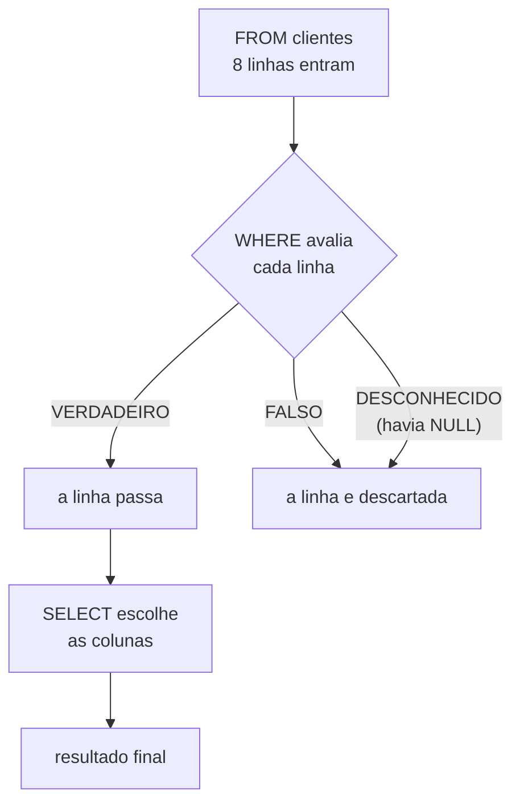

# 03.03 — `SELECT` e `WHERE`

> **Módulo 03 — SQL** · Nível: N1 · Tempo estimado: 3h00 · Código: `codigo/cap03/`

## 1. Objetivo

- **Escrever** consultas com projeção de colunas e filtros com `=`, `<>`, `>`, `<`, `BETWEEN`, `IN`.
- **Aplicar** `LIKE` com `%` e `_`, e **prever** o efeito da sensibilidade a maiúsculas.
- **Combinar** condições com `AND`, `OR` e `NOT`, respeitando a precedência.
- **Tratar** `NULL` corretamente: `IS NULL` em vez de `= NULL`, e por quê.

Ao final, você escreve o comando que vai usar mais vezes na carreira — e conhece a armadilha que faz consultas devolverem menos linhas do que deveriam, sem erro nenhum.

---

## 2. Pré-requisitos

- [03.02 — Tabelas, linhas e chaves](02-tabelas-linhas-e-chaves.md) — a estrutura que você vai consultar.
- [01.08 — Booleanos, comparações e truthiness](../01-Python/08-booleanos-comparacoes-e-truthiness.md) — **a dívida deste capítulo**: `and`/`or` e precedência voltam aqui, com uma diferença importante no meio.

**Autoteste:** (1) Em Python, o que `a or b and c` avalia primeiro? (2) O que `None == None` devolve em Python? (3) Como você filtraria uma lista de dicionários por cidade? A pergunta (2) tem uma resposta em Python e **outra** em SQL — e essa diferença é o coração do capítulo.

---

## 3. Motivação

Você tem quatro tabelas e sabe o que cada coluna significa. Agora precisa fazer perguntas — e é aqui que a maior parte do tempo de qualquer profissional de dados é gasta.

O `SELECT` é o comando mais usado da sua vida em SQL, com folga. Escrever `SELECT nome FROM clientes` é imediato; o que separa quem sabe SQL de quem decorou a sintaxe é o **filtro**. Perguntas reais não são "me dê tudo": são "os clientes de Campinas cadastrados este ano", "os produtos entre R$ 100 e R$ 300", "os pedidos que **não** foram cancelados".

E há uma armadilha esperando exatamente nessa última pergunta.

Suponha que você escreva `WHERE cidade <> 'campinas'` para listar quem **não** é de Campinas. Parece impossível errar. Mas a Helena tem `cidade` desconhecida — `NULL` —, e ela **não aparece** no resultado. Nenhum erro, nenhum aviso: a consulta devolve quatro linhas quando deveria devolver cinco, e você entrega o relatório sem saber.

Essa classe de bug é a mais cara do SQL, porque ela é **silenciosa**. Não quebra, não alerta, apenas conta errado. E a causa é uma decisão de projeto de cinquenta anos atrás sobre o significado de "desconhecido" — que este capítulo explica antes de você tropeçar nela em produção.

---

## 4. Modelo mental

> 🧠 **Modelo mental**
> Uma consulta é um **funil de duas etapas**: o `FROM` diz de onde vêm as linhas, o `WHERE` **descarta** as que não interessam, e o `SELECT` escolhe quais **colunas** sobrevivem. A ordem em que você escreve (`SELECT ... FROM ... WHERE`) é o inverso da ordem em que o banco pensa (`FROM` → `WHERE` → `SELECT`) — e saber disso resolve metade das dúvidas do módulo. E há um terceiro estado nesse funil, além de "passou" e "não passou": o **desconhecido**. Comparar qualquer coisa com `NULL` não produz falso, produz *não sei* — e o `WHERE` só deixa passar o que é comprovadamente verdadeiro.

**Exercício de previsão.** A tabela tem 8 clientes: 3 de Campinas, 2 de Santos, 2 de Sorocaba, e a Helena com `cidade` desconhecida (`NULL`). Sem rodar, decida quantas linhas cada consulta devolve:

- (a) `WHERE cidade = 'campinas'`
- (b) `WHERE cidade <> 'campinas'`
- (c) (a) + (b) somadas dão 8?

*Resposta comentada:* (a) devolve **3**; (b) devolve **4**, não 5; e (c) **não** — somam 7, e a Helena desapareceu das duas. A causa: `NULL <> 'campinas'` não é verdadeiro nem falso, é **desconhecido** — o banco não sabe qual é a cidade dela, então não pode afirmar que ela é diferente de Campinas. E o `WHERE` descarta tudo o que não é comprovadamente verdadeiro. Para incluí-la, é preciso dizer explicitamente: `WHERE cidade <> 'campinas' OR cidade IS NULL`. Se você respondeu "5" e "sim", acabou de reproduzir o bug mais comum de SQL em produção — e, o que é pior, ele nunca teria aparecido nos seus testes se os dados de teste não tivessem `NULL`.

---

## 5. Analogia

O `WHERE` é um **porteiro rigoroso com uma lista de critérios**.

Cada linha da tabela chega à porta, o porteiro confere o critério e decide. Se o critério é "mora em Campinas", ele olha a ficha: escrito "campinas"? Entra. Escrito "santos"? Não entra.

E aí chega a Helena, cuja ficha tem o campo cidade **em branco**. O porteiro não sabe se ela mora em Campinas ou não. E a regra da casa é rígida: **na dúvida, não entra**. Ele não chuta, não assume que "em branco significa não é de Campinas". Ele responde *não sei*, e *não sei* não é autorização.

O detalhe que surpreende é que a mesma coisa acontece na fila do lado. Se o critério for "**não** mora em Campinas", a Helena continua sem entrar — porque o porteiro continua sem saber. Ela fica de fora das duas filas, e é por isso que as contagens não fecham.

**Onde a analogia quebra:** um porteiro humano perguntaria; o banco não tem a quem perguntar, e a rigidez é deliberada — inventar uma resposta seria pior. E há um detalhe que a analogia não alcança: existe uma pergunta que o porteiro **consegue** responder sobre a Helena — "a ficha dela está em branco?". É exatamente o que `IS NULL` pergunta, e por isso ele funciona onde `=` falha.

---

## 6. Teoria

### A forma básica

```sql
SELECT coluna1, coluna2      -- QUAIS colunas quero
FROM tabela                  -- DE ONDE vêm as linhas
WHERE condicao;              -- QUAIS linhas passam
```

```sql
SELECT nome, cidade FROM clientes WHERE cidade = 'campinas';
SELECT * FROM produtos;                    -- todas as colunas
```

O `*` é cômodo em exploração e desaconselhado em código de produção: ele traz colunas que você não usa (custo de rede e memória) e, pior, **quebra em silêncio** quando alguém acrescenta ou reordena colunas na tabela. Nomeie o que precisa.

### Comparação

| Operador | Significado | Exemplo |
|---|---|---|
| `=` | igual | `cidade = 'campinas'` |
| `<>` ou `!=` | diferente | `status <> 'cancelado'` |
| `>` `<` `>=` `<=` | maior, menor | `preco_centavos > 30000` |
| `BETWEEN a AND b` | faixa, **inclusiva nas duas pontas** | `preco_centavos BETWEEN 10000 AND 30000` |
| `IN (a, b, c)` | pertence à lista | `categoria IN ('audio', 'video')` |
| `LIKE 'padrao'` | semelhança de texto | `nome LIKE '%Sem Fio%'` |
| `IS NULL` / `IS NOT NULL` | ausência de valor | `email IS NULL` |

Texto vai entre **aspas simples**; números, não. Aspas duplas no SQL padrão delimitam **identificadores** (nomes de tabela e coluna), não texto — uma diferença em relação ao Python que causa erros curiosos no começo.

O `BETWEEN` merece uma nota: ele é **inclusivo nas duas pontas**, ao contrário do `range` do Python (01.11) e das fatias do 01.05, que excluem o fim. `BETWEEN 1 AND 10` inclui o 1 e o 10.

### `LIKE`: semelhança de texto

Dois curingas, e eles não são os do shell (02.02):

| Curinga | Casa com | Exemplo |
|---|---|---|
| `%` | qualquer sequência, inclusive vazia | `'%fone%'` acha "Fone Bluetooth" |
| `_` | exatamente **um** caractere | `'_one'` acha "Fone", "Cone", não "Telefone" |

```sql
SELECT nome FROM produtos WHERE nome LIKE 'Mouse%';    -- começa com
SELECT nome FROM produtos WHERE nome LIKE '%HDMI%';    -- contém
SELECT email FROM clientes WHERE email LIKE '%@aurora.com';  -- termina com
```

> 📌 **Dialeto**
> **No SQLite, `LIKE` é insensível a maiúsculas para caracteres ASCII** — `'%sem fio%'` encontra "Mouse Sem Fio". No PostgreSQL, `LIKE` é **sensível**, e existe o `ILIKE` para busca insensível. Como o comportamento muda de banco para banco, a forma portável é canonizar explicitamente: `WHERE LOWER(nome) LIKE '%sem fio%'`. E atenção ao detalhe que pega todo mundo no Brasil: a insensibilidade do SQLite vale só para ASCII — `'%mecânico%'` **não** encontra "Mecanico" nem em minúsculas, porque acento é outro caractere.

### Combinando condições

```sql
WHERE cidade = 'campinas' AND data_cadastro >= '2026-01-01'
WHERE cidade = 'campinas' OR cidade = 'santos'
WHERE NOT status = 'cancelado'
```

E a regra que mais produz resultado errado silencioso: **`AND` tem precedência sobre `OR`**, como `and`/`or` no Python (01.08) e como `*` sobre `+` na aritmética.

```sql
-- SEM parênteses: lê-se "campinas OU (santos E deste ano)"
WHERE cidade = 'campinas' OR cidade = 'santos' AND data_cadastro >= '2026-01-01'
-- → 3 linhas: TODOS os de Campinas, mais os de Santos deste ano

-- COM parênteses: "(campinas OU santos) E deste ano"
WHERE (cidade = 'campinas' OR cidade = 'santos') AND data_cadastro >= '2026-01-01'
-- → 1 linha
```

Três linhas contra uma, a partir da mesma intenção mal escrita. **Use parênteses sempre que misturar `AND` e `OR`** — mesmo quando a precedência já daria o resultado certo, porque quem lê depois não deveria precisar lembrar da regra.

### `NULL`: o terceiro valor

Este é o assunto central do capítulo. `NULL` significa **desconhecido**, e daí decorre tudo:

```sql
SELECT nome FROM clientes WHERE email = NULL;      -- 0 linhas, SEMPRE
SELECT nome FROM clientes WHERE email IS NULL;     -- funciona
SELECT nome FROM clientes WHERE email IS NOT NULL; -- o complemento
```

`email = NULL` nunca é verdadeiro — nem quando o e-mail é nulo. A pergunta "o desconhecido é igual ao desconhecido?" não tem resposta *sim*: dois valores desconhecidos podem ser qualquer coisa, inclusive diferentes. Por isso existe o operador dedicado `IS NULL`, que pergunta outra coisa: não "o valor é igual a", mas "o valor **está ausente**".

A lógica de três valores em uma tabela:

| Expressão | Resultado | O `WHERE` deixa passar? |
|---|---|---|
| `5 = 5` | verdadeiro | sim |
| `5 = 3` | falso | não |
| `NULL = 5` | **desconhecido** | **não** |
| `NULL <> 5` | **desconhecido** | **não** |
| `NULL = NULL` | **desconhecido** | **não** |
| `NULL IS NULL` | verdadeiro | sim |

> ⚠️ **Atenção**
> A consequência prática é a que abre o capítulo: **um filtro de negação exclui os `NULL`**. `WHERE cidade <> 'campinas'` não traz a Helena. Se a intenção for "todos que não são de Campinas, **incluindo** os de cidade desconhecida", é preciso dizer: `WHERE cidade <> 'campinas' OR cidade IS NULL`. O mesmo vale para `NOT IN` — e ali o efeito é ainda mais traiçoeiro, porque se a **lista** contiver um `NULL`, o `NOT IN` devolve **zero linhas**, sempre.

### A ordem em que o banco pensa

Você escreve numa ordem, o banco executa em outra:

```text
Você escreve:   SELECT  →  FROM  →  WHERE
O banco pensa:  FROM    →  WHERE →  SELECT
```

Daí uma consequência que confunde no 03.04: **não dá para usar um apelido do `SELECT` no `WHERE`**, porque quando o `WHERE` roda o apelido ainda não existe.

---

## 7. Funcionamento interno

Por dentro, na medida N1: o `WHERE` é avaliado **linha a linha**, e o resultado de cada avaliação é um de três valores — verdadeiro, falso ou desconhecido. Só o primeiro faz a linha passar, e é essa regra única que explica todo o comportamento do `NULL` sem precisar decorar casos. O otimizador (03.01) analisa as condições antes de executar: se houver índice numa coluna filtrada por igualdade ou faixa, ele o usa para não percorrer a tabela inteira (03.14) — e é por isso que a **forma** de escrever a condição importa mais do que parece. `WHERE preco_centavos > 30000` pode usar índice; `WHERE preco_centavos / 100 > 300`, que é matematicamente equivalente, geralmente **não**, porque o índice guarda a coluna, não o resultado da conta. A regra prática que decorre: mantenha a coluna sozinha de um lado da comparação, e transforme o outro lado.

---

## 8. Visualização do fluxo

O funil de uma consulta, com o terceiro estado:



**Como ler:** a chave está nas **duas** setas que chegam ao descarte. Falso e desconhecido têm o mesmo destino — e é essa fusão que torna o bug silencioso: a linha some, e nada distingue "foi avaliada e reprovada" de "não pôde ser avaliada". Repare também que o `SELECT` age **por último**, sobre as linhas que já passaram: ele escolhe colunas, nunca linhas.

---

## 9. Aplicação prática

Perguntas reais, uma de cada tipo de filtro.

**Passo 1 — Igualdade e projeção:**

```bash
python codigo/sql.py "SELECT nome, cidade FROM clientes WHERE cidade = 'campinas'"
```

```text
nome             | cidade
-----------------+---------
Fernanda Lima    | campinas
Beatriz Nogueira | campinas
Rafael Torres    | campinas

(3 linhas)
```

**Passo 2 — Faixa com `BETWEEN`:**

```bash
python codigo/sql.py "SELECT nome, preco_centavos FROM produtos WHERE preco_centavos BETWEEN 10000 AND 30000"
```

```text
nome               | preco_centavos
-------------------+---------------
Webcam HD 1080     |          19990
Caixa de Som BT    |          15990
Hub USB-C 6 portas |          12990
Headset Gamer H7   |          27900

(4 linhas)
```

Produtos entre R$ 100,00 e R$ 300,00 — **em centavos**, a disciplina do 01.04. Filtrar por `preco_centavos / 100 BETWEEN 100 AND 300` daria o mesmo resultado e impediria o uso de índice (seção 7).

**Passo 3 — Lista com `IN`:**

```bash
python codigo/sql.py "SELECT nome, categoria FROM produtos WHERE categoria IN ('audio', 'video')"
```

```text
nome                  | categoria
----------------------+----------
Fone Bluetooth XZ-9   | audio
Webcam HD 1080        | video
Monitor 24 polegadas  | video
Caixa de Som BT       | audio
Microfone Condensador | audio
Headset Gamer H7      | audio

(6 linhas)
```

Equivale a `categoria = 'audio' OR categoria = 'video'`, e é mais legível a partir de dois valores.

**Passo 4 — Texto com `LIKE`:**

```bash
python codigo/sql.py "SELECT nome FROM produtos WHERE nome LIKE '%Sem Fio%'"
python codigo/sql.py "SELECT nome FROM produtos WHERE nome LIKE '%sem fio%'"
```

As duas devolvem `Mouse Sem Fio` — o `LIKE` do SQLite ignora maiúsculas em ASCII. Agora tente com acento:

```bash
python codigo/sql.py "SELECT nome FROM produtos WHERE nome LIKE '%mecânico%'"
```

```text
(0 linhas)
```

O produto se chama "Teclado Mecanico K2", **sem acento**. `%mecanico%` encontra; `%mecânico%` não. Acento não é diferença de maiúscula: é outro caractere.

**Passo 5 — A armadilha do `NULL`:**

```bash
python codigo/sql.py "SELECT nome FROM clientes WHERE email = NULL"
```

```text
nome
----

(0 linhas)
```

Zero linhas, **sem erro** — e a Beatriz existe com e-mail nulo. Agora do jeito certo:

```bash
python codigo/sql.py "SELECT nome FROM clientes WHERE email IS NULL"
```

```text
nome
----------------
Beatriz Nogueira

(1 linha)
```

**Passo 6 — A armadilha maior: negação:**

```bash
python codigo/sql.py "SELECT nome, cidade FROM clientes WHERE cidade <> 'campinas'"
```

```text
nome           | cidade
---------------+---------
Ana Souza      | santos
Carlos Menezes | sorocaba
Diego Alves    | santos
Juliana Castro | sorocaba

(4 linhas)
```

Quatro. Mas há **cinco** clientes que não são de Campinas — a Helena, de cidade desconhecida, sumiu. Some 3 (de Campinas) + 4 e você tem 7, não 8. Corrigindo:

```bash
python codigo/sql.py "SELECT nome, cidade FROM clientes WHERE cidade <> 'campinas' OR cidade IS NULL"
```

Agora a Helena aparece, com `NULL` na coluna cidade — e a soma fecha em 8.

**Passo 7 — Precedência, com e sem parênteses:**

```bash
python codigo/sql.py "SELECT nome, cidade, data_cadastro FROM clientes WHERE cidade = 'campinas' OR cidade = 'santos' AND data_cadastro >= '2026-01-01'"
```

```text
nome             | cidade   | data_cadastro
-----------------+----------+--------------
Fernanda Lima    | campinas | 2025-03-14
Beatriz Nogueira | campinas | 2025-06-21
Rafael Torres    | campinas | 2026-02-03

(3 linhas)
```

Três linhas — e repare que **duas são de 2025**, o que denuncia que o filtro de data não se aplicou a elas. Com parênteses:

```bash
python codigo/sql.py "SELECT nome, cidade, data_cadastro FROM clientes WHERE (cidade = 'campinas' OR cidade = 'santos') AND data_cadastro >= '2026-01-01'"
```

```text
nome          | cidade   | data_cadastro
--------------+----------+--------------
Rafael Torres | campinas | 2026-02-03

(1 linha)
```

**Uma** linha. A intenção quase sempre é esta segunda — e a primeira versão não dá erro nenhum.

> 🎯 **Checkpoint rápido**
> De cabeça: por que `WHERE status <> 'cancelado'` pode esconder linhas? E o que `SELECT nome FROM clientes WHERE cidade = NULL` devolve, e por quê?

---

## 10. Código comentado

Arquivo completo em [`codigo/cap03/filtrando.sql`](codigo/cap03/filtrando.sql).

```sql
-- ------------------------------------------------------------
-- filtrando.sql
-- Capítulo 03.03 — SELECT e WHERE
-- O que este arquivo demonstra: os operadores de filtro, o LIKE,
--   a precedência de AND/OR e as duas armadilhas do NULL
-- Como executar: python codigo/sql.py codigo/cap03/filtrando.sql
-- ------------------------------------------------------------

-- [1] Projeção: escolher colunas (evite SELECT * em produção)
SELECT nome, cidade FROM clientes WHERE cidade = 'campinas';

-- [2] Faixa: BETWEEN é inclusivo nas DUAS pontas (≠ range do 01.11)
--     R$ 100,00 a R$ 300,00 — em centavos, a disciplina do 01.04
SELECT nome, preco_centavos FROM produtos
WHERE preco_centavos BETWEEN 10000 AND 30000;

-- [3] Lista: IN é o OR encadeado, legível a partir de dois valores
SELECT nome, categoria FROM produtos
WHERE categoria IN ('audio', 'video');

-- [4] Texto: % = qualquer sequência · _ = exatamente um caractere
SELECT nome FROM produtos WHERE nome LIKE '%Sem Fio%';

-- [5] No SQLite, LIKE ignora maiúsculas em ASCII (dialeto!)
--     Mas NÃO ignora acento: 'mecânico' não acha 'Mecanico'
SELECT nome FROM produtos WHERE nome LIKE '%sem fio%';

-- [6] ARMADILHA 1: comparar com NULL nunca é verdadeiro
--     -> 0 linhas, SEM erro. A Beatriz existe e não aparece.
SELECT nome FROM clientes WHERE email = NULL;

-- [7] A forma correta
SELECT nome FROM clientes WHERE email IS NULL;

-- [8] ARMADILHA 2: negação EXCLUI os NULL
--     -> 4 linhas. A Helena (cidade NULL) sumiu.
SELECT nome, cidade FROM clientes WHERE cidade <> 'campinas';

-- [9] A correção: dizer explicitamente o que fazer com o desconhecido
SELECT nome, cidade FROM clientes
WHERE cidade <> 'campinas' OR cidade IS NULL;

-- [10] Precedência: AND antes de OR. Sem parênteses, lê-se
--      "campinas OU (santos E deste ano)" -> 3 linhas, duas de 2025
SELECT nome, cidade, data_cadastro FROM clientes
WHERE cidade = 'campinas' OR cidade = 'santos'
  AND data_cadastro >= '2026-01-01';

-- [11] Com parênteses: a intenção real -> 1 linha
SELECT nome, cidade, data_cadastro FROM clientes
WHERE (cidade = 'campinas' OR cidade = 'santos')
  AND data_cadastro >= '2026-01-01';
```

Os pares [6]/[7] e [8]/[9] são o núcleo do capítulo: em ambos, a versão errada **não dá erro**. Ela devolve um resultado plausível, que passa despercebido até alguém conferir os números — e é por isso que este é o único conteúdo do módulo que vale decorar como regra de bolso: **toda vez que escrever uma negação, pergunte-se o que deve acontecer com os `NULL`**.

O par [10]/[11] tem a mesma natureza: três linhas contra uma, sem aviso. A defesa é estrutural, não de atenção — parênteses sempre que `AND` e `OR` aparecerem juntos.

---

## 11. Erros comuns

### Erro 1 — `= NULL` em vez de `IS NULL`

**Sintoma:** a consulta devolve zero linhas, sem erro, mesmo havendo linhas com o valor nulo.
**Causa:** `= NULL` é sempre desconhecido, e o `WHERE` só deixa passar o verdadeiro.
**Correção:** `IS NULL` e `IS NOT NULL` são os únicos operadores que funcionam com ausência de valor. Regra de reconhecimento: se a palavra `NULL` aparece à direita de `=`, `<>`, `<` ou `>`, a consulta está errada — não importa a intenção.

### Erro 2 — Negação que engole os `NULL`

**Sintoma:** as contagens não fecham. `WHERE cidade = 'campinas'` dá 3, `WHERE cidade <> 'campinas'` dá 4, e a tabela tem 8 linhas.
**Causa:** as linhas com `cidade` nula não satisfazem nem uma condição nem a outra.
**Correção:** decidir explicitamente o destino do desconhecido — `WHERE cidade <> 'campinas' OR cidade IS NULL`. E o caso mais grave desse mesmo erro é o `NOT IN` com `NULL` na lista: `WHERE id NOT IN (SELECT cliente_id FROM pedidos)` devolve **zero linhas** se algum `cliente_id` for nulo, porque "id é diferente de todos, inclusive do desconhecido" é indecidível. O 03.08 mostra a alternativa segura (`NOT EXISTS`).

### Erro 3 — Aspas duplas em texto

**Sintoma:** depende do banco, e é aí que mora o perigo. Em PostgreSQL:

```text
ERROR:  column "campinas" does not exist
```

No **SQLite**, a mesma consulta **funciona** — ele aceita aspas duplas como texto quando não encontra uma coluna com aquele nome.

**Causa:** `WHERE cidade = "campinas"` — no SQL padrão, aspas duplas delimitam **identificadores** (nomes de tabela e coluna), não texto. O banco procurou uma coluna chamada `campinas`.
**Correção:** texto sempre entre **aspas simples**. E note por que a permissividade do SQLite torna este erro **pior**, não melhor: o hábito errado se instala sem nunca dar erro no laboratório, e a consulta quebra na migração para o banco de produção — meses depois, longe da causa. É o argumento geral contra depender de comportamento tolerante: o que o dialeto perdoa hoje, o padrão cobra amanhã.

---

## 12. Boas práticas

✅ **Nomeie as colunas, evite `SELECT *`** — exceto em exploração. `*` traz o que você não usa e quebra em silêncio quando a tabela muda.

✅ **Parênteses sempre que misturar `AND` e `OR`** — mesmo quando a precedência já resolveria.

✅ **Toda negação exige uma decisão sobre `NULL`** — pergunte-se o que deve acontecer com o desconhecido, e escreva a resposta.

✅ **Coluna sozinha de um lado da comparação** — `preco_centavos > 30000`, não `preco_centavos / 100 > 300`; o segundo impede o uso de índice.

✅ **Texto em aspas simples** — aspas duplas são para identificadores.

❌ **Evite depender do `LIKE` insensível a maiúsculas** — é dialeto; `LOWER(coluna) LIKE '%texto%'` é portável.

---

## 13. Performance

Nesta escala, irrelevante. Três notas para quando importar, todas sobre a **forma** de escrever a condição. Primeira: filtros por igualdade e por faixa aproveitam índices; a condição precisa ter a coluna isolada de um lado (seção 7), e envolvê-la numa função ou numa conta desativa o índice — inclusive o `LOWER(nome)` recomendado acima, cuja solução, quando o volume exige, é um índice sobre a expressão. Segunda: `LIKE 'texto%'` (prefixo) pode usar índice; `LIKE '%texto%'` (contém) **não pode**, porque não há como ordenar por "contém" — e busca textual em escala é problema de outra ferramenta, que o módulo 10 apresenta. Terceira: `IN` com poucos valores é eficiente; com listas muito grandes, a forma mais rápida costuma ser uma junção com uma tabela temporária. A lição transferível: em SQL, **como você escreve a condição decide se o banco pode ser esperto** — e essa é uma das poucas áreas em que reescrever uma consulta equivalente muda o tempo em ordens de grandeza.

---

## 14. Mercado

> 🏢 **Mercado**
> `SELECT ... WHERE` é o que você mais vai escrever, e o `NULL` é o que mais vai te derrubar. Em entrevistas, a pergunta sobre `NULL` é quase garantida em nível pleno — não pela sintaxe, mas porque ela revela se a pessoa já viu um relatório com número errado e descobriu a causa. Em revisão de código SQL, os três achados mais frequentes são exatamente os desta seção: `SELECT *` em produção, `AND`/`OR` sem parênteses, e negação sem tratamento de `NULL`. E há um efeito colateral cultural que vale conhecer: como o bug do `NULL` é silencioso, equipes maduras adotam a prática de **declarar `NOT NULL` sempre que possível** (03.13) — não por rigor, mas para eliminar a classe inteira de problema na origem.
>
> **Mini-cenário:** o relatório de vendas por região da Aurora usa `WHERE cidade <> 'campinas'` para o consolidado do interior. Enquanto todo cliente tiver cidade preenchida, funciona. No dia em que um cadastro entrar sem cidade — e vai entrar —, o total do interior passa a divergir do total geral, sem que nada quebre. Encontrar isso depois custa horas; declarar `NOT NULL` na coluna custa uma linha.

---

## 15. Entrevistas

**P1. "Qual a diferença entre `WHERE x = NULL` e `WHERE x IS NULL`?"**
*Resposta esperada:* `= NULL` é sempre **desconhecido**, nunca verdadeiro, então devolve zero linhas sempre — mesmo havendo nulos. `IS NULL` é o operador dedicado à ausência de valor e funciona. A explicação que demonstra o modelo: SQL usa lógica de **três valores** (verdadeiro, falso, desconhecido), e o `WHERE` só deixa passar o verdadeiro.

**P2. "Você filtra `WHERE status <> 'cancelado'` e as contagens não fecham. Por quê?"**
*Resposta esperada:* linhas com `status` nulo não passam — `NULL <> 'cancelado'` é desconhecido. Correção: `WHERE status <> 'cancelado' OR status IS NULL`, se a intenção incluir os desconhecidos. Complemento que separa: o mesmo problema, mais grave, aparece em `NOT IN` com nulos na lista, onde o resultado é zero linhas.

**P3. "Por que evitar `SELECT *` em código de produção?"**
*Resposta esperada:* traz colunas não usadas (custo de rede, memória e leitura), e **quebra em silêncio** quando a tabela muda — código que depende da posição das colunas passa a ler a coluna errada, sem erro. Bônus: impede o uso de índices que cobririam a consulta inteira. Em exploração manual, `*` é apropriado.

**Pegadinha clássica: "Esta consulta está errada. Onde?"**

```sql
SELECT nome FROM clientes
WHERE cidade = 'campinas' OR cidade = 'santos' AND ativo = 1;
```

Ela testa precedência **e** honestidade sobre o que se pode afirmar. A resposta forte começa reconhecendo que a consulta é **sintaticamente válida** — ela roda, e é justamente esse o problema. `AND` tem precedência sobre `OR`, então o banco lê `cidade = 'campinas' OR (cidade = 'santos' AND ativo = 1)`: traz **todos** os de Campinas, inclusive os inativos, e só os ativos de Santos. Se a intenção era "de Campinas ou Santos, e ativos", falta o parêntese. E o segundo movimento é o que impressiona: **não dá para saber a intenção olhando o código** — as duas leituras são plausíveis, e por isso o problema real não é o resultado errado, é a **ambiguidade**. A correção não é só acrescentar o parêntese onde você acha que deveria estar; é acrescentá-lo **sempre**, tornando a intenção explícita para quem ler depois. Fechar mencionando que, se `ativo` aceitar `NULL`, há um terceiro problema escondido ali — as linhas com `ativo` nulo somem do segundo ramo — demonstra que os dois assuntos do capítulo foram integrados.

---

## 16. Exercícios guiados

Enunciados completos em [`exercicios/cap03.md`](exercicios/cap03.md); gabaritos em [`exercicios/gabaritos/cap03.md`](exercicios/gabaritos/cap03.md).

### Aquecimento

- **A1** `[~10 min · preveja a saída]` — 8 consultas: quantas linhas cada uma devolve?
- **A2** `[~10 min · traduza a pergunta]` — 8 perguntas de negócio: escreva o `WHERE`.
- **A3** `[~10 min · lógica de três valores]` — 8 expressões com `NULL`: verdadeiro, falso ou desconhecido?
- **A4** `[~10 min · ache o erro]` — 6 consultas com defeito: qual e como corrigir?

### Aplicação

- **AP1** `[~25 min · o caçador de NULL]` — Descubra todos os pontos do laboratório onde um filtro perderia linhas.
- **AP2** `[~20 min · precedência]` — Escreva a mesma pergunta de três formas e explique as diferenças de resultado.
- **AP3** `[~20 min · busca textual]` — Explore o `LIKE` com prefixo, sufixo, contém, `_` e acentuação.

---

## 17. Desafios

- **D1** `[~45 min · o relatório que não fecha]` — **Diagnóstico de um bug silencioso.** Você recebe um relatório com três números que não batem: "clientes de Campinas: 3", "clientes de fora de Campinas: 4", "total de clientes: 8". (a) Reproduza as três consultas e confirme a divergência; (b) explique **exatamente** por que a soma não fecha, usando a lógica de três valores; (c) corrija as consultas de duas formas diferentes e compare; (d) proponha a correção **estrutural** (na tabela, não na consulta) e diga o que ela impediria; (e) escreva uma consulta de **auditoria** que liste, para cada coluna de cada tabela do laboratório, quantos `NULL` existem — e interprete o resultado. Fecho: 5 linhas sobre por que este bug é mais perigoso que um erro de sintaxe.

<details><summary>💡 Dica 1 (conceito)</summary>
Para o item (e), você precisa de uma consulta por coluna. Não há como percorrer colunas em SQL puro — escreva as consultas à mão, ou gere-as com Python a partir de `pragma_table_info`.
</details>
<details><summary>💡 Dica 2 (estratégia)</summary>
`SELECT COUNT(*) - COUNT(coluna) FROM tabela` conta os nulos numa tacada: `COUNT(*)` conta linhas, `COUNT(coluna)` ignora nulos. O 03.05 explica por quê.
</details>
<details><summary>💡 Dica 3 (esqueleto)</summary>
Reprodução → explicação com a tabela de três valores → duas correções (OR IS NULL / COALESCE) → a correção estrutural (NOT NULL + DEFAULT) → a auditoria → reflexão.
</details>

---

## 18. Mini projeto

**Vinte perguntas ao laboratório** `[~50 min]`

Requisitos numerados:

1. Escreva **vinte perguntas de negócio** sobre os dados da Aurora que possam ser respondidas com uma única tabela e um `WHERE`. Perguntas primeiro, SQL depois.
2. Antes de executar, **preveja** para cada uma quantas linhas espera. Escreva a previsão.
3. Escreva e execute as vinte consultas, registrando o resultado real ao lado da previsão.
4. Para cada divergência entre previsão e resultado, escreva uma linha explicando a causa — e **destaque** as que envolveram `NULL`.
5. Escolha as três consultas que você considera mais bem escritas e explique o que as torna boas (legibilidade, uso do operador certo, tratamento explícito do desconhecido).

**Critério de "está bom":** o passo 4 é o critério, e ele funciona por contraste. Vinte previsões corretas significam que suas perguntas eram simples demais — refaça algumas com negações, faixas e colunas que aceitam `NULL`. O objetivo do exercício não é acertar: é descobrir **onde a sua intuição sobre SQL diverge do comportamento real**, enquanto o custo do erro é zero. Em produção, essa mesma descoberta chega por um relatório errado.

---

## 19. Revisão

**Resumo do capítulo:**

- Forma: `SELECT colunas FROM tabela WHERE condicao;` — mas o banco pensa `FROM` → `WHERE` → `SELECT`.
- Operadores: `=` `<>` `>` `<` · `BETWEEN a AND b` (**inclusivo nas duas pontas**) · `IN (lista)` · `LIKE` · `IS NULL`.
- `LIKE`: `%` (qualquer sequência) e `_` (um caractere). **No SQLite ignora maiúsculas em ASCII — e nunca ignora acento.**
- Texto em **aspas simples**; aspas duplas são identificadores.
- **`AND` tem precedência sobre `OR`** — use parênteses sempre que misturar.
- **`NULL` é desconhecido**: lógica de três valores; o `WHERE` só deixa passar o **verdadeiro**.
- `= NULL` nunca funciona → `IS NULL`. **Negação exclui os `NULL`** → decidir explicitamente com `OR ... IS NULL`.
- `NOT IN` com `NULL` na lista devolve **zero linhas**.
- Evite `SELECT *` em produção; mantenha a coluna isolada de um lado da comparação.

**Flashcards novos** (adicionados a [`revisao/flashcards.md`](revisao/flashcards.md)):

| ID | Frente | Verso |
|---|---|---|
| 03.03-F1 | Por que `WHERE email = NULL` devolve zero linhas, mesmo havendo nulos? | Comparação com `NULL` é **desconhecida**, nunca verdadeira, e o `WHERE` só deixa passar o verdadeiro. O operador correto é `IS NULL`. |
| 03.03-F2 | Explique com suas palavras: por que `WHERE cidade <> 'campinas'` esconde linhas? | (Elaboração) Linhas com `cidade` nula não satisfazem nem `=` nem `<>` — o banco não sabe qual é a cidade. Some das duas contagens. Correção: `OR cidade IS NULL`. |
| 03.03-F3 | Preveja: `WHERE a = 1 OR b = 2 AND c = 3`. Como o banco lê? | (Previsão) `a = 1 OR (b = 2 AND c = 3)` — **`AND` tem precedência sobre `OR`**. Use parênteses sempre que misturar os dois. |
| 03.03-F4 | Quando usar `IN` e quando usar `BETWEEN`? | (Decisão) `IN` para lista de valores discretos (`categoria IN ('audio','video')`); `BETWEEN` para faixa contínua, **inclusiva nas duas pontas** (≠ `range` do Python). |
| 03.03-F5 | Por que evitar `SELECT *` em código de produção? | Traz colunas não usadas (custo) e **quebra em silêncio** quando a tabela muda. Em exploração manual, é apropriado. |

**Agendamento:** registre no `PROGRESSO.md` e marque D+1, D+7, D+30, D+90 na [`Revisoes/agenda.md`](../Revisoes/agenda.md).

---

## 20. Checklist

Perguntas de domínio — teste do sim:

- [ ] Sei explicar *a lógica de três valores e por que `= NULL` nunca funciona*?
- [ ] Sei prever *quantas linhas uma negação perde quando há `NULL`*?
- [ ] Sei aplicar *`BETWEEN`, `IN` e `LIKE` escolhendo o operador certo para cada pergunta*?
- [ ] Sei justificar *o uso de parênteses ao misturar `AND` e `OR`*?
- [ ] Sei responder *à pegadinha da consulta ambígua, pelos dois movimentos*?

Itens práticos:

- [ ] Rodei `filtrando.sql` e vi as duas armadilhas do `NULL` acontecerem.
- [ ] Reproduzi a divergência das contagens (3 + 4 ≠ 8) e corrigi.
- [ ] Testei o `LIKE` com e sem acento, e com maiúsculas.
- [ ] Completei "Vinte perguntas ao laboratório", com previsões registradas antes.
- [ ] Registrei a sessão e agendei as 4 revisões.

---

## 21. Próximo capítulo

Você filtra linhas com precisão — e o resultado sai numa ordem que você não escolheu. Ficou deliberadamente em aberto o que fazer **depois** que as linhas passam pelo funil: como ordená-las por um ou vários critérios, onde os `NULL` param na ordenação, como pegar só os dez primeiros sem trazer o resto, como eliminar repetições, e como dar nomes legíveis às colunas do resultado. O próximo capítulo completa a consulta de leitura — e apresenta a armadilha da paginação sem ordenação estável, que produz páginas com itens repetidos e itens que nunca aparecem.

→ [03.04 — Ordenação, `LIMIT` e `DISTINCT`](04-ordenacao-limit-e-distinct.md)

---

*Gerado sob spec 3.0.0*
