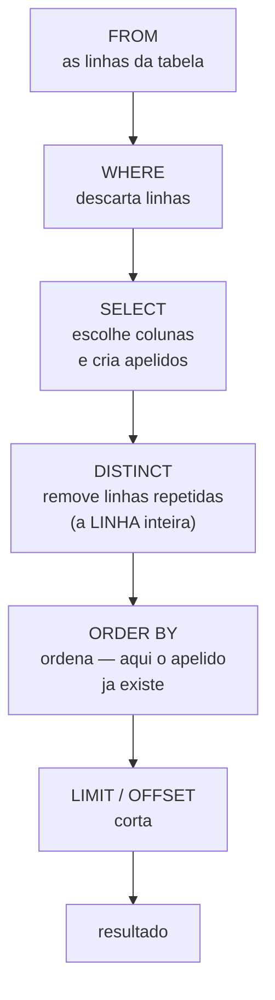

# 03.04 — Ordenação, `LIMIT` e `DISTINCT`

> **Módulo 03 — SQL** · Nível: N1 · Tempo estimado: 2h30 · Código: `codigo/cap04/`

## 1. Objetivo

- **Ordenar** com `ORDER BY` (múltiplas colunas, `ASC`/`DESC`) e **prever** o lugar do `NULL`.
- **Limitar** resultados com `LIMIT` e `OFFSET` — e o cuidado com paginação sem ordenação estável.
- **Eliminar** repetições com `DISTINCT`, entendendo que ele age sobre a **linha inteira**.
- **Nomear** colunas e expressões com `AS`, escrevendo consultas que outra pessoa lê sem esforço.

Ao final, sua consulta de leitura está completa — e você conhece o bug de paginação que faz itens aparecerem duas vezes e outros nunca aparecerem.

---

## 2. Pré-requisitos

- [03.03 — `SELECT` e `WHERE`](03-select-e-where.md) — o funil; aqui você organiza o que sobrou dele.
- [01.13 — Listas parte 2](../01-Python/13-listas-parte-2-metodos-copias-e-aliasing.md) — **a dívida deste capítulo**: `sorted()` × `sort()` e a ideia de ordenação estável voltam aqui, com uma diferença crucial.

**Autoteste:** (1) Em Python, `sorted(lista)` altera a lista original? (2) O que significa uma ordenação ser "estável"? (3) Qual a ordem das linhas de uma tabela sem `ORDER BY`? A resposta da (3) é "nenhuma" — e este capítulo mostra por que isso importa.

---

## 3. Motivação

Você filtra com precisão e recebe as linhas certas. Só que numa ordem que você não escolheu — e que o banco não prometeu manter.

Isso parece detalhe até virar um dos bugs mais desconcertantes da carreira. Imagine uma tela que mostra produtos de dez em dez. A página 1 pede os dez primeiros; a página 2, os dez seguintes. Sem `ORDER BY`, o banco devolve numa ordem qualquer — e essa ordem pode **mudar entre as duas chamadas**. O resultado: o mesmo produto aparece nas páginas 1 e 2, enquanto outro nunca aparece em nenhuma. O código está "certo", os testes passam, e o usuário reclama de algo que ninguém consegue reproduzir.

Há outras três perguntas que este capítulo resolve, e todas aparecem no primeiro dia de trabalho real.

**"Quais os cinco produtos mais caros?"** — exige ordenar e cortar, e cortar sem ordenar não significa nada.

**"Em quais cidades temos clientes?"** — exige eliminar repetições. E o `DISTINCT`, que parece a resposta óbvia, tem um comportamento que surpreende: ele age sobre a **linha inteira**, não sobre a coluna que você quer distinguir.

**"Por que a coluna do relatório se chama `preco_centavos / 100.0`?"** — porque ninguém deu nome a ela. O `AS` resolve, e a diferença entre uma consulta legível e uma ilegível costuma ser esse detalhe.

---

## 4. Modelo mental

> 🧠 **Modelo mental**
> Depois que o `WHERE` filtra, o resultado é um **conjunto sem ordem** — como o `set` do 01.16, e não como a lista do 01.12. Toda ordem que você observar sem pedir é **coincidência da implementação**, não garantia. O `ORDER BY` é o que transforma o conjunto em sequência, e ele precisa acontecer **antes** de qualquer corte: `LIMIT` sem `ORDER BY` não significa "os dez primeiros", significa "dez quaisquer".

**Exercício de previsão.** Uma tela pagina produtos de 3 em 3 usando `LIMIT 3 OFFSET 0` e `LIMIT 3 OFFSET 3`, **sem** `ORDER BY`. O banco devolve, hoje, os mesmos resultados nas duas execuções. Sem rodar, decida: isso é garantia, coincidência, ou depende?

*Resposta comentada:* **coincidência** — e uma coincidência estável o suficiente para enganar durante meses. O SQLite devolve na ordem física das linhas, que só muda quando há atualizações, exclusões ou índices novos. Ou seja: funciona no laboratório, funciona nos testes, e passa a falhar quando o sistema começa a ter movimento — exatamente quando você não está olhando. Em bancos que executam consultas em paralelo (PostgreSQL com tabelas grandes), a ordem pode variar **entre duas execuções seguidas**, sem nenhuma alteração nos dados. Se você respondeu "garantia", acabou de descrever o mecanismo do bug de paginação da seção 3.

---

## 5. Analogia

Pense num **baralho embaralhado sobre a mesa**.

O `WHERE` retira as cartas que não interessam. O que sobra é um monte — e um monte não tem primeira carta. Se alguém pedir "me dê as três de cima", você entrega três cartas, e elas serão três cartas quaisquer; ninguém pode reclamar que estavam erradas, porque nada foi combinado sobre ordem.

O `ORDER BY` é você **espalhar as cartas e organizá-las** por naipe e valor. Só depois disso "as três primeiras" significa alguma coisa. E se a organização for por naipe apenas, as cartas do mesmo naipe continuam em ordem arbitrária entre si — daí a necessidade do segundo critério de desempate.

A paginação é entregar as cartas em grupos de três, para pessoas diferentes, em momentos diferentes. Se entre uma entrega e outra alguém **reembaralha** o monte, a segunda pessoa recebe cartas que a primeira já levou, e algumas cartas nunca saem da mesa. É exatamente o bug — e a defesa é a mesma da vida real: organizar antes, com um critério que não empata.

**Onde a analogia quebra:** cartas físicas ficam onde você as deixou; linhas de tabela mudam de lugar sozinhas quando o banco reorganiza páginas internas. E há um detalhe que a analogia esconde: ordenar um monte de dez cartas é instantâneo; ordenar dez milhões custa, e é por isso que a seção 13 trata `ORDER BY` como a operação mais cara de uma consulta simples.

---

## 6. Teoria

### `ORDER BY`

```sql
SELECT nome, preco_centavos FROM produtos ORDER BY preco_centavos;        -- crescente (padrão)
SELECT nome, preco_centavos FROM produtos ORDER BY preco_centavos DESC;   -- decrescente
SELECT nome, categoria, preco_centavos FROM produtos
ORDER BY categoria ASC, preco_centavos DESC;                              -- desempate
```

A segunda coluna é o **critério de desempate**: dentro de cada categoria, do mais caro para o mais barato. Sem ela, a ordem entre produtos da mesma categoria seria arbitrária.

Dá para ordenar por expressão e por posição:

```sql
ORDER BY LOWER(nome)                    -- por expressão (canonizando)
ORDER BY 2 DESC                         -- pela 2ª coluna do SELECT — evite
```

O `ORDER BY 2` é permitido e desaconselhado: quem acrescentar uma coluna ao `SELECT` muda silenciosamente a ordenação. Nomeie.

### Onde os `NULL` param

```sql
SELECT nome, cidade FROM clientes ORDER BY cidade;
```

```text
nome             | cidade
-----------------+---------
Helena Prado     | NULL          ← o NULL veio PRIMEIRO
Fernanda Lima    | campinas
...
```

> 📌 **Dialeto**
> A posição do `NULL` na ordenação **não é padronizada**. SQLite e PostgreSQL colocam os nulos **primeiro** em ordem crescente e **por último** em decrescente; o Oracle faz o contrário. Para não depender disso, o SQL padrão oferece `ORDER BY cidade NULLS LAST` — suportado por PostgreSQL, Oracle e SQLite recente, **não** pelo MySQL. A forma que funciona em todos: `ORDER BY (cidade IS NULL), cidade`, que ordena primeiro pelo booleano (falso antes de verdadeiro) e depois pelo valor.

### `LIMIT` e `OFFSET`

```sql
SELECT nome FROM produtos ORDER BY preco_centavos DESC LIMIT 5;       -- os 5 mais caros
SELECT nome FROM produtos ORDER BY nome LIMIT 3 OFFSET 3;             -- página 2, de 3 em 3
```

`OFFSET n` pula as `n` primeiras linhas. Página `p` de tamanho `t`: `LIMIT t OFFSET (p-1)*t`.

> ⚠️ **Atenção**
> **`LIMIT` sem `ORDER BY` não tem significado definido**, e `ORDER BY` por uma coluna com valores repetidos **também não é suficiente para paginar**. Ordenar por `categoria` e paginar de 3 em 3 pode devolver o mesmo produto em duas páginas, porque a ordem **dentro** da categoria é arbitrária e pode mudar entre as consultas. A regra: **a ordenação da paginação precisa ser total** — inclua sempre uma coluna única (a chave primária) como último critério de desempate: `ORDER BY categoria, id`.

📌 **Dialeto:** `LIMIT`/`OFFSET` é a forma de SQLite, PostgreSQL e MySQL. SQL Server usa `OFFSET ... FETCH NEXT ... ROWS ONLY`, e Oracle antigo usava `ROWNUM`. É a diferença de dialeto mais visível entre bancos.

### `DISTINCT`

```sql
SELECT DISTINCT cidade FROM clientes;
```

```text
cidade
--------
campinas
santos
sorocaba
NULL            ← o NULL aparece UMA vez
```

Duas coisas para guardar, e a segunda é a que pega todo mundo.

**Primeira, um paradoxo útil:** o `DISTINCT` trata os `NULL` como **iguais entre si** — vários nulos viram um só. Isso contradiz o `WHERE`, onde `NULL = NULL` é desconhecido (03.03). Não é incoerência: são perguntas diferentes. `DISTINCT` pergunta "estes dois valores são o mesmo valor?", e dois desconhecidos são o mesmo "não sei".

**Segunda, a armadilha:** `DISTINCT` age sobre a **linha inteira do resultado**, não sobre a primeira coluna.

```sql
SELECT DISTINCT cidade, nome FROM clientes;    -- 8 linhas, não 4!
```

Como cada nome é único, **toda** combinação (cidade, nome) é distinta — e o `DISTINCT` não elimina nada. Se a intenção era "as cidades, com um nome de exemplo", a ferramenta certa é o `GROUP BY` do 03.06.

### `AS`: nomeando o resultado

```sql
SELECT nome AS produto,
       preco_centavos / 100.0 AS preco_reais
FROM produtos
ORDER BY preco_reais DESC
LIMIT 3;
```

```text
produto               | preco_reais
----------------------+------------
Monitor 24 polegadas  |       899.0
Fone Bluetooth XZ-9   |       469.9
Microfone Condensador |       459.0
```

Sem o `AS`, a segunda coluna se chamaria `preco_centavos / 100.0` — e o programa que consome o resultado teria que se referir a ela assim. O `AS` é opcional na sintaxe (`nome produto` funciona) e obrigatório na prática, por legibilidade.

Repare que o apelido **funcionou no `ORDER BY`**. E não funciona no `WHERE`:

```sql
SELECT preco_centavos / 100.0 AS reais FROM produtos WHERE reais > 300;   -- erro no padrão
```

O motivo é a ordem de execução do 03.03: quando o `WHERE` roda, o `SELECT` ainda não aconteceu e o apelido não existe. Já o `ORDER BY` roda **depois** do `SELECT`, e por isso enxerga o apelido.

> 📌 **Dialeto**
> **O SQLite aceita o apelido no `WHERE`** — é uma extensão, não SQL padrão. PostgreSQL e SQL Server recusam com "column does not exist". É o mesmo caso das aspas duplas do 03.03: o dialeto permissivo instala o hábito errado, e a conta chega na migração. Escreva a expressão inteira no `WHERE` (`WHERE preco_centavos > 30000`) — que, de quebra, é a forma que permite usar índice.

### A ordem completa de execução

```text
FROM  →  WHERE  →  SELECT  →  DISTINCT  →  ORDER BY  →  LIMIT/OFFSET
```

Esta sequência explica, sozinha, quase todas as dúvidas do capítulo: por que o apelido vale no `ORDER BY` e não no `WHERE`, por que o `DISTINCT` age sobre as colunas escolhidas (e não sobre a tabela), e por que `LIMIT` sem `ORDER BY` corta um conjunto ainda sem ordem. O 03.06 acrescenta `GROUP BY` e `HAVING` a essa fila.

---

## 7. Funcionamento interno

Por dentro, na medida N1: ordenar exige ter **todas** as linhas antes de devolver a primeira — é a única operação de uma consulta simples que não pode ser transmitida à medida que as linhas são lidas. O banco tem duas estratégias: se existir um índice na coluna do `ORDER BY`, ele percorre o índice, que já está ordenado, e devolve as linhas na sequência sem ordenar nada; se não existir, ele carrega o resultado e executa uma ordenação de verdade, usando disco quando não cabe na memória (o mesmo comportamento do `sort` do 02.04). Daí a consequência que surpreende: `ORDER BY campo_indexado LIMIT 10` pode ser instantâneo mesmo numa tabela enorme, porque o banco lê dez entradas do índice e para — enquanto `ORDER BY campo_nao_indexado LIMIT 10` precisa ordenar **tudo** para saber quais são os dez primeiros. O `OFFSET`, por sua vez, não tem atalho: o banco produz e **descarta** as linhas puladas, e é por isso que a página 1.000 de uma listagem é sempre mais lenta que a página 1.

---

## 8. Visualização do fluxo

A consulta completa, na ordem em que o banco executa:



**Como ler:** siga a ordem das caixas, que **não** é a ordem em que você escreve. Duas consequências saltam do desenho: o apelido criado no `SELECT` está disponível para o `ORDER BY` (que vem depois) e indisponível para o `WHERE` (que vem antes) — daí o erro da seção 6. E o corte é a **última** etapa: ele age sobre o que já foi ordenado, o que explica por que `LIMIT` sem `ORDER BY` corta um conjunto sem ordem definida.

---

## 9. Aplicação prática

**Passo 1 — Ordenação simples e com desempate:**

```bash
python codigo/sql.py "SELECT nome, categoria, preco_centavos FROM produtos ORDER BY categoria ASC, preco_centavos DESC LIMIT 6"
```

```text
nome                  | categoria  | preco_centavos
----------------------+------------+---------------
Hub USB-C 6 portas    | acessorios |          12990
Suporte para Notebook | acessorios |           7990
Mousepad Grande       | acessorios |           4990
Cabo HDMI 2m          | acessorios |           3490
Fone Bluetooth XZ-9   | audio      |          46990
Microfone Condensador | audio      |          45900
```

Categorias em ordem alfabética; dentro de cada uma, do mais caro para o mais barato.

**Passo 2 — Onde o `NULL` para:**

```bash
python codigo/sql.py "SELECT nome, cidade FROM clientes ORDER BY cidade"
```

```text
nome             | cidade
-----------------+---------
Helena Prado     | NULL
Fernanda Lima    | campinas
Beatriz Nogueira | campinas
Rafael Torres    | campinas
Ana Souza        | santos
Diego Alves      | santos
Carlos Menezes   | sorocaba
Juliana Castro   | sorocaba
```

A Helena vem **primeiro** — no SQLite e no PostgreSQL. Note também que os três de Campinas saíram numa ordem arbitrária entre si: sem segundo critério, o desempate não é definido.

**Passo 3 — Os mais caros:**

```bash
python codigo/sql.py "SELECT nome, preco_centavos / 100.0 AS preco_reais FROM produtos ORDER BY preco_reais DESC LIMIT 3"
```

```text
nome                  | preco_reais
----------------------+------------
Monitor 24 polegadas  |       899.0
Fone Bluetooth XZ-9   |       469.9
Microfone Condensador |       459.0
```

**Passo 4 — Paginação, do jeito certo:**

```bash
python codigo/sql.py "SELECT nome FROM produtos ORDER BY nome LIMIT 3 OFFSET 3"
```

```text
nome
---------------------
Headset Gamer H7
Hub USB-C 6 portas
Microfone Condensador
```

Página 2, de 3 em 3, ordenada por uma coluna única — a paginação é confiável. Agora compare com o jeito errado:

```bash
python codigo/sql.py "SELECT nome, categoria FROM produtos ORDER BY categoria LIMIT 3 OFFSET 3"
```

Ordenar por `categoria` com quatro produtos de acessórios significa que a ordem **dentro** de acessórios é arbitrária — e a fronteira da página cai exatamente ali. A correção é acrescentar a chave: `ORDER BY categoria, id`.

**Passo 5 — `DISTINCT` e o paradoxo do `NULL`:**

```bash
python codigo/sql.py "SELECT DISTINCT cidade FROM clientes"
```

```text
cidade
--------
campinas
santos
sorocaba
NULL

(4 linhas)
```

O `NULL` aparece **uma** vez — tratado como um valor entre os demais. Compare com o 03.03, em que `NULL = NULL` era desconhecido: são perguntas diferentes.

**Passo 6 — A armadilha do `DISTINCT`:**

```bash
python codigo/sql.py "SELECT DISTINCT cidade, nome FROM clientes"
```

```text
(8 linhas)
```

Oito, não quatro. Cada combinação (cidade, nome) é única, então nada é eliminado. O `DISTINCT` **nunca** age sobre uma coluna só — ele age sobre a linha do resultado.

**Passo 7 — O apelido e a ordem de execução:**

```bash
python codigo/sql.py "SELECT nome, preco_centavos / 100.0 AS reais FROM produtos ORDER BY reais DESC LIMIT 2"   # funciona
python codigo/sql.py "SELECT preco_centavos / 100.0 AS reais FROM produtos WHERE reais > 300"                   # SQLite aceita; padrão não
```

A segunda funciona no SQLite e falharia em PostgreSQL. Escreva sempre `WHERE preco_centavos > 30000`.

> 🎯 **Checkpoint rápido**
> De cabeça: por que `LIMIT 10` sem `ORDER BY` não significa "os dez primeiros"? E por que `SELECT DISTINCT cidade, nome` não reduz as linhas?

---

## 10. Código comentado

Arquivo completo em [`codigo/cap04/organizando.sql`](codigo/cap04/organizando.sql).

```sql
-- ------------------------------------------------------------
-- organizando.sql
-- Capítulo 03.04 — Ordenação, LIMIT e DISTINCT
-- O que este arquivo demonstra: ORDER BY com desempate, a posição
--   do NULL, paginação estável, o alcance do DISTINCT e o AS
-- Como executar: python codigo/sql.py codigo/cap04/organizando.sql
-- ------------------------------------------------------------

-- [1] Duas colunas: a segunda é o critério de DESEMPATE
SELECT nome, categoria, preco_centavos FROM produtos
ORDER BY categoria ASC, preco_centavos DESC
LIMIT 6;

-- [2] Onde o NULL para? SQLite e PostgreSQL: primeiro no ASC.
--     Portável em qualquer banco: ORDER BY (cidade IS NULL), cidade
SELECT nome, cidade FROM clientes ORDER BY cidade;

-- [3] O AS dá nome à expressão — e o apelido vale no ORDER BY,
--     porque ele roda DEPOIS do SELECT
SELECT nome AS produto, preco_centavos / 100.0 AS preco_reais
FROM produtos
ORDER BY preco_reais DESC
LIMIT 3;

-- [4] Paginação CONFIÁVEL: ordenada por coluna única
SELECT nome FROM produtos ORDER BY nome LIMIT 3 OFFSET 3;

-- [5] Paginação FRÁGIL: 'categoria' repete, a ordem interna é
--     arbitraria — o mesmo produto pode cair em duas paginas
SELECT nome, categoria FROM produtos ORDER BY categoria LIMIT 3 OFFSET 3;

-- [6] A correção: desempate por uma coluna ÚNICA (a chave primária)
SELECT nome, categoria FROM produtos ORDER BY categoria, id LIMIT 3 OFFSET 3;

-- [7] DISTINCT: o NULL conta como UM valor (≠ do WHERE, onde
--     NULL = NULL é desconhecido — são perguntas diferentes)
SELECT DISTINCT cidade FROM clientes;

-- [8] ARMADILHA: DISTINCT age sobre a LINHA INTEIRA.
--     Cada nome é único -> 8 linhas, nada é eliminado.
SELECT DISTINCT cidade, nome FROM clientes;
```

O par [5]/[6] é o núcleo do capítulo, e a diferença entre eles é uma palavra: `id`. Sem ela, a consulta funciona hoje, passa nos testes e produz um bug de paginação quando os dados começarem a se mover. É a mesma natureza silenciosa do `NULL` do 03.03 — o resultado é plausível, e nada avisa.

O par [7]/[8] é o segundo: o `DISTINCT` parece agir sobre a coluna que você quer distinguir, e age sobre todas. Quando a intenção é "um representante por grupo", a resposta está no 03.06.

---

## 11. Erros comuns

### Erro 1 — `LIMIT` sem `ORDER BY`

**Sintoma:** a listagem "dos mais recentes" mostra itens aleatórios; ou a paginação repete itens entre páginas.
**Causa:** sem `ORDER BY`, o resultado é um conjunto sem ordem definida, e `LIMIT` corta um pedaço arbitrário dele.
**Correção:** todo `LIMIT` acompanha um `ORDER BY`. E se for paginação, a ordenação precisa ser **total** — acrescente a chave primária como último critério. Regra de reconhecimento: se a consulta tem `LIMIT` e a ordenação pode empatar, ela tem um bug adormecido.

### Erro 2 — Esperar que `DISTINCT` aja numa coluna

**Sintoma:** `SELECT DISTINCT cidade, nome FROM clientes` devolve todas as linhas, e não uma por cidade.
**Causa:** `DISTINCT` é da **linha** do resultado, não da primeira coluna. Uma única coluna diferente já torna a linha inteira distinta.
**Correção:** para "só as cidades", peça só a cidade. Para "as cidades com algum dado agregado" (a contagem, o cliente mais antigo), a ferramenta é `GROUP BY` (03.06). O `DISTINCT` de várias colunas é legítimo quando você quer combinações únicas de verdade — por exemplo, os pares (cidade, categoria) em que houve venda.

### Erro 3 — Confiar na ordem "que sempre veio assim"

**Sintoma:** o código do relatório assume que as linhas chegam por `id` crescente, porque foi o que aconteceu em todos os testes. Um dia, chegam fora de ordem.
**Causa:** ordem física de armazenamento não é contrato. Ela muda com exclusões, atualizações, criação de índices, mudança de versão do banco ou execução em paralelo.
**Correção:** explicitar `ORDER BY` sempre que a ordem importar — inclusive quando "já está funcionando". Este é o erro mais difícil de convencer alguém a corrigir, justamente porque o código **funciona**; o argumento que costuma resolver é lembrar que ele funciona **por acaso**, e que ninguém controla quando o acaso muda.

---

## 12. Boas práticas

✅ **Todo `LIMIT` acompanha um `ORDER BY`** — sem exceção.

✅ **Paginação exige ordenação total** — acrescente a chave primária como último critério de desempate.

✅ **`AS` em toda expressão calculada** — a coluna do resultado precisa de nome legível.

✅ **Explicite `ORDER BY` sempre que a ordem importar** — mesmo quando a ordem observada já parece correta.

✅ **Decida onde os `NULL` devem aparecer** — `NULLS LAST` (onde houver) ou `ORDER BY (col IS NULL), col`.

❌ **Evite `ORDER BY 2`** — ordenar por posição quebra quando alguém acrescenta uma coluna.

❌ **Evite `OFFSET` grande em listas longas** — o banco produz e descarta tudo o que foi pulado; a alternativa é paginação por cursor (o 07.09 apresenta).

---

## 13. Performance

Nesta escala, irrelevante — e este é o capítulo com o maior salto de custo quando a escala muda. `ORDER BY` é a operação mais cara de uma consulta simples: ela precisa de **todas** as linhas antes de devolver a primeira, e quando o resultado não cabe na memória o banco usa disco. A diferença decisiva é o índice: `ORDER BY coluna_indexada LIMIT 10` lê dez entradas de uma estrutura já ordenada e para; sem índice, o banco ordena o conjunto inteiro para descobrir quais são os dez primeiros — o mesmo trabalho para devolver 10 linhas ou 10 mil. E o `OFFSET` tem um custo que cresce com a página: para entregar a página 1.000, o banco produz as 9.990 linhas anteriores e as descarta, uma a uma. É por isso que aplicativos com listas infinitas não usam `OFFSET`, e sim **paginação por cursor** — "traga os 20 seguintes ao item X" —, que aproveita o índice e tem custo constante. A lição transferível: operações que parecem gratuitas em dados pequenos podem ter custo **proporcional ao que você descarta**, e essa é a categoria de surpresa mais comum ao levar uma consulta para produção.

---

## 14. Mercado

> 🏢 **Mercado**
> O bug de paginação sem ordenação estável é clássico e vive em produção em muito sistema: sintoma difuso ("às vezes some um item da lista"), causa invisível no código, e reprodução quase impossível em ambiente de teste com poucos dados. Saber diagnosticá-lo é um daqueles conhecimentos que rendem reputação desproporcional ao esforço. Em revisão de código SQL, `LIMIT` sem `ORDER BY` é achado automático. E o `AS` tem um peso maior do que parece: consultas de relatório costumam ser lidas por analistas e produtos, não só por quem as escreveu — colunas com nome de expressão são a diferença entre um resultado usável e um que precisa de tradução.
>
> **Mini-cenário:** a tela de produtos do Atlas vai paginar de 20 em 20 no módulo 06, quando a API existir. A consulta que a alimenta será escrita ali — e ela já nasce com `ORDER BY nome, id`, porque este capítulo mostrou o que acontece sem o `id`.

---

## 15. Entrevistas

**P1. "O que acontece se você usar `LIMIT` sem `ORDER BY`?"**
*Resposta esperada:* o resultado é indeterminado — `LIMIT` corta um conjunto sem ordem definida, e o banco pode devolver linhas diferentes a cada execução. Funciona por acaso em bancos pequenos (a ordem física é estável), e quebra com movimento de dados ou execução paralela. Mencionar que o sintoma aparece como bug de paginação demonstra experiência.

**P2. "`SELECT DISTINCT a, b` — o `DISTINCT` se aplica a quê?"**
*Resposta esperada:* à **linha inteira** do resultado, ou seja, ao par (a, b). Não existe "distinct de uma coluna só" no `SELECT` — para isso, ou se pede só aquela coluna, ou se usa `GROUP BY`. Bônus: `DISTINCT` trata múltiplos `NULL` como um único valor, ao contrário do `WHERE`.

**P3. "Por que o apelido do `SELECT` funciona no `ORDER BY` e não no `WHERE`?"**
*Resposta esperada:* pela ordem de execução — `FROM` → `WHERE` → `SELECT` → `ORDER BY`. Quando o `WHERE` roda, o apelido ainda não foi criado; quando o `ORDER BY` roda, já foi. Citar que alguns bancos (SQLite, MySQL) aceitam o apelido no `WHERE` como extensão não padrão mostra atenção a dialeto.

**Pegadinha clássica: "Uma tela pagina resultados de 20 em 20 e os usuários relatam que às vezes um item aparece em duas páginas, e outro nunca aparece. O código não mudou. O que está acontecendo?"**
Ela é excelente porque o sintoma parece impossível e a causa é de uma linha. A resposta forte tem três movimentos. **O diagnóstico:** a consulta pagina com `LIMIT`/`OFFSET` sobre uma ordenação que **não é total** — ou não há `ORDER BY`, ou ele usa uma coluna com valores repetidos, e a ordem entre os empatados é arbitrária. Como as duas páginas são consultas **separadas**, a ordem pode diferir entre elas, e o item que estava na posição 20 na primeira consulta aparece na posição 21 na segunda: é entregue duas vezes, enquanto o que ocupava a 21 some. **A correção imediata:** tornar a ordenação total, acrescentando a chave primária como último critério — `ORDER BY criado_em DESC, id DESC`. **E o movimento que separa:** mesmo com ordenação total, `OFFSET` continua sujeito a um problema diferente — se **um registro novo for inserido** entre a consulta da página 1 e a da página 2, tudo desloca uma posição e o mesmo sintoma reaparece. A solução definitiva para listas que recebem escrita é **paginação por cursor** ("os 20 seguintes ao item de id X"), que é estável a inserções e tem custo constante. Fechar apontando que o sintoma é difícil de reproduzir justamente porque exige movimento de dados — e que ambientes de teste, estáticos, nunca o mostram — explica por que o bug sobrevive tanto tempo.

---

## 16. Exercícios guiados

Enunciados completos em [`exercicios/cap04.md`](exercicios/cap04.md); gabaritos em [`exercicios/gabaritos/cap04.md`](exercicios/gabaritos/cap04.md).

### Aquecimento

- **A1** `[~10 min · preveja a ordem]` — 6 consultas: qual linha vem primeiro?
- **A2** `[~10 min · escreva a consulta]` — 8 perguntas de ranking e listagem.
- **A3** `[~10 min · `DISTINCT` ou não?]` — 6 situações: `DISTINCT` resolve?
- **A4** `[~10 min · ache o bug]` — 6 consultas com problema de ordenação ou corte.

### Aplicação

- **AP1** `[~20 min · rankings]` — Construa cinco rankings do laboratório com desempate explícito.
- **AP2** `[~25 min · reproduzindo o bug]` — Provoque o bug de paginação e corrija-o.
- **AP3** `[~20 min · legibilidade]` — Reescreva três consultas ilegíveis com `AS` e formatação.

---

## 17. Desafios

- **D1** `[~45 min · o painel de produtos]` — **Uma consulta pronta para virar tela.** Construa a consulta que alimentaria uma listagem paginada de produtos: (a) colunas `id`, nome, categoria e preço **em reais**, todas com apelidos legíveis; (b) apenas produtos ativos; (c) ordenada por categoria e, dentro dela, do mais caro para o mais barato; (d) paginação de 4 em 4, com ordenação **total** — demonstre as três páginas e prove que nenhum produto se repete e nenhum falta; (e) escreva a versão **frágil** da mesma consulta (sem o desempate) e mostre em qual página a fragilidade se manifesta; (f) proponha a consulta de **paginação por cursor** equivalente à página 2, e explique a diferença de custo. Fecho: 5 linhas sobre por que este bug sobrevive tanto tempo em produção.

<details><summary>💡 Dica 1 (conceito)</summary>
Para provar o item (d), some as três páginas e compare com o total: os `id` das três páginas, juntos e ordenados, devem dar exatamente a lista completa de produtos ativos.
</details>
<details><summary>💡 Dica 2 (estratégia)</summary>
Paginação por cursor: em vez de `OFFSET 4`, use `WHERE (categoria, preco_centavos) < (valores do último item da página anterior)` — ou, mais simples, `WHERE id > ultimo_id` quando a ordem for por `id`.
</details>
<details><summary>💡 Dica 3 (esqueleto)</summary>
Consulta base com AS → filtro de ativos → ORDER BY categoria, preco DESC, id → três páginas com LIMIT/OFFSET → prova da cobertura → versão frágil → versão por cursor → reflexão.
</details>

---

## 18. Mini projeto

**O relatório legível** `[~50 min]`

Requisitos numerados:

1. Escolha **oito** perguntas de negócio do laboratório que envolvam ranking, listagem ou valores únicos ("os 5 produtos mais caros", "as cidades onde temos clientes", "os últimos 3 pedidos").
2. Escreva cada consulta **duas vezes**: uma versão "rascunho" (sem `AS`, sem desempate, com `SELECT *` onde couber) e uma versão "publicável".
3. Para cada par, escreva uma linha explicando o que mudou e **por quê** — não "ficou mais bonito", e sim qual problema concreto a versão publicável evita.
4. Identifique quais das oito consultas teriam um bug se os dados crescessem ou se movessem, e corrija.
5. Junte as oito versões publicáveis num arquivo `relatorio.sql` com comentários de cabeçalho, e rode-o de uma vez com o executor.

**Critério de "está bom":** o passo 3 é o critério, e ele tem um teste simples: se alguma justificativa puder ser resumida como "questão de gosto", ela não é uma justificativa. Cada diferença entre rascunho e versão publicável deveria apontar um problema real — uma coluna sem nome que o consumidor não sabe ler, uma ordenação que pode empatar, um `SELECT *` que quebra quando a tabela mudar. Legibilidade em SQL não é estética: é a diferença entre uma consulta que outra pessoa consegue manter e uma que será reescrita do zero.

---

## 19. Revisão

**Resumo do capítulo:**

- Sem `ORDER BY`, o resultado é um **conjunto sem ordem** — qualquer ordem observada é coincidência.
- `ORDER BY col1 ASC, col2 DESC` — a segunda coluna é o **desempate**. Evite `ORDER BY 2` (posição).
- `NULL` na ordenação: SQLite e PostgreSQL põem **primeiro** no `ASC`. Portável: `ORDER BY (col IS NULL), col`.
- `LIMIT n OFFSET m` — página `p` de tamanho `t`: `LIMIT t OFFSET (p-1)*t`.
- **`LIMIT` sem `ORDER BY` não tem significado**; paginação exige ordenação **total** (inclua a chave primária).
- `DISTINCT` age sobre a **linha inteira** do resultado, e trata múltiplos `NULL` como **um** valor.
- `AS` nomeia colunas e expressões; o apelido vale no `ORDER BY` e **não** no `WHERE` (ordem de execução).
- Ordem de execução: `FROM` → `WHERE` → `SELECT` → `DISTINCT` → `ORDER BY` → `LIMIT`.

**Flashcards novos** (adicionados a [`revisao/flashcards.md`](revisao/flashcards.md)):

| ID | Frente | Verso |
|---|---|---|
| 03.04-F1 | Por que `LIMIT 10` sem `ORDER BY` não significa "os dez primeiros"? | Sem `ORDER BY` o resultado é um **conjunto sem ordem**; o `LIMIT` corta um pedaço arbitrário, que pode mudar entre execuções. |
| 03.04-F2 | Explique com suas palavras: por que paginação exige ordenação **total**? | (Elaboração) Se a ordenação empata, a ordem entre os empatados é arbitrária e pode diferir entre as consultas de cada página — um item aparece duas vezes e outro some. Correção: incluir a chave primária no `ORDER BY`. |
| 03.04-F3 | Preveja: `SELECT DISTINCT cidade, nome FROM clientes` (8 clientes, 3 cidades). Quantas linhas? | (Previsão) **8** — o `DISTINCT` age sobre a **linha inteira**, e cada par (cidade, nome) é único. Para um representante por grupo, use `GROUP BY` (03.06). |
| 03.04-F4 | Por que o apelido do `AS` funciona no `ORDER BY` e não no `WHERE`? | (Decisão) Ordem de execução: `FROM` → `WHERE` → `SELECT` → `ORDER BY`. O `WHERE` roda antes de o apelido existir. (SQLite aceita como extensão; o padrão não.) |
| 03.04-F5 | Onde os `NULL` param numa ordenação, e como controlar? | Depende do banco — SQLite e PostgreSQL põem **primeiro** no `ASC`. Controle: `NULLS LAST` (onde houver) ou, portável, `ORDER BY (col IS NULL), col`. |

**Agendamento:** registre no `PROGRESSO.md` e marque D+1, D+7, D+30, D+90 na [`Revisoes/agenda.md`](../Revisoes/agenda.md).

---

## 20. Checklist

Perguntas de domínio — teste do sim:

- [ ] Sei justificar *por que `LIMIT` sem `ORDER BY` é sempre um bug em potencial*?
- [ ] Sei explicar *o que torna uma ordenação "total" e por que a paginação exige isso*?
- [ ] Sei prever *sobre o que o `DISTINCT` age, e quando ele não resolve*?
- [ ] Sei explicar *a ordem de execução e derivar dela o comportamento do apelido*?
- [ ] Sei responder *à pegadinha do item que aparece em duas páginas, pelos três movimentos*?

Itens práticos:

- [ ] Rodei `organizando.sql` e comparei as versões frágil e correta da paginação.
- [ ] Vi onde o `NULL` para na ordenação, nos dois sentidos.
- [ ] Reproduzi a armadilha do `DISTINCT` com duas colunas.
- [ ] Completei "O relatório legível", com as justificativas do passo 3.
- [ ] Registrei a sessão e agendei as 4 revisões.

---

## 21. Próximo capítulo

Você lê, filtra, ordena e corta — e todas as respostas até aqui são **listas de linhas**. Ficou deliberadamente em aberto a outra metade das perguntas de negócio, que não pede linhas e sim **números**: quantos clientes temos, qual o faturamento total, qual o ticket médio, qual o produto mais caro. Isso exige **condensar** muitas linhas em um valor — e traz de volta o `NULL`, com um comportamento novo e igualmente surpreendente: `COUNT(*)` e `COUNT(coluna)` devolvem números diferentes, e entender por quê é o que torna as contagens confiáveis.

→ [03.05 — Funções de agregação](05-funcoes-de-agregacao.md)

---

*Gerado sob spec 3.0.0*
