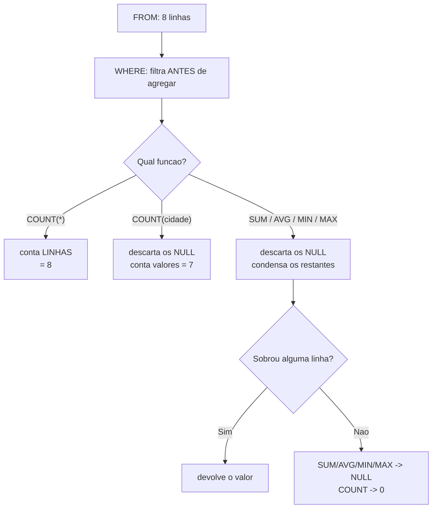

# 03.05 — Funções de agregação

> **Módulo 03 — SQL** · Nível: N1 · Tempo estimado: 2h30 · Código: `codigo/cap05/`

## 1. Objetivo

- **Aplicar** `COUNT`, `SUM`, `AVG`, `MIN`, `MAX` sobre colunas e expressões.
- **Prever** o efeito do `NULL` em cada uma — e a diferença entre `COUNT(*)` e `COUNT(coluna)`.
- **Combinar** agregação com filtro, entendendo que o `WHERE` age **antes** de agregar.
- **Formatar** valores monetários em centavos inteiros, a disciplina do 01.04 aplicada ao banco.

Ao final, você responde perguntas que pedem **números**, e sabe por que duas contagens da mesma tabela podem discordar — sem que nenhuma esteja errada.

---

## 2. Pré-requisitos

- [03.03 — `SELECT` e `WHERE`](03-select-e-where.md) — o filtro age **antes** da agregação; a lógica de três valores volta com um comportamento novo.
- [01.12 — Listas parte 1](../01-Python/12-listas-parte-1.md) — **a dívida deste capítulo**: o padrão "acumular num laço" é exatamente o que estas funções substituem.

**Autoteste:** (1) Como você somaria os valores de uma lista em Python? (2) O que `sum([])` devolve em Python? (3) Quantos clientes o laboratório tem? A pergunta (2) tem uma resposta em Python e **outra** em SQL — e a diferença já custou fechamento de balanço a muita gente.

---

## 3. Motivação

Tudo o que você fez até aqui devolve **linhas**. Metade das perguntas de negócio, no entanto, não quer linhas: quer **um número**.

*"Quantos clientes temos?"* · *"Qual o faturamento do trimestre?"* · *"Qual o ticket médio?"* · *"Qual o produto mais caro?"*

Em Python, cada uma dessas perguntas era um laço com acumulador (01.12). Em SQL, é uma função — e o laço desaparece. Essa é a segunda grande demonstração do poder declarativo, depois do filtro.

Mas há uma pergunta aparentemente inocente que separa quem sabe agregar de quem decorou os nomes das funções: **"quantos clientes temos?"**

```sql
SELECT COUNT(*) FROM clientes;          -- 8
SELECT COUNT(cidade) FROM clientes;     -- 7
```

Oito e sete, da mesma tabela, sem erro nenhum. As duas estão certas — e respondem perguntas diferentes. Se você entregar a segunda achando que respondeu a primeira, entregou um número errado com cara de certo.

E há um caso pior, que aparece em fechamento de mês: `SUM` sobre um conjunto vazio **não devolve zero**. Devolve `NULL`. O relatório que soma as vendas de uma categoria sem vendas não mostra `R$ 0,00`; mostra vazio — ou, pior, quebra no programa que consome o resultado esperando um número.

---

## 4. Modelo mental

> 🧠 **Modelo mental**
> Uma função de agregação é um **funil que engole muitas linhas e cospe um valor**. Ela não escolhe linhas nem colunas: ela **condensa**. E todas elas — exceto uma — compartilham a mesma regra sobre o desconhecido: **`NULL` é ignorado, não conta**. A exceção é o `COUNT(*)`, que conta **linhas**, não valores, e por isso enxerga tudo. Toda divergência entre duas contagens da mesma tabela sai dessa única diferença.

**Exercício de previsão.** A tabela `clientes` tem 8 linhas; a Helena tem `cidade` nula. Sem rodar, decida o resultado de cada consulta:

- (a) `COUNT(*)`
- (b) `COUNT(cidade)`
- (c) `COUNT(DISTINCT cidade)` — sabendo que há 3 cidades distintas preenchidas
- (d) `SELECT DISTINCT cidade` — quantas linhas?

*Resposta comentada:* (a) **8** — conta linhas. (b) **7** — conta **valores não nulos** da coluna. (c) **3** — combina as duas regras: valores distintos, ignorando o nulo. (d) **4 linhas** — e aqui está o detalhe que confunde: o `SELECT DISTINCT` **lista** o `NULL` como um valor, enquanto o `COUNT(DISTINCT)` **não o conta**. As duas discordam sobre a Helena, e nenhuma está errada: uma pergunta "quais valores existem?" (o desconhecido é um deles), a outra pergunta "quantos valores conhecidos distintos há?". Se você respondeu 8 para (b), acabou de descrever o erro mais comum de relatório em SQL.

---

## 5. Analogia

Imagine um **caixa fechando o dia com uma pilha de comandas**.

`COUNT(*)` é contar **as comandas**: quantos papéis há na pilha. Nenhuma pergunta sobre o conteúdo — oito papéis são oito papéis, mesmo que dois estejam em branco.

`COUNT(valor)` é contar **as comandas com valor escrito**. As duas em branco não entram. É outra pergunta, e o número é menor.

`SUM(valor)` soma o que está escrito; as comandas em branco são puladas sem cerimônia. E `AVG(valor)` divide essa soma pelo número de comandas **preenchidas**, não pelo total da pilha — o que faz uma diferença enorme quando muitas estão em branco.

O detalhe que quebra o fechamento: se a pilha estiver **vazia**, o caixa não escreve "R$ 0,00" no relatório. Ele deixa o campo em branco, porque não havia nada para somar. É o `SUM` devolvendo `NULL` — e é diferente de "o total foi zero".

**Onde a analogia quebra:** um caixa humano escreveria zero, porque entende a intenção. O banco não interpreta intenção — e essa recusa é coerente com o `NULL` do 03.03: "não havia dados" e "o total é zero" são afirmações diferentes, e o banco se recusa a confundi-las.

---

## 6. Teoria

### As cinco funções

```sql
SELECT COUNT(*)             AS qtd,      -- 12
       SUM(preco_centavos)  AS soma,     -- 318020
       AVG(preco_centavos)  AS media,    -- 26501.666...
       MIN(preco_centavos)  AS minimo,   -- 3490
       MAX(preco_centavos)  AS maximo    -- 89900
FROM produtos;
```

| Função | O que faz | Ignora `NULL`? |
|---|---|---|
| `COUNT(*)` | conta **linhas** | **não** — conta tudo |
| `COUNT(coluna)` | conta **valores não nulos** | sim |
| `COUNT(DISTINCT coluna)` | conta valores distintos não nulos | sim |
| `SUM(coluna)` | soma | sim |
| `AVG(coluna)` | média | sim — **inclusive no denominador** |
| `MIN` / `MAX` | menor / maior | sim |

O resultado é **uma linha só**. Uma consulta com agregação e sem `GROUP BY` (03.06) sempre condensa a tabela inteira num único registro.

### A regra única e suas três consequências

Todas as funções ignoram `NULL`, exceto `COUNT(*)`. Dessa frase saem os três comportamentos que confundem.

**Consequência 1 — contagens que discordam:**

```sql
SELECT COUNT(*)     AS linhas,      -- 8
       COUNT(cidade) AS com_cidade, -- 7  (a Helena não tem)
       COUNT(email)  AS com_email,  -- 7  (a Beatriz não tem)
       COUNT(DISTINCT cidade) AS cidades  -- 3
FROM clientes;
```

Isso é uma ferramenta, não um defeito: `COUNT(*) - COUNT(coluna)` é a forma canônica de **contar nulos**, e foi o que a auditoria do 03.03 usou.

**Consequência 2 — a média mente:**

```sql
SELECT AVG(LENGTH(cidade))                        AS media_real,     -- 7.43
       SUM(LENGTH(cidade)) * 1.0 / COUNT(*)       AS media_forcada   -- 6.50
FROM clientes;
```

O `AVG` divide por **7** (os não nulos); a segunda forma divide por **8**. Nenhuma é errada — o que é errado é não saber qual você está usando. A pergunta que decide: *"quem não tem cidade deve contar como zero, ou não deve contar?"* Em `AVG` de valores monetários, essa diferença já reprovou muito fechamento.

**Consequência 3 — `SUM` vazio devolve `NULL`:**

```sql
SELECT SUM(preco_centavos) AS soma, COUNT(*) AS qtd
FROM produtos WHERE categoria = 'inexistente';
```

```text
soma | qtd
-----+----
NULL |   0
```

`COUNT` de conjunto vazio é **0**; `SUM` de conjunto vazio é **`NULL`**. É coerente (não havia nada para somar), e é uma armadilha em relatórios. A correção:

```sql
SELECT COALESCE(SUM(preco_centavos), 0) AS soma_segura FROM produtos WHERE ...;
```

> ⚠️ **Atenção**
> `COALESCE(a, b)` devolve `a` se não for nulo, senão `b` — é o `get` com padrão do 01.15, em SQL. Use-o em **todo** `SUM` que alimente um relatório ou um programa: a diferença entre `0` e `NULL` costuma ser a diferença entre um número na tela e um erro de tipo em quem consome.

### Agregar expressões, não só colunas

O que se agrega pode ser uma conta:

```sql
SELECT SUM(quantidade * preco_unitario_centavos) / 100.0 AS faturamento_reais
FROM itens_pedido;
```

A multiplicação acontece **linha a linha**; a soma, depois. E repare na ordem da divisão: somar em centavos (inteiros, exatos) e dividir por 100 **no fim** preserva a exatidão — dividir antes traria os problemas de ponto flutuante do 01.04 para dentro de cada parcela.

### `WHERE` age antes de agregar

```sql
SELECT COUNT(DISTINCT p.id) AS pedidos,
       SUM(i.quantidade * i.preco_unitario_centavos) / 100.0 AS faturamento_reais
FROM pedidos p
JOIN itens_pedido i ON i.pedido_id = p.id
WHERE p.status = 'concluido';
```

```text
pedidos | faturamento_reais
--------+------------------
     17 |            8318.4
```

O `WHERE` descartou os pedidos cancelados e pendentes **antes** de somar — é a ordem de execução do 03.04 (`FROM` → `WHERE` → agregação). Filtrar depois de agregar é outro assunto, e exige o `HAVING` do 03.06.

O `COUNT(DISTINCT p.id)` merece atenção: como a junção repete o pedido uma vez por item, `COUNT(*)` contaria **itens**, não pedidos. É a primeira aparição de um cuidado que o 03.07 desenvolve.

### `MIN` e `MAX` funcionam em texto e data

```sql
SELECT MIN(data) AS primeiro_pedido, MAX(data) AS ultimo_pedido FROM pedidos;
SELECT MIN(nome) AS primeiro_alfabetico FROM clientes;
```

Datas em formato `AAAA-MM-DD` ordenam corretamente como texto — é a razão de o laboratório usar esse formato, e a recomendação geral para datas guardadas como texto.

> 📌 **Dialeto**
> `AVG` sobre inteiros devolve real no SQLite e no PostgreSQL; em alguns bancos, a divisão inteira trunca o resultado. Para garantir: `AVG(coluna * 1.0)`. E `COUNT` devolve inteiro de 64 bits em bancos modernos — não é preocupação prática, mas em sistemas antigos com muitas linhas já foi.

---

## 7. Funcionamento interno

Por dentro, na medida N1: agregações são calculadas **num único passe** sobre as linhas, mantendo um acumulador na memória — exatamente o laço que você escreveria em Python, só que dentro do banco e otimizado. É por isso que `SUM` e `COUNT` de uma tabela inteira custam proporcionalmente ao número de linhas, e não mais que isso. Duas otimizações valem conhecer. A primeira: `COUNT(*)` sem filtro pode ser respondido por metadados ou por um índice pequeno, sem tocar na tabela — em PostgreSQL isso depende de estatísticas, em MySQL/InnoDB não é exato. A segunda: `MIN` e `MAX` sobre uma **coluna indexada** são instantâneos, porque o menor e o maior valor são a primeira e a última entrada do índice — o banco lê uma entrada e para, em vez de percorrer tudo. Daí a assimetria curiosa: `MIN(preco_centavos)` pode ser milhares de vezes mais rápido que `AVG(preco_centavos)` na mesma tabela, porque a média exige ver todos os valores e o mínimo não.

---

## 8. Visualização do fluxo

O funil da agregação, e onde o `NULL` se perde:



**Como ler:** os três caminhos que saem do losango do meio explicam todas as divergências do capítulo. Só o ramo do `COUNT(*)` não passa pelo descarte de nulos — e é essa única exceção que faz duas contagens da mesma tabela discordarem. O losango de baixo é a armadilha do conjunto vazio: `COUNT` e as demais funções **divergem** quando não sobrou nada, e é o único ponto em que `0` e `NULL` se separam.

---

## 9. Aplicação prática

**Passo 1 — As cinco funções de uma vez:**

```bash
python codigo/sql.py "SELECT COUNT(*) AS qtd, SUM(preco_centavos) AS soma, AVG(preco_centavos) AS media, MIN(preco_centavos) AS minimo, MAX(preco_centavos) AS maximo FROM produtos"
```

```text
qtd | soma   | media              | minimo | maximo
----+--------+--------------------+--------+-------
 12 | 318020 | 26501.666666666668 |   3490 |  89900
```

Uma linha, cinco números, doze produtos condensados.

**Passo 2 — As contagens que discordam:**

```bash
python codigo/sql.py "SELECT COUNT(*) AS linhas, COUNT(cidade) AS com_cidade, COUNT(email) AS com_email, COUNT(DISTINCT cidade) AS cidades FROM clientes"
```

```text
linhas | com_cidade | com_email | cidades
-------+------------+-----------+--------
     8 |          7 |         7 |       3
```

Quatro números da mesma tabela, todos corretos, todos respondendo perguntas diferentes. E a ferramenta que sai daí: `8 - 7 = 1` nulo em cada coluna.

**Passo 3 — A média que muda de denominador:**

```bash
python codigo/sql.py "SELECT COUNT(*) AS linhas, COUNT(cidade) AS nao_nulos, AVG(LENGTH(cidade)) AS media_real, SUM(LENGTH(cidade)) * 1.0 / COUNT(*) AS media_forcada FROM clientes"
```

```text
linhas | nao_nulos | media_real        | media_forcada
-------+-----------+-------------------+--------------
     8 |         7 | 7.428571428571429 |           6.5
```

7,43 contra 6,50 — a mesma coluna, dois denominadores. Sempre saiba qual você quer.

**Passo 4 — A armadilha do conjunto vazio:**

```bash
python codigo/sql.py "SELECT SUM(preco_centavos) AS soma, COUNT(*) AS qtd FROM produtos WHERE categoria = 'inexistente'"
```

```text
soma | qtd
-----+----
NULL |   0
```

E a correção:

```bash
python codigo/sql.py "SELECT COALESCE(SUM(preco_centavos), 0) AS soma_segura FROM produtos WHERE categoria = 'inexistente'"
```

```text
soma_segura
-----------
          0
```

**Passo 5 — O faturamento de verdade:**

```bash
python codigo/sql.py codigo/cap05/agregando.sql
```

O arquivo termina com a pergunta que abriu o módulo, agora respondível em uma linha:

```text
pedidos | faturamento_reais
--------+------------------
     17 |            8318.4
```

Dezessete pedidos concluídos, R$ 8.318,40 de faturamento. Compare com o `relatorio_aurora.py` do 01.25: lá foram cerca de sessenta linhas de Python para chegar a um número equivalente; aqui são quatro linhas de SQL.

> 🎯 **Checkpoint rápido**
> De cabeça: por que `COUNT(*)` e `COUNT(coluna)` podem discordar? E o que `SUM` devolve quando o `WHERE` não deixa passar nenhuma linha?

---

## 10. Código comentado

Arquivo completo em [`codigo/cap05/agregando.sql`](codigo/cap05/agregando.sql).

```sql
-- ------------------------------------------------------------
-- agregando.sql
-- Capítulo 03.05 — Funções de agregação
-- O que este arquivo demonstra: as cinco funções, o efeito do NULL
--   em cada uma, a armadilha do conjunto vazio e o faturamento real
-- Como executar: python codigo/sql.py codigo/cap05/agregando.sql
-- ------------------------------------------------------------

-- [1] As cinco de uma vez: 12 produtos viram UMA linha
SELECT COUNT(*)            AS qtd,
       SUM(preco_centavos) AS soma,
       AVG(preco_centavos) AS media,
       MIN(preco_centavos) AS minimo,
       MAX(preco_centavos) AS maximo
FROM produtos;

-- [2] As contagens que DISCORDAM — e todas estão certas
--     COUNT(*) conta LINHAS; COUNT(col) conta VALORES não nulos
SELECT COUNT(*)               AS linhas,      -- 8
       COUNT(cidade)          AS com_cidade,  -- 7 (Helena não tem)
       COUNT(email)           AS com_email,   -- 7 (Beatriz não tem)
       COUNT(DISTINCT cidade) AS cidades      -- 3 (o NULL não conta)
FROM clientes;

-- [3] A ferramenta que sai daí: contar nulos numa tacada
SELECT COUNT(*) - COUNT(cidade) AS cidades_nulas FROM clientes;

-- [4] A média muda de DENOMINADOR conforme o NULL
--     AVG divide por 7 (não nulos); a forma manual divide por 8
SELECT AVG(LENGTH(cidade))                  AS media_real,
       SUM(LENGTH(cidade)) * 1.0 / COUNT(*) AS media_forcada
FROM clientes;

-- [5] ARMADILHA: conjunto vazio -> COUNT devolve 0, SUM devolve NULL
SELECT SUM(preco_centavos) AS soma, COUNT(*) AS qtd
FROM produtos WHERE categoria = 'inexistente';

-- [6] A correção: COALESCE é o "get com padrão" do 01.15, em SQL
SELECT COALESCE(SUM(preco_centavos), 0) AS soma_segura
FROM produtos WHERE categoria = 'inexistente';

-- [7] Agregar EXPRESSÃO: multiplica linha a linha, soma depois.
--     Divide por 100 só no FIM — exatidão em centavos (01.04)
SELECT SUM(quantidade * preco_unitario_centavos) / 100.0 AS total_geral_reais
FROM itens_pedido;

-- [8] O faturamento real: o WHERE age ANTES de agregar.
--     COUNT(DISTINCT p.id) porque a junção repete o pedido por item
SELECT COUNT(DISTINCT p.id)                                AS pedidos,
       SUM(i.quantidade * i.preco_unitario_centavos)/100.0 AS faturamento_reais
FROM pedidos p
JOIN itens_pedido i ON i.pedido_id = p.id
WHERE p.status = 'concluido';
```

Os comandos [2] e [5] são o núcleo. O [2] mostra que "quantos" é uma pergunta ambígua até você dizer *quantos o quê* — linhas ou valores. O [5] mostra o único ponto do SQL em que "nenhum" e "zero" se separam, e ele aparece justamente onde dói: em somas de relatório.

O comando [8] antecipa dois assuntos. O `JOIN` é o 03.07 — por ora, leia como "combine pedidos com seus itens". E o `COUNT(DISTINCT p.id)` é a defesa contra a **multiplicação de linhas** que a junção provoca: sem o `DISTINCT`, o número 17 viraria **28**, porque cada pedido aparece uma vez por item. Confira você mesmo:

```bash
python codigo/sql.py "SELECT COUNT(*) AS linhas_da_juncao, COUNT(DISTINCT p.id) AS pedidos FROM pedidos p JOIN itens_pedido i ON i.pedido_id = p.id WHERE p.status='concluido'"
```

```text
linhas_da_juncao | pedidos
-----------------+--------
              28 |      17
```

É o erro mais comum ao agregar sobre junções, e o 03.07 o trata em detalhe.

---

## 11. Erros comuns

### Erro 1 — Usar `COUNT(coluna)` achando que conta linhas

**Sintoma:** o relatório diz "8 clientes" numa tela e "7 clientes" em outra, e ninguém sabe qual está certa.
**Causa:** uma consulta usa `COUNT(*)` e a outra `COUNT(alguma_coluna)` — e a coluna tem nulos.
**Correção:** decida a pergunta antes da consulta. "Quantos clientes existem" → `COUNT(*)`. "Quantos clientes têm e-mail cadastrado" → `COUNT(email)`. E dê nome à coluna do resultado com `AS` deixando a pergunta explícita (`clientes_com_email`), que é a defesa real — o nome impede a confusão na leitura.

### Erro 2 — Esperar zero de um `SUM` vazio

**Sintoma:** o relatório mostra o total em branco, ou o programa que consome o resultado quebra com erro de tipo ao tentar formatar `None` como moeda.
**Causa:** `SUM` de conjunto vazio devolve `NULL`, não `0`.
**Correção:** `COALESCE(SUM(coluna), 0)` em toda soma que alimente relatório ou programa. Vale o mesmo para `AVG`, `MIN` e `MAX` — mas com uma ressalva importante: para `AVG`, substituir por zero pode ser **errado**, porque "média de nada" não é "média zero". Nesses casos, a resposta honesta é devolver o `NULL` e tratar a ausência na apresentação ("sem dados no período").

### Erro 3 — Média sobre coluna com nulos, sem decidir o denominador

**Sintoma:** o ticket médio parece alto demais; investigando, descobre-se que metade dos registros tinha o valor em branco e não entrou na conta.
**Causa:** `AVG` ignora nulos **inclusive no denominador** — a média é dos preenchidos, não do universo.
**Correção:** responda a pergunta de negócio primeiro. Se a ausência significa "zero" (uma venda sem desconto), use `AVG(COALESCE(desconto, 0))`. Se significa "desconhecido" (um valor que não foi informado), o `AVG` puro está certo — e o relatório deve dizer sobre quantos registros a média foi calculada. Publicar uma média sem o tamanho da amostra é a raiz do problema, não o SQL.

---

## 12. Boas práticas

✅ **`COUNT(*)` para linhas, `COUNT(coluna)` para valores preenchidos** — e o `AS` deixando a pergunta explícita no nome.

✅ **`COALESCE(SUM(...), 0)` em toda soma de relatório** — a diferença entre um número e um erro de tipo.

✅ **Somar em centavos inteiros, dividir por 100 só no fim** — exatidão preservada (01.04).

✅ **Publique médias com o tamanho da amostra** — `AVG` e `COUNT` na mesma consulta.

✅ **`COUNT(*) - COUNT(coluna)` para auditar nulos** — o diagnóstico de uma linha do 03.03.

❌ **Evite `AVG` sem decidir o que fazer com os nulos** — a escolha do denominador é de negócio, não de sintaxe.

❌ **Evite `COUNT(*)` sobre junções sem pensar** — a junção multiplica linhas; frequentemente o certo é `COUNT(DISTINCT chave)` (03.07).

---

## 13. Performance

Nesta escala, irrelevante. Três notas para quando importar. `SUM`, `AVG` e `COUNT` exigem **ver todas as linhas** que passaram pelo filtro — custo proporcional ao conjunto, sem atalho, e é por isso que agregações sobre tabelas grandes são o caso clássico de "a consulta ficou lenta de repente" quando o volume cresce. `MIN` e `MAX` são a exceção elegante: com índice na coluna, o banco lê **uma** entrada (a primeira ou a última) e para, o que os torna praticamente gratuitos. E `COUNT(*)` de tabela inteira tem tratamento especial em vários bancos, porque é a pergunta mais feita do mundo — em PostgreSQL ele ainda percorre, mas pode usar um índice pequeno em vez da tabela. A lição transferível: quando uma agregação sobre milhões de linhas precisar responder em tempo de tela, a solução não é otimizar a consulta e sim **pré-agregar** — guardar totais calculados, atualizados por gatilho ou por processo, que é o assunto do módulo 10.

---

## 14. Mercado

> 🏢 **Mercado**
> Agregação é o que transforma dados em resposta, e é o que se pede em toda entrevista de dados a partir do nível júnior. A pergunta sobre `COUNT(*)` × `COUNT(coluna)` é praticamente obrigatória — não pela dificuldade, mas porque a resposta revela se a pessoa entende `NULL` ou apenas decorou funções. E o `SUM` que devolve `NULL` em conjunto vazio é uma das causas mais frequentes de erro em relatórios financeiros: o mês sem vendas numa categoria aparece em branco, alguém interpreta como falha do sistema, e a investigação consome uma tarde. Em revisão de código, `SUM` sem `COALESCE` num relatório é achado padrão.
>
> **Mini-cenário:** o relatório de faturamento do Atlas, que no módulo 01 tinha sessenta linhas de Python com laço e acumulador, cabe agora em quatro linhas de SQL — e é mais rápido, porque o banco agrega onde os dados estão, em vez de trazer tudo para a memória do programa. Essa migração de responsabilidade (agregar no banco, não na aplicação) é uma das decisões de arquitetura mais consequentes que você vai tomar, e o módulo 10 volta a ela.

---

## 15. Entrevistas

**P1. "Qual a diferença entre `COUNT(*)` e `COUNT(coluna)`?"**
*Resposta esperada:* `COUNT(*)` conta **linhas**; `COUNT(coluna)` conta **valores não nulos** daquela coluna. Se a coluna tiver nulos, os números divergem — e a diferença entre eles é exatamente a quantidade de nulos, o que dá a técnica de auditoria `COUNT(*) - COUNT(coluna)`. Mencionar `COUNT(DISTINCT coluna)` como terceira variante completa.

**P2. "O que `SUM` devolve quando nenhuma linha passa pelo filtro?"**
*Resposta esperada:* **`NULL`**, não zero — porque não havia nada para somar, e "nenhum" é diferente de "zero". `COUNT` no mesmo caso devolve **0**. A correção prática é `COALESCE(SUM(...), 0)`, e a ressalva madura é que para `AVG` substituir por zero costuma ser **errado**: média de nada não é média zero.

**P3. "Como o `AVG` trata valores nulos?"**
*Resposta esperada:* ignora — tanto no numerador quanto no **denominador**. A média é dos valores preenchidos. Se a regra de negócio disser que ausência significa zero, é preciso ser explícito: `AVG(COALESCE(coluna, 0))`. E a boa prática que fecha: publicar toda média com o `COUNT` correspondente, porque média sem tamanho de amostra esconde exatamente esse tipo de decisão.

**Pegadinha clássica: "Uma consulta soma o faturamento juntando `pedidos` com `itens_pedido` e o número saiu certo. A mesma consulta conta os pedidos com `COUNT(*)` e o número saiu inflado. Por quê?"**
Ela testa se a pessoa entende o que uma junção faz com as **linhas**, e é a porta de entrada do assunto do 03.07. A resposta forte explica o mecanismo: a junção produz **uma linha por item**, não por pedido — um pedido com três itens aparece três vezes no conjunto intermediário. Para a **soma**, isso é justamente o desejado: cada item precisa ser somado uma vez, e o total sai correto. Para a **contagem de pedidos**, é errado: `COUNT(*)` conta linhas do resultado da junção, ou seja, itens. A correção é `COUNT(DISTINCT p.id)`, que conta pedidos distintos. E o movimento que separa é reconhecer o padrão geral: **numa consulta com junção, cada agregação precisa ser avaliada quanto ao nível de granularidade em que ela opera** — algumas medem itens, outras medem pedidos, e misturar as duas numa consulta só é a origem do erro clássico de "somar duas vezes" que aparece quando se junta mais de uma tabela filha ao mesmo pai. Fechar dizendo que, quando duas granularidades diferentes precisam ser medidas na mesma resposta, o caminho limpo é separá-las em CTEs (03.10) demonstra visão de arquitetura de consulta.

---

## 16. Exercícios guiados

Enunciados completos em [`exercicios/cap05.md`](exercicios/cap05.md); gabaritos em [`exercicios/gabaritos/cap05.md`](exercicios/gabaritos/cap05.md).

### Aquecimento

- **A1** `[~10 min · preveja o número]` — 8 agregações: qual o resultado?
- **A2** `[~10 min · qual função?]` — 8 perguntas de negócio: qual agregação responde?
- **A3** `[~10 min · `NULL` na agregação]` — 6 situações: o nulo entra ou não?
- **A4** `[~10 min · ache o erro]` — 6 consultas com problema de agregação.

### Aplicação

- **AP1** `[~20 min · o painel de números]` — Produza os oito indicadores principais do laboratório.
- **AP2** `[~20 min · a média honesta]` — Calcule três médias com denominadores diferentes e justifique cada escolha.
- **AP3** `[~20 min · conjunto vazio]` — Provoque o `NULL` do `SUM` em três cenários e corrija cada um.

---

## 17. Desafios

- **D1** `[~45 min · o fechamento do mês]` — **Um relatório que não pode errar.** Produza o fechamento de julho de 2026 da Aurora: (a) número de pedidos, faturamento e ticket médio, considerando **apenas** pedidos concluídos; (b) os mesmos três números para uma categoria **sem vendas no período** — e garanta que o relatório mostre `0,00` e não vazio; (c) quantos clientes distintos compraram, e quantos clientes existem no total — explique por que os dois números importam juntos; (d) a **prova dos nove** do 01.25 aplicada aqui: some o faturamento por status e verifique que bate com o total sem filtro; (e) identifique **um** número do seu relatório que mudaria se você usasse `COUNT(*)` em vez de `COUNT(DISTINCT ...)`, e explique. Fecho: 5 linhas sobre por que um relatório deve publicar o tamanho da amostra junto com toda média.

<details><summary>💡 Dica 1 (conceito)</summary>
Filtrar julho de 2026 com datas em texto `AAAA-MM-DD`: `WHERE data >= '2026-07-01' AND data < '2026-08-01'` — mais seguro que `LIKE '2026-07%'` e capaz de usar índice.
</details>
<details><summary>💡 Dica 2 (estratégia)</summary>
Para o item (d), rode uma consulta por status e some à mão; depois compare com a consulta sem `WHERE`. Se não bater, provavelmente há status que você não previu.
</details>
<details><summary>💡 Dica 3 (esqueleto)</summary>
Consulta dos três números → a mesma com categoria vazia + COALESCE → clientes distintos vs. total → a prova por status → a análise do COUNT(*) vs COUNT(DISTINCT) → reflexão.
</details>

---

## 18. Mini projeto

**O painel da Aurora, versão números** `[~50 min]`

Requisitos numerados:

1. Escreva **doze** indicadores de negócio que a diretoria da Aurora gostaria de acompanhar — pense em volume, valor, média e extremos.
2. Para cada um, **antes de escrever SQL**, responda por escrito: os `NULL` devem entrar? o conjunto pode ser vazio? o número é sobre linhas ou sobre valores?
3. Escreva as doze consultas, aplicando as decisões do passo 2 — com `COALESCE` onde couber e `AS` em todas as colunas.
4. Para cada média, publique também o `COUNT` correspondente na mesma consulta.
5. Junte tudo num `painel.sql` com comentários e execute de uma vez. Confira se algum indicador devolve `NULL` — e decida se aquilo é correto ou um esquecimento.

**Critério de "está bom":** o passo 2 é o critério, e ele é a diferença entre escrever SQL e fazer análise de dados. Um indicador cuja definição você não conseguiu escrever antes da consulta é um indicador que você não entendeu — e números mal definidos são piores que números ausentes, porque são usados para decidir. O passo 5 fecha o ciclo: todo `NULL` que aparecer no painel final é uma decisão que você tomou ou uma que esqueceu de tomar.

---

## 19. Revisão

**Resumo do capítulo:**

- Agregação **condensa** muitas linhas num valor; sem `GROUP BY`, o resultado é **uma linha só**.
- As cinco: `COUNT`, `SUM`, `AVG`, `MIN`, `MAX`.
- **A regra única:** todas ignoram `NULL` — **exceto `COUNT(*)`**, que conta linhas.
- Daí: `COUNT(*)` ≠ `COUNT(coluna)` quando há nulos; a diferença entre eles **é** a quantidade de nulos.
- `AVG` ignora nulos **inclusive no denominador** — a média é dos preenchidos.
- **Conjunto vazio:** `COUNT` → `0`; `SUM`/`AVG`/`MIN`/`MAX` → **`NULL`**. Correção: `COALESCE(SUM(...), 0)`.
- `WHERE` age **antes** de agregar (filtrar depois é `HAVING`, 03.06).
- Agregue expressões (`SUM(qtd * preco)`); some em centavos e divida por 100 **no fim**.
- Sobre junções, `COUNT(*)` conta linhas da junção — use `COUNT(DISTINCT chave)`.

**Flashcards novos** (adicionados a [`revisao/flashcards.md`](revisao/flashcards.md)):

| ID | Frente | Verso |
|---|---|---|
| 03.05-F1 | Qual a diferença entre `COUNT(*)` e `COUNT(coluna)`? | `COUNT(*)` conta **linhas**; `COUNT(coluna)` conta **valores não nulos**. A diferença entre os dois é a quantidade de nulos — daí `COUNT(*) - COUNT(col)` auditar nulos. |
| 03.05-F2 | Explique com suas palavras: por que `AVG` pode "mentir" numa coluna com nulos? | (Elaboração) Ele ignora os nulos **no denominador** também — a média é dos preenchidos, não do universo. Se ausência significa zero, use `AVG(COALESCE(col, 0))`. |
| 03.05-F3 | Preveja: `SUM(valor)` num `WHERE` que não deixa passar nenhuma linha. O que devolve? | (Previsão) **`NULL`**, não zero — não havia nada para somar. `COUNT` no mesmo caso devolve **0**. Correção: `COALESCE(SUM(...), 0)`. |
| 03.05-F4 | Quando usar `COUNT(DISTINCT chave)` em vez de `COUNT(*)`? | (Decisão) Sempre que houver **junção**: ela produz uma linha por item, e `COUNT(*)` contaria itens, não pedidos. Avalie a granularidade de cada agregação. |
| 03.05-F5 | Por que somar em centavos e dividir por 100 só no fim? | Inteiros são exatos; dividir antes traz o erro de ponto flutuante (01.04) para dentro de cada parcela, e ele se acumula na soma. |

**Agendamento:** registre no `PROGRESSO.md` e marque D+1, D+7, D+30, D+90 na [`Revisoes/agenda.md`](../Revisoes/agenda.md).

---

## 20. Checklist

Perguntas de domínio — teste do sim:

- [ ] Sei explicar *por que duas contagens da mesma tabela podem discordar, sem que nenhuma esteja errada*?
- [ ] Sei prever *o que cada função devolve sobre um conjunto vazio*?
- [ ] Sei decidir *o denominador de uma média em coluna com nulos*?
- [ ] Sei justificar *o `COUNT(DISTINCT)` numa consulta com junção*?
- [ ] Sei responder *à pegadinha da soma certa com a contagem inflada*?

Itens práticos:

- [ ] Rodei `agregando.sql` e vi as quatro contagens divergentes.
- [ ] Provoquei o `NULL` do `SUM` e corrigi com `COALESCE`.
- [ ] Comparei as duas médias (denominador 7 e 8) e entendi a diferença.
- [ ] Completei "O painel da Aurora, versão números" — com as decisões do passo 2 escritas antes.
- [ ] Registrei a sessão e agendei as 4 revisões.

---

## 21. Próximo capítulo

Você condensa a tabela inteira num número. E a pergunta que a Aurora faz de verdade não é "qual o faturamento total" — é **"qual o faturamento por cidade"**, "quantos pedidos por status", "qual o ticket médio por categoria". Ficou deliberadamente em aberto o mecanismo que aplica a agregação **a cada grupo** em vez de ao conjunto todo: o `GROUP BY`. Ele fecha o arco mais antigo da trilha — o padrão `chave → acumulador` do 01.15 e o `sort | uniq -c` do 02.04 —, e traz junto a distinção que mais confunde em SQL: filtrar **antes** de agrupar (`WHERE`) ou **depois** (`HAVING`).

→ [03.06 — `GROUP BY` e `HAVING`](06-group-by-e-having.md)

---

*Gerado sob spec 3.0.0*
