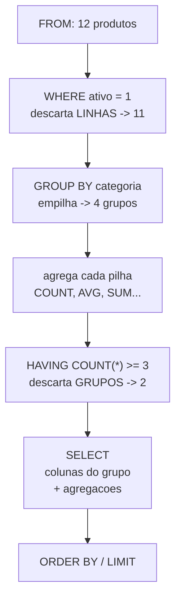

# 03.06 — `GROUP BY` e `HAVING`

> **Módulo 03 — SQL** · Nível: N2 · Tempo estimado: 3h00 · Código: `codigo/cap06/`

## 1. Objetivo

- **Prever** o resultado de um agrupamento antes de executar a consulta.
- **Diferenciar** `WHERE` (filtra linhas, antes) de `HAVING` (filtra grupos, depois).
- **Explicar** a regra de ouro: toda coluna do `SELECT` está no `GROUP BY` ou dentro de uma agregação.
- **Reconhecer** que este é o `chave → acumulador` do 01.15 e o `sort | uniq -c` do 02.04, declarativos.

Ao final, você responde a pergunta que a Aurora faz de verdade — **por cidade, por categoria, por status** — e o arco mais antigo da trilha se fecha.

---

## 2. Pré-requisitos

- [03.05 — Funções de agregação](05-funcoes-de-agregacao.md) — as cinco funções; aqui elas passam a agir **por grupo**.
- [01.15 — Dicionários](../01-Python/15-dicionarios.md) — **a dívida deste capítulo**: o padrão `totais[chave] = totais.get(chave, 0) + valor` é literalmente o que o `GROUP BY` faz.
- [02.04 — Pipes, redirecionamento e busca](../02-Git-Linux/04-pipes-redirecionamento-e-busca.md) — o `sort | uniq -c` era a mesma ideia, no terminal.

**Autoteste:** (1) Escreva de cabeça o padrão de contagem por chave em Python. (2) O que `sort | uniq -c` faz? (3) Por que os dois precisavam ordenar/canonizar antes? A terceira é a pergunta que o banco resolve por você.

---

## 3. Motivação

Três vezes na trilha você resolveu o mesmo problema, de três jeitos diferentes.

No **01.15**, com dicionário e acumulador:

```python
totais = {}
for venda in vendas:
    chave = venda["cidade"].strip().lower()
    totais[chave] = totais.get(chave, 0) + venda["valor"]
```

No **02.04**, com um pipe:

```bash
cut -d';' -f4 vendas.csv | sort | uniq -c | sort -rn
```

E agora, a terceira vez — em uma linha, sem laço, sem acumulador, sem canonização manual:

```sql
SELECT cidade, SUM(valor) FROM vendas GROUP BY cidade;
```

Este é o capítulo em que a promessa do SQL declarativo se paga por completo. Mas ele traz junto **a distinção que mais confunde em SQL**, e que aparece em toda entrevista: filtrar **antes** de agrupar (`WHERE`) ou **depois** (`HAVING`).

A diferença não é de sintaxe. É de pergunta:

- *"Considerando apenas produtos acima de R$ 300, quantos há por categoria?"* → `WHERE`
- *"Quais categorias têm preço **médio** acima de R$ 300?"* → `HAVING`

As duas consultas se parecem, usam os mesmos números, e devolvem resultados **diferentes**. Escolher a errada produz um relatório plausível e falso.

---

## 4. Modelo mental

> 🧠 **Modelo mental**
> O `GROUP BY` **empilha as linhas** que compartilham o mesmo valor e entrega cada pilha para a função de agregação. Onde antes havia oito clientes, passam a existir quatro pilhas — uma por cidade — e cada pilha vira **uma linha** do resultado. A partir daí, tudo o que aparece no `SELECT` precisa fazer sentido **para a pilha inteira**: ou é o que identifica a pilha (a cidade), ou é um resumo dela (a contagem, a soma). Perguntar o *nome de um cliente* de uma pilha de três é uma pergunta sem resposta — e é exatamente o que a regra de ouro proíbe.

**Exercício de previsão.** A tabela `clientes` tem 8 linhas: 3 de Campinas, 2 de Santos, 2 de Sorocaba, e a Helena com `cidade` nula. Sem rodar, decida quantas linhas devolve `SELECT cidade, COUNT(*) FROM clientes GROUP BY cidade`.

*Resposta comentada:* **4 linhas** — e a quarta é o grupo dos `NULL`, com a Helena sozinha. Aqui está a inversão que vale guardar: no `WHERE` do 03.03, o `NULL` **desaparecia** (não passava em nenhum filtro); no `GROUP BY`, ele **forma seu próprio grupo**, como se fosse um valor. É o mesmo comportamento do `DISTINCT` (03.04) — e a lógica é a mesma: agrupar pergunta "estes dois valores são o mesmo?", e dois desconhecidos são o mesmo "não sei". Se você respondeu 3, provavelmente transferiu a intuição do `WHERE` — e é justamente por isso que relatórios agrupados às vezes mostram uma linha vazia que ninguém esperava.

---

## 5. Analogia

Imagine **cartas de baralho sendo separadas em montes por naipe**.

O `GROUP BY` é o gesto de separar: você percorre as cartas uma vez e forma quatro montes. Depois, cada monte é resumido — quantas cartas tem, qual a soma dos valores, qual a maior. O resultado final é **uma linha por monte**, não uma linha por carta.

Uma vez formados os montes, as cartas individuais **deixam de estar disponíveis**. Perguntar "qual o valor da carta?" para um monte de treze não faz sentido: ou você pergunta algo sobre o monte inteiro (quantas, a soma, a maior), ou pergunta pelo que define o monte (o naipe). É a regra de ouro, e ela não é uma restrição arbitrária — é a consequência de ter empilhado.

E as cartas sem naipe legível? Formam **seu próprio monte**. Ninguém as descarta; elas só ficam juntas, porque não há como distingui-las entre si.

O `WHERE` é retirar cartas **antes** de separar — "tire as cartas abaixo de 7, depois forme os montes". O `HAVING` é descartar **montes inteiros** depois de formados — "elimine os montes com menos de três cartas". Duas operações diferentes, em momentos diferentes, e trocá-las muda o resultado.

**Onde a analogia quebra:** montes de cartas podem ser desfeitos; um resultado agrupado não guarda as linhas originais — se você precisar delas de volta, é outra consulta. E há um detalhe que a analogia esconde: o banco não precisa literalmente formar os montes na memória se houver um índice na coluna de agrupamento; ele percorre em ordem e fecha cada grupo ao passar para o próximo (seção 7).

---

## 6. Teoria

### A forma

```sql
SELECT cidade, COUNT(*) AS clientes
FROM clientes
GROUP BY cidade
ORDER BY clientes DESC;
```

```text
cidade   | clientes
---------+---------
campinas |        3
sorocaba |        2
santos   |        2
NULL     |        1
```

Oito linhas viraram quatro. Cada linha do resultado é **um grupo**.

### A regra de ouro

> **Toda coluna do `SELECT` está no `GROUP BY` ou dentro de uma função de agregação.**

```sql
-- OK: cidade agrupa, COUNT resume
SELECT cidade, COUNT(*) FROM clientes GROUP BY cidade;

-- ERRADO no SQL padrão: 'nome' não agrupa nem é agregado
SELECT categoria, nome, COUNT(*) FROM produtos GROUP BY categoria;
```

O motivo é o modelo mental: o grupo "audio" tem quatro produtos, com quatro nomes diferentes. Qual deles a consulta deveria mostrar? A pergunta não tem resposta, e por isso o padrão a recusa.

> ⚠️ **Atenção**
> **O SQLite não recusa** — ele devolve um valor **arbitrário** do grupo, sem aviso:
>
> ```text
> categoria   | nome                | COUNT(*)
> ------------+---------------------+---------
> acessorios  | Hub USB-C 6 portas  |        4
> audio       | Fone Bluetooth XZ-9 |        4
> ```
>
> A contagem está certa; o nome é **um qualquer** dos quatro. PostgreSQL recusa com `column "produtos.nome" must appear in the GROUP BY clause`. É o terceiro caso do módulo em que a permissividade do SQLite instala um hábito que quebra na migração — e o mais perigoso dos três, porque aqui o resultado **parece** correto. Se você quer um representante do grupo, diga qual: `MIN(nome)`, `MAX(preco_centavos)`, ou a função de janela do 04.

### Agrupar por várias colunas

```sql
SELECT categoria, ativo, COUNT(*) AS qtd
FROM produtos
GROUP BY categoria, ativo;
```

O grupo passa a ser a **combinação** — um grupo para (audio, ativo), outro para (acessorios, inativo), e assim por diante. É o mesmo princípio do `DISTINCT` de várias colunas (03.04).

### `WHERE` × `HAVING`: a distinção central

| | `WHERE` | `HAVING` |
|---|---|---|
| Filtra | **linhas** | **grupos** |
| Quando | **antes** de agrupar | **depois** de agregar |
| Pode usar agregação? | **não** | **sim** |
| Pergunta típica | "considerando apenas X..." | "quais grupos cujo total..." |

A mesma tabela, duas perguntas parecidas, resultados diferentes:

```sql
-- WHERE: descarta produtos baratos, DEPOIS agrupa o que sobrou
SELECT categoria, COUNT(*) AS qtd
FROM produtos WHERE preco_centavos > 30000
GROUP BY categoria;
```

```text
categoria   | qtd
------------+----
audio       |   2
perifericos |   1
video       |   1
```

```sql
-- HAVING: agrupa TUDO, depois descarta grupos de média baixa
SELECT categoria, COUNT(*) AS qtd, AVG(preco_centavos) / 100.0 AS media
FROM produtos
GROUP BY categoria
HAVING AVG(preco_centavos) > 30000;
```

```text
categoria | qtd | media
----------+-----+-------
audio     |   4 | 341.95
video     |   2 | 549.45
```

Repare no que mudou: na primeira, "audio" aparece com **2** (só os caros); na segunda, com **4** (todos, porque o grupo inteiro passou no critério de média). E "perifericos" some da segunda, porque a média da categoria não alcança R$ 300 — embora ela tenha um produto caro.

**Nenhuma está errada. Elas respondem perguntas diferentes**, e a escolha entre `WHERE` e `HAVING` é a escolha da pergunta.

Os dois podem coexistir:

```sql
SELECT categoria, COUNT(*) AS qtd, AVG(preco_centavos) / 100.0 AS media
FROM produtos
WHERE ativo = 1                    -- 1º: descarta linhas
GROUP BY categoria                 -- 2º: forma grupos
HAVING COUNT(*) >= 3               -- 3º: descarta grupos pequenos
ORDER BY qtd DESC;                 -- 4º: ordena o que sobrou
```

```text
categoria  | qtd | media
-----------+-----+------------------
audio      |   4 |            341.95
acessorios |   3 | 81.56666666666666
```

**Regra prática:** se a condição envolve uma função de agregação, ela **tem** que estar no `HAVING`. Se não envolve, prefira o `WHERE` — ele descarta linhas antes de agrupar, o que é mais barato (seção 13).

### `NULL` forma seu próprio grupo

Já visto no exercício de previsão, e vale registrar como regra: no `GROUP BY`, todos os `NULL` de uma coluna caem no **mesmo grupo**, que aparece no resultado. Isso contraria a intuição vinda do `WHERE`, e é coerente com o `DISTINCT`.

Se o relatório não deve mostrar essa linha, o filtro é explícito — `WHERE cidade IS NOT NULL` —, e a decisão fica registrada no código em vez de acontecer por acidente.

### A ordem de execução, completa

```text
FROM → WHERE → GROUP BY → HAVING → SELECT → DISTINCT → ORDER BY → LIMIT
```

Esta é a sequência definitiva do módulo, e ela explica três coisas de uma vez: por que o `HAVING` pode usar agregações (elas já foram calculadas) e o `WHERE` não; por que o apelido do `SELECT` funciona no `ORDER BY` e não no `WHERE` nem no `HAVING` (03.04); e por que agrupar antes de filtrar grupos é a única ordem possível.

📌 **Dialeto:** alguns bancos (MySQL, SQLite, PostgreSQL recente) aceitam o apelido do `SELECT` no `GROUP BY` e no `HAVING`. É extensão, não padrão — escreva a expressão.

---

## 7. Funcionamento interno

Por dentro, na medida N2: o banco tem duas estratégias para agrupar, e o otimizador escolhe. A primeira é a **tabela de dispersão** — percorre as linhas uma vez, mantendo um acumulador por chave numa estrutura em memória. É literalmente o dicionário do 01.15, e tem o mesmo custo: uma passada, memória proporcional ao **número de grupos** (não de linhas). A segunda é o **agrupamento por ordenação** — ordena as linhas pela chave e fecha cada grupo ao detectar a mudança de valor, exatamente o `sort | uniq -c` do 02.04; usa memória constante e custa a ordenação, e é a escolhida quando os dados já vêm ordenados por um índice ou quando há grupos demais para caber na memória. Daí uma consequência prática: agrupar por uma coluna **indexada** costuma ser bem mais barato, porque o índice já entrega as linhas ordenadas e o banco pula a etapa de ordenação. E o `HAVING` é sempre avaliado **depois**, sobre o resultado já agregado — não há como ele reduzir o trabalho de agrupamento, o que é a razão técnica de preferir o `WHERE` sempre que a condição permitir.

---

## 8. Visualização do fluxo

O caminho completo, com os dois filtros em momentos diferentes:



**Como ler:** os dois filtros aparecem em caixas separadas e distantes, e é essa distância que define tudo. O `WHERE` age quando ainda existem **linhas individuais** — por isso não pode usar `COUNT`, que ainda não foi calculado. O `HAVING` age quando só existem **grupos já resumidos** — por isso pode usar `COUNT`, e não pode mais enxergar linha nenhuma. Repare também que o `SELECT` vem **depois** de tudo: é ele que escolhe o que mostrar, e é por isso que a regra de ouro se aplica a ele.

---

## 9. Aplicação prática

**Passo 1 — O `sort | uniq -c`, em SQL:**

```bash
python codigo/sql.py "SELECT cidade, COUNT(*) AS clientes FROM clientes GROUP BY cidade ORDER BY clientes DESC"
```

```text
cidade   | clientes
---------+---------
campinas |        3
sorocaba |        2
santos   |        2
NULL     |        1
```

Compare com o pipe do 02.04: mesmo resultado, sem `cut`, sem `sort`, sem canonização — porque o banco guarda a cidade canônica desde o 03.01.

**Passo 2 — O `NULL` como grupo:**

A quarta linha é a Helena. No `WHERE` ela sumia; aqui ela aparece. Se o relatório não deve mostrá-la, o filtro é explícito:

```bash
python codigo/sql.py "SELECT cidade, COUNT(*) AS clientes FROM clientes WHERE cidade IS NOT NULL GROUP BY cidade"
```

**Passo 3 — `WHERE` e `HAVING`, lado a lado:**

```bash
python codigo/sql.py "SELECT categoria, COUNT(*) AS qtd FROM produtos WHERE preco_centavos > 30000 GROUP BY categoria"
python codigo/sql.py "SELECT categoria, COUNT(*) AS qtd, AVG(preco_centavos)/100.0 AS media FROM produtos GROUP BY categoria HAVING AVG(preco_centavos) > 30000"
```

O primeiro conta **produtos caros por categoria**; o segundo lista **categorias caras em média**. "audio" aparece nos dois, com números diferentes (2 e 4) — e as duas contagens estão certas.

**Passo 4 — Os dois juntos:**

```bash
python codigo/sql.py "SELECT categoria, COUNT(*) AS qtd, AVG(preco_centavos)/100.0 AS media FROM produtos WHERE ativo = 1 GROUP BY categoria HAVING COUNT(*) >= 3 ORDER BY qtd DESC"
```

```text
categoria  | qtd | media
-----------+-----+------------------
audio      |   4 |            341.95
acessorios |   3 | 81.56666666666666
```

Filtrou linhas, agrupou, filtrou grupos, ordenou — a ordem de execução inteira em quatro cláusulas.

**Passo 5 — A dor da Aurora, finalmente respondida:**

```bash
python codigo/sql.py codigo/cap06/agrupando.sql
```

```text
cidade   | pedidos | faturamento_reais
---------+---------+------------------
sorocaba |       5 |            3267.1
campinas |       6 |            2711.2
santos   |       4 |            1357.5
NULL     |       2 |             982.6
```

Faturamento por cidade — a pergunta que o CSV não respondia, que o Python do 01.25 respondeu com sessenta linhas, e que agora cabe em oito. E repare no detalhe que só um olhar atento pega: **Campinas tem mais pedidos e fatura menos que Sorocaba**. Ticket médio menor. Isso é uma informação de negócio que nenhuma das versões anteriores tornava visível sem esforço adicional.

E a linha `NULL`: dois pedidos da Helena, R$ 982,60 que não pertencem a cidade nenhuma no relatório. Um dado faltante virou um número visível — o que é exatamente o que se quer, em vez de ele sumir.

> 🎯 **Checkpoint rápido**
> De cabeça: por que `WHERE COUNT(*) > 3` não funciona? E por que o `NULL` some no `WHERE` e aparece no `GROUP BY`?

---

## 10. Código comentado

Arquivo completo em [`codigo/cap06/agrupando.sql`](codigo/cap06/agrupando.sql).

```sql
-- ------------------------------------------------------------
-- agrupando.sql
-- Capítulo 03.06 — GROUP BY e HAVING
-- O que este arquivo demonstra: agrupamento, o NULL como grupo,
--   a diferença WHERE x HAVING e a dor da Aurora respondida
-- Como executar: python codigo/sql.py codigo/cap06/agrupando.sql
-- ------------------------------------------------------------

-- [1] O sort | uniq -c do 02.04, declarativo
SELECT cidade, COUNT(*) AS clientes
FROM clientes
GROUP BY cidade
ORDER BY clientes DESC;

-- [2] O NULL forma SEU PRÓPRIO grupo (≠ do WHERE, onde ele some)
--     A quarta linha acima é a Helena. Para excluí-la, seja explícito:
SELECT cidade, COUNT(*) AS clientes
FROM clientes
WHERE cidade IS NOT NULL
GROUP BY cidade;

-- [3] WHERE: descarta LINHAS antes de agrupar
--     "considerando só produtos caros, quantos por categoria?"
SELECT categoria, COUNT(*) AS qtd
FROM produtos
WHERE preco_centavos > 30000
GROUP BY categoria;

-- [4] HAVING: descarta GRUPOS depois de agregar
--     "quais categorias têm MÉDIA acima de R$ 300?"
--     Note: audio aparece com 4 (não 2) — o grupo inteiro passou
SELECT categoria, COUNT(*) AS qtd, AVG(preco_centavos) / 100.0 AS media
FROM produtos
GROUP BY categoria
HAVING AVG(preco_centavos) > 30000;

-- [5] Os dois juntos, na ordem de execução:
--     WHERE (linhas) -> GROUP BY -> HAVING (grupos) -> ORDER BY
SELECT categoria, COUNT(*) AS qtd, AVG(preco_centavos) / 100.0 AS media
FROM produtos
WHERE ativo = 1
GROUP BY categoria
HAVING COUNT(*) >= 3
ORDER BY qtd DESC;

-- [6] Agrupar por DUAS colunas: o grupo é a combinação
SELECT categoria, ativo, COUNT(*) AS qtd
FROM produtos
GROUP BY categoria, ativo
ORDER BY categoria, ativo;

-- [7] A DOR DA AURORA, respondida: faturamento por cidade
--     COUNT(DISTINCT p.id) porque a junção repete o pedido por item (03.05)
SELECT c.cidade,
       COUNT(DISTINCT p.id)                                  AS pedidos,
       SUM(i.quantidade * i.preco_unitario_centavos) / 100.0 AS faturamento_reais
FROM clientes c
JOIN pedidos p       ON p.cliente_id = c.id
JOIN itens_pedido i  ON i.pedido_id  = p.id
WHERE p.status = 'concluido'
GROUP BY c.cidade
ORDER BY faturamento_reais DESC;
```

Os comandos [3] e [4] são o núcleo: mesma tabela, mesmo limiar de R$ 300, resultados diferentes — e "audio" com 2 num e 4 no outro. Sempre que uma consulta agrupada devolver um número que você não esperava, a primeira pergunta é **em qual momento o filtro está agindo**.

O comando [7] é a entrega do capítulo. Ele reúne tudo o que o módulo tem até aqui: junção (antecipando o 03.07), filtro por status, agregação de expressão em centavos, `COUNT(DISTINCT)` contra a multiplicação de linhas, agrupamento e ordenação. Oito linhas para uma resposta que atravessou três módulos.

---

## 11. Erros comuns

### Erro 1 — Coluna fora do `GROUP BY`

**Sintoma:** no PostgreSQL, `column "produtos.nome" must appear in the GROUP BY clause`. **No SQLite, pior: nenhum erro** — e um valor arbitrário do grupo aparece como se fosse significativo.
**Causa:** pedir um dado de **linha** num resultado de **grupo**.
**Correção:** decida o que quer. Se é um resumo, use agregação (`MIN(nome)`, `MAX(preco_centavos)`). Se é o dado de uma linha específica do grupo ("o produto mais caro de cada categoria"), a ferramenta é subconsulta (03.09) ou função de janela (módulo 04) — e reconhecer que a pergunta é **outra** já é meio caminho.

### Erro 2 — `WHERE` com função de agregação

**Sintoma:**

```text
Erro de SQL: misuse of aggregate function COUNT()
```

**Causa:** `WHERE COUNT(*) > 3` — quando o `WHERE` roda, os grupos ainda não existem e nada foi contado.
**Correção:** `HAVING COUNT(*) > 3`. A regra de reconhecimento é mecânica: **se a condição tem `COUNT`, `SUM`, `AVG`, `MIN` ou `MAX`, ela vai no `HAVING`**. Se não tem, prefira o `WHERE`.

### Erro 3 — Usar `HAVING` onde o `WHERE` bastaria

**Sintoma:** nenhum erro, resultado correto, consulta mais lenta — e mais confusa de ler.
**Causa:** escrever `GROUP BY categoria HAVING categoria <> 'video'` em vez de `WHERE categoria <> 'video' GROUP BY categoria`.
**Correção:** filtrar no `WHERE` sempre que a condição não envolver agregação. O ganho é duplo: o banco descarta as linhas **antes** de formar os grupos (menos trabalho) e o leitor entende o que a consulta faz sem reconstruir a ordem de execução. É o mesmo princípio do 02.04, onde filtrar cedo no pipe economiza o trabalho das etapas seguintes.

---

## 12. Boas práticas

✅ **A regra de ouro como verificação** — leia o `SELECT` e confirme: cada coluna está no `GROUP BY` ou dentro de agregação?

✅ **Condição com agregação → `HAVING`; sem agregação → `WHERE`** — a regra mecânica que resolve a escolha.

✅ **Filtre cedo** — o `WHERE` reduz o trabalho do agrupamento; o `HAVING` não.

✅ **Decida explicitamente o destino do grupo `NULL`** — ele **vai** aparecer; ou você o filtra, ou o rotula (`COALESCE(cidade, 'não informada')`).

✅ **`AS` em toda agregação** — `COUNT(*)` como nome de coluna é ilegível para quem consome.

❌ **Evite depender da permissividade do SQLite** — coluna fora do `GROUP BY` produz valor arbitrário sem aviso, e quebra na migração.

❌ **Evite `GROUP BY` sobre expressão sem necessidade** — agrupar por `LOWER(cidade)` impede o uso de índice; se a canonização é permanente, ela pertence aos **dados** (03.01), não à consulta.

---

## 13. Performance

Nesta escala, irrelevante — e o capítulo tem duas notas com consequência real. Primeira: agrupar custa proporcionalmente ao número de **linhas lidas**, e a memória usada é proporcional ao número de **grupos**. Agrupar um milhão de vendas por cidade (dezenas de grupos) é barato; agrupar por `cliente_id` (centenas de milhares de grupos) consome memória de verdade, e é o caso em que o banco troca a tabela de dispersão pela ordenação com disco. Segunda, e é a decisão prática mais importante: **`WHERE` reduz o trabalho, `HAVING` não**. Uma consulta que agrupa dez milhões de linhas e depois descarta 90% dos grupos com `HAVING` fez o trabalho de agrupar dez milhões; a mesma consulta com o filtro equivalente no `WHERE` teria agrupado um milhão. Quando a condição pode ser expressa dos dois jeitos, a escolha não é estilística. E a nota que fecha: agrupar por coluna **indexada** permite ao banco pular a ordenação, o que costuma ser a diferença mais visível numa consulta agrupada lenta.

---

## 14. Mercado

> 🏢 **Mercado**
> `GROUP BY` é o comando que transforma um banco em ferramenta de análise, e a diferença `WHERE` × `HAVING` é **a** pergunta de SQL em entrevista de nível pleno — porque ela não se responde decorando: exige entender a ordem de execução. Em testes práticos, o enunciado quase sempre embute a distinção ("categorias com mais de 3 produtos ativos" pede as duas cláusulas), e quem troca uma pela outra entrega um resultado plausível e errado. No dia a dia de engenharia de dados, agregações agrupadas são a maior parte do trabalho de consulta: relatórios, painéis e alimentação de dashboards são, quase sempre, `GROUP BY` com filtros bem escolhidos.
>
> **Mini-cenário:** o faturamento por cidade que você acabou de calcular é literalmente o primeiro gráfico de qualquer painel de vendas. No módulo 06 ele vira um endpoint de API; no módulo 10, uma tabela pré-agregada, atualizada por processo, porque calcular na hora deixa de ser viável. A consulta que você escreveu hoje atravessa a trilha inteira.

---

## 15. Entrevistas

**P1. "Qual a diferença entre `WHERE` e `HAVING`?"**
*Resposta esperada:* `WHERE` filtra **linhas antes** do agrupamento e não pode usar agregações; `HAVING` filtra **grupos depois** da agregação e pode. A justificativa vem da ordem de execução (`FROM` → `WHERE` → `GROUP BY` → `HAVING`). Complemento que separa: quando a condição pode ser escrita nos dois, prefira o `WHERE` — ele reduz o volume que chega ao agrupamento.

**P2. "Por que esta consulta dá erro? `SELECT categoria, nome, COUNT(*) FROM produtos GROUP BY categoria`"**
*Resposta esperada:* `nome` não está no `GROUP BY` nem dentro de agregação — o grupo tem vários nomes e não há como escolher. A regra de ouro. E a observação que demonstra experiência: **alguns bancos aceitam** (SQLite, MySQL em modo permissivo) devolvendo um valor arbitrário, o que é pior que o erro, porque o resultado parece correto.

**P3. "O que acontece com valores `NULL` num `GROUP BY`?"**
*Resposta esperada:* formam **um grupo próprio** — todos os nulos juntos, aparecendo como uma linha no resultado. Contrasta com o `WHERE`, onde o `NULL` é descartado, e coincide com o `DISTINCT`. A consequência prática: um relatório agrupado mostra uma linha vazia se houver nulos, e a decisão de exibi-la ou não deve ser explícita.

**Pegadinha clássica: "Preciso das categorias com mais de 3 produtos, considerando apenas os ativos, e ordenadas pelo faturamento. Escreva."**
Ela é um teste de **ordem de execução aplicada**, e derruba quem decorou as cláusulas sem entender quando cada uma age. A resposta correta usa as quatro na ordem certa: `WHERE ativo = 1` (filtro de linha, antes), `GROUP BY categoria`, `HAVING COUNT(*) > 3` (filtro de grupo, depois), `ORDER BY` pelo apelido do faturamento. Os erros típicos são três, e vale conhecer todos: colocar `ativo = 1` no `HAVING` (funciona em alguns bancos, é mais lento e engana o leitor), colocar `COUNT(*) > 3` no `WHERE` (erro de verdade — a agregação ainda não existe), e ordenar por uma expressão que não está no `SELECT`. E o movimento que impressiona é o **esclarecimento antes da consulta**: "mais de 3 produtos" conta só os ativos ou todos? Se o `WHERE` filtra os inativos, o `COUNT` conta apenas ativos — que provavelmente é a intenção, mas não está dita. Perguntar isso demonstra que você entende que a mesma frase em português comporta duas consultas diferentes, e que a escolha errada produz um relatório que ninguém consegue conferir.

---

## 16. Exercícios guiados

Enunciados completos em [`exercicios/cap06.md`](exercicios/cap06.md); gabaritos em [`exercicios/gabaritos/cap06.md`](exercicios/gabaritos/cap06.md).

### Aquecimento

- **A1** `[~10 min · quantos grupos?]` — 6 agrupamentos: quantas linhas o resultado tem?
- **A2** `[~10 min · `WHERE` ou `HAVING`?]` — 8 condições: onde cada uma vai?
- **A3** `[~10 min · regra de ouro]` — 6 consultas: quais violam a regra?
- **A4** `[~10 min · traduza a pergunta]` — 6 perguntas de negócio: escreva a consulta.

### Aplicação

- **AP1** `[~25 min · o painel agrupado]` — Seis agrupamentos do laboratório, com apelidos e ordenação.
- **AP2** `[~20 min · `WHERE` × `HAVING` lado a lado]` — A mesma pergunta nas duas formas, comparando resultados.
- **AP3** `[~20 min · o grupo `NULL`]` — Três consultas em que o grupo nulo aparece; decida o destino de cada um.

---

## 17. Desafios

- **D1** `[~50 min · o painel de vendas]` — **O primeiro gráfico de qualquer dashboard.** Produza cinco agrupamentos que formariam o painel de vendas da Aurora: (a) faturamento e número de pedidos **por cidade**, considerando só pedidos concluídos; (b) faturamento **por categoria de produto**; (c) número de pedidos **por status**, com o percentual sobre o total; (d) clientes **por cidade** com pelo menos 2 clientes, usando `HAVING`; (e) **ticket médio por cidade** — e explique por que ele não é a média das médias. Para cada um: escreva a pergunta em português antes do SQL, e diga se algum grupo `NULL` aparece e o que você decidiu fazer com ele. Fecho: 5 linhas comparando a versão SQL com o `relatorio_aurora.py` do 01.25 — o que ficou melhor, e o que o Python ainda fazia que o SQL não faz.

<details><summary>💡 Dica 1 (conceito)</summary>
Para o percentual do item (c), você precisa do total geral dentro de uma consulta agrupada — use uma subconsulta escalar: `COUNT(*) * 100.0 / (SELECT COUNT(*) FROM pedidos)`.
</details>
<details><summary>💡 Dica 2 (estratégia)</summary>
Ticket médio por cidade = faturamento da cidade ÷ **pedidos** da cidade. Cuidado: `AVG` sobre os itens daria a média por **item**, que é outra coisa.
</details>
<details><summary>💡 Dica 3 (esqueleto)</summary>
Cada item: pergunta em português → SQL com `AS` → resultado → decisão sobre o grupo `NULL`. No fecho, compare linhas de código, legibilidade e o que o Python fazia a mais (quarentena, validação).
</details>

---

## 18. Mini projeto

**O relatório que o Python fazia** `[~60 min]`

Requisitos numerados:

1. Abra o `relatorio_aurora.py` do 01.25 e **liste** tudo o que ele calcula — funil de importação, totais, agregações, prova dos nove.
2. Para cada cálculo, escreva a consulta SQL equivalente. Marque os que **não** têm equivalente direto e explique por quê.
3. Monte um `relatorio.sql` que produza, em sequência de consultas comentadas, o mesmo conjunto de números.
4. Execute os dois — o Python sobre o CSV e o SQL sobre o banco — e **compare os números**. Se divergirem, investigue: a causa costuma ser diferença de escopo (o CSV tem linhas rejeitadas que o banco nunca recebeu).
5. Escreva meia página comparando as duas abordagens em quatro eixos: linhas de código, legibilidade, desempenho esperado com 10 milhões de linhas, e **o que cada uma faz que a outra não faz**.

**Critério de "está bom":** o passo 4 é o critério, e a divergência é esperada — o CSV do 01.22 tinha linhas defeituosas que foram para quarentena, e elas nunca chegaram ao banco. Descobrir isso ao comparar os números **é** o exercício: ele mostra que "o mesmo relatório" sobre "os mesmos dados" pode divergir porque os conjuntos não são os mesmos. E o passo 5 tem uma resposta que muita gente erra: o SQL ganha em quase tudo, e o Python continua fazendo algo que o SQL não faz — **validar e rejeitar dados na entrada, com motivo registrado**. Agregar é trabalho do banco; a fronteira suja continua sendo trabalho da aplicação.

---

## 19. Revisão

**Resumo do capítulo:**

- `GROUP BY` **empilha** linhas com o mesmo valor; cada pilha vira **uma linha** do resultado.
- **Regra de ouro:** toda coluna do `SELECT` está no `GROUP BY` ou dentro de agregação.
- **O SQLite não impõe a regra** — devolve valor arbitrário, sem aviso. PostgreSQL recusa.
- `NULL` forma **seu próprio grupo** (≠ `WHERE`, onde ele some; = `DISTINCT`).
- **`WHERE` filtra linhas antes; `HAVING` filtra grupos depois.** Condição com agregação → `HAVING`.
- Quando a condição serve nos dois, prefira o `WHERE` — reduz o trabalho do agrupamento.
- Ordem completa: `FROM` → `WHERE` → `GROUP BY` → `HAVING` → `SELECT` → `DISTINCT` → `ORDER BY` → `LIMIT`.
- É o `chave → acumulador` do 01.15 e o `sort | uniq -c` do 02.04, declarativos.

**Flashcards novos** (adicionados a [`revisao/flashcards.md`](revisao/flashcards.md)):

| ID | Frente | Verso |
|---|---|---|
| 03.06-F1 | Qual a diferença entre `WHERE` e `HAVING`? | `WHERE` filtra **linhas antes** de agrupar (sem agregações); `HAVING` filtra **grupos depois** de agregar (com agregações). Ordem: `WHERE` → `GROUP BY` → `HAVING`. |
| 03.06-F2 | Explique com suas palavras: por que existe a regra de ouro do `GROUP BY`? | (Elaboração) Depois de empilhar, só faz sentido perguntar o que identifica a pilha ou o que a resume. Um grupo de 4 produtos tem 4 nomes — pedir "o nome" é pergunta sem resposta. |
| 03.06-F3 | Preveja: 8 clientes, 3 cidades preenchidas e 1 `NULL`. Quantas linhas `GROUP BY cidade` devolve? | (Previsão) **4** — o `NULL` forma **seu próprio grupo**. Inverte a intuição do `WHERE`, onde ele desaparecia; coincide com o `DISTINCT`. |
| 03.06-F4 | A condição pode ser escrita no `WHERE` **e** no `HAVING`. Qual escolher? | (Decisão) **`WHERE`** — ele descarta linhas antes de agrupar, reduzindo o trabalho; o `HAVING` age sobre grupos já formados e não economiza nada. |
| 03.06-F5 | O que o SQLite faz com uma coluna fora do `GROUP BY`? | Devolve um valor **arbitrário** do grupo, **sem erro**. PostgreSQL recusa (`must appear in the GROUP BY clause`). Resultado parece correto e não é — pior que um erro. |

**Agendamento:** registre no `PROGRESSO.md` e marque D+1, D+7, D+30, D+90 na [`Revisoes/agenda.md`](../Revisoes/agenda.md).

---

## 20. Checklist

Perguntas de domínio — teste do sim:

- [ ] Sei prever *quantas linhas um agrupamento devolve, incluindo o grupo `NULL`*?
- [ ] Sei decidir *entre `WHERE` e `HAVING` pela regra mecânica, e justificar pela ordem de execução*?
- [ ] Sei explicar *a regra de ouro pelo modelo mental, e não como decoreba*?
- [ ] Sei reconhecer *o perigo da permissividade do SQLite na coluna fora do `GROUP BY`*?
- [ ] Sei responder *à pegadinha das "categorias com mais de 3 produtos ativos", inclusive esclarecendo a ambiguidade*?

Itens práticos:

- [ ] Rodei `agrupando.sql` e comparei os comandos [3] e [4].
- [ ] Vi o grupo `NULL` aparecer e decidi o que fazer com ele.
- [ ] Respondi a dor da Aurora: faturamento por cidade.
- [ ] Completei "O relatório que o Python fazia" — inclusive a comparação dos números divergentes.
- [ ] Registrei a sessão e agendei as 4 revisões.

---

## 21. Próximo capítulo

A consulta do passo 5 usou uma palavra que você ainda não estudou: `JOIN`. Ela apareceu três vezes no módulo — para calcular o faturamento (03.05), para agrupar por cidade (03.06) — e sempre com a instrução de "leia como combine A com B". Ficou deliberadamente em aberto **o mecanismo**: o que o `ON` compara, por que ele não é um `WHERE` comum, como prever quantas linhas o resultado terá, e o que acontece quando a condição de junção está errada — o produto cartesiano, que transforma mil linhas por mil em um milhão. O próximo capítulo abre a operação que dá nome ao modelo **relacional**, e sem a qual as quatro tabelas seriam quatro planilhas separadas.

→ [03.07 — `JOIN` — parte 1: `INNER`](07-join-parte-1-inner.md)

---

*Gerado sob spec 3.0.0*
