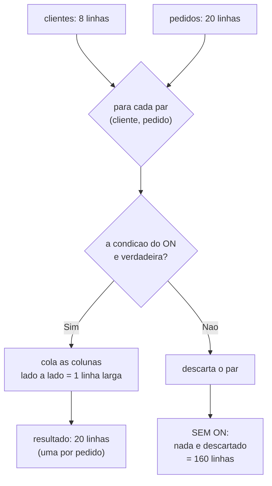

# 03.07 — `JOIN` — parte 1: `INNER`

> **Módulo 03 — SQL** · Nível: N2 · Tempo estimado: 3h00 · Código: `codigo/cap07/`

## 1. Objetivo

- **Escrever** junções entre duas e três tabelas com `INNER JOIN ... ON`.
- **Explicar** o que o `ON` compara e por que ele não é um filtro de linhas comum.
- **Prever** o número de linhas do resultado — e reconhecer o produto cartesiano acidental.
- **Aplicar** aliases de tabela para consultas legíveis, sem ambiguidade de coluna.

Ao final, as quatro tabelas deixam de ser quatro planilhas: você combina qualquer uma com qualquer outra e sabe, **antes de rodar**, quantas linhas vão sair.

---

## 2. Pré-requisitos

- [03.02 — Tabelas, linhas e chaves](02-tabelas-linhas-e-chaves.md) — **a dívida deste capítulo**: as chaves estrangeiras foram declaradas e você ainda não as **usou** para nada.
- [03.06 — `GROUP BY` e `HAVING`](06-group-by-e-having.md) — o `JOIN` apareceu três vezes com a instrução "leia como combine A com B"; aqui ele se abre.

**Autoteste:** (1) Onde mora a chave estrangeira numa relação um-para-muitos? (2) Por que `pedidos` guarda `cliente_id` e não o nome? (3) Como você descobriria o nome do cliente do pedido 7, com o que sabe até agora? A resposta da (3) hoje é "duas consultas" — este capítulo faz virar uma.

---

## 3. Motivação

Você modelou bem, e agora paga o preço: **a informação está espalhada**.

O pedido 7 sabe que pertence ao cliente 2. Não sabe que o cliente 2 se chama Ana Souza — de propósito, porque guardar o nome ali seria a duplicação que o 03.01 combateu. O item de pedido sabe o `produto_id` 3, não que ele é o "Teclado Mecanico K2". Cada tabela guarda uma coisa só, e nenhuma pergunta interessante cabe numa tabela só.

*"Quais produtos a Fernanda comprou?"* atravessa **quatro** tabelas: `clientes` → `pedidos` → `itens_pedido` → `produtos`.

Sem `JOIN`, o caminho seria consultar uma, anotar os identificadores, consultar a seguinte com aqueles identificadores, e assim por diante — quatro consultas e trabalho manual no meio. É exatamente o que o CSV do 03.01 obrigava a fazer, e o motivo pelo qual "cruzar duas fontes" era um dos quatro problemas.

O `JOIN` é a operação que dá nome ao modelo **relacional**. Ela é o que transforma tabelas separadas num sistema — e sem ela o banco seria um conjunto de planilhas com regras.

Mas ela traz um perigo específico, e é ele que o capítulo persegue: **o `JOIN` multiplica linhas**. Você já viu o efeito no 03.05 (28 linhas para 17 pedidos) sem entender a causa. E na versão extrema, uma condição de junção errada transforma mil linhas por mil em **um milhão** — o produto cartesiano, que trava consultas e derruba sistemas.

---

## 4. Modelo mental

> 🧠 **Modelo mental**
> O `JOIN` **cola linhas lado a lado**. Ele percorre os pares possíveis entre as duas tabelas e mantém apenas aqueles em que a condição do `ON` é verdadeira; cada par aprovado vira **uma linha larga**, com as colunas das duas. Daí a regra que prevê tudo: se cada linha da esquerda casa com **uma** da direita, o resultado tem o mesmo número de linhas; se casa com **três**, a linha da esquerda aparece **três vezes**. O `JOIN` não filtra nem resume — ele **combina**, e combinar pode aumentar a contagem.

**Exercício de previsão.** A Aurora tem 8 clientes e 20 pedidos, e todo pedido pertence a um cliente. Sem rodar, decida quantas linhas devolvem:

- (a) `FROM clientes, pedidos` (sem condição nenhuma)
- (b) `FROM clientes c JOIN pedidos p ON p.cliente_id = c.id`
- (c) a mesma junção, estendida até `itens_pedido` e `produtos`

*Resposta comentada:* (a) **160** — 8 × 20, todos os pares possíveis: o produto cartesiano. (b) **20** — uma linha por pedido, porque cada pedido casa com exatamente um cliente; note que o resultado tem o tamanho da tabela do lado "muitos", não do lado "um". (c) **31** — uma linha por **item**, porque cada pedido casa com um ou mais itens, e cada item com exatamente um produto. A regra que sai daí: **o resultado tem a granularidade da tabela mais fina da junção**. Se você respondeu 8 em (b), estava pensando que a junção "enriquece o cliente"; ela não enriquece ninguém — ela combina, e o lado que se repete é o que tem menos linhas.

---

## 5. Analogia

Pense em **duas listas de papel sobre a mesa**: uma com os sócios do clube (número e nome), outra com as reservas da quadra (número da reserva, número do sócio, horário).

O `JOIN` é você pegar cada reserva e, com o dedo, procurar na lista de sócios o número correspondente — copiando o nome ao lado. O resultado é uma **terceira lista**, mais larga, com uma linha por reserva e o nome do sócio junto.

Duas coisas ficam evidentes nesse gesto. Primeira: um sócio com cinco reservas aparece **cinco vezes** na lista final — não é erro, é o que a combinação faz. Segunda: se você esquecer de conferir o número e parear tudo com tudo, obtém uma lista com sócios × reservas linhas, quase toda ela absurda. É o produto cartesiano, e o `ON` é justamente a instrução de conferir o número.

**Onde a analogia quebra:** o dedo percorre a lista inteira a cada busca; o banco usa índices e não percorre nada, o que muda o custo em ordens de grandeza (seção 13). E há um detalhe que a analogia esconde: as reservas de sócios que **não existem mais** somem da lista final sem aviso nenhum — comportamento que parece razoável aqui e que é a principal armadilha do `INNER JOIN`, tratada no 03.08.

---

## 6. Teoria

### A forma

```sql
SELECT c.nome, p.id AS pedido, p.data
FROM clientes c
JOIN pedidos p ON p.cliente_id = c.id
ORDER BY p.id;
```

```text
nome             | pedido | data
-----------------+--------+-----------
Fernanda Lima    |      1 | 2025-04-02
Fernanda Lima    |      2 | 2025-07-18
Ana Souza        |      3 | 2025-06-11
Beatriz Nogueira |      4 | 2025-07-05
Fernanda Lima    |      5 | 2025-09-23
```

Três partes: **qual tabela** (`JOIN pedidos`), **com que apelido** (`p`), e **por qual condição** (`ON p.cliente_id = c.id`).

`JOIN` sozinho significa `INNER JOIN` — a palavra `INNER` é opcional e quase nunca escrita.

Repare que a Fernanda aparece **três vezes** nas cinco primeiras linhas. Não é duplicação de dados: é a combinação funcionando. Cada linha é um **pedido**, e ela tem vários.

### O que o `ON` é (e o que não é)

O `ON` declara **como as tabelas se relacionam**. Ele quase sempre compara uma chave estrangeira com a chave primária correspondente — exatamente a ligação declarada no 03.02, agora usada.

```sql
ON p.cliente_id = c.id        -- a FK de pedidos com a PK de clientes
```

É tentador pensar nele como um `WHERE`, e num `INNER JOIN` o resultado até coincide. Mas são coisas diferentes, e a diferença fica visível no 03.08: o `ON` define **quais linhas se combinam**; o `WHERE` define **quais linhas do resultado sobrevivem**. Guardar essa distinção agora economiza confusão depois.

### Aliases: obrigatórios na prática

```sql
FROM clientes c
JOIN pedidos p ON p.cliente_id = c.id
```

O apelido de uma letra (`c`, `p`, `i`, `pr`) é convenção universal. Sem ele, a consulta fica verbosa; e com colunas de mesmo nome nas duas tabelas, **quebra**:

```sql
SELECT id FROM clientes c JOIN pedidos p ON p.cliente_id = c.id;
```

```text
Erro de SQL: ambiguous column name: id
```

As duas tabelas têm `id`. O banco recusa adivinhar — e a correção é qualificar:

```sql
SELECT c.id AS cliente_id, p.id AS pedido_id
FROM clientes c JOIN pedidos p ON p.cliente_id = c.id;
```

> ⚠️ **Atenção**
> **Qualifique toda coluna numa consulta com junção**, mesmo as que não são ambíguas hoje. O motivo é o mesmo do desempate do 03.04: a consulta funciona até alguém acrescentar uma coluna `nome` à outra tabela, e aí quebra — ou, pior, passa a ler a coluna errada. Escrever `c.nome` em vez de `nome` custa dois caracteres e elimina a classe inteira de problema.

### Encadeando três e quatro tabelas

```sql
SELECT c.nome, p.id AS pedido, pr.nome AS produto, i.quantidade
FROM clientes c
JOIN pedidos p       ON p.cliente_id = c.id
JOIN itens_pedido i  ON i.pedido_id  = p.id
JOIN produtos pr     ON pr.id        = i.produto_id
ORDER BY p.id, pr.nome;
```

```text
nome          | pedido | produto               | quantidade
--------------+--------+-----------------------+-----------
Fernanda Lima |      1 | Cabo HDMI 2m          |          2
Fernanda Lima |      1 | Fone Bluetooth XZ-9   |          1
Fernanda Lima |      2 | Teclado Mecanico K2   |          1
Ana Souza     |      3 | Mouse Sem Fio         |          2
Ana Souza     |      3 | Suporte para Notebook |          1
```

Cada `JOIN` acrescenta uma tabela e sua condição. Leia de cima para baixo como um caminho: *"clientes, com seus pedidos, com seus itens, com os produtos desses itens"*.

### Prever o número de linhas

Esta é a habilidade central do capítulo:

| Junção | Linhas | Por quê |
|---|---|---|
| `clientes, pedidos` (sem `ON`) | **160** | 8 × 20 — todos os pares |
| `clientes JOIN pedidos` | **20** | uma por pedido |
| `+ itens_pedido` | **31** | uma por item |
| `+ produtos` | **31** | cada item tem **um** produto — não multiplica |

A regra: **o resultado tem a granularidade da tabela mais fina**. Juntar `produtos` no final não aumentou nada, porque a relação item→produto é "um para um" nessa direção.

E a consequência que já apareceu no 03.05: numa consulta que junta pedidos com itens, `COUNT(*)` conta **itens**. Para contar pedidos, `COUNT(DISTINCT p.id)`.

### O produto cartesiano

```sql
SELECT COUNT(*) FROM clientes, pedidos;              -- 160
SELECT COUNT(*) FROM clientes c JOIN pedidos p ON 1=1;  -- 160, disfarçado
```

Escrever tabelas separadas por vírgula, sem condição, produz **todos os pares possíveis**. Com 8 e 20 linhas, são 160 — inofensivo. Com duas tabelas de um milhão, são **um trilhão** de linhas, e a consulta não termina.

> ⚠️ **Atenção**
> O produto cartesiano acidental quase nunca é escrito com vírgula de propósito: ele aparece quando alguém **esquece uma condição** ao juntar três tabelas, ou escreve `ON` com uma comparação que é sempre verdadeira. O sintoma é característico: a consulta que rodava em milissegundos passa a não terminar, e a contagem de linhas fica absurdamente alta. Diagnóstico rápido: conte quantos `JOIN` há e quantas condições `ON` — devem ser **iguais**. Faltando uma, achou o problema.

📌 **Dialeto:** a forma antiga `FROM a, b WHERE a.id = b.a_id` funciona em todos os bancos e é equivalente ao `INNER JOIN`. Prefira o `JOIN ... ON`: ele separa a condição de **ligação** da condição de **filtro**, o que torna a consulta legível e evita justamente o cartesiano por esquecimento. Em bancos com sintaxe antiga, uma condição faltante no `WHERE` é invisível; com `JOIN`, um `ON` faltante é erro de sintaxe.

### `USING`, o atalho

Quando as colunas têm o **mesmo nome** nas duas tabelas:

```sql
FROM pedidos p JOIN itens_pedido i USING (pedido_id)   -- se a coluna se chamasse igual
```

No laboratório isso não se aplica (a PK é `id` e a FK é `pedido_id`), e é assim na maioria dos esquemas com chave artificial. Vale conhecer, e o `ON` continua sendo a forma geral.

---

## 7. Funcionamento interno

Por dentro, na medida N2: o banco tem três estratégias de junção e o otimizador escolhe conforme o tamanho das tabelas e os índices disponíveis. **Laço aninhado** — para cada linha da esquerda, procurar as correspondentes na direita; é o gesto do dedo da analogia, e fica barato quando existe índice na coluna do `ON` (a busca vira uma consulta ao índice em vez de uma varredura). **Junção por dispersão** — constrói uma tabela de dispersão com a menor das duas e percorre a maior uma vez; é a escolha típica quando não há índice e as tabelas cabem na memória. **Junção por ordenação** — ordena as duas pelas colunas do `ON` e percorre em paralelo; útil quando os dados já vêm ordenados por índice. Daí a consequência prática mais importante do capítulo: **indexar a coluna de chave estrangeira** (a recomendação que ficou pendente no 03.02) é o que permite ao otimizador usar a primeira estratégia com custo baixo, e é a otimização que mais frequentemente transforma uma junção lenta numa rápida. O comando `EXPLAIN QUERY PLAN` (03.14) mostra qual estratégia foi escolhida.

---

## 8. Visualização do fluxo

O que a junção faz com as linhas:



**Como ler:** o losango do meio é o `ON`, e ele é a **única** coisa que separa 20 linhas de 160. Repare que a operação não olha as tabelas como blocos: ela avalia **pares**, e o número de pares candidatos é o produto dos tamanhos. O `ON` é o que reduz esse produto a algo útil — e por isso a ausência dele não é "um filtro a menos", é a diferença entre uma consulta e um travamento. Note também que o resultado (20) tem o tamanho da tabela do lado **"muitos"**, não do lado "um".

---

## 9. Aplicação prática

**Passo 1 — Veja o cartesiano, com números pequenos:**

```bash
python codigo/sql.py "SELECT COUNT(*) AS linhas FROM clientes, pedidos"
```

```text
linhas
------
   160
```

8 × 20. Guarde o número: ele é o que **não** queremos.

**Passo 2 — A junção correta:**

```bash
python codigo/sql.py "SELECT COUNT(*) FROM clientes c JOIN pedidos p ON p.cliente_id = c.id"
```

```text
COUNT(*)
--------
      20
```

De 160 para 20. A condição do `ON` descartou 140 pares que não faziam sentido.

**Passo 3 — Os dados, não só a contagem:**

```bash
python codigo/sql.py "SELECT c.nome, p.id AS pedido, p.data FROM clientes c JOIN pedidos p ON p.cliente_id = c.id ORDER BY p.id LIMIT 5"
```

```text
nome             | pedido | data
-----------------+--------+-----------
Fernanda Lima    |      1 | 2025-04-02
Fernanda Lima    |      2 | 2025-07-18
Ana Souza        |      3 | 2025-06-11
Beatriz Nogueira |      4 | 2025-07-05
Fernanda Lima    |      5 | 2025-09-23
```

A Fernanda repetida é a junção fazendo o que deve.

**Passo 4 — A ambiguidade, e a correção:**

```bash
python codigo/sql.py "SELECT id FROM clientes c JOIN pedidos p ON p.cliente_id = c.id LIMIT 2"
```

```text
Erro de SQL: ambiguous column name: id
```

```bash
python codigo/sql.py "SELECT c.id AS cliente_id, p.id AS pedido_id FROM clientes c JOIN pedidos p ON p.cliente_id = c.id LIMIT 3"
```

```text
cliente_id | pedido_id
-----------+----------
         1 |         1
         1 |         2
         2 |         3
```

**Passo 5 — Quatro tabelas, uma pergunta:**

```bash
python codigo/sql.py codigo/cap07/juntando.sql
```

A consulta final responde *"quais produtos a Fernanda comprou?"* — atravessando `clientes`, `pedidos`, `itens_pedido` e `produtos`:

```text
produto               | quantidade | data
----------------------+------------+-----------
Cabo HDMI 2m          |          2 | 2025-04-02
Fone Bluetooth XZ-9   |          1 | 2025-04-02
Teclado Mecanico K2   |          1 | 2025-07-18
...
```

**Passo 6 — Confirme a granularidade:**

```bash
python codigo/sql.py "SELECT COUNT(*) FROM clientes c JOIN pedidos p ON p.cliente_id=c.id JOIN itens_pedido i ON i.pedido_id=p.id JOIN produtos pr ON pr.id=i.produto_id"
```

```text
COUNT(*)
--------
      31
```

31 — o número de **itens**, não de pedidos (20) nem de clientes (8). A tabela mais fina define o resultado.

> 🎯 **Checkpoint rápido**
> De cabeça: uma junção de `clientes` (8) com `pedidos` (20) devolve quantas linhas — e por quê? E como você detecta um produto cartesiano acidental olhando só o texto da consulta?

---

## 10. Código comentado

Arquivo completo em [`codigo/cap07/juntando.sql`](codigo/cap07/juntando.sql).

```sql
-- ------------------------------------------------------------
-- juntando.sql
-- Capítulo 03.07 — JOIN parte 1: INNER
-- O que este arquivo demonstra: o produto cartesiano, a junção
--   correta, a ambiguidade de coluna e o encadeamento de 4 tabelas
-- Como executar: python codigo/sql.py codigo/cap07/juntando.sql
-- ------------------------------------------------------------

-- [1] O PRODUTO CARTESIANO: todos os pares possíveis -> 8 x 20 = 160
--     Com tabelas grandes, isto trava a consulta.
SELECT COUNT(*) AS pares_possiveis FROM clientes, pedidos;

-- [2] A mesma coisa, disfarçada: um ON sempre verdadeiro
SELECT COUNT(*) AS tambem_cartesiano
FROM clientes c JOIN pedidos p ON 1 = 1;

-- [3] A junção CORRETA: o ON descarta 140 pares sem sentido -> 20
SELECT COUNT(*) AS linhas FROM clientes c
JOIN pedidos p ON p.cliente_id = c.id;

-- [4] Os dados: a Fernanda aparece 5 vezes (tem 5 pedidos).
--     Não é duplicação — é uma linha por PEDIDO.
SELECT c.nome, p.id AS pedido, p.data
FROM clientes c
JOIN pedidos p ON p.cliente_id = c.id
ORDER BY p.id
LIMIT 5;

-- [5] Qualificar é obrigatório: 'id' existe nas duas tabelas
--     Sem o apelido: "ambiguous column name: id"
SELECT c.id AS cliente_id, p.id AS pedido_id, c.nome
FROM clientes c
JOIN pedidos p ON p.cliente_id = c.id
LIMIT 3;

-- [6] QUATRO tabelas: leia como um caminho —
--     clientes, com seus pedidos, com seus itens, com os produtos
SELECT c.nome AS cliente, p.id AS pedido,
       pr.nome AS produto, i.quantidade
FROM clientes c
JOIN pedidos p      ON p.cliente_id = c.id
JOIN itens_pedido i ON i.pedido_id  = p.id
JOIN produtos pr    ON pr.id        = i.produto_id
ORDER BY p.id, pr.nome
LIMIT 5;

-- [7] A GRANULARIDADE: 31 = número de ITENS, não de pedidos (20)
--     A tabela mais fina da junção define o resultado.
SELECT COUNT(*) AS linhas_do_resultado
FROM clientes c
JOIN pedidos p      ON p.cliente_id = c.id
JOIN itens_pedido i ON i.pedido_id  = p.id
JOIN produtos pr    ON pr.id        = i.produto_id;

-- [8] A pergunta que atravessa as quatro tabelas:
--     "quais produtos a Fernanda comprou?"
SELECT pr.nome AS produto, i.quantidade, p.data
FROM clientes c
JOIN pedidos p      ON p.cliente_id = c.id
JOIN itens_pedido i ON i.pedido_id  = p.id
JOIN produtos pr    ON pr.id        = i.produto_id
WHERE c.nome = 'Fernanda Lima'
ORDER BY p.data, pr.nome;
```

Os comandos [1] e [3] são o núcleo: **160 contra 20**, e a única diferença é a condição do `ON`. O [2] mostra que o cartesiano nem sempre se anuncia com vírgula — um `ON` mal escrito produz o mesmo efeito com aparência de consulta correta.

O comando [7] é a habilidade que este capítulo quer instalar: saber **antes de rodar** que o resultado terá 31 linhas. Quem prevê a granularidade não cai na armadilha do 03.05 (contar itens achando que conta pedidos), e vai reconhecer o problema muito mais grave que aparece quando se juntam **duas tabelas filhas** ao mesmo pai — cada uma multiplica pela outra, e as somas dobram. Esse caso o 03.10 resolve com CTEs.

---

## 11. Erros comuns

### Erro 1 — Produto cartesiano por `ON` esquecido

**Sintoma:** a consulta não termina, ou devolve um número de linhas absurdo. Com três tabelas grandes, o processo consome toda a memória.
**Causa:** juntar N tabelas com menos de N−1 condições de ligação — normalmente por esquecimento ao acrescentar a terceira.
**Correção:** conte os `JOIN` e conte os `ON`. Devem ser iguais. E use sempre `JOIN ... ON` em vez da vírgula: com a sintaxe moderna, um `ON` faltante é **erro de sintaxe**; com vírgula, é uma consulta válida que trava o servidor.

### Erro 2 — Esquecer que a junção multiplica

**Sintoma:** `COUNT(*)` devolve 31 quando você esperava 20; ou uma soma vem dobrada.
**Causa:** a junção produz uma linha por **item**, e a agregação conta linhas do resultado — não da tabela original.
**Correção:** decida a granularidade de cada agregação antes de escrevê-la. `COUNT(DISTINCT p.id)` para pedidos, `COUNT(*)` para itens. E o caso grave: juntando **duas** tabelas filhas ao mesmo pai (itens e, digamos, pagamentos), cada uma multiplica pela outra e **as duas somas ficam erradas** — a solução é agregar cada uma separadamente, com CTEs (03.10).

### Erro 3 — Coluna não qualificada

**Sintoma:**

```text
Erro de SQL: ambiguous column name: id
```

**Causa:** a coluna existe em mais de uma tabela da junção e o banco não adivinha qual.
**Correção:** qualifique com o apelido — `c.id`, `p.id`. E o hábito que evita a versão silenciosa do problema: qualifique **todas** as colunas, não só as ambíguas. A consulta que hoje funciona com `nome` (porque só uma tabela tem essa coluna) quebra quando alguém acrescentar `nome` à outra — e, em bancos permissivos, pode passar a ler a coluna errada sem erro nenhum.

---

## 12. Boas práticas

✅ **Apelido curto em toda tabela** — `c`, `p`, `i`, `pr`. Convenção universal, legível.

✅ **Qualifique todas as colunas** — `c.nome`, não `nome`, mesmo sem ambiguidade hoje.

✅ **Um `ON` para cada `JOIN`** — a verificação mecânica contra o cartesiano.

✅ **`JOIN ... ON` em vez de vírgula** — separa ligação de filtro, e transforma esquecimento em erro de sintaxe.

✅ **Preveja a granularidade antes de agregar** — qual tabela define o número de linhas do resultado?

❌ **Evite `SELECT *` em junções** — traz colunas duplicadas (dois `id`, dois `nome`) e vira ilegível.

❌ **Evite juntar duas tabelas filhas do mesmo pai numa consulta só** — elas se multiplicam; agregue separadamente (03.10).

---

## 13. Performance

Nesta escala, irrelevante — e este é o capítulo com o maior potencial de desastre quando a escala muda. O produto cartesiano é a única operação do módulo capaz de derrubar um servidor: duas tabelas de um milhão de linhas produzem um trilhão de pares, e nenhum banco sobrevive a isso. Fora esse extremo, o custo de uma junção depende quase inteiramente de **haver índice na coluna do `ON`**. Com índice, o banco usa laço aninhado com busca indexada e o custo cresce de forma suave; sem índice, ele precisa construir uma tabela de dispersão ou ordenar as duas tabelas — viável em volumes médios, proibitivo em grandes. Como a coluna do `ON` é quase sempre uma chave estrangeira, e chaves estrangeiras **não** ganham índice automático (03.02), essa é a otimização de maior retorno em bancos reais: uma junção que leva minutos costuma ficar instantânea com um `CREATE INDEX` na FK. O 03.14 mede isso. A lição transferível: em SQL, o desempenho raramente depende de escrever a consulta de forma mais esperta — depende de o banco ter as **estruturas** que permitem executá-la bem.

---

## 14. Mercado

> 🏢 **Mercado**
> `JOIN` é o assunto mais cobrado em teste prático de SQL, sem concorrente. Praticamente todo exercício de entrevista pede a combinação de duas ou três tabelas com agregação — e o que se avalia não é a sintaxe, é se a pessoa **prevê o número de linhas**. O erro que mais aparece em código de produção é a soma inflada por junção com duas tabelas filhas, e ele é traiçoeiro porque só se manifesta quando algum pai tem mais de um filho nos dois lados: com dados de teste pequenos, tudo bate. Em revisão de código, a verificação padrão é contar `JOIN` e `ON`, e conferir se cada agregação está na granularidade certa.
>
> **Mini-cenário:** a consulta do passo 5 — "quais produtos a Fernanda comprou" — é o extrato de compras que qualquer loja mostra ao cliente. No módulo 06 ela vira um endpoint da API do Atlas; no 07, a resposta de uma requisição HTTP. A junção de quatro tabelas que você escreveu hoje é literalmente a consulta que alimenta essa tela.

---

## 15. Entrevistas

**P1. "O que é um `INNER JOIN`?"**
*Resposta esperada:* combina linhas de duas tabelas mantendo apenas os pares em que a condição do `ON` é verdadeira; cada par aprovado vira uma linha com as colunas das duas. Complemento que separa: mencionar que **linhas sem correspondência desaparecem dos dois lados** — é o que distingue o `INNER` dos demais, e o gancho para o `LEFT JOIN`.

**P2. "O que é um produto cartesiano e como acontece sem querer?"**
*Resposta esperada:* todos os pares possíveis entre duas tabelas — N × M linhas. Acontece por `ON` esquecido ao acrescentar uma tabela, ou por condição sempre verdadeira. Sintoma: consulta que não termina e contagem absurda. Diagnóstico: número de `JOIN` deve igualar o número de `ON`. Citar que a sintaxe com vírgula esconde o problema e o `JOIN ... ON` o transforma em erro de sintaxe demonstra prática.

**P3. "Juntando `pedidos` com `itens_pedido`, quantas linhas o resultado tem?"**
*Resposta esperada:* uma por **item**, não por pedido — a granularidade é da tabela mais fina. Consequência direta: `COUNT(*)` conta itens; para contar pedidos, `COUNT(DISTINCT p.id)`. É a mesma armadilha do 03.05, agora com a causa explicada.

**Pegadinha clássica: "Uma consulta junta `pedidos` com `itens_pedido` e com `pagamentos` para mostrar, por pedido, o total dos itens e o total pago. Os dois valores saíram maiores que o esperado. Por quê?"**
Ela é a evolução natural da pegadinha do 03.05 e derruba quem entendeu a multiplicação de linhas só no caso simples. O mecanismo: um pedido com **3 itens** e **2 pagamentos** produz **6 linhas** na junção — cada item pareado com cada pagamento. A soma dos itens passa a contar cada item **duas vezes** (uma por pagamento) e a soma dos pagamentos conta cada um **três vezes** (uma por item). Os dois totais ficam inflados, por fatores diferentes, e nenhum deles é a soma que se queria. E o detalhe que torna o bug perverso: se **todo** pedido tiver exatamente um pagamento, o resultado fica correto — então o defeito só aparece quando um pedido é parcelado, possivelmente meses depois da consulta entrar em produção. A solução correta é **agregar cada filho separadamente** antes de juntar, o que se escreve com duas CTEs (03.10) ou duas subconsultas (03.09) — nunca com as duas tabelas na mesma junção. Fechar apontando a regra geral — *duas tabelas filhas do mesmo pai não convivem numa junção quando há agregação* — mostra que você reconhece o padrão, e não apenas o caso.

---

## 16. Exercícios guiados

Enunciados completos em [`exercicios/cap07.md`](exercicios/cap07.md); gabaritos em [`exercicios/gabaritos/cap07.md`](exercicios/gabaritos/cap07.md).

### Aquecimento

- **A1** `[~10 min · quantas linhas?]` — 6 junções: preveja o número de linhas.
- **A2** `[~10 min · escreva o `ON`]` — 6 pares de tabelas: qual a condição de ligação?
- **A3** `[~10 min · ache o cartesiano]` — 5 consultas: quais produzem produto cartesiano?
- **A4** `[~10 min · traduza a pergunta]` — 6 perguntas que atravessam tabelas.

### Aplicação

- **AP1** `[~25 min · o extrato do cliente]` — Construa o extrato de compras de um cliente, com quatro tabelas.
- **AP2** `[~20 min · prevendo a granularidade]` — Cinco junções: preveja, execute e explique as divergências.
- **AP3** `[~25 min · a soma dobrada]` — Reproduza o bug da multiplicação com duas tabelas filhas.

---

## 17. Desafios

- **D1** `[~50 min · o relatório de vendas completo]` — **A consulta que atravessa o modelo.** Produza um relatório de vendas com uma linha por **item vendido**, contendo: nome do cliente, cidade, data do pedido, status, nome do produto, categoria, quantidade, preço unitário e valor total da linha — tudo com apelidos legíveis. Depois: (a) preveja o número de linhas **antes** de rodar e confira; (b) filtre para pedidos concluídos e explique se o filtro vai no `ON` ou no `WHERE` (e se faz diferença num `INNER JOIN`); (c) acrescente uma agregação que conte **pedidos** e outra que conte **itens**, na mesma consulta, e explique por que precisam de tratamentos diferentes; (d) escreva deliberadamente a versão com produto cartesiano e compare o número de linhas; (e) identifique qual índice tornaria essa consulta mais rápida em escala, e justifique. Fecho: 5 linhas sobre por que "prever o número de linhas" é a habilidade central deste capítulo.

<details><summary>💡 Dica 1 (conceito)</summary>
Para o item (a): a tabela mais fina da junção define o resultado. Qual é ela, e quantas linhas tem?
</details>
<details><summary>💡 Dica 2 (estratégia)</summary>
No item (b), num `INNER JOIN` o filtro no `ON` e no `WHERE` dão o mesmo resultado — e isso **muda** no 03.08. Registre a observação; ela vai ser cobrada.
</details>
<details><summary>💡 Dica 3 (esqueleto)</summary>
Consulta base com 4 JOINs e apelidos → previsão e conferência → filtro de status → as duas contagens (`COUNT(*)` e `COUNT(DISTINCT)`) → a versão cartesiana → o índice na FK → reflexão.
</details>

---

## 18. Mini projeto

**O extrato de compras** `[~50 min]`

Requisitos numerados:

1. Escreva a consulta que produz o **extrato completo de um cliente**: todos os produtos que ele comprou, com data, quantidade, preço unitário e valor da linha.
2. **Antes de rodar**, escreva quantas linhas você espera para a Fernanda e para a Ana. Confira depois.
3. Acrescente uma linha de **total** — o valor gasto pelo cliente — usando uma segunda consulta, e explique por que ela não cabe na mesma consulta do extrato.
4. Adapte para receber o cliente por **nome** e por **`id`**, e explique qual das duas formas é preferível num sistema real.
5. Escreva a mesma pergunta para **todos** os clientes, agrupada, e compare o número de linhas com o extrato individual.

**Critério de "está bom":** o passo 2 é o critério. Prever a contagem antes de rodar é a habilidade que este capítulo existe para instalar — e errar a previsão é mais útil que acertar, desde que você descubra **por quê**. O passo 3 tem uma resposta que muita gente erra: o total não cabe na mesma consulta porque ele está numa **granularidade diferente** (um número por cliente, contra uma linha por item), e misturar granularidades é exatamente o que produz os bugs de soma dobrada. O 03.10 mostra como reunir as duas numa consulta só, com CTEs.

---

## 19. Revisão

**Resumo do capítulo:**

- `JOIN` **cola linhas lado a lado**; o `ON` define quais pares se combinam.
- `JOIN` = `INNER JOIN`; linhas **sem correspondência desaparecem** dos dois lados.
- **Sem `ON`** (ou com condição sempre verdadeira): **produto cartesiano**, N × M linhas.
- Verificação mecânica: número de `JOIN` = número de `ON`.
- **A granularidade do resultado é a da tabela mais fina** — clientes(8) + pedidos(20) = 20; + itens(31) = 31.
- `COUNT(*)` conta linhas **do resultado da junção**; para contar pedidos, `COUNT(DISTINCT p.id)`.
- **Qualifique todas as colunas** com apelido; `id` em duas tabelas gera `ambiguous column name`.
- Duas tabelas **filhas do mesmo pai** numa junção multiplicam entre si e inflam as somas (03.10).
- Índice na coluna de FK é a otimização de maior retorno em junções (03.14).

**Flashcards novos** (adicionados a [`revisao/flashcards.md`](revisao/flashcards.md)):

| ID | Frente | Verso |
|---|---|---|
| 03.07-F1 | O que é um produto cartesiano e como ele acontece sem querer? | Todos os pares possíveis (N × M). Acontece por `ON` esquecido ou condição sempre verdadeira. Verificação: nº de `JOIN` = nº de `ON`. |
| 03.07-F2 | Explique com suas palavras: por que um cliente aparece várias vezes numa junção? | (Elaboração) A junção **cola pares**; um cliente com 5 pedidos forma 5 pares aprovados, logo 5 linhas. Não é duplicação de dado — cada linha é um pedido. |
| 03.07-F3 | Preveja: `clientes`(8) `JOIN` `pedidos`(20) `JOIN` `itens_pedido`(31). Quantas linhas? | (Previsão) **31** — a granularidade é da tabela **mais fina**. Juntar `produtos` depois não muda, porque cada item tem um produto só. |
| 03.07-F4 | Numa consulta com junção, como contar pedidos em vez de itens? | (Decisão) `COUNT(DISTINCT p.id)`. O `COUNT(*)` conta linhas do **resultado da junção**, que estão na granularidade do item. |
| 03.07-F5 | Por que qualificar colunas com apelido mesmo sem ambiguidade? | Porque a consulta quebra (ou lê a coluna errada) quando alguém acrescentar uma coluna de mesmo nome à outra tabela. Custa 2 caracteres. |

**Agendamento:** registre no `PROGRESSO.md` e marque D+1, D+7, D+30, D+90 na [`Revisoes/agenda.md`](../Revisoes/agenda.md).

---

## 20. Checklist

Perguntas de domínio — teste do sim:

- [ ] Sei prever *o número de linhas de uma junção antes de executá-la*?
- [ ] Sei explicar *o que o `ON` faz e por que sua ausência produz o cartesiano*?
- [ ] Sei justificar *quando usar `COUNT(*)` e quando usar `COUNT(DISTINCT)`*?
- [ ] Sei reconhecer *o problema de duas tabelas filhas do mesmo pai numa junção*?
- [ ] Sei responder *à pegadinha dos dois totais inflados, explicando os fatores diferentes*?

Itens práticos:

- [ ] Rodei `juntando.sql` e comparei 160 com 20.
- [ ] Provoquei o `ambiguous column name` e corrigi qualificando.
- [ ] Encadeei quatro tabelas e confirmei as 31 linhas.
- [ ] Completei "O extrato de compras" — com a previsão escrita antes.
- [ ] Registrei a sessão e agendei as 4 revisões.

---

## 21. Próximo capítulo

A junção que você aprendeu tem uma característica que parece razoável e esconde uma armadilha: **linhas sem correspondência desaparecem**. O Rafael, que nunca comprou, não aparece em nenhuma consulta que junte `clientes` com `pedidos` — e por isso um relatório de "clientes e seus pedidos" mostra sete clientes numa base de oito, sem avisar. O Mousepad, que nunca foi vendido, some do relatório de produtos por faturamento. Ficou deliberadamente em aberto a família de junções que **preserva** o que não tem par: `LEFT`, `RIGHT` e `FULL`. E com ela vem a técnica que responde perguntas pela **ausência** — "quem nunca comprou", "quais produtos nunca venderam" —, além do erro que transforma um `LEFT JOIN` de volta em `INNER` sem que ninguém perceba.

→ [03.08 — `JOIN` — parte 2: `LEFT`/`RIGHT`/`FULL`](08-join-parte-2-left-right-full.md)

---

*Gerado sob spec 3.0.0*
